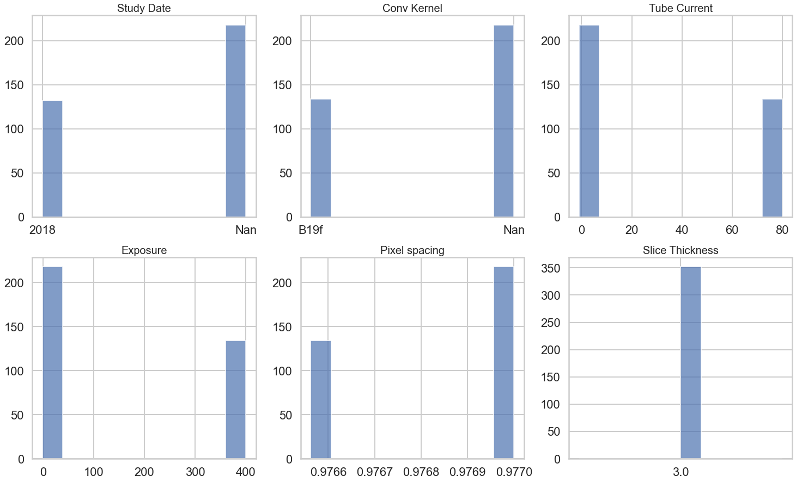
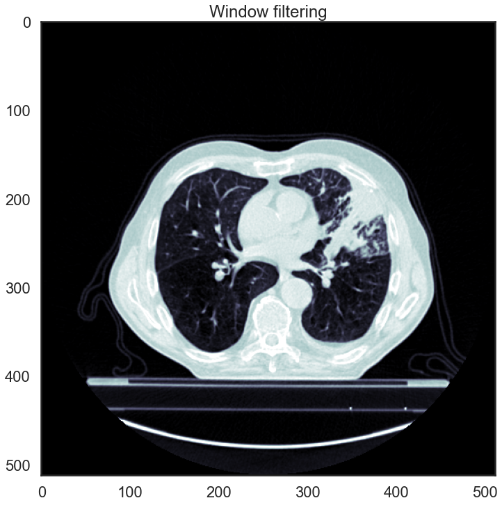
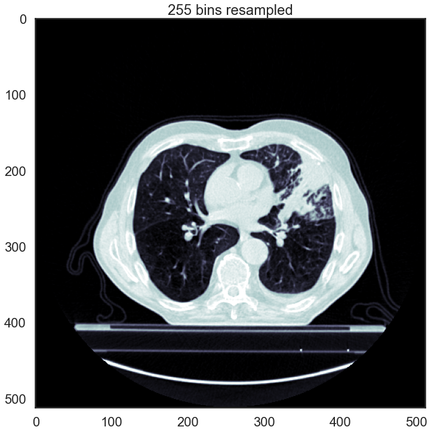
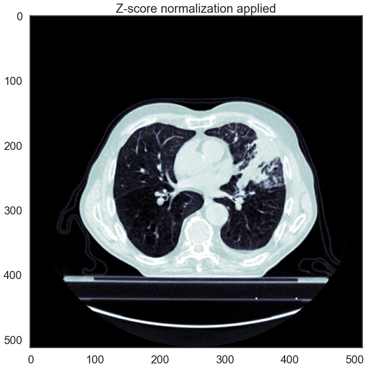
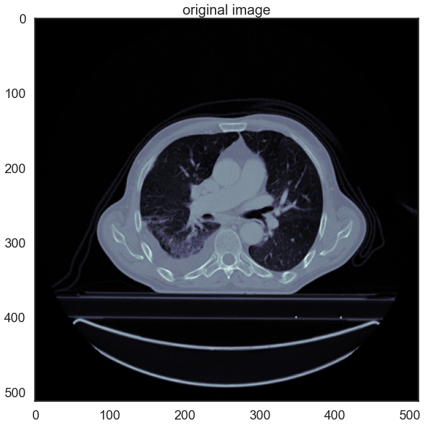
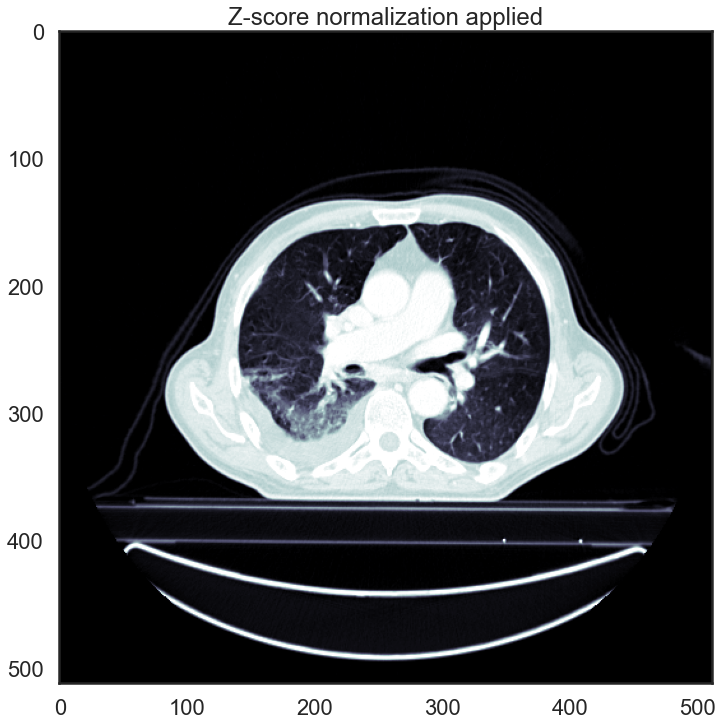
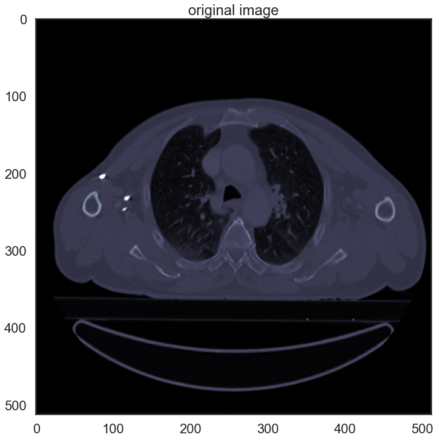
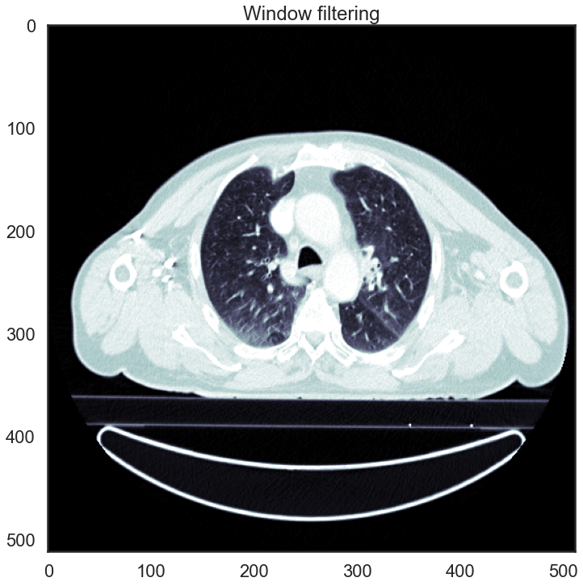
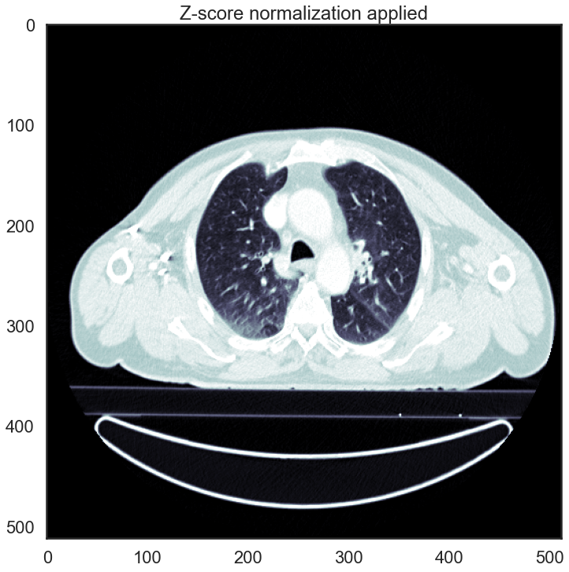

# Imaging module tutorial

This tutorial shows how to explore the imaging parameters and perform a basic image quality check, convert DICOM into NRRD, check ROI segmentations, pre-process the images, and extract radiomic features.

Importing modules:


```python
import os,sys
#from pmtool.ToolBox import ToolBox
import pandas as pd
from pandas import DataFrame
import matplotlib.pyplot as plt
import numpy as np
#import seaborn as sb

%matplotlib inline
```

## Data download

The Lung1 dataset (Aerts et al., 2014) contains pretreatment scans of 422 non-small cell lung cancer (NSCLC) patients, as well as manually deliniated gross tumor volume (GTV) for each patient, and clinical outcomes. More information you can find on the dataset web page and in the corresponding paper https://doi.org/10.1038/ncomms5006. For consistency, we recommend you to download the data to the '../data/dcms' folder of this project. You can find the data and its description (and the original paper) following the link below:
https://wiki.cancerimagingarchive.net/display/Public/NSCLC-Radiomics

To download the dataset, you might need to install the download manager: https://wiki.cancerimagingarchive.net/display/NBIA/Downloading+TCIA+Images#DownloadingTCIAImages-DownloadingtheNBIADataRetriever

Finally, you will have the '../data/dcms' folder with CT images (it will require 33 GB of disc space!).  

Alternatively, TCIA provides a Python interface. To know more, see these examples https://github.com/kirbyju/TCIA_Notebooks/blob/main/TCIA_REST_API_Downloads.ipynb and follow the instructions below:


```python
# installation - comment these lines if you have TCIA client installed!

!pip install --upgrade -q tcia-utils --user
!pip install --upgrade -q pandas --user

# setup

from tcia_utils import nbia
import requests
```

We are interested in getting "NSCLC-Radiomics" collection:


```python
ds_metadata = nbia.getSeries(collection = "NSCLC-Radiomics")
# having a look at teh metadata
print(ds_metadata)

# downloading data for 3 patients, delete 'number = 3' to get all teh data
df = nbia.downloadSeries(ds_metadata, path ='../data/dcms/', format = "csv", number = 3)
```

    2023-04-18 14:09:35,038:INFO:Calling... https://services.cancerimagingarchive.net/nbia-api/services/v1/getSeries with parameters {'Collection': 'NSCLC-Radiomics'}
    2023-04-18 14:09:41,649:INFO:Downloading 1 out of 1265 Series Instance UIDs (scans).
    

    [{'SeriesInstanceUID': '1.3.6.1.4.1.32722.99.99.320898527671900265039224224949289088459', 'StudyInstanceUID': '1.3.6.1.4.1.32722.99.99.292318530655723826015592519561359458189', 'Modality': 'CT', 'ProtocolName': 'MAASTRO_PETCT_WholeBodyC', 'SeriesDate': '2006-04-13 00:00:00.0', 'BodyPartExamined': 'LUNG', 'SeriesNumber': 0, 'Collection': 'NSCLC-Radiomics', 'PatientID': 'LUNG1-048', 'Manufacturer': 'SIEMENS', 'ManufacturerModelName': 'Sensation 16', 'SoftwareVersions': 'VA70C', 'ImageCount': 135, 'TimeStamp': '2020-10-07 14:01:08.0', 'LicenseName': 'Creative Commons Attribution-NonCommercial 3.0 Unported License', 'LicenseURI': 'https://creativecommons.org/licenses/by-nc/3.0/', 'CollectionURI': 'https://doi.org/10.7937/K9/TCIA.2015.PF0M9REI', 'FileSize': 71041260}, {'SeriesInstanceUID': '1.3.6.1.4.1.32722.99.99.71621653125201582124240564508842688465', 'StudyInstanceUID': '1.3.6.1.4.1.32722.99.99.100855571832074152951605738408734618579', 'Modality': 'CT', 'ProtocolName': 'MAASTRO_PETCT_WholeBodyC', 'SeriesDate': '2006-01-06 00:00:00.0', 'BodyPartExamined': 'LUNG', 'SeriesNumber': 0, 'Collection': 'NSCLC-Radiomics', 'PatientID': 'LUNG1-065', 'Manufacturer': 'SIEMENS', 'ManufacturerModelName': 'Sensation 16', 'SoftwareVersions': 'VA70C', 'ImageCount': 135, 'TimeStamp': '2020-10-07 14:00:50.0', 'LicenseName': 'Creative Commons Attribution-NonCommercial 3.0 Unported License', 'LicenseURI': 'https://creativecommons.org/licenses/by-nc/3.0/', 'CollectionURI': 'https://doi.org/10.7937/K9/TCIA.2015.PF0M9REI', 'FileSize': 71040974}, {'SeriesInstanceUID': '1.3.6.1.4.1.32722.99.99.138522260934437218114778023563031054616', 'StudyInstanceUID': '1.3.6.1.4.1.32722.99.99.28825975190456185938017837904138557192', 'Modality': 'CT', 'ProtocolName': 'MAASTRO_PETCT_WholeBodyC', 'SeriesDate': '2005-10-31 00:00:00.0', 'BodyPartExamined': 'LUNG', 'SeriesNumber': 0, 'Collection': 'NSCLC-Radiomics', 'PatientID': 'LUNG1-067', 'Manufacturer': 'SIEMENS', 'ManufacturerModelName': 'Sensation 16', 'SoftwareVersions': 'VA70C', 'ImageCount': 176, 'TimeStamp': '2020-10-07 14:01:28.0', 'LicenseName': 'Creative Commons Attribution-NonCommercial 3.0 Unported License', 'LicenseURI': 'https://creativecommons.org/licenses/by-nc/3.0/', 'CollectionURI': 'https://doi.org/10.7937/K9/TCIA.2015.PF0M9REI', 'FileSize': 92616766}, {'SeriesInstanceUID': '1.3.6.1.4.1.32722.99.99.134645872977266948002680323417926540760', 'StudyInstanceUID': '1.3.6.1.4.1.32722.99.99.317339942450976650976837197851667935606', 'Modality': 'CT', 'ProtocolName': 'MAASTRO_PETCT_WholeBodyC', 'SeriesDate': '2006-02-04 00:00:00.0', 'BodyPartExamined': 'LUNG', 'SeriesNumber': 0, 'Collection': 'NSCLC-Radiomics', 'PatientID': 'LUNG1-071', 'Manufacturer': 'SIEMENS', 'ManufacturerModelName': 'Sensation 16', 'SoftwareVersions': 'VA70C', 'ImageCount': 135, 'TimeStamp': '2020-10-07 14:01:33.0', 'LicenseName': 'Creative Commons Attribution-NonCommercial 3.0 Unported License', 'LicenseURI': 'https://creativecommons.org/licenses/by-nc/3.0/', 'CollectionURI': 'https://doi.org/10.7937/K9/TCIA.2015.PF0M9REI', 'FileSize': 71041240}, {'SeriesInstanceUID': '1.3.6.1.4.1.32722.99.99.122579228305950125697741604889110154168', 'StudyInstanceUID': '1.3.6.1.4.1.32722.99.99.239287362785094903873779244680404401845', 'Modality': 'CT', 'ProtocolName': 'MAASTRO_PETCT_WholeBodyC', 'SeriesDate': '2006-01-29 00:00:00.0', 'BodyPartExamined': 'LUNG', 'SeriesNumber': 0, 'Collection': 'NSCLC-Radiomics', 'PatientID': 'LUNG1-073', 'Manufacturer': 'SIEMENS', 'ManufacturerModelName': 'Sensation 16', 'SoftwareVersions': 'VA70C', 'ImageCount': 176, 'TimeStamp': '2020-10-07 14:01:30.0', 'LicenseName': 'Creative Commons Attribution-NonCommercial 3.0 Unported License', 'LicenseURI': 'https://creativecommons.org/licenses/by-nc/3.0/', 'CollectionURI': 'https://doi.org/10.7937/K9/TCIA.2015.PF0M9REI', 'FileSize': 92616782}, {'SeriesInstanceUID': '1.3.6.1.4.1.32722.99.99.151892721628078086288828092641057509441', 'StudyInstanceUID': '1.3.6.1.4.1.32722.99.99.313501042388714391723237123325528601758', 'Modality': 'CT', 'ProtocolName': 'MAASTRO_PETCT_WholeBodyC', 'SeriesDate': '2006-02-03 00:00:00.0', 'BodyPartExamined': 'LUNG', 'SeriesNumber': 0, 'Collection': 'NSCLC-Radiomics', 'PatientID': 'LUNG1-075', 'Manufacturer': 'SIEMENS', 'ManufacturerModelName': 'Sensation 16', 'SoftwareVersions': 'VA70C', 'ImageCount': 176, 'TimeStamp': '2020-10-07 14:00:44.0', 'LicenseName': 'Creative Commons Attribution-NonCommercial 3.0 Unported License', 'LicenseURI': 'https://creativecommons.org/licenses/by-nc/3.0/', 'CollectionURI': 'https://doi.org/10.7937/K9/TCIA.2015.PF0M9REI', 'FileSize': 92615018}, {'SeriesInstanceUID': '1.3.6.1.4.1.32722.99.99.124921501772436036473334747095106857564', 'StudyInstanceUID': '1.3.6.1.4.1.32722.99.99.97553340392844969173756137592567539992', 'Modality': 'CT', 'ProtocolName': 'MAASTRO_PETCT_WholeBodyC', 'SeriesDate': '2005-12-22 00:00:00.0', 'BodyPartExamined': 'LUNG', 'SeriesNumber': 0, 'Collection': 'NSCLC-Radiomics', 'PatientID': 'LUNG1-079', 'Manufacturer': 'SIEMENS', 'ManufacturerModelName': 'Sensation 16', 'SoftwareVersions': 'VA70C', 'ImageCount': 135, 'TimeStamp': '2020-10-07 14:01:19.0', 'LicenseName': 'Creative Commons Attribution-NonCommercial 3.0 Unported License', 'LicenseURI': 'https://creativecommons.org/licenses/by-nc/3.0/', 'CollectionURI': 'https://doi.org/10.7937/K9/TCIA.2015.PF0M9REI', 'FileSize': 71040970}, {'SeriesInstanceUID': '1.3.6.1.4.1.32722.99.99.331857668923026632463450116440821077378', 'StudyInstanceUID': '1.3.6.1.4.1.32722.99.99.165984598763145101798157690702935033357', 'Modality': 'CT', 'ProtocolName': 'MAASTRO_PETCT_WholeBodyC', 'SeriesDate': '2006-02-22 00:00:00.0', 'BodyPartExamined': 'LUNG', 'SeriesNumber': 0, 'Collection': 'NSCLC-Radiomics', 'PatientID': 'LUNG1-082', 'Manufacturer': 'SIEMENS', 'ManufacturerModelName': 'Sensation 16', 'SoftwareVersions': 'VA70C', 'ImageCount': 176, 'TimeStamp': '2020-10-07 14:01:35.0', 'LicenseName': 'Creative Commons Attribution-NonCommercial 3.0 Unported License', 'LicenseURI': 'https://creativecommons.org/licenses/by-nc/3.0/', 'CollectionURI': 'https://doi.org/10.7937/K9/TCIA.2015.PF0M9REI', 'FileSize': 92616442}, {'SeriesInstanceUID': '1.3.6.1.4.1.32722.99.99.216512326074970231472321790519012790798', 'StudyInstanceUID': '1.3.6.1.4.1.32722.99.99.46630236539104002066556210588800394731', 'Modality': 'CT', 'ProtocolName': 'MAASTRO_PETCT_WholeBodyC', 'SeriesDate': '2006-01-05 00:00:00.0', 'BodyPartExamined': 'LUNG', 'SeriesNumber': 0, 'Collection': 'NSCLC-Radiomics', 'PatientID': 'LUNG1-084', 'Manufacturer': 'SIEMENS', 'ManufacturerModelName': 'Sensation 16', 'SoftwareVersions': 'VA70C', 'ImageCount': 135, 'TimeStamp': '2020-10-07 14:01:38.0', 'LicenseName': 'Creative Commons Attribution-NonCommercial 3.0 Unported License', 'LicenseURI': 'https://creativecommons.org/licenses/by-nc/3.0/', 'CollectionURI': 'https://doi.org/10.7937/K9/TCIA.2015.PF0M9REI', 'FileSize': 71040986}, {'SeriesInstanceUID': '1.3.6.1.4.1.32722.99.99.163731338550280065283958012088297769646', 'StudyInstanceUID': '1.3.6.1.4.1.32722.99.99.184393270582234720749084071836075574239', 'Modality': 'CT', 'ProtocolName': 'MAASTRO_PETCT_WholeBodyC', 'SeriesDate': '2006-04-30 00:00:00.0', 'BodyPartExamined': 'LUNG', 'SeriesNumber': 0, 'Collection': 'NSCLC-Radiomics', 'PatientID': 'LUNG1-086', 'Manufacturer': 'SIEMENS', 'ManufacturerModelName': 'Sensation 16', 'SoftwareVersions': 'VA70C', 'ImageCount': 176, 'TimeStamp': '2020-10-07 14:01:00.0', 'LicenseName': 'Creative Commons Attribution-NonCommercial 3.0 Unported License', 'LicenseURI': 'https://creativecommons.org/licenses/by-nc/3.0/', 'CollectionURI': 'https://doi.org/10.7937/K9/TCIA.2015.PF0M9REI', 'FileSize': 92616438}, {'SeriesInstanceUID': '1.3.6.1.4.1.32722.99.99.25104106093039357825811136704867874087', 'StudyInstanceUID': '1.3.6.1.4.1.32722.99.99.319526846135771805620516805302110857781', 'Modality': 'CT', 'ProtocolName': 'MAASTRO_PETCT_WholeBodyC', 'SeriesDate': '2006-03-25 00:00:00.0', 'BodyPartExamined': 'LUNG', 'SeriesNumber': 0, 'Collection': 'NSCLC-Radiomics', 'PatientID': 'LUNG1-092', 'Manufacturer': 'SIEMENS', 'ManufacturerModelName': 'Sensation 16', 'SoftwareVersions': 'VA70C', 'ImageCount': 135, 'TimeStamp': '2020-10-07 14:01:28.0', 'LicenseName': 'Creative Commons Attribution-NonCommercial 3.0 Unported License', 'LicenseURI': 'https://creativecommons.org/licenses/by-nc/3.0/', 'CollectionURI': 'https://doi.org/10.7937/K9/TCIA.2015.PF0M9REI', 'FileSize': 71040974}, {'SeriesInstanceUID': '1.3.6.1.4.1.32722.99.99.329732333018868310332225541275420754643', 'StudyInstanceUID': '1.3.6.1.4.1.32722.99.99.216018970483881184934958815561702125111', 'Modality': 'CT', 'ProtocolName': 'MAASTRO_PETCT_WholeBodyC', 'SeriesDate': '2006-04-13 00:00:00.0', 'BodyPartExamined': 'LUNG', 'SeriesNumber': 0, 'Collection': 'NSCLC-Radiomics', 'PatientID': 'LUNG1-093', 'Manufacturer': 'SIEMENS', 'ManufacturerModelName': 'Sensation 16', 'SoftwareVersions': 'VA70C', 'ImageCount': 176, 'TimeStamp': '2020-10-07 14:01:37.0', 'LicenseName': 'Creative Commons Attribution-NonCommercial 3.0 Unported License', 'LicenseURI': 'https://creativecommons.org/licenses/by-nc/3.0/', 'CollectionURI': 'https://doi.org/10.7937/K9/TCIA.2015.PF0M9REI', 'FileSize': 92616786}, {'SeriesInstanceUID': '1.3.6.1.4.1.32722.99.99.175539867238710307908179945225731049379', 'StudyInstanceUID': '1.3.6.1.4.1.32722.99.99.42935137269055081193787247521286811532', 'Modality': 'CT', 'ProtocolName': 'MAASTRO_PETCT_WholeBodyC', 'SeriesDate': '2006-02-03 00:00:00.0', 'BodyPartExamined': 'LUNG', 'SeriesNumber': 0, 'Collection': 'NSCLC-Radiomics', 'PatientID': 'LUNG1-096', 'Manufacturer': 'SIEMENS', 'ManufacturerModelName': 'Sensation 16', 'SoftwareVersions': 'VA70C', 'ImageCount': 176, 'TimeStamp': '2020-10-07 14:01:35.0', 'LicenseName': 'Creative Commons Attribution-NonCommercial 3.0 Unported License', 'LicenseURI': 'https://creativecommons.org/licenses/by-nc/3.0/', 'CollectionURI': 'https://doi.org/10.7937/K9/TCIA.2015.PF0M9REI', 'FileSize': 92616794}, {'SeriesInstanceUID': '1.3.6.1.4.1.32722.99.99.40812172850593977264671028634455343097', 'StudyInstanceUID': '1.3.6.1.4.1.32722.99.99.178026341180711427156157291111133819331', 'Modality': 'CT', 'ProtocolName': 'MAASTRO_PETCT_WholeBodyC', 'SeriesDate': '2006-03-16 00:00:00.0', 'BodyPartExamined': 'LUNG', 'SeriesNumber': 0, 'Collection': 'NSCLC-Radiomics', 'PatientID': 'LUNG1-104', 'Manufacturer': 'SIEMENS', 'ManufacturerModelName': 'Sensation 16', 'SoftwareVersions': 'VA70C', 'ImageCount': 297, 'TimeStamp': '2020-10-07 14:01:08.0', 'LicenseName': 'Creative Commons Attribution-NonCommercial 3.0 Unported License', 'LicenseURI': 'https://creativecommons.org/licenses/by-nc/3.0/', 'CollectionURI': 'https://doi.org/10.7937/K9/TCIA.2015.PF0M9REI', 'FileSize': 156290356}, {'SeriesInstanceUID': '1.3.6.1.4.1.32722.99.99.134536947384244177935703405962731881484', 'StudyInstanceUID': '1.3.6.1.4.1.32722.99.99.46283411552484756320975593716304662453', 'Modality': 'CT', 'ProtocolName': 'MAASTRO_PETCT_WholeBodyC', 'SeriesDate': '2006-03-19 00:00:00.0', 'BodyPartExamined': 'LUNG', 'SeriesNumber': 0, 'Collection': 'NSCLC-Radiomics', 'PatientID': 'LUNG1-108', 'Manufacturer': 'SIEMENS', 'ManufacturerModelName': 'Sensation 16', 'SoftwareVersions': 'VA70C', 'ImageCount': 176, 'TimeStamp': '2020-10-07 14:01:24.0', 'LicenseName': 'Creative Commons Attribution-NonCommercial 3.0 Unported License', 'LicenseURI': 'https://creativecommons.org/licenses/by-nc/3.0/', 'CollectionURI': 'https://doi.org/10.7937/K9/TCIA.2015.PF0M9REI', 'FileSize': 92616090}, {'SeriesInstanceUID': '1.3.6.1.4.1.32722.99.99.206942160539493097677054709681855158772', 'StudyInstanceUID': '1.3.6.1.4.1.32722.99.99.322519704660702826647291412959328166132', 'Modality': 'CT', 'ProtocolName': 'MAASTRO_PETCT_WholeBodyC', 'SeriesDate': '2006-05-19 00:00:00.0', 'BodyPartExamined': 'LUNG', 'SeriesNumber': 0, 'Collection': 'NSCLC-Radiomics', 'PatientID': 'LUNG1-110', 'Manufacturer': 'SIEMENS', 'ManufacturerModelName': 'Sensation 16', 'SoftwareVersions': 'VA70C', 'ImageCount': 176, 'TimeStamp': '2020-10-07 14:00:08.0', 'LicenseName': 'Creative Commons Attribution-NonCommercial 3.0 Unported License', 'LicenseURI': 'https://creativecommons.org/licenses/by-nc/3.0/', 'CollectionURI': 'https://doi.org/10.7937/K9/TCIA.2015.PF0M9REI', 'FileSize': 92616818}, {'SeriesInstanceUID': '1.3.6.1.4.1.32722.99.99.211220317471491860252302145015280121711', 'StudyInstanceUID': '1.3.6.1.4.1.32722.99.99.160935137879999905779663162524429230467', 'Modality': 'CT', 'ProtocolName': 'MAASTRO_PETCT_WholeBodyC', 'SeriesDate': '2006-04-07 00:00:00.0', 'BodyPartExamined': 'LUNG', 'SeriesNumber': 0, 'Collection': 'NSCLC-Radiomics', 'PatientID': 'LUNG1-111', 'Manufacturer': 'SIEMENS', 'ManufacturerModelName': 'Sensation 16', 'SoftwareVersions': 'VA70C', 'ImageCount': 216, 'TimeStamp': '2020-10-07 14:01:29.0', 'LicenseName': 'Creative Commons Attribution-NonCommercial 3.0 Unported License', 'LicenseURI': 'https://creativecommons.org/licenses/by-nc/3.0/', 'CollectionURI': 'https://doi.org/10.7937/K9/TCIA.2015.PF0M9REI', 'FileSize': 113666050}, {'SeriesInstanceUID': '1.3.6.1.4.1.32722.99.99.54937781598640373113182231268353798188', 'StudyInstanceUID': '1.3.6.1.4.1.32722.99.99.104935231740096254882768848334121587870', 'Modality': 'CT', 'ProtocolName': 'MAASTRO_PETCT_WholeBodyC', 'SeriesDate': '2006-05-18 00:00:00.0', 'BodyPartExamined': 'LUNG', 'SeriesNumber': 0, 'Collection': 'NSCLC-Radiomics', 'PatientID': 'LUNG1-112', 'Manufacturer': 'SIEMENS', 'ManufacturerModelName': 'Sensation 16', 'SoftwareVersions': 'VA70C', 'ImageCount': 176, 'TimeStamp': '2020-10-07 14:01:14.0', 'LicenseName': 'Creative Commons Attribution-NonCommercial 3.0 Unported License', 'LicenseURI': 'https://creativecommons.org/licenses/by-nc/3.0/', 'CollectionURI': 'https://doi.org/10.7937/K9/TCIA.2015.PF0M9REI', 'FileSize': 92616406}, {'SeriesInstanceUID': '1.3.6.1.4.1.32722.99.99.291901658882373075993161963747007073850', 'StudyInstanceUID': '1.3.6.1.4.1.32722.99.99.94370948162154839479321013964619560261', 'Modality': 'CT', 'ProtocolName': 'RT_PETCT_Thorax3mm_CONTRAST', 'SeriesDate': '2006-11-05 00:00:00.0', 'BodyPartExamined': 'LUNG', 'SeriesNumber': 0, 'Collection': 'NSCLC-Radiomics', 'PatientID': 'LUNG1-143', 'Manufacturer': 'SIEMENS', 'ManufacturerModelName': 'Sensation 16', 'SoftwareVersions': 'VA70C', 'ImageCount': 134, 'TimeStamp': '2020-10-07 14:01:21.0', 'LicenseName': 'Creative Commons Attribution-NonCommercial 3.0 Unported License', 'LicenseURI': 'https://creativecommons.org/licenses/by-nc/3.0/', 'CollectionURI': 'https://doi.org/10.7937/K9/TCIA.2015.PF0M9REI', 'FileSize': 70513418}, {'SeriesInstanceUID': '1.3.6.1.4.1.32722.99.99.180763190652188785948424820945295237543', 'StudyInstanceUID': '1.3.6.1.4.1.32722.99.99.54356551240297525637231875879313186381', 'Modality': 'CT', 'ProtocolName': 'RT_PETCT_REPEAT_Thorax3mm', 'SeriesDate': '2006-11-04 00:00:00.0', 'BodyPartExamined': 'LUNG', 'SeriesNumber': 0, 'Collection': 'NSCLC-Radiomics', 'PatientID': 'LUNG1-144', 'Manufacturer': 'SIEMENS', 'ManufacturerModelName': 'Sensation 16', 'SoftwareVersions': 'VA70C', 'ImageCount': 134, 'TimeStamp': '2020-10-07 14:01:28.0', 'LicenseName': 'Creative Commons Attribution-NonCommercial 3.0 Unported License', 'LicenseURI': 'https://creativecommons.org/licenses/by-nc/3.0/', 'CollectionURI': 'https://doi.org/10.7937/K9/TCIA.2015.PF0M9REI', 'FileSize': 70513442}, {'SeriesInstanceUID': '1.3.6.1.4.1.32722.99.99.305776083758860032159706035930807727337', 'StudyInstanceUID': '1.3.6.1.4.1.32722.99.99.69661293076112111311658721492357654933', 'Modality': 'CT', 'ProtocolName': 'RT_PETCT_Thorax3mm', 'SeriesDate': '2006-12-10 00:00:00.0', 'BodyPartExamined': 'LUNG', 'SeriesNumber': 0, 'Collection': 'NSCLC-Radiomics', 'PatientID': 'LUNG1-146', 'Manufacturer': 'SIEMENS', 'ManufacturerModelName': 'Sensation 16', 'SoftwareVersions': 'VA70C', 'ImageCount': 134, 'TimeStamp': '2020-10-07 14:01:13.0', 'LicenseName': 'Creative Commons Attribution-NonCommercial 3.0 Unported License', 'LicenseURI': 'https://creativecommons.org/licenses/by-nc/3.0/', 'CollectionURI': 'https://doi.org/10.7937/K9/TCIA.2015.PF0M9REI', 'FileSize': 70512318}, {'SeriesInstanceUID': '1.3.6.1.4.1.32722.99.99.181664867514114586536023002426053366217', 'StudyInstanceUID': '1.3.6.1.4.1.32722.99.99.210448637842059990631821136463364567128', 'Modality': 'CT', 'ProtocolName': 'RT_PETCT_Thorax3mm', 'SeriesDate': '2007-03-07 00:00:00.0', 'BodyPartExamined': 'LUNG', 'SeriesNumber': 0, 'Collection': 'NSCLC-Radiomics', 'PatientID': 'LUNG1-164', 'Manufacturer': 'SIEMENS', 'ManufacturerModelName': 'Sensation 16', 'SoftwareVersions': 'VA70C', 'ImageCount': 134, 'TimeStamp': '2020-10-07 13:59:18.0', 'LicenseName': 'Creative Commons Attribution-NonCommercial 3.0 Unported License', 'LicenseURI': 'https://creativecommons.org/licenses/by-nc/3.0/', 'CollectionURI': 'https://doi.org/10.7937/K9/TCIA.2015.PF0M9REI', 'FileSize': 70513390}, {'SeriesInstanceUID': '1.3.6.1.4.1.32722.99.99.320817686059445550384638366882805883514', 'StudyInstanceUID': '1.3.6.1.4.1.32722.99.99.18521978990889720731112749616148246760', 'Modality': 'CT', 'ProtocolName': 'RT_PETCT_Thorax3mm', 'SeriesDate': '2007-02-21 00:00:00.0', 'BodyPartExamined': 'LUNG', 'SeriesNumber': 0, 'Collection': 'NSCLC-Radiomics', 'PatientID': 'LUNG1-166', 'Manufacturer': 'SIEMENS', 'ManufacturerModelName': 'Sensation 16', 'SoftwareVersions': 'VA70C', 'ImageCount': 134, 'TimeStamp': '2020-10-07 14:01:14.0', 'LicenseName': 'Creative Commons Attribution-NonCommercial 3.0 Unported License', 'LicenseURI': 'https://creativecommons.org/licenses/by-nc/3.0/', 'CollectionURI': 'https://doi.org/10.7937/K9/TCIA.2015.PF0M9REI', 'FileSize': 70512318}, {'SeriesInstanceUID': '1.3.6.1.4.1.32722.99.99.322147771664597953260650805598062112797', 'StudyInstanceUID': '1.3.6.1.4.1.32722.99.99.64418045594107620659899745957057981284', 'Modality': 'CT', 'ProtocolName': 'RT_PETCT_Thorax3mm', 'SeriesDate': '2007-03-04 00:00:00.0', 'BodyPartExamined': 'LUNG', 'SeriesNumber': 0, 'Collection': 'NSCLC-Radiomics', 'PatientID': 'LUNG1-167', 'Manufacturer': 'SIEMENS', 'ManufacturerModelName': 'Sensation 16', 'SoftwareVersions': 'VA70C', 'ImageCount': 134, 'TimeStamp': '2020-10-07 14:01:18.0', 'LicenseName': 'Creative Commons Attribution-NonCommercial 3.0 Unported License', 'LicenseURI': 'https://creativecommons.org/licenses/by-nc/3.0/', 'CollectionURI': 'https://doi.org/10.7937/K9/TCIA.2015.PF0M9REI', 'FileSize': 70512594}, {'SeriesInstanceUID': '1.3.6.1.4.1.32722.99.99.246643159437309992762637026876542508058', 'StudyInstanceUID': '1.3.6.1.4.1.32722.99.99.23217460212918019822219681998854119207', 'Modality': 'CT', 'ProtocolName': 'RT_PETCT_Thorax3mm_CONTRAST', 'SeriesDate': '2007-02-09 00:00:00.0', 'BodyPartExamined': 'LUNG', 'SeriesNumber': 0, 'Collection': 'NSCLC-Radiomics', 'PatientID': 'LUNG1-168', 'Manufacturer': 'SIEMENS', 'ManufacturerModelName': 'Sensation 16', 'SoftwareVersions': 'VA70C', 'ImageCount': 134, 'TimeStamp': '2020-10-07 14:01:36.0', 'LicenseName': 'Creative Commons Attribution-NonCommercial 3.0 Unported License', 'LicenseURI': 'https://creativecommons.org/licenses/by-nc/3.0/', 'CollectionURI': 'https://doi.org/10.7937/K9/TCIA.2015.PF0M9REI', 'FileSize': 70513898}, {'SeriesInstanceUID': '1.3.6.1.4.1.32722.99.99.298991776521342375010861296712563382046', 'StudyInstanceUID': '1.3.6.1.4.1.32722.99.99.239341353911714368772597187099978969331', 'Modality': 'CT', 'ProtocolName': 'RCCTPET_THORAX_CONTRAST_dag0', 'SeriesDate': '2008-09-18 00:00:00.0', 'BodyPartExamined': 'LUNG', 'SeriesNumber': 0, 'Collection': 'NSCLC-Radiomics', 'PatientID': 'LUNG1-001', 'Manufacturer': 'SIEMENS', 'ManufacturerModelName': 'Biograph 40', 'SoftwareVersions': 'syngo CT 2006A', 'ImageCount': 134, 'TimeStamp': '2020-10-07 14:01:24.0', 'LicenseName': 'Creative Commons Attribution-NonCommercial 3.0 Unported License', 'LicenseURI': 'https://creativecommons.org/licenses/by-nc/3.0/', 'CollectionURI': 'https://doi.org/10.7937/K9/TCIA.2015.PF0M9REI', 'FileSize': 70514186}, {'SeriesInstanceUID': '1.3.6.1.4.1.32722.99.99.234266984120913576066174046169649067872', 'StudyInstanceUID': '1.3.6.1.4.1.32722.99.99.282967364651788470277412461462049836277', 'Modality': 'CT', 'ProtocolName': 'RCCTPET_THORAX_1F', 'SeriesDate': '2010-05-28 00:00:00.0', 'BodyPartExamined': 'LUNG', 'SeriesNumber': 0, 'Collection': 'NSCLC-Radiomics', 'PatientID': 'LUNG1-007', 'Manufacturer': 'SIEMENS', 'ManufacturerModelName': 'Biograph 40', 'SoftwareVersions': 'syngo CT 2006A', 'ImageCount': 129, 'TimeStamp': '2020-10-07 14:01:30.0', 'LicenseName': 'Creative Commons Attribution-NonCommercial 3.0 Unported License', 'LicenseURI': 'https://creativecommons.org/licenses/by-nc/3.0/', 'CollectionURI': 'https://doi.org/10.7937/K9/TCIA.2015.PF0M9REI', 'FileSize': 67882062}, {'SeriesInstanceUID': '1.3.6.1.4.1.32722.99.99.239426547267299374015839960947804188173', 'StudyInstanceUID': '1.3.6.1.4.1.32722.99.99.230579665104595390959511922645180896917', 'Modality': 'CT', 'ProtocolName': 'RCCTPET_THORAX_1F', 'SeriesDate': '2009-04-25 00:00:00.0', 'BodyPartExamined': 'LUNG', 'SeriesNumber': 0, 'Collection': 'NSCLC-Radiomics', 'PatientID': 'LUNG1-029', 'Manufacturer': 'SIEMENS', 'ManufacturerModelName': 'Biograph 40', 'SoftwareVersions': 'syngo CT 2006A', 'ImageCount': 131, 'TimeStamp': '2020-10-07 14:01:33.0', 'LicenseName': 'Creative Commons Attribution-NonCommercial 3.0 Unported License', 'LicenseURI': 'https://creativecommons.org/licenses/by-nc/3.0/', 'CollectionURI': 'https://doi.org/10.7937/K9/TCIA.2015.PF0M9REI', 'FileSize': 68933648}, {'SeriesInstanceUID': '1.3.6.1.4.1.32722.99.99.235791522168915951472271148638860046133', 'StudyInstanceUID': '1.3.6.1.4.1.32722.99.99.977540632479969198688609468161459270', 'Modality': 'CT', 'ProtocolName': 'RCCTPET_THORAX_CONTRAST_dag0', 'SeriesDate': '2008-09-14 00:00:00.0', 'BodyPartExamined': 'LUNG', 'SeriesNumber': 0, 'Collection': 'NSCLC-Radiomics', 'PatientID': 'LUNG1-036', 'Manufacturer': 'SIEMENS', 'ManufacturerModelName': 'Biograph 40', 'SoftwareVersions': 'syngo CT 2006A', 'ImageCount': 135, 'TimeStamp': '2020-10-07 14:01:09.0', 'LicenseName': 'Creative Commons Attribution-NonCommercial 3.0 Unported License', 'LicenseURI': 'https://creativecommons.org/licenses/by-nc/3.0/', 'CollectionURI': 'https://doi.org/10.7937/K9/TCIA.2015.PF0M9REI', 'FileSize': 71037456}, {'SeriesInstanceUID': '1.3.6.1.4.1.32722.99.99.312377319254372291191446638723719147214', 'StudyInstanceUID': '1.3.6.1.4.1.32722.99.99.99236538717266563930627924639608346060', 'Modality': 'CT', 'ProtocolName': 'RT_PETCT_Thorax3mm', 'SeriesDate': '2008-05-23 00:00:00.0', 'BodyPartExamined': 'LUNG', 'SeriesNumber': 0, 'Collection': 'NSCLC-Radiomics', 'PatientID': 'LUNG1-056', 'Manufacturer': 'SIEMENS', 'ManufacturerModelName': 'Biograph 40', 'SoftwareVersions': 'syngo CT 2006A', 'ImageCount': 134, 'TimeStamp': '2020-10-07 13:59:54.0', 'LicenseName': 'Creative Commons Attribution-NonCommercial 3.0 Unported License', 'LicenseURI': 'https://creativecommons.org/licenses/by-nc/3.0/', 'CollectionURI': 'https://doi.org/10.7937/K9/TCIA.2015.PF0M9REI', 'FileSize': 70509700}, {'SeriesInstanceUID': '1.3.6.1.4.1.32722.99.99.58259030032708269574619043896524957306', 'StudyInstanceUID': '1.3.6.1.4.1.32722.99.99.292182302459542562794292622153380173105', 'Modality': 'CT', 'ProtocolName': 'RCCTPET_THORAX_1F_CONTRAST', 'SeriesDate': '2010-05-24 00:00:00.0', 'BodyPartExamined': 'LUNG', 'SeriesNumber': 0, 'Collection': 'NSCLC-Radiomics', 'PatientID': 'LUNG1-135', 'Manufacturer': 'SIEMENS', 'ManufacturerModelName': 'Biograph 40', 'SoftwareVersions': 'syngo CT 2006A', 'ImageCount': 93, 'TimeStamp': '2020-10-07 14:01:15.0', 'LicenseName': 'Creative Commons Attribution-NonCommercial 3.0 Unported License', 'LicenseURI': 'https://creativecommons.org/licenses/by-nc/3.0/', 'CollectionURI': 'https://doi.org/10.7937/K9/TCIA.2015.PF0M9REI', 'FileSize': 48938732}, {'SeriesInstanceUID': '1.3.6.1.4.1.32722.99.99.176903281080406659122526511001030400540', 'StudyInstanceUID': '1.3.6.1.4.1.32722.99.99.280989588653752459922356074123526642610', 'Modality': 'CT', 'ProtocolName': 'RCCTPET_THORAX_CONTRAST', 'SeriesDate': '2007-09-10 00:00:00.0', 'BodyPartExamined': 'LUNG', 'SeriesNumber': 0, 'Collection': 'NSCLC-Radiomics', 'PatientID': 'LUNG1-189', 'Manufacturer': 'SIEMENS', 'ManufacturerModelName': 'Biograph 40', 'SoftwareVersions': 'syngo CT 2006A', 'ImageCount': 94, 'TimeStamp': '2020-10-07 13:59:44.0', 'LicenseName': 'Creative Commons Attribution-NonCommercial 3.0 Unported License', 'LicenseURI': 'https://creativecommons.org/licenses/by-nc/3.0/', 'CollectionURI': 'https://doi.org/10.7937/K9/TCIA.2015.PF0M9REI', 'FileSize': 49464028}, {'SeriesInstanceUID': '1.3.6.1.4.1.32722.99.99.270628341312864774611966619856663584917', 'StudyInstanceUID': '1.3.6.1.4.1.32722.99.99.278616571558770074886832351049161099803', 'Modality': 'CT', 'ProtocolName': 'RCCTPET_THORAX_CONTRAST', 'SeriesDate': '2007-09-08 00:00:00.0', 'BodyPartExamined': 'LUNG', 'SeriesNumber': 0, 'Collection': 'NSCLC-Radiomics', 'PatientID': 'LUNG1-192', 'Manufacturer': 'SIEMENS', 'ManufacturerModelName': 'Biograph 40', 'SoftwareVersions': 'syngo CT 2006A', 'ImageCount': 134, 'TimeStamp': '2020-10-07 14:01:23.0', 'LicenseName': 'Creative Commons Attribution-NonCommercial 3.0 Unported License', 'LicenseURI': 'https://creativecommons.org/licenses/by-nc/3.0/', 'CollectionURI': 'https://doi.org/10.7937/K9/TCIA.2015.PF0M9REI', 'FileSize': 70513386}, {'SeriesInstanceUID': '1.3.6.1.4.1.32722.99.99.195999206006430832252008526048606473612', 'StudyInstanceUID': '1.3.6.1.4.1.32722.99.99.302223229422779709709572395209798860648', 'Modality': 'CT', 'ProtocolName': 'RCCTPET_THORAX', 'SeriesDate': '2007-11-10 00:00:00.0', 'BodyPartExamined': 'LUNG', 'SeriesNumber': 0, 'Collection': 'NSCLC-Radiomics', 'PatientID': 'LUNG1-196', 'Manufacturer': 'SIEMENS', 'ManufacturerModelName': 'Biograph 40', 'SoftwareVersions': 'syngo CT 2006A', 'ImageCount': 94, 'TimeStamp': '2020-10-07 14:01:20.0', 'LicenseName': 'Creative Commons Attribution-NonCommercial 3.0 Unported License', 'LicenseURI': 'https://creativecommons.org/licenses/by-nc/3.0/', 'CollectionURI': 'https://doi.org/10.7937/K9/TCIA.2015.PF0M9REI', 'FileSize': 49463248}, {'SeriesInstanceUID': '1.3.6.1.4.1.32722.99.99.260178257451988638921747829951545861824', 'StudyInstanceUID': '1.3.6.1.4.1.32722.99.99.106106664269348592239538231012220856233', 'Modality': 'CT', 'ProtocolName': 'RCCTPET_THORAX_CONTRAST', 'SeriesDate': '2007-09-02 00:00:00.0', 'BodyPartExamined': 'LUNG', 'SeriesNumber': 0, 'Collection': 'NSCLC-Radiomics', 'PatientID': 'LUNG1-200', 'Manufacturer': 'SIEMENS', 'ManufacturerModelName': 'Biograph 40', 'SoftwareVersions': 'syngo CT 2006A', 'ImageCount': 134, 'TimeStamp': '2020-10-07 14:01:12.0', 'LicenseName': 'Creative Commons Attribution-NonCommercial 3.0 Unported License', 'LicenseURI': 'https://creativecommons.org/licenses/by-nc/3.0/', 'CollectionURI': 'https://doi.org/10.7937/K9/TCIA.2015.PF0M9REI', 'FileSize': 70510982}, {'SeriesInstanceUID': '1.3.6.1.4.1.32722.99.99.183865510821812683027291357498283764821', 'StudyInstanceUID': '1.3.6.1.4.1.32722.99.99.193115478920366246529265801073670847068', 'Modality': 'CT', 'ProtocolName': 'RCCTPET_THORAX_1F_CONTRAST', 'SeriesDate': '2010-05-29 00:00:00.0', 'BodyPartExamined': 'LUNG', 'SeriesNumber': 0, 'Collection': 'NSCLC-Radiomics', 'PatientID': 'LUNG1-202', 'Manufacturer': 'SIEMENS', 'ManufacturerModelName': 'Biograph 40', 'SoftwareVersions': 'syngo CT 2006A', 'ImageCount': 134, 'TimeStamp': '2020-10-07 14:00:44.0', 'LicenseName': 'Creative Commons Attribution-NonCommercial 3.0 Unported License', 'LicenseURI': 'https://creativecommons.org/licenses/by-nc/3.0/', 'CollectionURI': 'https://doi.org/10.7937/K9/TCIA.2015.PF0M9REI', 'FileSize': 70514174}, {'SeriesInstanceUID': '1.3.6.1.4.1.32722.99.99.259348788848459942035152612079649240479', 'StudyInstanceUID': '1.3.6.1.4.1.32722.99.99.132069477147182690772708247686649509585', 'Modality': 'CT', 'ProtocolName': 'RCCTPET_THORAX', 'SeriesDate': '2007-11-21 00:00:00.0', 'BodyPartExamined': 'LUNG', 'SeriesNumber': 0, 'Collection': 'NSCLC-Radiomics', 'PatientID': 'LUNG1-205', 'Manufacturer': 'SIEMENS', 'ManufacturerModelName': 'Biograph 40', 'SoftwareVersions': 'syngo CT 2006A', 'ImageCount': 94, 'TimeStamp': '2020-10-07 14:01:25.0', 'LicenseName': 'Creative Commons Attribution-NonCommercial 3.0 Unported License', 'LicenseURI': 'https://creativecommons.org/licenses/by-nc/3.0/', 'CollectionURI': 'https://doi.org/10.7937/K9/TCIA.2015.PF0M9REI', 'FileSize': 49463456}, {'SeriesInstanceUID': '1.3.6.1.4.1.32722.99.99.67533661465753285327084186973692695661', 'StudyInstanceUID': '1.3.6.1.4.1.32722.99.99.160387061519783832210851547954129384710', 'Modality': 'CT', 'ProtocolName': 'RCCTPET_THORAX_CONTRAST', 'SeriesDate': '2007-10-06 00:00:00.0', 'BodyPartExamined': 'LUNG', 'SeriesNumber': 0, 'Collection': 'NSCLC-Radiomics', 'PatientID': 'LUNG1-206', 'Manufacturer': 'SIEMENS', 'ManufacturerModelName': 'Biograph 40', 'SoftwareVersions': 'syngo CT 2006A', 'ImageCount': 134, 'TimeStamp': '2020-10-07 14:01:11.0', 'LicenseName': 'Creative Commons Attribution-NonCommercial 3.0 Unported License', 'LicenseURI': 'https://creativecommons.org/licenses/by-nc/3.0/', 'CollectionURI': 'https://doi.org/10.7937/K9/TCIA.2015.PF0M9REI', 'FileSize': 70512894}, {'SeriesInstanceUID': '1.3.6.1.4.1.32722.99.99.167521957843560984290287398950899951575', 'StudyInstanceUID': '1.3.6.1.4.1.32722.99.99.63081968864819997483594028072487180704', 'Modality': 'CT', 'ProtocolName': 'RCCTPET_THORAX', 'SeriesDate': '2007-10-08 00:00:00.0', 'BodyPartExamined': 'LUNG', 'SeriesNumber': 0, 'Collection': 'NSCLC-Radiomics', 'PatientID': 'LUNG1-210', 'Manufacturer': 'SIEMENS', 'ManufacturerModelName': 'Biograph 40', 'SoftwareVersions': 'syngo CT 2006A', 'ImageCount': 131, 'TimeStamp': '2020-10-07 14:01:33.0', 'LicenseName': 'Creative Commons Attribution-NonCommercial 3.0 Unported License', 'LicenseURI': 'https://creativecommons.org/licenses/by-nc/3.0/', 'CollectionURI': 'https://doi.org/10.7937/K9/TCIA.2015.PF0M9REI', 'FileSize': 68932644}, {'SeriesInstanceUID': '1.3.6.1.4.1.32722.99.99.92957657484203095542640660893863316430', 'StudyInstanceUID': '1.3.6.1.4.1.32722.99.99.305381734675404813364909776972953497016', 'Modality': 'CT', 'ProtocolName': 'RCCTPET_THORAX_CONTRAST', 'SeriesDate': '2007-11-11 00:00:00.0', 'BodyPartExamined': 'LUNG', 'SeriesNumber': 0, 'Collection': 'NSCLC-Radiomics', 'PatientID': 'LUNG1-211', 'Manufacturer': 'SIEMENS', 'ManufacturerModelName': 'Biograph 40', 'SoftwareVersions': 'syngo CT 2006A', 'ImageCount': 94, 'TimeStamp': '2020-10-07 14:01:41.0', 'LicenseName': 'Creative Commons Attribution-NonCommercial 3.0 Unported License', 'LicenseURI': 'https://creativecommons.org/licenses/by-nc/3.0/', 'CollectionURI': 'https://doi.org/10.7937/K9/TCIA.2015.PF0M9REI', 'FileSize': 49464020}, {'SeriesInstanceUID': '1.3.6.1.4.1.32722.99.99.78930611379455871540733562024300923198', 'StudyInstanceUID': '1.3.6.1.4.1.32722.99.99.64275676101189097627778474651525627254', 'Modality': 'CT', 'ProtocolName': 'RCCTPET_THORAX', 'SeriesDate': '2007-11-14 00:00:00.0', 'BodyPartExamined': 'LUNG', 'SeriesNumber': 0, 'Collection': 'NSCLC-Radiomics', 'PatientID': 'LUNG1-213', 'Manufacturer': 'SIEMENS', 'ManufacturerModelName': 'Biograph 40', 'SoftwareVersions': 'syngo CT 2006A', 'ImageCount': 94, 'TimeStamp': '2020-10-07 13:59:59.0', 'LicenseName': 'Creative Commons Attribution-NonCommercial 3.0 Unported License', 'LicenseURI': 'https://creativecommons.org/licenses/by-nc/3.0/', 'CollectionURI': 'https://doi.org/10.7937/K9/TCIA.2015.PF0M9REI', 'FileSize': 49463444}, {'SeriesInstanceUID': '1.3.6.1.4.1.32722.99.99.90225801217339158667729182127418845443', 'StudyInstanceUID': '1.3.6.1.4.1.32722.99.99.146682891754577559204249962339438170193', 'Modality': 'CT', 'ProtocolName': 'RCCTPET_THORAX_Low_CONTRAST', 'SeriesDate': '2007-11-23 00:00:00.0', 'BodyPartExamined': 'LUNG', 'SeriesNumber': 0, 'Collection': 'NSCLC-Radiomics', 'PatientID': 'LUNG1-215', 'Manufacturer': 'SIEMENS', 'ManufacturerModelName': 'Biograph 40', 'SoftwareVersions': 'syngo CT 2006A', 'ImageCount': 75, 'TimeStamp': '2020-10-07 14:01:13.0', 'LicenseName': 'Creative Commons Attribution-NonCommercial 3.0 Unported License', 'LicenseURI': 'https://creativecommons.org/licenses/by-nc/3.0/', 'CollectionURI': 'https://doi.org/10.7937/K9/TCIA.2015.PF0M9REI', 'FileSize': 39466428}, {'SeriesInstanceUID': '1.3.6.1.4.1.32722.99.99.214367588188523924124780161813899989432', 'StudyInstanceUID': '1.3.6.1.4.1.32722.99.99.195760763849544751837486809570181736382', 'Modality': 'CT', 'ProtocolName': 'RCCTPET_THORAX_CONTRAST', 'SeriesDate': '2007-12-01 00:00:00.0', 'BodyPartExamined': 'LUNG', 'SeriesNumber': 0, 'Collection': 'NSCLC-Radiomics', 'PatientID': 'LUNG1-216', 'Manufacturer': 'SIEMENS', 'ManufacturerModelName': 'Biograph 40', 'SoftwareVersions': 'syngo CT 2006A', 'ImageCount': 134, 'TimeStamp': '2020-10-07 14:01:15.0', 'LicenseName': 'Creative Commons Attribution-NonCommercial 3.0 Unported License', 'LicenseURI': 'https://creativecommons.org/licenses/by-nc/3.0/', 'CollectionURI': 'https://doi.org/10.7937/K9/TCIA.2015.PF0M9REI', 'FileSize': 70513142}, {'SeriesInstanceUID': '1.3.6.1.4.1.32722.99.99.10189656126533693830027700178890636528', 'StudyInstanceUID': '1.3.6.1.4.1.32722.99.99.329164960465655366939040064567856712538', 'Modality': 'CT', 'ProtocolName': 'RCCTPET_THORAX_CONTRAST', 'SeriesDate': '2008-01-23 00:00:00.0', 'BodyPartExamined': 'LUNG', 'SeriesNumber': 0, 'Collection': 'NSCLC-Radiomics', 'PatientID': 'LUNG1-217', 'Manufacturer': 'SIEMENS', 'ManufacturerModelName': 'Biograph 40', 'SoftwareVersions': 'syngo CT 2006A', 'ImageCount': 94, 'TimeStamp': '2020-10-07 14:00:39.0', 'LicenseName': 'Creative Commons Attribution-NonCommercial 3.0 Unported License', 'LicenseURI': 'https://creativecommons.org/licenses/by-nc/3.0/', 'CollectionURI': 'https://doi.org/10.7937/K9/TCIA.2015.PF0M9REI', 'FileSize': 49463980}, {'SeriesInstanceUID': '1.3.6.1.4.1.32722.99.99.137238664069913459090607209884252504416', 'StudyInstanceUID': '1.3.6.1.4.1.32722.99.99.95205106646454457160597851938906408708', 'Modality': 'CT', 'ProtocolName': 'RCCTPET_THORAX', 'SeriesDate': '2007-12-09 00:00:00.0', 'BodyPartExamined': 'LUNG', 'SeriesNumber': 0, 'Collection': 'NSCLC-Radiomics', 'PatientID': 'LUNG1-218', 'Manufacturer': 'SIEMENS', 'ManufacturerModelName': 'Biograph 40', 'SoftwareVersions': 'syngo CT 2006A', 'ImageCount': 94, 'TimeStamp': '2020-10-07 14:01:09.0', 'LicenseName': 'Creative Commons Attribution-NonCommercial 3.0 Unported License', 'LicenseURI': 'https://creativecommons.org/licenses/by-nc/3.0/', 'CollectionURI': 'https://doi.org/10.7937/K9/TCIA.2015.PF0M9REI', 'FileSize': 49463600}, {'SeriesInstanceUID': '1.3.6.1.4.1.32722.99.99.5673864764745119955343718900112051006', 'StudyInstanceUID': '1.3.6.1.4.1.32722.99.99.67888193008745948372590847259571067789', 'Modality': 'CT', 'ProtocolName': 'RCCTPET_THORAX_CONTRAST', 'SeriesDate': '2007-12-21 00:00:00.0', 'BodyPartExamined': 'LUNG', 'SeriesNumber': 0, 'Collection': 'NSCLC-Radiomics', 'PatientID': 'LUNG1-219', 'Manufacturer': 'SIEMENS', 'ManufacturerModelName': 'Biograph 40', 'SoftwareVersions': 'syngo CT 2006A', 'ImageCount': 93, 'TimeStamp': '2020-10-07 14:00:37.0', 'LicenseName': 'Creative Commons Attribution-NonCommercial 3.0 Unported License', 'LicenseURI': 'https://creativecommons.org/licenses/by-nc/3.0/', 'CollectionURI': 'https://doi.org/10.7937/K9/TCIA.2015.PF0M9REI', 'FileSize': 48936654}, {'SeriesInstanceUID': '1.3.6.1.4.1.32722.99.99.19188806059278136375396596263561464549', 'StudyInstanceUID': '1.3.6.1.4.1.32722.99.99.31277463517907608733997147342066141451', 'Modality': 'CT', 'ProtocolName': 'RCCTPET_THORAX_CONTRAST', 'SeriesDate': '2007-12-20 00:00:00.0', 'BodyPartExamined': 'LUNG', 'SeriesNumber': 0, 'Collection': 'NSCLC-Radiomics', 'PatientID': 'LUNG1-220', 'Manufacturer': 'SIEMENS', 'ManufacturerModelName': 'Biograph 40', 'SoftwareVersions': 'syngo CT 2006A', 'ImageCount': 94, 'TimeStamp': '2020-10-07 14:01:28.0', 'LicenseName': 'Creative Commons Attribution-NonCommercial 3.0 Unported License', 'LicenseURI': 'https://creativecommons.org/licenses/by-nc/3.0/', 'CollectionURI': 'https://doi.org/10.7937/K9/TCIA.2015.PF0M9REI', 'FileSize': 49463792}, {'SeriesInstanceUID': '1.3.6.1.4.1.32722.99.99.187907244360687082361831132273995515772', 'StudyInstanceUID': '1.3.6.1.4.1.32722.99.99.32294403759146234115053513463998477670', 'Modality': 'CT', 'ProtocolName': 'RCCTPET_THORAX_CONTRAST', 'SeriesDate': '2007-12-27 00:00:00.0', 'BodyPartExamined': 'LUNG', 'SeriesNumber': 0, 'Collection': 'NSCLC-Radiomics', 'PatientID': 'LUNG1-221', 'Manufacturer': 'SIEMENS', 'ManufacturerModelName': 'Biograph 40', 'SoftwareVersions': 'syngo CT 2006A', 'ImageCount': 94, 'TimeStamp': '2020-10-07 14:01:21.0', 'LicenseName': 'Creative Commons Attribution-NonCommercial 3.0 Unported License', 'LicenseURI': 'https://creativecommons.org/licenses/by-nc/3.0/', 'CollectionURI': 'https://doi.org/10.7937/K9/TCIA.2015.PF0M9REI', 'FileSize': 49464572}, {'SeriesInstanceUID': '1.3.6.1.4.1.32722.99.99.163040268485603204732015483936940628053', 'StudyInstanceUID': '1.3.6.1.4.1.32722.99.99.57502165253509085854517545343439319140', 'Modality': 'CT', 'ProtocolName': 'RCCTPET_THORAX', 'SeriesDate': '2007-12-16 00:00:00.0', 'BodyPartExamined': 'LUNG', 'SeriesNumber': 0, 'Collection': 'NSCLC-Radiomics', 'PatientID': 'LUNG1-223', 'Manufacturer': 'SIEMENS', 'ManufacturerModelName': 'Biograph 40', 'SoftwareVersions': 'syngo CT 2006A', 'ImageCount': 129, 'TimeStamp': '2020-10-07 14:01:23.0', 'LicenseName': 'Creative Commons Attribution-NonCommercial 3.0 Unported License', 'LicenseURI': 'https://creativecommons.org/licenses/by-nc/3.0/', 'CollectionURI': 'https://doi.org/10.7937/K9/TCIA.2015.PF0M9REI', 'FileSize': 67880486}, {'SeriesInstanceUID': '1.3.6.1.4.1.32722.99.99.28722499150686200532077334638917477372', 'StudyInstanceUID': '1.3.6.1.4.1.32722.99.99.16096936757737681182948426031691784005', 'Modality': 'CT', 'ProtocolName': 'RCCTPET_THORAX', 'SeriesDate': '2007-12-13 00:00:00.0', 'BodyPartExamined': 'LUNG', 'SeriesNumber': 0, 'Collection': 'NSCLC-Radiomics', 'PatientID': 'LUNG1-224', 'Manufacturer': 'SIEMENS', 'ManufacturerModelName': 'Biograph 40', 'SoftwareVersions': 'syngo CT 2006A', 'ImageCount': 93, 'TimeStamp': '2020-10-07 14:00:42.0', 'LicenseName': 'Creative Commons Attribution-NonCommercial 3.0 Unported License', 'LicenseURI': 'https://creativecommons.org/licenses/by-nc/3.0/', 'CollectionURI': 'https://doi.org/10.7937/K9/TCIA.2015.PF0M9REI', 'FileSize': 48936694}, {'SeriesInstanceUID': '1.3.6.1.4.1.32722.99.99.37123357778826288263983198774067906812', 'StudyInstanceUID': '1.3.6.1.4.1.32722.99.99.195519507009704335124247885595434532432', 'Modality': 'CT', 'ProtocolName': 'RCCTPET_THORAX_CONTRAST', 'SeriesDate': '2007-12-13 00:00:00.0', 'BodyPartExamined': 'LUNG', 'SeriesNumber': 0, 'Collection': 'NSCLC-Radiomics', 'PatientID': 'LUNG1-225', 'Manufacturer': 'SIEMENS', 'ManufacturerModelName': 'Biograph 40', 'SoftwareVersions': 'syngo CT 2006A', 'ImageCount': 134, 'TimeStamp': '2020-10-07 14:01:16.0', 'LicenseName': 'Creative Commons Attribution-NonCommercial 3.0 Unported License', 'LicenseURI': 'https://creativecommons.org/licenses/by-nc/3.0/', 'CollectionURI': 'https://doi.org/10.7937/K9/TCIA.2015.PF0M9REI', 'FileSize': 70512862}, {'SeriesInstanceUID': '1.3.6.1.4.1.32722.99.99.270199938020000768508984793123683354388', 'StudyInstanceUID': '1.3.6.1.4.1.32722.99.99.307552770332488566628625457868354135479', 'Modality': 'CT', 'ProtocolName': 'RCCTPET_THORAX_CONTRAST', 'SeriesDate': '2008-02-09 00:00:00.0', 'BodyPartExamined': 'LUNG', 'SeriesNumber': 0, 'Collection': 'NSCLC-Radiomics', 'PatientID': 'LUNG1-226', 'Manufacturer': 'SIEMENS', 'ManufacturerModelName': 'Biograph 40', 'SoftwareVersions': 'syngo CT 2006A', 'ImageCount': 94, 'TimeStamp': '2020-10-07 14:00:49.0', 'LicenseName': 'Creative Commons Attribution-NonCommercial 3.0 Unported License', 'LicenseURI': 'https://creativecommons.org/licenses/by-nc/3.0/', 'CollectionURI': 'https://doi.org/10.7937/K9/TCIA.2015.PF0M9REI', 'FileSize': 49464216}, {'SeriesInstanceUID': '1.3.6.1.4.1.32722.99.99.155755558340627811601611681617036929880', 'StudyInstanceUID': '1.3.6.1.4.1.32722.99.99.145565289323167411275382758803504922809', 'Modality': 'CT', 'ProtocolName': 'RCCTPET_THORAX_CONTRAST', 'SeriesDate': '2008-01-03 00:00:00.0', 'BodyPartExamined': 'LUNG', 'SeriesNumber': 0, 'Collection': 'NSCLC-Radiomics', 'PatientID': 'LUNG1-229', 'Manufacturer': 'SIEMENS', 'ManufacturerModelName': 'Biograph 40', 'SoftwareVersions': 'syngo CT 2006A', 'ImageCount': 94, 'TimeStamp': '2020-10-07 14:01:20.0', 'LicenseName': 'Creative Commons Attribution-NonCommercial 3.0 Unported License', 'LicenseURI': 'https://creativecommons.org/licenses/by-nc/3.0/', 'CollectionURI': 'https://doi.org/10.7937/K9/TCIA.2015.PF0M9REI', 'FileSize': 49464564}, {'SeriesInstanceUID': '1.3.6.1.4.1.32722.99.99.184738794277107417666942526980272629204', 'StudyInstanceUID': '1.3.6.1.4.1.32722.99.99.1889622775396986522101104478381532295', 'Modality': 'CT', 'ProtocolName': 'RCCTPET_THORAX_CONTRAST', 'SeriesDate': '2008-01-23 00:00:00.0', 'BodyPartExamined': 'LUNG', 'SeriesNumber': 0, 'Collection': 'NSCLC-Radiomics', 'PatientID': 'LUNG1-230', 'Manufacturer': 'SIEMENS', 'ManufacturerModelName': 'Biograph 40', 'SoftwareVersions': 'syngo CT 2006A', 'ImageCount': 93, 'TimeStamp': '2020-10-07 14:00:26.0', 'LicenseName': 'Creative Commons Attribution-NonCommercial 3.0 Unported License', 'LicenseURI': 'https://creativecommons.org/licenses/by-nc/3.0/', 'CollectionURI': 'https://doi.org/10.7937/K9/TCIA.2015.PF0M9REI', 'FileSize': 48938174}, {'SeriesInstanceUID': '1.3.6.1.4.1.32722.99.99.106057873893318033306402823105162660955', 'StudyInstanceUID': '1.3.6.1.4.1.32722.99.99.214951472210727528124718711975457196331', 'Modality': 'CT', 'ProtocolName': 'RCCTPET_THORAX_CONTRAST', 'SeriesDate': '2008-02-17 00:00:00.0', 'BodyPartExamined': 'LUNG', 'SeriesNumber': 0, 'Collection': 'NSCLC-Radiomics', 'PatientID': 'LUNG1-231', 'Manufacturer': 'SIEMENS', 'ManufacturerModelName': 'Biograph 40', 'SoftwareVersions': 'syngo CT 2006A', 'ImageCount': 132, 'TimeStamp': '2020-10-07 14:01:26.0', 'LicenseName': 'Creative Commons Attribution-NonCommercial 3.0 Unported License', 'LicenseURI': 'https://creativecommons.org/licenses/by-nc/3.0/', 'CollectionURI': 'https://doi.org/10.7937/K9/TCIA.2015.PF0M9REI', 'FileSize': 69460710}, {'SeriesInstanceUID': '1.3.6.1.4.1.32722.99.99.133119880749611594412227664089166692625', 'StudyInstanceUID': '1.3.6.1.4.1.32722.99.99.68529125696580382731828145030595983266', 'Modality': 'CT', 'ProtocolName': 'RCCTPET_THORAX_CONTRAST', 'SeriesDate': '2008-04-21 00:00:00.0', 'BodyPartExamined': 'LUNG', 'SeriesNumber': 0, 'Collection': 'NSCLC-Radiomics', 'PatientID': 'LUNG1-232', 'Manufacturer': 'SIEMENS', 'ManufacturerModelName': 'Biograph 40', 'SoftwareVersions': 'syngo CT 2006A', 'ImageCount': 136, 'TimeStamp': '2020-10-07 14:01:22.0', 'LicenseName': 'Creative Commons Attribution-NonCommercial 3.0 Unported License', 'LicenseURI': 'https://creativecommons.org/licenses/by-nc/3.0/', 'CollectionURI': 'https://doi.org/10.7937/K9/TCIA.2015.PF0M9REI', 'FileSize': 71563106}, {'SeriesInstanceUID': '1.3.6.1.4.1.32722.99.99.10025153101113104678051738059573807863', 'StudyInstanceUID': '1.3.6.1.4.1.32722.99.99.130599129168628023207570903412592575540', 'Modality': 'CT', 'ProtocolName': 'RCCTPET_THORAX_CONTRAST', 'SeriesDate': '2008-02-07 00:00:00.0', 'BodyPartExamined': 'LUNG', 'SeriesNumber': 0, 'Collection': 'NSCLC-Radiomics', 'PatientID': 'LUNG1-233', 'Manufacturer': 'SIEMENS', 'ManufacturerModelName': 'Biograph 40', 'SoftwareVersions': 'syngo CT 2006A', 'ImageCount': 134, 'TimeStamp': '2020-10-07 14:01:26.0', 'LicenseName': 'Creative Commons Attribution-NonCommercial 3.0 Unported License', 'LicenseURI': 'https://creativecommons.org/licenses/by-nc/3.0/', 'CollectionURI': 'https://doi.org/10.7937/K9/TCIA.2015.PF0M9REI', 'FileSize': 70513418}, {'SeriesInstanceUID': '1.3.6.1.4.1.32722.99.99.73084032595967671490556384435662444690', 'StudyInstanceUID': '1.3.6.1.4.1.32722.99.99.131713826815195756777206082816354215406', 'Modality': 'CT', 'ProtocolName': 'RCCTPET_THORAX_CONTRAST', 'SeriesDate': '2008-02-09 00:00:00.0', 'BodyPartExamined': 'LUNG', 'SeriesNumber': 0, 'Collection': 'NSCLC-Radiomics', 'PatientID': 'LUNG1-234', 'Manufacturer': 'SIEMENS', 'ManufacturerModelName': 'Biograph 40', 'SoftwareVersions': 'syngo CT 2006A', 'ImageCount': 94, 'TimeStamp': '2020-10-07 13:59:57.0', 'LicenseName': 'Creative Commons Attribution-NonCommercial 3.0 Unported License', 'LicenseURI': 'https://creativecommons.org/licenses/by-nc/3.0/', 'CollectionURI': 'https://doi.org/10.7937/K9/TCIA.2015.PF0M9REI', 'FileSize': 49464208}, {'SeriesInstanceUID': '1.3.6.1.4.1.32722.99.99.143266657974383273181895963002316732375', 'StudyInstanceUID': '1.3.6.1.4.1.32722.99.99.56175628875039506450698872748144492355', 'Modality': 'CT', 'ProtocolName': 'RCCTPET_THORAX_CONTRAST', 'SeriesDate': '2008-04-12 00:00:00.0', 'BodyPartExamined': 'LUNG', 'SeriesNumber': 0, 'Collection': 'NSCLC-Radiomics', 'PatientID': 'LUNG1-235', 'Manufacturer': 'SIEMENS', 'ManufacturerModelName': 'Biograph 40', 'SoftwareVersions': 'syngo CT 2006A', 'ImageCount': 129, 'TimeStamp': '2020-10-07 14:01:35.0', 'LicenseName': 'Creative Commons Attribution-NonCommercial 3.0 Unported License', 'LicenseURI': 'https://creativecommons.org/licenses/by-nc/3.0/', 'CollectionURI': 'https://doi.org/10.7937/K9/TCIA.2015.PF0M9REI', 'FileSize': 67881466}, {'SeriesInstanceUID': '1.3.6.1.4.1.32722.99.99.389496914617575687199294477142768336', 'StudyInstanceUID': '1.3.6.1.4.1.32722.99.99.81530823050583137733229499943282687264', 'Modality': 'CT', 'ProtocolName': 'RCCTPET_THORAX_CONTRAST', 'SeriesDate': '2008-02-16 00:00:00.0', 'BodyPartExamined': 'LUNG', 'SeriesNumber': 0, 'Collection': 'NSCLC-Radiomics', 'PatientID': 'LUNG1-236', 'Manufacturer': 'SIEMENS', 'ManufacturerModelName': 'Biograph 40', 'SoftwareVersions': 'syngo CT 2006A', 'ImageCount': 94, 'TimeStamp': '2020-10-07 14:01:05.0', 'LicenseName': 'Creative Commons Attribution-NonCommercial 3.0 Unported License', 'LicenseURI': 'https://creativecommons.org/licenses/by-nc/3.0/', 'CollectionURI': 'https://doi.org/10.7937/K9/TCIA.2015.PF0M9REI', 'FileSize': 49463820}, {'SeriesInstanceUID': '1.3.6.1.4.1.32722.99.99.92856589697402138233861626090796215557', 'StudyInstanceUID': '1.3.6.1.4.1.32722.99.99.313578863237600599166868332173126338512', 'Modality': 'CT', 'ProtocolName': 'RCCTPET_THORAX_CONTRAST', 'SeriesDate': '2008-03-06 00:00:00.0', 'BodyPartExamined': 'LUNG', 'SeriesNumber': 0, 'Collection': 'NSCLC-Radiomics', 'PatientID': 'LUNG1-237', 'Manufacturer': 'SIEMENS', 'ManufacturerModelName': 'Biograph 40', 'SoftwareVersions': 'syngo CT 2006A', 'ImageCount': 126, 'TimeStamp': '2020-10-07 13:59:31.0', 'LicenseName': 'Creative Commons Attribution-NonCommercial 3.0 Unported License', 'LicenseURI': 'https://creativecommons.org/licenses/by-nc/3.0/', 'CollectionURI': 'https://doi.org/10.7937/K9/TCIA.2015.PF0M9REI', 'FileSize': 66303374}, {'SeriesInstanceUID': '1.3.6.1.4.1.32722.99.99.232580811591252186061600580173097968837', 'StudyInstanceUID': '1.3.6.1.4.1.32722.99.99.180890038824800703177774933531220066331', 'Modality': 'CT', 'ProtocolName': 'RCCTPET_THORAX_CONTRAST', 'SeriesDate': '2008-02-23 00:00:00.0', 'BodyPartExamined': 'LUNG', 'SeriesNumber': 0, 'Collection': 'NSCLC-Radiomics', 'PatientID': 'LUNG1-238', 'Manufacturer': 'SIEMENS', 'ManufacturerModelName': 'Biograph 40', 'SoftwareVersions': 'syngo CT 2006A', 'ImageCount': 94, 'TimeStamp': '2020-10-07 14:00:55.0', 'LicenseName': 'Creative Commons Attribution-NonCommercial 3.0 Unported License', 'LicenseURI': 'https://creativecommons.org/licenses/by-nc/3.0/', 'CollectionURI': 'https://doi.org/10.7937/K9/TCIA.2015.PF0M9REI', 'FileSize': 49464204}, {'SeriesInstanceUID': '1.3.6.1.4.1.32722.99.99.48111464356371385999150011328166485367', 'StudyInstanceUID': '1.3.6.1.4.1.32722.99.99.102758679895916452229843467594324423877', 'Modality': 'CT', 'ProtocolName': 'RCCTPET_THORAX_CONTRAST', 'SeriesDate': '2008-03-12 00:00:00.0', 'BodyPartExamined': 'LUNG', 'SeriesNumber': 0, 'Collection': 'NSCLC-Radiomics', 'PatientID': 'LUNG1-239', 'Manufacturer': 'SIEMENS', 'ManufacturerModelName': 'Biograph 40', 'SoftwareVersions': 'syngo CT 2006A', 'ImageCount': 134, 'TimeStamp': '2020-10-07 14:00:44.0', 'LicenseName': 'Creative Commons Attribution-NonCommercial 3.0 Unported License', 'LicenseURI': 'https://creativecommons.org/licenses/by-nc/3.0/', 'CollectionURI': 'https://doi.org/10.7937/K9/TCIA.2015.PF0M9REI', 'FileSize': 70513098}, {'SeriesInstanceUID': '1.3.6.1.4.1.32722.99.99.27992866728047464371271027246932767919', 'StudyInstanceUID': '1.3.6.1.4.1.32722.99.99.43768767733276114937260722134333219040', 'Modality': 'CT', 'ProtocolName': 'RT_PETCT_Thorax3mm', 'SeriesDate': '2008-05-26 00:00:00.0', 'BodyPartExamined': 'LUNG', 'SeriesNumber': 0, 'Collection': 'NSCLC-Radiomics', 'PatientID': 'LUNG1-240', 'Manufacturer': 'SIEMENS', 'ManufacturerModelName': 'Biograph 40', 'SoftwareVersions': 'syngo CT 2006A', 'ImageCount': 134, 'TimeStamp': '2020-10-07 14:01:42.0', 'LicenseName': 'Creative Commons Attribution-NonCommercial 3.0 Unported License', 'LicenseURI': 'https://creativecommons.org/licenses/by-nc/3.0/', 'CollectionURI': 'https://doi.org/10.7937/K9/TCIA.2015.PF0M9REI', 'FileSize': 70509822}, {'SeriesInstanceUID': '1.3.6.1.4.1.32722.99.99.87046203459403041182876592984995004303', 'StudyInstanceUID': '1.3.6.1.4.1.32722.99.99.9749522862227904459662052993782066003', 'Modality': 'CT', 'ProtocolName': 'RCCTPET_THORAX_CONTRAST', 'SeriesDate': '2008-05-02 00:00:00.0', 'BodyPartExamined': 'LUNG', 'SeriesNumber': 0, 'Collection': 'NSCLC-Radiomics', 'PatientID': 'LUNG1-241', 'Manufacturer': 'SIEMENS', 'ManufacturerModelName': 'Biograph 40', 'SoftwareVersions': 'syngo CT 2006A', 'ImageCount': 136, 'TimeStamp': '2020-10-07 14:01:21.0', 'LicenseName': 'Creative Commons Attribution-NonCommercial 3.0 Unported License', 'LicenseURI': 'https://creativecommons.org/licenses/by-nc/3.0/', 'CollectionURI': 'https://doi.org/10.7937/K9/TCIA.2015.PF0M9REI', 'FileSize': 71562838}, {'SeriesInstanceUID': '1.3.6.1.4.1.32722.99.99.6446298794953321063726762578861403494', 'StudyInstanceUID': '1.3.6.1.4.1.32722.99.99.166826778252616957974858695416091001548', 'Modality': 'CT', 'ProtocolName': 'RT_PETCT_Thorax3mmCONTRAST', 'SeriesDate': '2008-05-24 00:00:00.0', 'BodyPartExamined': 'LUNG', 'SeriesNumber': 0, 'Collection': 'NSCLC-Radiomics', 'PatientID': 'LUNG1-242', 'Manufacturer': 'SIEMENS', 'ManufacturerModelName': 'Biograph 40', 'SoftwareVersions': 'syngo CT 2006A', 'ImageCount': 134, 'TimeStamp': '2020-10-07 14:01:28.0', 'LicenseName': 'Creative Commons Attribution-NonCommercial 3.0 Unported License', 'LicenseURI': 'https://creativecommons.org/licenses/by-nc/3.0/', 'CollectionURI': 'https://doi.org/10.7937/K9/TCIA.2015.PF0M9REI', 'FileSize': 70510868}, {'SeriesInstanceUID': '1.3.6.1.4.1.32722.99.99.12068125918406762579379741710449297022', 'StudyInstanceUID': '1.3.6.1.4.1.32722.99.99.19992982289074520856646880653605872904', 'Modality': 'CT', 'ProtocolName': 'RCCTPET_THORAX_CONTRAST', 'SeriesDate': '2008-04-14 00:00:00.0', 'BodyPartExamined': 'LUNG', 'SeriesNumber': 0, 'Collection': 'NSCLC-Radiomics', 'PatientID': 'LUNG1-243', 'Manufacturer': 'SIEMENS', 'ManufacturerModelName': 'Biograph 40', 'SoftwareVersions': 'syngo CT 2006A', 'ImageCount': 94, 'TimeStamp': '2020-10-07 14:00:03.0', 'LicenseName': 'Creative Commons Attribution-NonCommercial 3.0 Unported License', 'LicenseURI': 'https://creativecommons.org/licenses/by-nc/3.0/', 'CollectionURI': 'https://doi.org/10.7937/K9/TCIA.2015.PF0M9REI', 'FileSize': 49464380}, {'SeriesInstanceUID': '1.3.6.1.4.1.32722.99.99.125867255546325889061338987114510353419', 'StudyInstanceUID': '1.3.6.1.4.1.32722.99.99.337406557596513362688574142695266048351', 'Modality': 'CT', 'ProtocolName': 'RCCTPET_THORAX_CONTRAST', 'SeriesDate': '2008-04-13 00:00:00.0', 'BodyPartExamined': 'LUNG', 'SeriesNumber': 0, 'Collection': 'NSCLC-Radiomics', 'PatientID': 'LUNG1-244', 'Manufacturer': 'SIEMENS', 'ManufacturerModelName': 'Biograph 40', 'SoftwareVersions': 'syngo CT 2006A', 'ImageCount': 134, 'TimeStamp': '2020-10-07 14:01:25.0', 'LicenseName': 'Creative Commons Attribution-NonCommercial 3.0 Unported License', 'LicenseURI': 'https://creativecommons.org/licenses/by-nc/3.0/', 'CollectionURI': 'https://doi.org/10.7937/K9/TCIA.2015.PF0M9REI', 'FileSize': 70513622}, {'SeriesInstanceUID': '1.3.6.1.4.1.32722.99.99.335653859022506368478969030388785871393', 'StudyInstanceUID': '1.3.6.1.4.1.32722.99.99.70856729927461262175819061797586550417', 'Modality': 'CT', 'ProtocolName': 'RCCTPET_THORAX', 'SeriesDate': '2008-05-01 00:00:00.0', 'BodyPartExamined': 'LUNG', 'SeriesNumber': 0, 'Collection': 'NSCLC-Radiomics', 'PatientID': 'LUNG1-245', 'Manufacturer': 'SIEMENS', 'ManufacturerModelName': 'Biograph 40', 'SoftwareVersions': 'syngo CT 2006A', 'ImageCount': 130, 'TimeStamp': '2020-10-07 14:01:39.0', 'LicenseName': 'Creative Commons Attribution-NonCommercial 3.0 Unported License', 'LicenseURI': 'https://creativecommons.org/licenses/by-nc/3.0/', 'CollectionURI': 'https://doi.org/10.7937/K9/TCIA.2015.PF0M9REI', 'FileSize': 68406418}, {'SeriesInstanceUID': '1.3.6.1.4.1.32722.99.99.215258109030049681741892864948200121270', 'StudyInstanceUID': '1.3.6.1.4.1.32722.99.99.302479837386281315635418997633071178963', 'Modality': 'CT', 'ProtocolName': 'RT_Thorax3mmCONTRAST', 'SeriesDate': '2008-06-29 00:00:00.0', 'BodyPartExamined': 'LUNG', 'SeriesNumber': 0, 'Collection': 'NSCLC-Radiomics', 'PatientID': 'LUNG1-246', 'Manufacturer': 'SIEMENS', 'ManufacturerModelName': 'Biograph 40', 'SoftwareVersions': 'syngo CT 2006A', 'ImageCount': 116, 'TimeStamp': '2020-10-07 14:01:00.0', 'LicenseName': 'Creative Commons Attribution-NonCommercial 3.0 Unported License', 'LicenseURI': 'https://creativecommons.org/licenses/by-nc/3.0/', 'CollectionURI': 'https://doi.org/10.7937/K9/TCIA.2015.PF0M9REI', 'FileSize': 61039430}, {'SeriesInstanceUID': '1.3.6.1.4.1.32722.99.99.339431112694281373360788484361361259679', 'StudyInstanceUID': '1.3.6.1.4.1.32722.99.99.279236236878271417795677990591035185745', 'Modality': 'CT', 'ProtocolName': 'RCCTPET_THORAX_CONTRAST', 'SeriesDate': '2008-04-24 00:00:00.0', 'BodyPartExamined': 'LUNG', 'SeriesNumber': 0, 'Collection': 'NSCLC-Radiomics', 'PatientID': 'LUNG1-247', 'Manufacturer': 'SIEMENS', 'ManufacturerModelName': 'Biograph 40', 'SoftwareVersions': 'syngo CT 2006A', 'ImageCount': 134, 'TimeStamp': '2020-10-07 14:01:33.0', 'LicenseName': 'Creative Commons Attribution-NonCommercial 3.0 Unported License', 'LicenseURI': 'https://creativecommons.org/licenses/by-nc/3.0/', 'CollectionURI': 'https://doi.org/10.7937/K9/TCIA.2015.PF0M9REI', 'FileSize': 70513686}, {'SeriesInstanceUID': '1.3.6.1.4.1.32722.99.99.335252519746914584532829113115819319741', 'StudyInstanceUID': '1.3.6.1.4.1.32722.99.99.217561228013793217582571010740062940642', 'Modality': 'CT', 'ProtocolName': 'RT_PETCT_Thorax3mm', 'SeriesDate': '2008-04-28 00:00:00.0', 'BodyPartExamined': 'LUNG', 'SeriesNumber': 0, 'Collection': 'NSCLC-Radiomics', 'PatientID': 'LUNG1-248', 'Manufacturer': 'SIEMENS', 'ManufacturerModelName': 'Biograph 40', 'SoftwareVersions': 'syngo CT 2006A', 'ImageCount': 134, 'TimeStamp': '2020-10-07 14:01:20.0', 'LicenseName': 'Creative Commons Attribution-NonCommercial 3.0 Unported License', 'LicenseURI': 'https://creativecommons.org/licenses/by-nc/3.0/', 'CollectionURI': 'https://doi.org/10.7937/K9/TCIA.2015.PF0M9REI', 'FileSize': 70509726}, {'SeriesInstanceUID': '1.3.6.1.4.1.32722.99.99.41852694611062988770519120014804063279', 'StudyInstanceUID': '1.3.6.1.4.1.32722.99.99.282861089207830264409404585274124325791', 'Modality': 'CT', 'ProtocolName': 'RCCTPET_THORAX_dag0', 'SeriesDate': '2008-06-13 00:00:00.0', 'BodyPartExamined': 'LUNG', 'SeriesNumber': 0, 'Collection': 'NSCLC-Radiomics', 'PatientID': 'LUNG1-249', 'Manufacturer': 'SIEMENS', 'ManufacturerModelName': 'Biograph 40', 'SoftwareVersions': 'syngo CT 2006A', 'ImageCount': 93, 'TimeStamp': '2020-10-07 14:01:07.0', 'LicenseName': 'Creative Commons Attribution-NonCommercial 3.0 Unported License', 'LicenseURI': 'https://creativecommons.org/licenses/by-nc/3.0/', 'CollectionURI': 'https://doi.org/10.7937/K9/TCIA.2015.PF0M9REI', 'FileSize': 48937996}, {'SeriesInstanceUID': '1.3.6.1.4.1.32722.99.99.110943003968518197094801891361263047246', 'StudyInstanceUID': '1.3.6.1.4.1.32722.99.99.316023921101413558926312078443360154883', 'Modality': 'CT', 'ProtocolName': 'RCCTPET_THORAX_CONTRAST', 'SeriesDate': '2008-05-10 00:00:00.0', 'BodyPartExamined': 'LUNG', 'SeriesNumber': 0, 'Collection': 'NSCLC-Radiomics', 'PatientID': 'LUNG1-250', 'Manufacturer': 'SIEMENS', 'ManufacturerModelName': 'Biograph 40', 'SoftwareVersions': 'syngo CT 2006A', 'ImageCount': 134, 'TimeStamp': '2020-10-07 14:01:27.0', 'LicenseName': 'Creative Commons Attribution-NonCommercial 3.0 Unported License', 'LicenseURI': 'https://creativecommons.org/licenses/by-nc/3.0/', 'CollectionURI': 'https://doi.org/10.7937/K9/TCIA.2015.PF0M9REI', 'FileSize': 70512798}, {'SeriesInstanceUID': '1.3.6.1.4.1.32722.99.99.6930933307884145070936400461541187363', 'StudyInstanceUID': '1.3.6.1.4.1.32722.99.99.9882170009562301639400092368251777891', 'Modality': 'CT', 'ProtocolName': 'RCCTPET_THORAX', 'SeriesDate': '2008-04-26 00:00:00.0', 'BodyPartExamined': 'LUNG', 'SeriesNumber': 0, 'Collection': 'NSCLC-Radiomics', 'PatientID': 'LUNG1-251', 'Manufacturer': 'SIEMENS', 'ManufacturerModelName': 'Biograph 40', 'SoftwareVersions': 'syngo CT 2006A', 'ImageCount': 134, 'TimeStamp': '2020-10-07 14:01:01.0', 'LicenseName': 'Creative Commons Attribution-NonCommercial 3.0 Unported License', 'LicenseURI': 'https://creativecommons.org/licenses/by-nc/3.0/', 'CollectionURI': 'https://doi.org/10.7937/K9/TCIA.2015.PF0M9REI', 'FileSize': 70511502}, {'SeriesInstanceUID': '1.3.6.1.4.1.32722.99.99.21279084870790636526998871716862429428', 'StudyInstanceUID': '1.3.6.1.4.1.32722.99.99.330718641868939617468188928462770937800', 'Modality': 'CT', 'ProtocolName': 'RCCTPET_THORAX_CONTRAST', 'SeriesDate': '2008-05-08 00:00:00.0', 'BodyPartExamined': 'LUNG', 'SeriesNumber': 0, 'Collection': 'NSCLC-Radiomics', 'PatientID': 'LUNG1-253', 'Manufacturer': 'SIEMENS', 'ManufacturerModelName': 'Biograph 40', 'SoftwareVersions': 'syngo CT 2006A', 'ImageCount': 91, 'TimeStamp': '2020-10-07 13:59:51.0', 'LicenseName': 'Creative Commons Attribution-NonCommercial 3.0 Unported License', 'LicenseURI': 'https://creativecommons.org/licenses/by-nc/3.0/', 'CollectionURI': 'https://doi.org/10.7937/K9/TCIA.2015.PF0M9REI', 'FileSize': 47885758}, {'SeriesInstanceUID': '1.3.6.1.4.1.32722.99.99.323299273917662793340175416048925265670', 'StudyInstanceUID': '1.3.6.1.4.1.32722.99.99.101385144304667221218962368127740145808', 'Modality': 'CT', 'ProtocolName': 'RCCTPET_THORAX_dag0', 'SeriesDate': '2008-06-21 00:00:00.0', 'BodyPartExamined': 'LUNG', 'SeriesNumber': 0, 'Collection': 'NSCLC-Radiomics', 'PatientID': 'LUNG1-254', 'Manufacturer': 'SIEMENS', 'ManufacturerModelName': 'Biograph 40', 'SoftwareVersions': 'syngo CT 2006A', 'ImageCount': 126, 'TimeStamp': '2020-10-07 14:01:35.0', 'LicenseName': 'Creative Commons Attribution-NonCommercial 3.0 Unported License', 'LicenseURI': 'https://creativecommons.org/licenses/by-nc/3.0/', 'CollectionURI': 'https://doi.org/10.7937/K9/TCIA.2015.PF0M9REI', 'FileSize': 66303386}, {'SeriesInstanceUID': '1.3.6.1.4.1.32722.99.99.220877523067787470005179918751476719678', 'StudyInstanceUID': '1.3.6.1.4.1.32722.99.99.99032335247860870510258925053149050376', 'Modality': 'CT', 'ProtocolName': 'RCCTPET_THORAX', 'SeriesDate': '2008-05-15 00:00:00.0', 'BodyPartExamined': 'LUNG', 'SeriesNumber': 0, 'Collection': 'NSCLC-Radiomics', 'PatientID': 'LUNG1-255', 'Manufacturer': 'SIEMENS', 'ManufacturerModelName': 'Biograph 40', 'SoftwareVersions': 'syngo CT 2006A', 'ImageCount': 134, 'TimeStamp': '2020-10-07 14:01:06.0', 'LicenseName': 'Creative Commons Attribution-NonCommercial 3.0 Unported License', 'LicenseURI': 'https://creativecommons.org/licenses/by-nc/3.0/', 'CollectionURI': 'https://doi.org/10.7937/K9/TCIA.2015.PF0M9REI', 'FileSize': 70511254}, {'SeriesInstanceUID': '1.3.6.1.4.1.32722.99.99.238840898460920779473356629601096949430', 'StudyInstanceUID': '1.3.6.1.4.1.32722.99.99.275187388138259867383433023065613840182', 'Modality': 'CT', 'ProtocolName': 'RCCTPET_THORAX_dag0', 'SeriesDate': '2008-06-26 00:00:00.0', 'BodyPartExamined': 'LUNG', 'SeriesNumber': 0, 'Collection': 'NSCLC-Radiomics', 'PatientID': 'LUNG1-256', 'Manufacturer': 'SIEMENS', 'ManufacturerModelName': 'Biograph 40', 'SoftwareVersions': 'syngo CT 2006A', 'ImageCount': 134, 'TimeStamp': '2020-10-07 14:01:28.0', 'LicenseName': 'Creative Commons Attribution-NonCommercial 3.0 Unported License', 'LicenseURI': 'https://creativecommons.org/licenses/by-nc/3.0/', 'CollectionURI': 'https://doi.org/10.7937/K9/TCIA.2015.PF0M9REI', 'FileSize': 70512838}, {'SeriesInstanceUID': '1.3.6.1.4.1.32722.99.99.178480130293956606086117070127509178432', 'StudyInstanceUID': '1.3.6.1.4.1.32722.99.99.174958551276553552862208244279170305516', 'Modality': 'CT', 'ProtocolName': 'RCCTPET_THORAX_dag0', 'SeriesDate': '2008-06-02 00:00:00.0', 'BodyPartExamined': 'LUNG', 'SeriesNumber': 0, 'Collection': 'NSCLC-Radiomics', 'PatientID': 'LUNG1-257', 'Manufacturer': 'SIEMENS', 'ManufacturerModelName': 'Biograph 40', 'SoftwareVersions': 'syngo CT 2006A', 'ImageCount': 134, 'TimeStamp': '2020-10-07 14:01:27.0', 'LicenseName': 'Creative Commons Attribution-NonCommercial 3.0 Unported License', 'LicenseURI': 'https://creativecommons.org/licenses/by-nc/3.0/', 'CollectionURI': 'https://doi.org/10.7937/K9/TCIA.2015.PF0M9REI', 'FileSize': 70513154}, {'SeriesInstanceUID': '1.3.6.1.4.1.32722.99.99.204204778021743992922645494423841652059', 'StudyInstanceUID': '1.3.6.1.4.1.32722.99.99.211524835297676355448719010022754737077', 'Modality': 'CT', 'ProtocolName': 'RT_PETCT_Thorax3mm', 'SeriesDate': '2008-06-20 00:00:00.0', 'BodyPartExamined': 'LUNG', 'SeriesNumber': 0, 'Collection': 'NSCLC-Radiomics', 'PatientID': 'LUNG1-258', 'Manufacturer': 'SIEMENS', 'ManufacturerModelName': 'Biograph 40', 'SoftwareVersions': 'syngo CT 2006A', 'ImageCount': 134, 'TimeStamp': '2020-10-07 14:00:55.0', 'LicenseName': 'Creative Commons Attribution-NonCommercial 3.0 Unported License', 'LicenseURI': 'https://creativecommons.org/licenses/by-nc/3.0/', 'CollectionURI': 'https://doi.org/10.7937/K9/TCIA.2015.PF0M9REI', 'FileSize': 70510182}, {'SeriesInstanceUID': '1.3.6.1.4.1.32722.99.99.148185665472558388969155335534671649143', 'StudyInstanceUID': '1.3.6.1.4.1.32722.99.99.253069020193458525705215807346061559577', 'Modality': 'CT', 'ProtocolName': 'RCCTPET_THORAX_CONTRAST_dag0', 'SeriesDate': '2008-06-13 00:00:00.0', 'BodyPartExamined': 'LUNG', 'SeriesNumber': 0, 'Collection': 'NSCLC-Radiomics', 'PatientID': 'LUNG1-259', 'Manufacturer': 'SIEMENS', 'ManufacturerModelName': 'Biograph 40', 'SoftwareVersions': 'syngo CT 2006A', 'ImageCount': 130, 'TimeStamp': '2020-10-07 14:01:04.0', 'LicenseName': 'Creative Commons Attribution-NonCommercial 3.0 Unported License', 'LicenseURI': 'https://creativecommons.org/licenses/by-nc/3.0/', 'CollectionURI': 'https://doi.org/10.7937/K9/TCIA.2015.PF0M9REI', 'FileSize': 68408770}, {'SeriesInstanceUID': '1.3.6.1.4.1.32722.99.99.132990275427180258047299122709988177751', 'StudyInstanceUID': '1.3.6.1.4.1.32722.99.99.41233748841597622585708778877296261883', 'Modality': 'CT', 'ProtocolName': 'RCCTPET_THORAX_CONTRAST_dag0', 'SeriesDate': '2008-06-01 00:00:00.0', 'BodyPartExamined': 'LUNG', 'SeriesNumber': 0, 'Collection': 'NSCLC-Radiomics', 'PatientID': 'LUNG1-260', 'Manufacturer': 'SIEMENS', 'ManufacturerModelName': 'Biograph 40', 'SoftwareVersions': 'syngo CT 2006A', 'ImageCount': 134, 'TimeStamp': '2020-10-07 14:01:24.0', 'LicenseName': 'Creative Commons Attribution-NonCommercial 3.0 Unported License', 'LicenseURI': 'https://creativecommons.org/licenses/by-nc/3.0/', 'CollectionURI': 'https://doi.org/10.7937/K9/TCIA.2015.PF0M9REI', 'FileSize': 70513918}, {'SeriesInstanceUID': '1.3.6.1.4.1.32722.99.99.273960991051192661212269012295991762313', 'StudyInstanceUID': '1.3.6.1.4.1.32722.99.99.315921065862774785801495962476548705528', 'Modality': 'CT', 'ProtocolName': 'RT_PETCT_Thorax3mmCONTRAST', 'SeriesDate': '2008-05-25 00:00:00.0', 'BodyPartExamined': 'LUNG', 'SeriesNumber': 0, 'Collection': 'NSCLC-Radiomics', 'PatientID': 'LUNG1-261', 'Manufacturer': 'SIEMENS', 'ManufacturerModelName': 'Biograph 40', 'SoftwareVersions': 'syngo CT 2006A', 'ImageCount': 94, 'TimeStamp': '2020-10-07 14:01:02.0', 'LicenseName': 'Creative Commons Attribution-NonCommercial 3.0 Unported License', 'LicenseURI': 'https://creativecommons.org/licenses/by-nc/3.0/', 'CollectionURI': 'https://doi.org/10.7937/K9/TCIA.2015.PF0M9REI', 'FileSize': 49462782}, {'SeriesInstanceUID': '1.3.6.1.4.1.32722.99.99.92888160702206977609541654741584052625', 'StudyInstanceUID': '1.3.6.1.4.1.32722.99.99.38863829561100657761280335289345835401', 'Modality': 'CT', 'ProtocolName': 'RCCTPET_THORAX_CONTRAST_dag0', 'SeriesDate': '2008-06-14 00:00:00.0', 'BodyPartExamined': 'LUNG', 'SeriesNumber': 0, 'Collection': 'NSCLC-Radiomics', 'PatientID': 'LUNG1-262', 'Manufacturer': 'SIEMENS', 'ManufacturerModelName': 'Biograph 40', 'SoftwareVersions': 'syngo CT 2006A', 'ImageCount': 94, 'TimeStamp': '2020-10-07 14:01:25.0', 'LicenseName': 'Creative Commons Attribution-NonCommercial 3.0 Unported License', 'LicenseURI': 'https://creativecommons.org/licenses/by-nc/3.0/', 'CollectionURI': 'https://doi.org/10.7937/K9/TCIA.2015.PF0M9REI', 'FileSize': 49464772}, {'SeriesInstanceUID': '1.3.6.1.4.1.32722.99.99.313481898290716531952402394095554461499', 'StudyInstanceUID': '1.3.6.1.4.1.32722.99.99.209874995256413739093332198675474317275', 'Modality': 'CT', 'ProtocolName': 'RCCTPET_THORAX_dag0', 'SeriesDate': '2008-06-15 00:00:00.0', 'BodyPartExamined': 'LUNG', 'SeriesNumber': 0, 'Collection': 'NSCLC-Radiomics', 'PatientID': 'LUNG1-263', 'Manufacturer': 'SIEMENS', 'ManufacturerModelName': 'Biograph 40', 'SoftwareVersions': 'syngo CT 2006A', 'ImageCount': 134, 'TimeStamp': '2020-10-07 14:00:54.0', 'LicenseName': 'Creative Commons Attribution-NonCommercial 3.0 Unported License', 'LicenseURI': 'https://creativecommons.org/licenses/by-nc/3.0/', 'CollectionURI': 'https://doi.org/10.7937/K9/TCIA.2015.PF0M9REI', 'FileSize': 70513102}, {'SeriesInstanceUID': '1.3.6.1.4.1.32722.99.99.103612151543558166474828182441745265797', 'StudyInstanceUID': '1.3.6.1.4.1.32722.99.99.79922813351292484163351115688096508016', 'Modality': 'CT', 'ProtocolName': 'RCCTPET_THORAX_CONTRAST_dag0', 'SeriesDate': '2008-06-22 00:00:00.0', 'BodyPartExamined': 'LUNG', 'SeriesNumber': 0, 'Collection': 'NSCLC-Radiomics', 'PatientID': 'LUNG1-264', 'Manufacturer': 'SIEMENS', 'ManufacturerModelName': 'Biograph 40', 'SoftwareVersions': 'syngo CT 2006A', 'ImageCount': 130, 'TimeStamp': '2020-10-07 14:01:42.0', 'LicenseName': 'Creative Commons Attribution-NonCommercial 3.0 Unported License', 'LicenseURI': 'https://creativecommons.org/licenses/by-nc/3.0/', 'CollectionURI': 'https://doi.org/10.7937/K9/TCIA.2015.PF0M9REI', 'FileSize': 68408498}, {'SeriesInstanceUID': '1.3.6.1.4.1.32722.99.99.172869477046284383741632043965175581487', 'StudyInstanceUID': '1.3.6.1.4.1.32722.99.99.194741329242723498270050464241281753622', 'Modality': 'CT', 'ProtocolName': 'RCCTPET_THORAX_CONTRAST_dag0', 'SeriesDate': '2008-07-12 00:00:00.0', 'BodyPartExamined': 'LUNG', 'SeriesNumber': 0, 'Collection': 'NSCLC-Radiomics', 'PatientID': 'LUNG1-265', 'Manufacturer': 'SIEMENS', 'ManufacturerModelName': 'Biograph 40', 'SoftwareVersions': 'syngo CT 2006A', 'ImageCount': 134, 'TimeStamp': '2020-10-07 14:01:25.0', 'LicenseName': 'Creative Commons Attribution-NonCommercial 3.0 Unported License', 'LicenseURI': 'https://creativecommons.org/licenses/by-nc/3.0/', 'CollectionURI': 'https://doi.org/10.7937/K9/TCIA.2015.PF0M9REI', 'FileSize': 70514214}, {'SeriesInstanceUID': '1.3.6.1.4.1.32722.99.99.1329776291942116777222739796789899554', 'StudyInstanceUID': '1.3.6.1.4.1.32722.99.99.146489756221050258929098931192118116749', 'Modality': 'CT', 'ProtocolName': 'RCCTPET_THORAX_CONTRAST_dag0', 'SeriesDate': '2008-06-15 00:00:00.0', 'BodyPartExamined': 'LUNG', 'SeriesNumber': 0, 'Collection': 'NSCLC-Radiomics', 'PatientID': 'LUNG1-266', 'Manufacturer': 'SIEMENS', 'ManufacturerModelName': 'Biograph 40', 'SoftwareVersions': 'syngo CT 2006A', 'ImageCount': 94, 'TimeStamp': '2020-10-07 14:01:30.0', 'LicenseName': 'Creative Commons Attribution-NonCommercial 3.0 Unported License', 'LicenseURI': 'https://creativecommons.org/licenses/by-nc/3.0/', 'CollectionURI': 'https://doi.org/10.7937/K9/TCIA.2015.PF0M9REI', 'FileSize': 49464584}, {'SeriesInstanceUID': '1.3.6.1.4.1.32722.99.99.169379934497343572376457631297734272721', 'StudyInstanceUID': '1.3.6.1.4.1.32722.99.99.13564033586208158125070028775348557835', 'Modality': 'CT', 'ProtocolName': 'RCCTPET_THORAX_dag0', 'SeriesDate': '2008-06-21 00:00:00.0', 'BodyPartExamined': 'LUNG', 'SeriesNumber': 0, 'Collection': 'NSCLC-Radiomics', 'PatientID': 'LUNG1-267', 'Manufacturer': 'SIEMENS', 'ManufacturerModelName': 'Biograph 40', 'SoftwareVersions': 'syngo CT 2006A', 'ImageCount': 129, 'TimeStamp': '2020-10-07 14:01:37.0', 'LicenseName': 'Creative Commons Attribution-NonCommercial 3.0 Unported License', 'LicenseURI': 'https://creativecommons.org/licenses/by-nc/3.0/', 'CollectionURI': 'https://doi.org/10.7937/K9/TCIA.2015.PF0M9REI', 'FileSize': 67881768}, {'SeriesInstanceUID': '1.3.6.1.4.1.32722.99.99.90555737434384257392197052639074046443', 'StudyInstanceUID': '1.3.6.1.4.1.32722.99.99.242641182836669775128745854931880877442', 'Modality': 'CT', 'ProtocolName': 'RCCTPET_THORAX_dag0', 'SeriesDate': '2008-06-29 00:00:00.0', 'BodyPartExamined': 'LUNG', 'SeriesNumber': 0, 'Collection': 'NSCLC-Radiomics', 'PatientID': 'LUNG1-268', 'Manufacturer': 'SIEMENS', 'ManufacturerModelName': 'Biograph 40', 'SoftwareVersions': 'syngo CT 2006A', 'ImageCount': 132, 'TimeStamp': '2020-10-07 14:01:28.0', 'LicenseName': 'Creative Commons Attribution-NonCommercial 3.0 Unported License', 'LicenseURI': 'https://creativecommons.org/licenses/by-nc/3.0/', 'CollectionURI': 'https://doi.org/10.7937/K9/TCIA.2015.PF0M9REI', 'FileSize': 69459886}, {'SeriesInstanceUID': '1.3.6.1.4.1.32722.99.99.210885003735917473189513141562237230065', 'StudyInstanceUID': '1.3.6.1.4.1.32722.99.99.162190996319959197792697106253161927195', 'Modality': 'CT', 'ProtocolName': 'RCCTPET_THORAX_CONTRAST_dag0', 'SeriesDate': '2008-08-31 00:00:00.0', 'BodyPartExamined': 'LUNG', 'SeriesNumber': 0, 'Collection': 'NSCLC-Radiomics', 'PatientID': 'LUNG1-269', 'Manufacturer': 'SIEMENS', 'ManufacturerModelName': 'Biograph 40', 'SoftwareVersions': 'syngo CT 2006A', 'ImageCount': 134, 'TimeStamp': '2020-10-07 14:01:13.0', 'LicenseName': 'Creative Commons Attribution-NonCommercial 3.0 Unported License', 'LicenseURI': 'https://creativecommons.org/licenses/by-nc/3.0/', 'CollectionURI': 'https://doi.org/10.7937/K9/TCIA.2015.PF0M9REI', 'FileSize': 70514458}, {'SeriesInstanceUID': '1.3.6.1.4.1.32722.99.99.117508088801814432778102339122175813318', 'StudyInstanceUID': '1.3.6.1.4.1.32722.99.99.209237904169595285788665786003578710465', 'Modality': 'CT', 'ProtocolName': 'RCCTPET_THORAX_CONTRAST_dag0', 'SeriesDate': '2008-06-26 00:00:00.0', 'BodyPartExamined': 'LUNG', 'SeriesNumber': 0, 'Collection': 'NSCLC-Radiomics', 'PatientID': 'LUNG1-270', 'Manufacturer': 'SIEMENS', 'ManufacturerModelName': 'Biograph 40', 'SoftwareVersions': 'syngo CT 2006A', 'ImageCount': 134, 'TimeStamp': '2020-10-07 14:01:03.0', 'LicenseName': 'Creative Commons Attribution-NonCommercial 3.0 Unported License', 'LicenseURI': 'https://creativecommons.org/licenses/by-nc/3.0/', 'CollectionURI': 'https://doi.org/10.7937/K9/TCIA.2015.PF0M9REI', 'FileSize': 70513906}, {'SeriesInstanceUID': '1.3.6.1.4.1.32722.99.99.128773047735896257180124687908305104105', 'StudyInstanceUID': '1.3.6.1.4.1.32722.99.99.69538912799531551325278792794024019150', 'Modality': 'CT', 'ProtocolName': 'RCCTPET_THORAX_dag0', 'SeriesDate': '2008-07-05 00:00:00.0', 'BodyPartExamined': 'LUNG', 'SeriesNumber': 0, 'Collection': 'NSCLC-Radiomics', 'PatientID': 'LUNG1-271', 'Manufacturer': 'SIEMENS', 'ManufacturerModelName': 'Biograph 40', 'SoftwareVersions': 'syngo CT 2006A', 'ImageCount': 94, 'TimeStamp': '2020-10-07 14:01:24.0', 'LicenseName': 'Creative Commons Attribution-NonCommercial 3.0 Unported License', 'LicenseURI': 'https://creativecommons.org/licenses/by-nc/3.0/', 'CollectionURI': 'https://doi.org/10.7937/K9/TCIA.2015.PF0M9REI', 'FileSize': 49463624}, {'SeriesInstanceUID': '1.3.6.1.4.1.32722.99.99.158193314160633506518221625425608655872', 'StudyInstanceUID': '1.3.6.1.4.1.32722.99.99.56544339517114193262201971933056921331', 'Modality': 'CT', 'ProtocolName': 'RCCTPET_THORAX_CONTRAST_dag0', 'SeriesDate': '2008-07-12 00:00:00.0', 'BodyPartExamined': 'LUNG', 'SeriesNumber': 0, 'Collection': 'NSCLC-Radiomics', 'PatientID': 'LUNG1-272', 'Manufacturer': 'SIEMENS', 'ManufacturerModelName': 'Biograph 40', 'SoftwareVersions': 'syngo CT 2006A', 'ImageCount': 134, 'TimeStamp': '2020-10-07 14:01:12.0', 'LicenseName': 'Creative Commons Attribution-NonCommercial 3.0 Unported License', 'LicenseURI': 'https://creativecommons.org/licenses/by-nc/3.0/', 'CollectionURI': 'https://doi.org/10.7937/K9/TCIA.2015.PF0M9REI', 'FileSize': 70513102}, {'SeriesInstanceUID': '1.3.6.1.4.1.32722.99.99.332093791339648968866782493751697780177', 'StudyInstanceUID': '1.3.6.1.4.1.32722.99.99.122113186732659975047968526912160506670', 'Modality': 'CT', 'ProtocolName': 'RCCTPET_THORAX_dag0', 'SeriesDate': '2008-08-07 00:00:00.0', 'BodyPartExamined': 'LUNG', 'SeriesNumber': 0, 'Collection': 'NSCLC-Radiomics', 'PatientID': 'LUNG1-274', 'Manufacturer': 'SIEMENS', 'ManufacturerModelName': 'Biograph 40', 'SoftwareVersions': 'syngo CT 2006A', 'ImageCount': 134, 'TimeStamp': '2020-10-07 14:01:41.0', 'LicenseName': 'Creative Commons Attribution-NonCommercial 3.0 Unported License', 'LicenseURI': 'https://creativecommons.org/licenses/by-nc/3.0/', 'CollectionURI': 'https://doi.org/10.7937/K9/TCIA.2015.PF0M9REI', 'FileSize': 70512838}, {'SeriesInstanceUID': '1.3.6.1.4.1.32722.99.99.138485350194173710587664030894971235628', 'StudyInstanceUID': '1.3.6.1.4.1.32722.99.99.107943618546940585936240814832550506365', 'Modality': 'CT', 'ProtocolName': 'RCCTPET_THORAX_CONTRAST_dag0', 'SeriesDate': '2008-09-18 00:00:00.0', 'BodyPartExamined': 'LUNG', 'SeriesNumber': 0, 'Collection': 'NSCLC-Radiomics', 'PatientID': 'LUNG1-275', 'Manufacturer': 'SIEMENS', 'ManufacturerModelName': 'Biograph 40', 'SoftwareVersions': 'syngo CT 2006A', 'ImageCount': 132, 'TimeStamp': '2020-10-07 14:00:49.0', 'LicenseName': 'Creative Commons Attribution-NonCommercial 3.0 Unported License', 'LicenseURI': 'https://creativecommons.org/licenses/by-nc/3.0/', 'CollectionURI': 'https://doi.org/10.7937/K9/TCIA.2015.PF0M9REI', 'FileSize': 69461730}, {'SeriesInstanceUID': '1.3.6.1.4.1.32722.99.99.36434476104962973637945374050606050929', 'StudyInstanceUID': '1.3.6.1.4.1.32722.99.99.184067404046047248994177732045264311607', 'Modality': 'CT', 'ProtocolName': 'RCCTPET_THORAX_dag0', 'SeriesDate': '2008-08-09 00:00:00.0', 'BodyPartExamined': 'LUNG', 'SeriesNumber': 0, 'Collection': 'NSCLC-Radiomics', 'PatientID': 'LUNG1-276', 'Manufacturer': 'SIEMENS', 'ManufacturerModelName': 'Biograph 40', 'SoftwareVersions': 'syngo CT 2006A', 'ImageCount': 94, 'TimeStamp': '2020-10-07 14:00:28.0', 'LicenseName': 'Creative Commons Attribution-NonCommercial 3.0 Unported License', 'LicenseURI': 'https://creativecommons.org/licenses/by-nc/3.0/', 'CollectionURI': 'https://doi.org/10.7937/K9/TCIA.2015.PF0M9REI', 'FileSize': 49464188}, {'SeriesInstanceUID': '1.3.6.1.4.1.32722.99.99.286147496333554092095749858941069250975', 'StudyInstanceUID': '1.3.6.1.4.1.32722.99.99.59364504619005708302444481076149212722', 'Modality': 'CT', 'ProtocolName': 'RCCTPET_THORAX_dag0', 'SeriesDate': '2008-08-14 00:00:00.0', 'BodyPartExamined': 'LUNG', 'SeriesNumber': 0, 'Collection': 'NSCLC-Radiomics', 'PatientID': 'LUNG1-277', 'Manufacturer': 'SIEMENS', 'ManufacturerModelName': 'Biograph 40', 'SoftwareVersions': 'syngo CT 2006A', 'ImageCount': 130, 'TimeStamp': '2020-10-07 14:01:28.0', 'LicenseName': 'Creative Commons Attribution-NonCommercial 3.0 Unported License', 'LicenseURI': 'https://creativecommons.org/licenses/by-nc/3.0/', 'CollectionURI': 'https://doi.org/10.7937/K9/TCIA.2015.PF0M9REI', 'FileSize': 68408214}, {'SeriesInstanceUID': '1.3.6.1.4.1.32722.99.99.116217782879031379968939101428732981205', 'StudyInstanceUID': '1.3.6.1.4.1.32722.99.99.155837026039883209565552414242384529041', 'Modality': 'CT', 'ProtocolName': 'RCCTPET_THORAX_CONTRAST_dag0', 'SeriesDate': '2008-07-21 00:00:00.0', 'BodyPartExamined': 'LUNG', 'SeriesNumber': 0, 'Collection': 'NSCLC-Radiomics', 'PatientID': 'LUNG1-279', 'Manufacturer': 'SIEMENS', 'ManufacturerModelName': 'Biograph 40', 'SoftwareVersions': 'syngo CT 2006A', 'ImageCount': 134, 'TimeStamp': '2020-10-07 14:01:11.0', 'LicenseName': 'Creative Commons Attribution-NonCommercial 3.0 Unported License', 'LicenseURI': 'https://creativecommons.org/licenses/by-nc/3.0/', 'CollectionURI': 'https://doi.org/10.7937/K9/TCIA.2015.PF0M9REI', 'FileSize': 70513622}, {'SeriesInstanceUID': '1.3.6.1.4.1.32722.99.99.67924465338440983146032786542629509685', 'StudyInstanceUID': '1.3.6.1.4.1.32722.99.99.118329739053520653902791861919553980408', 'Modality': 'CT', 'ProtocolName': 'RCCTPET_THORAX_dag0', 'SeriesDate': '2008-10-20 00:00:00.0', 'BodyPartExamined': 'LUNG', 'SeriesNumber': 0, 'Collection': 'NSCLC-Radiomics', 'PatientID': 'LUNG1-280', 'Manufacturer': 'SIEMENS', 'ManufacturerModelName': 'Biograph 40', 'SoftwareVersions': 'syngo CT 2006A', 'ImageCount': 130, 'TimeStamp': '2020-10-07 14:01:01.0', 'LicenseName': 'Creative Commons Attribution-NonCommercial 3.0 Unported License', 'LicenseURI': 'https://creativecommons.org/licenses/by-nc/3.0/', 'CollectionURI': 'https://doi.org/10.7937/K9/TCIA.2015.PF0M9REI', 'FileSize': 68407210}, {'SeriesInstanceUID': '1.3.6.1.4.1.32722.99.99.256562232025677853663116037679649264667', 'StudyInstanceUID': '1.3.6.1.4.1.32722.99.99.37467493100033590486546420352881137762', 'Modality': 'CT', 'ProtocolName': 'RCCTPET_THORAX_CONTRAST_dag0', 'SeriesDate': '2008-08-08 00:00:00.0', 'BodyPartExamined': 'LUNG', 'SeriesNumber': 0, 'Collection': 'NSCLC-Radiomics', 'PatientID': 'LUNG1-282', 'Manufacturer': 'SIEMENS', 'ManufacturerModelName': 'Biograph 40', 'SoftwareVersions': 'syngo CT 2006A', 'ImageCount': 92, 'TimeStamp': '2020-10-07 13:59:57.0', 'LicenseName': 'Creative Commons Attribution-NonCommercial 3.0 Unported License', 'LicenseURI': 'https://creativecommons.org/licenses/by-nc/3.0/', 'CollectionURI': 'https://doi.org/10.7937/K9/TCIA.2015.PF0M9REI', 'FileSize': 48412504}, {'SeriesInstanceUID': '1.3.6.1.4.1.32722.99.99.11033779330720209984355784317984267379', 'StudyInstanceUID': '1.3.6.1.4.1.32722.99.99.147922933171665119157134703802217078742', 'Modality': 'CT', 'ProtocolName': 'RCCTPET_THORAX_CONTRAST_dag0', 'SeriesDate': '2008-11-23 00:00:00.0', 'BodyPartExamined': 'LUNG', 'SeriesNumber': 0, 'Collection': 'NSCLC-Radiomics', 'PatientID': 'LUNG1-286', 'Manufacturer': 'SIEMENS', 'ManufacturerModelName': 'Biograph 40', 'SoftwareVersions': 'syngo CT 2006A', 'ImageCount': 136, 'TimeStamp': '2020-10-07 14:01:27.0', 'LicenseName': 'Creative Commons Attribution-NonCommercial 3.0 Unported License', 'LicenseURI': 'https://creativecommons.org/licenses/by-nc/3.0/', 'CollectionURI': 'https://doi.org/10.7937/K9/TCIA.2015.PF0M9REI', 'FileSize': 71564202}, {'SeriesInstanceUID': '1.3.6.1.4.1.32722.99.99.251401382571215780263961615501193055207', 'StudyInstanceUID': '1.3.6.1.4.1.32722.99.99.16028608841987126694971900732631464132', 'Modality': 'CT', 'ProtocolName': 'RCCTPET_THORAX_CONTRAST_dag0', 'SeriesDate': '2008-08-15 00:00:00.0', 'BodyPartExamined': 'LUNG', 'SeriesNumber': 0, 'Collection': 'NSCLC-Radiomics', 'PatientID': 'LUNG1-287', 'Manufacturer': 'SIEMENS', 'ManufacturerModelName': 'Biograph 40', 'SoftwareVersions': 'syngo CT 2006A', 'ImageCount': 94, 'TimeStamp': '2020-10-07 14:01:11.0', 'LicenseName': 'Creative Commons Attribution-NonCommercial 3.0 Unported License', 'LicenseURI': 'https://creativecommons.org/licenses/by-nc/3.0/', 'CollectionURI': 'https://doi.org/10.7937/K9/TCIA.2015.PF0M9REI', 'FileSize': 49464960}, {'SeriesInstanceUID': '1.3.6.1.4.1.32722.99.99.144827287930632654969833882581710945053', 'StudyInstanceUID': '1.3.6.1.4.1.32722.99.99.54498389562486987836018667717102592514', 'Modality': 'CT', 'ProtocolName': 'RCCTPET_THORAX_CONTRAST_dag0', 'SeriesDate': '2008-09-11 00:00:00.0', 'BodyPartExamined': 'LUNG', 'SeriesNumber': 0, 'Collection': 'NSCLC-Radiomics', 'PatientID': 'LUNG1-288', 'Manufacturer': 'SIEMENS', 'ManufacturerModelName': 'Biograph 40', 'SoftwareVersions': 'syngo CT 2006A', 'ImageCount': 132, 'TimeStamp': '2020-10-07 14:01:15.0', 'LicenseName': 'Creative Commons Attribution-NonCommercial 3.0 Unported License', 'LicenseURI': 'https://creativecommons.org/licenses/by-nc/3.0/', 'CollectionURI': 'https://doi.org/10.7937/K9/TCIA.2015.PF0M9REI', 'FileSize': 69460978}, {'SeriesInstanceUID': '1.3.6.1.4.1.32722.99.99.255065846988621185483347074666816298684', 'StudyInstanceUID': '1.3.6.1.4.1.32722.99.99.113571361328418150338693333135534997557', 'Modality': 'CT', 'ProtocolName': 'RCCTPET_THORAX_CONTRAST_dag0', 'SeriesDate': '2008-08-23 00:00:00.0', 'BodyPartExamined': 'LUNG', 'SeriesNumber': 0, 'Collection': 'NSCLC-Radiomics', 'PatientID': 'LUNG1-289', 'Manufacturer': 'SIEMENS', 'ManufacturerModelName': 'Biograph 40', 'SoftwareVersions': 'syngo CT 2006A', 'ImageCount': 125, 'TimeStamp': '2020-10-07 14:01:19.0', 'LicenseName': 'Creative Commons Attribution-NonCommercial 3.0 Unported License', 'LicenseURI': 'https://creativecommons.org/licenses/by-nc/3.0/', 'CollectionURI': 'https://doi.org/10.7937/K9/TCIA.2015.PF0M9REI', 'FileSize': 65777916}, {'SeriesInstanceUID': '1.3.6.1.4.1.32722.99.99.160690594706942293099241766875636097623', 'StudyInstanceUID': '1.3.6.1.4.1.32722.99.99.108766412864760799110303844716730582911', 'Modality': 'CT', 'ProtocolName': 'RCCTPET_THORAX_CONTRAST_dag0', 'SeriesDate': '2008-08-25 00:00:00.0', 'BodyPartExamined': 'LUNG', 'SeriesNumber': 0, 'Collection': 'NSCLC-Radiomics', 'PatientID': 'LUNG1-290', 'Manufacturer': 'SIEMENS', 'ManufacturerModelName': 'Biograph 40', 'SoftwareVersions': 'syngo CT 2006A', 'ImageCount': 134, 'TimeStamp': '2020-10-07 14:01:09.0', 'LicenseName': 'Creative Commons Attribution-NonCommercial 3.0 Unported License', 'LicenseURI': 'https://creativecommons.org/licenses/by-nc/3.0/', 'CollectionURI': 'https://doi.org/10.7937/K9/TCIA.2015.PF0M9REI', 'FileSize': 70514178}, {'SeriesInstanceUID': '1.3.6.1.4.1.32722.99.99.266630132294669508120853359534814047372', 'StudyInstanceUID': '1.3.6.1.4.1.32722.99.99.290843432760938950075461054906210833948', 'Modality': 'CT', 'ProtocolName': 'RT_PETCT_Thorax3mm', 'SeriesDate': '2008-08-25 00:00:00.0', 'BodyPartExamined': 'LUNG', 'SeriesNumber': 0, 'Collection': 'NSCLC-Radiomics', 'PatientID': 'LUNG1-291', 'Manufacturer': 'SIEMENS', 'ManufacturerModelName': 'Biograph 40', 'SoftwareVersions': 'syngo CT 2006A', 'ImageCount': 134, 'TimeStamp': '2020-10-07 14:01:16.0', 'LicenseName': 'Creative Commons Attribution-NonCommercial 3.0 Unported License', 'LicenseURI': 'https://creativecommons.org/licenses/by-nc/3.0/', 'CollectionURI': 'https://doi.org/10.7937/K9/TCIA.2015.PF0M9REI', 'FileSize': 70510660}, {'SeriesInstanceUID': '1.3.6.1.4.1.32722.99.99.270403785980565211528172873043974742304', 'StudyInstanceUID': '1.3.6.1.4.1.32722.99.99.281616480815952431056684521153898151928', 'Modality': 'CT', 'ProtocolName': 'RCCTPET_THORAX_CONTRAST_dag0', 'SeriesDate': '2008-09-05 00:00:00.0', 'BodyPartExamined': 'LUNG', 'SeriesNumber': 0, 'Collection': 'NSCLC-Radiomics', 'PatientID': 'LUNG1-294', 'Manufacturer': 'SIEMENS', 'ManufacturerModelName': 'Biograph 40', 'SoftwareVersions': 'syngo CT 2006A', 'ImageCount': 90, 'TimeStamp': '2020-10-07 14:01:18.0', 'LicenseName': 'Creative Commons Attribution-NonCommercial 3.0 Unported License', 'LicenseURI': 'https://creativecommons.org/licenses/by-nc/3.0/', 'CollectionURI': 'https://doi.org/10.7937/K9/TCIA.2015.PF0M9REI', 'FileSize': 47359684}, {'SeriesInstanceUID': '1.3.6.1.4.1.32722.99.99.87271377120659061858903256569497071839', 'StudyInstanceUID': '1.3.6.1.4.1.32722.99.99.261232695791282835026395413645741407898', 'Modality': 'CT', 'ProtocolName': 'RCCTPET_THORAX_CONTRAST_dag0', 'SeriesDate': '2008-09-25 00:00:00.0', 'BodyPartExamined': 'LUNG', 'SeriesNumber': 0, 'Collection': 'NSCLC-Radiomics', 'PatientID': 'LUNG1-295', 'Manufacturer': 'SIEMENS', 'ManufacturerModelName': 'Biograph 40', 'SoftwareVersions': 'syngo CT 2006A', 'ImageCount': 130, 'TimeStamp': '2020-10-07 14:01:45.0', 'LicenseName': 'Creative Commons Attribution-NonCommercial 3.0 Unported License', 'LicenseURI': 'https://creativecommons.org/licenses/by-nc/3.0/', 'CollectionURI': 'https://doi.org/10.7937/K9/TCIA.2015.PF0M9REI', 'FileSize': 68409022}, {'SeriesInstanceUID': '1.3.6.1.4.1.32722.99.99.226805634634090300356077863141669037234', 'StudyInstanceUID': '1.3.6.1.4.1.32722.99.99.272243542945025946745859915118415414251', 'Modality': 'CT', 'ProtocolName': 'RCCTPET_THORAX_dag0', 'SeriesDate': '2008-10-03 00:00:00.0', 'BodyPartExamined': 'LUNG', 'SeriesNumber': 0, 'Collection': 'NSCLC-Radiomics', 'PatientID': 'LUNG1-296', 'Manufacturer': 'SIEMENS', 'ManufacturerModelName': 'Biograph 40', 'SoftwareVersions': 'syngo CT 2006A', 'ImageCount': 133, 'TimeStamp': '2020-10-07 14:01:41.0', 'LicenseName': 'Creative Commons Attribution-NonCommercial 3.0 Unported License', 'LicenseURI': 'https://creativecommons.org/licenses/by-nc/3.0/', 'CollectionURI': 'https://doi.org/10.7937/K9/TCIA.2015.PF0M9REI', 'FileSize': 69986624}, {'SeriesInstanceUID': '1.3.6.1.4.1.32722.99.99.12659406552343197466021261768278666154', 'StudyInstanceUID': '1.3.6.1.4.1.32722.99.99.10331314816593639915006005461010274587', 'Modality': 'CT', 'ProtocolName': 'RCCTPET_THORAX_CONTRAST_dag8', 'SeriesDate': '2008-10-04 00:00:00.0', 'BodyPartExamined': 'LUNG', 'SeriesNumber': 0, 'Collection': 'NSCLC-Radiomics', 'PatientID': 'LUNG1-299', 'Manufacturer': 'SIEMENS', 'ManufacturerModelName': 'Biograph 40', 'SoftwareVersions': 'syngo CT 2006A', 'ImageCount': 93, 'TimeStamp': '2020-10-07 14:00:38.0', 'LicenseName': 'Creative Commons Attribution-NonCommercial 3.0 Unported License', 'LicenseURI': 'https://creativecommons.org/licenses/by-nc/3.0/', 'CollectionURI': 'https://doi.org/10.7937/K9/TCIA.2015.PF0M9REI', 'FileSize': 48938550}, {'SeriesInstanceUID': '1.3.6.1.4.1.32722.99.99.238044452626292754571485773247543223856', 'StudyInstanceUID': '1.3.6.1.4.1.32722.99.99.304619711707814530253807567101707386802', 'Modality': 'CT', 'ProtocolName': 'RCCTPET_THORAX_dag0', 'SeriesDate': '2008-10-11 00:00:00.0', 'BodyPartExamined': 'LUNG', 'SeriesNumber': 0, 'Collection': 'NSCLC-Radiomics', 'PatientID': 'LUNG1-300', 'Manufacturer': 'SIEMENS', 'ManufacturerModelName': 'Biograph 40', 'SoftwareVersions': 'syngo CT 2006A', 'ImageCount': 134, 'TimeStamp': '2020-10-07 14:00:02.0', 'LicenseName': 'Creative Commons Attribution-NonCommercial 3.0 Unported License', 'LicenseURI': 'https://creativecommons.org/licenses/by-nc/3.0/', 'CollectionURI': 'https://doi.org/10.7937/K9/TCIA.2015.PF0M9REI', 'FileSize': 70513138}, {'SeriesInstanceUID': '1.3.6.1.4.1.32722.99.99.275374943923580387037029966754393123718', 'StudyInstanceUID': '1.3.6.1.4.1.32722.99.99.145103036002169229376566246140236722497', 'Modality': 'CT', 'ProtocolName': 'RCCTPET_THORAX_dag0', 'SeriesDate': '2008-10-02 00:00:00.0', 'BodyPartExamined': 'LUNG', 'SeriesNumber': 0, 'Collection': 'NSCLC-Radiomics', 'PatientID': 'LUNG1-301', 'Manufacturer': 'SIEMENS', 'ManufacturerModelName': 'Biograph 40', 'SoftwareVersions': 'syngo CT 2006A', 'ImageCount': 119, 'TimeStamp': '2020-10-07 14:01:33.0', 'LicenseName': 'Creative Commons Attribution-NonCommercial 3.0 Unported License', 'LicenseURI': 'https://creativecommons.org/licenses/by-nc/3.0/', 'CollectionURI': 'https://doi.org/10.7937/K9/TCIA.2015.PF0M9REI', 'FileSize': 62617642}, {'SeriesInstanceUID': '1.3.6.1.4.1.32722.99.99.238725422689739575345635473736072968163', 'StudyInstanceUID': '1.3.6.1.4.1.32722.99.99.21912431851849710325270275342226860013', 'Modality': 'CT', 'ProtocolName': 'RCCTPET_THORAX_dag0', 'SeriesDate': '2008-10-12 00:00:00.0', 'BodyPartExamined': 'LUNG', 'SeriesNumber': 0, 'Collection': 'NSCLC-Radiomics', 'PatientID': 'LUNG1-303', 'Manufacturer': 'SIEMENS', 'ManufacturerModelName': 'Biograph 40', 'SoftwareVersions': 'syngo CT 2006A', 'ImageCount': 134, 'TimeStamp': '2020-10-07 14:01:12.0', 'LicenseName': 'Creative Commons Attribution-NonCommercial 3.0 Unported License', 'LicenseURI': 'https://creativecommons.org/licenses/by-nc/3.0/', 'CollectionURI': 'https://doi.org/10.7937/K9/TCIA.2015.PF0M9REI', 'FileSize': 70512586}, {'SeriesInstanceUID': '1.3.6.1.4.1.32722.99.99.117062323201125238173448087834831106104', 'StudyInstanceUID': '1.3.6.1.4.1.32722.99.99.73876730145539636057961977121956702364', 'Modality': 'CT', 'ProtocolName': 'RCCTPET_THORAX_CONTRAST_dag0', 'SeriesDate': '2008-10-18 00:00:00.0', 'BodyPartExamined': 'LUNG', 'SeriesNumber': 0, 'Collection': 'NSCLC-Radiomics', 'PatientID': 'LUNG1-304', 'Manufacturer': 'SIEMENS', 'ManufacturerModelName': 'Biograph 40', 'SoftwareVersions': 'syngo CT 2006A', 'ImageCount': 94, 'TimeStamp': '2020-10-07 14:01:22.0', 'LicenseName': 'Creative Commons Attribution-NonCommercial 3.0 Unported License', 'LicenseURI': 'https://creativecommons.org/licenses/by-nc/3.0/', 'CollectionURI': 'https://doi.org/10.7937/K9/TCIA.2015.PF0M9REI', 'FileSize': 49464732}, {'SeriesInstanceUID': '1.3.6.1.4.1.32722.99.99.236137269035589022149538837262398066395', 'StudyInstanceUID': '1.3.6.1.4.1.32722.99.99.43606768406727217612696513341961025289', 'Modality': 'CT', 'ProtocolName': 'RCCTPET_THORAX_CONTRAST_dag0', 'SeriesDate': '2008-10-19 00:00:00.0', 'BodyPartExamined': 'LUNG', 'SeriesNumber': 0, 'Collection': 'NSCLC-Radiomics', 'PatientID': 'LUNG1-305', 'Manufacturer': 'SIEMENS', 'ManufacturerModelName': 'Biograph 40', 'SoftwareVersions': 'syngo CT 2006A', 'ImageCount': 132, 'TimeStamp': '2020-10-07 14:01:34.0', 'LicenseName': 'Creative Commons Attribution-NonCommercial 3.0 Unported License', 'LicenseURI': 'https://creativecommons.org/licenses/by-nc/3.0/', 'CollectionURI': 'https://doi.org/10.7937/K9/TCIA.2015.PF0M9REI', 'FileSize': 69460910}, {'SeriesInstanceUID': '1.3.6.1.4.1.32722.99.99.270122925999621599792092470290560363222', 'StudyInstanceUID': '1.3.6.1.4.1.32722.99.99.59518344061472496185520597131481529716', 'Modality': 'CT', 'ProtocolName': 'RCCT_THORAX_CONTRAST', 'SeriesDate': '2008-10-19 00:00:00.0', 'BodyPartExamined': 'LUNG', 'SeriesNumber': 0, 'Collection': 'NSCLC-Radiomics', 'PatientID': 'LUNG1-306', 'Manufacturer': 'SIEMENS', 'ManufacturerModelName': 'Biograph 40', 'SoftwareVersions': 'syngo CT 2006A', 'ImageCount': 136, 'TimeStamp': '2020-10-07 14:01:15.0', 'LicenseName': 'Creative Commons Attribution-NonCommercial 3.0 Unported License', 'LicenseURI': 'https://creativecommons.org/licenses/by-nc/3.0/', 'CollectionURI': 'https://doi.org/10.7937/K9/TCIA.2015.PF0M9REI', 'FileSize': 71564718}, {'SeriesInstanceUID': '1.3.6.1.4.1.32722.99.99.138056090284136444699311571662464175481', 'StudyInstanceUID': '1.3.6.1.4.1.32722.99.99.209500834971322118422178412239239807013', 'Modality': 'CT', 'ProtocolName': 'RCCTPET_THORAX_dag0', 'SeriesDate': '2008-10-25 00:00:00.0', 'BodyPartExamined': 'LUNG', 'SeriesNumber': 0, 'Collection': 'NSCLC-Radiomics', 'PatientID': 'LUNG1-307', 'Manufacturer': 'SIEMENS', 'ManufacturerModelName': 'Biograph 40', 'SoftwareVersions': 'syngo CT 2006A', 'ImageCount': 134, 'TimeStamp': '2020-10-07 14:01:22.0', 'LicenseName': 'Creative Commons Attribution-NonCommercial 3.0 Unported License', 'LicenseURI': 'https://creativecommons.org/licenses/by-nc/3.0/', 'CollectionURI': 'https://doi.org/10.7937/K9/TCIA.2015.PF0M9REI', 'FileSize': 70512326}, {'SeriesInstanceUID': '1.3.6.1.4.1.32722.99.99.22394892311630219729578387311352226434', 'StudyInstanceUID': '1.3.6.1.4.1.32722.99.99.47802946993911418809422301093314058297', 'Modality': 'CT', 'ProtocolName': 'RCCTPET_THORAX_dag0', 'SeriesDate': '2008-10-25 00:00:00.0', 'BodyPartExamined': 'LUNG', 'SeriesNumber': 0, 'Collection': 'NSCLC-Radiomics', 'PatientID': 'LUNG1-308', 'Manufacturer': 'SIEMENS', 'ManufacturerModelName': 'Biograph 40', 'SoftwareVersions': 'syngo CT 2006A', 'ImageCount': 94, 'TimeStamp': '2020-10-07 14:01:34.0', 'LicenseName': 'Creative Commons Attribution-NonCommercial 3.0 Unported License', 'LicenseURI': 'https://creativecommons.org/licenses/by-nc/3.0/', 'CollectionURI': 'https://doi.org/10.7937/K9/TCIA.2015.PF0M9REI', 'FileSize': 49463620}, {'SeriesInstanceUID': '1.3.6.1.4.1.32722.99.99.163706575195118386722747411021514801573', 'StudyInstanceUID': '1.3.6.1.4.1.32722.99.99.121820398596208854922886268606631477849', 'Modality': 'CT', 'ProtocolName': 'RCCTPET_THORAX_CONTRAST_dag0', 'SeriesDate': '2008-11-03 00:00:00.0', 'BodyPartExamined': 'LUNG', 'SeriesNumber': 0, 'Collection': 'NSCLC-Radiomics', 'PatientID': 'LUNG1-309', 'Manufacturer': 'SIEMENS', 'ManufacturerModelName': 'Biograph 40', 'SoftwareVersions': 'syngo CT 2006A', 'ImageCount': 131, 'TimeStamp': '2020-10-07 14:01:24.0', 'LicenseName': 'Creative Commons Attribution-NonCommercial 3.0 Unported License', 'LicenseURI': 'https://creativecommons.org/licenses/by-nc/3.0/', 'CollectionURI': 'https://doi.org/10.7937/K9/TCIA.2015.PF0M9REI', 'FileSize': 68935490}, {'SeriesInstanceUID': '1.3.6.1.4.1.32722.99.99.177853021226441053801718440567414716002', 'StudyInstanceUID': '1.3.6.1.4.1.32722.99.99.160337754761500498405731076773452520407', 'Modality': 'CT', 'ProtocolName': 'RCCTPET_THORAX_CONTRAST_dag0', 'SeriesDate': '2008-11-07 00:00:00.0', 'BodyPartExamined': 'LUNG', 'SeriesNumber': 0, 'Collection': 'NSCLC-Radiomics', 'PatientID': 'LUNG1-312', 'Manufacturer': 'SIEMENS', 'ManufacturerModelName': 'Biograph 40', 'SoftwareVersions': 'syngo CT 2006A', 'ImageCount': 134, 'TimeStamp': '2020-10-07 14:01:33.0', 'LicenseName': 'Creative Commons Attribution-NonCommercial 3.0 Unported License', 'LicenseURI': 'https://creativecommons.org/licenses/by-nc/3.0/', 'CollectionURI': 'https://doi.org/10.7937/K9/TCIA.2015.PF0M9REI', 'FileSize': 70514222}, {'SeriesInstanceUID': '1.3.6.1.4.1.32722.99.99.243805646416779040948047547624490541420', 'StudyInstanceUID': '1.3.6.1.4.1.32722.99.99.46246272430313311907761562049691143061', 'Modality': 'CT', 'ProtocolName': 'RCCTPET_THORAX_dag0', 'SeriesDate': '2008-11-28 00:00:00.0', 'BodyPartExamined': 'LUNG', 'SeriesNumber': 0, 'Collection': 'NSCLC-Radiomics', 'PatientID': 'LUNG1-313', 'Manufacturer': 'SIEMENS', 'ManufacturerModelName': 'Biograph 40', 'SoftwareVersions': 'syngo CT 2006A', 'ImageCount': 134, 'TimeStamp': '2020-10-07 14:01:15.0', 'LicenseName': 'Creative Commons Attribution-NonCommercial 3.0 Unported License', 'LicenseURI': 'https://creativecommons.org/licenses/by-nc/3.0/', 'CollectionURI': 'https://doi.org/10.7937/K9/TCIA.2015.PF0M9REI', 'FileSize': 70512318}, {'SeriesInstanceUID': '1.3.6.1.4.1.32722.99.99.223625033753935237076112536192946141713', 'StudyInstanceUID': '1.3.6.1.4.1.32722.99.99.218217254991859410688848562010795576077', 'Modality': 'CT', 'ProtocolName': 'RCCTPET_THORAX_CONTRAST', 'SeriesDate': '2008-12-05 00:00:00.0', 'BodyPartExamined': 'LUNG', 'SeriesNumber': 0, 'Collection': 'NSCLC-Radiomics', 'PatientID': 'LUNG1-314', 'Manufacturer': 'SIEMENS', 'ManufacturerModelName': 'Biograph 40', 'SoftwareVersions': 'syngo CT 2006A', 'ImageCount': 96, 'TimeStamp': '2020-10-07 14:01:07.0', 'LicenseName': 'Creative Commons Attribution-NonCommercial 3.0 Unported License', 'LicenseURI': 'https://creativecommons.org/licenses/by-nc/3.0/', 'CollectionURI': 'https://doi.org/10.7937/K9/TCIA.2015.PF0M9REI', 'FileSize': 50517392}, {'SeriesInstanceUID': '1.3.6.1.4.1.32722.99.99.203065811076336990948583133080752536691', 'StudyInstanceUID': '1.3.6.1.4.1.32722.99.99.279631034852048382072955383497556876361', 'Modality': 'CT', 'ProtocolName': 'RCCTPET_THORAX_CONTRAST_dag0', 'SeriesDate': '2008-11-28 00:00:00.0', 'BodyPartExamined': 'LUNG', 'SeriesNumber': 0, 'Collection': 'NSCLC-Radiomics', 'PatientID': 'LUNG1-316', 'Manufacturer': 'SIEMENS', 'ManufacturerModelName': 'Biograph 40', 'SoftwareVersions': 'syngo CT 2006A', 'ImageCount': 134, 'TimeStamp': '2020-10-07 14:01:31.0', 'LicenseName': 'Creative Commons Attribution-NonCommercial 3.0 Unported License', 'LicenseURI': 'https://creativecommons.org/licenses/by-nc/3.0/', 'CollectionURI': 'https://doi.org/10.7937/K9/TCIA.2015.PF0M9REI', 'FileSize': 70513658}, {'SeriesInstanceUID': '1.3.6.1.4.1.32722.99.99.329442951680186705099520408290272508587', 'StudyInstanceUID': '1.3.6.1.4.1.32722.99.99.248510984524889110261743794594419084911', 'Modality': 'CT', 'ProtocolName': 'RCCTPET_THORAX_1F_CONTRAST', 'SeriesDate': '2009-02-06 00:00:00.0', 'BodyPartExamined': 'LUNG', 'SeriesNumber': 0, 'Collection': 'NSCLC-Radiomics', 'PatientID': 'LUNG1-318', 'Manufacturer': 'SIEMENS', 'ManufacturerModelName': 'Biograph 40', 'SoftwareVersions': 'syngo CT 2006A', 'ImageCount': 134, 'TimeStamp': '2020-10-07 14:01:05.0', 'LicenseName': 'Creative Commons Attribution-NonCommercial 3.0 Unported License', 'LicenseURI': 'https://creativecommons.org/licenses/by-nc/3.0/', 'CollectionURI': 'https://doi.org/10.7937/K9/TCIA.2015.PF0M9REI', 'FileSize': 70513942}, {'SeriesInstanceUID': '1.3.6.1.4.1.32722.99.99.257803739023845165540111357191929268253', 'StudyInstanceUID': '1.3.6.1.4.1.32722.99.99.285075086920373745478079449365485683582', 'Modality': 'CT', 'ProtocolName': 'RCCTPET_THORAX_1F_CONTRAST', 'SeriesDate': '2009-01-24 00:00:00.0', 'BodyPartExamined': 'LUNG', 'SeriesNumber': 0, 'Collection': 'NSCLC-Radiomics', 'PatientID': 'LUNG1-319', 'Manufacturer': 'SIEMENS', 'ManufacturerModelName': 'Biograph 40', 'SoftwareVersions': 'syngo CT 2006A', 'ImageCount': 136, 'TimeStamp': '2020-10-07 14:01:29.0', 'LicenseName': 'Creative Commons Attribution-NonCommercial 3.0 Unported License', 'LicenseURI': 'https://creativecommons.org/licenses/by-nc/3.0/', 'CollectionURI': 'https://doi.org/10.7937/K9/TCIA.2015.PF0M9REI', 'FileSize': 71563626}, {'SeriesInstanceUID': '1.3.6.1.4.1.32722.99.99.271340005781515212781769406666093228564', 'StudyInstanceUID': '1.3.6.1.4.1.32722.99.99.215953987330672899878808525031290586012', 'Modality': 'CT', 'ProtocolName': 'RCCTPET_THORAX_1F_CONTRAST', 'SeriesDate': '2009-05-07 00:00:00.0', 'BodyPartExamined': 'LUNG', 'SeriesNumber': 0, 'Collection': 'NSCLC-Radiomics', 'PatientID': 'LUNG1-320', 'Manufacturer': 'SIEMENS', 'ManufacturerModelName': 'Biograph 40', 'SoftwareVersions': 'syngo CT 2006A', 'ImageCount': 131, 'TimeStamp': '2020-10-07 14:01:32.0', 'LicenseName': 'Creative Commons Attribution-NonCommercial 3.0 Unported License', 'LicenseURI': 'https://creativecommons.org/licenses/by-nc/3.0/', 'CollectionURI': 'https://doi.org/10.7937/K9/TCIA.2015.PF0M9REI', 'FileSize': 68935292}, {'SeriesInstanceUID': '1.3.6.1.4.1.32722.99.99.115935986556964058337609772565636731515', 'StudyInstanceUID': '1.3.6.1.4.1.32722.99.99.310226144702596821596108933720531524702', 'Modality': 'CT', 'ProtocolName': 'RCCTPET_THORAX_8F', 'SeriesDate': '2009-01-31 00:00:00.0', 'BodyPartExamined': 'LUNG', 'SeriesNumber': 0, 'Collection': 'NSCLC-Radiomics', 'PatientID': 'LUNG1-322', 'Manufacturer': 'SIEMENS', 'ManufacturerModelName': 'Biograph 40', 'SoftwareVersions': 'syngo CT 2006A', 'ImageCount': 132, 'TimeStamp': '2020-10-07 14:01:25.0', 'LicenseName': 'Creative Commons Attribution-NonCommercial 3.0 Unported License', 'LicenseURI': 'https://creativecommons.org/licenses/by-nc/3.0/', 'CollectionURI': 'https://doi.org/10.7937/K9/TCIA.2015.PF0M9REI', 'FileSize': 69459846}, {'SeriesInstanceUID': '1.3.6.1.4.1.32722.99.99.229086466871375754979754857657856136179', 'StudyInstanceUID': '1.3.6.1.4.1.32722.99.99.322933356571608461382985939883325455278', 'Modality': 'CT', 'ProtocolName': 'RCCTPET_THORAX_1F', 'SeriesDate': '2009-03-01 00:00:00.0', 'BodyPartExamined': 'LUNG', 'SeriesNumber': 0, 'Collection': 'NSCLC-Radiomics', 'PatientID': 'LUNG1-323', 'Manufacturer': 'SIEMENS', 'ManufacturerModelName': 'Biograph 40', 'SoftwareVersions': 'syngo CT 2006A', 'ImageCount': 132, 'TimeStamp': '2020-10-07 14:01:26.0', 'LicenseName': 'Creative Commons Attribution-NonCommercial 3.0 Unported License', 'LicenseURI': 'https://creativecommons.org/licenses/by-nc/3.0/', 'CollectionURI': 'https://doi.org/10.7937/K9/TCIA.2015.PF0M9REI', 'FileSize': 69460414}, {'SeriesInstanceUID': '1.3.6.1.4.1.32722.99.99.8499396538546455974257835191473351609', 'StudyInstanceUID': '1.3.6.1.4.1.32722.99.99.20210665231876801139350690336455065810', 'Modality': 'CT', 'ProtocolName': 'RCCTPET_THORAX_1F_CONTRAST', 'SeriesDate': '2009-03-12 00:00:00.0', 'BodyPartExamined': 'LUNG', 'SeriesNumber': 0, 'Collection': 'NSCLC-Radiomics', 'PatientID': 'LUNG1-324', 'Manufacturer': 'SIEMENS', 'ManufacturerModelName': 'Biograph 40', 'SoftwareVersions': 'syngo CT 2006A', 'ImageCount': 134, 'TimeStamp': '2020-10-07 14:00:51.0', 'LicenseName': 'Creative Commons Attribution-NonCommercial 3.0 Unported License', 'LicenseURI': 'https://creativecommons.org/licenses/by-nc/3.0/', 'CollectionURI': 'https://doi.org/10.7937/K9/TCIA.2015.PF0M9REI', 'FileSize': 70512838}, {'SeriesInstanceUID': '1.3.6.1.4.1.32722.99.99.296148042571228354351058046880354553444', 'StudyInstanceUID': '1.3.6.1.4.1.32722.99.99.234406462160652805648542345556049313387', 'Modality': 'CT', 'ProtocolName': 'RCCTPET_THORAX_1F', 'SeriesDate': '2009-03-22 00:00:00.0', 'BodyPartExamined': 'LUNG', 'SeriesNumber': 0, 'Collection': 'NSCLC-Radiomics', 'PatientID': 'LUNG1-325', 'Manufacturer': 'SIEMENS', 'ManufacturerModelName': 'Biograph 40', 'SoftwareVersions': 'syngo CT 2006A', 'ImageCount': 134, 'TimeStamp': '2020-10-07 14:01:23.0', 'LicenseName': 'Creative Commons Attribution-NonCommercial 3.0 Unported License', 'LicenseURI': 'https://creativecommons.org/licenses/by-nc/3.0/', 'CollectionURI': 'https://doi.org/10.7937/K9/TCIA.2015.PF0M9REI', 'FileSize': 70512882}, {'SeriesInstanceUID': '1.3.6.1.4.1.32722.99.99.40132927064719141787442357974884780260', 'StudyInstanceUID': '1.3.6.1.4.1.32722.99.99.124559411077051626487321138960341061917', 'Modality': 'CT', 'ProtocolName': 'RCCTPET_THORAX_1F_CONTRAST', 'SeriesDate': '2009-03-28 00:00:00.0', 'BodyPartExamined': 'LUNG', 'SeriesNumber': 0, 'Collection': 'NSCLC-Radiomics', 'PatientID': 'LUNG1-327', 'Manufacturer': 'SIEMENS', 'ManufacturerModelName': 'Biograph 40', 'SoftwareVersions': 'syngo CT 2006A', 'ImageCount': 131, 'TimeStamp': '2020-10-07 14:01:36.0', 'LicenseName': 'Creative Commons Attribution-NonCommercial 3.0 Unported License', 'LicenseURI': 'https://creativecommons.org/licenses/by-nc/3.0/', 'CollectionURI': 'https://doi.org/10.7937/K9/TCIA.2015.PF0M9REI', 'FileSize': 68934998}, {'SeriesInstanceUID': '1.3.6.1.4.1.32722.99.99.27694045892074949922971061084865552835', 'StudyInstanceUID': '1.3.6.1.4.1.32722.99.99.153615943638585881632847210420459076019', 'Modality': 'CT', 'ProtocolName': 'RCCTPET_THORAX_8F', 'SeriesDate': '2009-03-28 00:00:00.0', 'BodyPartExamined': 'LUNG', 'SeriesNumber': 0, 'Collection': 'NSCLC-Radiomics', 'PatientID': 'LUNG1-328', 'Manufacturer': 'SIEMENS', 'ManufacturerModelName': 'Biograph 40', 'SoftwareVersions': 'syngo CT 2006A', 'ImageCount': 132, 'TimeStamp': '2020-10-07 14:01:27.0', 'LicenseName': 'Creative Commons Attribution-NonCommercial 3.0 Unported License', 'LicenseURI': 'https://creativecommons.org/licenses/by-nc/3.0/', 'CollectionURI': 'https://doi.org/10.7937/K9/TCIA.2015.PF0M9REI', 'FileSize': 69459894}, {'SeriesInstanceUID': '1.3.6.1.4.1.32722.99.99.293277532731809038629510504443775951480', 'StudyInstanceUID': '1.3.6.1.4.1.32722.99.99.30949596686555725507208678970480343579', 'Modality': 'CT', 'ProtocolName': 'RCCTPET_THORAX_8F', 'SeriesDate': '2010-03-20 00:00:00.0', 'BodyPartExamined': 'LUNG', 'SeriesNumber': 0, 'Collection': 'NSCLC-Radiomics', 'PatientID': 'LUNG1-329', 'Manufacturer': 'SIEMENS', 'ManufacturerModelName': 'Biograph 40', 'SoftwareVersions': 'syngo CT 2006A', 'ImageCount': 134, 'TimeStamp': '2020-10-07 13:59:44.0', 'LicenseName': 'Creative Commons Attribution-NonCommercial 3.0 Unported License', 'LicenseURI': 'https://creativecommons.org/licenses/by-nc/3.0/', 'CollectionURI': 'https://doi.org/10.7937/K9/TCIA.2015.PF0M9REI', 'FileSize': 70512826}, {'SeriesInstanceUID': '1.3.6.1.4.1.32722.99.99.22221638919802030605341604210472375755', 'StudyInstanceUID': '1.3.6.1.4.1.32722.99.99.197186688614957334098616742297474346378', 'Modality': 'CT', 'ProtocolName': 'RCCTPET_THORAX_1F_CONTRAST', 'SeriesDate': '2009-04-03 00:00:00.0', 'BodyPartExamined': 'LUNG', 'SeriesNumber': 0, 'Collection': 'NSCLC-Radiomics', 'PatientID': 'LUNG1-330', 'Manufacturer': 'SIEMENS', 'ManufacturerModelName': 'Biograph 40', 'SoftwareVersions': 'syngo CT 2006A', 'ImageCount': 134, 'TimeStamp': '2020-10-07 14:01:45.0', 'LicenseName': 'Creative Commons Attribution-NonCommercial 3.0 Unported License', 'LicenseURI': 'https://creativecommons.org/licenses/by-nc/3.0/', 'CollectionURI': 'https://doi.org/10.7937/K9/TCIA.2015.PF0M9REI', 'FileSize': 70513418}, {'SeriesInstanceUID': '1.3.6.1.4.1.32722.99.99.49471160676244125116942066032066358486', 'StudyInstanceUID': '1.3.6.1.4.1.32722.99.99.323442418603774615418157153403393903147', 'Modality': 'CT', 'ProtocolName': 'RCCTPET_THORAX_1F_CONTRAST', 'SeriesDate': '2009-05-04 00:00:00.0', 'BodyPartExamined': 'LUNG', 'SeriesNumber': 0, 'Collection': 'NSCLC-Radiomics', 'PatientID': 'LUNG1-331', 'Manufacturer': 'SIEMENS', 'ManufacturerModelName': 'Biograph 40', 'SoftwareVersions': 'syngo CT 2006A', 'ImageCount': 134, 'TimeStamp': '2020-10-07 14:01:01.0', 'LicenseName': 'Creative Commons Attribution-NonCommercial 3.0 Unported License', 'LicenseURI': 'https://creativecommons.org/licenses/by-nc/3.0/', 'CollectionURI': 'https://doi.org/10.7937/K9/TCIA.2015.PF0M9REI', 'FileSize': 70512886}, {'SeriesInstanceUID': '1.3.6.1.4.1.32722.99.99.124993336375475030512166786874292696279', 'StudyInstanceUID': '1.3.6.1.4.1.32722.99.99.30192494291597748013843643566279645030', 'Modality': 'CT', 'ProtocolName': 'RCCTPET_THORAX_1F_CONTRAST', 'SeriesDate': '2009-04-24 00:00:00.0', 'BodyPartExamined': 'LUNG', 'SeriesNumber': 0, 'Collection': 'NSCLC-Radiomics', 'PatientID': 'LUNG1-333', 'Manufacturer': 'SIEMENS', 'ManufacturerModelName': 'Biograph 40', 'SoftwareVersions': 'syngo CT 2006A', 'ImageCount': 95, 'TimeStamp': '2020-10-07 14:00:05.0', 'LicenseName': 'Creative Commons Attribution-NonCommercial 3.0 Unported License', 'LicenseURI': 'https://creativecommons.org/licenses/by-nc/3.0/', 'CollectionURI': 'https://doi.org/10.7937/K9/TCIA.2015.PF0M9REI', 'FileSize': 49990756}, {'SeriesInstanceUID': '1.3.6.1.4.1.32722.99.99.338628250485933516055365528576844468634', 'StudyInstanceUID': '1.3.6.1.4.1.32722.99.99.301289815273070108624353886408937073930', 'Modality': 'CT', 'ProtocolName': 'RCCTPET_THORAX_1F_CONTRAST', 'SeriesDate': '2009-04-25 00:00:00.0', 'BodyPartExamined': 'LUNG', 'SeriesNumber': 0, 'Collection': 'NSCLC-Radiomics', 'PatientID': 'LUNG1-335', 'Manufacturer': 'SIEMENS', 'ManufacturerModelName': 'Biograph 40', 'SoftwareVersions': 'syngo CT 2006A', 'ImageCount': 134, 'TimeStamp': '2020-10-07 14:00:42.0', 'LicenseName': 'Creative Commons Attribution-NonCommercial 3.0 Unported License', 'LicenseURI': 'https://creativecommons.org/licenses/by-nc/3.0/', 'CollectionURI': 'https://doi.org/10.7937/K9/TCIA.2015.PF0M9REI', 'FileSize': 70513362}, {'SeriesInstanceUID': '1.3.6.1.4.1.32722.99.99.195566156040839721914472274417059020033', 'StudyInstanceUID': '1.3.6.1.4.1.32722.99.99.326619221061912997953899444393818025172', 'Modality': 'CT', 'ProtocolName': 'RCCTPET_THORAX_1F_CONTRAST', 'SeriesDate': '2009-04-27 00:00:00.0', 'BodyPartExamined': 'LUNG', 'SeriesNumber': 0, 'Collection': 'NSCLC-Radiomics', 'PatientID': 'LUNG1-336', 'Manufacturer': 'SIEMENS', 'ManufacturerModelName': 'Biograph 40', 'SoftwareVersions': 'syngo CT 2006A', 'ImageCount': 134, 'TimeStamp': '2020-10-07 14:00:00.0', 'LicenseName': 'Creative Commons Attribution-NonCommercial 3.0 Unported License', 'LicenseURI': 'https://creativecommons.org/licenses/by-nc/3.0/', 'CollectionURI': 'https://doi.org/10.7937/K9/TCIA.2015.PF0M9REI', 'FileSize': 70513654}, {'SeriesInstanceUID': '1.3.6.1.4.1.32722.99.99.25255503315531458618506886805379368848', 'StudyInstanceUID': '1.3.6.1.4.1.32722.99.99.41667730607523727097327031844320515683', 'Modality': 'CT', 'ProtocolName': 'RCCTPET_THORAX_1F_CONTRAST', 'SeriesDate': '2009-05-04 00:00:00.0', 'BodyPartExamined': 'LUNG', 'SeriesNumber': 0, 'Collection': 'NSCLC-Radiomics', 'PatientID': 'LUNG1-337', 'Manufacturer': 'SIEMENS', 'ManufacturerModelName': 'Biograph 40', 'SoftwareVersions': 'syngo CT 2006A', 'ImageCount': 134, 'TimeStamp': '2020-10-07 13:59:58.0', 'LicenseName': 'Creative Commons Attribution-NonCommercial 3.0 Unported License', 'LicenseURI': 'https://creativecommons.org/licenses/by-nc/3.0/', 'CollectionURI': 'https://doi.org/10.7937/K9/TCIA.2015.PF0M9REI', 'FileSize': 70513402}, {'SeriesInstanceUID': '1.3.6.1.4.1.32722.99.99.328054410257719449169424543437677498995', 'StudyInstanceUID': '1.3.6.1.4.1.32722.99.99.332890741835945382743045799443235107596', 'Modality': 'CT', 'ProtocolName': 'RCCTPET_THORAX_1F_CONTRAST', 'SeriesDate': '2009-05-07 00:00:00.0', 'BodyPartExamined': 'LUNG', 'SeriesNumber': 0, 'Collection': 'NSCLC-Radiomics', 'PatientID': 'LUNG1-338', 'Manufacturer': 'SIEMENS', 'ManufacturerModelName': 'Biograph 40', 'SoftwareVersions': 'syngo CT 2006A', 'ImageCount': 134, 'TimeStamp': '2020-10-07 14:01:40.0', 'LicenseName': 'Creative Commons Attribution-NonCommercial 3.0 Unported License', 'LicenseURI': 'https://creativecommons.org/licenses/by-nc/3.0/', 'CollectionURI': 'https://doi.org/10.7937/K9/TCIA.2015.PF0M9REI', 'FileSize': 70513366}, {'SeriesInstanceUID': '1.3.6.1.4.1.32722.99.99.164632605370365610593920760925350003170', 'StudyInstanceUID': '1.3.6.1.4.1.32722.99.99.154287181312687130344327545360590694249', 'Modality': 'CT', 'ProtocolName': 'RCCTPET_THORAX_1F_CONTRAST', 'SeriesDate': '2009-05-09 00:00:00.0', 'BodyPartExamined': 'LUNG', 'SeriesNumber': 0, 'Collection': 'NSCLC-Radiomics', 'PatientID': 'LUNG1-339', 'Manufacturer': 'SIEMENS', 'ManufacturerModelName': 'Biograph 40', 'SoftwareVersions': 'syngo CT 2006A', 'ImageCount': 134, 'TimeStamp': '2020-10-07 14:00:41.0', 'LicenseName': 'Creative Commons Attribution-NonCommercial 3.0 Unported License', 'LicenseURI': 'https://creativecommons.org/licenses/by-nc/3.0/', 'CollectionURI': 'https://doi.org/10.7937/K9/TCIA.2015.PF0M9REI', 'FileSize': 70513670}, {'SeriesInstanceUID': '1.3.6.1.4.1.32722.99.99.215118233723681559871942520251915709743', 'StudyInstanceUID': '1.3.6.1.4.1.32722.99.99.94512080508151788475498464860200586385', 'Modality': 'CT', 'ProtocolName': 'RCCTPET_THORAX_1F_CONTRAST', 'SeriesDate': '2009-05-02 00:00:00.0', 'BodyPartExamined': 'LUNG', 'SeriesNumber': 0, 'Collection': 'NSCLC-Radiomics', 'PatientID': 'LUNG1-340', 'Manufacturer': 'SIEMENS', 'ManufacturerModelName': 'Biograph 40', 'SoftwareVersions': 'syngo CT 2006A', 'ImageCount': 92, 'TimeStamp': '2020-10-07 14:01:07.0', 'LicenseName': 'Creative Commons Attribution-NonCommercial 3.0 Unported License', 'LicenseURI': 'https://creativecommons.org/licenses/by-nc/3.0/', 'CollectionURI': 'https://doi.org/10.7937/K9/TCIA.2015.PF0M9REI', 'FileSize': 48411952}, {'SeriesInstanceUID': '1.3.6.1.4.1.32722.99.99.192631791970094320539498901702502222008', 'StudyInstanceUID': '1.3.6.1.4.1.32722.99.99.36840032515860293117435174944955062724', 'Modality': 'CT', 'ProtocolName': 'RCCTPET_THORAX_8F', 'SeriesDate': '2009-05-10 00:00:00.0', 'BodyPartExamined': 'LUNG', 'SeriesNumber': 0, 'Collection': 'NSCLC-Radiomics', 'PatientID': 'LUNG1-341', 'Manufacturer': 'SIEMENS', 'ManufacturerModelName': 'Biograph 40', 'SoftwareVersions': 'syngo CT 2006A', 'ImageCount': 134, 'TimeStamp': '2020-10-07 14:01:14.0', 'LicenseName': 'Creative Commons Attribution-NonCommercial 3.0 Unported License', 'LicenseURI': 'https://creativecommons.org/licenses/by-nc/3.0/', 'CollectionURI': 'https://doi.org/10.7937/K9/TCIA.2015.PF0M9REI', 'FileSize': 70512590}, {'SeriesInstanceUID': '1.3.6.1.4.1.32722.99.99.206666820054478284986199638083157001555', 'StudyInstanceUID': '1.3.6.1.4.1.32722.99.99.49502235368884182911713180654733533638', 'Modality': 'CT', 'ProtocolName': 'RCCTPET_THORAX_1F_CONTRAST', 'SeriesDate': '2009-07-05 00:00:00.0', 'BodyPartExamined': 'LUNG', 'SeriesNumber': 0, 'Collection': 'NSCLC-Radiomics', 'PatientID': 'LUNG1-342', 'Manufacturer': 'SIEMENS', 'ManufacturerModelName': 'Biograph 40', 'SoftwareVersions': 'syngo CT 2006A', 'ImageCount': 134, 'TimeStamp': '2020-10-07 14:01:09.0', 'LicenseName': 'Creative Commons Attribution-NonCommercial 3.0 Unported License', 'LicenseURI': 'https://creativecommons.org/licenses/by-nc/3.0/', 'CollectionURI': 'https://doi.org/10.7937/K9/TCIA.2015.PF0M9REI', 'FileSize': 70513922}, {'SeriesInstanceUID': '1.3.6.1.4.1.32722.99.99.102416026879476836269940165584083084394', 'StudyInstanceUID': '1.3.6.1.4.1.32722.99.99.331236152001943906206156700671505795338', 'Modality': 'CT', 'ProtocolName': 'RCCTPET_THORAX_1F_CONTRAST', 'SeriesDate': '2009-05-14 00:00:00.0', 'BodyPartExamined': 'LUNG', 'SeriesNumber': 0, 'Collection': 'NSCLC-Radiomics', 'PatientID': 'LUNG1-343', 'Manufacturer': 'SIEMENS', 'ManufacturerModelName': 'Biograph 40', 'SoftwareVersions': 'syngo CT 2006A', 'ImageCount': 94, 'TimeStamp': '2020-10-07 14:00:42.0', 'LicenseName': 'Creative Commons Attribution-NonCommercial 3.0 Unported License', 'LicenseURI': 'https://creativecommons.org/licenses/by-nc/3.0/', 'CollectionURI': 'https://doi.org/10.7937/K9/TCIA.2015.PF0M9REI', 'FileSize': 49464960}, {'SeriesInstanceUID': '1.3.6.1.4.1.32722.99.99.149557004058973884193153758943219964140', 'StudyInstanceUID': '1.3.6.1.4.1.32722.99.99.16080486864142459973833067650164379985', 'Modality': 'CT', 'ProtocolName': 'RCCTPET_THORAX_1F_CONTRAST', 'SeriesDate': '2009-06-08 00:00:00.0', 'BodyPartExamined': 'LUNG', 'SeriesNumber': 0, 'Collection': 'NSCLC-Radiomics', 'PatientID': 'LUNG1-344', 'Manufacturer': 'SIEMENS', 'ManufacturerModelName': 'Biograph 40', 'SoftwareVersions': 'syngo CT 2006A', 'ImageCount': 134, 'TimeStamp': '2020-10-07 14:01:36.0', 'LicenseName': 'Creative Commons Attribution-NonCommercial 3.0 Unported License', 'LicenseURI': 'https://creativecommons.org/licenses/by-nc/3.0/', 'CollectionURI': 'https://doi.org/10.7937/K9/TCIA.2015.PF0M9REI', 'FileSize': 70513114}, {'SeriesInstanceUID': '1.3.6.1.4.1.32722.99.99.87238636499040360278209347010236973547', 'StudyInstanceUID': '1.3.6.1.4.1.32722.99.99.324769257591734459305197100251723132193', 'Modality': 'CT', 'ProtocolName': 'RCCTPET_THORAX_1F_CONTRAST', 'SeriesDate': '2009-05-30 00:00:00.0', 'BodyPartExamined': 'LUNG', 'SeriesNumber': 0, 'Collection': 'NSCLC-Radiomics', 'PatientID': 'LUNG1-345', 'Manufacturer': 'SIEMENS', 'ManufacturerModelName': 'Biograph 40', 'SoftwareVersions': 'syngo CT 2006A', 'ImageCount': 94, 'TimeStamp': '2020-10-07 14:01:05.0', 'LicenseName': 'Creative Commons Attribution-NonCommercial 3.0 Unported License', 'LicenseURI': 'https://creativecommons.org/licenses/by-nc/3.0/', 'CollectionURI': 'https://doi.org/10.7937/K9/TCIA.2015.PF0M9REI', 'FileSize': 49464380}, {'SeriesInstanceUID': '1.3.6.1.4.1.32722.99.99.21176465357969264011307680784798645123', 'StudyInstanceUID': '1.3.6.1.4.1.32722.99.99.88162674629940039890056398860409351957', 'Modality': 'CT', 'ProtocolName': 'RCCTPET_THORAX_1F', 'SeriesDate': '2009-05-30 00:00:00.0', 'BodyPartExamined': 'LUNG', 'SeriesNumber': 0, 'Collection': 'NSCLC-Radiomics', 'PatientID': 'LUNG1-346', 'Manufacturer': 'SIEMENS', 'ManufacturerModelName': 'Biograph 40', 'SoftwareVersions': 'syngo CT 2006A', 'ImageCount': 134, 'TimeStamp': '2020-10-07 14:01:35.0', 'LicenseName': 'Creative Commons Attribution-NonCommercial 3.0 Unported License', 'LicenseURI': 'https://creativecommons.org/licenses/by-nc/3.0/', 'CollectionURI': 'https://doi.org/10.7937/K9/TCIA.2015.PF0M9REI', 'FileSize': 70511802}, {'SeriesInstanceUID': '1.3.6.1.4.1.32722.99.99.110123084991126798863290149913465839410', 'StudyInstanceUID': '1.3.6.1.4.1.32722.99.99.36682655576355526204190365295282351574', 'Modality': 'CT', 'ProtocolName': 'RCCTPET_THORAX_1F_Low', 'SeriesDate': '2009-06-04 00:00:00.0', 'BodyPartExamined': 'LUNG', 'SeriesNumber': 0, 'Collection': 'NSCLC-Radiomics', 'PatientID': 'LUNG1-347', 'Manufacturer': 'SIEMENS', 'ManufacturerModelName': 'Biograph 40', 'SoftwareVersions': 'syngo CT 2006A', 'ImageCount': 94, 'TimeStamp': '2020-10-07 13:59:42.0', 'LicenseName': 'Creative Commons Attribution-NonCommercial 3.0 Unported License', 'LicenseURI': 'https://creativecommons.org/licenses/by-nc/3.0/', 'CollectionURI': 'https://doi.org/10.7937/K9/TCIA.2015.PF0M9REI', 'FileSize': 49463812}, {'SeriesInstanceUID': '1.3.6.1.4.1.32722.99.99.310480900572747784057306152580725156090', 'StudyInstanceUID': '1.3.6.1.4.1.32722.99.99.316094706922690230142145433599412262567', 'Modality': 'CT', 'ProtocolName': 'RCCTPET_THORAX_1F_CONTRAST', 'SeriesDate': '2009-06-04 00:00:00.0', 'BodyPartExamined': 'LUNG', 'SeriesNumber': 0, 'Collection': 'NSCLC-Radiomics', 'PatientID': 'LUNG1-348', 'Manufacturer': 'SIEMENS', 'ManufacturerModelName': 'Biograph 40', 'SoftwareVersions': 'syngo CT 2006A', 'ImageCount': 132, 'TimeStamp': '2020-10-07 14:01:36.0', 'LicenseName': 'Creative Commons Attribution-NonCommercial 3.0 Unported License', 'LicenseURI': 'https://creativecommons.org/licenses/by-nc/3.0/', 'CollectionURI': 'https://doi.org/10.7937/K9/TCIA.2015.PF0M9REI', 'FileSize': 69460662}, {'SeriesInstanceUID': '1.3.6.1.4.1.32722.99.99.71300620711465454759944171144311619842', 'StudyInstanceUID': '1.3.6.1.4.1.32722.99.99.271276098858983889795562637461028056351', 'Modality': 'CT', 'ProtocolName': 'RCCTPET_THORAX_1F_CONTRAST', 'SeriesDate': '2009-05-31 00:00:00.0', 'BodyPartExamined': 'LUNG', 'SeriesNumber': 0, 'Collection': 'NSCLC-Radiomics', 'PatientID': 'LUNG1-349', 'Manufacturer': 'SIEMENS', 'ManufacturerModelName': 'Biograph 40', 'SoftwareVersions': 'syngo CT 2006A', 'ImageCount': 131, 'TimeStamp': '2020-10-07 14:01:31.0', 'LicenseName': 'Creative Commons Attribution-NonCommercial 3.0 Unported License', 'LicenseURI': 'https://creativecommons.org/licenses/by-nc/3.0/', 'CollectionURI': 'https://doi.org/10.7937/K9/TCIA.2015.PF0M9REI', 'FileSize': 68935006}, {'SeriesInstanceUID': '1.3.6.1.4.1.32722.99.99.105008508801917115918432648223302233943', 'StudyInstanceUID': '1.3.6.1.4.1.32722.99.99.131460608376614921699233231590795963603', 'Modality': 'CT', 'ProtocolName': 'RCCTPET_THORAX_1F_CONTRAST', 'SeriesDate': '2009-06-01 00:00:00.0', 'BodyPartExamined': 'LUNG', 'SeriesNumber': 0, 'Collection': 'NSCLC-Radiomics', 'PatientID': 'LUNG1-351', 'Manufacturer': 'SIEMENS', 'ManufacturerModelName': 'Biograph 40', 'SoftwareVersions': 'syngo CT 2006A', 'ImageCount': 130, 'TimeStamp': '2020-10-07 14:01:19.0', 'LicenseName': 'Creative Commons Attribution-NonCommercial 3.0 Unported License', 'LicenseURI': 'https://creativecommons.org/licenses/by-nc/3.0/', 'CollectionURI': 'https://doi.org/10.7937/K9/TCIA.2015.PF0M9REI', 'FileSize': 68408770}, {'SeriesInstanceUID': '1.3.6.1.4.1.32722.99.99.35564153921177930193181412938503193110', 'StudyInstanceUID': '1.3.6.1.4.1.32722.99.99.117756217557992226530027885153983709860', 'Modality': 'CT', 'ProtocolName': 'RCCTPET_THORAX_1F_CONTRAST', 'SeriesDate': '2009-06-06 00:00:00.0', 'BodyPartExamined': 'LUNG', 'SeriesNumber': 0, 'Collection': 'NSCLC-Radiomics', 'PatientID': 'LUNG1-352', 'Manufacturer': 'SIEMENS', 'ManufacturerModelName': 'Biograph 40', 'SoftwareVersions': 'syngo CT 2006A', 'ImageCount': 134, 'TimeStamp': '2020-10-07 14:01:36.0', 'LicenseName': 'Creative Commons Attribution-NonCommercial 3.0 Unported License', 'LicenseURI': 'https://creativecommons.org/licenses/by-nc/3.0/', 'CollectionURI': 'https://doi.org/10.7937/K9/TCIA.2015.PF0M9REI', 'FileSize': 70513394}, {'SeriesInstanceUID': '1.3.6.1.4.1.32722.99.99.297430019330098860220180133024073522521', 'StudyInstanceUID': '1.3.6.1.4.1.32722.99.99.203072912004397156141723430594238036603', 'Modality': 'CT', 'ProtocolName': 'RCCTPET_THORAX_1F_CONTRAST', 'SeriesDate': '2009-07-04 00:00:00.0', 'BodyPartExamined': 'LUNG', 'SeriesNumber': 0, 'Collection': 'NSCLC-Radiomics', 'PatientID': 'LUNG1-353', 'Manufacturer': 'SIEMENS', 'ManufacturerModelName': 'Biograph 40', 'SoftwareVersions': 'syngo CT 2006A', 'ImageCount': 134, 'TimeStamp': '2020-10-07 14:01:11.0', 'LicenseName': 'Creative Commons Attribution-NonCommercial 3.0 Unported License', 'LicenseURI': 'https://creativecommons.org/licenses/by-nc/3.0/', 'CollectionURI': 'https://doi.org/10.7937/K9/TCIA.2015.PF0M9REI', 'FileSize': 70513142}, {'SeriesInstanceUID': '1.3.6.1.4.1.32722.99.99.214525121747473742610648599824594081419', 'StudyInstanceUID': '1.3.6.1.4.1.32722.99.99.73779233566594614450887241608346886844', 'Modality': 'CT', 'ProtocolName': 'RCCTPET_THORAX_1F_CONTRAST', 'SeriesDate': '2010-06-04 00:00:00.0', 'BodyPartExamined': 'LUNG', 'SeriesNumber': 0, 'Collection': 'NSCLC-Radiomics', 'PatientID': 'LUNG1-356', 'Manufacturer': 'SIEMENS', 'ManufacturerModelName': 'Biograph 40', 'SoftwareVersions': 'syngo CT 2006A', 'ImageCount': 134, 'TimeStamp': '2020-10-07 13:58:50.0', 'LicenseName': 'Creative Commons Attribution-NonCommercial 3.0 Unported License', 'LicenseURI': 'https://creativecommons.org/licenses/by-nc/3.0/', 'CollectionURI': 'https://doi.org/10.7937/K9/TCIA.2015.PF0M9REI', 'FileSize': 70513954}, {'SeriesInstanceUID': '1.3.6.1.4.1.32722.99.99.324882070590718926431599293843431795602', 'StudyInstanceUID': '1.3.6.1.4.1.32722.99.99.275354624278526443321601313802441321895', 'Modality': 'CT', 'ProtocolName': 'RCCTPET_THORAX_8F_CONTRAST', 'SeriesDate': '2009-11-06 00:00:00.0', 'BodyPartExamined': 'LUNG', 'SeriesNumber': 0, 'Collection': 'NSCLC-Radiomics', 'PatientID': 'LUNG1-357', 'Manufacturer': 'SIEMENS', 'ManufacturerModelName': 'Biograph 40', 'SoftwareVersions': 'syngo CT 2006A', 'ImageCount': 134, 'TimeStamp': '2020-10-07 14:00:58.0', 'LicenseName': 'Creative Commons Attribution-NonCommercial 3.0 Unported License', 'LicenseURI': 'https://creativecommons.org/licenses/by-nc/3.0/', 'CollectionURI': 'https://doi.org/10.7937/K9/TCIA.2015.PF0M9REI', 'FileSize': 70513950}, {'SeriesInstanceUID': '1.3.6.1.4.1.32722.99.99.305893186340996585959740023939034543492', 'StudyInstanceUID': '1.3.6.1.4.1.32722.99.99.97519553803941912234320579249969310684', 'Modality': 'CT', 'ProtocolName': 'RCCTPET_THORAX_1F_CONTRAST', 'SeriesDate': '2009-12-04 00:00:00.0', 'BodyPartExamined': 'LUNG', 'SeriesNumber': 0, 'Collection': 'NSCLC-Radiomics', 'PatientID': 'LUNG1-359', 'Manufacturer': 'SIEMENS', 'ManufacturerModelName': 'Biograph 40', 'SoftwareVersions': 'syngo CT 2006A', 'ImageCount': 134, 'TimeStamp': '2020-10-07 14:00:59.0', 'LicenseName': 'Creative Commons Attribution-NonCommercial 3.0 Unported License', 'LicenseURI': 'https://creativecommons.org/licenses/by-nc/3.0/', 'CollectionURI': 'https://doi.org/10.7937/K9/TCIA.2015.PF0M9REI', 'FileSize': 70513418}, {'SeriesInstanceUID': '1.3.6.1.4.1.32722.99.99.204545204333881424436271068383872215854', 'StudyInstanceUID': '1.3.6.1.4.1.32722.99.99.195584866645152982307619331491179067335', 'Modality': 'CT', 'ProtocolName': 'RCCTPET_THORAX_1F_CONTRAST', 'SeriesDate': '2010-02-24 00:00:00.0', 'BodyPartExamined': 'LUNG', 'SeriesNumber': 0, 'Collection': 'NSCLC-Radiomics', 'PatientID': 'LUNG1-360', 'Manufacturer': 'SIEMENS', 'ManufacturerModelName': 'Biograph 40', 'SoftwareVersions': 'syngo CT 2006A', 'ImageCount': 134, 'TimeStamp': '2020-10-07 14:01:02.0', 'LicenseName': 'Creative Commons Attribution-NonCommercial 3.0 Unported License', 'LicenseURI': 'https://creativecommons.org/licenses/by-nc/3.0/', 'CollectionURI': 'https://doi.org/10.7937/K9/TCIA.2015.PF0M9REI', 'FileSize': 70513654}, {'SeriesInstanceUID': '1.3.6.1.4.1.32722.99.99.216293835820147630521480750222171756193', 'StudyInstanceUID': '1.3.6.1.4.1.32722.99.99.76535656609148937332378383198940181795', 'Modality': 'CT', 'ProtocolName': 'RCCTPET_THORAX_1F', 'SeriesDate': '2010-04-11 00:00:00.0', 'BodyPartExamined': 'LUNG', 'SeriesNumber': 0, 'Collection': 'NSCLC-Radiomics', 'PatientID': 'LUNG1-361', 'Manufacturer': 'SIEMENS', 'ManufacturerModelName': 'Biograph 40', 'SoftwareVersions': 'syngo CT 2006A', 'ImageCount': 134, 'TimeStamp': '2020-10-07 14:01:32.0', 'LicenseName': 'Creative Commons Attribution-NonCommercial 3.0 Unported License', 'LicenseURI': 'https://creativecommons.org/licenses/by-nc/3.0/', 'CollectionURI': 'https://doi.org/10.7937/K9/TCIA.2015.PF0M9REI', 'FileSize': 70512330}, {'SeriesInstanceUID': '1.3.6.1.4.1.32722.99.99.56358281344724526176542412513607194838', 'StudyInstanceUID': '1.3.6.1.4.1.32722.99.99.152828293873797541352300696564410875493', 'Modality': 'CT', 'ProtocolName': 'RCCTPET_THORAX_1F_CONTRAST', 'SeriesDate': '2010-02-20 00:00:00.0', 'BodyPartExamined': 'LUNG', 'SeriesNumber': 0, 'Collection': 'NSCLC-Radiomics', 'PatientID': 'LUNG1-362', 'Manufacturer': 'SIEMENS', 'ManufacturerModelName': 'Biograph 40', 'SoftwareVersions': 'syngo CT 2006A', 'ImageCount': 134, 'TimeStamp': '2020-10-07 14:01:12.0', 'LicenseName': 'Creative Commons Attribution-NonCommercial 3.0 Unported License', 'LicenseURI': 'https://creativecommons.org/licenses/by-nc/3.0/', 'CollectionURI': 'https://doi.org/10.7937/K9/TCIA.2015.PF0M9REI', 'FileSize': 70513406}, {'SeriesInstanceUID': '1.3.6.1.4.1.32722.99.99.197221642112376139303305403521845983396', 'StudyInstanceUID': '1.3.6.1.4.1.32722.99.99.254372121487845259191940246762655546947', 'Modality': 'CT', 'ProtocolName': 'RCCTPET_THORAX_1F_CONTRAST', 'SeriesDate': '2010-04-30 00:00:00.0', 'BodyPartExamined': 'LUNG', 'SeriesNumber': 0, 'Collection': 'NSCLC-Radiomics', 'PatientID': 'LUNG1-363', 'Manufacturer': 'SIEMENS', 'ManufacturerModelName': 'Biograph 40', 'SoftwareVersions': 'syngo CT 2006A', 'ImageCount': 94, 'TimeStamp': '2020-10-07 13:59:56.0', 'LicenseName': 'Creative Commons Attribution-NonCommercial 3.0 Unported License', 'LicenseURI': 'https://creativecommons.org/licenses/by-nc/3.0/', 'CollectionURI': 'https://doi.org/10.7937/K9/TCIA.2015.PF0M9REI', 'FileSize': 49464760}, {'SeriesInstanceUID': '1.3.6.1.4.1.32722.99.99.338404847738647932537412704038341910537', 'StudyInstanceUID': '1.3.6.1.4.1.32722.99.99.92323774557565174838990228833413109037', 'Modality': 'CT', 'ProtocolName': 'RCCTPET_THORAX_1F', 'SeriesDate': '2010-02-27 00:00:00.0', 'BodyPartExamined': 'LUNG', 'SeriesNumber': 0, 'Collection': 'NSCLC-Radiomics', 'PatientID': 'LUNG1-364', 'Manufacturer': 'SIEMENS', 'ManufacturerModelName': 'Biograph 40', 'SoftwareVersions': 'syngo CT 2006A', 'ImageCount': 134, 'TimeStamp': '2020-10-07 14:00:05.0', 'LicenseName': 'Creative Commons Attribution-NonCommercial 3.0 Unported License', 'LicenseURI': 'https://creativecommons.org/licenses/by-nc/3.0/', 'CollectionURI': 'https://doi.org/10.7937/K9/TCIA.2015.PF0M9REI', 'FileSize': 70512050}, {'SeriesInstanceUID': '1.3.6.1.4.1.32722.99.99.459644025247509819689655120845267405', 'StudyInstanceUID': '1.3.6.1.4.1.32722.99.99.191411096482148278088383576909215626011', 'Modality': 'CT', 'ProtocolName': 'RCCTPET_THORAX_1F_CONTRAST', 'SeriesDate': '2010-04-01 00:00:00.0', 'BodyPartExamined': 'LUNG', 'SeriesNumber': 0, 'Collection': 'NSCLC-Radiomics', 'PatientID': 'LUNG1-365', 'Manufacturer': 'SIEMENS', 'ManufacturerModelName': 'Biograph 40', 'SoftwareVersions': 'syngo CT 2006A', 'ImageCount': 134, 'TimeStamp': '2020-10-07 14:01:34.0', 'LicenseName': 'Creative Commons Attribution-NonCommercial 3.0 Unported License', 'LicenseURI': 'https://creativecommons.org/licenses/by-nc/3.0/', 'CollectionURI': 'https://doi.org/10.7937/K9/TCIA.2015.PF0M9REI', 'FileSize': 70513634}, {'SeriesInstanceUID': '1.3.6.1.4.1.32722.99.99.306575402834487123806203582668480758053', 'StudyInstanceUID': '1.3.6.1.4.1.32722.99.99.23345678881838879824104996754098244824', 'Modality': 'CT', 'ProtocolName': 'RCCTPET_THORAX_1F', 'SeriesDate': '2010-04-12 00:00:00.0', 'BodyPartExamined': 'LUNG', 'SeriesNumber': 0, 'Collection': 'NSCLC-Radiomics', 'PatientID': 'LUNG1-366', 'Manufacturer': 'SIEMENS', 'ManufacturerModelName': 'Biograph 40', 'SoftwareVersions': 'syngo CT 2006A', 'ImageCount': 134, 'TimeStamp': '2020-10-07 14:01:32.0', 'LicenseName': 'Creative Commons Attribution-NonCommercial 3.0 Unported License', 'LicenseURI': 'https://creativecommons.org/licenses/by-nc/3.0/', 'CollectionURI': 'https://doi.org/10.7937/K9/TCIA.2015.PF0M9REI', 'FileSize': 70512354}, {'SeriesInstanceUID': '1.3.6.1.4.1.32722.99.99.17741008923529214977889404804311470950', 'StudyInstanceUID': '1.3.6.1.4.1.32722.99.99.60434655594677509125387636003315979271', 'Modality': 'CT', 'ProtocolName': 'RCCTPET_THORAX_1F_CONTRAST', 'SeriesDate': '2010-03-03 00:00:00.0', 'BodyPartExamined': 'LUNG', 'SeriesNumber': 0, 'Collection': 'NSCLC-Radiomics', 'PatientID': 'LUNG1-367', 'Manufacturer': 'SIEMENS', 'ManufacturerModelName': 'Biograph 40', 'SoftwareVersions': 'syngo CT 2006A', 'ImageCount': 134, 'TimeStamp': '2020-10-07 14:00:44.0', 'LicenseName': 'Creative Commons Attribution-NonCommercial 3.0 Unported License', 'LicenseURI': 'https://creativecommons.org/licenses/by-nc/3.0/', 'CollectionURI': 'https://doi.org/10.7937/K9/TCIA.2015.PF0M9REI', 'FileSize': 70513394}, {'SeriesInstanceUID': '1.3.6.1.4.1.32722.99.99.288553696096166717479064422452133284009', 'StudyInstanceUID': '1.3.6.1.4.1.32722.99.99.85963489049905989131387892505672828672', 'Modality': 'CT', 'ProtocolName': 'RCCTPET_THORAX_1F', 'SeriesDate': '2010-03-03 00:00:00.0', 'BodyPartExamined': 'LUNG', 'SeriesNumber': 0, 'Collection': 'NSCLC-Radiomics', 'PatientID': 'LUNG1-368', 'Manufacturer': 'SIEMENS', 'ManufacturerModelName': 'Biograph 40', 'SoftwareVersions': 'syngo CT 2006A', 'ImageCount': 131, 'TimeStamp': '2020-10-07 14:00:51.0', 'LicenseName': 'Creative Commons Attribution-NonCommercial 3.0 Unported License', 'LicenseURI': 'https://creativecommons.org/licenses/by-nc/3.0/', 'CollectionURI': 'https://doi.org/10.7937/K9/TCIA.2015.PF0M9REI', 'FileSize': 68933930}, {'SeriesInstanceUID': '1.3.6.1.4.1.32722.99.99.22645281889008076588686376048457845194', 'StudyInstanceUID': '1.3.6.1.4.1.32722.99.99.292905306792987263936692869700265141022', 'Modality': 'CT', 'ProtocolName': 'RCCTPET_THORAX_1F_CONTRAST', 'SeriesDate': '2010-02-25 00:00:00.0', 'BodyPartExamined': 'LUNG', 'SeriesNumber': 0, 'Collection': 'NSCLC-Radiomics', 'PatientID': 'LUNG1-369', 'Manufacturer': 'SIEMENS', 'ManufacturerModelName': 'Biograph 40', 'SoftwareVersions': 'syngo CT 2006A', 'ImageCount': 134, 'TimeStamp': '2020-10-07 14:00:58.0', 'LicenseName': 'Creative Commons Attribution-NonCommercial 3.0 Unported License', 'LicenseURI': 'https://creativecommons.org/licenses/by-nc/3.0/', 'CollectionURI': 'https://doi.org/10.7937/K9/TCIA.2015.PF0M9REI', 'FileSize': 70513938}, {'SeriesInstanceUID': '1.3.6.1.4.1.32722.99.99.186851643351469187857691702582761843329', 'StudyInstanceUID': '1.3.6.1.4.1.32722.99.99.62380872624285006329561578568747894210', 'Modality': 'CT', 'ProtocolName': 'RCCTPET_THORAX_1F_CONTRAST', 'SeriesDate': '2010-02-20 00:00:00.0', 'BodyPartExamined': 'LUNG', 'SeriesNumber': 0, 'Collection': 'NSCLC-Radiomics', 'PatientID': 'LUNG1-370', 'Manufacturer': 'SIEMENS', 'ManufacturerModelName': 'Biograph 40', 'SoftwareVersions': 'syngo CT 2006A', 'ImageCount': 134, 'TimeStamp': '2020-10-07 14:01:23.0', 'LicenseName': 'Creative Commons Attribution-NonCommercial 3.0 Unported License', 'LicenseURI': 'https://creativecommons.org/licenses/by-nc/3.0/', 'CollectionURI': 'https://doi.org/10.7937/K9/TCIA.2015.PF0M9REI', 'FileSize': 70513098}, {'SeriesInstanceUID': '1.3.6.1.4.1.32722.99.99.331113548229673590736614465547572790008', 'StudyInstanceUID': '1.3.6.1.4.1.32722.99.99.322915534095283792557874089731867725607', 'Modality': 'CT', 'ProtocolName': 'RT_PETCT_Thorax3mmCONTRAST', 'SeriesDate': '2010-04-12 00:00:00.0', 'BodyPartExamined': 'LUNG', 'SeriesNumber': 0, 'Collection': 'NSCLC-Radiomics', 'PatientID': 'LUNG1-371', 'Manufacturer': 'SIEMENS', 'ManufacturerModelName': 'Biograph 40', 'SoftwareVersions': 'syngo CT 2006A', 'ImageCount': 173, 'TimeStamp': '2020-10-07 14:01:18.0', 'LicenseName': 'Creative Commons Attribution-NonCommercial 3.0 Unported License', 'LicenseURI': 'https://creativecommons.org/licenses/by-nc/3.0/', 'CollectionURI': 'https://doi.org/10.7937/K9/TCIA.2015.PF0M9REI', 'FileSize': 91033240}, {'SeriesInstanceUID': '1.3.6.1.4.1.32722.99.99.43531520171083175089871216853037086746', 'StudyInstanceUID': '1.3.6.1.4.1.32722.99.99.217022157814317361590168041668898058806', 'Modality': 'CT', 'ProtocolName': 'RCCTPET_THORAX_1F_CONTRAST', 'SeriesDate': '2010-04-29 00:00:00.0', 'BodyPartExamined': 'LUNG', 'SeriesNumber': 0, 'Collection': 'NSCLC-Radiomics', 'PatientID': 'LUNG1-372', 'Manufacturer': 'SIEMENS', 'ManufacturerModelName': 'Biograph 40', 'SoftwareVersions': 'syngo CT 2006A', 'ImageCount': 134, 'TimeStamp': '2020-10-07 14:01:24.0', 'LicenseName': 'Creative Commons Attribution-NonCommercial 3.0 Unported License', 'LicenseURI': 'https://creativecommons.org/licenses/by-nc/3.0/', 'CollectionURI': 'https://doi.org/10.7937/K9/TCIA.2015.PF0M9REI', 'FileSize': 70513366}, {'SeriesInstanceUID': '1.3.6.1.4.1.32722.99.99.134665885483081097170942025596804724025', 'StudyInstanceUID': '1.3.6.1.4.1.32722.99.99.169634222117785791443891599363666845152', 'Modality': 'CT', 'ProtocolName': 'RCCTPET_THORAX_1F_CONTRAST', 'SeriesDate': '2010-06-07 00:00:00.0', 'BodyPartExamined': 'LUNG', 'SeriesNumber': 0, 'Collection': 'NSCLC-Radiomics', 'PatientID': 'LUNG1-373', 'Manufacturer': 'SIEMENS', 'ManufacturerModelName': 'Biograph 40', 'SoftwareVersions': 'syngo CT 2006A', 'ImageCount': 94, 'TimeStamp': '2020-10-07 14:01:30.0', 'LicenseName': 'Creative Commons Attribution-NonCommercial 3.0 Unported License', 'LicenseURI': 'https://creativecommons.org/licenses/by-nc/3.0/', 'CollectionURI': 'https://doi.org/10.7937/K9/TCIA.2015.PF0M9REI', 'FileSize': 49465140}, {'SeriesInstanceUID': '1.3.6.1.4.1.32722.99.99.10236962626800300138607005550362876935', 'StudyInstanceUID': '1.3.6.1.4.1.32722.99.99.170322191298859471716117632052265106448', 'Modality': 'CT', 'ProtocolName': 'RCCTPET_THORAX_1F', 'SeriesDate': '2010-03-25 00:00:00.0', 'BodyPartExamined': 'LUNG', 'SeriesNumber': 0, 'Collection': 'NSCLC-Radiomics', 'PatientID': 'LUNG1-374', 'Manufacturer': 'SIEMENS', 'ManufacturerModelName': 'Biograph 40', 'SoftwareVersions': 'syngo CT 2006A', 'ImageCount': 130, 'TimeStamp': '2020-10-07 14:00:06.0', 'LicenseName': 'Creative Commons Attribution-NonCommercial 3.0 Unported License', 'LicenseURI': 'https://creativecommons.org/licenses/by-nc/3.0/', 'CollectionURI': 'https://doi.org/10.7937/K9/TCIA.2015.PF0M9REI', 'FileSize': 68408250}, {'SeriesInstanceUID': '1.3.6.1.4.1.32722.99.99.153276834147574686065527304812011723023', 'StudyInstanceUID': '1.3.6.1.4.1.32722.99.99.59936057453605243607191171749773095675', 'Modality': 'CT', 'ProtocolName': 'RCCTPET_THORAX_1F_CONTRAST', 'SeriesDate': '2010-03-12 00:00:00.0', 'BodyPartExamined': 'LUNG', 'SeriesNumber': 0, 'Collection': 'NSCLC-Radiomics', 'PatientID': 'LUNG1-375', 'Manufacturer': 'SIEMENS', 'ManufacturerModelName': 'Biograph 40', 'SoftwareVersions': 'syngo CT 2006A', 'ImageCount': 134, 'TimeStamp': '2020-10-07 14:01:25.0', 'LicenseName': 'Creative Commons Attribution-NonCommercial 3.0 Unported License', 'LicenseURI': 'https://creativecommons.org/licenses/by-nc/3.0/', 'CollectionURI': 'https://doi.org/10.7937/K9/TCIA.2015.PF0M9REI', 'FileSize': 70513946}, {'SeriesInstanceUID': '1.3.6.1.4.1.32722.99.99.54664108912228733102651552400583703101', 'StudyInstanceUID': '1.3.6.1.4.1.32722.99.99.334809613380536293985599717936185488135', 'Modality': 'CT', 'ProtocolName': 'RCCTPET_THORAX_1F', 'SeriesDate': '2010-02-27 00:00:00.0', 'BodyPartExamined': 'LUNG', 'SeriesNumber': 0, 'Collection': 'NSCLC-Radiomics', 'PatientID': 'LUNG1-376', 'Manufacturer': 'SIEMENS', 'ManufacturerModelName': 'Biograph 40', 'SoftwareVersions': 'syngo CT 2006A', 'ImageCount': 134, 'TimeStamp': '2020-10-07 14:01:38.0', 'LicenseName': 'Creative Commons Attribution-NonCommercial 3.0 Unported License', 'LicenseURI': 'https://creativecommons.org/licenses/by-nc/3.0/', 'CollectionURI': 'https://doi.org/10.7937/K9/TCIA.2015.PF0M9REI', 'FileSize': 70512838}, {'SeriesInstanceUID': '1.3.6.1.4.1.32722.99.99.276702245094177850044459608504961267530', 'StudyInstanceUID': '1.3.6.1.4.1.32722.99.99.318201050461755386777123129384463080035', 'Modality': 'CT', 'ProtocolName': 'RCCTPET_THORAX_1F_CONTRAST', 'SeriesDate': '2010-03-04 00:00:00.0', 'BodyPartExamined': 'LUNG', 'SeriesNumber': 0, 'Collection': 'NSCLC-Radiomics', 'PatientID': 'LUNG1-377', 'Manufacturer': 'SIEMENS', 'ManufacturerModelName': 'Biograph 40', 'SoftwareVersions': 'syngo CT 2006A', 'ImageCount': 134, 'TimeStamp': '2020-10-07 14:00:44.0', 'LicenseName': 'Creative Commons Attribution-NonCommercial 3.0 Unported License', 'LicenseURI': 'https://creativecommons.org/licenses/by-nc/3.0/', 'CollectionURI': 'https://doi.org/10.7937/K9/TCIA.2015.PF0M9REI', 'FileSize': 70513646}, {'SeriesInstanceUID': '1.3.6.1.4.1.32722.99.99.33911015963494819884608560432633473387', 'StudyInstanceUID': '1.3.6.1.4.1.32722.99.99.304385062868635347398449736061818362551', 'Modality': 'CT', 'ProtocolName': 'RCCTPET_THORAX_1F_CONTRAST', 'SeriesDate': '2010-03-18 00:00:00.0', 'BodyPartExamined': 'LUNG', 'SeriesNumber': 0, 'Collection': 'NSCLC-Radiomics', 'PatientID': 'LUNG1-378', 'Manufacturer': 'SIEMENS', 'ManufacturerModelName': 'Biograph 40', 'SoftwareVersions': 'syngo CT 2006A', 'ImageCount': 134, 'TimeStamp': '2020-10-07 14:01:09.0', 'LicenseName': 'Creative Commons Attribution-NonCommercial 3.0 Unported License', 'LicenseURI': 'https://creativecommons.org/licenses/by-nc/3.0/', 'CollectionURI': 'https://doi.org/10.7937/K9/TCIA.2015.PF0M9REI', 'FileSize': 70513690}, {'SeriesInstanceUID': '1.3.6.1.4.1.32722.99.99.269361097096843903579729183232600600103', 'StudyInstanceUID': '1.3.6.1.4.1.32722.99.99.312202176982026147274956703902787696127', 'Modality': 'CT', 'ProtocolName': 'RCCTPET_THORAX_1F', 'SeriesDate': '2010-03-14 00:00:00.0', 'BodyPartExamined': 'LUNG', 'SeriesNumber': 0, 'Collection': 'NSCLC-Radiomics', 'PatientID': 'LUNG1-379', 'Manufacturer': 'SIEMENS', 'ManufacturerModelName': 'Biograph 40', 'SoftwareVersions': 'syngo CT 2006A', 'ImageCount': 134, 'TimeStamp': '2020-10-07 14:01:24.0', 'LicenseName': 'Creative Commons Attribution-NonCommercial 3.0 Unported License', 'LicenseURI': 'https://creativecommons.org/licenses/by-nc/3.0/', 'CollectionURI': 'https://doi.org/10.7937/K9/TCIA.2015.PF0M9REI', 'FileSize': 70513106}, {'SeriesInstanceUID': '1.3.6.1.4.1.32722.99.99.218212325735906908565536590371574745095', 'StudyInstanceUID': '1.3.6.1.4.1.32722.99.99.14235363661315646041555652460209260601', 'Modality': 'CT', 'ProtocolName': 'RCCTPET_THORAX_1F', 'SeriesDate': '2010-03-20 00:00:00.0', 'BodyPartExamined': 'LUNG', 'SeriesNumber': 0, 'Collection': 'NSCLC-Radiomics', 'PatientID': 'LUNG1-381', 'Manufacturer': 'SIEMENS', 'ManufacturerModelName': 'Biograph 40', 'SoftwareVersions': 'syngo CT 2006A', 'ImageCount': 134, 'TimeStamp': '2020-10-07 14:00:44.0', 'LicenseName': 'Creative Commons Attribution-NonCommercial 3.0 Unported License', 'LicenseURI': 'https://creativecommons.org/licenses/by-nc/3.0/', 'CollectionURI': 'https://doi.org/10.7937/K9/TCIA.2015.PF0M9REI', 'FileSize': 70512322}, {'SeriesInstanceUID': '1.3.6.1.4.1.32722.99.99.43789104081084168054505170764020395282', 'StudyInstanceUID': '1.3.6.1.4.1.32722.99.99.59441142522857559697418220838693451822', 'Modality': 'CT', 'ProtocolName': 'RCCTPET_THORAX_1F_CONTRAST', 'SeriesDate': '2010-04-03 00:00:00.0', 'BodyPartExamined': 'LUNG', 'SeriesNumber': 0, 'Collection': 'NSCLC-Radiomics', 'PatientID': 'LUNG1-382', 'Manufacturer': 'SIEMENS', 'ManufacturerModelName': 'Biograph 40', 'SoftwareVersions': 'syngo CT 2006A', 'ImageCount': 132, 'TimeStamp': '2020-10-07 14:01:37.0', 'LicenseName': 'Creative Commons Attribution-NonCommercial 3.0 Unported License', 'LicenseURI': 'https://creativecommons.org/licenses/by-nc/3.0/', 'CollectionURI': 'https://doi.org/10.7937/K9/TCIA.2015.PF0M9REI', 'FileSize': 69460426}, {'SeriesInstanceUID': '1.3.6.1.4.1.32722.99.99.9883740591383182586083207111183783341', 'StudyInstanceUID': '1.3.6.1.4.1.32722.99.99.90086296642815411373278567845845284120', 'Modality': 'CT', 'ProtocolName': 'RCCTPET_THORAX_1F_CONTRAST', 'SeriesDate': '2010-03-29 00:00:00.0', 'BodyPartExamined': 'LUNG', 'SeriesNumber': 0, 'Collection': 'NSCLC-Radiomics', 'PatientID': 'LUNG1-383', 'Manufacturer': 'SIEMENS', 'ManufacturerModelName': 'Biograph 40', 'SoftwareVersions': 'syngo CT 2006A', 'ImageCount': 134, 'TimeStamp': '2020-10-07 14:01:22.0', 'LicenseName': 'Creative Commons Attribution-NonCommercial 3.0 Unported License', 'LicenseURI': 'https://creativecommons.org/licenses/by-nc/3.0/', 'CollectionURI': 'https://doi.org/10.7937/K9/TCIA.2015.PF0M9REI', 'FileSize': 70513374}, {'SeriesInstanceUID': '1.3.6.1.4.1.32722.99.99.166757334392955422974171300731694824848', 'StudyInstanceUID': '1.3.6.1.4.1.32722.99.99.70270142506375882639326145680415586252', 'Modality': 'CT', 'ProtocolName': 'RCCTPET_THORAX_1F_CONTRAST', 'SeriesDate': '2010-03-21 00:00:00.0', 'BodyPartExamined': 'LUNG', 'SeriesNumber': 0, 'Collection': 'NSCLC-Radiomics', 'PatientID': 'LUNG1-384', 'Manufacturer': 'SIEMENS', 'ManufacturerModelName': 'Biograph 40', 'SoftwareVersions': 'syngo CT 2006A', 'ImageCount': 134, 'TimeStamp': '2020-10-07 14:01:35.0', 'LicenseName': 'Creative Commons Attribution-NonCommercial 3.0 Unported License', 'LicenseURI': 'https://creativecommons.org/licenses/by-nc/3.0/', 'CollectionURI': 'https://doi.org/10.7937/K9/TCIA.2015.PF0M9REI', 'FileSize': 70513106}, {'SeriesInstanceUID': '1.3.6.1.4.1.32722.99.99.202543323522058360962902673329346606712', 'StudyInstanceUID': '1.3.6.1.4.1.32722.99.99.7137892859212679186344338093706506691', 'Modality': 'CT', 'ProtocolName': 'RCCTPET_THORAX_1F_CONTRAST', 'SeriesDate': '2010-05-22 00:00:00.0', 'BodyPartExamined': 'LUNG', 'SeriesNumber': 0, 'Collection': 'NSCLC-Radiomics', 'PatientID': 'LUNG1-386', 'Manufacturer': 'SIEMENS', 'ManufacturerModelName': 'Biograph 40', 'SoftwareVersions': 'syngo CT 2006A', 'ImageCount': 134, 'TimeStamp': '2020-10-07 14:01:37.0', 'LicenseName': 'Creative Commons Attribution-NonCommercial 3.0 Unported License', 'LicenseURI': 'https://creativecommons.org/licenses/by-nc/3.0/', 'CollectionURI': 'https://doi.org/10.7937/K9/TCIA.2015.PF0M9REI', 'FileSize': 70513650}, {'SeriesInstanceUID': '1.3.6.1.4.1.32722.99.99.241765085125156560261287094446412361664', 'StudyInstanceUID': '1.3.6.1.4.1.32722.99.99.84914260155289792860917429551321846237', 'Modality': 'CT', 'ProtocolName': 'RCCTPET_THORAX_1F_CONTRAST', 'SeriesDate': '2010-04-17 00:00:00.0', 'BodyPartExamined': 'LUNG', 'SeriesNumber': 0, 'Collection': 'NSCLC-Radiomics', 'PatientID': 'LUNG1-388', 'Manufacturer': 'SIEMENS', 'ManufacturerModelName': 'Biograph 40', 'SoftwareVersions': 'syngo CT 2006A', 'ImageCount': 131, 'TimeStamp': '2020-10-07 14:00:45.0', 'LicenseName': 'Creative Commons Attribution-NonCommercial 3.0 Unported License', 'LicenseURI': 'https://creativecommons.org/licenses/by-nc/3.0/', 'CollectionURI': 'https://doi.org/10.7937/K9/TCIA.2015.PF0M9REI', 'FileSize': 68935220}, {'SeriesInstanceUID': '1.3.6.1.4.1.32722.99.99.235265866561966376633963781487978237071', 'StudyInstanceUID': '1.3.6.1.4.1.32722.99.99.310390886970325604466420798412163728618', 'Modality': 'CT', 'ProtocolName': 'RCCTPET_THORAX_8F_CONTRAST', 'SeriesDate': '2010-06-14 00:00:00.0', 'BodyPartExamined': 'LUNG', 'SeriesNumber': 0, 'Collection': 'NSCLC-Radiomics', 'PatientID': 'LUNG1-389', 'Manufacturer': 'SIEMENS', 'ManufacturerModelName': 'Biograph 40', 'SoftwareVersions': 'syngo CT 2006A', 'ImageCount': 93, 'TimeStamp': '2020-10-07 14:01:03.0', 'LicenseName': 'Creative Commons Attribution-NonCommercial 3.0 Unported License', 'LicenseURI': 'https://creativecommons.org/licenses/by-nc/3.0/', 'CollectionURI': 'https://doi.org/10.7937/K9/TCIA.2015.PF0M9REI', 'FileSize': 48938534}, {'SeriesInstanceUID': '1.3.6.1.4.1.32722.99.99.65636527119970660852298338806491475937', 'StudyInstanceUID': '1.3.6.1.4.1.32722.99.99.210287791150564837645948795063960677103', 'Modality': 'CT', 'ProtocolName': 'RCCTPET_THORAX_1F', 'SeriesDate': '2010-04-19 00:00:00.0', 'BodyPartExamined': 'LUNG', 'SeriesNumber': 0, 'Collection': 'NSCLC-Radiomics', 'PatientID': 'LUNG1-390', 'Manufacturer': 'SIEMENS', 'ManufacturerModelName': 'Biograph 40', 'SoftwareVersions': 'syngo CT 2006A', 'ImageCount': 129, 'TimeStamp': '2020-10-07 13:59:53.0', 'LicenseName': 'Creative Commons Attribution-NonCommercial 3.0 Unported License', 'LicenseURI': 'https://creativecommons.org/licenses/by-nc/3.0/', 'CollectionURI': 'https://doi.org/10.7937/K9/TCIA.2015.PF0M9REI', 'FileSize': 67881796}, {'SeriesInstanceUID': '1.3.6.1.4.1.32722.99.99.297385072710205659328932372753002372228', 'StudyInstanceUID': '1.3.6.1.4.1.32722.99.99.318724392863833005425262585786255500919', 'Modality': 'CT', 'ProtocolName': 'RCCTPET_THORAX_1F_CONTRAST', 'SeriesDate': '2010-05-02 00:00:00.0', 'BodyPartExamined': 'LUNG', 'SeriesNumber': 0, 'Collection': 'NSCLC-Radiomics', 'PatientID': 'LUNG1-393', 'Manufacturer': 'SIEMENS', 'ManufacturerModelName': 'Biograph 40', 'SoftwareVersions': 'syngo CT 2006A', 'ImageCount': 134, 'TimeStamp': '2020-10-07 14:01:29.0', 'LicenseName': 'Creative Commons Attribution-NonCommercial 3.0 Unported License', 'LicenseURI': 'https://creativecommons.org/licenses/by-nc/3.0/', 'CollectionURI': 'https://doi.org/10.7937/K9/TCIA.2015.PF0M9REI', 'FileSize': 70514198}, {'SeriesInstanceUID': '1.3.6.1.4.1.32722.99.99.58422169766222398704519758173146167385', 'StudyInstanceUID': '1.3.6.1.4.1.32722.99.99.335070526173828924839032110746372108902', 'Modality': 'CT', 'ProtocolName': 'RCCTPET_THORAX_1F', 'SeriesDate': '2010-04-30 00:00:00.0', 'BodyPartExamined': 'LUNG', 'SeriesNumber': 0, 'Collection': 'NSCLC-Radiomics', 'PatientID': 'LUNG1-395', 'Manufacturer': 'SIEMENS', 'ManufacturerModelName': 'Biograph 40', 'SoftwareVersions': 'syngo CT 2006A', 'ImageCount': 134, 'TimeStamp': '2020-10-07 14:01:31.0', 'LicenseName': 'Creative Commons Attribution-NonCommercial 3.0 Unported License', 'LicenseURI': 'https://creativecommons.org/licenses/by-nc/3.0/', 'CollectionURI': 'https://doi.org/10.7937/K9/TCIA.2015.PF0M9REI', 'FileSize': 70512838}, {'SeriesInstanceUID': '1.3.6.1.4.1.32722.99.99.135061525945713360027061232742177305554', 'StudyInstanceUID': '1.3.6.1.4.1.32722.99.99.99748660999232950779348544769645328227', 'Modality': 'CT', 'ProtocolName': 'RCCTPET_THORAX_1F_CONTRAST', 'SeriesDate': '2010-05-01 00:00:00.0', 'BodyPartExamined': 'LUNG', 'SeriesNumber': 0, 'Collection': 'NSCLC-Radiomics', 'PatientID': 'LUNG1-396', 'Manufacturer': 'SIEMENS', 'ManufacturerModelName': 'Biograph 40', 'SoftwareVersions': 'syngo CT 2006A', 'ImageCount': 134, 'TimeStamp': '2020-10-07 14:01:24.0', 'LicenseName': 'Creative Commons Attribution-NonCommercial 3.0 Unported License', 'LicenseURI': 'https://creativecommons.org/licenses/by-nc/3.0/', 'CollectionURI': 'https://doi.org/10.7937/K9/TCIA.2015.PF0M9REI', 'FileSize': 70513126}, {'SeriesInstanceUID': '1.3.6.1.4.1.32722.99.99.90842405899664414887055078994836421239', 'StudyInstanceUID': '1.3.6.1.4.1.32722.99.99.65372288559739975108974514412337955687', 'Modality': 'CT', 'ProtocolName': 'RCCTPET_THORAX_1F', 'SeriesDate': '2010-05-13 00:00:00.0', 'BodyPartExamined': 'LUNG', 'SeriesNumber': 0, 'Collection': 'NSCLC-Radiomics', 'PatientID': 'LUNG1-397', 'Manufacturer': 'SIEMENS', 'ManufacturerModelName': 'Biograph 40', 'SoftwareVersions': 'syngo CT 2006A', 'ImageCount': 139, 'TimeStamp': '2020-10-07 14:00:57.0', 'LicenseName': 'Creative Commons Attribution-NonCommercial 3.0 Unported License', 'LicenseURI': 'https://creativecommons.org/licenses/by-nc/3.0/', 'CollectionURI': 'https://doi.org/10.7937/K9/TCIA.2015.PF0M9REI', 'FileSize': 73143646}, {'SeriesInstanceUID': '1.3.6.1.4.1.32722.99.99.39984086882164931402154484339097427485', 'StudyInstanceUID': '1.3.6.1.4.1.32722.99.99.45272020253757064333627399265246297561', 'Modality': 'CT', 'ProtocolName': 'RCCTPET_THORAX_1F_CONTRAST', 'SeriesDate': '2010-05-14 00:00:00.0', 'BodyPartExamined': 'LUNG', 'SeriesNumber': 0, 'Collection': 'NSCLC-Radiomics', 'PatientID': 'LUNG1-399', 'Manufacturer': 'SIEMENS', 'ManufacturerModelName': 'Biograph 40', 'SoftwareVersions': 'syngo CT 2006A', 'ImageCount': 134, 'TimeStamp': '2020-10-07 14:01:23.0', 'LicenseName': 'Creative Commons Attribution-NonCommercial 3.0 Unported License', 'LicenseURI': 'https://creativecommons.org/licenses/by-nc/3.0/', 'CollectionURI': 'https://doi.org/10.7937/K9/TCIA.2015.PF0M9REI', 'FileSize': 70513134}, {'SeriesInstanceUID': '1.3.6.1.4.1.32722.99.99.89141642145634990509841669942638651189', 'StudyInstanceUID': '1.3.6.1.4.1.32722.99.99.66917341356072032313722200075020153382', 'Modality': 'CT', 'ProtocolName': 'RCCTPET_THORAX_1F_CONTRAST', 'SeriesDate': '2010-05-20 00:00:00.0', 'BodyPartExamined': 'LUNG', 'SeriesNumber': 0, 'Collection': 'NSCLC-Radiomics', 'PatientID': 'LUNG1-400', 'Manufacturer': 'SIEMENS', 'ManufacturerModelName': 'Biograph 40', 'SoftwareVersions': 'syngo CT 2006A', 'ImageCount': 134, 'TimeStamp': '2020-10-07 14:01:09.0', 'LicenseName': 'Creative Commons Attribution-NonCommercial 3.0 Unported License', 'LicenseURI': 'https://creativecommons.org/licenses/by-nc/3.0/', 'CollectionURI': 'https://doi.org/10.7937/K9/TCIA.2015.PF0M9REI', 'FileSize': 70513150}, {'SeriesInstanceUID': '1.3.6.1.4.1.32722.99.99.262928140562125052042704588987827281445', 'StudyInstanceUID': '1.3.6.1.4.1.32722.99.99.270210390546167243599316128636641521105', 'Modality': 'CT', 'ProtocolName': 'RCCTPET_THORAX_1F_CONTRAST', 'SeriesDate': '2010-05-21 00:00:00.0', 'BodyPartExamined': 'LUNG', 'SeriesNumber': 0, 'Collection': 'NSCLC-Radiomics', 'PatientID': 'LUNG1-401', 'Manufacturer': 'SIEMENS', 'ManufacturerModelName': 'Biograph 40', 'SoftwareVersions': 'syngo CT 2006A', 'ImageCount': 134, 'TimeStamp': '2020-10-07 14:00:59.0', 'LicenseName': 'Creative Commons Attribution-NonCommercial 3.0 Unported License', 'LicenseURI': 'https://creativecommons.org/licenses/by-nc/3.0/', 'CollectionURI': 'https://doi.org/10.7937/K9/TCIA.2015.PF0M9REI', 'FileSize': 70514206}, {'SeriesInstanceUID': '1.3.6.1.4.1.32722.99.99.131412879568304754974090041572500834101', 'StudyInstanceUID': '1.3.6.1.4.1.32722.99.99.303828907506507075637800486349678857367', 'Modality': 'CT', 'ProtocolName': 'RCCTPET_THORAX_1F_CONTRAST', 'SeriesDate': '2010-05-31 00:00:00.0', 'BodyPartExamined': 'LUNG', 'SeriesNumber': 0, 'Collection': 'NSCLC-Radiomics', 'PatientID': 'LUNG1-402', 'Manufacturer': 'SIEMENS', 'ManufacturerModelName': 'Biograph 40', 'SoftwareVersions': 'syngo CT 2006A', 'ImageCount': 134, 'TimeStamp': '2020-10-07 14:01:08.0', 'LicenseName': 'Creative Commons Attribution-NonCommercial 3.0 Unported License', 'LicenseURI': 'https://creativecommons.org/licenses/by-nc/3.0/', 'CollectionURI': 'https://doi.org/10.7937/K9/TCIA.2015.PF0M9REI', 'FileSize': 70513674}, {'SeriesInstanceUID': '1.3.6.1.4.1.32722.99.99.316444548680005413394355198803263175609', 'StudyInstanceUID': '1.3.6.1.4.1.32722.99.99.164726338958593240362321180679914570283', 'Modality': 'CT', 'ProtocolName': 'RCCTPET_THORAX_8F_CONTRAST', 'SeriesDate': '2010-06-19 00:00:00.0', 'BodyPartExamined': 'LUNG', 'SeriesNumber': 0, 'Collection': 'NSCLC-Radiomics', 'PatientID': 'LUNG1-403', 'Manufacturer': 'SIEMENS', 'ManufacturerModelName': 'Biograph 40', 'SoftwareVersions': 'syngo CT 2006A', 'ImageCount': 134, 'TimeStamp': '2020-10-07 14:01:19.0', 'LicenseName': 'Creative Commons Attribution-NonCommercial 3.0 Unported License', 'LicenseURI': 'https://creativecommons.org/licenses/by-nc/3.0/', 'CollectionURI': 'https://doi.org/10.7937/K9/TCIA.2015.PF0M9REI', 'FileSize': 70513906}, {'SeriesInstanceUID': '1.3.6.1.4.1.32722.99.99.218235210391407803151807709683058308997', 'StudyInstanceUID': '1.3.6.1.4.1.32722.99.99.182355071016774906208914608555797648208', 'Modality': 'CT', 'ProtocolName': 'RCCTPET_THORAX_8F_CONTRAST', 'SeriesDate': '2010-06-19 00:00:00.0', 'BodyPartExamined': 'LUNG', 'SeriesNumber': 0, 'Collection': 'NSCLC-Radiomics', 'PatientID': 'LUNG1-404', 'Manufacturer': 'SIEMENS', 'ManufacturerModelName': 'Biograph 40', 'SoftwareVersions': 'syngo CT 2006A', 'ImageCount': 134, 'TimeStamp': '2020-10-07 14:01:33.0', 'LicenseName': 'Creative Commons Attribution-NonCommercial 3.0 Unported License', 'LicenseURI': 'https://creativecommons.org/licenses/by-nc/3.0/', 'CollectionURI': 'https://doi.org/10.7937/K9/TCIA.2015.PF0M9REI', 'FileSize': 70514154}, {'SeriesInstanceUID': '1.3.6.1.4.1.32722.99.99.286714454369710809238330584946086450994', 'StudyInstanceUID': '1.3.6.1.4.1.32722.99.99.33923518007874030207983328643414960398', 'Modality': 'CT', 'ProtocolName': 'RCCTPET_THORAX_1F_CONTRAST', 'SeriesDate': '2010-05-31 00:00:00.0', 'BodyPartExamined': 'LUNG', 'SeriesNumber': 0, 'Collection': 'NSCLC-Radiomics', 'PatientID': 'LUNG1-405', 'Manufacturer': 'SIEMENS', 'ManufacturerModelName': 'Biograph 40', 'SoftwareVersions': 'syngo CT 2006A', 'ImageCount': 134, 'TimeStamp': '2020-10-07 14:00:56.0', 'LicenseName': 'Creative Commons Attribution-NonCommercial 3.0 Unported License', 'LicenseURI': 'https://creativecommons.org/licenses/by-nc/3.0/', 'CollectionURI': 'https://doi.org/10.7937/K9/TCIA.2015.PF0M9REI', 'FileSize': 70513930}, {'SeriesInstanceUID': '1.3.6.1.4.1.32722.99.99.31222390022477824759035781950927033774', 'StudyInstanceUID': '1.3.6.1.4.1.32722.99.99.227234242221906155654494009317039160028', 'Modality': 'CT', 'ProtocolName': 'RCCTPET_THORAX_8F_CONTRAST', 'SeriesDate': '2010-07-08 00:00:00.0', 'BodyPartExamined': 'LUNG', 'SeriesNumber': 0, 'Collection': 'NSCLC-Radiomics', 'PatientID': 'LUNG1-410', 'Manufacturer': 'SIEMENS', 'ManufacturerModelName': 'Biograph 40', 'SoftwareVersions': 'syngo CT 2006A', 'ImageCount': 134, 'TimeStamp': '2020-10-07 14:01:13.0', 'LicenseName': 'Creative Commons Attribution-NonCommercial 3.0 Unported License', 'LicenseURI': 'https://creativecommons.org/licenses/by-nc/3.0/', 'CollectionURI': 'https://doi.org/10.7937/K9/TCIA.2015.PF0M9REI', 'FileSize': 70513658}, {'SeriesInstanceUID': '1.3.6.1.4.1.32722.99.99.224466197939497600988532842287138910595', 'StudyInstanceUID': '1.3.6.1.4.1.32722.99.99.228461889212275198958004083813937276735', 'Modality': 'CT', 'ProtocolName': 'RCCTPET_THORAX_8F_CONTRAST', 'SeriesDate': '2010-06-28 00:00:00.0', 'BodyPartExamined': 'LUNG', 'SeriesNumber': 0, 'Collection': 'NSCLC-Radiomics', 'PatientID': 'LUNG1-411', 'Manufacturer': 'SIEMENS', 'ManufacturerModelName': 'Biograph 40', 'SoftwareVersions': 'syngo CT 2006A', 'ImageCount': 136, 'TimeStamp': '2020-10-07 14:00:47.0', 'LicenseName': 'Creative Commons Attribution-NonCommercial 3.0 Unported License', 'LicenseURI': 'https://creativecommons.org/licenses/by-nc/3.0/', 'CollectionURI': 'https://doi.org/10.7937/K9/TCIA.2015.PF0M9REI', 'FileSize': 71563614}, {'SeriesInstanceUID': '1.3.6.1.4.1.32722.99.99.213386818197783588699450691502803616672', 'StudyInstanceUID': '1.3.6.1.4.1.32722.99.99.95262804700588909422498251982012748381', 'Modality': 'CT', 'ProtocolName': 'RCCTPET_THORAX_8F', 'SeriesDate': '2010-06-26 00:00:00.0', 'BodyPartExamined': 'LUNG', 'SeriesNumber': 0, 'Collection': 'NSCLC-Radiomics', 'PatientID': 'LUNG1-412', 'Manufacturer': 'SIEMENS', 'ManufacturerModelName': 'Biograph 40', 'SoftwareVersions': 'syngo CT 2006A', 'ImageCount': 134, 'TimeStamp': '2020-10-07 14:01:31.0', 'LicenseName': 'Creative Commons Attribution-NonCommercial 3.0 Unported License', 'LicenseURI': 'https://creativecommons.org/licenses/by-nc/3.0/', 'CollectionURI': 'https://doi.org/10.7937/K9/TCIA.2015.PF0M9REI', 'FileSize': 70512274}, {'SeriesInstanceUID': '1.3.6.1.4.1.32722.99.99.247338310813170743074251127698987567529', 'StudyInstanceUID': '1.3.6.1.4.1.32722.99.99.329216693529992773431636806141892250110', 'Modality': 'CT', 'ProtocolName': 'RT_Thorax3mm', 'SeriesDate': '2010-07-12 00:00:00.0', 'BodyPartExamined': 'LUNG', 'SeriesNumber': 0, 'Collection': 'NSCLC-Radiomics', 'PatientID': 'LUNG1-413', 'Manufacturer': 'SIEMENS', 'ManufacturerModelName': 'Biograph 40', 'SoftwareVersions': 'syngo CT 2006A', 'ImageCount': 116, 'TimeStamp': '2020-10-07 14:01:28.0', 'LicenseName': 'Creative Commons Attribution-NonCommercial 3.0 Unported License', 'LicenseURI': 'https://creativecommons.org/licenses/by-nc/3.0/', 'CollectionURI': 'https://doi.org/10.7937/K9/TCIA.2015.PF0M9REI', 'FileSize': 61037812}, {'SeriesInstanceUID': '1.3.6.1.4.1.32722.99.99.34322681459758126374588458478030270949', 'StudyInstanceUID': '1.3.6.1.4.1.32722.99.99.230190458694566987819178462864524366211', 'Modality': 'CT', 'ProtocolName': 'RCCTPET_THORAX_8F_CONTRAST', 'SeriesDate': '2010-07-10 00:00:00.0', 'BodyPartExamined': 'LUNG', 'SeriesNumber': 0, 'Collection': 'NSCLC-Radiomics', 'PatientID': 'LUNG1-414', 'Manufacturer': 'SIEMENS', 'ManufacturerModelName': 'Biograph 40', 'SoftwareVersions': 'syngo CT 2006A', 'ImageCount': 134, 'TimeStamp': '2020-10-07 14:00:05.0', 'LicenseName': 'Creative Commons Attribution-NonCommercial 3.0 Unported License', 'LicenseURI': 'https://creativecommons.org/licenses/by-nc/3.0/', 'CollectionURI': 'https://doi.org/10.7937/K9/TCIA.2015.PF0M9REI', 'FileSize': 70513142}, {'SeriesInstanceUID': '1.3.6.1.4.1.32722.99.99.444348748010685948321439732682444349', 'StudyInstanceUID': '1.3.6.1.4.1.32722.99.99.35739226187768209468640802925314571000', 'Modality': 'CT', 'ProtocolName': 'RCCTPET_THORAX_8F_CONTRAST', 'SeriesDate': '2010-07-30 00:00:00.0', 'BodyPartExamined': 'LUNG', 'SeriesNumber': 0, 'Collection': 'NSCLC-Radiomics', 'PatientID': 'LUNG1-416', 'Manufacturer': 'SIEMENS', 'ManufacturerModelName': 'Biograph 40', 'SoftwareVersions': 'syngo CT 2006A', 'ImageCount': 131, 'TimeStamp': '2020-10-07 14:01:35.0', 'LicenseName': 'Creative Commons Attribution-NonCommercial 3.0 Unported License', 'LicenseURI': 'https://creativecommons.org/licenses/by-nc/3.0/', 'CollectionURI': 'https://doi.org/10.7937/K9/TCIA.2015.PF0M9REI', 'FileSize': 68934724}, {'SeriesInstanceUID': '1.3.6.1.4.1.32722.99.99.324769764121673056263879921586373327827', 'StudyInstanceUID': '1.3.6.1.4.1.32722.99.99.73010044597968540043861448968321522742', 'Modality': 'CT', 'ProtocolName': 'RCCTPET_THORAX_8F_CONTRAST', 'SeriesDate': '2010-07-22 00:00:00.0', 'BodyPartExamined': 'LUNG', 'SeriesNumber': 0, 'Collection': 'NSCLC-Radiomics', 'PatientID': 'LUNG1-417', 'Manufacturer': 'SIEMENS', 'ManufacturerModelName': 'Biograph 40', 'SoftwareVersions': 'syngo CT 2006A', 'ImageCount': 131, 'TimeStamp': '2020-10-07 14:00:59.0', 'LicenseName': 'Creative Commons Attribution-NonCommercial 3.0 Unported License', 'LicenseURI': 'https://creativecommons.org/licenses/by-nc/3.0/', 'CollectionURI': 'https://doi.org/10.7937/K9/TCIA.2015.PF0M9REI', 'FileSize': 68935248}, {'SeriesInstanceUID': '1.3.6.1.4.1.32722.99.99.145246993069945144045700716640399489047', 'StudyInstanceUID': '1.3.6.1.4.1.32722.99.99.25501839160747673920571181390358160673', 'Modality': 'CT', 'ProtocolName': 'RCCTPET_THORAX_8F', 'SeriesDate': '2010-07-15 00:00:00.0', 'BodyPartExamined': 'LUNG', 'SeriesNumber': 0, 'Collection': 'NSCLC-Radiomics', 'PatientID': 'LUNG1-418', 'Manufacturer': 'SIEMENS', 'ManufacturerModelName': 'Biograph 40', 'SoftwareVersions': 'syngo CT 2006A', 'ImageCount': 133, 'TimeStamp': '2020-10-07 14:01:14.0', 'LicenseName': 'Creative Commons Attribution-NonCommercial 3.0 Unported License', 'LicenseURI': 'https://creativecommons.org/licenses/by-nc/3.0/', 'CollectionURI': 'https://doi.org/10.7937/K9/TCIA.2015.PF0M9REI', 'FileSize': 69986096}, {'SeriesInstanceUID': '1.3.6.1.4.1.32722.99.99.148501964032128149026767525547142526917', 'StudyInstanceUID': '1.3.6.1.4.1.32722.99.99.302160533711825429627382023292011387475', 'Modality': 'CT', 'ProtocolName': 'RCCTPET_THORAX_8F_CONTRAST', 'SeriesDate': '2010-07-17 00:00:00.0', 'BodyPartExamined': 'LUNG', 'SeriesNumber': 0, 'Collection': 'NSCLC-Radiomics', 'PatientID': 'LUNG1-419', 'Manufacturer': 'SIEMENS', 'ManufacturerModelName': 'Biograph 40', 'SoftwareVersions': 'syngo CT 2006A', 'ImageCount': 134, 'TimeStamp': '2020-10-07 14:01:31.0', 'LicenseName': 'Creative Commons Attribution-NonCommercial 3.0 Unported License', 'LicenseURI': 'https://creativecommons.org/licenses/by-nc/3.0/', 'CollectionURI': 'https://doi.org/10.7937/K9/TCIA.2015.PF0M9REI', 'FileSize': 70513370}, {'SeriesInstanceUID': '1.3.6.1.4.1.32722.99.99.311673517319640457236294639725694988538', 'StudyInstanceUID': '1.3.6.1.4.1.32722.99.99.260766521793206575102657750886048742181', 'Modality': 'CT', 'ProtocolName': 'RCCTPET_THORAX_8F_CONTRAST', 'SeriesDate': '2010-07-31 00:00:00.0', 'BodyPartExamined': 'LUNG', 'SeriesNumber': 0, 'Collection': 'NSCLC-Radiomics', 'PatientID': 'LUNG1-420', 'Manufacturer': 'SIEMENS', 'ManufacturerModelName': 'Biograph 40', 'SoftwareVersions': 'syngo CT 2006A', 'ImageCount': 134, 'TimeStamp': '2020-10-07 14:01:32.0', 'LicenseName': 'Creative Commons Attribution-NonCommercial 3.0 Unported License', 'LicenseURI': 'https://creativecommons.org/licenses/by-nc/3.0/', 'CollectionURI': 'https://doi.org/10.7937/K9/TCIA.2015.PF0M9REI', 'FileSize': 70513642}, {'SeriesInstanceUID': '1.3.6.1.4.1.32722.99.99.305164636671231969994723025029907400327', 'StudyInstanceUID': '1.3.6.1.4.1.32722.99.99.94872821347114082481127914027020630075', 'Modality': 'CT', 'ProtocolName': 'RCCTPET_THORAX_8F_CONTRAST', 'SeriesDate': '2010-07-17 00:00:00.0', 'BodyPartExamined': 'LUNG', 'SeriesNumber': 0, 'Collection': 'NSCLC-Radiomics', 'PatientID': 'LUNG1-421', 'Manufacturer': 'SIEMENS', 'ManufacturerModelName': 'Biograph 40', 'SoftwareVersions': 'syngo CT 2006A', 'ImageCount': 134, 'TimeStamp': '2020-10-07 14:01:23.0', 'LicenseName': 'Creative Commons Attribution-NonCommercial 3.0 Unported License', 'LicenseURI': 'https://creativecommons.org/licenses/by-nc/3.0/', 'CollectionURI': 'https://doi.org/10.7937/K9/TCIA.2015.PF0M9REI', 'FileSize': 70513418}, {'SeriesInstanceUID': '1.3.6.1.4.1.32722.99.99.280981614462592634652021339314828620785', 'StudyInstanceUID': '1.3.6.1.4.1.32722.99.99.202603669703626088677983173404667527873', 'Modality': 'CT', 'ProtocolName': 'RT_Thorax3mm', 'SeriesDate': '2006-09-24 00:00:00.0', 'BodyPartExamined': 'LUNG', 'SeriesNumber': 0, 'Collection': 'NSCLC-Radiomics', 'PatientID': 'LUNG1-004', 'Manufacturer': 'SIEMENS', 'ManufacturerModelName': 'Sensation Open', 'SoftwareVersions': 'syngo CT 2006A', 'ImageCount': 114, 'TimeStamp': '2020-10-07 14:00:39.0', 'LicenseName': 'Creative Commons Attribution-NonCommercial 3.0 Unported License', 'LicenseURI': 'https://creativecommons.org/licenses/by-nc/3.0/', 'CollectionURI': 'https://doi.org/10.7937/K9/TCIA.2015.PF0M9REI', 'FileSize': 59986934}, {'SeriesInstanceUID': '1.3.6.1.4.1.32722.99.99.112287954397873119496521416766962216008', 'StudyInstanceUID': '1.3.6.1.4.1.32722.99.99.22956175270943488134888072080774650081', 'Modality': 'CT', 'ProtocolName': 'RT_Thorax3mm', 'SeriesDate': '2006-05-25 00:00:00.0', 'BodyPartExamined': 'LUNG', 'SeriesNumber': 0, 'Collection': 'NSCLC-Radiomics', 'PatientID': 'LUNG1-013', 'Manufacturer': 'SIEMENS', 'ManufacturerModelName': 'Sensation Open', 'SoftwareVersions': 'syngo CT 2006A', 'ImageCount': 134, 'TimeStamp': '2020-10-07 14:01:33.0', 'LicenseName': 'Creative Commons Attribution-NonCommercial 3.0 Unported License', 'LicenseURI': 'https://creativecommons.org/licenses/by-nc/3.0/', 'CollectionURI': 'https://doi.org/10.7937/K9/TCIA.2015.PF0M9REI', 'FileSize': 70511400}, {'SeriesInstanceUID': '1.3.6.1.4.1.32722.99.99.88107145983527391588375639804236095522', 'StudyInstanceUID': '1.3.6.1.4.1.32722.99.99.304417835631396661079553646116451407387', 'Modality': 'CT', 'ProtocolName': 'RT_RC_Thorax_High', 'SeriesDate': '2008-10-10 00:00:00.0', 'BodyPartExamined': 'LUNG', 'SeriesNumber': 0, 'Collection': 'NSCLC-Radiomics', 'PatientID': 'LUNG1-032', 'Manufacturer': 'SIEMENS', 'ManufacturerModelName': 'Sensation Open', 'SoftwareVersions': 'syngo CT 2006A', 'ImageCount': 117, 'TimeStamp': '2020-10-07 14:01:39.0', 'LicenseName': 'Creative Commons Attribution-NonCommercial 3.0 Unported License', 'LicenseURI': 'https://creativecommons.org/licenses/by-nc/3.0/', 'CollectionURI': 'https://doi.org/10.7937/K9/TCIA.2015.PF0M9REI', 'FileSize': 61565986}, {'SeriesInstanceUID': '1.3.6.1.4.1.32722.99.99.49658304009704473953386319794894828193', 'StudyInstanceUID': '1.3.6.1.4.1.32722.99.99.104324298752786706678094213253380791609', 'Modality': 'CT', 'ProtocolName': 'RCCT', 'SeriesDate': '2006-04-27 00:00:00.0', 'BodyPartExamined': 'LUNG', 'SeriesNumber': 0, 'Collection': 'NSCLC-Radiomics', 'PatientID': 'LUNG1-051', 'Manufacturer': 'SIEMENS', 'ManufacturerModelName': 'Sensation Open', 'SoftwareVersions': 'syngo CT 2006A', 'ImageCount': 125, 'TimeStamp': '2020-10-07 14:01:20.0', 'LicenseName': 'Creative Commons Attribution-NonCommercial 3.0 Unported License', 'LicenseURI': 'https://creativecommons.org/licenses/by-nc/3.0/', 'CollectionURI': 'https://doi.org/10.7937/K9/TCIA.2015.PF0M9REI', 'FileSize': 65777162}, {'SeriesInstanceUID': '1.3.6.1.4.1.32722.99.99.216775159172807073489112333385015476342', 'StudyInstanceUID': '1.3.6.1.4.1.32722.99.99.27850844534191297882151924042897470523', 'Modality': 'CT', 'ProtocolName': 'RCCT', 'SeriesDate': '2006-04-22 00:00:00.0', 'BodyPartExamined': 'LUNG', 'SeriesNumber': 0, 'Collection': 'NSCLC-Radiomics', 'PatientID': 'LUNG1-072', 'Manufacturer': 'SIEMENS', 'ManufacturerModelName': 'Sensation Open', 'SoftwareVersions': 'syngo CT 2006A', 'ImageCount': 127, 'TimeStamp': '2020-10-07 14:01:08.0', 'LicenseName': 'Creative Commons Attribution-NonCommercial 3.0 Unported License', 'LicenseURI': 'https://creativecommons.org/licenses/by-nc/3.0/', 'CollectionURI': 'https://doi.org/10.7937/K9/TCIA.2015.PF0M9REI', 'FileSize': 66829336}, {'SeriesInstanceUID': '1.3.6.1.4.1.32722.99.99.200881415255568295434373267345531736958', 'StudyInstanceUID': '1.3.6.1.4.1.32722.99.99.302123605916730764353933905234368782071', 'Modality': 'CT', 'ProtocolName': 'RT_Thorax3mm', 'SeriesDate': '2005-12-25 00:00:00.0', 'BodyPartExamined': 'LUNG', 'SeriesNumber': 0, 'Collection': 'NSCLC-Radiomics', 'PatientID': 'LUNG1-077', 'Manufacturer': 'SIEMENS', 'ManufacturerModelName': 'Sensation Open', 'SoftwareVersions': 'syngo CT 2006A', 'ImageCount': 117, 'TimeStamp': '2020-10-07 14:00:49.0', 'LicenseName': 'Creative Commons Attribution-NonCommercial 3.0 Unported License', 'LicenseURI': 'https://creativecommons.org/licenses/by-nc/3.0/', 'CollectionURI': 'https://doi.org/10.7937/K9/TCIA.2015.PF0M9REI', 'FileSize': 61566224}, {'SeriesInstanceUID': '1.3.6.1.4.1.32722.99.99.97162055328658498727092928514060121166', 'StudyInstanceUID': '1.3.6.1.4.1.32722.99.99.93494536069298866500749944890094696786', 'Modality': 'CT', 'ProtocolName': 'RT_Thorax3mm', 'SeriesDate': '2005-12-31 00:00:00.0', 'BodyPartExamined': 'LUNG', 'SeriesNumber': 0, 'Collection': 'NSCLC-Radiomics', 'PatientID': 'LUNG1-080', 'Manufacturer': 'SIEMENS', 'ManufacturerModelName': 'Sensation Open', 'SoftwareVersions': 'syngo CT 2006A', 'ImageCount': 99, 'TimeStamp': '2020-10-07 14:01:27.0', 'LicenseName': 'Creative Commons Attribution-NonCommercial 3.0 Unported License', 'LicenseURI': 'https://creativecommons.org/licenses/by-nc/3.0/', 'CollectionURI': 'https://doi.org/10.7937/K9/TCIA.2015.PF0M9REI', 'FileSize': 52093562}, {'SeriesInstanceUID': '1.3.6.1.4.1.32722.99.99.286311685503168603843729652611485604535', 'StudyInstanceUID': '1.3.6.1.4.1.32722.99.99.22480012096767452923662686702564626480', 'Modality': 'CT', 'ProtocolName': 'RT_Thorax3mm', 'SeriesDate': '2006-02-01 00:00:00.0', 'BodyPartExamined': 'LUNG', 'SeriesNumber': 0, 'Collection': 'NSCLC-Radiomics', 'PatientID': 'LUNG1-090', 'Manufacturer': 'SIEMENS', 'ManufacturerModelName': 'Sensation Open', 'SoftwareVersions': 'syngo CT 2006A', 'ImageCount': 125, 'TimeStamp': '2020-10-07 14:01:35.0', 'LicenseName': 'Creative Commons Attribution-NonCommercial 3.0 Unported License', 'LicenseURI': 'https://creativecommons.org/licenses/by-nc/3.0/', 'CollectionURI': 'https://doi.org/10.7937/K9/TCIA.2015.PF0M9REI', 'FileSize': 65775158}, {'SeriesInstanceUID': '1.3.6.1.4.1.32722.99.99.202506841505131640633867763243648493765', 'StudyInstanceUID': '1.3.6.1.4.1.32722.99.99.279603160632933384317459109397838072', 'Modality': 'CT', 'ProtocolName': 'RT_Thorax3mm', 'SeriesDate': '2006-01-27 00:00:00.0', 'BodyPartExamined': 'LUNG', 'SeriesNumber': 0, 'Collection': 'NSCLC-Radiomics', 'PatientID': 'LUNG1-094', 'Manufacturer': 'SIEMENS', 'ManufacturerModelName': 'Sensation Open', 'SoftwareVersions': 'syngo CT 2006A', 'ImageCount': 84, 'TimeStamp': '2020-10-07 14:00:48.0', 'LicenseName': 'Creative Commons Attribution-NonCommercial 3.0 Unported License', 'LicenseURI': 'https://creativecommons.org/licenses/by-nc/3.0/', 'CollectionURI': 'https://doi.org/10.7937/K9/TCIA.2015.PF0M9REI', 'FileSize': 44201562}, {'SeriesInstanceUID': '1.3.6.1.4.1.32722.99.99.255025853784899203446122686155522540681', 'StudyInstanceUID': '1.3.6.1.4.1.32722.99.99.103863628921590543632414419591397821320', 'Modality': 'CT', 'ProtocolName': 'RT_Thorax3mm', 'SeriesDate': '2006-02-26 00:00:00.0', 'BodyPartExamined': 'LUNG', 'SeriesNumber': 0, 'Collection': 'NSCLC-Radiomics', 'PatientID': 'LUNG1-097', 'Manufacturer': 'SIEMENS', 'ManufacturerModelName': 'Sensation Open', 'SoftwareVersions': 'syngo CT 2006A', 'ImageCount': 135, 'TimeStamp': '2020-10-07 14:01:30.0', 'LicenseName': 'Creative Commons Attribution-NonCommercial 3.0 Unported License', 'LicenseURI': 'https://creativecommons.org/licenses/by-nc/3.0/', 'CollectionURI': 'https://doi.org/10.7937/K9/TCIA.2015.PF0M9REI', 'FileSize': 71037150}, {'SeriesInstanceUID': '1.3.6.1.4.1.32722.99.99.203800173300449370331985654337101131638', 'StudyInstanceUID': '1.3.6.1.4.1.32722.99.99.194841885656067632830244239617079135118', 'Modality': 'CT', 'ProtocolName': 'RCCT', 'SeriesDate': '2006-03-03 00:00:00.0', 'BodyPartExamined': 'LUNG', 'SeriesNumber': 0, 'Collection': 'NSCLC-Radiomics', 'PatientID': 'LUNG1-098', 'Manufacturer': 'SIEMENS', 'ManufacturerModelName': 'Sensation Open', 'SoftwareVersions': 'syngo CT 2006A', 'ImageCount': 110, 'TimeStamp': '2020-10-07 14:01:25.0', 'LicenseName': 'Creative Commons Attribution-NonCommercial 3.0 Unported License', 'LicenseURI': 'https://creativecommons.org/licenses/by-nc/3.0/', 'CollectionURI': 'https://doi.org/10.7937/K9/TCIA.2015.PF0M9REI', 'FileSize': 57883646}, {'SeriesInstanceUID': '1.3.6.1.4.1.32722.99.99.298707495772384451653178877747942995207', 'StudyInstanceUID': '1.3.6.1.4.1.32722.99.99.73012855591005609709750757985153279317', 'Modality': 'CT', 'ProtocolName': 'RCCT', 'SeriesDate': '2006-03-04 00:00:00.0', 'BodyPartExamined': 'LUNG', 'SeriesNumber': 0, 'Collection': 'NSCLC-Radiomics', 'PatientID': 'LUNG1-100', 'Manufacturer': 'SIEMENS', 'ManufacturerModelName': 'Sensation Open', 'SoftwareVersions': 'syngo CT 2006A', 'ImageCount': 107, 'TimeStamp': '2020-10-07 14:01:04.0', 'LicenseName': 'Creative Commons Attribution-NonCommercial 3.0 Unported License', 'LicenseURI': 'https://creativecommons.org/licenses/by-nc/3.0/', 'CollectionURI': 'https://doi.org/10.7937/K9/TCIA.2015.PF0M9REI', 'FileSize': 56305214}, {'SeriesInstanceUID': '1.3.6.1.4.1.32722.99.99.15003701091419715819173186005583924638', 'StudyInstanceUID': '1.3.6.1.4.1.32722.99.99.207063257925082410971927149553147437333', 'Modality': 'CT', 'ProtocolName': 'RT_Thorax3mm', 'SeriesDate': '2006-03-02 00:00:00.0', 'BodyPartExamined': 'LUNG', 'SeriesNumber': 0, 'Collection': 'NSCLC-Radiomics', 'PatientID': 'LUNG1-102', 'Manufacturer': 'SIEMENS', 'ManufacturerModelName': 'Sensation Open', 'SoftwareVersions': 'syngo CT 2006A', 'ImageCount': 118, 'TimeStamp': '2020-10-07 14:01:33.0', 'LicenseName': 'Creative Commons Attribution-NonCommercial 3.0 Unported License', 'LicenseURI': 'https://creativecommons.org/licenses/by-nc/3.0/', 'CollectionURI': 'https://doi.org/10.7937/K9/TCIA.2015.PF0M9REI', 'FileSize': 62091824}, {'SeriesInstanceUID': '1.3.6.1.4.1.32722.99.99.288093135410004864232396686062233197766', 'StudyInstanceUID': '1.3.6.1.4.1.32722.99.99.95091249278693789070166314167547169457', 'Modality': 'CT', 'ProtocolName': 'RT_Thorax3mm', 'SeriesDate': '2006-08-28 00:00:00.0', 'BodyPartExamined': 'LUNG', 'SeriesNumber': 0, 'Collection': 'NSCLC-Radiomics', 'PatientID': 'LUNG1-103', 'Manufacturer': 'SIEMENS', 'ManufacturerModelName': 'Sensation Open', 'SoftwareVersions': 'syngo CT 2006A', 'ImageCount': 112, 'TimeStamp': '2020-10-07 14:01:03.0', 'LicenseName': 'Creative Commons Attribution-NonCommercial 3.0 Unported License', 'LicenseURI': 'https://creativecommons.org/licenses/by-nc/3.0/', 'CollectionURI': 'https://doi.org/10.7937/K9/TCIA.2015.PF0M9REI', 'FileSize': 58934554}, {'SeriesInstanceUID': '1.3.6.1.4.1.32722.99.99.256248482222981033427361666927177740461', 'StudyInstanceUID': '1.3.6.1.4.1.32722.99.99.252003414736355895826863781083662812502', 'Modality': 'CT', 'ProtocolName': 'RCCT', 'SeriesDate': '2006-03-08 00:00:00.0', 'BodyPartExamined': 'LUNG', 'SeriesNumber': 0, 'Collection': 'NSCLC-Radiomics', 'PatientID': 'LUNG1-105', 'Manufacturer': 'SIEMENS', 'ManufacturerModelName': 'Sensation Open', 'SoftwareVersions': 'syngo CT 2006A', 'ImageCount': 112, 'TimeStamp': '2020-10-07 14:01:27.0', 'LicenseName': 'Creative Commons Attribution-NonCommercial 3.0 Unported License', 'LicenseURI': 'https://creativecommons.org/licenses/by-nc/3.0/', 'CollectionURI': 'https://doi.org/10.7937/K9/TCIA.2015.PF0M9REI', 'FileSize': 58936506}, {'SeriesInstanceUID': '1.3.6.1.4.1.32722.99.99.38747316894583979454912911629292492827', 'StudyInstanceUID': '1.3.6.1.4.1.32722.99.99.160905217020170205776934781676853591903', 'Modality': 'CT', 'ProtocolName': 'RT_Thorax3mm', 'SeriesDate': '2006-03-08 00:00:00.0', 'BodyPartExamined': 'LUNG', 'SeriesNumber': 0, 'Collection': 'NSCLC-Radiomics', 'PatientID': 'LUNG1-106', 'Manufacturer': 'SIEMENS', 'ManufacturerModelName': 'Sensation Open', 'SoftwareVersions': 'syngo CT 2006A', 'ImageCount': 99, 'TimeStamp': '2020-10-07 14:01:17.0', 'LicenseName': 'Creative Commons Attribution-NonCommercial 3.0 Unported License', 'LicenseURI': 'https://creativecommons.org/licenses/by-nc/3.0/', 'CollectionURI': 'https://doi.org/10.7937/K9/TCIA.2015.PF0M9REI', 'FileSize': 52093834}, {'SeriesInstanceUID': '1.3.6.1.4.1.32722.99.99.72909428173149040941069053391384950937', 'StudyInstanceUID': '1.3.6.1.4.1.32722.99.99.310516428960224374930115976646715286457', 'Modality': 'CT', 'ProtocolName': 'RCCT', 'SeriesDate': '2006-04-20 00:00:00.0', 'BodyPartExamined': 'LUNG', 'SeriesNumber': 0, 'Collection': 'NSCLC-Radiomics', 'PatientID': 'LUNG1-109', 'Manufacturer': 'SIEMENS', 'ManufacturerModelName': 'Sensation Open', 'SoftwareVersions': 'syngo CT 2006A', 'ImageCount': 97, 'TimeStamp': '2020-10-07 14:01:26.0', 'LicenseName': 'Creative Commons Attribution-NonCommercial 3.0 Unported License', 'LicenseURI': 'https://creativecommons.org/licenses/by-nc/3.0/', 'CollectionURI': 'https://doi.org/10.7937/K9/TCIA.2015.PF0M9REI', 'FileSize': 51039950}, {'SeriesInstanceUID': '1.3.6.1.4.1.32722.99.99.228656826298502095527929254995740916421', 'StudyInstanceUID': '1.3.6.1.4.1.32722.99.99.330129436074050750560088294832748544497', 'Modality': 'CT', 'ProtocolName': 'RT_Thorax3mm', 'SeriesDate': '2006-07-07 00:00:00.0', 'BodyPartExamined': 'LUNG', 'SeriesNumber': 0, 'Collection': 'NSCLC-Radiomics', 'PatientID': 'LUNG1-113', 'Manufacturer': 'SIEMENS', 'ManufacturerModelName': 'Sensation Open', 'SoftwareVersions': 'syngo CT 2006A', 'ImageCount': 118, 'TimeStamp': '2020-10-07 14:01:15.0', 'LicenseName': 'Creative Commons Attribution-NonCommercial 3.0 Unported License', 'LicenseURI': 'https://creativecommons.org/licenses/by-nc/3.0/', 'CollectionURI': 'https://doi.org/10.7937/K9/TCIA.2015.PF0M9REI', 'FileSize': 62092474}, {'SeriesInstanceUID': '1.3.6.1.4.1.32722.99.99.182966530264764772816605352354975215647', 'StudyInstanceUID': '1.3.6.1.4.1.32722.99.99.331257180866446984432381339129362427216', 'Modality': 'CT', 'ProtocolName': 'RT_Thorax3mm', 'SeriesDate': '2006-05-11 00:00:00.0', 'BodyPartExamined': 'LUNG', 'SeriesNumber': 0, 'Collection': 'NSCLC-Radiomics', 'PatientID': 'LUNG1-114', 'Manufacturer': 'SIEMENS', 'ManufacturerModelName': 'Sensation Open', 'SoftwareVersions': 'syngo CT 2006A', 'ImageCount': 129, 'TimeStamp': '2020-10-07 14:01:06.0', 'LicenseName': 'Creative Commons Attribution-NonCommercial 3.0 Unported License', 'LicenseURI': 'https://creativecommons.org/licenses/by-nc/3.0/', 'CollectionURI': 'https://doi.org/10.7937/K9/TCIA.2015.PF0M9REI', 'FileSize': 67880746}, {'SeriesInstanceUID': '1.3.6.1.4.1.32722.99.99.295694222417581192396367344444128230284', 'StudyInstanceUID': '1.3.6.1.4.1.32722.99.99.313659648398071669522326296469410945713', 'Modality': 'CT', 'ProtocolName': 'RT_RC_Thorax', 'SeriesDate': '2006-07-28 00:00:00.0', 'BodyPartExamined': 'LUNG', 'SeriesNumber': 0, 'Collection': 'NSCLC-Radiomics', 'PatientID': 'LUNG1-115', 'Manufacturer': 'SIEMENS', 'ManufacturerModelName': 'Sensation Open', 'SoftwareVersions': 'syngo CT 2006A', 'ImageCount': 106, 'TimeStamp': '2020-10-07 14:01:24.0', 'LicenseName': 'Creative Commons Attribution-NonCommercial 3.0 Unported License', 'LicenseURI': 'https://creativecommons.org/licenses/by-nc/3.0/', 'CollectionURI': 'https://doi.org/10.7937/K9/TCIA.2015.PF0M9REI', 'FileSize': 55779818}, {'SeriesInstanceUID': '1.3.6.1.4.1.32722.99.99.329220230196476735614471468766709967111', 'StudyInstanceUID': '1.3.6.1.4.1.32722.99.99.207660555437694346314358001689009685487', 'Modality': 'CT', 'ProtocolName': 'RCCT', 'SeriesDate': '2006-05-25 00:00:00.0', 'BodyPartExamined': 'LUNG', 'SeriesNumber': 0, 'Collection': 'NSCLC-Radiomics', 'PatientID': 'LUNG1-116', 'Manufacturer': 'SIEMENS', 'ManufacturerModelName': 'Sensation Open', 'SoftwareVersions': 'syngo CT 2006A', 'ImageCount': 142, 'TimeStamp': '2020-10-07 14:01:16.0', 'LicenseName': 'Creative Commons Attribution-NonCommercial 3.0 Unported License', 'LicenseURI': 'https://creativecommons.org/licenses/by-nc/3.0/', 'CollectionURI': 'https://doi.org/10.7937/K9/TCIA.2015.PF0M9REI', 'FileSize': 74723170}, {'SeriesInstanceUID': '1.3.6.1.4.1.32722.99.99.255219867117081430395943904934396095431', 'StudyInstanceUID': '1.3.6.1.4.1.32722.99.99.260729198738405009264077919317214734291', 'Modality': 'CT', 'ProtocolName': 'RCCT', 'SeriesDate': '2006-06-03 00:00:00.0', 'BodyPartExamined': 'LUNG', 'SeriesNumber': 0, 'Collection': 'NSCLC-Radiomics', 'PatientID': 'LUNG1-119', 'Manufacturer': 'SIEMENS', 'ManufacturerModelName': 'Sensation Open', 'SoftwareVersions': 'syngo CT 2006A', 'ImageCount': 116, 'TimeStamp': '2020-10-07 14:01:43.0', 'LicenseName': 'Creative Commons Attribution-NonCommercial 3.0 Unported License', 'LicenseURI': 'https://creativecommons.org/licenses/by-nc/3.0/', 'CollectionURI': 'https://doi.org/10.7937/K9/TCIA.2015.PF0M9REI', 'FileSize': 61041398}, {'SeriesInstanceUID': '1.3.6.1.4.1.32722.99.99.115208469165394021897601339957764671115', 'StudyInstanceUID': '1.3.6.1.4.1.32722.99.99.63984951917452798753217403575033641693', 'Modality': 'CT', 'ProtocolName': 'RT_RC_Thorax', 'SeriesDate': '2006-08-05 00:00:00.0', 'BodyPartExamined': 'LUNG', 'SeriesNumber': 0, 'Collection': 'NSCLC-Radiomics', 'PatientID': 'LUNG1-120', 'Manufacturer': 'SIEMENS', 'ManufacturerModelName': 'Sensation Open', 'SoftwareVersions': 'syngo CT 2006A', 'ImageCount': 114, 'TimeStamp': '2020-10-07 14:01:31.0', 'LicenseName': 'Creative Commons Attribution-NonCommercial 3.0 Unported License', 'LicenseURI': 'https://creativecommons.org/licenses/by-nc/3.0/', 'CollectionURI': 'https://doi.org/10.7937/K9/TCIA.2015.PF0M9REI', 'FileSize': 59989182}, {'SeriesInstanceUID': '1.3.6.1.4.1.32722.99.99.264642791942808646550574518413243376030', 'StudyInstanceUID': '1.3.6.1.4.1.32722.99.99.864715553772811239869683580166105880', 'Modality': 'CT', 'ProtocolName': 'RCCT', 'SeriesDate': '2006-06-30 00:00:00.0', 'BodyPartExamined': 'LUNG', 'SeriesNumber': 0, 'Collection': 'NSCLC-Radiomics', 'PatientID': 'LUNG1-121', 'Manufacturer': 'SIEMENS', 'ManufacturerModelName': 'Sensation Open', 'SoftwareVersions': 'syngo CT 2006A', 'ImageCount': 125, 'TimeStamp': '2020-10-07 14:00:55.0', 'LicenseName': 'Creative Commons Attribution-NonCommercial 3.0 Unported License', 'LicenseURI': 'https://creativecommons.org/licenses/by-nc/3.0/', 'CollectionURI': 'https://doi.org/10.7937/K9/TCIA.2015.PF0M9REI', 'FileSize': 65776400}, {'SeriesInstanceUID': '1.3.6.1.4.1.32722.99.99.36437584569223791356459159381585269142', 'StudyInstanceUID': '1.3.6.1.4.1.32722.99.99.102978961983855858543476361768905978287', 'Modality': 'CT', 'ProtocolName': 'RCCT', 'SeriesDate': '2006-07-01 00:00:00.0', 'BodyPartExamined': 'LUNG', 'SeriesNumber': 0, 'Collection': 'NSCLC-Radiomics', 'PatientID': 'LUNG1-122', 'Manufacturer': 'SIEMENS', 'ManufacturerModelName': 'Sensation Open', 'SoftwareVersions': 'syngo CT 2006A', 'ImageCount': 124, 'TimeStamp': '2020-10-07 14:01:35.0', 'LicenseName': 'Creative Commons Attribution-NonCommercial 3.0 Unported License', 'LicenseURI': 'https://creativecommons.org/licenses/by-nc/3.0/', 'CollectionURI': 'https://doi.org/10.7937/K9/TCIA.2015.PF0M9REI', 'FileSize': 65250930}, {'SeriesInstanceUID': '1.3.6.1.4.1.32722.99.99.76919022954361759404330011988135163842', 'StudyInstanceUID': '1.3.6.1.4.1.32722.99.99.222885502838700064434706574301010675973', 'Modality': 'CT', 'ProtocolName': 'RT_Thorax3mm', 'SeriesDate': '2006-07-09 00:00:00.0', 'BodyPartExamined': 'LUNG', 'SeriesNumber': 0, 'Collection': 'NSCLC-Radiomics', 'PatientID': 'LUNG1-123', 'Manufacturer': 'SIEMENS', 'ManufacturerModelName': 'Sensation Open', 'SoftwareVersions': 'syngo CT 2006A', 'ImageCount': 114, 'TimeStamp': '2020-10-07 13:59:44.0', 'LicenseName': 'Creative Commons Attribution-NonCommercial 3.0 Unported License', 'LicenseURI': 'https://creativecommons.org/licenses/by-nc/3.0/', 'CollectionURI': 'https://doi.org/10.7937/K9/TCIA.2015.PF0M9REI', 'FileSize': 59986938}, {'SeriesInstanceUID': '1.3.6.1.4.1.32722.99.99.120441657654715725061521987264106329869', 'StudyInstanceUID': '1.3.6.1.4.1.32722.99.99.10655406158996628704955535241837406637', 'Modality': 'CT', 'ProtocolName': 'RCCT_50', 'SeriesDate': '2006-09-28 00:00:00.0', 'BodyPartExamined': 'LUNG', 'SeriesNumber': 0, 'Collection': 'NSCLC-Radiomics', 'PatientID': 'LUNG1-124', 'Manufacturer': 'SIEMENS', 'ManufacturerModelName': 'Sensation Open', 'SoftwareVersions': 'syngo CT 2006A', 'ImageCount': 111, 'TimeStamp': '2020-10-07 14:01:30.0', 'LicenseName': 'Creative Commons Attribution-NonCommercial 3.0 Unported License', 'LicenseURI': 'https://creativecommons.org/licenses/by-nc/3.0/', 'CollectionURI': 'https://doi.org/10.7937/K9/TCIA.2015.PF0M9REI', 'FileSize': 58410328}, {'SeriesInstanceUID': '1.3.6.1.4.1.32722.99.99.333103073748259144385692997054461414103', 'StudyInstanceUID': '1.3.6.1.4.1.32722.99.99.122982031521417393529090915132634437299', 'Modality': 'CT', 'ProtocolName': 'RCCT_50', 'SeriesDate': '2006-09-14 00:00:00.0', 'BodyPartExamined': 'LUNG', 'SeriesNumber': 0, 'Collection': 'NSCLC-Radiomics', 'PatientID': 'LUNG1-126', 'Manufacturer': 'SIEMENS', 'ManufacturerModelName': 'Sensation Open', 'SoftwareVersions': 'syngo CT 2006A', 'ImageCount': 123, 'TimeStamp': '2020-10-07 14:00:52.0', 'LicenseName': 'Creative Commons Attribution-NonCommercial 3.0 Unported License', 'LicenseURI': 'https://creativecommons.org/licenses/by-nc/3.0/', 'CollectionURI': 'https://doi.org/10.7937/K9/TCIA.2015.PF0M9REI', 'FileSize': 64724956}, {'SeriesInstanceUID': '1.3.6.1.4.1.32722.99.99.273086177637824219673210729422015217653', 'StudyInstanceUID': '1.3.6.1.4.1.32722.99.99.168176337705256071284450425895258533440', 'Modality': 'CT', 'ProtocolName': 'RT_RC_Thorax', 'SeriesDate': '2007-01-20 00:00:00.0', 'BodyPartExamined': 'LUNG', 'SeriesNumber': 0, 'Collection': 'NSCLC-Radiomics', 'PatientID': 'LUNG1-127', 'Manufacturer': 'SIEMENS', 'ManufacturerModelName': 'Sensation Open', 'SoftwareVersions': 'syngo CT 2006A', 'ImageCount': 116, 'TimeStamp': '2020-10-07 14:00:53.0', 'LicenseName': 'Creative Commons Attribution-NonCommercial 3.0 Unported License', 'LicenseURI': 'https://creativecommons.org/licenses/by-nc/3.0/', 'CollectionURI': 'https://doi.org/10.7937/K9/TCIA.2015.PF0M9REI', 'FileSize': 61042358}, {'SeriesInstanceUID': '1.3.6.1.4.1.32722.99.99.54517396233590182423916576566089006742', 'StudyInstanceUID': '1.3.6.1.4.1.32722.99.99.237671773436513136817048445069238103538', 'Modality': 'CT', 'ProtocolName': 'RT_RC_Thorax', 'SeriesDate': '2006-08-04 00:00:00.0', 'BodyPartExamined': 'LUNG', 'SeriesNumber': 0, 'Collection': 'NSCLC-Radiomics', 'PatientID': 'LUNG1-128', 'Manufacturer': 'SIEMENS', 'ManufacturerModelName': 'Sensation Open', 'SoftwareVersions': 'syngo CT 2006A', 'ImageCount': 100, 'TimeStamp': '2020-10-07 14:00:44.0', 'LicenseName': 'Creative Commons Attribution-NonCommercial 3.0 Unported License', 'LicenseURI': 'https://creativecommons.org/licenses/by-nc/3.0/', 'CollectionURI': 'https://doi.org/10.7937/K9/TCIA.2015.PF0M9REI', 'FileSize': 52622266}, {'SeriesInstanceUID': '1.3.6.1.4.1.32722.99.99.184583389643141139579304837007561086086', 'StudyInstanceUID': '1.3.6.1.4.1.32722.99.99.159217906914920509053156337285119741638', 'Modality': 'CT', 'ProtocolName': 'RT_Thorax3mm', 'SeriesDate': '2006-08-07 00:00:00.0', 'BodyPartExamined': 'LUNG', 'SeriesNumber': 0, 'Collection': 'NSCLC-Radiomics', 'PatientID': 'LUNG1-129', 'Manufacturer': 'SIEMENS', 'ManufacturerModelName': 'Sensation Open', 'SoftwareVersions': 'syngo CT 2006A', 'ImageCount': 112, 'TimeStamp': '2020-10-07 14:01:00.0', 'LicenseName': 'Creative Commons Attribution-NonCommercial 3.0 Unported License', 'LicenseURI': 'https://creativecommons.org/licenses/by-nc/3.0/', 'CollectionURI': 'https://doi.org/10.7937/K9/TCIA.2015.PF0M9REI', 'FileSize': 58932578}, {'SeriesInstanceUID': '1.3.6.1.4.1.32722.99.99.116823751772432629924579829878849460282', 'StudyInstanceUID': '1.3.6.1.4.1.32722.99.99.224783162544894461726887836877738558337', 'Modality': 'CT', 'ProtocolName': 'RT_RC_Thorax', 'SeriesDate': '2006-08-14 00:00:00.0', 'BodyPartExamined': 'LUNG', 'SeriesNumber': 0, 'Collection': 'NSCLC-Radiomics', 'PatientID': 'LUNG1-130', 'Manufacturer': 'SIEMENS', 'ManufacturerModelName': 'Sensation Open', 'SoftwareVersions': 'syngo CT 2006A', 'ImageCount': 104, 'TimeStamp': '2020-10-07 13:59:54.0', 'LicenseName': 'Creative Commons Attribution-NonCommercial 3.0 Unported License', 'LicenseURI': 'https://creativecommons.org/licenses/by-nc/3.0/', 'CollectionURI': 'https://doi.org/10.7937/K9/TCIA.2015.PF0M9REI', 'FileSize': 54724270}, {'SeriesInstanceUID': '1.3.6.1.4.1.32722.99.99.158312484558110006525425249044363344424', 'StudyInstanceUID': '1.3.6.1.4.1.32722.99.99.241929409476794364218620866009572828573', 'Modality': 'CT', 'ProtocolName': 'RCCT_50', 'SeriesDate': '2006-09-08 00:00:00.0', 'BodyPartExamined': 'LUNG', 'SeriesNumber': 0, 'Collection': 'NSCLC-Radiomics', 'PatientID': 'LUNG1-131', 'Manufacturer': 'SIEMENS', 'ManufacturerModelName': 'Sensation Open', 'SoftwareVersions': 'syngo CT 2006A', 'ImageCount': 114, 'TimeStamp': '2020-10-07 14:00:46.0', 'LicenseName': 'Creative Commons Attribution-NonCommercial 3.0 Unported License', 'LicenseURI': 'https://creativecommons.org/licenses/by-nc/3.0/', 'CollectionURI': 'https://doi.org/10.7937/K9/TCIA.2015.PF0M9REI', 'FileSize': 59989194}, {'SeriesInstanceUID': '1.3.6.1.4.1.32722.99.99.313242720746595468343660435522932218818', 'StudyInstanceUID': '1.3.6.1.4.1.32722.99.99.250086751741188962538700247327620513339', 'Modality': 'CT', 'ProtocolName': 'RT_RC_Thorax', 'SeriesDate': '2006-08-03 00:00:00.0', 'BodyPartExamined': 'LUNG', 'SeriesNumber': 0, 'Collection': 'NSCLC-Radiomics', 'PatientID': 'LUNG1-132', 'Manufacturer': 'SIEMENS', 'ManufacturerModelName': 'Sensation Open', 'SoftwareVersions': 'syngo CT 2006A', 'ImageCount': 114, 'TimeStamp': '2020-10-07 14:01:08.0', 'LicenseName': 'Creative Commons Attribution-NonCommercial 3.0 Unported License', 'LicenseURI': 'https://creativecommons.org/licenses/by-nc/3.0/', 'CollectionURI': 'https://doi.org/10.7937/K9/TCIA.2015.PF0M9REI', 'FileSize': 59986938}, {'SeriesInstanceUID': '1.3.6.1.4.1.32722.99.99.6600892222510441517902761822517132550', 'StudyInstanceUID': '1.3.6.1.4.1.32722.99.99.257465191170103782535118384058316945456', 'Modality': 'CT', 'ProtocolName': 'RCCT_50', 'SeriesDate': '2006-08-19 00:00:00.0', 'BodyPartExamined': 'LUNG', 'SeriesNumber': 0, 'Collection': 'NSCLC-Radiomics', 'PatientID': 'LUNG1-133', 'Manufacturer': 'SIEMENS', 'ManufacturerModelName': 'Sensation Open', 'SoftwareVersions': 'syngo CT 2006A', 'ImageCount': 184, 'TimeStamp': '2020-10-07 14:00:56.0', 'LicenseName': 'Creative Commons Attribution-NonCommercial 3.0 Unported License', 'LicenseURI': 'https://creativecommons.org/licenses/by-nc/3.0/', 'CollectionURI': 'https://doi.org/10.7937/K9/TCIA.2015.PF0M9REI', 'FileSize': 96824766}, {'SeriesInstanceUID': '1.3.6.1.4.1.32722.99.99.110386845157002767805141869766745299023', 'StudyInstanceUID': '1.3.6.1.4.1.32722.99.99.232033589287070585917502459453901230120', 'Modality': 'CT', 'ProtocolName': 'RCCT_50', 'SeriesDate': '2006-08-18 00:00:00.0', 'BodyPartExamined': 'LUNG', 'SeriesNumber': 0, 'Collection': 'NSCLC-Radiomics', 'PatientID': 'LUNG1-134', 'Manufacturer': 'SIEMENS', 'ManufacturerModelName': 'Sensation Open', 'SoftwareVersions': 'syngo CT 2006A', 'ImageCount': 108, 'TimeStamp': '2020-10-07 14:01:35.0', 'LicenseName': 'Creative Commons Attribution-NonCommercial 3.0 Unported License', 'LicenseURI': 'https://creativecommons.org/licenses/by-nc/3.0/', 'CollectionURI': 'https://doi.org/10.7937/K9/TCIA.2015.PF0M9REI', 'FileSize': 56828850}, {'SeriesInstanceUID': '1.3.6.1.4.1.32722.99.99.15751907849034022994701726624040276376', 'StudyInstanceUID': '1.3.6.1.4.1.32722.99.99.203950173640511199461283650480524827359', 'Modality': 'CT', 'ProtocolName': 'RT_Thorax3mm', 'SeriesDate': '2006-08-26 00:00:00.0', 'BodyPartExamined': 'LUNG', 'SeriesNumber': 0, 'Collection': 'NSCLC-Radiomics', 'PatientID': 'LUNG1-136', 'Manufacturer': 'SIEMENS', 'ManufacturerModelName': 'Sensation Open', 'SoftwareVersions': 'syngo CT 2006A', 'ImageCount': 110, 'TimeStamp': '2020-10-07 14:01:23.0', 'LicenseName': 'Creative Commons Attribution-NonCommercial 3.0 Unported License', 'LicenseURI': 'https://creativecommons.org/licenses/by-nc/3.0/', 'CollectionURI': 'https://doi.org/10.7937/K9/TCIA.2015.PF0M9REI', 'FileSize': 57881950}, {'SeriesInstanceUID': '1.3.6.1.4.1.32722.99.99.311844642358138602469366940937112097896', 'StudyInstanceUID': '1.3.6.1.4.1.32722.99.99.140417516839469046781655714215171087335', 'Modality': 'CT', 'ProtocolName': 'RCCT_50', 'SeriesDate': '2006-11-25 00:00:00.0', 'BodyPartExamined': 'LUNG', 'SeriesNumber': 2, 'Collection': 'NSCLC-Radiomics', 'PatientID': 'LUNG1-139', 'Manufacturer': 'SIEMENS', 'ManufacturerModelName': 'Sensation Open', 'SoftwareVersions': 'syngo CT 2006A', 'ImageCount': 107, 'TimeStamp': '2020-10-07 14:00:42.0', 'LicenseName': 'Creative Commons Attribution-NonCommercial 3.0 Unported License', 'LicenseURI': 'https://creativecommons.org/licenses/by-nc/3.0/', 'CollectionURI': 'https://doi.org/10.7937/K9/TCIA.2015.PF0M9REI', 'FileSize': 56300502}, {'SeriesInstanceUID': '1.3.6.1.4.1.32722.99.99.195106556849839632270554756030848727993', 'StudyInstanceUID': '1.3.6.1.4.1.32722.99.99.222289529389544003803202353422164412304', 'Modality': 'CT', 'ProtocolName': 'RCCT_50', 'SeriesDate': '2006-10-16 00:00:00.0', 'BodyPartExamined': 'LUNG', 'SeriesNumber': 0, 'Collection': 'NSCLC-Radiomics', 'PatientID': 'LUNG1-141', 'Manufacturer': 'SIEMENS', 'ManufacturerModelName': 'Sensation Open', 'SoftwareVersions': 'syngo CT 2006A', 'ImageCount': 118, 'TimeStamp': '2020-10-07 14:01:20.0', 'LicenseName': 'Creative Commons Attribution-NonCommercial 3.0 Unported License', 'LicenseURI': 'https://creativecommons.org/licenses/by-nc/3.0/', 'CollectionURI': 'https://doi.org/10.7937/K9/TCIA.2015.PF0M9REI', 'FileSize': 62094138}, {'SeriesInstanceUID': '1.3.6.1.4.1.32722.99.99.77211149018158386789598299723107859599', 'StudyInstanceUID': '1.3.6.1.4.1.32722.99.99.311247410713290575460570828950037031335', 'Modality': 'CT', 'ProtocolName': 'RCCT_50', 'SeriesDate': '2006-12-14 00:00:00.0', 'BodyPartExamined': 'LUNG', 'SeriesNumber': 0, 'Collection': 'NSCLC-Radiomics', 'PatientID': 'LUNG1-142', 'Manufacturer': 'SIEMENS', 'ManufacturerModelName': 'Sensation Open', 'SoftwareVersions': 'syngo CT 2006A', 'ImageCount': 103, 'TimeStamp': '2020-10-07 14:01:32.0', 'LicenseName': 'Creative Commons Attribution-NonCommercial 3.0 Unported License', 'LicenseURI': 'https://creativecommons.org/licenses/by-nc/3.0/', 'CollectionURI': 'https://doi.org/10.7937/K9/TCIA.2015.PF0M9REI', 'FileSize': 54200560}, {'SeriesInstanceUID': '1.3.6.1.4.1.32722.99.99.61691254019007636091878861980469150753', 'StudyInstanceUID': '1.3.6.1.4.1.32722.99.99.314837455602025082155567178681232513919', 'Modality': 'CT', 'ProtocolName': 'RT_RC_Thorax', 'SeriesDate': '2006-10-27 00:00:00.0', 'BodyPartExamined': 'LUNG', 'SeriesNumber': 0, 'Collection': 'NSCLC-Radiomics', 'PatientID': 'LUNG1-145', 'Manufacturer': 'SIEMENS', 'ManufacturerModelName': 'Sensation Open', 'SoftwareVersions': 'syngo CT 2006A', 'ImageCount': 111, 'TimeStamp': '2020-10-07 14:01:23.0', 'LicenseName': 'Creative Commons Attribution-NonCommercial 3.0 Unported License', 'LicenseURI': 'https://creativecommons.org/licenses/by-nc/3.0/', 'CollectionURI': 'https://doi.org/10.7937/K9/TCIA.2015.PF0M9REI', 'FileSize': 58410312}, {'SeriesInstanceUID': '1.3.6.1.4.1.32722.99.99.65866640313059735324978768645270866506', 'StudyInstanceUID': '1.3.6.1.4.1.32722.99.99.178479318072930999649124062008547077949', 'Modality': 'CT', 'ProtocolName': 'RT_RC_Thorax', 'SeriesDate': '2007-01-31 00:00:00.0', 'BodyPartExamined': 'LUNG', 'SeriesNumber': 0, 'Collection': 'NSCLC-Radiomics', 'PatientID': 'LUNG1-147', 'Manufacturer': 'SIEMENS', 'ManufacturerModelName': 'Sensation Open', 'SoftwareVersions': 'syngo CT 2006A', 'ImageCount': 99, 'TimeStamp': '2020-10-07 14:01:39.0', 'LicenseName': 'Creative Commons Attribution-NonCommercial 3.0 Unported License', 'LicenseURI': 'https://creativecommons.org/licenses/by-nc/3.0/', 'CollectionURI': 'https://doi.org/10.7937/K9/TCIA.2015.PF0M9REI', 'FileSize': 52095640}, {'SeriesInstanceUID': '1.3.6.1.4.1.32722.99.99.163882105643503708535746254571979361616', 'StudyInstanceUID': '1.3.6.1.4.1.32722.99.99.317196621463133407645414468580980525055', 'Modality': 'CT', 'ProtocolName': 'RT_RC_Thorax', 'SeriesDate': '2007-01-13 00:00:00.0', 'BodyPartExamined': 'LUNG', 'SeriesNumber': 0, 'Collection': 'NSCLC-Radiomics', 'PatientID': 'LUNG1-148', 'Manufacturer': 'SIEMENS', 'ManufacturerModelName': 'Sensation Open', 'SoftwareVersions': 'syngo CT 2006A', 'ImageCount': 108, 'TimeStamp': '2020-10-07 14:00:01.0', 'LicenseName': 'Creative Commons Attribution-NonCommercial 3.0 Unported License', 'LicenseURI': 'https://creativecommons.org/licenses/by-nc/3.0/', 'CollectionURI': 'https://doi.org/10.7937/K9/TCIA.2015.PF0M9REI', 'FileSize': 56832514}, {'SeriesInstanceUID': '1.3.6.1.4.1.32722.99.99.96821679453649666499560965236819534594', 'StudyInstanceUID': '1.3.6.1.4.1.32722.99.99.170584709926626673120427328690222793388', 'Modality': 'CT', 'ProtocolName': 'RT_Thorax3mm', 'SeriesDate': '2006-11-17 00:00:00.0', 'BodyPartExamined': 'LUNG', 'SeriesNumber': 0, 'Collection': 'NSCLC-Radiomics', 'PatientID': 'LUNG1-150', 'Manufacturer': 'SIEMENS', 'ManufacturerModelName': 'Sensation Open', 'SoftwareVersions': 'syngo CT 2006A', 'ImageCount': 120, 'TimeStamp': '2020-10-07 14:01:10.0', 'LicenseName': 'Creative Commons Attribution-NonCommercial 3.0 Unported License', 'LicenseURI': 'https://creativecommons.org/licenses/by-nc/3.0/', 'CollectionURI': 'https://doi.org/10.7937/K9/TCIA.2015.PF0M9REI', 'FileSize': 63144890}, {'SeriesInstanceUID': '1.3.6.1.4.1.32722.99.99.217496127032407734930041477501946553418', 'StudyInstanceUID': '1.3.6.1.4.1.32722.99.99.10144581065043339122451692100395007780', 'Modality': 'CT', 'ProtocolName': 'RCCT_50', 'SeriesDate': '2006-11-16 00:00:00.0', 'BodyPartExamined': 'LUNG', 'SeriesNumber': 0, 'Collection': 'NSCLC-Radiomics', 'PatientID': 'LUNG1-151', 'Manufacturer': 'SIEMENS', 'ManufacturerModelName': 'Sensation Open', 'SoftwareVersions': 'syngo CT 2006A', 'ImageCount': 118, 'TimeStamp': '2020-10-07 14:00:17.0', 'LicenseName': 'Creative Commons Attribution-NonCommercial 3.0 Unported License', 'LicenseURI': 'https://creativecommons.org/licenses/by-nc/3.0/', 'CollectionURI': 'https://doi.org/10.7937/K9/TCIA.2015.PF0M9REI', 'FileSize': 62093382}, {'SeriesInstanceUID': '1.3.6.1.4.1.32722.99.99.334829371620148215579153071629054323928', 'StudyInstanceUID': '1.3.6.1.4.1.32722.99.99.159045108610900207704394697377006983883', 'Modality': 'CT', 'ProtocolName': 'RT_RC_Thorax', 'SeriesDate': '2006-11-17 00:00:00.0', 'BodyPartExamined': 'LUNG', 'SeriesNumber': 0, 'Collection': 'NSCLC-Radiomics', 'PatientID': 'LUNG1-152', 'Manufacturer': 'SIEMENS', 'ManufacturerModelName': 'Sensation Open', 'SoftwareVersions': 'syngo CT 2006A', 'ImageCount': 119, 'TimeStamp': '2020-10-07 14:01:01.0', 'LicenseName': 'Creative Commons Attribution-NonCommercial 3.0 Unported License', 'LicenseURI': 'https://creativecommons.org/licenses/by-nc/3.0/', 'CollectionURI': 'https://doi.org/10.7937/K9/TCIA.2015.PF0M9REI', 'FileSize': 62620342}, {'SeriesInstanceUID': '1.3.6.1.4.1.32722.99.99.319444150675066642787232015693354031469', 'StudyInstanceUID': '1.3.6.1.4.1.32722.99.99.338797324633958842600304295827230901965', 'Modality': 'CT', 'ProtocolName': 'RT_Thorax3mm', 'SeriesDate': '2006-11-26 00:00:00.0', 'BodyPartExamined': 'LUNG', 'SeriesNumber': 0, 'Collection': 'NSCLC-Radiomics', 'PatientID': 'LUNG1-153', 'Manufacturer': 'SIEMENS', 'ManufacturerModelName': 'Sensation Open', 'SoftwareVersions': 'syngo CT 2006A', 'ImageCount': 106, 'TimeStamp': '2020-10-07 14:01:38.0', 'LicenseName': 'Creative Commons Attribution-NonCommercial 3.0 Unported License', 'LicenseURI': 'https://creativecommons.org/licenses/by-nc/3.0/', 'CollectionURI': 'https://doi.org/10.7937/K9/TCIA.2015.PF0M9REI', 'FileSize': 55778330}, {'SeriesInstanceUID': '1.3.6.1.4.1.32722.99.99.81592449018804284115848741010585172744', 'StudyInstanceUID': '1.3.6.1.4.1.32722.99.99.219898852971748474963714916737060732544', 'Modality': 'CT', 'ProtocolName': 'RT_RC_Thorax', 'SeriesDate': '2007-03-10 00:00:00.0', 'BodyPartExamined': 'LUNG', 'SeriesNumber': 0, 'Collection': 'NSCLC-Radiomics', 'PatientID': 'LUNG1-156', 'Manufacturer': 'SIEMENS', 'ManufacturerModelName': 'Sensation Open', 'SoftwareVersions': 'syngo CT 2006A', 'ImageCount': 101, 'TimeStamp': '2020-10-07 14:01:19.0', 'LicenseName': 'Creative Commons Attribution-NonCommercial 3.0 Unported License', 'LicenseURI': 'https://creativecommons.org/licenses/by-nc/3.0/', 'CollectionURI': 'https://doi.org/10.7937/K9/TCIA.2015.PF0M9REI', 'FileSize': 53148528}, {'SeriesInstanceUID': '1.3.6.1.4.1.32722.99.99.107185460701554263005495204123254495915', 'StudyInstanceUID': '1.3.6.1.4.1.32722.99.99.231410289477612777094852212058364083230', 'Modality': 'CT', 'ProtocolName': 'RT_RC_Thorax', 'SeriesDate': '2006-12-28 00:00:00.0', 'BodyPartExamined': 'LUNG', 'SeriesNumber': 0, 'Collection': 'NSCLC-Radiomics', 'PatientID': 'LUNG1-157', 'Manufacturer': 'SIEMENS', 'ManufacturerModelName': 'Sensation Open', 'SoftwareVersions': 'syngo CT 2006A', 'ImageCount': 100, 'TimeStamp': '2020-10-07 14:00:33.0', 'LicenseName': 'Creative Commons Attribution-NonCommercial 3.0 Unported License', 'LicenseURI': 'https://creativecommons.org/licenses/by-nc/3.0/', 'CollectionURI': 'https://doi.org/10.7937/K9/TCIA.2015.PF0M9REI', 'FileSize': 52622062}, {'SeriesInstanceUID': '1.3.6.1.4.1.32722.99.99.40958306897072776053674240376609136755', 'StudyInstanceUID': '1.3.6.1.4.1.32722.99.99.93996935230128707952972742979770588638', 'Modality': 'CT', 'ProtocolName': 'RT_RC_Thorax', 'SeriesDate': '2007-01-26 00:00:00.0', 'BodyPartExamined': 'LUNG', 'SeriesNumber': 0, 'Collection': 'NSCLC-Radiomics', 'PatientID': 'LUNG1-160', 'Manufacturer': 'SIEMENS', 'ManufacturerModelName': 'Sensation Open', 'SoftwareVersions': 'syngo CT 2006A', 'ImageCount': 144, 'TimeStamp': '2020-10-07 14:01:02.0', 'LicenseName': 'Creative Commons Attribution-NonCommercial 3.0 Unported License', 'LicenseURI': 'https://creativecommons.org/licenses/by-nc/3.0/', 'CollectionURI': 'https://doi.org/10.7937/K9/TCIA.2015.PF0M9REI', 'FileSize': 75775290}, {'SeriesInstanceUID': '1.3.6.1.4.1.32722.99.99.218084722954984641041291694137020713474', 'StudyInstanceUID': '1.3.6.1.4.1.32722.99.99.185472648480077580347816358586859499431', 'Modality': 'CT', 'ProtocolName': 'RT_RC_Thorax', 'SeriesDate': '2007-01-25 00:00:00.0', 'BodyPartExamined': 'LUNG', 'SeriesNumber': 0, 'Collection': 'NSCLC-Radiomics', 'PatientID': 'LUNG1-161', 'Manufacturer': 'SIEMENS', 'ManufacturerModelName': 'Sensation Open', 'SoftwareVersions': 'syngo CT 2006A', 'ImageCount': 124, 'TimeStamp': '2020-10-07 14:01:10.0', 'LicenseName': 'Creative Commons Attribution-NonCommercial 3.0 Unported License', 'LicenseURI': 'https://creativecommons.org/licenses/by-nc/3.0/', 'CollectionURI': 'https://doi.org/10.7937/K9/TCIA.2015.PF0M9REI', 'FileSize': 65251694}, {'SeriesInstanceUID': '1.3.6.1.4.1.32722.99.99.281016732517322338274300305014286672433', 'StudyInstanceUID': '1.3.6.1.4.1.32722.99.99.118096447683204434943591050087301621249', 'Modality': 'CT', 'ProtocolName': 'RT_RC_Thorax', 'SeriesDate': '2007-04-12 00:00:00.0', 'BodyPartExamined': 'LUNG', 'SeriesNumber': 0, 'Collection': 'NSCLC-Radiomics', 'PatientID': 'LUNG1-162', 'Manufacturer': 'SIEMENS', 'ManufacturerModelName': 'Sensation Open', 'SoftwareVersions': 'syngo CT 2006A', 'ImageCount': 124, 'TimeStamp': '2020-10-07 14:01:26.0', 'LicenseName': 'Creative Commons Attribution-NonCommercial 3.0 Unported License', 'LicenseURI': 'https://creativecommons.org/licenses/by-nc/3.0/', 'CollectionURI': 'https://doi.org/10.7937/K9/TCIA.2015.PF0M9REI', 'FileSize': 65251666}, {'SeriesInstanceUID': '1.3.6.1.4.1.32722.99.99.200758401748787581528729563694293556313', 'StudyInstanceUID': '1.3.6.1.4.1.32722.99.99.335233389272391697004367779447221400372', 'Modality': 'CT', 'ProtocolName': 'RT_RC_Thorax', 'SeriesDate': '2007-04-26 00:00:00.0', 'BodyPartExamined': 'LUNG', 'SeriesNumber': 0, 'Collection': 'NSCLC-Radiomics', 'PatientID': 'LUNG1-163', 'Manufacturer': 'SIEMENS', 'ManufacturerModelName': 'Sensation Open', 'SoftwareVersions': 'syngo CT 2006A', 'ImageCount': 108, 'TimeStamp': '2020-10-07 14:01:32.0', 'LicenseName': 'Creative Commons Attribution-NonCommercial 3.0 Unported License', 'LicenseURI': 'https://creativecommons.org/licenses/by-nc/3.0/', 'CollectionURI': 'https://doi.org/10.7937/K9/TCIA.2015.PF0M9REI', 'FileSize': 56828414}, {'SeriesInstanceUID': '1.3.6.1.4.1.32722.99.99.209398748920867724722184903277213858169', 'StudyInstanceUID': '1.3.6.1.4.1.32722.99.99.169801988084344563298824597062367884324', 'Modality': 'CT', 'ProtocolName': 'RT_RC_Thorax', 'SeriesDate': '2007-02-17 00:00:00.0', 'BodyPartExamined': 'LUNG', 'SeriesNumber': 0, 'Collection': 'NSCLC-Radiomics', 'PatientID': 'LUNG1-165', 'Manufacturer': 'SIEMENS', 'ManufacturerModelName': 'Sensation Open', 'SoftwareVersions': 'syngo CT 2006A', 'ImageCount': 103, 'TimeStamp': '2020-10-07 14:01:18.0', 'LicenseName': 'Creative Commons Attribution-NonCommercial 3.0 Unported License', 'LicenseURI': 'https://creativecommons.org/licenses/by-nc/3.0/', 'CollectionURI': 'https://doi.org/10.7937/K9/TCIA.2015.PF0M9REI', 'FileSize': 54200750}, {'SeriesInstanceUID': '1.3.6.1.4.1.32722.99.99.130451702092888915382457774685067873277', 'StudyInstanceUID': '1.3.6.1.4.1.32722.99.99.166141237644626343314899610013762297930', 'Modality': 'CT', 'ProtocolName': 'RT_RC_Thorax_Low', 'SeriesDate': '2007-05-31 00:00:00.0', 'BodyPartExamined': 'LUNG', 'SeriesNumber': 0, 'Collection': 'NSCLC-Radiomics', 'PatientID': 'LUNG1-169', 'Manufacturer': 'SIEMENS', 'ManufacturerModelName': 'Sensation Open', 'SoftwareVersions': 'syngo CT 2006A', 'ImageCount': 97, 'TimeStamp': '2020-10-07 14:01:14.0', 'LicenseName': 'Creative Commons Attribution-NonCommercial 3.0 Unported License', 'LicenseURI': 'https://creativecommons.org/licenses/by-nc/3.0/', 'CollectionURI': 'https://doi.org/10.7937/K9/TCIA.2015.PF0M9REI', 'FileSize': 51040702}, {'SeriesInstanceUID': '1.3.6.1.4.1.32722.99.99.178976429267708067126876521131575716226', 'StudyInstanceUID': '1.3.6.1.4.1.32722.99.99.300896530454744103963110471840899660449', 'Modality': 'CT', 'ProtocolName': 'RT_RC_Thorax', 'SeriesDate': '2007-03-03 00:00:00.0', 'BodyPartExamined': 'LUNG', 'SeriesNumber': 0, 'Collection': 'NSCLC-Radiomics', 'PatientID': 'LUNG1-171', 'Manufacturer': 'SIEMENS', 'ManufacturerModelName': 'Sensation Open', 'SoftwareVersions': 'syngo CT 2006A', 'ImageCount': 112, 'TimeStamp': '2020-10-07 14:01:27.0', 'LicenseName': 'Creative Commons Attribution-NonCommercial 3.0 Unported License', 'LicenseURI': 'https://creativecommons.org/licenses/by-nc/3.0/', 'CollectionURI': 'https://doi.org/10.7937/K9/TCIA.2015.PF0M9REI', 'FileSize': 58936710}, {'SeriesInstanceUID': '1.3.6.1.4.1.32722.99.99.64071260239972914458990134831754575592', 'StudyInstanceUID': '1.3.6.1.4.1.32722.99.99.130310089027293721721591591152667254005', 'Modality': 'CT', 'ProtocolName': 'RT_RC_Thorax_Low', 'SeriesDate': '2007-05-27 00:00:00.0', 'BodyPartExamined': 'LUNG', 'SeriesNumber': 0, 'Collection': 'NSCLC-Radiomics', 'PatientID': 'LUNG1-172', 'Manufacturer': 'SIEMENS', 'ManufacturerModelName': 'Sensation Open', 'SoftwareVersions': 'syngo CT 2006A', 'ImageCount': 95, 'TimeStamp': '2020-10-07 14:01:29.0', 'LicenseName': 'Creative Commons Attribution-NonCommercial 3.0 Unported License', 'LicenseURI': 'https://creativecommons.org/licenses/by-nc/3.0/', 'CollectionURI': 'https://doi.org/10.7937/K9/TCIA.2015.PF0M9REI', 'FileSize': 49988540}, {'SeriesInstanceUID': '1.3.6.1.4.1.32722.99.99.107949837958545340188051814743067526842', 'StudyInstanceUID': '1.3.6.1.4.1.32722.99.99.229427595578344298405685055497431362963', 'Modality': 'CT', 'ProtocolName': 'RT_RC_Thorax_High', 'SeriesDate': '2008-09-07 00:00:00.0', 'BodyPartExamined': 'LUNG', 'SeriesNumber': 0, 'Collection': 'NSCLC-Radiomics', 'PatientID': 'LUNG1-174', 'Manufacturer': 'SIEMENS', 'ManufacturerModelName': 'Sensation Open', 'SoftwareVersions': 'syngo CT 2006A', 'ImageCount': 108, 'TimeStamp': '2020-10-07 14:01:30.0', 'LicenseName': 'Creative Commons Attribution-NonCommercial 3.0 Unported License', 'LicenseURI': 'https://creativecommons.org/licenses/by-nc/3.0/', 'CollectionURI': 'https://doi.org/10.7937/K9/TCIA.2015.PF0M9REI', 'FileSize': 56829906}, {'SeriesInstanceUID': '1.3.6.1.4.1.32722.99.99.234498002018586513014561622416532351021', 'StudyInstanceUID': '1.3.6.1.4.1.32722.99.99.276242784190608938349755555331454709152', 'Modality': 'CT', 'ProtocolName': 'RT_Thorax3mmCONTRAST', 'SeriesDate': '2007-04-23 00:00:00.0', 'BodyPartExamined': 'LUNG', 'SeriesNumber': 0, 'Collection': 'NSCLC-Radiomics', 'PatientID': 'LUNG1-175', 'Manufacturer': 'SIEMENS', 'ManufacturerModelName': 'Sensation Open', 'SoftwareVersions': 'syngo CT 2006A', 'ImageCount': 112, 'TimeStamp': '2020-10-07 14:01:04.0', 'LicenseName': 'Creative Commons Attribution-NonCommercial 3.0 Unported License', 'LicenseURI': 'https://creativecommons.org/licenses/by-nc/3.0/', 'CollectionURI': 'https://doi.org/10.7937/K9/TCIA.2015.PF0M9REI', 'FileSize': 58932514}, {'SeriesInstanceUID': '1.3.6.1.4.1.32722.99.99.319502509624499838324422380250566091507', 'StudyInstanceUID': '1.3.6.1.4.1.32722.99.99.74618264126336312099457923398821446137', 'Modality': 'CT', 'ProtocolName': 'RT_RC_Thorax', 'SeriesDate': '2007-05-06 00:00:00.0', 'BodyPartExamined': 'LUNG', 'SeriesNumber': 0, 'Collection': 'NSCLC-Radiomics', 'PatientID': 'LUNG1-176', 'Manufacturer': 'SIEMENS', 'ManufacturerModelName': 'Sensation Open', 'SoftwareVersions': 'syngo CT 2006A', 'ImageCount': 106, 'TimeStamp': '2020-10-07 13:59:04.0', 'LicenseName': 'Creative Commons Attribution-NonCommercial 3.0 Unported License', 'LicenseURI': 'https://creativecommons.org/licenses/by-nc/3.0/', 'CollectionURI': 'https://doi.org/10.7937/K9/TCIA.2015.PF0M9REI', 'FileSize': 55775826}, {'SeriesInstanceUID': '1.3.6.1.4.1.32722.99.99.82372836281363930427723302685191613905', 'StudyInstanceUID': '1.3.6.1.4.1.32722.99.99.135784716305923406878051252682921415659', 'Modality': 'CT', 'ProtocolName': 'RT_RC_Thorax_High', 'SeriesDate': '2007-07-27 00:00:00.0', 'BodyPartExamined': 'LUNG', 'SeriesNumber': 0, 'Collection': 'NSCLC-Radiomics', 'PatientID': 'LUNG1-178', 'Manufacturer': 'SIEMENS', 'ManufacturerModelName': 'Sensation Open', 'SoftwareVersions': 'syngo CT 2006A', 'ImageCount': 126, 'TimeStamp': '2020-10-07 14:00:59.0', 'LicenseName': 'Creative Commons Attribution-NonCommercial 3.0 Unported License', 'LicenseURI': 'https://creativecommons.org/licenses/by-nc/3.0/', 'CollectionURI': 'https://doi.org/10.7937/K9/TCIA.2015.PF0M9REI', 'FileSize': 66300590}, {'SeriesInstanceUID': '1.3.6.1.4.1.32722.99.99.284732517571741837093051829369396658886', 'StudyInstanceUID': '1.3.6.1.4.1.32722.99.99.254579413782524054282885219354796586662', 'Modality': 'CT', 'ProtocolName': 'RT_RC_Thorax', 'SeriesDate': '2007-05-13 00:00:00.0', 'BodyPartExamined': 'LUNG', 'SeriesNumber': 0, 'Collection': 'NSCLC-Radiomics', 'PatientID': 'LUNG1-179', 'Manufacturer': 'SIEMENS', 'ManufacturerModelName': 'Sensation Open', 'SoftwareVersions': 'syngo CT 2006A', 'ImageCount': 123, 'TimeStamp': '2020-10-07 14:01:34.0', 'LicenseName': 'Creative Commons Attribution-NonCommercial 3.0 Unported License', 'LicenseURI': 'https://creativecommons.org/licenses/by-nc/3.0/', 'CollectionURI': 'https://doi.org/10.7937/K9/TCIA.2015.PF0M9REI', 'FileSize': 64721278}, {'SeriesInstanceUID': '1.3.6.1.4.1.32722.99.99.235645379189394962485201603537490319431', 'StudyInstanceUID': '1.3.6.1.4.1.32722.99.99.57642715419799411525120614627560812487', 'Modality': 'CT', 'ProtocolName': 'RT_Thorax3mmCONTRAST', 'SeriesDate': '2007-06-11 00:00:00.0', 'BodyPartExamined': 'LUNG', 'SeriesNumber': 0, 'Collection': 'NSCLC-Radiomics', 'PatientID': 'LUNG1-181', 'Manufacturer': 'SIEMENS', 'ManufacturerModelName': 'Sensation Open', 'SoftwareVersions': 'syngo CT 2006A', 'ImageCount': 142, 'TimeStamp': '2020-10-07 14:01:16.0', 'LicenseName': 'Creative Commons Attribution-NonCommercial 3.0 Unported License', 'LicenseURI': 'https://creativecommons.org/licenses/by-nc/3.0/', 'CollectionURI': 'https://doi.org/10.7937/K9/TCIA.2015.PF0M9REI', 'FileSize': 74717154}, {'SeriesInstanceUID': '1.3.6.1.4.1.32722.99.99.249261941440850926328752561061912848701', 'StudyInstanceUID': '1.3.6.1.4.1.32722.99.99.61693733179870984187302842953203782506', 'Modality': 'CT', 'ProtocolName': 'RT_Thorax3mm', 'SeriesDate': '2007-06-07 00:00:00.0', 'BodyPartExamined': 'LUNG', 'SeriesNumber': 0, 'Collection': 'NSCLC-Radiomics', 'PatientID': 'LUNG1-183', 'Manufacturer': 'SIEMENS', 'ManufacturerModelName': 'Sensation Open', 'SoftwareVersions': 'syngo CT 2006A', 'ImageCount': 109, 'TimeStamp': '2020-10-07 14:01:06.0', 'LicenseName': 'Creative Commons Attribution-NonCommercial 3.0 Unported License', 'LicenseURI': 'https://creativecommons.org/licenses/by-nc/3.0/', 'CollectionURI': 'https://doi.org/10.7937/K9/TCIA.2015.PF0M9REI', 'FileSize': 57352906}, {'SeriesInstanceUID': '1.3.6.1.4.1.32722.99.99.206399655426230668813057777450083912271', 'StudyInstanceUID': '1.3.6.1.4.1.32722.99.99.73496910537102703658607051322853662465', 'Modality': 'CT', 'ProtocolName': 'RT_RC_Thorax_High', 'SeriesDate': '2007-10-28 00:00:00.0', 'BodyPartExamined': 'LUNG', 'SeriesNumber': 0, 'Collection': 'NSCLC-Radiomics', 'PatientID': 'LUNG1-191', 'Manufacturer': 'SIEMENS', 'ManufacturerModelName': 'Sensation Open', 'SoftwareVersions': 'syngo CT 2006A', 'ImageCount': 119, 'TimeStamp': '2020-10-07 14:01:36.0', 'LicenseName': 'Creative Commons Attribution-NonCommercial 3.0 Unported License', 'LicenseURI': 'https://creativecommons.org/licenses/by-nc/3.0/', 'CollectionURI': 'https://doi.org/10.7937/K9/TCIA.2015.PF0M9REI', 'FileSize': 62617438}, {'SeriesInstanceUID': '1.3.6.1.4.1.32722.99.99.130610947166083473194339220408435842057', 'StudyInstanceUID': '1.3.6.1.4.1.32722.99.99.281552476371119413816863365415773631252', 'Modality': 'CT', 'ProtocolName': 'RT_Thorax3mmCONTRAST', 'SeriesDate': '2007-07-26 00:00:00.0', 'BodyPartExamined': 'LUNG', 'SeriesNumber': 0, 'Collection': 'NSCLC-Radiomics', 'PatientID': 'LUNG1-193', 'Manufacturer': 'SIEMENS', 'ManufacturerModelName': 'Sensation Open', 'SoftwareVersions': 'syngo CT 2006A', 'ImageCount': 106, 'TimeStamp': '2020-10-07 14:01:20.0', 'LicenseName': 'Creative Commons Attribution-NonCommercial 3.0 Unported License', 'LicenseURI': 'https://creativecommons.org/licenses/by-nc/3.0/', 'CollectionURI': 'https://doi.org/10.7937/K9/TCIA.2015.PF0M9REI', 'FileSize': 55775130}, {'SeriesInstanceUID': '1.3.6.1.4.1.32722.99.99.245986139303569948160051950737274822913', 'StudyInstanceUID': '1.3.6.1.4.1.32722.99.99.222179614654160374311155379431115611824', 'Modality': 'CT', 'ProtocolName': 'RT_RC_Thorax_High', 'SeriesDate': '2007-07-30 00:00:00.0', 'BodyPartExamined': 'LUNG', 'SeriesNumber': 0, 'Collection': 'NSCLC-Radiomics', 'PatientID': 'LUNG1-195', 'Manufacturer': 'SIEMENS', 'ManufacturerModelName': 'Sensation Open', 'SoftwareVersions': 'syngo CT 2006A', 'ImageCount': 90, 'TimeStamp': '2020-10-07 14:00:55.0', 'LicenseName': 'Creative Commons Attribution-NonCommercial 3.0 Unported License', 'LicenseURI': 'https://creativecommons.org/licenses/by-nc/3.0/', 'CollectionURI': 'https://doi.org/10.7937/K9/TCIA.2015.PF0M9REI', 'FileSize': 47357568}, {'SeriesInstanceUID': '1.3.6.1.4.1.32722.99.99.264232072564518023283836633697377493354', 'StudyInstanceUID': '1.3.6.1.4.1.32722.99.99.231148767358079251440742839210672382706', 'Modality': 'CT', 'ProtocolName': 'RT_RC_Thorax_High', 'SeriesDate': '2007-09-09 00:00:00.0', 'BodyPartExamined': 'LUNG', 'SeriesNumber': 0, 'Collection': 'NSCLC-Radiomics', 'PatientID': 'LUNG1-197', 'Manufacturer': 'SIEMENS', 'ManufacturerModelName': 'Sensation Open', 'SoftwareVersions': 'syngo CT 2006A', 'ImageCount': 143, 'TimeStamp': '2020-10-07 14:01:40.0', 'LicenseName': 'Creative Commons Attribution-NonCommercial 3.0 Unported License', 'LicenseURI': 'https://creativecommons.org/licenses/by-nc/3.0/', 'CollectionURI': 'https://doi.org/10.7937/K9/TCIA.2015.PF0M9REI', 'FileSize': 75245634}, {'SeriesInstanceUID': '1.3.6.1.4.1.32722.99.99.178411231173175720348673559160602339008', 'StudyInstanceUID': '1.3.6.1.4.1.32722.99.99.293997970427607701189594550264243411418', 'Modality': 'CT', 'ProtocolName': 'RCCT_50', 'SeriesDate': '2007-09-09 00:00:00.0', 'BodyPartExamined': 'LUNG', 'SeriesNumber': 0, 'Collection': 'NSCLC-Radiomics', 'PatientID': 'LUNG1-199', 'Manufacturer': 'SIEMENS', 'ManufacturerModelName': 'Sensation Open', 'SoftwareVersions': 'syngo CT 2006A', 'ImageCount': 109, 'TimeStamp': '2020-10-07 14:01:38.0', 'LicenseName': 'Creative Commons Attribution-NonCommercial 3.0 Unported License', 'LicenseURI': 'https://creativecommons.org/licenses/by-nc/3.0/', 'CollectionURI': 'https://doi.org/10.7937/K9/TCIA.2015.PF0M9REI', 'FileSize': 57354614}, {'SeriesInstanceUID': '1.3.6.1.4.1.32722.99.99.279530785854313635854826897917186887404', 'StudyInstanceUID': '1.3.6.1.4.1.32722.99.99.335313604412944522711044342243855972398', 'Modality': 'CT', 'ProtocolName': 'RT_Thorax3mm', 'SeriesDate': '2007-10-11 00:00:00.0', 'BodyPartExamined': 'LUNG', 'SeriesNumber': 0, 'Collection': 'NSCLC-Radiomics', 'PatientID': 'LUNG1-208', 'Manufacturer': 'SIEMENS', 'ManufacturerModelName': 'Sensation Open', 'SoftwareVersions': 'syngo CT 2006A', 'ImageCount': 116, 'TimeStamp': '2020-10-07 14:01:37.0', 'LicenseName': 'Creative Commons Attribution-NonCommercial 3.0 Unported License', 'LicenseURI': 'https://creativecommons.org/licenses/by-nc/3.0/', 'CollectionURI': 'https://doi.org/10.7937/K9/TCIA.2015.PF0M9REI', 'FileSize': 61035620}, {'SeriesInstanceUID': '1.3.6.1.4.1.32722.99.99.291578982010213840386821819583720349584', 'StudyInstanceUID': '1.3.6.1.4.1.32722.99.99.141254168719048081043140345661808074883', 'Modality': 'CT', 'ProtocolName': 'RT_RC_Thorax_High', 'SeriesDate': '2007-10-29 00:00:00.0', 'BodyPartExamined': 'LUNG', 'SeriesNumber': 0, 'Collection': 'NSCLC-Radiomics', 'PatientID': 'LUNG1-212', 'Manufacturer': 'SIEMENS', 'ManufacturerModelName': 'Sensation Open', 'SoftwareVersions': 'syngo CT 2006A', 'ImageCount': 111, 'TimeStamp': '2020-10-07 14:01:43.0', 'LicenseName': 'Creative Commons Attribution-NonCommercial 3.0 Unported License', 'LicenseURI': 'https://creativecommons.org/licenses/by-nc/3.0/', 'CollectionURI': 'https://doi.org/10.7937/K9/TCIA.2015.PF0M9REI', 'FileSize': 58407422}, {'SeriesInstanceUID': '1.3.6.1.4.1.32722.99.99.321778586789231395965030170690448529876', 'StudyInstanceUID': '1.3.6.1.4.1.32722.99.99.66591429508126316714184662838411403062', 'Modality': 'CT', 'ProtocolName': 'RT_RC_Thorax_High', 'SeriesDate': '2007-10-29 00:00:00.0', 'BodyPartExamined': 'LUNG', 'SeriesNumber': 0, 'Collection': 'NSCLC-Radiomics', 'PatientID': 'LUNG1-214', 'Manufacturer': 'SIEMENS', 'ManufacturerModelName': 'Sensation Open', 'SoftwareVersions': 'syngo CT 2006A', 'ImageCount': 105, 'TimeStamp': '2020-10-07 14:00:45.0', 'LicenseName': 'Creative Commons Attribution-NonCommercial 3.0 Unported License', 'LicenseURI': 'https://creativecommons.org/licenses/by-nc/3.0/', 'CollectionURI': 'https://doi.org/10.7937/K9/TCIA.2015.PF0M9REI', 'FileSize': 55250614}, {'SeriesInstanceUID': '1.3.6.1.4.1.32722.99.99.53161433806238503115126721168079038172', 'StudyInstanceUID': '1.3.6.1.4.1.32722.99.99.27147231024902816197805535929992839880', 'Modality': 'CT', 'ProtocolName': 'RT_RC_Thorax_High', 'SeriesDate': '2007-12-29 00:00:00.0', 'BodyPartExamined': 'LUNG', 'SeriesNumber': 0, 'Collection': 'NSCLC-Radiomics', 'PatientID': 'LUNG1-222', 'Manufacturer': 'SIEMENS', 'ManufacturerModelName': 'Sensation Open', 'SoftwareVersions': 'syngo CT 2006A', 'ImageCount': 109, 'TimeStamp': '2020-10-07 14:01:10.0', 'LicenseName': 'Creative Commons Attribution-NonCommercial 3.0 Unported License', 'LicenseURI': 'https://creativecommons.org/licenses/by-nc/3.0/', 'CollectionURI': 'https://doi.org/10.7937/K9/TCIA.2015.PF0M9REI', 'FileSize': 57355018}, {'SeriesInstanceUID': '1.3.6.1.4.1.32722.99.99.54488103420142411901679387843074577395', 'StudyInstanceUID': '1.3.6.1.4.1.32722.99.99.198970969770495565614685895874751241490', 'Modality': 'CT', 'ProtocolName': 'RT_RC_Thorax_High', 'SeriesDate': '2008-01-09 00:00:00.0', 'BodyPartExamined': 'LUNG', 'SeriesNumber': 0, 'Collection': 'NSCLC-Radiomics', 'PatientID': 'LUNG1-227', 'Manufacturer': 'SIEMENS', 'ManufacturerModelName': 'Sensation Open', 'SoftwareVersions': 'syngo CT 2006A', 'ImageCount': 118, 'TimeStamp': '2020-10-07 14:01:21.0', 'LicenseName': 'Creative Commons Attribution-NonCommercial 3.0 Unported License', 'LicenseURI': 'https://creativecommons.org/licenses/by-nc/3.0/', 'CollectionURI': 'https://doi.org/10.7937/K9/TCIA.2015.PF0M9REI', 'FileSize': 62090546}, {'SeriesInstanceUID': '1.3.6.1.4.1.32722.99.99.86464128504947859174868927763185917896', 'StudyInstanceUID': '1.3.6.1.4.1.32722.99.99.12016284270785529649280482058882616817', 'Modality': 'CT', 'ProtocolName': 'RT_RC_Thorax_Low', 'SeriesDate': '2008-05-10 00:00:00.0', 'BodyPartExamined': 'LUNG', 'SeriesNumber': 0, 'Collection': 'NSCLC-Radiomics', 'PatientID': 'LUNG1-252', 'Manufacturer': 'SIEMENS', 'ManufacturerModelName': 'Sensation Open', 'SoftwareVersions': 'syngo CT 2006A', 'ImageCount': 97, 'TimeStamp': '2020-10-07 14:00:42.0', 'LicenseName': 'Creative Commons Attribution-NonCommercial 3.0 Unported License', 'LicenseURI': 'https://creativecommons.org/licenses/by-nc/3.0/', 'CollectionURI': 'https://doi.org/10.7937/K9/TCIA.2015.PF0M9REI', 'FileSize': 51041090}, {'SeriesInstanceUID': '1.3.6.1.4.1.32722.99.99.100796612659190052505363080760012883208', 'StudyInstanceUID': '1.3.6.1.4.1.32722.99.99.94662762050704262075606673488967425746', 'Modality': 'CT', 'ProtocolName': 'RT_RC_Thorax_High', 'SeriesDate': '2008-07-11 00:00:00.0', 'BodyPartExamined': 'LUNG', 'SeriesNumber': 0, 'Collection': 'NSCLC-Radiomics', 'PatientID': 'LUNG1-273', 'Manufacturer': 'SIEMENS', 'ManufacturerModelName': 'Sensation Open', 'SoftwareVersions': 'syngo CT 2006A', 'ImageCount': 136, 'TimeStamp': '2020-10-07 14:01:17.0', 'LicenseName': 'Creative Commons Attribution-NonCommercial 3.0 Unported License', 'LicenseURI': 'https://creativecommons.org/licenses/by-nc/3.0/', 'CollectionURI': 'https://doi.org/10.7937/K9/TCIA.2015.PF0M9REI', 'FileSize': 71563126}, {'SeriesInstanceUID': '1.3.6.1.4.1.32722.99.99.60923622658554082330440372953953882674', 'StudyInstanceUID': '1.3.6.1.4.1.32722.99.99.201853988024410815277412349472552785784', 'Modality': 'CT', 'ProtocolName': 'RT_RC_Thorax_High', 'SeriesDate': '2008-08-07 00:00:00.0', 'BodyPartExamined': 'LUNG', 'SeriesNumber': 0, 'Collection': 'NSCLC-Radiomics', 'PatientID': 'LUNG1-278', 'Manufacturer': 'SIEMENS', 'ManufacturerModelName': 'Sensation Open', 'SoftwareVersions': 'syngo CT 2006A', 'ImageCount': 120, 'TimeStamp': '2020-10-07 14:01:15.0', 'LicenseName': 'Creative Commons Attribution-NonCommercial 3.0 Unported License', 'LicenseURI': 'https://creativecommons.org/licenses/by-nc/3.0/', 'CollectionURI': 'https://doi.org/10.7937/K9/TCIA.2015.PF0M9REI', 'FileSize': 63144134}, {'SeriesInstanceUID': '1.3.6.1.4.1.32722.99.99.295938272787534382373393966249891517035', 'StudyInstanceUID': '1.3.6.1.4.1.32722.99.99.188171513849635890670106531197741862109', 'Modality': 'CT', 'ProtocolName': 'RT_RC_Thorax_Low', 'SeriesDate': '2008-08-04 00:00:00.0', 'BodyPartExamined': 'LUNG', 'SeriesNumber': 0, 'Collection': 'NSCLC-Radiomics', 'PatientID': 'LUNG1-281', 'Manufacturer': 'SIEMENS', 'ManufacturerModelName': 'Sensation Open', 'SoftwareVersions': 'syngo CT 2006A', 'ImageCount': 101, 'TimeStamp': '2020-10-07 14:00:03.0', 'LicenseName': 'Creative Commons Attribution-NonCommercial 3.0 Unported License', 'LicenseURI': 'https://creativecommons.org/licenses/by-nc/3.0/', 'CollectionURI': 'https://doi.org/10.7937/K9/TCIA.2015.PF0M9REI', 'FileSize': 53144686}, {'SeriesInstanceUID': '1.3.6.1.4.1.32722.99.99.44715688722256034456712383086092781391', 'StudyInstanceUID': '1.3.6.1.4.1.32722.99.99.91040857907475767628483375430501917254', 'Modality': 'CT', 'ProtocolName': 'RT_RC_Thorax_High', 'SeriesDate': '2008-08-04 00:00:00.0', 'BodyPartExamined': 'LUNG', 'SeriesNumber': 0, 'Collection': 'NSCLC-Radiomics', 'PatientID': 'LUNG1-283', 'Manufacturer': 'SIEMENS', 'ManufacturerModelName': 'Sensation Open', 'SoftwareVersions': 'syngo CT 2006A', 'ImageCount': 108, 'TimeStamp': '2020-10-07 14:01:22.0', 'LicenseName': 'Creative Commons Attribution-NonCommercial 3.0 Unported License', 'LicenseURI': 'https://creativecommons.org/licenses/by-nc/3.0/', 'CollectionURI': 'https://doi.org/10.7937/K9/TCIA.2015.PF0M9REI', 'FileSize': 56829926}, {'SeriesInstanceUID': '1.3.6.1.4.1.32722.99.99.27481195963274525956898029590825022781', 'StudyInstanceUID': '1.3.6.1.4.1.32722.99.99.179258949568948221395523069723887773519', 'Modality': 'CT', 'ProtocolName': 'RT_RC_Thorax_High', 'SeriesDate': '2008-08-21 00:00:00.0', 'BodyPartExamined': 'LUNG', 'SeriesNumber': 0, 'Collection': 'NSCLC-Radiomics', 'PatientID': 'LUNG1-284', 'Manufacturer': 'SIEMENS', 'ManufacturerModelName': 'Sensation Open', 'SoftwareVersions': 'syngo CT 2006A', 'ImageCount': 97, 'TimeStamp': '2020-10-07 14:01:21.0', 'LicenseName': 'Creative Commons Attribution-NonCommercial 3.0 Unported License', 'LicenseURI': 'https://creativecommons.org/licenses/by-nc/3.0/', 'CollectionURI': 'https://doi.org/10.7937/K9/TCIA.2015.PF0M9REI', 'FileSize': 51041874}, {'SeriesInstanceUID': '1.3.6.1.4.1.32722.99.99.199145377607094601364352678437694050027', 'StudyInstanceUID': '1.3.6.1.4.1.32722.99.99.191377881414340011765591070524027005059', 'Modality': 'CT', 'ProtocolName': 'RT_RC_Thorax_Low', 'SeriesDate': '2008-08-03 00:00:00.0', 'BodyPartExamined': 'LUNG', 'SeriesNumber': 0, 'Collection': 'NSCLC-Radiomics', 'PatientID': 'LUNG1-285', 'Manufacturer': 'SIEMENS', 'ManufacturerModelName': 'Sensation Open', 'SoftwareVersions': 'syngo CT 2006A', 'ImageCount': 90, 'TimeStamp': '2020-10-07 13:59:40.0', 'LicenseName': 'Creative Commons Attribution-NonCommercial 3.0 Unported License', 'LicenseURI': 'https://creativecommons.org/licenses/by-nc/3.0/', 'CollectionURI': 'https://doi.org/10.7937/K9/TCIA.2015.PF0M9REI', 'FileSize': 47357916}, {'SeriesInstanceUID': '1.3.6.1.4.1.32722.99.99.288806684574093706151995530176599760528', 'StudyInstanceUID': '1.3.6.1.4.1.32722.99.99.276135524315390724080687760829897171191', 'Modality': 'CT', 'ProtocolName': 'RT_RC_Thorax_High', 'SeriesDate': '2008-08-28 00:00:00.0', 'BodyPartExamined': 'LUNG', 'SeriesNumber': 0, 'Collection': 'NSCLC-Radiomics', 'PatientID': 'LUNG1-293', 'Manufacturer': 'SIEMENS', 'ManufacturerModelName': 'Sensation Open', 'SoftwareVersions': 'syngo CT 2006A', 'ImageCount': 133, 'TimeStamp': '2020-10-07 14:00:52.0', 'LicenseName': 'Creative Commons Attribution-NonCommercial 3.0 Unported License', 'LicenseURI': 'https://creativecommons.org/licenses/by-nc/3.0/', 'CollectionURI': 'https://doi.org/10.7937/K9/TCIA.2015.PF0M9REI', 'FileSize': 69985024}, {'SeriesInstanceUID': '1.3.6.1.4.1.32722.99.99.309519985390870926162694078917086960701', 'StudyInstanceUID': '1.3.6.1.4.1.32722.99.99.234921308595396717348840141807694550288', 'Modality': 'CT', 'ProtocolName': 'RT_RC_Thorax_High', 'SeriesDate': '2008-11-12 00:00:00.0', 'BodyPartExamined': 'LUNG', 'SeriesNumber': 0, 'Collection': 'NSCLC-Radiomics', 'PatientID': 'LUNG1-297', 'Manufacturer': 'SIEMENS', 'ManufacturerModelName': 'Sensation Open', 'SoftwareVersions': 'syngo CT 2006A', 'ImageCount': 102, 'TimeStamp': '2020-10-07 14:00:47.0', 'LicenseName': 'Creative Commons Attribution-NonCommercial 3.0 Unported License', 'LicenseURI': 'https://creativecommons.org/licenses/by-nc/3.0/', 'CollectionURI': 'https://doi.org/10.7937/K9/TCIA.2015.PF0M9REI', 'FileSize': 53672714}, {'SeriesInstanceUID': '1.3.6.1.4.1.32722.99.99.44445448220781555402708548959664254966', 'StudyInstanceUID': '1.3.6.1.4.1.32722.99.99.56657249705575568962789210355069489812', 'Modality': 'CT', 'ProtocolName': 'RT_RC_Thorax_High', 'SeriesDate': '2008-09-21 00:00:00.0', 'BodyPartExamined': 'LUNG', 'SeriesNumber': 0, 'Collection': 'NSCLC-Radiomics', 'PatientID': 'LUNG1-298', 'Manufacturer': 'SIEMENS', 'ManufacturerModelName': 'Sensation Open', 'SoftwareVersions': 'syngo CT 2006A', 'ImageCount': 111, 'TimeStamp': '2020-10-07 13:58:38.0', 'LicenseName': 'Creative Commons Attribution-NonCommercial 3.0 Unported License', 'LicenseURI': 'https://creativecommons.org/licenses/by-nc/3.0/', 'CollectionURI': 'https://doi.org/10.7937/K9/TCIA.2015.PF0M9REI', 'FileSize': 58408528}, {'SeriesInstanceUID': '1.3.6.1.4.1.32722.99.99.75808046817084466612702754873186713465', 'StudyInstanceUID': '1.3.6.1.4.1.32722.99.99.277712304567659147958437829558241730164', 'Modality': 'CT', 'ProtocolName': 'RT_RC_Thorax_Low', 'SeriesDate': '2008-10-16 00:00:00.0', 'BodyPartExamined': 'LUNG', 'SeriesNumber': 0, 'Collection': 'NSCLC-Radiomics', 'PatientID': 'LUNG1-302', 'Manufacturer': 'SIEMENS', 'ManufacturerModelName': 'Sensation Open', 'SoftwareVersions': 'syngo CT 2006A', 'ImageCount': 122, 'TimeStamp': '2020-10-07 14:01:33.0', 'LicenseName': 'Creative Commons Attribution-NonCommercial 3.0 Unported License', 'LicenseURI': 'https://creativecommons.org/licenses/by-nc/3.0/', 'CollectionURI': 'https://doi.org/10.7937/K9/TCIA.2015.PF0M9REI', 'FileSize': 64194590}, {'SeriesInstanceUID': '1.3.6.1.4.1.32722.99.99.270350442679753827899558624420758433856', 'StudyInstanceUID': '1.3.6.1.4.1.32722.99.99.33434883007817985455420606067524076428', 'Modality': 'CT', 'ProtocolName': 'RT_RC_Thorax_High', 'SeriesDate': '2008-10-30 00:00:00.0', 'BodyPartExamined': 'LUNG', 'SeriesNumber': 0, 'Collection': 'NSCLC-Radiomics', 'PatientID': 'LUNG1-310', 'Manufacturer': 'SIEMENS', 'ManufacturerModelName': 'Sensation Open', 'SoftwareVersions': 'syngo CT 2006A', 'ImageCount': 143, 'TimeStamp': '2020-10-07 14:01:29.0', 'LicenseName': 'Creative Commons Attribution-NonCommercial 3.0 Unported License', 'LicenseURI': 'https://creativecommons.org/licenses/by-nc/3.0/', 'CollectionURI': 'https://doi.org/10.7937/K9/TCIA.2015.PF0M9REI', 'FileSize': 75247116}, {'SeriesInstanceUID': '1.3.6.1.4.1.32722.99.99.247598246580506948690196306158994491660', 'StudyInstanceUID': '1.3.6.1.4.1.32722.99.99.65520505236768257031118228361925500378', 'Modality': 'CT', 'ProtocolName': 'RT_RC_Thorax_High', 'SeriesDate': '2008-11-09 00:00:00.0', 'BodyPartExamined': 'LUNG', 'SeriesNumber': 0, 'Collection': 'NSCLC-Radiomics', 'PatientID': 'LUNG1-311', 'Manufacturer': 'SIEMENS', 'ManufacturerModelName': 'Sensation Open', 'SoftwareVersions': 'syngo CT 2006A', 'ImageCount': 122, 'TimeStamp': '2020-10-07 14:00:42.0', 'LicenseName': 'Creative Commons Attribution-NonCommercial 3.0 Unported License', 'LicenseURI': 'https://creativecommons.org/licenses/by-nc/3.0/', 'CollectionURI': 'https://doi.org/10.7937/K9/TCIA.2015.PF0M9REI', 'FileSize': 64197062}, {'SeriesInstanceUID': '1.3.6.1.4.1.32722.99.99.32155502918565403670812322822005936140', 'StudyInstanceUID': '1.3.6.1.4.1.32722.99.99.218820155654414639956186823806778337285', 'Modality': 'CT', 'ProtocolName': 'RT_RC_Thorax_High', 'SeriesDate': '2008-11-15 00:00:00.0', 'BodyPartExamined': 'LUNG', 'SeriesNumber': 0, 'Collection': 'NSCLC-Radiomics', 'PatientID': 'LUNG1-315', 'Manufacturer': 'SIEMENS', 'ManufacturerModelName': 'Sensation Open', 'SoftwareVersions': 'syngo CT 2006A', 'ImageCount': 126, 'TimeStamp': '2020-10-07 14:00:45.0', 'LicenseName': 'Creative Commons Attribution-NonCommercial 3.0 Unported License', 'LicenseURI': 'https://creativecommons.org/licenses/by-nc/3.0/', 'CollectionURI': 'https://doi.org/10.7937/K9/TCIA.2015.PF0M9REI', 'FileSize': 66301354}, {'SeriesInstanceUID': '1.3.6.1.4.1.32722.99.99.23335004423416511620376678033473306034', 'StudyInstanceUID': '1.3.6.1.4.1.32722.99.99.155776767385571966287763001429334267637', 'Modality': 'CT', 'ProtocolName': 'RT_RC_Thorax_High', 'SeriesDate': '2008-12-03 00:00:00.0', 'BodyPartExamined': 'LUNG', 'SeriesNumber': 0, 'Collection': 'NSCLC-Radiomics', 'PatientID': 'LUNG1-317', 'Manufacturer': 'SIEMENS', 'ManufacturerModelName': 'Sensation Open', 'SoftwareVersions': 'syngo CT 2006A', 'ImageCount': 115, 'TimeStamp': '2020-10-07 14:01:37.0', 'LicenseName': 'Creative Commons Attribution-NonCommercial 3.0 Unported License', 'LicenseURI': 'https://creativecommons.org/licenses/by-nc/3.0/', 'CollectionURI': 'https://doi.org/10.7937/K9/TCIA.2015.PF0M9REI', 'FileSize': 60513348}, {'SeriesInstanceUID': '1.3.6.1.4.1.32722.99.99.295304132827662774405775198447918257753', 'StudyInstanceUID': '1.3.6.1.4.1.32722.99.99.190951747341156830518953385343476298086', 'Modality': 'CT', 'ProtocolName': 'RT_RC_Thorax_High', 'SeriesDate': '2008-12-24 00:00:00.0', 'BodyPartExamined': 'LUNG', 'SeriesNumber': 0, 'Collection': 'NSCLC-Radiomics', 'PatientID': 'LUNG1-321', 'Manufacturer': 'SIEMENS', 'ManufacturerModelName': 'Sensation Open', 'SoftwareVersions': 'syngo CT 2006A', 'ImageCount': 130, 'TimeStamp': '2020-10-07 14:01:34.0', 'LicenseName': 'Creative Commons Attribution-NonCommercial 3.0 Unported License', 'LicenseURI': 'https://creativecommons.org/licenses/by-nc/3.0/', 'CollectionURI': 'https://doi.org/10.7937/K9/TCIA.2015.PF0M9REI', 'FileSize': 68406686}, {'SeriesInstanceUID': '1.3.6.1.4.1.32722.99.99.251580918049895214502372114069439188166', 'StudyInstanceUID': '1.3.6.1.4.1.32722.99.99.64323122027596444455683553909912281321', 'Modality': 'CT', 'ProtocolName': 'RCCT_THORAX_1F_High_CONTRAST', 'SeriesDate': '2009-03-21 00:00:00.0', 'BodyPartExamined': 'LUNG', 'SeriesNumber': 0, 'Collection': 'NSCLC-Radiomics', 'PatientID': 'LUNG1-326', 'Manufacturer': 'SIEMENS', 'ManufacturerModelName': 'Sensation Open', 'SoftwareVersions': 'syngo CT 2006A', 'ImageCount': 112, 'TimeStamp': '2020-10-07 14:00:59.0', 'LicenseName': 'Creative Commons Attribution-NonCommercial 3.0 Unported License', 'LicenseURI': 'https://creativecommons.org/licenses/by-nc/3.0/', 'CollectionURI': 'https://doi.org/10.7937/K9/TCIA.2015.PF0M9REI', 'FileSize': 58936066}, {'SeriesInstanceUID': '1.3.6.1.4.1.32722.99.99.319061774407396271801006865613134335671', 'StudyInstanceUID': '1.3.6.1.4.1.32722.99.99.130234944024064697537860482660528091132', 'Modality': 'CT', 'ProtocolName': 'RCCT_THORAX_8F_High', 'SeriesDate': '2009-04-09 00:00:00.0', 'BodyPartExamined': 'LUNG', 'SeriesNumber': 0, 'Collection': 'NSCLC-Radiomics', 'PatientID': 'LUNG1-332', 'Manufacturer': 'SIEMENS', 'ManufacturerModelName': 'Sensation Open', 'SoftwareVersions': 'syngo CT 2006A', 'ImageCount': 124, 'TimeStamp': '2020-10-07 14:01:24.0', 'LicenseName': 'Creative Commons Attribution-NonCommercial 3.0 Unported License', 'LicenseURI': 'https://creativecommons.org/licenses/by-nc/3.0/', 'CollectionURI': 'https://doi.org/10.7937/K9/TCIA.2015.PF0M9REI', 'FileSize': 65249450}, {'SeriesInstanceUID': '1.3.6.1.4.1.32722.99.99.115481705889313227671301207212303103557', 'StudyInstanceUID': '1.3.6.1.4.1.32722.99.99.301796236205430217553411533757014479804', 'Modality': 'CT', 'ProtocolName': 'RCCT_THORAX_8F_High', 'SeriesDate': '2009-05-21 00:00:00.0', 'BodyPartExamined': 'LUNG', 'SeriesNumber': 0, 'Collection': 'NSCLC-Radiomics', 'PatientID': 'LUNG1-334', 'Manufacturer': 'SIEMENS', 'ManufacturerModelName': 'Sensation Open', 'SoftwareVersions': 'syngo CT 2006A', 'ImageCount': 99, 'TimeStamp': '2020-10-07 14:00:39.0', 'LicenseName': 'Creative Commons Attribution-NonCommercial 3.0 Unported License', 'LicenseURI': 'https://creativecommons.org/licenses/by-nc/3.0/', 'CollectionURI': 'https://doi.org/10.7937/K9/TCIA.2015.PF0M9REI', 'FileSize': 52094254}, {'SeriesInstanceUID': '1.3.6.1.4.1.32722.99.99.3679213111098523290310395238679814282', 'StudyInstanceUID': '1.3.6.1.4.1.32722.99.99.85591236929452146161640208455402496972', 'Modality': 'CT', 'ProtocolName': 'RCCT_THORAX_8F_High_CONTRAST', 'SeriesDate': '2009-07-17 00:00:00.0', 'BodyPartExamined': 'LUNG', 'SeriesNumber': 0, 'Collection': 'NSCLC-Radiomics', 'PatientID': 'LUNG1-350', 'Manufacturer': 'SIEMENS', 'ManufacturerModelName': 'Sensation Open', 'SoftwareVersions': 'syngo CT 2006A', 'ImageCount': 104, 'TimeStamp': '2020-10-07 14:00:59.0', 'LicenseName': 'Creative Commons Attribution-NonCommercial 3.0 Unported License', 'LicenseURI': 'https://creativecommons.org/licenses/by-nc/3.0/', 'CollectionURI': 'https://doi.org/10.7937/K9/TCIA.2015.PF0M9REI', 'FileSize': 54723732}, {'SeriesInstanceUID': '1.3.6.1.4.1.32722.99.99.304106541814692740796763034717078973663', 'StudyInstanceUID': '1.3.6.1.4.1.32722.99.99.93561416473384681000868912001086228314', 'Modality': 'CT', 'ProtocolName': 'RCCT_THORAX_1F_High_CONTRAST', 'SeriesDate': '2009-08-14 00:00:00.0', 'BodyPartExamined': 'LUNG', 'SeriesNumber': 0, 'Collection': 'NSCLC-Radiomics', 'PatientID': 'LUNG1-354', 'Manufacturer': 'SIEMENS', 'ManufacturerModelName': 'Sensation Open', 'SoftwareVersions': 'syngo CT 2006A', 'ImageCount': 135, 'TimeStamp': '2020-10-07 14:01:21.0', 'LicenseName': 'Creative Commons Attribution-NonCommercial 3.0 Unported License', 'LicenseURI': 'https://creativecommons.org/licenses/by-nc/3.0/', 'CollectionURI': 'https://doi.org/10.7937/K9/TCIA.2015.PF0M9REI', 'FileSize': 71038310}, {'SeriesInstanceUID': '1.3.6.1.4.1.32722.99.99.10473797266186158590391624533511388703', 'StudyInstanceUID': '1.3.6.1.4.1.32722.99.99.263745028734571294934017496360818847290', 'Modality': 'CT', 'ProtocolName': 'RCCT_THORAX_8F_High', 'SeriesDate': '2009-09-10 00:00:00.0', 'BodyPartExamined': 'LUNG', 'SeriesNumber': 0, 'Collection': 'NSCLC-Radiomics', 'PatientID': 'LUNG1-355', 'Manufacturer': 'SIEMENS', 'ManufacturerModelName': 'Sensation Open', 'SoftwareVersions': 'syngo CT 2006A', 'ImageCount': 102, 'TimeStamp': '2020-10-07 13:58:52.0', 'LicenseName': 'Creative Commons Attribution-NonCommercial 3.0 Unported License', 'LicenseURI': 'https://creativecommons.org/licenses/by-nc/3.0/', 'CollectionURI': 'https://doi.org/10.7937/K9/TCIA.2015.PF0M9REI', 'FileSize': 53672690}, {'SeriesInstanceUID': '1.3.6.1.4.1.32722.99.99.27201009844526834325827843745997613140', 'StudyInstanceUID': '1.3.6.1.4.1.32722.99.99.319022822034977892094934265472900953106', 'Modality': 'CT', 'ProtocolName': 'RCCT_THORAX_1F_High', 'SeriesDate': '2009-11-27 00:00:00.0', 'BodyPartExamined': 'LUNG', 'SeriesNumber': 0, 'Collection': 'NSCLC-Radiomics', 'PatientID': 'LUNG1-358', 'Manufacturer': 'SIEMENS', 'ManufacturerModelName': 'Sensation Open', 'SoftwareVersions': 'syngo CT 2006A', 'ImageCount': 104, 'TimeStamp': '2020-10-07 14:00:47.0', 'LicenseName': 'Creative Commons Attribution-NonCommercial 3.0 Unported License', 'LicenseURI': 'https://creativecommons.org/licenses/by-nc/3.0/', 'CollectionURI': 'https://doi.org/10.7937/K9/TCIA.2015.PF0M9REI', 'FileSize': 54725522}, {'SeriesInstanceUID': '1.3.6.1.4.1.32722.99.99.816420193553202214771835530644485079', 'StudyInstanceUID': '1.3.6.1.4.1.32722.99.99.184832412679779173614264719297261508572', 'Modality': 'CT', 'ProtocolName': 'RCCT_THORAX_1F_High_CONTRAST', 'SeriesDate': '2010-04-01 00:00:00.0', 'BodyPartExamined': 'LUNG', 'SeriesNumber': 0, 'Collection': 'NSCLC-Radiomics', 'PatientID': 'LUNG1-380', 'Manufacturer': 'SIEMENS', 'ManufacturerModelName': 'Sensation Open', 'SoftwareVersions': 'syngo CT 2006A', 'ImageCount': 131, 'TimeStamp': '2020-10-07 14:01:28.0', 'LicenseName': 'Creative Commons Attribution-NonCommercial 3.0 Unported License', 'LicenseURI': 'https://creativecommons.org/licenses/by-nc/3.0/', 'CollectionURI': 'https://doi.org/10.7937/K9/TCIA.2015.PF0M9REI', 'FileSize': 68933910}, {'SeriesInstanceUID': '1.3.6.1.4.1.32722.99.99.196072685316741201148339690264206940259', 'StudyInstanceUID': '1.3.6.1.4.1.32722.99.99.170878266139185721212112342534784888787', 'Modality': 'CT', 'ProtocolName': 'RCCT_THORAX_8F_High', 'SeriesDate': '2010-03-27 00:00:00.0', 'BodyPartExamined': 'LUNG', 'SeriesNumber': 0, 'Collection': 'NSCLC-Radiomics', 'PatientID': 'LUNG1-385', 'Manufacturer': 'SIEMENS', 'ManufacturerModelName': 'Sensation Open', 'SoftwareVersions': 'syngo CT 2006A', 'ImageCount': 114, 'TimeStamp': '2020-10-07 14:00:10.0', 'LicenseName': 'Creative Commons Attribution-NonCommercial 3.0 Unported License', 'LicenseURI': 'https://creativecommons.org/licenses/by-nc/3.0/', 'CollectionURI': 'https://doi.org/10.7937/K9/TCIA.2015.PF0M9REI', 'FileSize': 59987842}, {'SeriesInstanceUID': '1.3.6.1.4.1.32722.99.99.324488367111667111319571104004054454214', 'StudyInstanceUID': '1.3.6.1.4.1.32722.99.99.142953735795447369724594996934802638981', 'Modality': 'CT', 'ProtocolName': 'RCCT_THORAX_1F_High', 'SeriesDate': '2010-04-16 00:00:00.0', 'BodyPartExamined': 'LUNG', 'SeriesNumber': 0, 'Collection': 'NSCLC-Radiomics', 'PatientID': 'LUNG1-387', 'Manufacturer': 'SIEMENS', 'ManufacturerModelName': 'Sensation Open', 'SoftwareVersions': 'syngo CT 2006A', 'ImageCount': 101, 'TimeStamp': '2020-10-07 14:01:00.0', 'LicenseName': 'Creative Commons Attribution-NonCommercial 3.0 Unported License', 'LicenseURI': 'https://creativecommons.org/licenses/by-nc/3.0/', 'CollectionURI': 'https://doi.org/10.7937/K9/TCIA.2015.PF0M9REI', 'FileSize': 53146670}, {'SeriesInstanceUID': '1.3.6.1.4.1.32722.99.99.318461288571154193644873000114551032652', 'StudyInstanceUID': '1.3.6.1.4.1.32722.99.99.16416803343886452186604932514351778482', 'Modality': 'CT', 'ProtocolName': 'RT_Thorax3mm', 'SeriesDate': '2005-12-31 00:00:00.0', 'BodyPartExamined': 'LUNG', 'SeriesNumber': 0, 'Collection': 'NSCLC-Radiomics', 'PatientID': 'LUNG1-083', 'Manufacturer': 'SIEMENS', 'ManufacturerModelName': 'Sensation Open', 'SoftwareVersions': 'syngo CT 2006A', 'ImageCount': 113, 'TimeStamp': '2020-10-08 16:14:26.0', 'LicenseName': 'Creative Commons Attribution-NonCommercial 3.0 Unported License', 'LicenseURI': 'https://creativecommons.org/licenses/by-nc/3.0/', 'CollectionURI': 'https://doi.org/10.7937/K9/TCIA.2015.PF0M9REI', 'FileSize': 59474392}, {'SeriesInstanceUID': '1.3.6.1.4.1.32722.99.99.232988001551799080335895423941323261228', 'StudyInstanceUID': '1.3.6.1.4.1.32722.99.99.203715003805996641695765332389135385095', 'Modality': 'CT', 'BodyPartExamined': 'LUNG', 'SeriesNumber': 1, 'Collection': 'NSCLC-Radiomics', 'PatientID': 'LUNG1-002', 'Manufacturer': 'CMS, Inc.', 'ManufacturerModelName': 'XiO', 'SoftwareVersions': '4.34.02', 'ImageCount': 111, 'TimeStamp': '2020-10-07 14:01:19.0', 'LicenseName': 'Creative Commons Attribution-NonCommercial 3.0 Unported License', 'LicenseURI': 'https://creativecommons.org/licenses/by-nc/3.0/', 'CollectionURI': 'https://doi.org/10.7937/K9/TCIA.2015.PF0M9REI', 'FileSize': 58354396}, {'SeriesInstanceUID': '1.3.6.1.4.1.32722.99.99.238922279929619243990469813419868528595', 'StudyInstanceUID': '1.3.6.1.4.1.32722.99.99.247726286795860121686796574974227334270', 'Modality': 'CT', 'BodyPartExamined': 'LUNG', 'SeriesNumber': 1, 'Collection': 'NSCLC-Radiomics', 'PatientID': 'LUNG1-003', 'Manufacturer': 'CMS, Inc.', 'ManufacturerModelName': 'XiO', 'SoftwareVersions': '4.34.02', 'ImageCount': 107, 'TimeStamp': '2020-10-07 14:00:56.0', 'LicenseName': 'Creative Commons Attribution-NonCommercial 3.0 Unported License', 'LicenseURI': 'https://creativecommons.org/licenses/by-nc/3.0/', 'CollectionURI': 'https://doi.org/10.7937/K9/TCIA.2015.PF0M9REI', 'FileSize': 56251978}, {'SeriesInstanceUID': '1.3.6.1.4.1.32722.99.99.34905847539837720676301269477428468747', 'StudyInstanceUID': '1.3.6.1.4.1.32722.99.99.71961866280433925571019872464419293819', 'Modality': 'CT', 'BodyPartExamined': 'LUNG', 'SeriesNumber': 1, 'Collection': 'NSCLC-Radiomics', 'PatientID': 'LUNG1-005', 'Manufacturer': 'CMS, Inc.', 'ManufacturerModelName': 'XiO', 'SoftwareVersions': '4.34.02', 'ImageCount': 91, 'TimeStamp': '2020-10-07 14:00:07.0', 'LicenseName': 'Creative Commons Attribution-NonCommercial 3.0 Unported License', 'LicenseURI': 'https://creativecommons.org/licenses/by-nc/3.0/', 'CollectionURI': 'https://doi.org/10.7937/K9/TCIA.2015.PF0M9REI', 'FileSize': 47839958}, {'SeriesInstanceUID': '1.3.6.1.4.1.32722.99.99.302297148691268021564490651886932758122', 'StudyInstanceUID': '1.3.6.1.4.1.32722.99.99.270361505197008655909592732352678399263', 'Modality': 'CT', 'BodyPartExamined': 'LUNG', 'SeriesNumber': 1, 'Collection': 'NSCLC-Radiomics', 'PatientID': 'LUNG1-006', 'Manufacturer': 'CMS, Inc.', 'ManufacturerModelName': 'XiO', 'SoftwareVersions': '4.34.02', 'ImageCount': 114, 'TimeStamp': '2020-10-07 14:01:16.0', 'LicenseName': 'Creative Commons Attribution-NonCommercial 3.0 Unported License', 'LicenseURI': 'https://creativecommons.org/licenses/by-nc/3.0/', 'CollectionURI': 'https://doi.org/10.7937/K9/TCIA.2015.PF0M9REI', 'FileSize': 59931846}, {'SeriesInstanceUID': '1.3.6.1.4.1.32722.99.99.12747108866907265023948393821781944475', 'StudyInstanceUID': '1.3.6.1.4.1.32722.99.99.62087908186665265759322018723889952421', 'Modality': 'CT', 'BodyPartExamined': 'LUNG', 'SeriesNumber': 1, 'Collection': 'NSCLC-Radiomics', 'PatientID': 'LUNG1-008', 'Manufacturer': 'CMS, Inc.', 'ManufacturerModelName': 'XiO', 'SoftwareVersions': '4.34.02', 'ImageCount': 114, 'TimeStamp': '2020-10-07 14:00:56.0', 'LicenseName': 'Creative Commons Attribution-NonCommercial 3.0 Unported License', 'LicenseURI': 'https://creativecommons.org/licenses/by-nc/3.0/', 'CollectionURI': 'https://doi.org/10.7937/K9/TCIA.2015.PF0M9REI', 'FileSize': 59931406}, {'SeriesInstanceUID': '1.3.6.1.4.1.32722.99.99.149196531043698288455439969427044963984', 'StudyInstanceUID': '1.3.6.1.4.1.32722.99.99.173744694849724904145228624619597754035', 'Modality': 'CT', 'BodyPartExamined': 'LUNG', 'SeriesNumber': 1, 'Collection': 'NSCLC-Radiomics', 'PatientID': 'LUNG1-009', 'Manufacturer': 'CMS, Inc.', 'ManufacturerModelName': 'XiO', 'SoftwareVersions': '4.34.02', 'ImageCount': 105, 'TimeStamp': '2020-10-07 14:00:43.0', 'LicenseName': 'Creative Commons Attribution-NonCommercial 3.0 Unported License', 'LicenseURI': 'https://creativecommons.org/licenses/by-nc/3.0/', 'CollectionURI': 'https://doi.org/10.7937/K9/TCIA.2015.PF0M9REI', 'FileSize': 55200350}, {'SeriesInstanceUID': '1.3.6.1.4.1.32722.99.99.19336808942056470572520607494767608510', 'StudyInstanceUID': '1.3.6.1.4.1.32722.99.99.325293684872203513909374292566067254264', 'Modality': 'CT', 'BodyPartExamined': 'LUNG', 'SeriesNumber': 1, 'Collection': 'NSCLC-Radiomics', 'PatientID': 'LUNG1-010', 'Manufacturer': 'CMS, Inc.', 'ManufacturerModelName': 'XiO', 'SoftwareVersions': '4.34.02', 'ImageCount': 91, 'TimeStamp': '2020-10-07 14:01:14.0', 'LicenseName': 'Creative Commons Attribution-NonCommercial 3.0 Unported License', 'LicenseURI': 'https://creativecommons.org/licenses/by-nc/3.0/', 'CollectionURI': 'https://doi.org/10.7937/K9/TCIA.2015.PF0M9REI', 'FileSize': 47840100}, {'SeriesInstanceUID': '1.3.6.1.4.1.32722.99.99.57184596616999283353972359756896764032', 'StudyInstanceUID': '1.3.6.1.4.1.32722.99.99.296671185037042336554084207394991764935', 'Modality': 'CT', 'BodyPartExamined': 'LUNG', 'SeriesNumber': 1, 'Collection': 'NSCLC-Radiomics', 'PatientID': 'LUNG1-011', 'Manufacturer': 'CMS, Inc.', 'ManufacturerModelName': 'XiO', 'SoftwareVersions': '4.34.02', 'ImageCount': 88, 'TimeStamp': '2020-10-07 14:00:07.0', 'LicenseName': 'Creative Commons Attribution-NonCommercial 3.0 Unported License', 'LicenseURI': 'https://creativecommons.org/licenses/by-nc/3.0/', 'CollectionURI': 'https://doi.org/10.7937/K9/TCIA.2015.PF0M9REI', 'FileSize': 46263060}, {'SeriesInstanceUID': '1.3.6.1.4.1.32722.99.99.6548856915427024669919901546755636694', 'StudyInstanceUID': '1.3.6.1.4.1.32722.99.99.148669307175250706097043711484224542151', 'Modality': 'CT', 'BodyPartExamined': 'LUNG', 'SeriesNumber': 1, 'Collection': 'NSCLC-Radiomics', 'PatientID': 'LUNG1-012', 'Manufacturer': 'CMS, Inc.', 'ManufacturerModelName': 'XiO', 'SoftwareVersions': '4.34.02', 'ImageCount': 109, 'TimeStamp': '2020-10-07 14:01:09.0', 'LicenseName': 'Creative Commons Attribution-NonCommercial 3.0 Unported License', 'LicenseURI': 'https://creativecommons.org/licenses/by-nc/3.0/', 'CollectionURI': 'https://doi.org/10.7937/K9/TCIA.2015.PF0M9REI', 'FileSize': 57303052}, {'SeriesInstanceUID': '1.3.6.1.4.1.32722.99.99.151132666864141312865605446917159630199', 'StudyInstanceUID': '1.3.6.1.4.1.32722.99.99.62174692101933124338373944934297606346', 'Modality': 'CT', 'BodyPartExamined': 'LUNG', 'SeriesNumber': 1, 'Collection': 'NSCLC-Radiomics', 'PatientID': 'LUNG1-014', 'Manufacturer': 'CMS, Inc.', 'ManufacturerModelName': 'XiO', 'SoftwareVersions': '4.34.02', 'ImageCount': 87, 'TimeStamp': '2020-10-07 14:01:21.0', 'LicenseName': 'Creative Commons Attribution-NonCommercial 3.0 Unported License', 'LicenseURI': 'https://creativecommons.org/licenses/by-nc/3.0/', 'CollectionURI': 'https://doi.org/10.7937/K9/TCIA.2015.PF0M9REI', 'FileSize': 45737018}, {'SeriesInstanceUID': '1.3.6.1.4.1.32722.99.99.26980035162668813029167849122012022037', 'StudyInstanceUID': '1.3.6.1.4.1.32722.99.99.253687683725267824984371287808865004625', 'Modality': 'CT', 'BodyPartExamined': 'LUNG', 'SeriesNumber': 1, 'Collection': 'NSCLC-Radiomics', 'PatientID': 'LUNG1-015', 'Manufacturer': 'CMS, Inc.', 'ManufacturerModelName': 'XiO', 'SoftwareVersions': '4.34.02', 'ImageCount': 117, 'TimeStamp': '2020-10-07 14:01:10.0', 'LicenseName': 'Creative Commons Attribution-NonCommercial 3.0 Unported License', 'LicenseURI': 'https://creativecommons.org/licenses/by-nc/3.0/', 'CollectionURI': 'https://doi.org/10.7937/K9/TCIA.2015.PF0M9REI', 'FileSize': 61508562}, {'SeriesInstanceUID': '1.3.6.1.4.1.32722.99.99.284797801804879633380586221386972312178', 'StudyInstanceUID': '1.3.6.1.4.1.32722.99.99.33270408743325377945239702064361936302', 'Modality': 'CT', 'BodyPartExamined': 'LUNG', 'SeriesNumber': 1, 'Collection': 'NSCLC-Radiomics', 'PatientID': 'LUNG1-016', 'Manufacturer': 'CMS, Inc.', 'ManufacturerModelName': 'XiO', 'SoftwareVersions': '4.34.02', 'ImageCount': 82, 'TimeStamp': '2020-10-07 14:01:30.0', 'LicenseName': 'Creative Commons Attribution-NonCommercial 3.0 Unported License', 'LicenseURI': 'https://creativecommons.org/licenses/by-nc/3.0/', 'CollectionURI': 'https://doi.org/10.7937/K9/TCIA.2015.PF0M9REI', 'FileSize': 43108600}, {'SeriesInstanceUID': '1.3.6.1.4.1.32722.99.99.138629172272185593768676400740355406844', 'StudyInstanceUID': '1.3.6.1.4.1.32722.99.99.141169475410684683158288496240949537586', 'Modality': 'CT', 'BodyPartExamined': 'LUNG', 'SeriesNumber': 1, 'Collection': 'NSCLC-Radiomics', 'PatientID': 'LUNG1-017', 'Manufacturer': 'CMS, Inc.', 'ManufacturerModelName': 'XiO', 'SoftwareVersions': '4.34.02', 'ImageCount': 123, 'TimeStamp': '2020-10-07 14:01:08.0', 'LicenseName': 'Creative Commons Attribution-NonCommercial 3.0 Unported License', 'LicenseURI': 'https://creativecommons.org/licenses/by-nc/3.0/', 'CollectionURI': 'https://doi.org/10.7937/K9/TCIA.2015.PF0M9REI', 'FileSize': 64663306}, {'SeriesInstanceUID': '1.3.6.1.4.1.32722.99.99.227681530875566672046643591102272845959', 'StudyInstanceUID': '1.3.6.1.4.1.32722.99.99.133861294009144872892099286118733055796', 'Modality': 'CT', 'BodyPartExamined': 'LUNG', 'SeriesNumber': 1, 'Collection': 'NSCLC-Radiomics', 'PatientID': 'LUNG1-018', 'Manufacturer': 'CMS, Inc.', 'ManufacturerModelName': 'XiO', 'SoftwareVersions': '4.34.02', 'ImageCount': 114, 'TimeStamp': '2020-10-07 14:01:11.0', 'LicenseName': 'Creative Commons Attribution-NonCommercial 3.0 Unported License', 'LicenseURI': 'https://creativecommons.org/licenses/by-nc/3.0/', 'CollectionURI': 'https://doi.org/10.7937/K9/TCIA.2015.PF0M9REI', 'FileSize': 59931654}, {'SeriesInstanceUID': '1.3.6.1.4.1.32722.99.99.17150816575450021166823660923815430710', 'StudyInstanceUID': '1.3.6.1.4.1.32722.99.99.206743769914272671958843202584796529398', 'Modality': 'CT', 'BodyPartExamined': 'LUNG', 'SeriesNumber': 1, 'Collection': 'NSCLC-Radiomics', 'PatientID': 'LUNG1-019', 'Manufacturer': 'CMS, Inc.', 'ManufacturerModelName': 'XiO', 'SoftwareVersions': '4.34.02', 'ImageCount': 101, 'TimeStamp': '2020-10-07 14:00:58.0', 'LicenseName': 'Creative Commons Attribution-NonCommercial 3.0 Unported License', 'LicenseURI': 'https://creativecommons.org/licenses/by-nc/3.0/', 'CollectionURI': 'https://doi.org/10.7937/K9/TCIA.2015.PF0M9REI', 'FileSize': 53097304}, {'SeriesInstanceUID': '1.3.6.1.4.1.32722.99.99.252985934944355749520800390041687397384', 'StudyInstanceUID': '1.3.6.1.4.1.32722.99.99.152478900316399128658821813596987891495', 'Modality': 'CT', 'BodyPartExamined': 'LUNG', 'SeriesNumber': 1, 'Collection': 'NSCLC-Radiomics', 'PatientID': 'LUNG1-020', 'Manufacturer': 'CMS, Inc.', 'ManufacturerModelName': 'XiO', 'SoftwareVersions': '4.34.02', 'ImageCount': 108, 'TimeStamp': '2020-10-07 14:01:17.0', 'LicenseName': 'Creative Commons Attribution-NonCommercial 3.0 Unported License', 'LicenseURI': 'https://creativecommons.org/licenses/by-nc/3.0/', 'CollectionURI': 'https://doi.org/10.7937/K9/TCIA.2015.PF0M9REI', 'FileSize': 56777606}, {'SeriesInstanceUID': '1.3.6.1.4.1.32722.99.99.174592714306051520579451223294652406755', 'StudyInstanceUID': '1.3.6.1.4.1.32722.99.99.108388375584764933411258715618206379998', 'Modality': 'CT', 'BodyPartExamined': 'LUNG', 'SeriesNumber': 1, 'Collection': 'NSCLC-Radiomics', 'PatientID': 'LUNG1-021', 'Manufacturer': 'CMS, Inc.', 'ManufacturerModelName': 'XiO', 'SoftwareVersions': '4.34.02', 'ImageCount': 197, 'TimeStamp': '2020-10-07 14:01:29.0', 'LicenseName': 'Creative Commons Attribution-NonCommercial 3.0 Unported License', 'LicenseURI': 'https://creativecommons.org/licenses/by-nc/3.0/', 'CollectionURI': 'https://doi.org/10.7937/K9/TCIA.2015.PF0M9REI', 'FileSize': 103566686}, {'SeriesInstanceUID': '1.3.6.1.4.1.32722.99.99.86814600131103557729698665798990987197', 'StudyInstanceUID': '1.3.6.1.4.1.32722.99.99.254201438064971373146520694939202035402', 'Modality': 'CT', 'BodyPartExamined': 'LUNG', 'SeriesNumber': 1, 'Collection': 'NSCLC-Radiomics', 'PatientID': 'LUNG1-022', 'Manufacturer': 'CMS, Inc.', 'ManufacturerModelName': 'XiO', 'SoftwareVersions': '4.34.02', 'ImageCount': 121, 'TimeStamp': '2020-10-07 14:01:29.0', 'LicenseName': 'Creative Commons Attribution-NonCommercial 3.0 Unported License', 'LicenseURI': 'https://creativecommons.org/licenses/by-nc/3.0/', 'CollectionURI': 'https://doi.org/10.7937/K9/TCIA.2015.PF0M9REI', 'FileSize': 63611472}, {'SeriesInstanceUID': '1.3.6.1.4.1.32722.99.99.172402914951355688066969947674649372594', 'StudyInstanceUID': '1.3.6.1.4.1.32722.99.99.7486199564895728038835003750541801819', 'Modality': 'CT', 'BodyPartExamined': 'LUNG', 'SeriesNumber': 1, 'Collection': 'NSCLC-Radiomics', 'PatientID': 'LUNG1-023', 'Manufacturer': 'CMS, Inc.', 'ManufacturerModelName': 'XiO', 'SoftwareVersions': '4.34.02', 'ImageCount': 126, 'TimeStamp': '2020-10-07 14:01:17.0', 'LicenseName': 'Creative Commons Attribution-NonCommercial 3.0 Unported License', 'LicenseURI': 'https://creativecommons.org/licenses/by-nc/3.0/', 'CollectionURI': 'https://doi.org/10.7937/K9/TCIA.2015.PF0M9REI', 'FileSize': 66240278}, {'SeriesInstanceUID': '1.3.6.1.4.1.32722.99.99.307508393278515225148285519574169189883', 'StudyInstanceUID': '1.3.6.1.4.1.32722.99.99.70865403991822612162181296508600055010', 'Modality': 'CT', 'BodyPartExamined': 'LUNG', 'SeriesNumber': 1, 'Collection': 'NSCLC-Radiomics', 'PatientID': 'LUNG1-024', 'Manufacturer': 'CMS, Inc.', 'ManufacturerModelName': 'XiO', 'SoftwareVersions': '4.34.02', 'ImageCount': 95, 'TimeStamp': '2020-10-07 14:00:58.0', 'LicenseName': 'Creative Commons Attribution-NonCommercial 3.0 Unported License', 'LicenseURI': 'https://creativecommons.org/licenses/by-nc/3.0/', 'CollectionURI': 'https://doi.org/10.7937/K9/TCIA.2015.PF0M9REI', 'FileSize': 49943008}, {'SeriesInstanceUID': '1.3.6.1.4.1.32722.99.99.61147689804504344566593820014930117063', 'StudyInstanceUID': '1.3.6.1.4.1.32722.99.99.13954420302704691951477497890584811391', 'Modality': 'CT', 'BodyPartExamined': 'LUNG', 'SeriesNumber': 1, 'Collection': 'NSCLC-Radiomics', 'PatientID': 'LUNG1-025', 'Manufacturer': 'CMS, Inc.', 'ManufacturerModelName': 'XiO', 'SoftwareVersions': '4.34.02', 'ImageCount': 106, 'TimeStamp': '2020-10-07 14:01:29.0', 'LicenseName': 'Creative Commons Attribution-NonCommercial 3.0 Unported License', 'LicenseURI': 'https://creativecommons.org/licenses/by-nc/3.0/', 'CollectionURI': 'https://doi.org/10.7937/K9/TCIA.2015.PF0M9REI', 'FileSize': 55727466}, {'SeriesInstanceUID': '1.3.6.1.4.1.32722.99.99.114316409421087493981687621847585550876', 'StudyInstanceUID': '1.3.6.1.4.1.32722.99.99.249238811613050564236336606937196066509', 'Modality': 'CT', 'BodyPartExamined': 'LUNG', 'SeriesNumber': 1, 'Collection': 'NSCLC-Radiomics', 'PatientID': 'LUNG1-026', 'Manufacturer': 'CMS, Inc.', 'ManufacturerModelName': 'XiO', 'SoftwareVersions': '4.34.02', 'ImageCount': 110, 'TimeStamp': '2020-10-07 14:01:12.0', 'LicenseName': 'Creative Commons Attribution-NonCommercial 3.0 Unported License', 'LicenseURI': 'https://creativecommons.org/licenses/by-nc/3.0/', 'CollectionURI': 'https://doi.org/10.7937/K9/TCIA.2015.PF0M9REI', 'FileSize': 57830258}, {'SeriesInstanceUID': '1.3.6.1.4.1.32722.99.99.230516042646719551956843134676599745865', 'StudyInstanceUID': '1.3.6.1.4.1.32722.99.99.767544003334134547953308137297135913', 'Modality': 'CT', 'BodyPartExamined': 'LUNG', 'SeriesNumber': 1, 'Collection': 'NSCLC-Radiomics', 'PatientID': 'LUNG1-027', 'Manufacturer': 'CMS, Inc.', 'ManufacturerModelName': 'XiO', 'SoftwareVersions': '4.34.02', 'ImageCount': 108, 'TimeStamp': '2020-10-07 13:59:51.0', 'LicenseName': 'Creative Commons Attribution-NonCommercial 3.0 Unported License', 'LicenseURI': 'https://creativecommons.org/licenses/by-nc/3.0/', 'CollectionURI': 'https://doi.org/10.7937/K9/TCIA.2015.PF0M9REI', 'FileSize': 56777422}, {'SeriesInstanceUID': '1.3.6.1.4.1.32722.99.99.264835957627805388281392777511316792366', 'StudyInstanceUID': '1.3.6.1.4.1.32722.99.99.20703038533570730926856578144444872164', 'Modality': 'CT', 'BodyPartExamined': 'LUNG', 'SeriesNumber': 1, 'Collection': 'NSCLC-Radiomics', 'PatientID': 'LUNG1-028', 'Manufacturer': 'CMS, Inc.', 'ManufacturerModelName': 'XiO', 'SoftwareVersions': '4.34.02', 'ImageCount': 102, 'TimeStamp': '2020-10-07 14:01:30.0', 'LicenseName': 'Creative Commons Attribution-NonCommercial 3.0 Unported License', 'LicenseURI': 'https://creativecommons.org/licenses/by-nc/3.0/', 'CollectionURI': 'https://doi.org/10.7937/K9/TCIA.2015.PF0M9REI', 'FileSize': 53623018}, {'SeriesInstanceUID': '1.3.6.1.4.1.32722.99.99.53767090599208143973876957210971981060', 'StudyInstanceUID': '1.3.6.1.4.1.32722.99.99.215362744253128770205762932121365740195', 'Modality': 'CT', 'BodyPartExamined': 'LUNG', 'SeriesNumber': 1, 'Collection': 'NSCLC-Radiomics', 'PatientID': 'LUNG1-030', 'Manufacturer': 'CMS, Inc.', 'ManufacturerModelName': 'XiO', 'SoftwareVersions': '4.34.02', 'ImageCount': 94, 'TimeStamp': '2020-10-07 14:01:35.0', 'LicenseName': 'Creative Commons Attribution-NonCommercial 3.0 Unported License', 'LicenseURI': 'https://creativecommons.org/licenses/by-nc/3.0/', 'CollectionURI': 'https://doi.org/10.7937/K9/TCIA.2015.PF0M9REI', 'FileSize': 49417556}, {'SeriesInstanceUID': '1.3.6.1.4.1.32722.99.99.28384398233587061288852637881420887690', 'StudyInstanceUID': '1.3.6.1.4.1.32722.99.99.314520788076957404700646534806747560542', 'Modality': 'CT', 'BodyPartExamined': 'LUNG', 'SeriesNumber': 1, 'Collection': 'NSCLC-Radiomics', 'PatientID': 'LUNG1-031', 'Manufacturer': 'CMS, Inc.', 'ManufacturerModelName': 'XiO', 'SoftwareVersions': '4.34.02', 'ImageCount': 153, 'TimeStamp': '2020-10-07 14:01:33.0', 'LicenseName': 'Creative Commons Attribution-NonCommercial 3.0 Unported License', 'LicenseURI': 'https://creativecommons.org/licenses/by-nc/3.0/', 'CollectionURI': 'https://doi.org/10.7937/K9/TCIA.2015.PF0M9REI', 'FileSize': 80435072}, {'SeriesInstanceUID': '1.3.6.1.4.1.32722.99.99.336833562994272301136552793614209500262', 'StudyInstanceUID': '1.3.6.1.4.1.32722.99.99.152150087499292518658793069287802123342', 'Modality': 'CT', 'BodyPartExamined': 'LUNG', 'SeriesNumber': 1, 'Collection': 'NSCLC-Radiomics', 'PatientID': 'LUNG1-033', 'Manufacturer': 'CMS, Inc.', 'ManufacturerModelName': 'XiO', 'SoftwareVersions': '4.34.02', 'ImageCount': 113, 'TimeStamp': '2020-10-07 14:01:18.0', 'LicenseName': 'Creative Commons Attribution-NonCommercial 3.0 Unported License', 'LicenseURI': 'https://creativecommons.org/licenses/by-nc/3.0/', 'CollectionURI': 'https://doi.org/10.7937/K9/TCIA.2015.PF0M9REI', 'FileSize': 59407810}, {'SeriesInstanceUID': '1.3.6.1.4.1.32722.99.99.3631014714041668019975088899881142573', 'StudyInstanceUID': '1.3.6.1.4.1.32722.99.99.247822484981627641272021337523143602272', 'Modality': 'CT', 'BodyPartExamined': 'LUNG', 'SeriesNumber': 1, 'Collection': 'NSCLC-Radiomics', 'PatientID': 'LUNG1-034', 'Manufacturer': 'CMS, Inc.', 'ManufacturerModelName': 'XiO', 'SoftwareVersions': '4.34.02', 'ImageCount': 95, 'TimeStamp': '2020-10-07 14:01:05.0', 'LicenseName': 'Creative Commons Attribution-NonCommercial 3.0 Unported License', 'LicenseURI': 'https://creativecommons.org/licenses/by-nc/3.0/', 'CollectionURI': 'https://doi.org/10.7937/K9/TCIA.2015.PF0M9REI', 'FileSize': 49943636}, {'SeriesInstanceUID': '1.3.6.1.4.1.32722.99.99.300883394243712055964525977869254025615', 'StudyInstanceUID': '1.3.6.1.4.1.32722.99.99.335387046946357972851406002922294367281', 'Modality': 'CT', 'BodyPartExamined': 'LUNG', 'SeriesNumber': 1, 'Collection': 'NSCLC-Radiomics', 'PatientID': 'LUNG1-035', 'Manufacturer': 'CMS, Inc.', 'ManufacturerModelName': 'XiO', 'SoftwareVersions': '4.34.02', 'ImageCount': 94, 'TimeStamp': '2020-10-07 14:01:27.0', 'LicenseName': 'Creative Commons Attribution-NonCommercial 3.0 Unported License', 'LicenseURI': 'https://creativecommons.org/licenses/by-nc/3.0/', 'CollectionURI': 'https://doi.org/10.7937/K9/TCIA.2015.PF0M9REI', 'FileSize': 49417560}, {'SeriesInstanceUID': '1.3.6.1.4.1.32722.99.99.318238325714562055945388848774754621844', 'StudyInstanceUID': '1.3.6.1.4.1.32722.99.99.306429305421472562209942252933997581406', 'Modality': 'CT', 'BodyPartExamined': 'LUNG', 'SeriesNumber': 1, 'Collection': 'NSCLC-Radiomics', 'PatientID': 'LUNG1-037', 'Manufacturer': 'CMS, Inc.', 'ManufacturerModelName': 'XiO', 'SoftwareVersions': '4.34.02', 'ImageCount': 109, 'TimeStamp': '2020-10-07 14:01:34.0', 'LicenseName': 'Creative Commons Attribution-NonCommercial 3.0 Unported License', 'LicenseURI': 'https://creativecommons.org/licenses/by-nc/3.0/', 'CollectionURI': 'https://doi.org/10.7937/K9/TCIA.2015.PF0M9REI', 'FileSize': 57305140}, {'SeriesInstanceUID': '1.3.6.1.4.1.32722.99.99.265023489077035270164501640725083358734', 'StudyInstanceUID': '1.3.6.1.4.1.32722.99.99.247502085137667545933599621948364411498', 'Modality': 'CT', 'BodyPartExamined': 'LUNG', 'SeriesNumber': 1, 'Collection': 'NSCLC-Radiomics', 'PatientID': 'LUNG1-038', 'Manufacturer': 'CMS, Inc.', 'ManufacturerModelName': 'XiO', 'SoftwareVersions': '4.34.02', 'ImageCount': 176, 'TimeStamp': '2020-10-07 14:01:31.0', 'LicenseName': 'Creative Commons Attribution-NonCommercial 3.0 Unported License', 'LicenseURI': 'https://creativecommons.org/licenses/by-nc/3.0/', 'CollectionURI': 'https://doi.org/10.7937/K9/TCIA.2015.PF0M9REI', 'FileSize': 92527002}, {'SeriesInstanceUID': '1.3.6.1.4.1.32722.99.99.244576176805586420365408136704287445477', 'StudyInstanceUID': '1.3.6.1.4.1.32722.99.99.276453272262738181322750113744190237038', 'Modality': 'CT', 'BodyPartExamined': 'LUNG', 'SeriesNumber': 1, 'Collection': 'NSCLC-Radiomics', 'PatientID': 'LUNG1-039', 'Manufacturer': 'CMS, Inc.', 'ManufacturerModelName': 'XiO', 'SoftwareVersions': '4.34.02', 'ImageCount': 95, 'TimeStamp': '2020-10-07 14:00:07.0', 'LicenseName': 'Creative Commons Attribution-NonCommercial 3.0 Unported License', 'LicenseURI': 'https://creativecommons.org/licenses/by-nc/3.0/', 'CollectionURI': 'https://doi.org/10.7937/K9/TCIA.2015.PF0M9REI', 'FileSize': 49943268}, {'SeriesInstanceUID': '1.3.6.1.4.1.32722.99.99.249933495887812931141368473276454873160', 'StudyInstanceUID': '1.3.6.1.4.1.32722.99.99.163636792881733286502021427343132101636', 'Modality': 'CT', 'BodyPartExamined': 'LUNG', 'SeriesNumber': 1, 'Collection': 'NSCLC-Radiomics', 'PatientID': 'LUNG1-040', 'Manufacturer': 'CMS, Inc.', 'ManufacturerModelName': 'XiO', 'SoftwareVersions': '4.34.02', 'ImageCount': 95, 'TimeStamp': '2020-10-07 13:59:50.0', 'LicenseName': 'Creative Commons Attribution-NonCommercial 3.0 Unported License', 'LicenseURI': 'https://creativecommons.org/licenses/by-nc/3.0/', 'CollectionURI': 'https://doi.org/10.7937/K9/TCIA.2015.PF0M9REI', 'FileSize': 49944036}, {'SeriesInstanceUID': '1.3.6.1.4.1.32722.99.99.28780619226676381451457633994510534312', 'StudyInstanceUID': '1.3.6.1.4.1.32722.99.99.102719233427745502116416854281613435360', 'Modality': 'CT', 'BodyPartExamined': 'LUNG', 'SeriesNumber': 1, 'Collection': 'NSCLC-Radiomics', 'PatientID': 'LUNG1-041', 'Manufacturer': 'CMS, Inc.', 'ManufacturerModelName': 'XiO', 'SoftwareVersions': '4.34.02', 'ImageCount': 104, 'TimeStamp': '2020-10-07 14:01:26.0', 'LicenseName': 'Creative Commons Attribution-NonCommercial 3.0 Unported License', 'LicenseURI': 'https://creativecommons.org/licenses/by-nc/3.0/', 'CollectionURI': 'https://doi.org/10.7937/K9/TCIA.2015.PF0M9REI', 'FileSize': 54674786}, {'SeriesInstanceUID': '1.3.6.1.4.1.32722.99.99.243122393837833036077530127303964123785', 'StudyInstanceUID': '1.3.6.1.4.1.32722.99.99.184746742191348562826349812306503681603', 'Modality': 'CT', 'BodyPartExamined': 'LUNG', 'SeriesNumber': 1, 'Collection': 'NSCLC-Radiomics', 'PatientID': 'LUNG1-042', 'Manufacturer': 'CMS, Inc.', 'ManufacturerModelName': 'XiO', 'SoftwareVersions': '4.34.02', 'ImageCount': 99, 'TimeStamp': '2020-10-07 14:01:17.0', 'LicenseName': 'Creative Commons Attribution-NonCommercial 3.0 Unported License', 'LicenseURI': 'https://creativecommons.org/licenses/by-nc/3.0/', 'CollectionURI': 'https://doi.org/10.7937/K9/TCIA.2015.PF0M9REI', 'FileSize': 52046188}, {'SeriesInstanceUID': '1.3.6.1.4.1.32722.99.99.120822661420310086218609574014900604269', 'StudyInstanceUID': '1.3.6.1.4.1.32722.99.99.331780492165582235091382746113849176764', 'Modality': 'CT', 'BodyPartExamined': 'LUNG', 'SeriesNumber': 1, 'Collection': 'NSCLC-Radiomics', 'PatientID': 'LUNG1-043', 'Manufacturer': 'CMS, Inc.', 'ManufacturerModelName': 'XiO', 'SoftwareVersions': '4.34.02', 'ImageCount': 103, 'TimeStamp': '2020-10-07 14:01:35.0', 'LicenseName': 'Creative Commons Attribution-NonCommercial 3.0 Unported License', 'LicenseURI': 'https://creativecommons.org/licenses/by-nc/3.0/', 'CollectionURI': 'https://doi.org/10.7937/K9/TCIA.2015.PF0M9REI', 'FileSize': 54149274}, {'SeriesInstanceUID': '1.3.6.1.4.1.32722.99.99.150787728253687380458859635290571741615', 'StudyInstanceUID': '1.3.6.1.4.1.32722.99.99.34543157451582836696329927182571808675', 'Modality': 'CT', 'BodyPartExamined': 'LUNG', 'SeriesNumber': 1, 'Collection': 'NSCLC-Radiomics', 'PatientID': 'LUNG1-044', 'Manufacturer': 'CMS, Inc.', 'ManufacturerModelName': 'XiO', 'SoftwareVersions': '4.34.02', 'ImageCount': 99, 'TimeStamp': '2020-10-07 13:59:51.0', 'LicenseName': 'Creative Commons Attribution-NonCommercial 3.0 Unported License', 'LicenseURI': 'https://creativecommons.org/licenses/by-nc/3.0/', 'CollectionURI': 'https://doi.org/10.7937/K9/TCIA.2015.PF0M9REI', 'FileSize': 52046754}, {'SeriesInstanceUID': '1.3.6.1.4.1.32722.99.99.9839559266808469855854442640548895533', 'StudyInstanceUID': '1.3.6.1.4.1.32722.99.99.231150164245622850896751685467598780075', 'Modality': 'CT', 'BodyPartExamined': 'LUNG', 'SeriesNumber': 1, 'Collection': 'NSCLC-Radiomics', 'PatientID': 'LUNG1-045', 'Manufacturer': 'CMS, Inc.', 'ManufacturerModelName': 'XiO', 'SoftwareVersions': '4.34.02', 'ImageCount': 108, 'TimeStamp': '2020-10-07 14:01:19.0', 'LicenseName': 'Creative Commons Attribution-NonCommercial 3.0 Unported License', 'LicenseURI': 'https://creativecommons.org/licenses/by-nc/3.0/', 'CollectionURI': 'https://doi.org/10.7937/K9/TCIA.2015.PF0M9REI', 'FileSize': 56777618}, {'SeriesInstanceUID': '1.3.6.1.4.1.32722.99.99.221570126949515792788362118669371032287', 'StudyInstanceUID': '1.3.6.1.4.1.32722.99.99.259637864059552339783910334236043484290', 'Modality': 'CT', 'BodyPartExamined': 'LUNG', 'SeriesNumber': 1, 'Collection': 'NSCLC-Radiomics', 'PatientID': 'LUNG1-046', 'Manufacturer': 'CMS, Inc.', 'ManufacturerModelName': 'XiO', 'SoftwareVersions': '4.34.02', 'ImageCount': 89, 'TimeStamp': '2020-10-07 13:57:14.0', 'LicenseName': 'Creative Commons Attribution-NonCommercial 3.0 Unported License', 'LicenseURI': 'https://creativecommons.org/licenses/by-nc/3.0/', 'CollectionURI': 'https://doi.org/10.7937/K9/TCIA.2015.PF0M9REI', 'FileSize': 46789150}, {'SeriesInstanceUID': '1.3.6.1.4.1.32722.99.99.323953804540683030353218602534941878583', 'StudyInstanceUID': '1.3.6.1.4.1.32722.99.99.28853039667777952837614296242168948192', 'Modality': 'CT', 'BodyPartExamined': 'LUNG', 'SeriesNumber': 1, 'Collection': 'NSCLC-Radiomics', 'PatientID': 'LUNG1-047', 'Manufacturer': 'CMS, Inc.', 'ManufacturerModelName': 'XiO', 'SoftwareVersions': '4.34.02', 'ImageCount': 110, 'TimeStamp': '2020-10-07 14:01:23.0', 'LicenseName': 'Creative Commons Attribution-NonCommercial 3.0 Unported License', 'LicenseURI': 'https://creativecommons.org/licenses/by-nc/3.0/', 'CollectionURI': 'https://doi.org/10.7937/K9/TCIA.2015.PF0M9REI', 'FileSize': 57829090}, {'SeriesInstanceUID': '1.3.6.1.4.1.32722.99.99.338492042710766420219433034667060617550', 'StudyInstanceUID': '1.3.6.1.4.1.32722.99.99.233468727336258332712542950372700345360', 'Modality': 'CT', 'BodyPartExamined': 'LUNG', 'SeriesNumber': 1, 'Collection': 'NSCLC-Radiomics', 'PatientID': 'LUNG1-049', 'Manufacturer': 'CMS, Inc.', 'ManufacturerModelName': 'XiO', 'SoftwareVersions': '4.34.02', 'ImageCount': 118, 'TimeStamp': '2020-10-07 14:01:00.0', 'LicenseName': 'Creative Commons Attribution-NonCommercial 3.0 Unported License', 'LicenseURI': 'https://creativecommons.org/licenses/by-nc/3.0/', 'CollectionURI': 'https://doi.org/10.7937/K9/TCIA.2015.PF0M9REI', 'FileSize': 62034858}, {'SeriesInstanceUID': '1.3.6.1.4.1.32722.99.99.47302822862346378255986421203351116464', 'StudyInstanceUID': '1.3.6.1.4.1.32722.99.99.221698441647752802999550222701765747268', 'Modality': 'CT', 'BodyPartExamined': 'LUNG', 'SeriesNumber': 1, 'Collection': 'NSCLC-Radiomics', 'PatientID': 'LUNG1-050', 'Manufacturer': 'CMS, Inc.', 'ManufacturerModelName': 'XiO', 'SoftwareVersions': '4.34.02', 'ImageCount': 104, 'TimeStamp': '2020-10-07 14:01:14.0', 'LicenseName': 'Creative Commons Attribution-NonCommercial 3.0 Unported License', 'LicenseURI': 'https://creativecommons.org/licenses/by-nc/3.0/', 'CollectionURI': 'https://doi.org/10.7937/K9/TCIA.2015.PF0M9REI', 'FileSize': 54675394}, {'SeriesInstanceUID': '1.3.6.1.4.1.32722.99.99.59232402179498096968117458607583913706', 'StudyInstanceUID': '1.3.6.1.4.1.32722.99.99.63369387919473089874189521093196048653', 'Modality': 'CT', 'BodyPartExamined': 'LUNG', 'SeriesNumber': 1, 'Collection': 'NSCLC-Radiomics', 'PatientID': 'LUNG1-052', 'Manufacturer': 'CMS, Inc.', 'ManufacturerModelName': 'XiO', 'SoftwareVersions': '4.34.02', 'ImageCount': 127, 'TimeStamp': '2020-10-07 14:01:30.0', 'LicenseName': 'Creative Commons Attribution-NonCommercial 3.0 Unported License', 'LicenseURI': 'https://creativecommons.org/licenses/by-nc/3.0/', 'CollectionURI': 'https://doi.org/10.7937/K9/TCIA.2015.PF0M9REI', 'FileSize': 66766142}, {'SeriesInstanceUID': '1.3.6.1.4.1.32722.99.99.231202505588194358743293423130251392411', 'StudyInstanceUID': '1.3.6.1.4.1.32722.99.99.279148380378774466926788564366572535107', 'Modality': 'CT', 'BodyPartExamined': 'LUNG', 'SeriesNumber': 1, 'Collection': 'NSCLC-Radiomics', 'PatientID': 'LUNG1-053', 'Manufacturer': 'CMS, Inc.', 'ManufacturerModelName': 'XiO', 'SoftwareVersions': '4.34.02', 'ImageCount': 94, 'TimeStamp': '2020-10-07 14:01:13.0', 'LicenseName': 'Creative Commons Attribution-NonCommercial 3.0 Unported License', 'LicenseURI': 'https://creativecommons.org/licenses/by-nc/3.0/', 'CollectionURI': 'https://doi.org/10.7937/K9/TCIA.2015.PF0M9REI', 'FileSize': 49417756}, {'SeriesInstanceUID': '1.3.6.1.4.1.32722.99.99.54492681914889115723897486550632658761', 'StudyInstanceUID': '1.3.6.1.4.1.32722.99.99.171604979972666593900597173938465928344', 'Modality': 'CT', 'BodyPartExamined': 'LUNG', 'SeriesNumber': 1, 'Collection': 'NSCLC-Radiomics', 'PatientID': 'LUNG1-054', 'Manufacturer': 'CMS, Inc.', 'ManufacturerModelName': 'XiO', 'SoftwareVersions': '4.34.02', 'ImageCount': 117, 'TimeStamp': '2020-10-07 14:01:17.0', 'LicenseName': 'Creative Commons Attribution-NonCommercial 3.0 Unported License', 'LicenseURI': 'https://creativecommons.org/licenses/by-nc/3.0/', 'CollectionURI': 'https://doi.org/10.7937/K9/TCIA.2015.PF0M9REI', 'FileSize': 61509112}, {'SeriesInstanceUID': '1.3.6.1.4.1.32722.99.99.52127306717738859882493822803244507679', 'StudyInstanceUID': '1.3.6.1.4.1.32722.99.99.228479275309808296461627117872364440827', 'Modality': 'CT', 'BodyPartExamined': 'LUNG', 'SeriesNumber': 1, 'Collection': 'NSCLC-Radiomics', 'PatientID': 'LUNG1-055', 'Manufacturer': 'CMS, Inc.', 'ManufacturerModelName': 'XiO', 'SoftwareVersions': '4.34.02', 'ImageCount': 125, 'TimeStamp': '2020-10-07 14:01:19.0', 'LicenseName': 'Creative Commons Attribution-NonCommercial 3.0 Unported License', 'LicenseURI': 'https://creativecommons.org/licenses/by-nc/3.0/', 'CollectionURI': 'https://doi.org/10.7937/K9/TCIA.2015.PF0M9REI', 'FileSize': 65714670}, {'SeriesInstanceUID': '1.3.6.1.4.1.32722.99.99.13336275449496527983488689286552972474', 'StudyInstanceUID': '1.3.6.1.4.1.32722.99.99.60643885865549429142252356376963901906', 'Modality': 'CT', 'BodyPartExamined': 'LUNG', 'SeriesNumber': 1, 'Collection': 'NSCLC-Radiomics', 'PatientID': 'LUNG1-057', 'Manufacturer': 'CMS, Inc.', 'ManufacturerModelName': 'XiO', 'SoftwareVersions': '4.34.02', 'ImageCount': 101, 'TimeStamp': '2020-10-07 14:01:07.0', 'LicenseName': 'Creative Commons Attribution-NonCommercial 3.0 Unported License', 'LicenseURI': 'https://creativecommons.org/licenses/by-nc/3.0/', 'CollectionURI': 'https://doi.org/10.7937/K9/TCIA.2015.PF0M9REI', 'FileSize': 53097232}, {'SeriesInstanceUID': '1.3.6.1.4.1.32722.99.99.262193450790829374323524359719180957360', 'StudyInstanceUID': '1.3.6.1.4.1.32722.99.99.191251323686991723671844868264436477162', 'Modality': 'CT', 'BodyPartExamined': 'LUNG', 'SeriesNumber': 1, 'Collection': 'NSCLC-Radiomics', 'PatientID': 'LUNG1-059', 'Manufacturer': 'CMS, Inc.', 'ManufacturerModelName': 'XiO', 'SoftwareVersions': '4.34.02', 'ImageCount': 110, 'TimeStamp': '2020-10-07 14:01:44.0', 'LicenseName': 'Creative Commons Attribution-NonCommercial 3.0 Unported License', 'LicenseURI': 'https://creativecommons.org/licenses/by-nc/3.0/', 'CollectionURI': 'https://doi.org/10.7937/K9/TCIA.2015.PF0M9REI', 'FileSize': 57830850}, {'SeriesInstanceUID': '1.3.6.1.4.1.32722.99.99.62046487146716448214114742774187438042', 'StudyInstanceUID': '1.3.6.1.4.1.32722.99.99.261316713873289303152769907500831028215', 'Modality': 'CT', 'BodyPartExamined': 'LUNG', 'SeriesNumber': 1, 'Collection': 'NSCLC-Radiomics', 'PatientID': 'LUNG1-060', 'Manufacturer': 'CMS, Inc.', 'ManufacturerModelName': 'XiO', 'SoftwareVersions': '4.34.02', 'ImageCount': 134, 'TimeStamp': '2020-10-07 14:01:12.0', 'LicenseName': 'Creative Commons Attribution-NonCommercial 3.0 Unported License', 'LicenseURI': 'https://creativecommons.org/licenses/by-nc/3.0/', 'CollectionURI': 'https://doi.org/10.7937/K9/TCIA.2015.PF0M9REI', 'FileSize': 70448266}, {'SeriesInstanceUID': '1.3.6.1.4.1.32722.99.99.249060917569692987140379861063884298344', 'StudyInstanceUID': '1.3.6.1.4.1.32722.99.99.256877825345176149671001896044588419108', 'Modality': 'CT', 'BodyPartExamined': 'LUNG', 'SeriesNumber': 1, 'Collection': 'NSCLC-Radiomics', 'PatientID': 'LUNG1-061', 'Manufacturer': 'CMS, Inc.', 'ManufacturerModelName': 'XiO', 'SoftwareVersions': '4.34.02', 'ImageCount': 114, 'TimeStamp': '2020-10-07 14:01:25.0', 'LicenseName': 'Creative Commons Attribution-NonCommercial 3.0 Unported License', 'LicenseURI': 'https://creativecommons.org/licenses/by-nc/3.0/', 'CollectionURI': 'https://doi.org/10.7937/K9/TCIA.2015.PF0M9REI', 'FileSize': 59933838}, {'SeriesInstanceUID': '1.3.6.1.4.1.32722.99.99.331041426854208422623296152233667007730', 'StudyInstanceUID': '1.3.6.1.4.1.32722.99.99.270613701818666386645555635574564045668', 'Modality': 'CT', 'BodyPartExamined': 'LUNG', 'SeriesNumber': 1, 'Collection': 'NSCLC-Radiomics', 'PatientID': 'LUNG1-062', 'Manufacturer': 'CMS, Inc.', 'ManufacturerModelName': 'XiO', 'SoftwareVersions': '4.34.02', 'ImageCount': 101, 'TimeStamp': '2020-10-07 13:59:03.0', 'LicenseName': 'Creative Commons Attribution-NonCommercial 3.0 Unported License', 'LicenseURI': 'https://creativecommons.org/licenses/by-nc/3.0/', 'CollectionURI': 'https://doi.org/10.7937/K9/TCIA.2015.PF0M9REI', 'FileSize': 53097604}, {'SeriesInstanceUID': '1.3.6.1.4.1.32722.99.99.183790835743663332697706708306507968880', 'StudyInstanceUID': '1.3.6.1.4.1.32722.99.99.208657725162267179432166627480931180351', 'Modality': 'CT', 'BodyPartExamined': 'LUNG', 'SeriesNumber': 1, 'Collection': 'NSCLC-Radiomics', 'PatientID': 'LUNG1-063', 'Manufacturer': 'CMS, Inc.', 'ManufacturerModelName': 'XiO', 'SoftwareVersions': '4.34.02', 'ImageCount': 114, 'TimeStamp': '2020-10-07 14:01:02.0', 'LicenseName': 'Creative Commons Attribution-NonCommercial 3.0 Unported License', 'LicenseURI': 'https://creativecommons.org/licenses/by-nc/3.0/', 'CollectionURI': 'https://doi.org/10.7937/K9/TCIA.2015.PF0M9REI', 'FileSize': 59931994}, {'SeriesInstanceUID': '1.3.6.1.4.1.32722.99.99.80466821405034213568830655464512588227', 'StudyInstanceUID': '1.3.6.1.4.1.32722.99.99.314668355498959797031909670989750380215', 'Modality': 'CT', 'BodyPartExamined': 'LUNG', 'SeriesNumber': 1, 'Collection': 'NSCLC-Radiomics', 'PatientID': 'LUNG1-064', 'Manufacturer': 'CMS, Inc.', 'ManufacturerModelName': 'XiO', 'SoftwareVersions': '4.34.02', 'ImageCount': 104, 'TimeStamp': '2020-10-07 14:01:16.0', 'LicenseName': 'Creative Commons Attribution-NonCommercial 3.0 Unported License', 'LicenseURI': 'https://creativecommons.org/licenses/by-nc/3.0/', 'CollectionURI': 'https://doi.org/10.7937/K9/TCIA.2015.PF0M9REI', 'FileSize': 54674754}, {'SeriesInstanceUID': '1.3.6.1.4.1.32722.99.99.302109344266356492504227493017548300685', 'StudyInstanceUID': '1.3.6.1.4.1.32722.99.99.273484067354902818793448049842118206507', 'Modality': 'CT', 'BodyPartExamined': 'LUNG', 'SeriesNumber': 1, 'Collection': 'NSCLC-Radiomics', 'PatientID': 'LUNG1-066', 'Manufacturer': 'CMS, Inc.', 'ManufacturerModelName': 'XiO', 'SoftwareVersions': '4.34.02', 'ImageCount': 92, 'TimeStamp': '2020-10-07 14:01:25.0', 'LicenseName': 'Creative Commons Attribution-NonCommercial 3.0 Unported License', 'LicenseURI': 'https://creativecommons.org/licenses/by-nc/3.0/', 'CollectionURI': 'https://doi.org/10.7937/K9/TCIA.2015.PF0M9REI', 'FileSize': 48369072}, {'SeriesInstanceUID': '1.3.6.1.4.1.32722.99.99.251941146174360079417163959073412634906', 'StudyInstanceUID': '1.3.6.1.4.1.32722.99.99.189104548174919813485109010452383202929', 'Modality': 'CT', 'BodyPartExamined': 'LUNG', 'SeriesNumber': 1, 'Collection': 'NSCLC-Radiomics', 'PatientID': 'LUNG1-068', 'Manufacturer': 'CMS, Inc.', 'ManufacturerModelName': 'XiO', 'SoftwareVersions': '4.34.02', 'ImageCount': 105, 'TimeStamp': '2020-10-07 14:01:05.0', 'LicenseName': 'Creative Commons Attribution-NonCommercial 3.0 Unported License', 'LicenseURI': 'https://creativecommons.org/licenses/by-nc/3.0/', 'CollectionURI': 'https://doi.org/10.7937/K9/TCIA.2015.PF0M9REI', 'FileSize': 55201380}, {'SeriesInstanceUID': '1.3.6.1.4.1.32722.99.99.228236628951636352700462489638706213296', 'StudyInstanceUID': '1.3.6.1.4.1.32722.99.99.111795430646136276263937021394263743687', 'Modality': 'CT', 'BodyPartExamined': 'LUNG', 'SeriesNumber': 1, 'Collection': 'NSCLC-Radiomics', 'PatientID': 'LUNG1-069', 'Manufacturer': 'CMS, Inc.', 'ManufacturerModelName': 'XiO', 'SoftwareVersions': '4.34.02', 'ImageCount': 153, 'TimeStamp': '2020-10-07 14:00:43.0', 'LicenseName': 'Creative Commons Attribution-NonCommercial 3.0 Unported License', 'LicenseURI': 'https://creativecommons.org/licenses/by-nc/3.0/', 'CollectionURI': 'https://doi.org/10.7937/K9/TCIA.2015.PF0M9REI', 'FileSize': 80437564}, {'SeriesInstanceUID': '1.3.6.1.4.1.32722.99.99.18980920978253283503547455986547027698', 'StudyInstanceUID': '1.3.6.1.4.1.32722.99.99.116904153848311465944071554520133621779', 'Modality': 'CT', 'BodyPartExamined': 'LUNG', 'SeriesNumber': 1, 'Collection': 'NSCLC-Radiomics', 'PatientID': 'LUNG1-070', 'Manufacturer': 'CMS, Inc.', 'ManufacturerModelName': 'XiO', 'SoftwareVersions': '4.34.02', 'ImageCount': 109, 'TimeStamp': '2020-10-07 14:01:32.0', 'LicenseName': 'Creative Commons Attribution-NonCommercial 3.0 Unported License', 'LicenseURI': 'https://creativecommons.org/licenses/by-nc/3.0/', 'CollectionURI': 'https://doi.org/10.7937/K9/TCIA.2015.PF0M9REI', 'FileSize': 57303162}, {'SeriesInstanceUID': '1.3.6.1.4.1.32722.99.99.162809756000553423977130110972417075286', 'StudyInstanceUID': '1.3.6.1.4.1.32722.99.99.124846682349345060917394700437722596746', 'Modality': 'CT', 'BodyPartExamined': 'LUNG', 'SeriesNumber': 1, 'Collection': 'NSCLC-Radiomics', 'PatientID': 'LUNG1-074', 'Manufacturer': 'CMS, Inc.', 'ManufacturerModelName': 'XiO', 'SoftwareVersions': '4.34.02', 'ImageCount': 115, 'TimeStamp': '2020-10-07 14:01:27.0', 'LicenseName': 'Creative Commons Attribution-NonCommercial 3.0 Unported License', 'LicenseURI': 'https://creativecommons.org/licenses/by-nc/3.0/', 'CollectionURI': 'https://doi.org/10.7937/K9/TCIA.2015.PF0M9REI', 'FileSize': 60457938}, {'SeriesInstanceUID': '1.3.6.1.4.1.32722.99.99.309695689942006699082558764031786785731', 'StudyInstanceUID': '1.3.6.1.4.1.32722.99.99.14187245539994483439073594736181880673', 'Modality': 'CT', 'BodyPartExamined': 'LUNG', 'SeriesNumber': 1, 'Collection': 'NSCLC-Radiomics', 'PatientID': 'LUNG1-076', 'Manufacturer': 'CMS, Inc.', 'ManufacturerModelName': 'XiO', 'SoftwareVersions': '4.34.02', 'ImageCount': 92, 'TimeStamp': '2020-10-07 14:01:04.0', 'LicenseName': 'Creative Commons Attribution-NonCommercial 3.0 Unported License', 'LicenseURI': 'https://creativecommons.org/licenses/by-nc/3.0/', 'CollectionURI': 'https://doi.org/10.7937/K9/TCIA.2015.PF0M9REI', 'FileSize': 48367240}, {'SeriesInstanceUID': '1.3.6.1.4.1.32722.99.99.208653515448706370744443324726043752532', 'StudyInstanceUID': '1.3.6.1.4.1.32722.99.99.197996377029581346838892010685064661542', 'Modality': 'CT', 'BodyPartExamined': 'LUNG', 'SeriesNumber': 1, 'Collection': 'NSCLC-Radiomics', 'PatientID': 'LUNG1-078', 'Manufacturer': 'CMS, Inc.', 'ManufacturerModelName': 'XiO', 'SoftwareVersions': '4.34.02', 'ImageCount': 136, 'TimeStamp': '2020-10-07 14:01:24.0', 'LicenseName': 'Creative Commons Attribution-NonCommercial 3.0 Unported License', 'LicenseURI': 'https://creativecommons.org/licenses/by-nc/3.0/', 'CollectionURI': 'https://doi.org/10.7937/K9/TCIA.2015.PF0M9REI', 'FileSize': 71498118}, {'SeriesInstanceUID': '1.3.6.1.4.1.32722.99.99.87406248393548395327092514104780156270', 'StudyInstanceUID': '1.3.6.1.4.1.32722.99.99.232473333616959532481065343108997234399', 'Modality': 'CT', 'BodyPartExamined': 'LUNG', 'SeriesNumber': 1, 'Collection': 'NSCLC-Radiomics', 'PatientID': 'LUNG1-081', 'Manufacturer': 'CMS, Inc.', 'ManufacturerModelName': 'XiO', 'SoftwareVersions': '4.34.02', 'ImageCount': 113, 'TimeStamp': '2020-10-07 14:01:17.0', 'LicenseName': 'Creative Commons Attribution-NonCommercial 3.0 Unported License', 'LicenseURI': 'https://creativecommons.org/licenses/by-nc/3.0/', 'CollectionURI': 'https://doi.org/10.7937/K9/TCIA.2015.PF0M9REI', 'FileSize': 59407870}, {'SeriesInstanceUID': '1.3.6.1.4.1.32722.99.99.216074516785725581735978738059114724696', 'StudyInstanceUID': '1.3.6.1.4.1.32722.99.99.20513433714193890964781227188470278863', 'Modality': 'CT', 'BodyPartExamined': 'LUNG', 'SeriesNumber': 1, 'Collection': 'NSCLC-Radiomics', 'PatientID': 'LUNG1-085', 'Manufacturer': 'CMS, Inc.', 'ManufacturerModelName': 'XiO', 'SoftwareVersions': '4.34.02', 'ImageCount': 106, 'TimeStamp': '2020-10-07 14:01:07.0', 'LicenseName': 'Creative Commons Attribution-NonCommercial 3.0 Unported License', 'LicenseURI': 'https://creativecommons.org/licenses/by-nc/3.0/', 'CollectionURI': 'https://doi.org/10.7937/K9/TCIA.2015.PF0M9REI', 'FileSize': 55727706}, {'SeriesInstanceUID': '1.3.6.1.4.1.32722.99.99.27163918288756179883242987908715991799', 'StudyInstanceUID': '1.3.6.1.4.1.32722.99.99.259926726506527243146951315242897805555', 'Modality': 'CT', 'BodyPartExamined': 'LUNG', 'SeriesNumber': 1, 'Collection': 'NSCLC-Radiomics', 'PatientID': 'LUNG1-087', 'Manufacturer': 'CMS, Inc.', 'ManufacturerModelName': 'XiO', 'SoftwareVersions': '4.34.02', 'ImageCount': 116, 'TimeStamp': '2020-10-07 14:00:59.0', 'LicenseName': 'Creative Commons Attribution-NonCommercial 3.0 Unported License', 'LicenseURI': 'https://creativecommons.org/licenses/by-nc/3.0/', 'CollectionURI': 'https://doi.org/10.7937/K9/TCIA.2015.PF0M9REI', 'FileSize': 60983378}, {'SeriesInstanceUID': '1.3.6.1.4.1.32722.99.99.146222877437595199164146923351860322003', 'StudyInstanceUID': '1.3.6.1.4.1.32722.99.99.83357933977684665829347955784585870904', 'Modality': 'CT', 'BodyPartExamined': 'LUNG', 'SeriesNumber': 1, 'Collection': 'NSCLC-Radiomics', 'PatientID': 'LUNG1-088', 'Manufacturer': 'CMS, Inc.', 'ManufacturerModelName': 'XiO', 'SoftwareVersions': '4.34.02', 'ImageCount': 123, 'TimeStamp': '2020-10-07 14:00:44.0', 'LicenseName': 'Creative Commons Attribution-NonCommercial 3.0 Unported License', 'LicenseURI': 'https://creativecommons.org/licenses/by-nc/3.0/', 'CollectionURI': 'https://doi.org/10.7937/K9/TCIA.2015.PF0M9REI', 'FileSize': 64665190}, {'SeriesInstanceUID': '1.3.6.1.4.1.32722.99.99.316328880926665830571606787478544600092', 'StudyInstanceUID': '1.3.6.1.4.1.32722.99.99.198004516031531242628289311433798371727', 'Modality': 'CT', 'BodyPartExamined': 'LUNG', 'SeriesNumber': 1, 'Collection': 'NSCLC-Radiomics', 'PatientID': 'LUNG1-089', 'Manufacturer': 'CMS, Inc.', 'ManufacturerModelName': 'XiO', 'SoftwareVersions': '4.34.02', 'ImageCount': 94, 'TimeStamp': '2020-10-07 14:01:15.0', 'LicenseName': 'Creative Commons Attribution-NonCommercial 3.0 Unported License', 'LicenseURI': 'https://creativecommons.org/licenses/by-nc/3.0/', 'CollectionURI': 'https://doi.org/10.7937/K9/TCIA.2015.PF0M9REI', 'FileSize': 49419104}, {'SeriesInstanceUID': '1.3.6.1.4.1.32722.99.99.241751635454037945502107878211099846531', 'StudyInstanceUID': '1.3.6.1.4.1.32722.99.99.63164211175856531729062274538734354545', 'Modality': 'CT', 'BodyPartExamined': 'LUNG', 'SeriesNumber': 1, 'Collection': 'NSCLC-Radiomics', 'PatientID': 'LUNG1-091', 'Manufacturer': 'CMS, Inc.', 'ManufacturerModelName': 'XiO', 'SoftwareVersions': '4.34.02', 'ImageCount': 135, 'TimeStamp': '2020-10-07 14:01:07.0', 'LicenseName': 'Creative Commons Attribution-NonCommercial 3.0 Unported License', 'LicenseURI': 'https://creativecommons.org/licenses/by-nc/3.0/', 'CollectionURI': 'https://doi.org/10.7937/K9/TCIA.2015.PF0M9REI', 'FileSize': 70973986}, {'SeriesInstanceUID': '1.3.6.1.4.1.32722.99.99.46077837869307152750933906878546855665', 'StudyInstanceUID': '1.3.6.1.4.1.32722.99.99.218161928384440076179761610620026527911', 'Modality': 'CT', 'BodyPartExamined': 'LUNG', 'SeriesNumber': 1, 'Collection': 'NSCLC-Radiomics', 'PatientID': 'LUNG1-101', 'Manufacturer': 'CMS, Inc.', 'ManufacturerModelName': 'XiO', 'SoftwareVersions': '4.34.02', 'ImageCount': 112, 'TimeStamp': '2020-10-07 14:01:24.0', 'LicenseName': 'Creative Commons Attribution-NonCommercial 3.0 Unported License', 'LicenseURI': 'https://creativecommons.org/licenses/by-nc/3.0/', 'CollectionURI': 'https://doi.org/10.7937/K9/TCIA.2015.PF0M9REI', 'FileSize': 58882102}, {'SeriesInstanceUID': '1.3.6.1.4.1.32722.99.99.79135513690899756725666470016599421832', 'StudyInstanceUID': '1.3.6.1.4.1.32722.99.99.240176840289710295565162278888255219684', 'Modality': 'CT', 'BodyPartExamined': 'LUNG', 'SeriesNumber': 1, 'Collection': 'NSCLC-Radiomics', 'PatientID': 'LUNG1-107', 'Manufacturer': 'CMS, Inc.', 'ManufacturerModelName': 'XiO', 'SoftwareVersions': '4.34.02', 'ImageCount': 116, 'TimeStamp': '2020-10-07 14:01:21.0', 'LicenseName': 'Creative Commons Attribution-NonCommercial 3.0 Unported License', 'LicenseURI': 'https://creativecommons.org/licenses/by-nc/3.0/', 'CollectionURI': 'https://doi.org/10.7937/K9/TCIA.2015.PF0M9REI', 'FileSize': 60985018}, {'SeriesInstanceUID': '1.3.6.1.4.1.32722.99.99.30459192698777500108705773581005908243', 'StudyInstanceUID': '1.3.6.1.4.1.32722.99.99.56416318992843911985459011029302667639', 'Modality': 'CT', 'BodyPartExamined': 'LUNG', 'SeriesNumber': 1, 'Collection': 'NSCLC-Radiomics', 'PatientID': 'LUNG1-117', 'Manufacturer': 'CMS, Inc.', 'ManufacturerModelName': 'XiO', 'SoftwareVersions': '4.34.02', 'ImageCount': 90, 'TimeStamp': '2020-10-07 14:01:12.0', 'LicenseName': 'Creative Commons Attribution-NonCommercial 3.0 Unported License', 'LicenseURI': 'https://creativecommons.org/licenses/by-nc/3.0/', 'CollectionURI': 'https://doi.org/10.7937/K9/TCIA.2015.PF0M9REI', 'FileSize': 47315584}, {'SeriesInstanceUID': '1.3.6.1.4.1.32722.99.99.277667395442547670164238302824995946685', 'StudyInstanceUID': '1.3.6.1.4.1.32722.99.99.151047849408689985342629618998956962598', 'Modality': 'CT', 'BodyPartExamined': 'LUNG', 'SeriesNumber': 1, 'Collection': 'NSCLC-Radiomics', 'PatientID': 'LUNG1-125', 'Manufacturer': 'CMS, Inc.', 'ManufacturerModelName': 'XiO', 'SoftwareVersions': '4.34.02', 'ImageCount': 107, 'TimeStamp': '2020-10-07 14:01:22.0', 'LicenseName': 'Creative Commons Attribution-NonCommercial 3.0 Unported License', 'LicenseURI': 'https://creativecommons.org/licenses/by-nc/3.0/', 'CollectionURI': 'https://doi.org/10.7937/K9/TCIA.2015.PF0M9REI', 'FileSize': 56252166}, {'SeriesInstanceUID': '1.3.6.1.4.1.32722.99.99.132847336329627534078376075220040829120', 'StudyInstanceUID': '1.3.6.1.4.1.32722.99.99.169937964507338087029296449245343175276', 'Modality': 'CT', 'BodyPartExamined': 'LUNG', 'SeriesNumber': 1, 'Collection': 'NSCLC-Radiomics', 'PatientID': 'LUNG1-140', 'Manufacturer': 'CMS, Inc.', 'ManufacturerModelName': 'XiO', 'SoftwareVersions': '4.34.02', 'ImageCount': 111, 'TimeStamp': '2020-10-07 14:00:43.0', 'LicenseName': 'Creative Commons Attribution-NonCommercial 3.0 Unported License', 'LicenseURI': 'https://creativecommons.org/licenses/by-nc/3.0/', 'CollectionURI': 'https://doi.org/10.7937/K9/TCIA.2015.PF0M9REI', 'FileSize': 58355038}, {'SeriesInstanceUID': '1.3.6.1.4.1.32722.99.99.323892579783231037543123596946059053032', 'StudyInstanceUID': '1.3.6.1.4.1.32722.99.99.28663278577556585840802612286020634758', 'Modality': 'CT', 'BodyPartExamined': 'LUNG', 'SeriesNumber': 1, 'Collection': 'NSCLC-Radiomics', 'PatientID': 'LUNG1-154', 'Manufacturer': 'CMS, Inc.', 'ManufacturerModelName': 'XiO', 'SoftwareVersions': '4.34.02', 'ImageCount': 113, 'TimeStamp': '2020-10-07 14:00:59.0', 'LicenseName': 'Creative Commons Attribution-NonCommercial 3.0 Unported License', 'LicenseURI': 'https://creativecommons.org/licenses/by-nc/3.0/', 'CollectionURI': 'https://doi.org/10.7937/K9/TCIA.2015.PF0M9REI', 'FileSize': 59406312}, {'SeriesInstanceUID': '1.3.6.1.4.1.32722.99.99.2982319799288677648215239843061504804', 'StudyInstanceUID': '1.3.6.1.4.1.32722.99.99.44942952470123389283787658897155026744', 'Modality': 'CT', 'BodyPartExamined': 'LUNG', 'SeriesNumber': 1, 'Collection': 'NSCLC-Radiomics', 'PatientID': 'LUNG1-155', 'Manufacturer': 'CMS, Inc.', 'ManufacturerModelName': 'XiO', 'SoftwareVersions': '4.34.02', 'ImageCount': 121, 'TimeStamp': '2020-10-07 13:59:50.0', 'LicenseName': 'Creative Commons Attribution-NonCommercial 3.0 Unported License', 'LicenseURI': 'https://creativecommons.org/licenses/by-nc/3.0/', 'CollectionURI': 'https://doi.org/10.7937/K9/TCIA.2015.PF0M9REI', 'FileSize': 63611798}, {'SeriesInstanceUID': '1.3.6.1.4.1.32722.99.99.236681938666113574182803419130900004609', 'StudyInstanceUID': '1.3.6.1.4.1.32722.99.99.262696234350709493647198988384693553308', 'Modality': 'CT', 'BodyPartExamined': 'LUNG', 'SeriesNumber': 1, 'Collection': 'NSCLC-Radiomics', 'PatientID': 'LUNG1-158', 'Manufacturer': 'CMS, Inc.', 'ManufacturerModelName': 'XiO', 'SoftwareVersions': '4.34.02', 'ImageCount': 115, 'TimeStamp': '2020-10-07 13:59:46.0', 'LicenseName': 'Creative Commons Attribution-NonCommercial 3.0 Unported License', 'LicenseURI': 'https://creativecommons.org/licenses/by-nc/3.0/', 'CollectionURI': 'https://doi.org/10.7937/K9/TCIA.2015.PF0M9REI', 'FileSize': 60457934}, {'SeriesInstanceUID': '1.3.6.1.4.1.32722.99.99.272316563266792574873516129771159347637', 'StudyInstanceUID': '1.3.6.1.4.1.32722.99.99.174829301640193981653651859269018631836', 'Modality': 'CT', 'BodyPartExamined': 'LUNG', 'SeriesNumber': 1, 'Collection': 'NSCLC-Radiomics', 'PatientID': 'LUNG1-159', 'Manufacturer': 'CMS, Inc.', 'ManufacturerModelName': 'XiO', 'SoftwareVersions': '4.34.02', 'ImageCount': 105, 'TimeStamp': '2020-10-07 14:01:37.0', 'LicenseName': 'Creative Commons Attribution-NonCommercial 3.0 Unported License', 'LicenseURI': 'https://creativecommons.org/licenses/by-nc/3.0/', 'CollectionURI': 'https://doi.org/10.7937/K9/TCIA.2015.PF0M9REI', 'FileSize': 55200674}, {'SeriesInstanceUID': '1.3.6.1.4.1.32722.99.99.313556114709357749361568836894323373175', 'StudyInstanceUID': '1.3.6.1.4.1.32722.99.99.71519007540033627390035965852245520725', 'Modality': 'CT', 'BodyPartExamined': 'LUNG', 'SeriesNumber': 1, 'Collection': 'NSCLC-Radiomics', 'PatientID': 'LUNG1-170', 'Manufacturer': 'CMS, Inc.', 'ManufacturerModelName': 'XiO', 'SoftwareVersions': '4.34.02', 'ImageCount': 110, 'TimeStamp': '2020-10-07 14:01:18.0', 'LicenseName': 'Creative Commons Attribution-NonCommercial 3.0 Unported License', 'LicenseURI': 'https://creativecommons.org/licenses/by-nc/3.0/', 'CollectionURI': 'https://doi.org/10.7937/K9/TCIA.2015.PF0M9REI', 'FileSize': 57829050}, {'SeriesInstanceUID': '1.3.6.1.4.1.32722.99.99.212543697245938537196442365988860023255', 'StudyInstanceUID': '1.3.6.1.4.1.32722.99.99.160362576168972920135077942561157386379', 'Modality': 'CT', 'BodyPartExamined': 'LUNG', 'SeriesNumber': 1, 'Collection': 'NSCLC-Radiomics', 'PatientID': 'LUNG1-173', 'Manufacturer': 'CMS, Inc.', 'ManufacturerModelName': 'XiO', 'SoftwareVersions': '4.34.02', 'ImageCount': 106, 'TimeStamp': '2020-10-07 14:00:38.0', 'LicenseName': 'Creative Commons Attribution-NonCommercial 3.0 Unported License', 'LicenseURI': 'https://creativecommons.org/licenses/by-nc/3.0/', 'CollectionURI': 'https://doi.org/10.7937/K9/TCIA.2015.PF0M9REI', 'FileSize': 55726450}, {'SeriesInstanceUID': '1.3.6.1.4.1.32722.99.99.280115033410037542865327450051426383231', 'StudyInstanceUID': '1.3.6.1.4.1.32722.99.99.267818737590657742883122759285702883992', 'Modality': 'CT', 'BodyPartExamined': 'LUNG', 'SeriesNumber': 1, 'Collection': 'NSCLC-Radiomics', 'PatientID': 'LUNG1-177', 'Manufacturer': 'CMS, Inc.', 'ManufacturerModelName': 'XiO', 'SoftwareVersions': '4.34.02', 'ImageCount': 94, 'TimeStamp': '2020-10-07 14:01:24.0', 'LicenseName': 'Creative Commons Attribution-NonCommercial 3.0 Unported License', 'LicenseURI': 'https://creativecommons.org/licenses/by-nc/3.0/', 'CollectionURI': 'https://doi.org/10.7937/K9/TCIA.2015.PF0M9REI', 'FileSize': 49419076}, {'SeriesInstanceUID': '1.3.6.1.4.1.32722.99.99.275672573867145025000668175109733266526', 'StudyInstanceUID': '1.3.6.1.4.1.32722.99.99.58942126314167216079446922279393395903', 'Modality': 'CT', 'BodyPartExamined': 'LUNG', 'SeriesNumber': 1, 'Collection': 'NSCLC-Radiomics', 'PatientID': 'LUNG1-180', 'Manufacturer': 'CMS, Inc.', 'ManufacturerModelName': 'XiO', 'SoftwareVersions': '4.34.02', 'ImageCount': 134, 'TimeStamp': '2020-10-07 14:01:18.0', 'LicenseName': 'Creative Commons Attribution-NonCommercial 3.0 Unported License', 'LicenseURI': 'https://creativecommons.org/licenses/by-nc/3.0/', 'CollectionURI': 'https://doi.org/10.7937/K9/TCIA.2015.PF0M9REI', 'FileSize': 70448274}, {'SeriesInstanceUID': '1.3.6.1.4.1.32722.99.99.135215329807720298762224639233803726615', 'StudyInstanceUID': '1.3.6.1.4.1.32722.99.99.308244444203291903608308606024582363630', 'Modality': 'CT', 'BodyPartExamined': 'LUNG', 'SeriesNumber': 1, 'Collection': 'NSCLC-Radiomics', 'PatientID': 'LUNG1-182', 'Manufacturer': 'CMS, Inc.', 'ManufacturerModelName': 'XiO', 'SoftwareVersions': '4.34.02', 'ImageCount': 134, 'TimeStamp': '2020-10-07 14:01:11.0', 'LicenseName': 'Creative Commons Attribution-NonCommercial 3.0 Unported License', 'LicenseURI': 'https://creativecommons.org/licenses/by-nc/3.0/', 'CollectionURI': 'https://doi.org/10.7937/K9/TCIA.2015.PF0M9REI', 'FileSize': 70448506}, {'SeriesInstanceUID': '1.3.6.1.4.1.32722.99.99.123820403277126945698755004894762060738', 'StudyInstanceUID': '1.3.6.1.4.1.32722.99.99.141482784834114388942595946078248550396', 'Modality': 'CT', 'BodyPartExamined': 'LUNG', 'SeriesNumber': 1, 'Collection': 'NSCLC-Radiomics', 'PatientID': 'LUNG1-184', 'Manufacturer': 'CMS, Inc.', 'ManufacturerModelName': 'XiO', 'SoftwareVersions': '4.34.02', 'ImageCount': 134, 'TimeStamp': '2020-10-07 14:01:26.0', 'LicenseName': 'Creative Commons Attribution-NonCommercial 3.0 Unported License', 'LicenseURI': 'https://creativecommons.org/licenses/by-nc/3.0/', 'CollectionURI': 'https://doi.org/10.7937/K9/TCIA.2015.PF0M9REI', 'FileSize': 70448554}, {'SeriesInstanceUID': '1.3.6.1.4.1.32722.99.99.27429291644741662904736176888424654267', 'StudyInstanceUID': '1.3.6.1.4.1.32722.99.99.54903923170423660844556586916944196362', 'Modality': 'CT', 'BodyPartExamined': 'LUNG', 'SeriesNumber': 1, 'Collection': 'NSCLC-Radiomics', 'PatientID': 'LUNG1-185', 'Manufacturer': 'CMS, Inc.', 'ManufacturerModelName': 'XiO', 'SoftwareVersions': '4.34.02', 'ImageCount': 134, 'TimeStamp': '2020-10-07 14:01:38.0', 'LicenseName': 'Creative Commons Attribution-NonCommercial 3.0 Unported License', 'LicenseURI': 'https://creativecommons.org/licenses/by-nc/3.0/', 'CollectionURI': 'https://doi.org/10.7937/K9/TCIA.2015.PF0M9REI', 'FileSize': 70448002}, {'SeriesInstanceUID': '1.3.6.1.4.1.32722.99.99.236269794548320530852444885896306942453', 'StudyInstanceUID': '1.3.6.1.4.1.32722.99.99.67687922066298152619972095386220405384', 'Modality': 'CT', 'BodyPartExamined': 'LUNG', 'SeriesNumber': 1, 'Collection': 'NSCLC-Radiomics', 'PatientID': 'LUNG1-186', 'Manufacturer': 'CMS, Inc.', 'ManufacturerModelName': 'XiO', 'SoftwareVersions': '4.34.02', 'ImageCount': 134, 'TimeStamp': '2020-10-07 14:01:31.0', 'LicenseName': 'Creative Commons Attribution-NonCommercial 3.0 Unported License', 'LicenseURI': 'https://creativecommons.org/licenses/by-nc/3.0/', 'CollectionURI': 'https://doi.org/10.7937/K9/TCIA.2015.PF0M9REI', 'FileSize': 70448290}, {'SeriesInstanceUID': '1.3.6.1.4.1.32722.99.99.214642655244717272584917035206416218742', 'StudyInstanceUID': '1.3.6.1.4.1.32722.99.99.100645791623978861750505647044382842552', 'Modality': 'CT', 'BodyPartExamined': 'LUNG', 'SeriesNumber': 1, 'Collection': 'NSCLC-Radiomics', 'PatientID': 'LUNG1-187', 'Manufacturer': 'CMS, Inc.', 'ManufacturerModelName': 'XiO', 'SoftwareVersions': '4.34.02', 'ImageCount': 94, 'TimeStamp': '2020-10-07 14:01:31.0', 'LicenseName': 'Creative Commons Attribution-NonCommercial 3.0 Unported License', 'LicenseURI': 'https://creativecommons.org/licenses/by-nc/3.0/', 'CollectionURI': 'https://doi.org/10.7937/K9/TCIA.2015.PF0M9REI', 'FileSize': 49418900}, {'SeriesInstanceUID': '1.3.6.1.4.1.32722.99.99.240785272340649222855442419491436385642', 'StudyInstanceUID': '1.3.6.1.4.1.32722.99.99.327335727471114857418959081534439456111', 'Modality': 'CT', 'BodyPartExamined': 'LUNG', 'SeriesNumber': 1, 'Collection': 'NSCLC-Radiomics', 'PatientID': 'LUNG1-188', 'Manufacturer': 'CMS, Inc.', 'ManufacturerModelName': 'XiO', 'SoftwareVersions': '4.34.02', 'ImageCount': 115, 'TimeStamp': '2020-10-07 14:01:39.0', 'LicenseName': 'Creative Commons Attribution-NonCommercial 3.0 Unported License', 'LicenseURI': 'https://creativecommons.org/licenses/by-nc/3.0/', 'CollectionURI': 'https://doi.org/10.7937/K9/TCIA.2015.PF0M9REI', 'FileSize': 60457914}, {'SeriesInstanceUID': '1.3.6.1.4.1.32722.99.99.320016320993338075680187741379077785794', 'StudyInstanceUID': '1.3.6.1.4.1.32722.99.99.97169089495634613405282826025710391150', 'Modality': 'CT', 'BodyPartExamined': 'LUNG', 'SeriesNumber': 1, 'Collection': 'NSCLC-Radiomics', 'PatientID': 'LUNG1-190', 'Manufacturer': 'CMS, Inc.', 'ManufacturerModelName': 'XiO', 'SoftwareVersions': '4.34.02', 'ImageCount': 112, 'TimeStamp': '2020-10-07 13:58:45.0', 'LicenseName': 'Creative Commons Attribution-NonCommercial 3.0 Unported License', 'LicenseURI': 'https://creativecommons.org/licenses/by-nc/3.0/', 'CollectionURI': 'https://doi.org/10.7937/K9/TCIA.2015.PF0M9REI', 'FileSize': 58880530}, {'SeriesInstanceUID': '1.3.6.1.4.1.32722.99.99.157881788616428867624884595109116358466', 'StudyInstanceUID': '1.3.6.1.4.1.32722.99.99.147069951327579275909364282182069907383', 'Modality': 'CT', 'BodyPartExamined': 'LUNG', 'SeriesNumber': 1, 'Collection': 'NSCLC-Radiomics', 'PatientID': 'LUNG1-194', 'Manufacturer': 'CMS, Inc.', 'ManufacturerModelName': 'XiO', 'SoftwareVersions': '4.34.02', 'ImageCount': 127, 'TimeStamp': '2020-10-07 14:01:27.0', 'LicenseName': 'Creative Commons Attribution-NonCommercial 3.0 Unported License', 'LicenseURI': 'https://creativecommons.org/licenses/by-nc/3.0/', 'CollectionURI': 'https://doi.org/10.7937/K9/TCIA.2015.PF0M9REI', 'FileSize': 66768398}, {'SeriesInstanceUID': '1.3.6.1.4.1.32722.99.99.317257907598660095871652580170364893601', 'StudyInstanceUID': '1.3.6.1.4.1.32722.99.99.128567757317207318331695658884194993842', 'Modality': 'CT', 'BodyPartExamined': 'LUNG', 'SeriesNumber': 1, 'Collection': 'NSCLC-Radiomics', 'PatientID': 'LUNG1-198', 'Manufacturer': 'CMS, Inc.', 'ManufacturerModelName': 'XiO', 'SoftwareVersions': '4.34.02', 'ImageCount': 131, 'TimeStamp': '2020-10-07 14:01:00.0', 'LicenseName': 'Creative Commons Attribution-NonCommercial 3.0 Unported License', 'LicenseURI': 'https://creativecommons.org/licenses/by-nc/3.0/', 'CollectionURI': 'https://doi.org/10.7937/K9/TCIA.2015.PF0M9REI', 'FileSize': 68871336}, {'SeriesInstanceUID': '1.3.6.1.4.1.32722.99.99.266209514014035887588998199271209420062', 'StudyInstanceUID': '1.3.6.1.4.1.32722.99.99.248754105919779739515746109465423460967', 'Modality': 'CT', 'BodyPartExamined': 'LUNG', 'SeriesNumber': 1, 'Collection': 'NSCLC-Radiomics', 'PatientID': 'LUNG1-201', 'Manufacturer': 'CMS, Inc.', 'ManufacturerModelName': 'XiO', 'SoftwareVersions': '4.34.02', 'ImageCount': 134, 'TimeStamp': '2020-10-07 14:01:06.0', 'LicenseName': 'Creative Commons Attribution-NonCommercial 3.0 Unported License', 'LicenseURI': 'https://creativecommons.org/licenses/by-nc/3.0/', 'CollectionURI': 'https://doi.org/10.7937/K9/TCIA.2015.PF0M9REI', 'FileSize': 70448534}, {'SeriesInstanceUID': '1.3.6.1.4.1.32722.99.99.24199895024561599743881829086856493472', 'StudyInstanceUID': '1.3.6.1.4.1.32722.99.99.331896149691867166996986804293173303521', 'Modality': 'CT', 'BodyPartExamined': 'LUNG', 'SeriesNumber': 1, 'Collection': 'NSCLC-Radiomics', 'PatientID': 'LUNG1-203', 'Manufacturer': 'CMS, Inc.', 'ManufacturerModelName': 'XiO', 'SoftwareVersions': '4.34.02', 'ImageCount': 112, 'TimeStamp': '2020-10-07 14:00:03.0', 'LicenseName': 'Creative Commons Attribution-NonCommercial 3.0 Unported License', 'LicenseURI': 'https://creativecommons.org/licenses/by-nc/3.0/', 'CollectionURI': 'https://doi.org/10.7937/K9/TCIA.2015.PF0M9REI', 'FileSize': 58880294}, {'SeriesInstanceUID': '1.3.6.1.4.1.32722.99.99.294265933914669504148605319857885018630', 'StudyInstanceUID': '1.3.6.1.4.1.32722.99.99.167147258592151643725915433034236432038', 'Modality': 'CT', 'BodyPartExamined': 'LUNG', 'SeriesNumber': 1, 'Collection': 'NSCLC-Radiomics', 'PatientID': 'LUNG1-204', 'Manufacturer': 'CMS, Inc.', 'ManufacturerModelName': 'XiO', 'SoftwareVersions': '4.34.02', 'ImageCount': 92, 'TimeStamp': '2020-10-07 14:01:07.0', 'LicenseName': 'Creative Commons Attribution-NonCommercial 3.0 Unported License', 'LicenseURI': 'https://creativecommons.org/licenses/by-nc/3.0/', 'CollectionURI': 'https://doi.org/10.7937/K9/TCIA.2015.PF0M9REI', 'FileSize': 48366304}, {'SeriesInstanceUID': '1.3.6.1.4.1.32722.99.99.324212372135194514787729792277385324654', 'StudyInstanceUID': '1.3.6.1.4.1.32722.99.99.282380379381983783525212984671460735022', 'Modality': 'CT', 'BodyPartExamined': 'LUNG', 'SeriesNumber': 1, 'Collection': 'NSCLC-Radiomics', 'PatientID': 'LUNG1-207', 'Manufacturer': 'CMS, Inc.', 'ManufacturerModelName': 'XiO', 'SoftwareVersions': '4.34.02', 'ImageCount': 124, 'TimeStamp': '2020-10-07 14:00:08.0', 'LicenseName': 'Creative Commons Attribution-NonCommercial 3.0 Unported License', 'LicenseURI': 'https://creativecommons.org/licenses/by-nc/3.0/', 'CollectionURI': 'https://doi.org/10.7937/K9/TCIA.2015.PF0M9REI', 'FileSize': 65189190}, {'SeriesInstanceUID': '1.3.6.1.4.1.32722.99.99.37586669519747210613497131864713045365', 'StudyInstanceUID': '1.3.6.1.4.1.32722.99.99.338332841642199604580664122677973014599', 'Modality': 'CT', 'BodyPartExamined': 'LUNG', 'SeriesNumber': 1, 'Collection': 'NSCLC-Radiomics', 'PatientID': 'LUNG1-209', 'Manufacturer': 'CMS, Inc.', 'ManufacturerModelName': 'XiO', 'SoftwareVersions': '4.34.02', 'ImageCount': 120, 'TimeStamp': '2020-10-07 14:01:28.0', 'LicenseName': 'Creative Commons Attribution-NonCommercial 3.0 Unported License', 'LicenseURI': 'https://creativecommons.org/licenses/by-nc/3.0/', 'CollectionURI': 'https://doi.org/10.7937/K9/TCIA.2015.PF0M9REI', 'FileSize': 63086310}, {'SeriesInstanceUID': '1.3.6.1.4.1.32722.99.99.85063936977890623451552380085743262367', 'StudyInstanceUID': '1.3.6.1.4.1.32722.99.99.73754282036200365292202673629955277539', 'Modality': 'CT', 'BodyPartExamined': 'LUNG', 'SeriesNumber': 1, 'Collection': 'NSCLC-Radiomics', 'PatientID': 'LUNG1-228', 'Manufacturer': 'CMS, Inc.', 'ManufacturerModelName': 'XiO', 'SoftwareVersions': '4.34.02', 'ImageCount': 90, 'TimeStamp': '2020-10-07 14:01:40.0', 'LicenseName': 'Creative Commons Attribution-NonCommercial 3.0 Unported License', 'LicenseURI': 'https://creativecommons.org/licenses/by-nc/3.0/', 'CollectionURI': 'https://doi.org/10.7937/K9/TCIA.2015.PF0M9REI', 'FileSize': 47314324}, {'SeriesInstanceUID': '1.3.6.1.4.1.32722.99.99.18480045660737260104338853943872124388', 'StudyInstanceUID': '1.3.6.1.4.1.32722.99.99.208024727567073668322552545010172101478', 'Modality': 'CT', 'SeriesDate': '2006-03-01 00:00:00.0', 'BodyPartExamined': 'LUNG', 'SeriesNumber': 1, 'Collection': 'NSCLC-Radiomics', 'PatientID': 'LUNG1-095', 'Manufacturer': 'CMS, Inc.', 'ManufacturerModelName': 'XiO', 'SoftwareVersions': '4.34.02', 'ImageCount': 107, 'TimeStamp': '2020-10-11 20:02:40.0', 'LicenseName': 'Creative Commons Attribution-NonCommercial 3.0 Unported License', 'LicenseURI': 'https://creativecommons.org/licenses/by-nc/3.0/', 'CollectionURI': 'https://doi.org/10.7937/K9/TCIA.2015.PF0M9REI', 'FileSize': 56275702}, {'SeriesInstanceUID': '1.3.6.1.4.1.32722.99.99.103988836481159603265129595237729714682', 'StudyInstanceUID': '1.3.6.1.4.1.32722.99.99.82061869335956032562858045874962674483', 'Modality': 'CT', 'BodyPartExamined': 'LUNG', 'SeriesNumber': 303, 'Collection': 'NSCLC-Radiomics', 'PatientID': 'LUNG1-058', 'Manufacturer': 'Plastimatch', 'SoftwareVersions': '1.5.16-beta (4567)', 'ImageCount': 297, 'TimeStamp': '2020-10-07 14:01:29.0', 'LicenseName': 'Creative Commons Attribution-NonCommercial 3.0 Unported License', 'LicenseURI': 'https://creativecommons.org/licenses/by-nc/3.0/', 'CollectionURI': 'https://doi.org/10.7937/K9/TCIA.2015.PF0M9REI', 'FileSize': 156123386}, {'SeriesInstanceUID': '1.3.6.1.4.1.32722.99.99.199682402529080153323162036569257617023', 'StudyInstanceUID': '1.3.6.1.4.1.32722.99.99.260412199574485192144035824891324317328', 'Modality': 'CT', 'ProtocolName': 'RT_Thorax3mm', 'SeriesDate': '2006-06-22 00:00:00.0', 'BodyPartExamined': 'LUNG', 'SeriesNumber': 0, 'Collection': 'NSCLC-Radiomics', 'PatientID': 'LUNG1-099', 'Manufacturer': 'SIEMENS', 'ManufacturerModelName': 'Sensation 10', 'SoftwareVersions': 'syngo CT 2006G', 'ImageCount': 117, 'TimeStamp': '2020-10-07 14:01:23.0', 'LicenseName': 'Creative Commons Attribution-NonCommercial 3.0 Unported License', 'LicenseURI': 'https://creativecommons.org/licenses/by-nc/3.0/', 'CollectionURI': 'https://doi.org/10.7937/K9/TCIA.2015.PF0M9REI', 'FileSize': 61566134}, {'SeriesInstanceUID': '1.3.6.1.4.1.32722.99.99.66831864356418923642060978568388191398', 'StudyInstanceUID': '1.3.6.1.4.1.32722.99.99.173830182572139446296124700004050385851', 'Modality': 'CT', 'ProtocolName': 'RT_Thorax3mm', 'SeriesDate': '2006-05-26 00:00:00.0', 'BodyPartExamined': 'LUNG', 'SeriesNumber': 0, 'Collection': 'NSCLC-Radiomics', 'PatientID': 'LUNG1-118', 'Manufacturer': 'SIEMENS', 'ManufacturerModelName': 'Sensation 10', 'SoftwareVersions': 'syngo CT 2006G', 'ImageCount': 124, 'TimeStamp': '2020-10-07 13:59:36.0', 'LicenseName': 'Creative Commons Attribution-NonCommercial 3.0 Unported License', 'LicenseURI': 'https://creativecommons.org/licenses/by-nc/3.0/', 'CollectionURI': 'https://doi.org/10.7937/K9/TCIA.2015.PF0M9REI', 'FileSize': 65248370}, {'SeriesInstanceUID': '1.3.6.1.4.1.32722.99.99.36624054308109271329844270521247621300', 'StudyInstanceUID': '1.3.6.1.4.1.32722.99.99.14396249311925406690047103439997976083', 'Modality': 'CT', 'ProtocolName': 'RT_Thorax3mmCONTRAST', 'SeriesDate': '2006-09-07 00:00:00.0', 'BodyPartExamined': 'LUNG', 'SeriesNumber': 0, 'Collection': 'NSCLC-Radiomics', 'PatientID': 'LUNG1-138', 'Manufacturer': 'SIEMENS', 'ManufacturerModelName': 'Sensation 10', 'SoftwareVersions': 'syngo CT 2006G', 'ImageCount': 93, 'TimeStamp': '2020-10-07 13:59:29.0', 'LicenseName': 'Creative Commons Attribution-NonCommercial 3.0 Unported License', 'LicenseURI': 'https://creativecommons.org/licenses/by-nc/3.0/', 'CollectionURI': 'https://doi.org/10.7937/K9/TCIA.2015.PF0M9REI', 'FileSize': 48937178}, {'SeriesInstanceUID': '1.3.6.1.4.1.32722.99.99.288171818097159881840080271406569906426', 'StudyInstanceUID': '1.3.6.1.4.1.32722.99.99.53597077805085427357074359951217674317', 'Modality': 'CT', 'ProtocolName': 'RT_Thorax3mmCONTRAST', 'SeriesDate': '2008-11-08 00:00:00.0', 'BodyPartExamined': 'LUNG', 'SeriesNumber': 0, 'Collection': 'NSCLC-Radiomics', 'PatientID': 'LUNG1-292', 'Manufacturer': 'SIEMENS', 'ManufacturerModelName': 'Sensation 10', 'SoftwareVersions': 'syngo CT 2006G', 'ImageCount': 125, 'TimeStamp': '2020-10-07 14:01:30.0', 'LicenseName': 'Creative Commons Attribution-NonCommercial 3.0 Unported License', 'LicenseURI': 'https://creativecommons.org/licenses/by-nc/3.0/', 'CollectionURI': 'https://doi.org/10.7937/K9/TCIA.2015.PF0M9REI', 'FileSize': 65772876}, {'SeriesInstanceUID': '1.3.6.1.4.1.32722.99.99.277048406598594461925201995749793769519', 'StudyInstanceUID': '1.3.6.1.4.1.32722.99.99.295545815442269761266187487675231290701', 'Modality': 'CT', 'BodyPartExamined': 'LUNG', 'SeriesNumber': 1, 'Collection': 'NSCLC-Radiomics', 'PatientID': 'LUNG1-149', 'Manufacturer': 'CMS, Inc.', 'ManufacturerModelName': 'XiO', 'SoftwareVersions': '4.50.00', 'ImageCount': 118, 'TimeStamp': '2020-10-07 14:00:43.0', 'LicenseName': 'Creative Commons Attribution-NonCommercial 3.0 Unported License', 'LicenseURI': 'https://creativecommons.org/licenses/by-nc/3.0/', 'CollectionURI': 'https://doi.org/10.7937/K9/TCIA.2015.PF0M9REI', 'FileSize': 62035550}, {'SeriesInstanceUID': '1.3.6.1.4.1.32722.99.99.200193727809484440993601761499408981462', 'StudyInstanceUID': '1.3.6.1.4.1.32722.99.99.314780388850735591823938872614186398911', 'Modality': 'CT', 'ProtocolName': 'RCCT_THORAX_8F_High', 'SeriesDate': '2010-04-25 00:00:00.0', 'BodyPartExamined': 'LUNG', 'SeriesNumber': 0, 'Collection': 'NSCLC-Radiomics', 'PatientID': 'LUNG1-391', 'Manufacturer': 'SIEMENS', 'ManufacturerModelName': 'Sensation Open', 'SoftwareVersions': 'syngo CT 2009E', 'ImageCount': 119, 'TimeStamp': '2020-10-07 14:01:05.0', 'LicenseName': 'Creative Commons Attribution-NonCommercial 3.0 Unported License', 'LicenseURI': 'https://creativecommons.org/licenses/by-nc/3.0/', 'CollectionURI': 'https://doi.org/10.7937/K9/TCIA.2015.PF0M9REI', 'FileSize': 62628628}, {'SeriesInstanceUID': '1.3.6.1.4.1.32722.99.99.128926278323124326227122892876673628992', 'StudyInstanceUID': '1.3.6.1.4.1.32722.99.99.239654143005156741640270675605571915473', 'Modality': 'CT', 'ProtocolName': 'RCCT_THORAX_8F_High', 'SeriesDate': '2010-04-25 00:00:00.0', 'BodyPartExamined': 'LUNG', 'SeriesNumber': 0, 'Collection': 'NSCLC-Radiomics', 'PatientID': 'LUNG1-392', 'Manufacturer': 'SIEMENS', 'ManufacturerModelName': 'Sensation Open', 'SoftwareVersions': 'syngo CT 2009E', 'ImageCount': 122, 'TimeStamp': '2020-10-07 14:01:34.0', 'LicenseName': 'Creative Commons Attribution-NonCommercial 3.0 Unported License', 'LicenseURI': 'https://creativecommons.org/licenses/by-nc/3.0/', 'CollectionURI': 'https://doi.org/10.7937/K9/TCIA.2015.PF0M9REI', 'FileSize': 64207538}, {'SeriesInstanceUID': '1.3.6.1.4.1.32722.99.99.83097454119869960902758577536669339417', 'StudyInstanceUID': '1.3.6.1.4.1.32722.99.99.252813306251152264019249684901232826256', 'Modality': 'CT', 'ProtocolName': 'RCCT_THORAX_8F_Low', 'SeriesDate': '2010-04-25 00:00:00.0', 'BodyPartExamined': 'LUNG', 'SeriesNumber': 0, 'Collection': 'NSCLC-Radiomics', 'PatientID': 'LUNG1-394', 'Manufacturer': 'SIEMENS', 'ManufacturerModelName': 'Sensation Open', 'SoftwareVersions': 'syngo CT 2009E', 'ImageCount': 95, 'TimeStamp': '2020-10-07 13:59:49.0', 'LicenseName': 'Creative Commons Attribution-NonCommercial 3.0 Unported License', 'LicenseURI': 'https://creativecommons.org/licenses/by-nc/3.0/', 'CollectionURI': 'https://doi.org/10.7937/K9/TCIA.2015.PF0M9REI', 'FileSize': 49997466}, {'SeriesInstanceUID': '1.3.6.1.4.1.32722.99.99.107599692990477149630459848313084990341', 'StudyInstanceUID': '1.3.6.1.4.1.32722.99.99.18652356013026734945246968764520701597', 'Modality': 'CT', 'ProtocolName': 'RCCT_THORAX_1F_High', 'SeriesDate': '2010-05-22 00:00:00.0', 'BodyPartExamined': 'LUNG', 'SeriesNumber': 0, 'Collection': 'NSCLC-Radiomics', 'PatientID': 'LUNG1-398', 'Manufacturer': 'SIEMENS', 'ManufacturerModelName': 'Sensation Open', 'SoftwareVersions': 'syngo CT 2009E', 'ImageCount': 123, 'TimeStamp': '2020-10-07 13:59:17.0', 'LicenseName': 'Creative Commons Attribution-NonCommercial 3.0 Unported License', 'LicenseURI': 'https://creativecommons.org/licenses/by-nc/3.0/', 'CollectionURI': 'https://doi.org/10.7937/K9/TCIA.2015.PF0M9REI', 'FileSize': 64733828}, {'SeriesInstanceUID': '1.3.6.1.4.1.32722.99.99.157004696041301783682110494265555968645', 'StudyInstanceUID': '1.3.6.1.4.1.32722.99.99.18534648798341232853243677612543592766', 'Modality': 'CT', 'ProtocolName': 'RCCT_THORAX_8F_High_CONTRAST', 'SeriesDate': '2010-06-13 00:00:00.0', 'BodyPartExamined': 'LUNG', 'SeriesNumber': 0, 'Collection': 'NSCLC-Radiomics', 'PatientID': 'LUNG1-406', 'Manufacturer': 'SIEMENS', 'ManufacturerModelName': 'Sensation Open', 'SoftwareVersions': 'syngo CT 2009E', 'ImageCount': 111, 'TimeStamp': '2020-10-07 14:01:04.0', 'LicenseName': 'Creative Commons Attribution-NonCommercial 3.0 Unported License', 'LicenseURI': 'https://creativecommons.org/licenses/by-nc/3.0/', 'CollectionURI': 'https://doi.org/10.7937/K9/TCIA.2015.PF0M9REI', 'FileSize': 58418506}, {'SeriesInstanceUID': '1.3.6.1.4.1.32722.99.99.88982575091571617584326829111148473826', 'StudyInstanceUID': '1.3.6.1.4.1.32722.99.99.32772897041708370409358852615703348049', 'Modality': 'CT', 'ProtocolName': 'RCCT_THORAX_8F_High', 'SeriesDate': '2010-06-18 00:00:00.0', 'BodyPartExamined': 'LUNG', 'SeriesNumber': 0, 'Collection': 'NSCLC-Radiomics', 'PatientID': 'LUNG1-407', 'Manufacturer': 'SIEMENS', 'ManufacturerModelName': 'Sensation Open', 'SoftwareVersions': 'syngo CT 2009E', 'ImageCount': 126, 'TimeStamp': '2020-10-07 14:01:17.0', 'LicenseName': 'Creative Commons Attribution-NonCommercial 3.0 Unported License', 'LicenseURI': 'https://creativecommons.org/licenses/by-nc/3.0/', 'CollectionURI': 'https://doi.org/10.7937/K9/TCIA.2015.PF0M9REI', 'FileSize': 66312230}, {'SeriesInstanceUID': '1.3.6.1.4.1.32722.99.99.81406825279701029076278624395725371178', 'StudyInstanceUID': '1.3.6.1.4.1.32722.99.99.170455967168486184719409691081247712138', 'Modality': 'CT', 'ProtocolName': 'RCCT_THORAX_8F_High', 'SeriesDate': '2010-06-18 00:00:00.0', 'BodyPartExamined': 'LUNG', 'SeriesNumber': 0, 'Collection': 'NSCLC-Radiomics', 'PatientID': 'LUNG1-408', 'Manufacturer': 'SIEMENS', 'ManufacturerModelName': 'Sensation Open', 'SoftwareVersions': 'syngo CT 2009E', 'ImageCount': 107, 'TimeStamp': '2020-10-07 14:00:52.0', 'LicenseName': 'Creative Commons Attribution-NonCommercial 3.0 Unported License', 'LicenseURI': 'https://creativecommons.org/licenses/by-nc/3.0/', 'CollectionURI': 'https://doi.org/10.7937/K9/TCIA.2015.PF0M9REI', 'FileSize': 56312712}, {'SeriesInstanceUID': '1.3.6.1.4.1.32722.99.99.203712008119636455008881599837307818868', 'StudyInstanceUID': '1.3.6.1.4.1.32722.99.99.264583509330622705928839567390182558404', 'Modality': 'CT', 'ProtocolName': 'RCCT_THORAX_8F_High', 'SeriesDate': '2010-06-17 00:00:00.0', 'BodyPartExamined': 'LUNG', 'SeriesNumber': 0, 'Collection': 'NSCLC-Radiomics', 'PatientID': 'LUNG1-409', 'Manufacturer': 'SIEMENS', 'ManufacturerModelName': 'Sensation Open', 'SoftwareVersions': 'syngo CT 2009E', 'ImageCount': 126, 'TimeStamp': '2020-10-07 14:00:25.0', 'LicenseName': 'Creative Commons Attribution-NonCommercial 3.0 Unported License', 'LicenseURI': 'https://creativecommons.org/licenses/by-nc/3.0/', 'CollectionURI': 'https://doi.org/10.7937/K9/TCIA.2015.PF0M9REI', 'FileSize': 66312382}, {'SeriesInstanceUID': '1.3.6.1.4.1.32722.99.99.95958297125523180958635288121938677806', 'StudyInstanceUID': '1.3.6.1.4.1.32722.99.99.269669378476387451609692451543106018546', 'Modality': 'CT', 'ProtocolName': 'RT_Thorax3mm', 'SeriesDate': '2010-07-04 00:00:00.0', 'BodyPartExamined': 'LUNG', 'SeriesNumber': 0, 'Collection': 'NSCLC-Radiomics', 'PatientID': 'LUNG1-415', 'Manufacturer': 'SIEMENS', 'ManufacturerModelName': 'Sensation Open', 'SoftwareVersions': 'syngo CT 2009E', 'ImageCount': 122, 'TimeStamp': '2020-10-07 14:01:29.0', 'LicenseName': 'Creative Commons Attribution-NonCommercial 3.0 Unported License', 'LicenseURI': 'https://creativecommons.org/licenses/by-nc/3.0/', 'CollectionURI': 'https://doi.org/10.7937/K9/TCIA.2015.PF0M9REI', 'FileSize': 64193716}, {'SeriesInstanceUID': '1.3.6.1.4.1.32722.99.99.23507740616018260882925674231000042364', 'StudyInstanceUID': '1.3.6.1.4.1.32722.99.99.322829785555422149405746581201628706557', 'Modality': 'CT', 'ProtocolName': 'RCCT_THORAX_8F_High', 'SeriesDate': '2010-07-25 00:00:00.0', 'BodyPartExamined': 'LUNG', 'SeriesNumber': 0, 'Collection': 'NSCLC-Radiomics', 'PatientID': 'LUNG1-422', 'Manufacturer': 'SIEMENS', 'ManufacturerModelName': 'Sensation Open', 'SoftwareVersions': 'syngo CT 2009E', 'ImageCount': 116, 'TimeStamp': '2020-10-07 14:01:04.0', 'LicenseName': 'Creative Commons Attribution-NonCommercial 3.0 Unported License', 'LicenseURI': 'https://creativecommons.org/licenses/by-nc/3.0/', 'CollectionURI': 'https://doi.org/10.7937/K9/TCIA.2015.PF0M9REI', 'FileSize': 61049526}, {'SeriesInstanceUID': '1.3.6.1.4.1.32722.99.99.32439306853469470271934020048675347788', 'StudyInstanceUID': '1.3.6.1.4.1.32722.99.99.57181214493143589202131388919191984329', 'Modality': 'CT', 'ProtocolName': 'RT_PETCT_Thorax3mm', 'SeriesDate': '2006-10-19 00:00:00.0', 'BodyPartExamined': 'LUNG', 'SeriesNumber': 0, 'Collection': 'NSCLC-Radiomics', 'PatientID': 'LUNG1-137', 'Manufacturer': 'CMS, Inc.', 'ManufacturerModelName': 'XiO', 'SoftwareVersions': '4.51.00', 'ImageCount': 134, 'TimeStamp': '2020-10-07 14:01:33.0', 'LicenseName': 'Creative Commons Attribution-NonCommercial 3.0 Unported License', 'LicenseURI': 'https://creativecommons.org/licenses/by-nc/3.0/', 'CollectionURI': 'https://doi.org/10.7937/K9/TCIA.2015.PF0M9REI', 'FileSize': 70482294}, {'SeriesInstanceUID': '1.3.6.1.4.1.32722.99.99.1926340182872363485480235246630449118', 'StudyInstanceUID': '1.3.6.1.4.1.32722.99.99.263745028734571294934017496360818847290', 'Modality': 'RTSTRUCT', 'SeriesNumber': 1, 'Collection': 'NSCLC-Radiomics', 'PatientID': 'LUNG1-355', 'Manufacturer': 'Varian Medical Systems', 'ManufacturerModelName': 'ARIA RadOnc', 'SoftwareVersions': '15.5.11', 'ImageCount': 1, 'TimeStamp': '2020-10-08 14:17:12.0', 'LicenseName': 'Creative Commons Attribution-NonCommercial 3.0 Unported License', 'LicenseURI': 'https://creativecommons.org/licenses/by-nc/3.0/', 'CollectionURI': 'https://doi.org/10.7937/K9/TCIA.2015.PF0M9REI', 'FileSize': 987822}, {'SeriesInstanceUID': '1.3.6.1.4.1.32722.99.99.95199412488853772348780756559140312847', 'StudyInstanceUID': '1.3.6.1.4.1.32722.99.99.279603160632933384317459109397838072', 'Modality': 'RTSTRUCT', 'SeriesNumber': 3, 'Collection': 'NSCLC-Radiomics', 'PatientID': 'LUNG1-094', 'Manufacturer': 'Varian Medical Systems', 'ManufacturerModelName': 'ARIA RadOnc', 'SoftwareVersions': '15.5.11', 'ImageCount': 1, 'TimeStamp': '2020-10-08 14:17:12.0', 'LicenseName': 'Creative Commons Attribution-NonCommercial 3.0 Unported License', 'LicenseURI': 'https://creativecommons.org/licenses/by-nc/3.0/', 'CollectionURI': 'https://doi.org/10.7937/K9/TCIA.2015.PF0M9REI', 'FileSize': 1058954}, {'SeriesInstanceUID': '1.3.6.1.4.1.32722.99.99.307667318497372270792261967590626256622', 'StudyInstanceUID': '1.3.6.1.4.1.32722.99.99.279631034852048382072955383497556876361', 'Modality': 'RTSTRUCT', 'SeriesNumber': 1, 'Collection': 'NSCLC-Radiomics', 'PatientID': 'LUNG1-316', 'Manufacturer': 'Varian Medical Systems', 'ManufacturerModelName': 'ARIA RadOnc', 'SoftwareVersions': '15.5.11', 'ImageCount': 1, 'TimeStamp': '2020-10-08 14:17:12.0', 'LicenseName': 'Creative Commons Attribution-NonCommercial 3.0 Unported License', 'LicenseURI': 'https://creativecommons.org/licenses/by-nc/3.0/', 'CollectionURI': 'https://doi.org/10.7937/K9/TCIA.2015.PF0M9REI', 'FileSize': 1225374}, {'SeriesInstanceUID': '1.3.6.1.4.1.32722.99.99.255083078649369477780699866805661822743', 'StudyInstanceUID': '1.3.6.1.4.1.32722.99.99.189104548174919813485109010452383202929', 'Modality': 'RTSTRUCT', 'SeriesNumber': 4, 'Collection': 'NSCLC-Radiomics', 'PatientID': 'LUNG1-068', 'Manufacturer': 'Varian Medical Systems', 'ManufacturerModelName': 'ARIA RadOnc', 'SoftwareVersions': '15.5.11', 'ImageCount': 1, 'TimeStamp': '2020-10-08 14:17:12.0', 'LicenseName': 'Creative Commons Attribution-NonCommercial 3.0 Unported License', 'LicenseURI': 'https://creativecommons.org/licenses/by-nc/3.0/', 'CollectionURI': 'https://doi.org/10.7937/K9/TCIA.2015.PF0M9REI', 'FileSize': 1548566}, {'SeriesInstanceUID': '1.3.6.1.4.1.32722.99.99.17823051015370378396561929582829189756', 'StudyInstanceUID': '1.3.6.1.4.1.32722.99.99.233468727336258332712542950372700345360', 'Modality': 'RTSTRUCT', 'SeriesNumber': 4, 'Collection': 'NSCLC-Radiomics', 'PatientID': 'LUNG1-049', 'Manufacturer': 'Varian Medical Systems', 'ManufacturerModelName': 'ARIA RadOnc', 'SoftwareVersions': '15.5.11', 'ImageCount': 1, 'TimeStamp': '2020-10-08 14:17:12.0', 'LicenseName': 'Creative Commons Attribution-NonCommercial 3.0 Unported License', 'LicenseURI': 'https://creativecommons.org/licenses/by-nc/3.0/', 'CollectionURI': 'https://doi.org/10.7937/K9/TCIA.2015.PF0M9REI', 'FileSize': 1439692}, {'SeriesInstanceUID': '1.3.6.1.4.1.32722.99.99.184605256260337185569950546914957286833', 'StudyInstanceUID': '1.3.6.1.4.1.32722.99.99.60434655594677509125387636003315979271', 'Modality': 'RTSTRUCT', 'SeriesNumber': 1, 'Collection': 'NSCLC-Radiomics', 'PatientID': 'LUNG1-367', 'Manufacturer': 'Varian Medical Systems', 'ManufacturerModelName': 'ARIA RadOnc', 'SoftwareVersions': '15.5.11', 'ImageCount': 1, 'TimeStamp': '2020-10-08 14:17:12.0', 'LicenseName': 'Creative Commons Attribution-NonCommercial 3.0 Unported License', 'LicenseURI': 'https://creativecommons.org/licenses/by-nc/3.0/', 'CollectionURI': 'https://doi.org/10.7937/K9/TCIA.2015.PF0M9REI', 'FileSize': 1523838}, {'SeriesInstanceUID': '1.3.6.1.4.1.32722.99.99.66084300439657042764687373150494957779', 'StudyInstanceUID': '1.3.6.1.4.1.32722.99.99.104935231740096254882768848334121587870', 'Modality': 'RTSTRUCT', 'SeriesNumber': 1, 'Collection': 'NSCLC-Radiomics', 'PatientID': 'LUNG1-112', 'Manufacturer': 'Varian Medical Systems', 'ManufacturerModelName': 'ARIA RadOnc', 'SoftwareVersions': '15.5.11', 'ImageCount': 1, 'TimeStamp': '2020-10-08 14:17:12.0', 'LicenseName': 'Creative Commons Attribution-NonCommercial 3.0 Unported License', 'LicenseURI': 'https://creativecommons.org/licenses/by-nc/3.0/', 'CollectionURI': 'https://doi.org/10.7937/K9/TCIA.2015.PF0M9REI', 'FileSize': 1480566}, {'SeriesInstanceUID': '1.3.6.1.4.1.32722.99.99.285643318404504679936811786715927758490', 'StudyInstanceUID': '1.3.6.1.4.1.32722.99.99.10331314816593639915006005461010274587', 'Modality': 'RTSTRUCT', 'SeriesNumber': 3, 'Collection': 'NSCLC-Radiomics', 'PatientID': 'LUNG1-299', 'Manufacturer': 'Varian Medical Systems', 'ManufacturerModelName': 'ARIA RadOnc', 'SoftwareVersions': '15.5.11', 'ImageCount': 1, 'TimeStamp': '2020-10-08 14:17:12.0', 'LicenseName': 'Creative Commons Attribution-NonCommercial 3.0 Unported License', 'LicenseURI': 'https://creativecommons.org/licenses/by-nc/3.0/', 'CollectionURI': 'https://doi.org/10.7937/K9/TCIA.2015.PF0M9REI', 'FileSize': 1471076}, {'SeriesInstanceUID': '1.3.6.1.4.1.32722.99.99.51018238177233716383033928356120556718', 'StudyInstanceUID': '1.3.6.1.4.1.32722.99.99.94512080508151788475498464860200586385', 'Modality': 'RTSTRUCT', 'SeriesNumber': 1, 'Collection': 'NSCLC-Radiomics', 'PatientID': 'LUNG1-340', 'Manufacturer': 'Varian Medical Systems', 'ManufacturerModelName': 'ARIA RadOnc', 'SoftwareVersions': '15.5.11', 'ImageCount': 1, 'TimeStamp': '2020-10-08 14:17:12.0', 'LicenseName': 'Creative Commons Attribution-NonCommercial 3.0 Unported License', 'LicenseURI': 'https://creativecommons.org/licenses/by-nc/3.0/', 'CollectionURI': 'https://doi.org/10.7937/K9/TCIA.2015.PF0M9REI', 'FileSize': 1370612}, {'SeriesInstanceUID': '1.3.6.1.4.1.32722.99.99.280931216040479153882662026466098309780', 'StudyInstanceUID': '1.3.6.1.4.1.32722.99.99.130234944024064697537860482660528091132', 'Modality': 'RTSTRUCT', 'SeriesNumber': 1, 'Collection': 'NSCLC-Radiomics', 'PatientID': 'LUNG1-332', 'Manufacturer': 'Varian Medical Systems', 'ManufacturerModelName': 'ARIA RadOnc', 'SoftwareVersions': '15.5.11', 'ImageCount': 1, 'TimeStamp': '2020-10-08 14:17:12.0', 'LicenseName': 'Creative Commons Attribution-NonCommercial 3.0 Unported License', 'LicenseURI': 'https://creativecommons.org/licenses/by-nc/3.0/', 'CollectionURI': 'https://doi.org/10.7937/K9/TCIA.2015.PF0M9REI', 'FileSize': 1886814}, {'SeriesInstanceUID': '1.3.6.1.4.1.32722.99.99.303250758059125413490390413875918185029', 'StudyInstanceUID': '1.3.6.1.4.1.32722.99.99.337406557596513362688574142695266048351', 'Modality': 'RTSTRUCT', 'SeriesNumber': 1, 'Collection': 'NSCLC-Radiomics', 'PatientID': 'LUNG1-244', 'Manufacturer': 'Varian Medical Systems', 'ManufacturerModelName': 'ARIA RadOnc', 'SoftwareVersions': '15.5.11', 'ImageCount': 1, 'TimeStamp': '2020-10-08 14:17:13.0', 'LicenseName': 'Creative Commons Attribution-NonCommercial 3.0 Unported License', 'LicenseURI': 'https://creativecommons.org/licenses/by-nc/3.0/', 'CollectionURI': 'https://doi.org/10.7937/K9/TCIA.2015.PF0M9REI', 'FileSize': 1003628}, {'SeriesInstanceUID': '1.3.6.1.4.1.32722.99.99.182399318670727263524447938523203061300', 'StudyInstanceUID': '1.3.6.1.4.1.32722.99.99.28663278577556585840802612286020634758', 'Modality': 'RTSTRUCT', 'SeriesNumber': 4, 'Collection': 'NSCLC-Radiomics', 'PatientID': 'LUNG1-154', 'Manufacturer': 'Varian Medical Systems', 'ManufacturerModelName': 'ARIA RadOnc', 'SoftwareVersions': '15.5.11', 'ImageCount': 1, 'TimeStamp': '2020-10-08 14:17:13.0', 'LicenseName': 'Creative Commons Attribution-NonCommercial 3.0 Unported License', 'LicenseURI': 'https://creativecommons.org/licenses/by-nc/3.0/', 'CollectionURI': 'https://doi.org/10.7937/K9/TCIA.2015.PF0M9REI', 'FileSize': 1239104}, {'SeriesInstanceUID': '1.3.6.1.4.1.32722.99.99.4926134280158639048057082244383347614', 'StudyInstanceUID': '1.3.6.1.4.1.32722.99.99.135784716305923406878051252682921415659', 'Modality': 'RTSTRUCT', 'SeriesNumber': 1, 'Collection': 'NSCLC-Radiomics', 'PatientID': 'LUNG1-178', 'Manufacturer': 'Varian Medical Systems', 'ManufacturerModelName': 'ARIA RadOnc', 'SoftwareVersions': '15.5.11', 'ImageCount': 1, 'TimeStamp': '2020-10-08 14:17:13.0', 'LicenseName': 'Creative Commons Attribution-NonCommercial 3.0 Unported License', 'LicenseURI': 'https://creativecommons.org/licenses/by-nc/3.0/', 'CollectionURI': 'https://doi.org/10.7937/K9/TCIA.2015.PF0M9REI', 'FileSize': 1308294}, {'SeriesInstanceUID': '1.3.6.1.4.1.32722.99.99.54597081592885009198190939456189838412', 'StudyInstanceUID': '1.3.6.1.4.1.32722.99.99.34543157451582836696329927182571808675', 'Modality': 'RTSTRUCT', 'SeriesNumber': 4, 'Collection': 'NSCLC-Radiomics', 'PatientID': 'LUNG1-044', 'Manufacturer': 'Varian Medical Systems', 'ManufacturerModelName': 'ARIA RadOnc', 'SoftwareVersions': '15.5.11', 'ImageCount': 1, 'TimeStamp': '2020-10-08 14:17:13.0', 'LicenseName': 'Creative Commons Attribution-NonCommercial 3.0 Unported License', 'LicenseURI': 'https://creativecommons.org/licenses/by-nc/3.0/', 'CollectionURI': 'https://doi.org/10.7937/K9/TCIA.2015.PF0M9REI', 'FileSize': 1661624}, {'SeriesInstanceUID': '1.3.6.1.4.1.32722.99.99.335811704248094801531910700930122005150', 'StudyInstanceUID': '1.3.6.1.4.1.32722.99.99.338797324633958842600304295827230901965', 'Modality': 'RTSTRUCT', 'SeriesNumber': 3, 'Collection': 'NSCLC-Radiomics', 'PatientID': 'LUNG1-153', 'Manufacturer': 'Varian Medical Systems', 'ManufacturerModelName': 'ARIA RadOnc', 'SoftwareVersions': '15.5.11', 'ImageCount': 1, 'TimeStamp': '2020-10-08 14:17:13.0', 'LicenseName': 'Creative Commons Attribution-NonCommercial 3.0 Unported License', 'LicenseURI': 'https://creativecommons.org/licenses/by-nc/3.0/', 'CollectionURI': 'https://doi.org/10.7937/K9/TCIA.2015.PF0M9REI', 'FileSize': 1615286}, {'SeriesInstanceUID': '1.3.6.1.4.1.32722.99.99.210993877296662303088923776065353789216', 'StudyInstanceUID': '1.3.6.1.4.1.32722.99.99.42935137269055081193787247521286811532', 'Modality': 'RTSTRUCT', 'SeriesNumber': 5, 'Collection': 'NSCLC-Radiomics', 'PatientID': 'LUNG1-096', 'Manufacturer': 'Varian Medical Systems', 'ManufacturerModelName': 'ARIA RadOnc', 'SoftwareVersions': '15.5.11', 'ImageCount': 1, 'TimeStamp': '2020-10-08 14:17:13.0', 'LicenseName': 'Creative Commons Attribution-NonCommercial 3.0 Unported License', 'LicenseURI': 'https://creativecommons.org/licenses/by-nc/3.0/', 'CollectionURI': 'https://doi.org/10.7937/K9/TCIA.2015.PF0M9REI', 'FileSize': 1712836}, {'SeriesInstanceUID': '1.3.6.1.4.1.32722.99.99.330349836421659898040510720189499301975', 'StudyInstanceUID': '1.3.6.1.4.1.32722.99.99.21912431851849710325270275342226860013', 'Modality': 'RTSTRUCT', 'SeriesNumber': 1, 'Collection': 'NSCLC-Radiomics', 'PatientID': 'LUNG1-303', 'Manufacturer': 'Varian Medical Systems', 'ManufacturerModelName': 'ARIA RadOnc', 'SoftwareVersions': '15.5.11', 'ImageCount': 1, 'TimeStamp': '2020-10-08 14:17:13.0', 'LicenseName': 'Creative Commons Attribution-NonCommercial 3.0 Unported License', 'LicenseURI': 'https://creativecommons.org/licenses/by-nc/3.0/', 'CollectionURI': 'https://doi.org/10.7937/K9/TCIA.2015.PF0M9REI', 'FileSize': 1690130}, {'SeriesInstanceUID': '1.3.6.1.4.1.32722.99.99.84225152299255106737885577429431872678', 'StudyInstanceUID': '1.3.6.1.4.1.32722.99.99.33270408743325377945239702064361936302', 'Modality': 'RTSTRUCT', 'SeriesNumber': 4, 'Collection': 'NSCLC-Radiomics', 'PatientID': 'LUNG1-016', 'Manufacturer': 'Varian Medical Systems', 'ManufacturerModelName': 'ARIA RadOnc', 'SoftwareVersions': '15.5.11', 'ImageCount': 1, 'TimeStamp': '2020-10-08 14:17:13.0', 'LicenseName': 'Creative Commons Attribution-NonCommercial 3.0 Unported License', 'LicenseURI': 'https://creativecommons.org/licenses/by-nc/3.0/', 'CollectionURI': 'https://doi.org/10.7937/K9/TCIA.2015.PF0M9REI', 'FileSize': 1285374}, {'SeriesInstanceUID': '1.3.6.1.4.1.32722.99.99.334636738283768640477810218273134479514', 'StudyInstanceUID': '1.3.6.1.4.1.32722.99.99.65520505236768257031118228361925500378', 'Modality': 'RTSTRUCT', 'SeriesNumber': 1, 'Collection': 'NSCLC-Radiomics', 'PatientID': 'LUNG1-311', 'Manufacturer': 'Varian Medical Systems', 'ManufacturerModelName': 'ARIA RadOnc', 'SoftwareVersions': '15.5.11', 'ImageCount': 1, 'TimeStamp': '2020-10-08 14:17:14.0', 'LicenseName': 'Creative Commons Attribution-NonCommercial 3.0 Unported License', 'LicenseURI': 'https://creativecommons.org/licenses/by-nc/3.0/', 'CollectionURI': 'https://doi.org/10.7937/K9/TCIA.2015.PF0M9REI', 'FileSize': 1819630}, {'SeriesInstanceUID': '1.3.6.1.4.1.32722.99.99.95043845197193298851152161429325015255', 'StudyInstanceUID': '1.3.6.1.4.1.32722.99.99.232473333616959532481065343108997234399', 'Modality': 'RTSTRUCT', 'SeriesNumber': 2, 'Collection': 'NSCLC-Radiomics', 'PatientID': 'LUNG1-081', 'Manufacturer': 'Varian Medical Systems', 'ManufacturerModelName': 'ARIA RadOnc', 'SoftwareVersions': '15.5.11', 'ImageCount': 1, 'TimeStamp': '2020-10-08 14:17:14.0', 'LicenseName': 'Creative Commons Attribution-NonCommercial 3.0 Unported License', 'LicenseURI': 'https://creativecommons.org/licenses/by-nc/3.0/', 'CollectionURI': 'https://doi.org/10.7937/K9/TCIA.2015.PF0M9REI', 'FileSize': 1701348}, {'SeriesInstanceUID': '1.3.6.1.4.1.32722.99.99.170310725715851556227113733244966423247', 'StudyInstanceUID': '1.3.6.1.4.1.32722.99.99.316023921101413558926312078443360154883', 'Modality': 'RTSTRUCT', 'SeriesNumber': 3, 'Collection': 'NSCLC-Radiomics', 'PatientID': 'LUNG1-250', 'Manufacturer': 'Varian Medical Systems', 'ManufacturerModelName': 'ARIA RadOnc', 'SoftwareVersions': '15.5.11', 'ImageCount': 1, 'TimeStamp': '2020-10-08 14:17:14.0', 'LicenseName': 'Creative Commons Attribution-NonCommercial 3.0 Unported License', 'LicenseURI': 'https://creativecommons.org/licenses/by-nc/3.0/', 'CollectionURI': 'https://doi.org/10.7937/K9/TCIA.2015.PF0M9REI', 'FileSize': 1358696}, {'SeriesInstanceUID': '1.3.6.1.4.1.32722.99.99.25403025580034875614358645497471142879', 'StudyInstanceUID': '1.3.6.1.4.1.32722.99.99.252003414736355895826863781083662812502', 'Modality': 'RTSTRUCT', 'SeriesNumber': 3, 'Collection': 'NSCLC-Radiomics', 'PatientID': 'LUNG1-105', 'Manufacturer': 'Varian Medical Systems', 'ManufacturerModelName': 'ARIA RadOnc', 'SoftwareVersions': '15.5.11', 'ImageCount': 1, 'TimeStamp': '2020-10-08 14:17:15.0', 'LicenseName': 'Creative Commons Attribution-NonCommercial 3.0 Unported License', 'LicenseURI': 'https://creativecommons.org/licenses/by-nc/3.0/', 'CollectionURI': 'https://doi.org/10.7937/K9/TCIA.2015.PF0M9REI', 'FileSize': 1437858}, {'SeriesInstanceUID': '1.3.6.1.4.1.32722.99.99.55270605928424191094724370560195802048', 'StudyInstanceUID': '1.3.6.1.4.1.32722.99.99.107943618546940585936240814832550506365', 'Modality': 'RTSTRUCT', 'SeriesNumber': 1, 'Collection': 'NSCLC-Radiomics', 'PatientID': 'LUNG1-275', 'Manufacturer': 'Varian Medical Systems', 'ManufacturerModelName': 'ARIA RadOnc', 'SoftwareVersions': '15.5.11', 'ImageCount': 1, 'TimeStamp': '2020-10-08 14:17:15.0', 'LicenseName': 'Creative Commons Attribution-NonCommercial 3.0 Unported License', 'LicenseURI': 'https://creativecommons.org/licenses/by-nc/3.0/', 'CollectionURI': 'https://doi.org/10.7937/K9/TCIA.2015.PF0M9REI', 'FileSize': 1392450}, {'SeriesInstanceUID': '1.3.6.1.4.1.32722.99.99.120906904210442239068174616959423078243', 'StudyInstanceUID': '1.3.6.1.4.1.32722.99.99.275187388138259867383433023065613840182', 'Modality': 'RTSTRUCT', 'SeriesNumber': 3, 'Collection': 'NSCLC-Radiomics', 'PatientID': 'LUNG1-256', 'Manufacturer': 'Varian Medical Systems', 'ManufacturerModelName': 'ARIA RadOnc', 'SoftwareVersions': '15.5.11', 'ImageCount': 1, 'TimeStamp': '2020-10-08 14:17:15.0', 'LicenseName': 'Creative Commons Attribution-NonCommercial 3.0 Unported License', 'LicenseURI': 'https://creativecommons.org/licenses/by-nc/3.0/', 'CollectionURI': 'https://doi.org/10.7937/K9/TCIA.2015.PF0M9REI', 'FileSize': 1429772}, {'SeriesInstanceUID': '1.3.6.1.4.1.32722.99.99.162828071277366022594778639206915927681', 'StudyInstanceUID': '1.3.6.1.4.1.32722.99.99.270361505197008655909592732352678399263', 'Modality': 'RTSTRUCT', 'SeriesNumber': 4, 'Collection': 'NSCLC-Radiomics', 'PatientID': 'LUNG1-006', 'Manufacturer': 'Varian Medical Systems', 'ManufacturerModelName': 'ARIA RadOnc', 'SoftwareVersions': '15.5.11', 'ImageCount': 1, 'TimeStamp': '2020-10-08 14:17:15.0', 'LicenseName': 'Creative Commons Attribution-NonCommercial 3.0 Unported License', 'LicenseURI': 'https://creativecommons.org/licenses/by-nc/3.0/', 'CollectionURI': 'https://doi.org/10.7937/K9/TCIA.2015.PF0M9REI', 'FileSize': 1705466}, {'SeriesInstanceUID': '1.3.6.1.4.1.32722.99.99.39373596721205940999103540560837104797', 'StudyInstanceUID': '1.3.6.1.4.1.32722.99.99.160905217020170205776934781676853591903', 'Modality': 'RTSTRUCT', 'SeriesNumber': 3, 'Collection': 'NSCLC-Radiomics', 'PatientID': 'LUNG1-106', 'Manufacturer': 'Varian Medical Systems', 'ManufacturerModelName': 'ARIA RadOnc', 'SoftwareVersions': '15.5.11', 'ImageCount': 1, 'TimeStamp': '2020-10-08 14:17:15.0', 'LicenseName': 'Creative Commons Attribution-NonCommercial 3.0 Unported License', 'LicenseURI': 'https://creativecommons.org/licenses/by-nc/3.0/', 'CollectionURI': 'https://doi.org/10.7937/K9/TCIA.2015.PF0M9REI', 'FileSize': 1269012}, {'SeriesInstanceUID': '1.3.6.1.4.1.32722.99.99.86203937925643664680718208073879930161', 'StudyInstanceUID': '1.3.6.1.4.1.32722.99.99.151047849408689985342629618998956962598', 'Modality': 'RTSTRUCT', 'SeriesNumber': 2, 'Collection': 'NSCLC-Radiomics', 'PatientID': 'LUNG1-125', 'Manufacturer': 'Varian Medical Systems', 'ManufacturerModelName': 'ARIA RadOnc', 'SoftwareVersions': '15.5.11', 'ImageCount': 1, 'TimeStamp': '2020-10-08 14:17:15.0', 'LicenseName': 'Creative Commons Attribution-NonCommercial 3.0 Unported License', 'LicenseURI': 'https://creativecommons.org/licenses/by-nc/3.0/', 'CollectionURI': 'https://doi.org/10.7937/K9/TCIA.2015.PF0M9REI', 'FileSize': 1381096}, {'SeriesInstanceUID': '1.3.6.1.4.1.32722.99.99.17140034340437712661740706683565518569', 'StudyInstanceUID': '1.3.6.1.4.1.32722.99.99.131460608376614921699233231590795963603', 'Modality': 'RTSTRUCT', 'SeriesNumber': 3, 'Collection': 'NSCLC-Radiomics', 'PatientID': 'LUNG1-351', 'Manufacturer': 'Varian Medical Systems', 'ManufacturerModelName': 'ARIA RadOnc', 'SoftwareVersions': '15.5.11', 'ImageCount': 1, 'TimeStamp': '2020-10-08 14:17:15.0', 'LicenseName': 'Creative Commons Attribution-NonCommercial 3.0 Unported License', 'LicenseURI': 'https://creativecommons.org/licenses/by-nc/3.0/', 'CollectionURI': 'https://doi.org/10.7937/K9/TCIA.2015.PF0M9REI', 'FileSize': 2561552}, {'SeriesInstanceUID': '1.3.6.1.4.1.32722.99.99.113399578730845116874586498258381257549', 'StudyInstanceUID': '1.3.6.1.4.1.32722.99.99.338332841642199604580664122677973014599', 'Modality': 'RTSTRUCT', 'SeriesNumber': 2, 'Collection': 'NSCLC-Radiomics', 'PatientID': 'LUNG1-209', 'Manufacturer': 'Varian Medical Systems', 'ManufacturerModelName': 'ARIA RadOnc', 'SoftwareVersions': '15.5.11', 'ImageCount': 1, 'TimeStamp': '2020-10-08 14:17:15.0', 'LicenseName': 'Creative Commons Attribution-NonCommercial 3.0 Unported License', 'LicenseURI': 'https://creativecommons.org/licenses/by-nc/3.0/', 'CollectionURI': 'https://doi.org/10.7937/K9/TCIA.2015.PF0M9REI', 'FileSize': 1490010}, {'SeriesInstanceUID': '1.3.6.1.4.1.32722.99.99.314199887846385028756362730968147866311', 'StudyInstanceUID': '1.3.6.1.4.1.32722.99.99.331896149691867166996986804293173303521', 'Modality': 'RTSTRUCT', 'SeriesNumber': 2, 'Collection': 'NSCLC-Radiomics', 'PatientID': 'LUNG1-203', 'Manufacturer': 'Varian Medical Systems', 'ManufacturerModelName': 'ARIA RadOnc', 'SoftwareVersions': '15.5.11', 'ImageCount': 1, 'TimeStamp': '2020-10-08 14:17:15.0', 'LicenseName': 'Creative Commons Attribution-NonCommercial 3.0 Unported License', 'LicenseURI': 'https://creativecommons.org/licenses/by-nc/3.0/', 'CollectionURI': 'https://doi.org/10.7937/K9/TCIA.2015.PF0M9REI', 'FileSize': 1068106}, {'SeriesInstanceUID': '1.3.6.1.4.1.32722.99.99.43679138548893143826363570460387329791', 'StudyInstanceUID': '1.3.6.1.4.1.32722.99.99.102758679895916452229843467594324423877', 'Modality': 'RTSTRUCT', 'SeriesNumber': 1, 'Collection': 'NSCLC-Radiomics', 'PatientID': 'LUNG1-239', 'Manufacturer': 'Varian Medical Systems', 'ManufacturerModelName': 'ARIA RadOnc', 'SoftwareVersions': '15.5.11', 'ImageCount': 1, 'TimeStamp': '2020-10-08 14:17:16.0', 'LicenseName': 'Creative Commons Attribution-NonCommercial 3.0 Unported License', 'LicenseURI': 'https://creativecommons.org/licenses/by-nc/3.0/', 'CollectionURI': 'https://doi.org/10.7937/K9/TCIA.2015.PF0M9REI', 'FileSize': 1516828}, {'SeriesInstanceUID': '1.3.6.1.4.1.32722.99.99.318963888248923703630886761234264679640', 'StudyInstanceUID': '1.3.6.1.4.1.32722.99.99.253069020193458525705215807346061559577', 'Modality': 'RTSTRUCT', 'SeriesNumber': 1, 'Collection': 'NSCLC-Radiomics', 'PatientID': 'LUNG1-259', 'Manufacturer': 'Varian Medical Systems', 'ManufacturerModelName': 'ARIA RadOnc', 'SoftwareVersions': '15.5.11', 'ImageCount': 1, 'TimeStamp': '2020-10-08 14:17:16.0', 'LicenseName': 'Creative Commons Attribution-NonCommercial 3.0 Unported License', 'LicenseURI': 'https://creativecommons.org/licenses/by-nc/3.0/', 'CollectionURI': 'https://doi.org/10.7937/K9/TCIA.2015.PF0M9REI', 'FileSize': 1029044}, {'SeriesInstanceUID': '1.3.6.1.4.1.32722.99.99.116007871169465865588373937222073709539', 'StudyInstanceUID': '1.3.6.1.4.1.32722.99.99.59518344061472496185520597131481529716', 'Modality': 'RTSTRUCT', 'SeriesNumber': 1, 'Collection': 'NSCLC-Radiomics', 'PatientID': 'LUNG1-306', 'Manufacturer': 'Varian Medical Systems', 'ManufacturerModelName': 'ARIA RadOnc', 'SoftwareVersions': '15.5.11', 'ImageCount': 1, 'TimeStamp': '2020-10-08 14:17:16.0', 'LicenseName': 'Creative Commons Attribution-NonCommercial 3.0 Unported License', 'LicenseURI': 'https://creativecommons.org/licenses/by-nc/3.0/', 'CollectionURI': 'https://doi.org/10.7937/K9/TCIA.2015.PF0M9REI', 'FileSize': 1270042}, {'SeriesInstanceUID': '1.3.6.1.4.1.32722.99.99.187936380176011080071072378000965081351', 'StudyInstanceUID': '1.3.6.1.4.1.32722.99.99.32294403759146234115053513463998477670', 'Modality': 'RTSTRUCT', 'SeriesNumber': 1, 'Collection': 'NSCLC-Radiomics', 'PatientID': 'LUNG1-221', 'Manufacturer': 'Varian Medical Systems', 'ManufacturerModelName': 'ARIA RadOnc', 'SoftwareVersions': '15.5.11', 'ImageCount': 1, 'TimeStamp': '2020-10-08 14:17:16.0', 'LicenseName': 'Creative Commons Attribution-NonCommercial 3.0 Unported License', 'LicenseURI': 'https://creativecommons.org/licenses/by-nc/3.0/', 'CollectionURI': 'https://doi.org/10.7937/K9/TCIA.2015.PF0M9REI', 'FileSize': 1588440}, {'SeriesInstanceUID': '1.3.6.1.4.1.32722.99.99.198924344973910195748084198126286450163', 'StudyInstanceUID': '1.3.6.1.4.1.32722.99.99.202603669703626088677983173404667527873', 'Modality': 'RTSTRUCT', 'SeriesNumber': 3, 'Collection': 'NSCLC-Radiomics', 'PatientID': 'LUNG1-004', 'Manufacturer': 'Varian Medical Systems', 'ManufacturerModelName': 'ARIA RadOnc', 'SoftwareVersions': '15.5.11', 'ImageCount': 1, 'TimeStamp': '2020-10-08 14:17:16.0', 'LicenseName': 'Creative Commons Attribution-NonCommercial 3.0 Unported License', 'LicenseURI': 'https://creativecommons.org/licenses/by-nc/3.0/', 'CollectionURI': 'https://doi.org/10.7937/K9/TCIA.2015.PF0M9REI', 'FileSize': 1546920}, {'SeriesInstanceUID': '1.3.6.1.4.1.32722.99.99.101708100993060936086055871790289779232', 'StudyInstanceUID': '1.3.6.1.4.1.32722.99.99.64323122027596444455683553909912281321', 'Modality': 'RTSTRUCT', 'SeriesNumber': 3, 'Collection': 'NSCLC-Radiomics', 'PatientID': 'LUNG1-326', 'Manufacturer': 'Varian Medical Systems', 'ManufacturerModelName': 'ARIA RadOnc', 'SoftwareVersions': '15.5.11', 'ImageCount': 1, 'TimeStamp': '2020-10-08 14:17:16.0', 'LicenseName': 'Creative Commons Attribution-NonCommercial 3.0 Unported License', 'LicenseURI': 'https://creativecommons.org/licenses/by-nc/3.0/', 'CollectionURI': 'https://doi.org/10.7937/K9/TCIA.2015.PF0M9REI', 'FileSize': 1307538}, {'SeriesInstanceUID': '1.3.6.1.4.1.32722.99.99.230345468177216431527204070006201803926', 'StudyInstanceUID': '1.3.6.1.4.1.32722.99.99.146489756221050258929098931192118116749', 'Modality': 'RTSTRUCT', 'SeriesNumber': 1, 'Collection': 'NSCLC-Radiomics', 'PatientID': 'LUNG1-266', 'Manufacturer': 'Varian Medical Systems', 'ManufacturerModelName': 'ARIA RadOnc', 'SoftwareVersions': '15.5.11', 'ImageCount': 1, 'TimeStamp': '2020-10-08 14:17:16.0', 'LicenseName': 'Creative Commons Attribution-NonCommercial 3.0 Unported License', 'LicenseURI': 'https://creativecommons.org/licenses/by-nc/3.0/', 'CollectionURI': 'https://doi.org/10.7937/K9/TCIA.2015.PF0M9REI', 'FileSize': 1154182}, {'SeriesInstanceUID': '1.3.6.1.4.1.32722.99.99.135255256341685141395684894923431288358', 'StudyInstanceUID': '1.3.6.1.4.1.32722.99.99.31277463517907608733997147342066141451', 'Modality': 'RTSTRUCT', 'SeriesNumber': 1, 'Collection': 'NSCLC-Radiomics', 'PatientID': 'LUNG1-220', 'Manufacturer': 'Varian Medical Systems', 'ManufacturerModelName': 'ARIA RadOnc', 'SoftwareVersions': '15.5.11', 'ImageCount': 1, 'TimeStamp': '2020-10-08 14:17:16.0', 'LicenseName': 'Creative Commons Attribution-NonCommercial 3.0 Unported License', 'LicenseURI': 'https://creativecommons.org/licenses/by-nc/3.0/', 'CollectionURI': 'https://doi.org/10.7937/K9/TCIA.2015.PF0M9REI', 'FileSize': 1460690}, {'SeriesInstanceUID': '1.3.6.1.4.1.32722.99.99.130502831626843064553493117814462918679', 'StudyInstanceUID': '1.3.6.1.4.1.32722.99.99.314668355498959797031909670989750380215', 'Modality': 'RTSTRUCT', 'SeriesNumber': 4, 'Collection': 'NSCLC-Radiomics', 'PatientID': 'LUNG1-064', 'Manufacturer': 'Varian Medical Systems', 'ManufacturerModelName': 'ARIA RadOnc', 'SoftwareVersions': '15.5.11', 'ImageCount': 1, 'TimeStamp': '2020-10-08 14:17:16.0', 'LicenseName': 'Creative Commons Attribution-NonCommercial 3.0 Unported License', 'LicenseURI': 'https://creativecommons.org/licenses/by-nc/3.0/', 'CollectionURI': 'https://doi.org/10.7937/K9/TCIA.2015.PF0M9REI', 'FileSize': 1661976}, {'SeriesInstanceUID': '1.3.6.1.4.1.32722.99.99.21678545939722103223972026850062304732', 'StudyInstanceUID': '1.3.6.1.4.1.32722.99.99.201853988024410815277412349472552785784', 'Modality': 'RTSTRUCT', 'SeriesNumber': 3, 'Collection': 'NSCLC-Radiomics', 'PatientID': 'LUNG1-278', 'Manufacturer': 'Varian Medical Systems', 'ManufacturerModelName': 'ARIA RadOnc', 'SoftwareVersions': '15.5.11', 'ImageCount': 1, 'TimeStamp': '2020-10-08 14:17:16.0', 'LicenseName': 'Creative Commons Attribution-NonCommercial 3.0 Unported License', 'LicenseURI': 'https://creativecommons.org/licenses/by-nc/3.0/', 'CollectionURI': 'https://doi.org/10.7937/K9/TCIA.2015.PF0M9REI', 'FileSize': 1638960}, {'SeriesInstanceUID': '1.3.6.1.4.1.32722.99.99.41276159785757451401659838232962710386', 'StudyInstanceUID': '1.3.6.1.4.1.32722.99.99.335387046946357972851406002922294367281', 'Modality': 'RTSTRUCT', 'SeriesNumber': 2, 'Collection': 'NSCLC-Radiomics', 'PatientID': 'LUNG1-035', 'Manufacturer': 'Varian Medical Systems', 'ManufacturerModelName': 'ARIA RadOnc', 'SoftwareVersions': '15.5.11', 'ImageCount': 1, 'TimeStamp': '2020-10-08 14:17:17.0', 'LicenseName': 'Creative Commons Attribution-NonCommercial 3.0 Unported License', 'LicenseURI': 'https://creativecommons.org/licenses/by-nc/3.0/', 'CollectionURI': 'https://doi.org/10.7937/K9/TCIA.2015.PF0M9REI', 'FileSize': 1406952}, {'SeriesInstanceUID': '1.3.6.1.4.1.32722.99.99.144995453369028095339255656729548045983', 'StudyInstanceUID': '1.3.6.1.4.1.32722.99.99.65372288559739975108974514412337955687', 'Modality': 'RTSTRUCT', 'SeriesNumber': 1, 'Collection': 'NSCLC-Radiomics', 'PatientID': 'LUNG1-397', 'Manufacturer': 'Varian Medical Systems', 'ManufacturerModelName': 'ARIA RadOnc', 'SoftwareVersions': '15.5.11', 'ImageCount': 1, 'TimeStamp': '2020-10-08 14:17:17.0', 'LicenseName': 'Creative Commons Attribution-NonCommercial 3.0 Unported License', 'LicenseURI': 'https://creativecommons.org/licenses/by-nc/3.0/', 'CollectionURI': 'https://doi.org/10.7937/K9/TCIA.2015.PF0M9REI', 'FileSize': 1642036}, {'SeriesInstanceUID': '1.3.6.1.4.1.32722.99.99.190632252917606719345906330183781681807', 'StudyInstanceUID': '1.3.6.1.4.1.32722.99.99.23345678881838879824104996754098244824', 'Modality': 'RTSTRUCT', 'SeriesNumber': 3, 'Collection': 'NSCLC-Radiomics', 'PatientID': 'LUNG1-366', 'Manufacturer': 'Varian Medical Systems', 'ManufacturerModelName': 'ARIA RadOnc', 'SoftwareVersions': '15.5.11', 'ImageCount': 1, 'TimeStamp': '2020-10-08 14:17:17.0', 'LicenseName': 'Creative Commons Attribution-NonCommercial 3.0 Unported License', 'LicenseURI': 'https://creativecommons.org/licenses/by-nc/3.0/', 'CollectionURI': 'https://doi.org/10.7937/K9/TCIA.2015.PF0M9REI', 'FileSize': 1341966}, {'SeriesInstanceUID': '1.3.6.1.4.1.32722.99.99.31134151760259589642822374023662281356', 'StudyInstanceUID': '1.3.6.1.4.1.32722.99.99.9882170009562301639400092368251777891', 'Modality': 'RTSTRUCT', 'SeriesNumber': 1, 'Collection': 'NSCLC-Radiomics', 'PatientID': 'LUNG1-251', 'Manufacturer': 'Varian Medical Systems', 'ManufacturerModelName': 'ARIA RadOnc', 'SoftwareVersions': '15.5.11', 'ImageCount': 1, 'TimeStamp': '2020-10-08 14:17:17.0', 'LicenseName': 'Creative Commons Attribution-NonCommercial 3.0 Unported License', 'LicenseURI': 'https://creativecommons.org/licenses/by-nc/3.0/', 'CollectionURI': 'https://doi.org/10.7937/K9/TCIA.2015.PF0M9REI', 'FileSize': 1413346}, {'SeriesInstanceUID': '1.3.6.1.4.1.32722.99.99.268665516272846155334548699050135318690', 'StudyInstanceUID': '1.3.6.1.4.1.32722.99.99.209237904169595285788665786003578710465', 'Modality': 'RTSTRUCT', 'SeriesNumber': 1, 'Collection': 'NSCLC-Radiomics', 'PatientID': 'LUNG1-270', 'Manufacturer': 'Varian Medical Systems', 'ManufacturerModelName': 'ARIA RadOnc', 'SoftwareVersions': '15.5.11', 'ImageCount': 1, 'TimeStamp': '2020-10-08 14:17:18.0', 'LicenseName': 'Creative Commons Attribution-NonCommercial 3.0 Unported License', 'LicenseURI': 'https://creativecommons.org/licenses/by-nc/3.0/', 'CollectionURI': 'https://doi.org/10.7937/K9/TCIA.2015.PF0M9REI', 'FileSize': 1520220}, {'SeriesInstanceUID': '1.3.6.1.4.1.32722.99.99.166268957502658610869816662871349807291', 'StudyInstanceUID': '1.3.6.1.4.1.32722.99.99.314780388850735591823938872614186398911', 'Modality': 'RTSTRUCT', 'SeriesNumber': 1, 'Collection': 'NSCLC-Radiomics', 'PatientID': 'LUNG1-391', 'Manufacturer': 'Varian Medical Systems', 'ManufacturerModelName': 'ARIA RadOnc', 'SoftwareVersions': '15.5.11', 'ImageCount': 1, 'TimeStamp': '2020-10-08 14:17:18.0', 'LicenseName': 'Creative Commons Attribution-NonCommercial 3.0 Unported License', 'LicenseURI': 'https://creativecommons.org/licenses/by-nc/3.0/', 'CollectionURI': 'https://doi.org/10.7937/K9/TCIA.2015.PF0M9REI', 'FileSize': 1483368}, {'SeriesInstanceUID': '1.3.6.1.4.1.32722.99.99.111671673152631457873397042276428082283', 'StudyInstanceUID': '1.3.6.1.4.1.32722.99.99.203950173640511199461283650480524827359', 'Modality': 'RTSTRUCT', 'SeriesNumber': 1, 'Collection': 'NSCLC-Radiomics', 'PatientID': 'LUNG1-136', 'Manufacturer': 'Varian Medical Systems', 'ManufacturerModelName': 'ARIA RadOnc', 'SoftwareVersions': '15.5.11', 'ImageCount': 1, 'TimeStamp': '2020-10-08 14:17:18.0', 'LicenseName': 'Creative Commons Attribution-NonCommercial 3.0 Unported License', 'LicenseURI': 'https://creativecommons.org/licenses/by-nc/3.0/', 'CollectionURI': 'https://doi.org/10.7937/K9/TCIA.2015.PF0M9REI', 'FileSize': 1337392}, {'SeriesInstanceUID': '1.3.6.1.4.1.32722.99.99.300798038214709449780575834150961070709', 'StudyInstanceUID': '1.3.6.1.4.1.32722.99.99.206743769914272671958843202584796529398', 'Modality': 'RTSTRUCT', 'SeriesNumber': 2, 'Collection': 'NSCLC-Radiomics', 'PatientID': 'LUNG1-019', 'Manufacturer': 'Varian Medical Systems', 'ManufacturerModelName': 'ARIA RadOnc', 'SoftwareVersions': '15.5.11', 'ImageCount': 1, 'TimeStamp': '2020-10-08 14:17:18.0', 'LicenseName': 'Creative Commons Attribution-NonCommercial 3.0 Unported License', 'LicenseURI': 'https://creativecommons.org/licenses/by-nc/3.0/', 'CollectionURI': 'https://doi.org/10.7937/K9/TCIA.2015.PF0M9REI', 'FileSize': 1535520}, {'SeriesInstanceUID': '1.3.6.1.4.1.32722.99.99.171681086255182596019942367952302337966', 'StudyInstanceUID': '1.3.6.1.4.1.32722.99.99.281616480815952431056684521153898151928', 'Modality': 'RTSTRUCT', 'SeriesNumber': 1, 'Collection': 'NSCLC-Radiomics', 'PatientID': 'LUNG1-294', 'Manufacturer': 'Varian Medical Systems', 'ManufacturerModelName': 'ARIA RadOnc', 'SoftwareVersions': '15.5.11', 'ImageCount': 1, 'TimeStamp': '2020-10-08 14:17:18.0', 'LicenseName': 'Creative Commons Attribution-NonCommercial 3.0 Unported License', 'LicenseURI': 'https://creativecommons.org/licenses/by-nc/3.0/', 'CollectionURI': 'https://doi.org/10.7937/K9/TCIA.2015.PF0M9REI', 'FileSize': 1359892}, {'SeriesInstanceUID': '1.3.6.1.4.1.32722.99.99.330637968203370311372705524212783625190', 'StudyInstanceUID': '1.3.6.1.4.1.32722.99.99.61693733179870984187302842953203782506', 'Modality': 'RTSTRUCT', 'SeriesNumber': 3, 'Collection': 'NSCLC-Radiomics', 'PatientID': 'LUNG1-183', 'Manufacturer': 'Varian Medical Systems', 'ManufacturerModelName': 'ARIA RadOnc', 'SoftwareVersions': '15.5.11', 'ImageCount': 1, 'TimeStamp': '2020-10-08 14:17:18.0', 'LicenseName': 'Creative Commons Attribution-NonCommercial 3.0 Unported License', 'LicenseURI': 'https://creativecommons.org/licenses/by-nc/3.0/', 'CollectionURI': 'https://doi.org/10.7937/K9/TCIA.2015.PF0M9REI', 'FileSize': 1844406}, {'SeriesInstanceUID': '1.3.6.1.4.1.32722.99.99.291553980298775827244861870255068903383', 'StudyInstanceUID': '1.3.6.1.4.1.32722.99.99.331257180866446984432381339129362427216', 'Modality': 'RTSTRUCT', 'SeriesNumber': 1, 'Collection': 'NSCLC-Radiomics', 'PatientID': 'LUNG1-114', 'Manufacturer': 'Varian Medical Systems', 'ManufacturerModelName': 'ARIA RadOnc', 'SoftwareVersions': '15.5.11', 'ImageCount': 1, 'TimeStamp': '2020-10-08 14:17:19.0', 'LicenseName': 'Creative Commons Attribution-NonCommercial 3.0 Unported License', 'LicenseURI': 'https://creativecommons.org/licenses/by-nc/3.0/', 'CollectionURI': 'https://doi.org/10.7937/K9/TCIA.2015.PF0M9REI', 'FileSize': 1355492}, {'SeriesInstanceUID': '1.3.6.1.4.1.32722.99.99.267638807404803061800383124483472774482', 'StudyInstanceUID': '1.3.6.1.4.1.32722.99.99.222179614654160374311155379431115611824', 'Modality': 'RTSTRUCT', 'SeriesNumber': 1, 'Collection': 'NSCLC-Radiomics', 'PatientID': 'LUNG1-195', 'Manufacturer': 'Varian Medical Systems', 'ManufacturerModelName': 'ARIA RadOnc', 'SoftwareVersions': '15.5.11', 'ImageCount': 1, 'TimeStamp': '2020-10-08 14:17:19.0', 'LicenseName': 'Creative Commons Attribution-NonCommercial 3.0 Unported License', 'LicenseURI': 'https://creativecommons.org/licenses/by-nc/3.0/', 'CollectionURI': 'https://doi.org/10.7937/K9/TCIA.2015.PF0M9REI', 'FileSize': 845396}, {'SeriesInstanceUID': '1.3.6.1.4.1.32722.99.99.226648576268752849505861054339075232511', 'StudyInstanceUID': '1.3.6.1.4.1.32722.99.99.169801988084344563298824597062367884324', 'Modality': 'RTSTRUCT', 'SeriesNumber': 1, 'Collection': 'NSCLC-Radiomics', 'PatientID': 'LUNG1-165', 'Manufacturer': 'Varian Medical Systems', 'ManufacturerModelName': 'ARIA RadOnc', 'SoftwareVersions': '15.5.11', 'ImageCount': 1, 'TimeStamp': '2020-10-08 14:17:19.0', 'LicenseName': 'Creative Commons Attribution-NonCommercial 3.0 Unported License', 'LicenseURI': 'https://creativecommons.org/licenses/by-nc/3.0/', 'CollectionURI': 'https://doi.org/10.7937/K9/TCIA.2015.PF0M9REI', 'FileSize': 1142246}, {'SeriesInstanceUID': '1.3.6.1.4.1.32722.99.99.107629974170137059980800098723585974813', 'StudyInstanceUID': '1.3.6.1.4.1.32722.99.99.194741329242723498270050464241281753622', 'Modality': 'RTSTRUCT', 'SeriesNumber': 3, 'Collection': 'NSCLC-Radiomics', 'PatientID': 'LUNG1-265', 'Manufacturer': 'Varian Medical Systems', 'ManufacturerModelName': 'ARIA RadOnc', 'SoftwareVersions': '15.5.11', 'ImageCount': 1, 'TimeStamp': '2020-10-08 14:17:19.0', 'LicenseName': 'Creative Commons Attribution-NonCommercial 3.0 Unported License', 'LicenseURI': 'https://creativecommons.org/licenses/by-nc/3.0/', 'CollectionURI': 'https://doi.org/10.7937/K9/TCIA.2015.PF0M9REI', 'FileSize': 1685502}, {'SeriesInstanceUID': '1.3.6.1.4.1.32722.99.99.9077688377191221409759173445857495284', 'StudyInstanceUID': '1.3.6.1.4.1.32722.99.99.27850844534191297882151924042897470523', 'Modality': 'RTSTRUCT', 'SeriesNumber': 1, 'Collection': 'NSCLC-Radiomics', 'PatientID': 'LUNG1-072', 'Manufacturer': 'Varian Medical Systems', 'ManufacturerModelName': 'ARIA RadOnc', 'SoftwareVersions': '15.5.11', 'ImageCount': 1, 'TimeStamp': '2020-10-08 14:17:19.0', 'LicenseName': 'Creative Commons Attribution-NonCommercial 3.0 Unported License', 'LicenseURI': 'https://creativecommons.org/licenses/by-nc/3.0/', 'CollectionURI': 'https://doi.org/10.7937/K9/TCIA.2015.PF0M9REI', 'FileSize': 1363770}, {'SeriesInstanceUID': '1.3.6.1.4.1.32722.99.99.55957596443376093365159445337459980666', 'StudyInstanceUID': '1.3.6.1.4.1.32722.99.99.94872821347114082481127914027020630075', 'Modality': 'RTSTRUCT', 'SeriesNumber': 1, 'Collection': 'NSCLC-Radiomics', 'PatientID': 'LUNG1-421', 'Manufacturer': 'Varian Medical Systems', 'ManufacturerModelName': 'ARIA RadOnc', 'SoftwareVersions': '15.5.11', 'ImageCount': 1, 'TimeStamp': '2020-10-08 14:17:19.0', 'LicenseName': 'Creative Commons Attribution-NonCommercial 3.0 Unported License', 'LicenseURI': 'https://creativecommons.org/licenses/by-nc/3.0/', 'CollectionURI': 'https://doi.org/10.7937/K9/TCIA.2015.PF0M9REI', 'FileSize': 1319180}, {'SeriesInstanceUID': '1.3.6.1.4.1.32722.99.99.71084217012178150309810196483688578100', 'StudyInstanceUID': '1.3.6.1.4.1.32722.99.99.222289529389544003803202353422164412304', 'Modality': 'RTSTRUCT', 'SeriesNumber': 1, 'Collection': 'NSCLC-Radiomics', 'PatientID': 'LUNG1-141', 'Manufacturer': 'Varian Medical Systems', 'ManufacturerModelName': 'ARIA RadOnc', 'SoftwareVersions': '15.5.11', 'ImageCount': 1, 'TimeStamp': '2020-10-08 14:17:19.0', 'LicenseName': 'Creative Commons Attribution-NonCommercial 3.0 Unported License', 'LicenseURI': 'https://creativecommons.org/licenses/by-nc/3.0/', 'CollectionURI': 'https://doi.org/10.7937/K9/TCIA.2015.PF0M9REI', 'FileSize': 1188114}, {'SeriesInstanceUID': '1.3.6.1.4.1.32722.99.99.195789538397325450197467549809853563878', 'StudyInstanceUID': '1.3.6.1.4.1.32722.99.99.767544003334134547953308137297135913', 'Modality': 'RTSTRUCT', 'SeriesNumber': 2, 'Collection': 'NSCLC-Radiomics', 'PatientID': 'LUNG1-027', 'Manufacturer': 'Varian Medical Systems', 'ManufacturerModelName': 'ARIA RadOnc', 'SoftwareVersions': '15.5.11', 'ImageCount': 1, 'TimeStamp': '2020-10-08 14:17:19.0', 'LicenseName': 'Creative Commons Attribution-NonCommercial 3.0 Unported License', 'LicenseURI': 'https://creativecommons.org/licenses/by-nc/3.0/', 'CollectionURI': 'https://doi.org/10.7937/K9/TCIA.2015.PF0M9REI', 'FileSize': 1356598}, {'SeriesInstanceUID': '1.3.6.1.4.1.32722.99.99.261621726092836377230439280886533826663', 'StudyInstanceUID': '1.3.6.1.4.1.32722.99.99.130599129168628023207570903412592575540', 'Modality': 'RTSTRUCT', 'SeriesNumber': 1, 'Collection': 'NSCLC-Radiomics', 'PatientID': 'LUNG1-233', 'Manufacturer': 'Varian Medical Systems', 'ManufacturerModelName': 'ARIA RadOnc', 'SoftwareVersions': '15.5.11', 'ImageCount': 1, 'TimeStamp': '2020-10-08 14:17:19.0', 'LicenseName': 'Creative Commons Attribution-NonCommercial 3.0 Unported License', 'LicenseURI': 'https://creativecommons.org/licenses/by-nc/3.0/', 'CollectionURI': 'https://doi.org/10.7937/K9/TCIA.2015.PF0M9REI', 'FileSize': 1410186}, {'SeriesInstanceUID': '1.3.6.1.4.1.32722.99.99.308499776475237758781599767226383467358', 'StudyInstanceUID': '1.3.6.1.4.1.32722.99.99.282967364651788470277412461462049836277', 'Modality': 'RTSTRUCT', 'SeriesNumber': 1, 'Collection': 'NSCLC-Radiomics', 'PatientID': 'LUNG1-007', 'Manufacturer': 'Varian Medical Systems', 'ManufacturerModelName': 'ARIA RadOnc', 'SoftwareVersions': '15.5.11', 'ImageCount': 1, 'TimeStamp': '2020-10-08 14:17:20.0', 'LicenseName': 'Creative Commons Attribution-NonCommercial 3.0 Unported License', 'LicenseURI': 'https://creativecommons.org/licenses/by-nc/3.0/', 'CollectionURI': 'https://doi.org/10.7937/K9/TCIA.2015.PF0M9REI', 'FileSize': 1642610}, {'SeriesInstanceUID': '1.3.6.1.4.1.32722.99.99.146672607662708693688994615964742638695', 'StudyInstanceUID': '1.3.6.1.4.1.32722.99.99.191251323686991723671844868264436477162', 'Modality': 'RTSTRUCT', 'SeriesNumber': 4, 'Collection': 'NSCLC-Radiomics', 'PatientID': 'LUNG1-059', 'Manufacturer': 'Varian Medical Systems', 'ManufacturerModelName': 'ARIA RadOnc', 'SoftwareVersions': '15.5.11', 'ImageCount': 1, 'TimeStamp': '2020-10-08 14:17:20.0', 'LicenseName': 'Creative Commons Attribution-NonCommercial 3.0 Unported License', 'LicenseURI': 'https://creativecommons.org/licenses/by-nc/3.0/', 'CollectionURI': 'https://doi.org/10.7937/K9/TCIA.2015.PF0M9REI', 'FileSize': 1411936}, {'SeriesInstanceUID': '1.3.6.1.4.1.32722.99.99.267732489685590107567247050429784007864', 'StudyInstanceUID': '1.3.6.1.4.1.32722.99.99.100855571832074152951605738408734618579', 'Modality': 'RTSTRUCT', 'SeriesNumber': 3, 'Collection': 'NSCLC-Radiomics', 'PatientID': 'LUNG1-065', 'Manufacturer': 'Varian Medical Systems', 'ManufacturerModelName': 'ARIA RadOnc', 'SoftwareVersions': '15.5.11', 'ImageCount': 1, 'TimeStamp': '2020-10-08 14:17:20.0', 'LicenseName': 'Creative Commons Attribution-NonCommercial 3.0 Unported License', 'LicenseURI': 'https://creativecommons.org/licenses/by-nc/3.0/', 'CollectionURI': 'https://doi.org/10.7937/K9/TCIA.2015.PF0M9REI', 'FileSize': 1056020}, {'SeriesInstanceUID': '1.3.6.1.4.1.32722.99.99.215728924873062327621103144306029131992', 'StudyInstanceUID': '1.3.6.1.4.1.32722.99.99.331780492165582235091382746113849176764', 'Modality': 'RTSTRUCT', 'SeriesNumber': 2, 'Collection': 'NSCLC-Radiomics', 'PatientID': 'LUNG1-043', 'Manufacturer': 'Varian Medical Systems', 'ManufacturerModelName': 'ARIA RadOnc', 'SoftwareVersions': '15.5.11', 'ImageCount': 1, 'TimeStamp': '2020-10-08 14:17:20.0', 'LicenseName': 'Creative Commons Attribution-NonCommercial 3.0 Unported License', 'LicenseURI': 'https://creativecommons.org/licenses/by-nc/3.0/', 'CollectionURI': 'https://doi.org/10.7937/K9/TCIA.2015.PF0M9REI', 'FileSize': 1666636}, {'SeriesInstanceUID': '1.3.6.1.4.1.32722.99.99.99366098470303673354209539041297501102', 'StudyInstanceUID': '1.3.6.1.4.1.32722.99.99.45272020253757064333627399265246297561', 'Modality': 'RTSTRUCT', 'SeriesNumber': 3, 'Collection': 'NSCLC-Radiomics', 'PatientID': 'LUNG1-399', 'Manufacturer': 'Varian Medical Systems', 'ManufacturerModelName': 'ARIA RadOnc', 'SoftwareVersions': '15.5.11', 'ImageCount': 1, 'TimeStamp': '2020-10-08 14:17:20.0', 'LicenseName': 'Creative Commons Attribution-NonCommercial 3.0 Unported License', 'LicenseURI': 'https://creativecommons.org/licenses/by-nc/3.0/', 'CollectionURI': 'https://doi.org/10.7937/K9/TCIA.2015.PF0M9REI', 'FileSize': 1211760}, {'SeriesInstanceUID': '1.3.6.1.4.1.32722.99.99.323313392531215520591975330997787595038', 'StudyInstanceUID': '1.3.6.1.4.1.32722.99.99.318724392863833005425262585786255500919', 'Modality': 'RTSTRUCT', 'SeriesNumber': 1, 'Collection': 'NSCLC-Radiomics', 'PatientID': 'LUNG1-393', 'Manufacturer': 'Varian Medical Systems', 'ManufacturerModelName': 'ARIA RadOnc', 'SoftwareVersions': '15.5.11', 'ImageCount': 1, 'TimeStamp': '2020-10-08 14:17:20.0', 'LicenseName': 'Creative Commons Attribution-NonCommercial 3.0 Unported License', 'LicenseURI': 'https://creativecommons.org/licenses/by-nc/3.0/', 'CollectionURI': 'https://doi.org/10.7937/K9/TCIA.2015.PF0M9REI', 'FileSize': 2230886}, {'SeriesInstanceUID': '1.3.6.1.4.1.32722.99.99.154266954512269582550238949476690116009', 'StudyInstanceUID': '1.3.6.1.4.1.32722.99.99.22480012096767452923662686702564626480', 'Modality': 'RTSTRUCT', 'SeriesNumber': 1, 'Collection': 'NSCLC-Radiomics', 'PatientID': 'LUNG1-090', 'Manufacturer': 'Varian Medical Systems', 'ManufacturerModelName': 'ARIA RadOnc', 'SoftwareVersions': '15.5.11', 'ImageCount': 1, 'TimeStamp': '2020-10-08 14:17:20.0', 'LicenseName': 'Creative Commons Attribution-NonCommercial 3.0 Unported License', 'LicenseURI': 'https://creativecommons.org/licenses/by-nc/3.0/', 'CollectionURI': 'https://doi.org/10.7937/K9/TCIA.2015.PF0M9REI', 'FileSize': 1325578}, {'SeriesInstanceUID': '1.3.6.1.4.1.32722.99.99.214462965728003554283859723797210512657', 'StudyInstanceUID': '1.3.6.1.4.1.32722.99.99.242641182836669775128745854931880877442', 'Modality': 'RTSTRUCT', 'SeriesNumber': 1, 'Collection': 'NSCLC-Radiomics', 'PatientID': 'LUNG1-268', 'Manufacturer': 'Varian Medical Systems', 'ManufacturerModelName': 'ARIA RadOnc', 'SoftwareVersions': '15.5.11', 'ImageCount': 1, 'TimeStamp': '2020-10-08 14:17:21.0', 'LicenseName': 'Creative Commons Attribution-NonCommercial 3.0 Unported License', 'LicenseURI': 'https://creativecommons.org/licenses/by-nc/3.0/', 'CollectionURI': 'https://doi.org/10.7937/K9/TCIA.2015.PF0M9REI', 'FileSize': 1683826}, {'SeriesInstanceUID': '1.3.6.1.4.1.32722.99.99.274046417430104852936916624444216485964', 'StudyInstanceUID': '1.3.6.1.4.1.32722.99.99.276453272262738181322750113744190237038', 'Modality': 'RTSTRUCT', 'SeriesNumber': 2, 'Collection': 'NSCLC-Radiomics', 'PatientID': 'LUNG1-039', 'Manufacturer': 'Varian Medical Systems', 'ManufacturerModelName': 'ARIA RadOnc', 'SoftwareVersions': '15.5.11', 'ImageCount': 1, 'TimeStamp': '2020-10-08 14:17:21.0', 'LicenseName': 'Creative Commons Attribution-NonCommercial 3.0 Unported License', 'LicenseURI': 'https://creativecommons.org/licenses/by-nc/3.0/', 'CollectionURI': 'https://doi.org/10.7937/K9/TCIA.2015.PF0M9REI', 'FileSize': 1341452}, {'SeriesInstanceUID': '1.3.6.1.4.1.32722.99.99.65747606248515711753855239833003990873', 'StudyInstanceUID': '1.3.6.1.4.1.32722.99.99.316094706922690230142145433599412262567', 'Modality': 'RTSTRUCT', 'SeriesNumber': 1, 'Collection': 'NSCLC-Radiomics', 'PatientID': 'LUNG1-348', 'Manufacturer': 'Varian Medical Systems', 'ManufacturerModelName': 'ARIA RadOnc', 'SoftwareVersions': '15.5.11', 'ImageCount': 1, 'TimeStamp': '2020-10-08 14:17:21.0', 'LicenseName': 'Creative Commons Attribution-NonCommercial 3.0 Unported License', 'LicenseURI': 'https://creativecommons.org/licenses/by-nc/3.0/', 'CollectionURI': 'https://doi.org/10.7937/K9/TCIA.2015.PF0M9REI', 'FileSize': 1633232}, {'SeriesInstanceUID': '1.3.6.1.4.1.32722.99.99.60364043512557064068219290499647151966', 'StudyInstanceUID': '1.3.6.1.4.1.32722.99.99.239287362785094903873779244680404401845', 'Modality': 'RTSTRUCT', 'SeriesNumber': 1, 'Collection': 'NSCLC-Radiomics', 'PatientID': 'LUNG1-073', 'Manufacturer': 'Varian Medical Systems', 'ManufacturerModelName': 'ARIA RadOnc', 'SoftwareVersions': '15.5.11', 'ImageCount': 1, 'TimeStamp': '2020-10-08 14:17:21.0', 'LicenseName': 'Creative Commons Attribution-NonCommercial 3.0 Unported License', 'LicenseURI': 'https://creativecommons.org/licenses/by-nc/3.0/', 'CollectionURI': 'https://doi.org/10.7937/K9/TCIA.2015.PF0M9REI', 'FileSize': 1317852}, {'SeriesInstanceUID': '1.3.6.1.4.1.32722.99.99.274243771398238684798496211480382549676', 'StudyInstanceUID': '1.3.6.1.4.1.32722.99.99.94662762050704262075606673488967425746', 'Modality': 'RTSTRUCT', 'SeriesNumber': 1, 'Collection': 'NSCLC-Radiomics', 'PatientID': 'LUNG1-273', 'Manufacturer': 'Varian Medical Systems', 'ManufacturerModelName': 'ARIA RadOnc', 'SoftwareVersions': '15.5.11', 'ImageCount': 1, 'TimeStamp': '2020-10-08 14:17:21.0', 'LicenseName': 'Creative Commons Attribution-NonCommercial 3.0 Unported License', 'LicenseURI': 'https://creativecommons.org/licenses/by-nc/3.0/', 'CollectionURI': 'https://doi.org/10.7937/K9/TCIA.2015.PF0M9REI', 'FileSize': 413984}, {'SeriesInstanceUID': '1.3.6.1.4.1.32722.99.99.297144425293472475852319939358155781837', 'StudyInstanceUID': '1.3.6.1.4.1.32722.99.99.208657725162267179432166627480931180351', 'Modality': 'RTSTRUCT', 'SeriesNumber': 2, 'Collection': 'NSCLC-Radiomics', 'PatientID': 'LUNG1-063', 'Manufacturer': 'Varian Medical Systems', 'ManufacturerModelName': 'ARIA RadOnc', 'SoftwareVersions': '15.5.11', 'ImageCount': 1, 'TimeStamp': '2020-10-08 14:17:22.0', 'LicenseName': 'Creative Commons Attribution-NonCommercial 3.0 Unported License', 'LicenseURI': 'https://creativecommons.org/licenses/by-nc/3.0/', 'CollectionURI': 'https://doi.org/10.7937/K9/TCIA.2015.PF0M9REI', 'FileSize': 877906}, {'SeriesInstanceUID': '1.3.6.1.4.1.32722.99.99.190799934574283759150744124756188044427', 'StudyInstanceUID': '1.3.6.1.4.1.32722.99.99.253687683725267824984371287808865004625', 'Modality': 'RTSTRUCT', 'SeriesNumber': 2, 'Collection': 'NSCLC-Radiomics', 'PatientID': 'LUNG1-015', 'Manufacturer': 'Varian Medical Systems', 'ManufacturerModelName': 'ARIA RadOnc', 'SoftwareVersions': '15.5.11', 'ImageCount': 1, 'TimeStamp': '2020-10-08 14:17:22.0', 'LicenseName': 'Creative Commons Attribution-NonCommercial 3.0 Unported License', 'LicenseURI': 'https://creativecommons.org/licenses/by-nc/3.0/', 'CollectionURI': 'https://doi.org/10.7937/K9/TCIA.2015.PF0M9REI', 'FileSize': 1171004}, {'SeriesInstanceUID': '1.3.6.1.4.1.32722.99.99.323746887163504105332002641538517399640', 'StudyInstanceUID': '1.3.6.1.4.1.32722.99.99.209874995256413739093332198675474317275', 'Modality': 'RTSTRUCT', 'SeriesNumber': 1, 'Collection': 'NSCLC-Radiomics', 'PatientID': 'LUNG1-263', 'Manufacturer': 'Varian Medical Systems', 'ManufacturerModelName': 'ARIA RadOnc', 'SoftwareVersions': '15.5.11', 'ImageCount': 1, 'TimeStamp': '2020-10-08 14:17:22.0', 'LicenseName': 'Creative Commons Attribution-NonCommercial 3.0 Unported License', 'LicenseURI': 'https://creativecommons.org/licenses/by-nc/3.0/', 'CollectionURI': 'https://doi.org/10.7937/K9/TCIA.2015.PF0M9REI', 'FileSize': 1693796}, {'SeriesInstanceUID': '1.3.6.1.4.1.32722.99.99.305970333338267864610816729452208006616', 'StudyInstanceUID': '1.3.6.1.4.1.32722.99.99.130310089027293721721591591152667254005', 'Modality': 'RTSTRUCT', 'SeriesNumber': 3, 'Collection': 'NSCLC-Radiomics', 'PatientID': 'LUNG1-172', 'Manufacturer': 'Varian Medical Systems', 'ManufacturerModelName': 'ARIA RadOnc', 'SoftwareVersions': '15.5.11', 'ImageCount': 1, 'TimeStamp': '2020-10-08 14:17:22.0', 'LicenseName': 'Creative Commons Attribution-NonCommercial 3.0 Unported License', 'LicenseURI': 'https://creativecommons.org/licenses/by-nc/3.0/', 'CollectionURI': 'https://doi.org/10.7937/K9/TCIA.2015.PF0M9REI', 'FileSize': 1440110}, {'SeriesInstanceUID': '1.3.6.1.4.1.32722.99.99.114299825548020544693765839856149687301', 'StudyInstanceUID': '1.3.6.1.4.1.32722.99.99.71519007540033627390035965852245520725', 'Modality': 'RTSTRUCT', 'SeriesNumber': 4, 'Collection': 'NSCLC-Radiomics', 'PatientID': 'LUNG1-170', 'Manufacturer': 'Varian Medical Systems', 'ManufacturerModelName': 'ARIA RadOnc', 'SoftwareVersions': '15.5.11', 'ImageCount': 1, 'TimeStamp': '2020-10-08 14:17:22.0', 'LicenseName': 'Creative Commons Attribution-NonCommercial 3.0 Unported License', 'LicenseURI': 'https://creativecommons.org/licenses/by-nc/3.0/', 'CollectionURI': 'https://doi.org/10.7937/K9/TCIA.2015.PF0M9REI', 'FileSize': 1506450}, {'SeriesInstanceUID': '1.3.6.1.4.1.32722.99.99.27167842930998956076384652513339789131', 'StudyInstanceUID': '1.3.6.1.4.1.32722.99.99.210287791150564837645948795063960677103', 'Modality': 'RTSTRUCT', 'SeriesNumber': 1, 'Collection': 'NSCLC-Radiomics', 'PatientID': 'LUNG1-390', 'Manufacturer': 'Varian Medical Systems', 'ManufacturerModelName': 'ARIA RadOnc', 'SoftwareVersions': '15.5.11', 'ImageCount': 1, 'TimeStamp': '2020-10-08 14:17:22.0', 'LicenseName': 'Creative Commons Attribution-NonCommercial 3.0 Unported License', 'LicenseURI': 'https://creativecommons.org/licenses/by-nc/3.0/', 'CollectionURI': 'https://doi.org/10.7937/K9/TCIA.2015.PF0M9REI', 'FileSize': 1860856}, {'SeriesInstanceUID': '1.3.6.1.4.1.32722.99.99.262961933182031984542194082817238353842', 'StudyInstanceUID': '1.3.6.1.4.1.32722.99.99.184832412679779173614264719297261508572', 'Modality': 'RTSTRUCT', 'SeriesNumber': 1, 'Collection': 'NSCLC-Radiomics', 'PatientID': 'LUNG1-380', 'Manufacturer': 'Varian Medical Systems', 'ManufacturerModelName': 'ARIA RadOnc', 'SoftwareVersions': '15.5.11', 'ImageCount': 1, 'TimeStamp': '2020-10-08 14:17:22.0', 'LicenseName': 'Creative Commons Attribution-NonCommercial 3.0 Unported License', 'LicenseURI': 'https://creativecommons.org/licenses/by-nc/3.0/', 'CollectionURI': 'https://doi.org/10.7937/K9/TCIA.2015.PF0M9REI', 'FileSize': 1759176}, {'SeriesInstanceUID': '1.3.6.1.4.1.32722.99.99.283490131203418255491397692745298976321', 'StudyInstanceUID': '1.3.6.1.4.1.32722.99.99.322915534095283792557874089731867725607', 'Modality': 'RTSTRUCT', 'SeriesNumber': 1, 'Collection': 'NSCLC-Radiomics', 'PatientID': 'LUNG1-371', 'Manufacturer': 'Varian Medical Systems', 'ManufacturerModelName': 'ARIA RadOnc', 'SoftwareVersions': '15.5.11', 'ImageCount': 1, 'TimeStamp': '2020-10-08 14:17:22.0', 'LicenseName': 'Creative Commons Attribution-NonCommercial 3.0 Unported License', 'LicenseURI': 'https://creativecommons.org/licenses/by-nc/3.0/', 'CollectionURI': 'https://doi.org/10.7937/K9/TCIA.2015.PF0M9REI', 'FileSize': 1451524}, {'SeriesInstanceUID': '1.3.6.1.4.1.32722.99.99.261067919489079286550088699625702492716', 'StudyInstanceUID': '1.3.6.1.4.1.32722.99.99.324769257591734459305197100251723132193', 'Modality': 'RTSTRUCT', 'SeriesNumber': 1, 'Collection': 'NSCLC-Radiomics', 'PatientID': 'LUNG1-345', 'Manufacturer': 'Varian Medical Systems', 'ManufacturerModelName': 'ARIA RadOnc', 'SoftwareVersions': '15.5.11', 'ImageCount': 1, 'TimeStamp': '2020-10-08 14:17:22.0', 'LicenseName': 'Creative Commons Attribution-NonCommercial 3.0 Unported License', 'LicenseURI': 'https://creativecommons.org/licenses/by-nc/3.0/', 'CollectionURI': 'https://doi.org/10.7937/K9/TCIA.2015.PF0M9REI', 'FileSize': 1131798}, {'SeriesInstanceUID': '1.3.6.1.4.1.32722.99.99.181711488274815380908709350819597752014', 'StudyInstanceUID': '1.3.6.1.4.1.32722.99.99.166141237644626343314899610013762297930', 'Modality': 'RTSTRUCT', 'SeriesNumber': 1, 'Collection': 'NSCLC-Radiomics', 'PatientID': 'LUNG1-169', 'Manufacturer': 'Varian Medical Systems', 'ManufacturerModelName': 'ARIA RadOnc', 'SoftwareVersions': '15.5.11', 'ImageCount': 1, 'TimeStamp': '2020-10-08 14:17:23.0', 'LicenseName': 'Creative Commons Attribution-NonCommercial 3.0 Unported License', 'LicenseURI': 'https://creativecommons.org/licenses/by-nc/3.0/', 'CollectionURI': 'https://doi.org/10.7937/K9/TCIA.2015.PF0M9REI', 'FileSize': 1335704}, {'SeriesInstanceUID': '1.3.6.1.4.1.32722.99.99.117815144603052513492449719976057550498', 'StudyInstanceUID': '1.3.6.1.4.1.32722.99.99.60643885865549429142252356376963901906', 'Modality': 'RTSTRUCT', 'SeriesNumber': 2, 'Collection': 'NSCLC-Radiomics', 'PatientID': 'LUNG1-057', 'Manufacturer': 'Varian Medical Systems', 'ManufacturerModelName': 'ARIA RadOnc', 'SoftwareVersions': '15.5.11', 'ImageCount': 1, 'TimeStamp': '2020-10-08 14:17:23.0', 'LicenseName': 'Creative Commons Attribution-NonCommercial 3.0 Unported License', 'LicenseURI': 'https://creativecommons.org/licenses/by-nc/3.0/', 'CollectionURI': 'https://doi.org/10.7937/K9/TCIA.2015.PF0M9REI', 'FileSize': 1273396}, {'SeriesInstanceUID': '1.3.6.1.4.1.32722.99.99.199062557293184889463323166586887956295', 'StudyInstanceUID': '1.3.6.1.4.1.32722.99.99.184393270582234720749084071836075574239', 'Modality': 'RTSTRUCT', 'SeriesNumber': 3, 'Collection': 'NSCLC-Radiomics', 'PatientID': 'LUNG1-086', 'Manufacturer': 'Varian Medical Systems', 'ManufacturerModelName': 'ARIA RadOnc', 'SoftwareVersions': '15.5.11', 'ImageCount': 1, 'TimeStamp': '2020-10-08 14:17:23.0', 'LicenseName': 'Creative Commons Attribution-NonCommercial 3.0 Unported License', 'LicenseURI': 'https://creativecommons.org/licenses/by-nc/3.0/', 'CollectionURI': 'https://doi.org/10.7937/K9/TCIA.2015.PF0M9REI', 'FileSize': 1214790}, {'SeriesInstanceUID': '1.3.6.1.4.1.32722.99.99.305113343545091133620858778081884399262', 'StudyInstanceUID': '1.3.6.1.4.1.32722.99.99.62087908186665265759322018723889952421', 'Modality': 'RTSTRUCT', 'SeriesNumber': 4, 'Collection': 'NSCLC-Radiomics', 'PatientID': 'LUNG1-008', 'Manufacturer': 'Varian Medical Systems', 'ManufacturerModelName': 'ARIA RadOnc', 'SoftwareVersions': '15.5.11', 'ImageCount': 1, 'TimeStamp': '2020-10-08 14:17:23.0', 'LicenseName': 'Creative Commons Attribution-NonCommercial 3.0 Unported License', 'LicenseURI': 'https://creativecommons.org/licenses/by-nc/3.0/', 'CollectionURI': 'https://doi.org/10.7937/K9/TCIA.2015.PF0M9REI', 'FileSize': 1132084}, {'SeriesInstanceUID': '1.3.6.1.4.1.32722.99.99.32680794009026532550755654172506165541', 'StudyInstanceUID': '1.3.6.1.4.1.32722.99.99.217561228013793217582571010740062940642', 'Modality': 'RTSTRUCT', 'SeriesNumber': 1, 'Collection': 'NSCLC-Radiomics', 'PatientID': 'LUNG1-248', 'Manufacturer': 'Varian Medical Systems', 'ManufacturerModelName': 'ARIA RadOnc', 'SoftwareVersions': '15.5.11', 'ImageCount': 1, 'TimeStamp': '2020-10-08 14:17:23.0', 'LicenseName': 'Creative Commons Attribution-NonCommercial 3.0 Unported License', 'LicenseURI': 'https://creativecommons.org/licenses/by-nc/3.0/', 'CollectionURI': 'https://doi.org/10.7937/K9/TCIA.2015.PF0M9REI', 'FileSize': 1298250}, {'SeriesInstanceUID': '1.3.6.1.4.1.32722.99.99.253339695959479371255251777814964407519', 'StudyInstanceUID': '1.3.6.1.4.1.32722.99.99.267818737590657742883122759285702883992', 'Modality': 'RTSTRUCT', 'SeriesNumber': 2, 'Collection': 'NSCLC-Radiomics', 'PatientID': 'LUNG1-177', 'Manufacturer': 'Varian Medical Systems', 'ManufacturerModelName': 'ARIA RadOnc', 'SoftwareVersions': '15.5.11', 'ImageCount': 1, 'TimeStamp': '2020-10-08 14:17:23.0', 'LicenseName': 'Creative Commons Attribution-NonCommercial 3.0 Unported License', 'LicenseURI': 'https://creativecommons.org/licenses/by-nc/3.0/', 'CollectionURI': 'https://doi.org/10.7937/K9/TCIA.2015.PF0M9REI', 'FileSize': 1138854}, {'SeriesInstanceUID': '1.3.6.1.4.1.32722.99.99.313219324552483516220062601555128368997', 'StudyInstanceUID': '1.3.6.1.4.1.32722.99.99.254579413782524054282885219354796586662', 'Modality': 'RTSTRUCT', 'SeriesNumber': 1, 'Collection': 'NSCLC-Radiomics', 'PatientID': 'LUNG1-179', 'Manufacturer': 'Varian Medical Systems', 'ManufacturerModelName': 'ARIA RadOnc', 'SoftwareVersions': '15.5.11', 'ImageCount': 1, 'TimeStamp': '2020-10-08 14:17:23.0', 'LicenseName': 'Creative Commons Attribution-NonCommercial 3.0 Unported License', 'LicenseURI': 'https://creativecommons.org/licenses/by-nc/3.0/', 'CollectionURI': 'https://doi.org/10.7937/K9/TCIA.2015.PF0M9REI', 'FileSize': 1388716}, {'SeriesInstanceUID': '1.3.6.1.4.1.32722.99.99.85240134390811523895039927174845340174', 'StudyInstanceUID': '1.3.6.1.4.1.32722.99.99.295545815442269761266187487675231290701', 'Modality': 'RTSTRUCT', 'SeriesNumber': 2, 'Collection': 'NSCLC-Radiomics', 'PatientID': 'LUNG1-149', 'Manufacturer': 'Varian Medical Systems', 'ManufacturerModelName': 'ARIA RadOnc', 'SoftwareVersions': '15.5.11', 'ImageCount': 1, 'TimeStamp': '2020-10-08 14:17:23.0', 'LicenseName': 'Creative Commons Attribution-NonCommercial 3.0 Unported License', 'LicenseURI': 'https://creativecommons.org/licenses/by-nc/3.0/', 'CollectionURI': 'https://doi.org/10.7937/K9/TCIA.2015.PF0M9REI', 'FileSize': 146184}, {'SeriesInstanceUID': '1.3.6.1.4.1.32722.99.99.337115915391639145299547980668469746661', 'StudyInstanceUID': '1.3.6.1.4.1.32722.99.99.92323774557565174838990228833413109037', 'Modality': 'RTSTRUCT', 'SeriesNumber': 1, 'Collection': 'NSCLC-Radiomics', 'PatientID': 'LUNG1-364', 'Manufacturer': 'Varian Medical Systems', 'ManufacturerModelName': 'ARIA RadOnc', 'SoftwareVersions': '15.5.11', 'ImageCount': 1, 'TimeStamp': '2020-10-08 14:17:24.0', 'LicenseName': 'Creative Commons Attribution-NonCommercial 3.0 Unported License', 'LicenseURI': 'https://creativecommons.org/licenses/by-nc/3.0/', 'CollectionURI': 'https://doi.org/10.7937/K9/TCIA.2015.PF0M9REI', 'FileSize': 1285592}, {'SeriesInstanceUID': '1.3.6.1.4.1.32722.99.99.21131227616074670973599823208125579835', 'StudyInstanceUID': '1.3.6.1.4.1.32722.99.99.20513433714193890964781227188470278863', 'Modality': 'RTSTRUCT', 'SeriesNumber': 2, 'Collection': 'NSCLC-Radiomics', 'PatientID': 'LUNG1-085', 'Manufacturer': 'Varian Medical Systems', 'ManufacturerModelName': 'ARIA RadOnc', 'SoftwareVersions': '15.5.11', 'ImageCount': 1, 'TimeStamp': '2020-10-08 14:17:24.0', 'LicenseName': 'Creative Commons Attribution-NonCommercial 3.0 Unported License', 'LicenseURI': 'https://creativecommons.org/licenses/by-nc/3.0/', 'CollectionURI': 'https://doi.org/10.7937/K9/TCIA.2015.PF0M9REI', 'FileSize': 1279350}, {'SeriesInstanceUID': '1.3.6.1.4.1.32722.99.99.110653190112814291765792002728974326625', 'StudyInstanceUID': '1.3.6.1.4.1.32722.99.99.318201050461755386777123129384463080035', 'Modality': 'RTSTRUCT', 'SeriesNumber': 3, 'Collection': 'NSCLC-Radiomics', 'PatientID': 'LUNG1-377', 'Manufacturer': 'Varian Medical Systems', 'ManufacturerModelName': 'ARIA RadOnc', 'SoftwareVersions': '15.5.11', 'ImageCount': 1, 'TimeStamp': '2020-10-08 14:17:24.0', 'LicenseName': 'Creative Commons Attribution-NonCommercial 3.0 Unported License', 'LicenseURI': 'https://creativecommons.org/licenses/by-nc/3.0/', 'CollectionURI': 'https://doi.org/10.7937/K9/TCIA.2015.PF0M9REI', 'FileSize': 3189894}, {'SeriesInstanceUID': '1.3.6.1.4.1.32722.99.99.213157801776183438715113976205690410646', 'StudyInstanceUID': '1.3.6.1.4.1.32722.99.99.145103036002169229376566246140236722497', 'Modality': 'RTSTRUCT', 'SeriesNumber': 1, 'Collection': 'NSCLC-Radiomics', 'PatientID': 'LUNG1-301', 'Manufacturer': 'Varian Medical Systems', 'ManufacturerModelName': 'ARIA RadOnc', 'SoftwareVersions': '15.5.11', 'ImageCount': 1, 'TimeStamp': '2020-10-08 14:17:24.0', 'LicenseName': 'Creative Commons Attribution-NonCommercial 3.0 Unported License', 'LicenseURI': 'https://creativecommons.org/licenses/by-nc/3.0/', 'CollectionURI': 'https://doi.org/10.7937/K9/TCIA.2015.PF0M9REI', 'FileSize': 1017520}, {'SeriesInstanceUID': '1.3.6.1.4.1.32722.99.99.56273112616446822963933054486956971654', 'StudyInstanceUID': '1.3.6.1.4.1.32722.99.99.256877825345176149671001896044588419108', 'Modality': 'RTSTRUCT', 'SeriesNumber': 2, 'Collection': 'NSCLC-Radiomics', 'PatientID': 'LUNG1-061', 'Manufacturer': 'Varian Medical Systems', 'ManufacturerModelName': 'ARIA RadOnc', 'SoftwareVersions': '15.5.11', 'ImageCount': 1, 'TimeStamp': '2020-10-08 14:17:24.0', 'LicenseName': 'Creative Commons Attribution-NonCommercial 3.0 Unported License', 'LicenseURI': 'https://creativecommons.org/licenses/by-nc/3.0/', 'CollectionURI': 'https://doi.org/10.7937/K9/TCIA.2015.PF0M9REI', 'FileSize': 1555720}, {'SeriesInstanceUID': '1.3.6.1.4.1.32722.99.99.291093670017419420283324226320269579182', 'StudyInstanceUID': '1.3.6.1.4.1.32722.99.99.247822484981627641272021337523143602272', 'Modality': 'RTSTRUCT', 'SeriesNumber': 4, 'Collection': 'NSCLC-Radiomics', 'PatientID': 'LUNG1-034', 'Manufacturer': 'Varian Medical Systems', 'ManufacturerModelName': 'ARIA RadOnc', 'SoftwareVersions': '15.5.11', 'ImageCount': 1, 'TimeStamp': '2020-10-08 14:17:24.0', 'LicenseName': 'Creative Commons Attribution-NonCommercial 3.0 Unported License', 'LicenseURI': 'https://creativecommons.org/licenses/by-nc/3.0/', 'CollectionURI': 'https://doi.org/10.7937/K9/TCIA.2015.PF0M9REI', 'FileSize': 1514146}, {'SeriesInstanceUID': '1.3.6.1.4.1.32722.99.99.19969553830184931360589701524475432869', 'StudyInstanceUID': '1.3.6.1.4.1.32722.99.99.198004516031531242628289311433798371727', 'Modality': 'RTSTRUCT', 'SeriesNumber': 2, 'Collection': 'NSCLC-Radiomics', 'PatientID': 'LUNG1-089', 'Manufacturer': 'Varian Medical Systems', 'ManufacturerModelName': 'ARIA RadOnc', 'SoftwareVersions': '15.5.11', 'ImageCount': 1, 'TimeStamp': '2020-10-08 14:17:25.0', 'LicenseName': 'Creative Commons Attribution-NonCommercial 3.0 Unported License', 'LicenseURI': 'https://creativecommons.org/licenses/by-nc/3.0/', 'CollectionURI': 'https://doi.org/10.7937/K9/TCIA.2015.PF0M9REI', 'FileSize': 1259076}, {'SeriesInstanceUID': '1.3.6.1.4.1.32722.99.99.203324585289152845884124475400926709556', 'StudyInstanceUID': '1.3.6.1.4.1.32722.99.99.280989588653752459922356074123526642610', 'Modality': 'RTSTRUCT', 'SeriesNumber': 1, 'Collection': 'NSCLC-Radiomics', 'PatientID': 'LUNG1-189', 'Manufacturer': 'Varian Medical Systems', 'ManufacturerModelName': 'ARIA RadOnc', 'SoftwareVersions': '15.5.11', 'ImageCount': 1, 'TimeStamp': '2020-10-08 14:17:25.0', 'LicenseName': 'Creative Commons Attribution-NonCommercial 3.0 Unported License', 'LicenseURI': 'https://creativecommons.org/licenses/by-nc/3.0/', 'CollectionURI': 'https://doi.org/10.7937/K9/TCIA.2015.PF0M9REI', 'FileSize': 1255782}, {'SeriesInstanceUID': '1.3.6.1.4.1.32722.99.99.12934994245454906198670715784429742327', 'StudyInstanceUID': '1.3.6.1.4.1.32722.99.99.99236538717266563930627924639608346060', 'Modality': 'RTSTRUCT', 'SeriesNumber': 1, 'Collection': 'NSCLC-Radiomics', 'PatientID': 'LUNG1-056', 'Manufacturer': 'Varian Medical Systems', 'ManufacturerModelName': 'ARIA RadOnc', 'SoftwareVersions': '15.5.11', 'ImageCount': 1, 'TimeStamp': '2020-10-08 14:17:25.0', 'LicenseName': 'Creative Commons Attribution-NonCommercial 3.0 Unported License', 'LicenseURI': 'https://creativecommons.org/licenses/by-nc/3.0/', 'CollectionURI': 'https://doi.org/10.7937/K9/TCIA.2015.PF0M9REI', 'FileSize': 1293730}, {'SeriesInstanceUID': '1.3.6.1.4.1.32722.99.99.246187262028764390389939939417918787864', 'StudyInstanceUID': '1.3.6.1.4.1.32722.99.99.317196621463133407645414468580980525055', 'Modality': 'RTSTRUCT', 'SeriesNumber': 3, 'Collection': 'NSCLC-Radiomics', 'PatientID': 'LUNG1-148', 'Manufacturer': 'Varian Medical Systems', 'ManufacturerModelName': 'ARIA RadOnc', 'SoftwareVersions': '15.5.11', 'ImageCount': 1, 'TimeStamp': '2020-10-08 14:17:25.0', 'LicenseName': 'Creative Commons Attribution-NonCommercial 3.0 Unported License', 'LicenseURI': 'https://creativecommons.org/licenses/by-nc/3.0/', 'CollectionURI': 'https://doi.org/10.7937/K9/TCIA.2015.PF0M9REI', 'FileSize': 1358212}, {'SeriesInstanceUID': '1.3.6.1.4.1.32722.99.99.63770093704364892378879378688709668430', 'StudyInstanceUID': '1.3.6.1.4.1.32722.99.99.46246272430313311907761562049691143061', 'Modality': 'RTSTRUCT', 'SeriesNumber': 1, 'Collection': 'NSCLC-Radiomics', 'PatientID': 'LUNG1-313', 'Manufacturer': 'Varian Medical Systems', 'ManufacturerModelName': 'ARIA RadOnc', 'SoftwareVersions': '15.5.11', 'ImageCount': 1, 'TimeStamp': '2020-10-08 14:17:25.0', 'LicenseName': 'Creative Commons Attribution-NonCommercial 3.0 Unported License', 'LicenseURI': 'https://creativecommons.org/licenses/by-nc/3.0/', 'CollectionURI': 'https://doi.org/10.7937/K9/TCIA.2015.PF0M9REI', 'FileSize': 1432380}, {'SeriesInstanceUID': '1.3.6.1.4.1.32722.99.99.16962643083692787411413921231524612169', 'StudyInstanceUID': '1.3.6.1.4.1.32722.99.99.7486199564895728038835003750541801819', 'Modality': 'RTSTRUCT', 'SeriesNumber': 2, 'Collection': 'NSCLC-Radiomics', 'PatientID': 'LUNG1-023', 'Manufacturer': 'Varian Medical Systems', 'ManufacturerModelName': 'ARIA RadOnc', 'SoftwareVersions': '15.5.11', 'ImageCount': 1, 'TimeStamp': '2020-10-08 14:17:25.0', 'LicenseName': 'Creative Commons Attribution-NonCommercial 3.0 Unported License', 'LicenseURI': 'https://creativecommons.org/licenses/by-nc/3.0/', 'CollectionURI': 'https://doi.org/10.7937/K9/TCIA.2015.PF0M9REI', 'FileSize': 1898436}, {'SeriesInstanceUID': '1.3.6.1.4.1.32722.99.99.113801246082605813701550617366464899496', 'StudyInstanceUID': '1.3.6.1.4.1.32722.99.99.46283411552484756320975593716304662453', 'Modality': 'RTSTRUCT', 'SeriesNumber': 1, 'Collection': 'NSCLC-Radiomics', 'PatientID': 'LUNG1-108', 'Manufacturer': 'Varian Medical Systems', 'ManufacturerModelName': 'ARIA RadOnc', 'SoftwareVersions': '15.5.11', 'ImageCount': 1, 'TimeStamp': '2020-10-08 14:17:26.0', 'LicenseName': 'Creative Commons Attribution-NonCommercial 3.0 Unported License', 'LicenseURI': 'https://creativecommons.org/licenses/by-nc/3.0/', 'CollectionURI': 'https://doi.org/10.7937/K9/TCIA.2015.PF0M9REI', 'FileSize': 1447206}, {'SeriesInstanceUID': '1.3.6.1.4.1.32722.99.99.45278848379275187519018276785711791199', 'StudyInstanceUID': '1.3.6.1.4.1.32722.99.99.84914260155289792860917429551321846237', 'Modality': 'RTSTRUCT', 'SeriesNumber': 1, 'Collection': 'NSCLC-Radiomics', 'PatientID': 'LUNG1-388', 'Manufacturer': 'Varian Medical Systems', 'ManufacturerModelName': 'ARIA RadOnc', 'SoftwareVersions': '15.5.11', 'ImageCount': 1, 'TimeStamp': '2020-10-08 14:17:26.0', 'LicenseName': 'Creative Commons Attribution-NonCommercial 3.0 Unported License', 'LicenseURI': 'https://creativecommons.org/licenses/by-nc/3.0/', 'CollectionURI': 'https://doi.org/10.7937/K9/TCIA.2015.PF0M9REI', 'FileSize': 1821874}, {'SeriesInstanceUID': '1.3.6.1.4.1.32722.99.99.89201750993049719836757497497099152108', 'StudyInstanceUID': '1.3.6.1.4.1.32722.99.99.248510984524889110261743794594419084911', 'Modality': 'RTSTRUCT', 'SeriesNumber': 1, 'Collection': 'NSCLC-Radiomics', 'PatientID': 'LUNG1-318', 'Manufacturer': 'Varian Medical Systems', 'ManufacturerModelName': 'ARIA RadOnc', 'SoftwareVersions': '15.5.11', 'ImageCount': 1, 'TimeStamp': '2020-10-08 14:17:26.0', 'LicenseName': 'Creative Commons Attribution-NonCommercial 3.0 Unported License', 'LicenseURI': 'https://creativecommons.org/licenses/by-nc/3.0/', 'CollectionURI': 'https://doi.org/10.7937/K9/TCIA.2015.PF0M9REI', 'FileSize': 1775770}, {'SeriesInstanceUID': '1.3.6.1.4.1.32722.99.99.43668134505535328991307096504950166769', 'StudyInstanceUID': '1.3.6.1.4.1.32722.99.99.240176840289710295565162278888255219684', 'Modality': 'RTSTRUCT', 'SeriesNumber': 2, 'Collection': 'NSCLC-Radiomics', 'PatientID': 'LUNG1-107', 'Manufacturer': 'Varian Medical Systems', 'ManufacturerModelName': 'ARIA RadOnc', 'SoftwareVersions': '15.5.11', 'ImageCount': 1, 'TimeStamp': '2020-10-08 14:17:26.0', 'LicenseName': 'Creative Commons Attribution-NonCommercial 3.0 Unported License', 'LicenseURI': 'https://creativecommons.org/licenses/by-nc/3.0/', 'CollectionURI': 'https://doi.org/10.7937/K9/TCIA.2015.PF0M9REI', 'FileSize': 1208962}, {'SeriesInstanceUID': '1.3.6.1.4.1.32722.99.99.26092760785274919348833276602682298093', 'StudyInstanceUID': '1.3.6.1.4.1.32722.99.99.12016284270785529649280482058882616817', 'Modality': 'RTSTRUCT', 'SeriesNumber': 3, 'Collection': 'NSCLC-Radiomics', 'PatientID': 'LUNG1-252', 'Manufacturer': 'Varian Medical Systems', 'ManufacturerModelName': 'ARIA RadOnc', 'SoftwareVersions': '15.5.11', 'ImageCount': 1, 'TimeStamp': '2020-10-08 14:17:26.0', 'LicenseName': 'Creative Commons Attribution-NonCommercial 3.0 Unported License', 'LicenseURI': 'https://creativecommons.org/licenses/by-nc/3.0/', 'CollectionURI': 'https://doi.org/10.7937/K9/TCIA.2015.PF0M9REI', 'FileSize': 1269272}, {'SeriesInstanceUID': '1.3.6.1.4.1.32722.99.99.30758429484657996106925988946450677953', 'StudyInstanceUID': '1.3.6.1.4.1.32722.99.99.188171513849635890670106531197741862109', 'Modality': 'RTSTRUCT', 'SeriesNumber': 3, 'Collection': 'NSCLC-Radiomics', 'PatientID': 'LUNG1-281', 'Manufacturer': 'Varian Medical Systems', 'ManufacturerModelName': 'ARIA RadOnc', 'SoftwareVersions': '15.5.11', 'ImageCount': 1, 'TimeStamp': '2020-10-08 14:17:26.0', 'LicenseName': 'Creative Commons Attribution-NonCommercial 3.0 Unported License', 'LicenseURI': 'https://creativecommons.org/licenses/by-nc/3.0/', 'CollectionURI': 'https://doi.org/10.7937/K9/TCIA.2015.PF0M9REI', 'FileSize': 1437966}, {'SeriesInstanceUID': '1.3.6.1.4.1.32722.99.99.298266468975273143908327934262997760839', 'StudyInstanceUID': '1.3.6.1.4.1.32722.99.99.93996935230128707952972742979770588638', 'Modality': 'RTSTRUCT', 'SeriesNumber': 1, 'Collection': 'NSCLC-Radiomics', 'PatientID': 'LUNG1-160', 'Manufacturer': 'Varian Medical Systems', 'ManufacturerModelName': 'ARIA RadOnc', 'SoftwareVersions': '15.5.11', 'ImageCount': 1, 'TimeStamp': '2020-10-08 14:17:26.0', 'LicenseName': 'Creative Commons Attribution-NonCommercial 3.0 Unported License', 'LicenseURI': 'https://creativecommons.org/licenses/by-nc/3.0/', 'CollectionURI': 'https://doi.org/10.7937/K9/TCIA.2015.PF0M9REI', 'FileSize': 1467730}, {'SeriesInstanceUID': '1.3.6.1.4.1.32722.99.99.14289786395339922030307876360882985905', 'StudyInstanceUID': '1.3.6.1.4.1.32722.99.99.37467493100033590486546420352881137762', 'Modality': 'RTSTRUCT', 'SeriesNumber': 1, 'Collection': 'NSCLC-Radiomics', 'PatientID': 'LUNG1-282', 'Manufacturer': 'Varian Medical Systems', 'ManufacturerModelName': 'ARIA RadOnc', 'SoftwareVersions': '15.5.11', 'ImageCount': 1, 'TimeStamp': '2020-10-08 14:17:26.0', 'LicenseName': 'Creative Commons Attribution-NonCommercial 3.0 Unported License', 'LicenseURI': 'https://creativecommons.org/licenses/by-nc/3.0/', 'CollectionURI': 'https://doi.org/10.7937/K9/TCIA.2015.PF0M9REI', 'FileSize': 1155696}, {'SeriesInstanceUID': '1.3.6.1.4.1.32722.99.99.301987111407991367374739003424185472787', 'StudyInstanceUID': '1.3.6.1.4.1.32722.99.99.152478900316399128658821813596987891495', 'Modality': 'RTSTRUCT', 'SeriesNumber': 4, 'Collection': 'NSCLC-Radiomics', 'PatientID': 'LUNG1-020', 'Manufacturer': 'Varian Medical Systems', 'ManufacturerModelName': 'ARIA RadOnc', 'SoftwareVersions': '15.5.11', 'ImageCount': 1, 'TimeStamp': '2020-10-08 14:17:26.0', 'LicenseName': 'Creative Commons Attribution-NonCommercial 3.0 Unported License', 'LicenseURI': 'https://creativecommons.org/licenses/by-nc/3.0/', 'CollectionURI': 'https://doi.org/10.7937/K9/TCIA.2015.PF0M9REI', 'FileSize': 2034016}, {'SeriesInstanceUID': '1.3.6.1.4.1.32722.99.99.161987642829707926392671468346415893877', 'StudyInstanceUID': '1.3.6.1.4.1.32722.99.99.13564033586208158125070028775348557835', 'Modality': 'RTSTRUCT', 'SeriesNumber': 3, 'Collection': 'NSCLC-Radiomics', 'PatientID': 'LUNG1-267', 'Manufacturer': 'Varian Medical Systems', 'ManufacturerModelName': 'ARIA RadOnc', 'SoftwareVersions': '15.5.11', 'ImageCount': 1, 'TimeStamp': '2020-10-08 14:17:27.0', 'LicenseName': 'Creative Commons Attribution-NonCommercial 3.0 Unported License', 'LicenseURI': 'https://creativecommons.org/licenses/by-nc/3.0/', 'CollectionURI': 'https://doi.org/10.7937/K9/TCIA.2015.PF0M9REI', 'FileSize': 1592852}, {'SeriesInstanceUID': '1.3.6.1.4.1.32722.99.99.124598850845444838982991379882313199432', 'StudyInstanceUID': '1.3.6.1.4.1.32722.99.99.864715553772811239869683580166105880', 'Modality': 'RTSTRUCT', 'SeriesNumber': 6, 'Collection': 'NSCLC-Radiomics', 'PatientID': 'LUNG1-121', 'Manufacturer': 'Varian Medical Systems', 'ManufacturerModelName': 'ARIA RadOnc', 'SoftwareVersions': '15.5.11', 'ImageCount': 1, 'TimeStamp': '2020-10-08 14:17:27.0', 'LicenseName': 'Creative Commons Attribution-NonCommercial 3.0 Unported License', 'LicenseURI': 'https://creativecommons.org/licenses/by-nc/3.0/', 'CollectionURI': 'https://doi.org/10.7937/K9/TCIA.2015.PF0M9REI', 'FileSize': 236984}, {'SeriesInstanceUID': '1.3.6.1.4.1.32722.99.99.80074402938702744939227618853798960310', 'StudyInstanceUID': '1.3.6.1.4.1.32722.99.99.302123605916730764353933905234368782071', 'Modality': 'RTSTRUCT', 'SeriesNumber': 3, 'Collection': 'NSCLC-Radiomics', 'PatientID': 'LUNG1-077', 'Manufacturer': 'Varian Medical Systems', 'ManufacturerModelName': 'ARIA RadOnc', 'SoftwareVersions': '15.5.11', 'ImageCount': 1, 'TimeStamp': '2020-10-08 14:17:27.0', 'LicenseName': 'Creative Commons Attribution-NonCommercial 3.0 Unported License', 'LicenseURI': 'https://creativecommons.org/licenses/by-nc/3.0/', 'CollectionURI': 'https://doi.org/10.7937/K9/TCIA.2015.PF0M9REI', 'FileSize': 973098}, {'SeriesInstanceUID': '1.3.6.1.4.1.32722.99.99.290045763802412287017874660119304849953', 'StudyInstanceUID': '1.3.6.1.4.1.32722.99.99.261316713873289303152769907500831028215', 'Modality': 'RTSTRUCT', 'SeriesNumber': 4, 'Collection': 'NSCLC-Radiomics', 'PatientID': 'LUNG1-060', 'Manufacturer': 'Varian Medical Systems', 'ManufacturerModelName': 'ARIA RadOnc', 'SoftwareVersions': '15.5.11', 'ImageCount': 1, 'TimeStamp': '2020-10-08 14:17:27.0', 'LicenseName': 'Creative Commons Attribution-NonCommercial 3.0 Unported License', 'LicenseURI': 'https://creativecommons.org/licenses/by-nc/3.0/', 'CollectionURI': 'https://doi.org/10.7937/K9/TCIA.2015.PF0M9REI', 'FileSize': 1422842}, {'SeriesInstanceUID': '1.3.6.1.4.1.32722.99.99.150767881018898845088771298877118226388', 'StudyInstanceUID': '1.3.6.1.4.1.32722.99.99.14187245539994483439073594736181880673', 'Modality': 'RTSTRUCT', 'SeriesNumber': 2, 'Collection': 'NSCLC-Radiomics', 'PatientID': 'LUNG1-076', 'Manufacturer': 'Varian Medical Systems', 'ManufacturerModelName': 'ARIA RadOnc', 'SoftwareVersions': '15.5.11', 'ImageCount': 1, 'TimeStamp': '2020-10-08 14:17:27.0', 'LicenseName': 'Creative Commons Attribution-NonCommercial 3.0 Unported License', 'LicenseURI': 'https://creativecommons.org/licenses/by-nc/3.0/', 'CollectionURI': 'https://doi.org/10.7937/K9/TCIA.2015.PF0M9REI', 'FileSize': 1157048}, {'SeriesInstanceUID': '1.3.6.1.4.1.32722.99.99.323582993443332983607833113163147212486', 'StudyInstanceUID': '1.3.6.1.4.1.32722.99.99.282861089207830264409404585274124325791', 'Modality': 'RTSTRUCT', 'SeriesNumber': 1, 'Collection': 'NSCLC-Radiomics', 'PatientID': 'LUNG1-249', 'Manufacturer': 'Varian Medical Systems', 'ManufacturerModelName': 'ARIA RadOnc', 'SoftwareVersions': '15.5.11', 'ImageCount': 1, 'TimeStamp': '2020-10-08 14:17:27.0', 'LicenseName': 'Creative Commons Attribution-NonCommercial 3.0 Unported License', 'LicenseURI': 'https://creativecommons.org/licenses/by-nc/3.0/', 'CollectionURI': 'https://doi.org/10.7937/K9/TCIA.2015.PF0M9REI', 'FileSize': 1338146}, {'SeriesInstanceUID': '1.3.6.1.4.1.32722.99.99.316917301686132691419485139620177452653', 'StudyInstanceUID': '1.3.6.1.4.1.32722.99.99.159217906914920509053156337285119741638', 'Modality': 'RTSTRUCT', 'SeriesNumber': 3, 'Collection': 'NSCLC-Radiomics', 'PatientID': 'LUNG1-129', 'Manufacturer': 'Varian Medical Systems', 'ManufacturerModelName': 'ARIA RadOnc', 'SoftwareVersions': '15.5.11', 'ImageCount': 1, 'TimeStamp': '2020-10-08 14:17:27.0', 'LicenseName': 'Creative Commons Attribution-NonCommercial 3.0 Unported License', 'LicenseURI': 'https://creativecommons.org/licenses/by-nc/3.0/', 'CollectionURI': 'https://doi.org/10.7937/K9/TCIA.2015.PF0M9REI', 'FileSize': 1290494}, {'SeriesInstanceUID': '1.3.6.1.4.1.32722.99.99.274843993526987773157816291970616752614', 'StudyInstanceUID': '1.3.6.1.4.1.32722.99.99.335313604412944522711044342243855972398', 'Modality': 'RTSTRUCT', 'SeriesNumber': 3, 'Collection': 'NSCLC-Radiomics', 'PatientID': 'LUNG1-208', 'Manufacturer': 'Varian Medical Systems', 'ManufacturerModelName': 'ARIA RadOnc', 'SoftwareVersions': '15.5.11', 'ImageCount': 1, 'TimeStamp': '2020-10-08 14:17:28.0', 'LicenseName': 'Creative Commons Attribution-NonCommercial 3.0 Unported License', 'LicenseURI': 'https://creativecommons.org/licenses/by-nc/3.0/', 'CollectionURI': 'https://doi.org/10.7937/K9/TCIA.2015.PF0M9REI', 'FileSize': 1417086}, {'SeriesInstanceUID': '1.3.6.1.4.1.32722.99.99.269659234130164926626969986748892880756', 'StudyInstanceUID': '1.3.6.1.4.1.32722.99.99.279236236878271417795677990591035185745', 'Modality': 'RTSTRUCT', 'SeriesNumber': 1, 'Collection': 'NSCLC-Radiomics', 'PatientID': 'LUNG1-247', 'Manufacturer': 'Varian Medical Systems', 'ManufacturerModelName': 'ARIA RadOnc', 'SoftwareVersions': '15.5.11', 'ImageCount': 1, 'TimeStamp': '2020-10-08 14:17:28.0', 'LicenseName': 'Creative Commons Attribution-NonCommercial 3.0 Unported License', 'LicenseURI': 'https://creativecommons.org/licenses/by-nc/3.0/', 'CollectionURI': 'https://doi.org/10.7937/K9/TCIA.2015.PF0M9REI', 'FileSize': 1201842}, {'SeriesInstanceUID': '1.3.6.1.4.1.32722.99.99.210352191451329745115710090075623508447', 'StudyInstanceUID': '1.3.6.1.4.1.32722.99.99.279148380378774466926788564366572535107', 'Modality': 'RTSTRUCT', 'SeriesNumber': 2, 'Collection': 'NSCLC-Radiomics', 'PatientID': 'LUNG1-053', 'Manufacturer': 'Varian Medical Systems', 'ManufacturerModelName': 'ARIA RadOnc', 'SoftwareVersions': '15.5.11', 'ImageCount': 1, 'TimeStamp': '2020-10-08 14:17:28.0', 'LicenseName': 'Creative Commons Attribution-NonCommercial 3.0 Unported License', 'LicenseURI': 'https://creativecommons.org/licenses/by-nc/3.0/', 'CollectionURI': 'https://doi.org/10.7937/K9/TCIA.2015.PF0M9REI', 'FileSize': 1200500}, {'SeriesInstanceUID': '1.3.6.1.4.1.32722.99.99.238103781224707891249991209582859139901', 'StudyInstanceUID': '1.3.6.1.4.1.32722.99.99.216018970483881184934958815561702125111', 'Modality': 'RTSTRUCT', 'SeriesNumber': 3, 'Collection': 'NSCLC-Radiomics', 'PatientID': 'LUNG1-093', 'Manufacturer': 'Varian Medical Systems', 'ManufacturerModelName': 'ARIA RadOnc', 'SoftwareVersions': '15.5.11', 'ImageCount': 1, 'TimeStamp': '2020-10-08 14:17:28.0', 'LicenseName': 'Creative Commons Attribution-NonCommercial 3.0 Unported License', 'LicenseURI': 'https://creativecommons.org/licenses/by-nc/3.0/', 'CollectionURI': 'https://doi.org/10.7937/K9/TCIA.2015.PF0M9REI', 'FileSize': 1534750}, {'SeriesInstanceUID': '1.3.6.1.4.1.32722.99.99.249075880052860016202908049263448932615', 'StudyInstanceUID': '1.3.6.1.4.1.32722.99.99.81530823050583137733229499943282687264', 'Modality': 'RTSTRUCT', 'SeriesNumber': 1, 'Collection': 'NSCLC-Radiomics', 'PatientID': 'LUNG1-236', 'Manufacturer': 'Varian Medical Systems', 'ManufacturerModelName': 'ARIA RadOnc', 'SoftwareVersions': '15.5.11', 'ImageCount': 1, 'TimeStamp': '2020-10-08 14:17:28.0', 'LicenseName': 'Creative Commons Attribution-NonCommercial 3.0 Unported License', 'LicenseURI': 'https://creativecommons.org/licenses/by-nc/3.0/', 'CollectionURI': 'https://doi.org/10.7937/K9/TCIA.2015.PF0M9REI', 'FileSize': 1081260}, {'SeriesInstanceUID': '1.3.6.1.4.1.32722.99.99.44542974646851123112197110185156504100', 'StudyInstanceUID': '1.3.6.1.4.1.32722.99.99.313578863237600599166868332173126338512', 'Modality': 'RTSTRUCT', 'SeriesNumber': 3, 'Collection': 'NSCLC-Radiomics', 'PatientID': 'LUNG1-237', 'Manufacturer': 'Varian Medical Systems', 'ManufacturerModelName': 'ARIA RadOnc', 'SoftwareVersions': '15.5.11', 'ImageCount': 1, 'TimeStamp': '2020-10-08 14:17:28.0', 'LicenseName': 'Creative Commons Attribution-NonCommercial 3.0 Unported License', 'LicenseURI': 'https://creativecommons.org/licenses/by-nc/3.0/', 'CollectionURI': 'https://doi.org/10.7937/K9/TCIA.2015.PF0M9REI', 'FileSize': 1581036}, {'SeriesInstanceUID': '1.3.6.1.4.1.32722.99.99.106322814867208117021411185415282739968', 'StudyInstanceUID': '1.3.6.1.4.1.32722.99.99.74618264126336312099457923398821446137', 'Modality': 'RTSTRUCT', 'SeriesNumber': 1, 'Collection': 'NSCLC-Radiomics', 'PatientID': 'LUNG1-176', 'Manufacturer': 'Varian Medical Systems', 'ManufacturerModelName': 'ARIA RadOnc', 'SoftwareVersions': '15.5.11', 'ImageCount': 1, 'TimeStamp': '2020-10-08 14:17:28.0', 'LicenseName': 'Creative Commons Attribution-NonCommercial 3.0 Unported License', 'LicenseURI': 'https://creativecommons.org/licenses/by-nc/3.0/', 'CollectionURI': 'https://doi.org/10.7937/K9/TCIA.2015.PF0M9REI', 'FileSize': 931464}, {'SeriesInstanceUID': '1.3.6.1.4.1.32722.99.99.94025913191572486585847062790042427125', 'StudyInstanceUID': '1.3.6.1.4.1.32722.99.99.94370948162154839479321013964619560261', 'Modality': 'RTSTRUCT', 'SeriesNumber': 1, 'Collection': 'NSCLC-Radiomics', 'PatientID': 'LUNG1-143', 'Manufacturer': 'Varian Medical Systems', 'ManufacturerModelName': 'ARIA RadOnc', 'SoftwareVersions': '15.5.11', 'ImageCount': 1, 'TimeStamp': '2020-10-08 14:17:28.0', 'LicenseName': 'Creative Commons Attribution-NonCommercial 3.0 Unported License', 'LicenseURI': 'https://creativecommons.org/licenses/by-nc/3.0/', 'CollectionURI': 'https://doi.org/10.7937/K9/TCIA.2015.PF0M9REI', 'FileSize': 1353690}, {'SeriesInstanceUID': '1.3.6.1.4.1.32722.99.99.245573466999693811701527957314885906055', 'StudyInstanceUID': '1.3.6.1.4.1.32722.99.99.259637864059552339783910334236043484290', 'Modality': 'RTSTRUCT', 'SeriesNumber': 2, 'Collection': 'NSCLC-Radiomics', 'PatientID': 'LUNG1-046', 'Manufacturer': 'Varian Medical Systems', 'ManufacturerModelName': 'ARIA RadOnc', 'SoftwareVersions': '15.5.11', 'ImageCount': 1, 'TimeStamp': '2020-10-08 14:17:29.0', 'LicenseName': 'Creative Commons Attribution-NonCommercial 3.0 Unported License', 'LicenseURI': 'https://creativecommons.org/licenses/by-nc/3.0/', 'CollectionURI': 'https://doi.org/10.7937/K9/TCIA.2015.PF0M9REI', 'FileSize': 1664006}, {'SeriesInstanceUID': '1.3.6.1.4.1.32722.99.99.230839520093552155865998331071864805430', 'StudyInstanceUID': '1.3.6.1.4.1.32722.99.99.208024727567073668322552545010172101478', 'Modality': 'RTSTRUCT', 'SeriesNumber': 4, 'Collection': 'NSCLC-Radiomics', 'PatientID': 'LUNG1-095', 'Manufacturer': 'Varian Medical Systems', 'ManufacturerModelName': 'ARIA RadOnc', 'SoftwareVersions': '15.5.11', 'ImageCount': 1, 'TimeStamp': '2020-10-08 14:17:29.0', 'LicenseName': 'Creative Commons Attribution-NonCommercial 3.0 Unported License', 'LicenseURI': 'https://creativecommons.org/licenses/by-nc/3.0/', 'CollectionURI': 'https://doi.org/10.7937/K9/TCIA.2015.PF0M9REI', 'FileSize': 1136910}, {'SeriesInstanceUID': '1.3.6.1.4.1.32722.99.99.62170748663897821411331864093057511799', 'StudyInstanceUID': '1.3.6.1.4.1.32722.99.99.133861294009144872892099286118733055796', 'Modality': 'RTSTRUCT', 'SeriesNumber': 2, 'Collection': 'NSCLC-Radiomics', 'PatientID': 'LUNG1-018', 'Manufacturer': 'Varian Medical Systems', 'ManufacturerModelName': 'ARIA RadOnc', 'SoftwareVersions': '15.5.11', 'ImageCount': 1, 'TimeStamp': '2020-10-08 14:17:29.0', 'LicenseName': 'Creative Commons Attribution-NonCommercial 3.0 Unported License', 'LicenseURI': 'https://creativecommons.org/licenses/by-nc/3.0/', 'CollectionURI': 'https://doi.org/10.7937/K9/TCIA.2015.PF0M9REI', 'FileSize': 1331332}, {'SeriesInstanceUID': '1.3.6.1.4.1.32722.99.99.97642575595435743648459181046006478916', 'StudyInstanceUID': '1.3.6.1.4.1.32722.99.99.317339942450976650976837197851667935606', 'Modality': 'RTSTRUCT', 'SeriesNumber': 1, 'Collection': 'NSCLC-Radiomics', 'PatientID': 'LUNG1-071', 'Manufacturer': 'Varian Medical Systems', 'ManufacturerModelName': 'ARIA RadOnc', 'SoftwareVersions': '15.5.11', 'ImageCount': 1, 'TimeStamp': '2020-10-08 14:17:29.0', 'LicenseName': 'Creative Commons Attribution-NonCommercial 3.0 Unported License', 'LicenseURI': 'https://creativecommons.org/licenses/by-nc/3.0/', 'CollectionURI': 'https://doi.org/10.7937/K9/TCIA.2015.PF0M9REI', 'FileSize': 1394348}, {'SeriesInstanceUID': '1.3.6.1.4.1.32722.99.99.310629597019046378693953346267296409717', 'StudyInstanceUID': '1.3.6.1.4.1.32722.99.99.159045108610900207704394697377006983883', 'Modality': 'RTSTRUCT', 'SeriesNumber': 3, 'Collection': 'NSCLC-Radiomics', 'PatientID': 'LUNG1-152', 'Manufacturer': 'Varian Medical Systems', 'ManufacturerModelName': 'ARIA RadOnc', 'SoftwareVersions': '15.5.11', 'ImageCount': 1, 'TimeStamp': '2020-10-08 14:17:29.0', 'LicenseName': 'Creative Commons Attribution-NonCommercial 3.0 Unported License', 'LicenseURI': 'https://creativecommons.org/licenses/by-nc/3.0/', 'CollectionURI': 'https://doi.org/10.7937/K9/TCIA.2015.PF0M9REI', 'FileSize': 1613232}, {'SeriesInstanceUID': '1.3.6.1.4.1.32722.99.99.35684802680353091144743036080825941115', 'StudyInstanceUID': '1.3.6.1.4.1.32722.99.99.322519704660702826647291412959328166132', 'Modality': 'RTSTRUCT', 'SeriesNumber': 1, 'Collection': 'NSCLC-Radiomics', 'PatientID': 'LUNG1-110', 'Manufacturer': 'Varian Medical Systems', 'ManufacturerModelName': 'ARIA RadOnc', 'SoftwareVersions': '15.5.11', 'ImageCount': 1, 'TimeStamp': '2020-10-08 14:17:29.0', 'LicenseName': 'Creative Commons Attribution-NonCommercial 3.0 Unported License', 'LicenseURI': 'https://creativecommons.org/licenses/by-nc/3.0/', 'CollectionURI': 'https://doi.org/10.7937/K9/TCIA.2015.PF0M9REI', 'FileSize': 1466544}, {'SeriesInstanceUID': '1.3.6.1.4.1.32722.99.99.100029374154489440668562306932631409318', 'StudyInstanceUID': '1.3.6.1.4.1.32722.99.99.49502235368884182911713180654733533638', 'Modality': 'RTSTRUCT', 'SeriesNumber': 1, 'Collection': 'NSCLC-Radiomics', 'PatientID': 'LUNG1-342', 'Manufacturer': 'Varian Medical Systems', 'ManufacturerModelName': 'ARIA RadOnc', 'SoftwareVersions': '15.5.11', 'ImageCount': 1, 'TimeStamp': '2020-10-08 14:17:29.0', 'LicenseName': 'Creative Commons Attribution-NonCommercial 3.0 Unported License', 'LicenseURI': 'https://creativecommons.org/licenses/by-nc/3.0/', 'CollectionURI': 'https://doi.org/10.7937/K9/TCIA.2015.PF0M9REI', 'FileSize': 1418108}, {'SeriesInstanceUID': '1.3.6.1.4.1.32722.99.99.315431073272313742328028785959967491378', 'StudyInstanceUID': '1.3.6.1.4.1.32722.99.99.122113186732659975047968526912160506670', 'Modality': 'RTSTRUCT', 'SeriesNumber': 1, 'Collection': 'NSCLC-Radiomics', 'PatientID': 'LUNG1-274', 'Manufacturer': 'Varian Medical Systems', 'ManufacturerModelName': 'ARIA RadOnc', 'SoftwareVersions': '15.5.11', 'ImageCount': 1, 'TimeStamp': '2020-10-08 14:17:30.0', 'LicenseName': 'Creative Commons Attribution-NonCommercial 3.0 Unported License', 'LicenseURI': 'https://creativecommons.org/licenses/by-nc/3.0/', 'CollectionURI': 'https://doi.org/10.7937/K9/TCIA.2015.PF0M9REI', 'FileSize': 1296070}, {'SeriesInstanceUID': '1.3.6.1.4.1.32722.99.99.81852039139400704921629772033060997208', 'StudyInstanceUID': '1.3.6.1.4.1.32722.99.99.315921065862774785801495962476548705528', 'Modality': 'RTSTRUCT', 'SeriesNumber': 1, 'Collection': 'NSCLC-Radiomics', 'PatientID': 'LUNG1-261', 'Manufacturer': 'Varian Medical Systems', 'ManufacturerModelName': 'ARIA RadOnc', 'SoftwareVersions': '15.5.11', 'ImageCount': 1, 'TimeStamp': '2020-10-08 14:17:30.0', 'LicenseName': 'Creative Commons Attribution-NonCommercial 3.0 Unported License', 'LicenseURI': 'https://creativecommons.org/licenses/by-nc/3.0/', 'CollectionURI': 'https://doi.org/10.7937/K9/TCIA.2015.PF0M9REI', 'FileSize': 1158758}, {'SeriesInstanceUID': '1.3.6.1.4.1.32722.99.99.164810877545464423414915372128420423087', 'StudyInstanceUID': '1.3.6.1.4.1.32722.99.99.217022157814317361590168041668898058806', 'Modality': 'RTSTRUCT', 'SeriesNumber': 1, 'Collection': 'NSCLC-Radiomics', 'PatientID': 'LUNG1-372', 'Manufacturer': 'Varian Medical Systems', 'ManufacturerModelName': 'ARIA RadOnc', 'SoftwareVersions': '15.5.11', 'ImageCount': 1, 'TimeStamp': '2020-10-08 14:17:30.0', 'LicenseName': 'Creative Commons Attribution-NonCommercial 3.0 Unported License', 'LicenseURI': 'https://creativecommons.org/licenses/by-nc/3.0/', 'CollectionURI': 'https://doi.org/10.7937/K9/TCIA.2015.PF0M9REI', 'FileSize': 1460120}, {'SeriesInstanceUID': '1.3.6.1.4.1.32722.99.99.316023797821297324971811269655858519421', 'StudyInstanceUID': '1.3.6.1.4.1.32722.99.99.184746742191348562826349812306503681603', 'Modality': 'RTSTRUCT', 'SeriesNumber': 4, 'Collection': 'NSCLC-Radiomics', 'PatientID': 'LUNG1-042', 'Manufacturer': 'Varian Medical Systems', 'ManufacturerModelName': 'ARIA RadOnc', 'SoftwareVersions': '15.5.11', 'ImageCount': 1, 'TimeStamp': '2020-10-08 14:17:30.0', 'LicenseName': 'Creative Commons Attribution-NonCommercial 3.0 Unported License', 'LicenseURI': 'https://creativecommons.org/licenses/by-nc/3.0/', 'CollectionURI': 'https://doi.org/10.7937/K9/TCIA.2015.PF0M9REI', 'FileSize': 1394792}, {'SeriesInstanceUID': '1.3.6.1.4.1.32722.99.99.118616268141861850124496343670968199068', 'StudyInstanceUID': '1.3.6.1.4.1.32722.99.99.71961866280433925571019872464419293819', 'Modality': 'RTSTRUCT', 'SeriesNumber': 2, 'Collection': 'NSCLC-Radiomics', 'PatientID': 'LUNG1-005', 'Manufacturer': 'Varian Medical Systems', 'ManufacturerModelName': 'ARIA RadOnc', 'SoftwareVersions': '15.5.11', 'ImageCount': 1, 'TimeStamp': '2020-10-08 14:17:30.0', 'LicenseName': 'Creative Commons Attribution-NonCommercial 3.0 Unported License', 'LicenseURI': 'https://creativecommons.org/licenses/by-nc/3.0/', 'CollectionURI': 'https://doi.org/10.7937/K9/TCIA.2015.PF0M9REI', 'FileSize': 1664344}, {'SeriesInstanceUID': '1.3.6.1.4.1.32722.99.99.112229239568915902580278534407633024021', 'StudyInstanceUID': '1.3.6.1.4.1.32722.99.99.43768767733276114937260722134333219040', 'Modality': 'RTSTRUCT', 'SeriesNumber': 3, 'Collection': 'NSCLC-Radiomics', 'PatientID': 'LUNG1-240', 'Manufacturer': 'Varian Medical Systems', 'ManufacturerModelName': 'ARIA RadOnc', 'SoftwareVersions': '15.5.11', 'ImageCount': 1, 'TimeStamp': '2020-10-08 14:17:30.0', 'LicenseName': 'Creative Commons Attribution-NonCommercial 3.0 Unported License', 'LicenseURI': 'https://creativecommons.org/licenses/by-nc/3.0/', 'CollectionURI': 'https://doi.org/10.7937/K9/TCIA.2015.PF0M9REI', 'FileSize': 1542832}, {'SeriesInstanceUID': '1.3.6.1.4.1.32722.99.99.130268451715401357909345745463322009474', 'StudyInstanceUID': '1.3.6.1.4.1.32722.99.99.162190996319959197792697106253161927195', 'Modality': 'RTSTRUCT', 'SeriesNumber': 1, 'Collection': 'NSCLC-Radiomics', 'PatientID': 'LUNG1-269', 'Manufacturer': 'Varian Medical Systems', 'ManufacturerModelName': 'ARIA RadOnc', 'SoftwareVersions': '15.5.11', 'ImageCount': 1, 'TimeStamp': '2020-10-08 14:17:31.0', 'LicenseName': 'Creative Commons Attribution-NonCommercial 3.0 Unported License', 'LicenseURI': 'https://creativecommons.org/licenses/by-nc/3.0/', 'CollectionURI': 'https://doi.org/10.7937/K9/TCIA.2015.PF0M9REI', 'FileSize': 1360518}, {'SeriesInstanceUID': '1.3.6.1.4.1.32722.99.99.154793343197182797765618029344608016208', 'StudyInstanceUID': '1.3.6.1.4.1.32722.99.99.173830182572139446296124700004050385851', 'Modality': 'RTSTRUCT', 'SeriesNumber': 3, 'Collection': 'NSCLC-Radiomics', 'PatientID': 'LUNG1-118', 'Manufacturer': 'Varian Medical Systems', 'ManufacturerModelName': 'ARIA RadOnc', 'SoftwareVersions': '15.5.11', 'ImageCount': 1, 'TimeStamp': '2020-10-08 14:17:31.0', 'LicenseName': 'Creative Commons Attribution-NonCommercial 3.0 Unported License', 'LicenseURI': 'https://creativecommons.org/licenses/by-nc/3.0/', 'CollectionURI': 'https://doi.org/10.7937/K9/TCIA.2015.PF0M9REI', 'FileSize': 1308204}, {'SeriesInstanceUID': '1.3.6.1.4.1.32722.99.99.90538258673520974328790412106860337329', 'StudyInstanceUID': '1.3.6.1.4.1.32722.99.99.56416318992843911985459011029302667639', 'Modality': 'RTSTRUCT', 'SeriesNumber': 4, 'Collection': 'NSCLC-Radiomics', 'PatientID': 'LUNG1-117', 'Manufacturer': 'Varian Medical Systems', 'ManufacturerModelName': 'ARIA RadOnc', 'SoftwareVersions': '15.5.11', 'ImageCount': 1, 'TimeStamp': '2020-10-08 14:17:31.0', 'LicenseName': 'Creative Commons Attribution-NonCommercial 3.0 Unported License', 'LicenseURI': 'https://creativecommons.org/licenses/by-nc/3.0/', 'CollectionURI': 'https://doi.org/10.7937/K9/TCIA.2015.PF0M9REI', 'FileSize': 1165400}, {'SeriesInstanceUID': '1.3.6.1.4.1.32722.99.99.269090987609808484266963855335430504711', 'StudyInstanceUID': '1.3.6.1.4.1.32722.99.99.16080486864142459973833067650164379985', 'Modality': 'RTSTRUCT', 'SeriesNumber': 1, 'Collection': 'NSCLC-Radiomics', 'PatientID': 'LUNG1-344', 'Manufacturer': 'Varian Medical Systems', 'ManufacturerModelName': 'ARIA RadOnc', 'SoftwareVersions': '15.5.11', 'ImageCount': 1, 'TimeStamp': '2020-10-08 14:17:31.0', 'LicenseName': 'Creative Commons Attribution-NonCommercial 3.0 Unported License', 'LicenseURI': 'https://creativecommons.org/licenses/by-nc/3.0/', 'CollectionURI': 'https://doi.org/10.7937/K9/TCIA.2015.PF0M9REI', 'FileSize': 1551216}, {'SeriesInstanceUID': '1.3.6.1.4.1.32722.99.99.92160804596793485597540772836703354435', 'StudyInstanceUID': '1.3.6.1.4.1.32722.99.99.145565289323167411275382758803504922809', 'Modality': 'RTSTRUCT', 'SeriesNumber': 3, 'Collection': 'NSCLC-Radiomics', 'PatientID': 'LUNG1-229', 'Manufacturer': 'Varian Medical Systems', 'ManufacturerModelName': 'ARIA RadOnc', 'SoftwareVersions': '15.5.11', 'ImageCount': 1, 'TimeStamp': '2020-10-08 14:17:31.0', 'LicenseName': 'Creative Commons Attribution-NonCommercial 3.0 Unported License', 'LicenseURI': 'https://creativecommons.org/licenses/by-nc/3.0/', 'CollectionURI': 'https://doi.org/10.7937/K9/TCIA.2015.PF0M9REI', 'FileSize': 1386646}, {'SeriesInstanceUID': '1.3.6.1.4.1.32722.99.99.113515051757416604521485259517386201732', 'StudyInstanceUID': '1.3.6.1.4.1.32722.99.99.313501042388714391723237123325528601758', 'Modality': 'RTSTRUCT', 'SeriesNumber': 1, 'Collection': 'NSCLC-Radiomics', 'PatientID': 'LUNG1-075', 'Manufacturer': 'Varian Medical Systems', 'ManufacturerModelName': 'ARIA RadOnc', 'SoftwareVersions': '15.5.11', 'ImageCount': 1, 'TimeStamp': '2020-10-08 14:17:31.0', 'LicenseName': 'Creative Commons Attribution-NonCommercial 3.0 Unported License', 'LicenseURI': 'https://creativecommons.org/licenses/by-nc/3.0/', 'CollectionURI': 'https://doi.org/10.7937/K9/TCIA.2015.PF0M9REI', 'FileSize': 1453724}, {'SeriesInstanceUID': '1.3.6.1.4.1.32722.99.99.230121408764433126824842404277584880317', 'StudyInstanceUID': '1.3.6.1.4.1.32722.99.99.99748660999232950779348544769645328227', 'Modality': 'RTSTRUCT', 'SeriesNumber': 3, 'Collection': 'NSCLC-Radiomics', 'PatientID': 'LUNG1-396', 'Manufacturer': 'Varian Medical Systems', 'ManufacturerModelName': 'ARIA RadOnc', 'SoftwareVersions': '15.5.11', 'ImageCount': 1, 'TimeStamp': '2020-10-08 14:17:31.0', 'LicenseName': 'Creative Commons Attribution-NonCommercial 3.0 Unported License', 'LicenseURI': 'https://creativecommons.org/licenses/by-nc/3.0/', 'CollectionURI': 'https://doi.org/10.7937/K9/TCIA.2015.PF0M9REI', 'FileSize': 1420504}, {'SeriesInstanceUID': '1.3.6.1.4.1.32722.99.99.191577524593860300011582497141107160719', 'StudyInstanceUID': '1.3.6.1.4.1.32722.99.99.260412199574485192144035824891324317328', 'Modality': 'RTSTRUCT', 'SeriesNumber': 3, 'Collection': 'NSCLC-Radiomics', 'PatientID': 'LUNG1-099', 'Manufacturer': 'Varian Medical Systems', 'ManufacturerModelName': 'ARIA RadOnc', 'SoftwareVersions': '15.5.11', 'ImageCount': 1, 'TimeStamp': '2020-10-08 14:17:32.0', 'LicenseName': 'Creative Commons Attribution-NonCommercial 3.0 Unported License', 'LicenseURI': 'https://creativecommons.org/licenses/by-nc/3.0/', 'CollectionURI': 'https://doi.org/10.7937/K9/TCIA.2015.PF0M9REI', 'FileSize': 1478440}, {'SeriesInstanceUID': '1.3.6.1.4.1.32722.99.99.322491879619676148253564647919629302968', 'StudyInstanceUID': '1.3.6.1.4.1.32722.99.99.302223229422779709709572395209798860648', 'Modality': 'RTSTRUCT', 'SeriesNumber': 1, 'Collection': 'NSCLC-Radiomics', 'PatientID': 'LUNG1-196', 'Manufacturer': 'Varian Medical Systems', 'ManufacturerModelName': 'ARIA RadOnc', 'SoftwareVersions': '15.5.11', 'ImageCount': 1, 'TimeStamp': '2020-10-08 14:17:32.0', 'LicenseName': 'Creative Commons Attribution-NonCommercial 3.0 Unported License', 'LicenseURI': 'https://creativecommons.org/licenses/by-nc/3.0/', 'CollectionURI': 'https://doi.org/10.7937/K9/TCIA.2015.PF0M9REI', 'FileSize': 1035252}, {'SeriesInstanceUID': '1.3.6.1.4.1.32722.99.99.196638984492686938028001178666361023864', 'StudyInstanceUID': '1.3.6.1.4.1.32722.99.99.118329739053520653902791861919553980408', 'Modality': 'RTSTRUCT', 'SeriesNumber': 1, 'Collection': 'NSCLC-Radiomics', 'PatientID': 'LUNG1-280', 'Manufacturer': 'Varian Medical Systems', 'ManufacturerModelName': 'ARIA RadOnc', 'SoftwareVersions': '15.5.11', 'ImageCount': 1, 'TimeStamp': '2020-10-08 14:17:32.0', 'LicenseName': 'Creative Commons Attribution-NonCommercial 3.0 Unported License', 'LicenseURI': 'https://creativecommons.org/licenses/by-nc/3.0/', 'CollectionURI': 'https://doi.org/10.7937/K9/TCIA.2015.PF0M9REI', 'FileSize': 1481344}, {'SeriesInstanceUID': '1.3.6.1.4.1.32722.99.99.287088777710764737598437180745003009150', 'StudyInstanceUID': '1.3.6.1.4.1.32722.99.99.314520788076957404700646534806747560542', 'Modality': 'RTSTRUCT', 'SeriesNumber': 4, 'Collection': 'NSCLC-Radiomics', 'PatientID': 'LUNG1-031', 'Manufacturer': 'Varian Medical Systems', 'ManufacturerModelName': 'ARIA RadOnc', 'SoftwareVersions': '15.5.11', 'ImageCount': 1, 'TimeStamp': '2020-10-08 14:17:32.0', 'LicenseName': 'Creative Commons Attribution-NonCommercial 3.0 Unported License', 'LicenseURI': 'https://creativecommons.org/licenses/by-nc/3.0/', 'CollectionURI': 'https://doi.org/10.7937/K9/TCIA.2015.PF0M9REI', 'FileSize': 1497192}, {'SeriesInstanceUID': '1.3.6.1.4.1.32722.99.99.278189845390304244878404335120314855695', 'StudyInstanceUID': '1.3.6.1.4.1.32722.99.99.310226144702596821596108933720531524702', 'Modality': 'RTSTRUCT', 'SeriesNumber': 1, 'Collection': 'NSCLC-Radiomics', 'PatientID': 'LUNG1-322', 'Manufacturer': 'Varian Medical Systems', 'ManufacturerModelName': 'ARIA RadOnc', 'SoftwareVersions': '15.5.11', 'ImageCount': 1, 'TimeStamp': '2020-10-08 14:17:32.0', 'LicenseName': 'Creative Commons Attribution-NonCommercial 3.0 Unported License', 'LicenseURI': 'https://creativecommons.org/licenses/by-nc/3.0/', 'CollectionURI': 'https://doi.org/10.7937/K9/TCIA.2015.PF0M9REI', 'FileSize': 1728846}, {'SeriesInstanceUID': '1.3.6.1.4.1.32722.99.99.286935153093724307140720788607179342796', 'StudyInstanceUID': '1.3.6.1.4.1.32722.99.99.178479318072930999649124062008547077949', 'Modality': 'RTSTRUCT', 'SeriesNumber': 1, 'Collection': 'NSCLC-Radiomics', 'PatientID': 'LUNG1-147', 'Manufacturer': 'Varian Medical Systems', 'ManufacturerModelName': 'ARIA RadOnc', 'SoftwareVersions': '15.5.11', 'ImageCount': 1, 'TimeStamp': '2020-10-08 14:17:32.0', 'LicenseName': 'Creative Commons Attribution-NonCommercial 3.0 Unported License', 'LicenseURI': 'https://creativecommons.org/licenses/by-nc/3.0/', 'CollectionURI': 'https://doi.org/10.7937/K9/TCIA.2015.PF0M9REI', 'FileSize': 1046140}, {'SeriesInstanceUID': '1.3.6.1.4.1.32722.99.99.34253243971665505104874731252835801405', 'StudyInstanceUID': '1.3.6.1.4.1.32722.99.99.9749522862227904459662052993782066003', 'Modality': 'RTSTRUCT', 'SeriesNumber': 3, 'Collection': 'NSCLC-Radiomics', 'PatientID': 'LUNG1-241', 'Manufacturer': 'Varian Medical Systems', 'ManufacturerModelName': 'ARIA RadOnc', 'SoftwareVersions': '15.5.11', 'ImageCount': 1, 'TimeStamp': '2020-10-08 14:17:32.0', 'LicenseName': 'Creative Commons Attribution-NonCommercial 3.0 Unported License', 'LicenseURI': 'https://creativecommons.org/licenses/by-nc/3.0/', 'CollectionURI': 'https://doi.org/10.7937/K9/TCIA.2015.PF0M9REI', 'FileSize': 1413660}, {'SeriesInstanceUID': '1.3.6.1.4.1.32722.99.99.123907955730929285868335880903875276000', 'StudyInstanceUID': '1.3.6.1.4.1.32722.99.99.241929409476794364218620866009572828573', 'Modality': 'RTSTRUCT', 'SeriesNumber': 1, 'Collection': 'NSCLC-Radiomics', 'PatientID': 'LUNG1-131', 'Manufacturer': 'Varian Medical Systems', 'ManufacturerModelName': 'ARIA RadOnc', 'SoftwareVersions': '15.5.11', 'ImageCount': 1, 'TimeStamp': '2020-10-08 14:17:32.0', 'LicenseName': 'Creative Commons Attribution-NonCommercial 3.0 Unported License', 'LicenseURI': 'https://creativecommons.org/licenses/by-nc/3.0/', 'CollectionURI': 'https://doi.org/10.7937/K9/TCIA.2015.PF0M9REI', 'FileSize': 1097316}, {'SeriesInstanceUID': '1.3.6.1.4.1.32722.99.99.187844403990204884673338111800778024819', 'StudyInstanceUID': '1.3.6.1.4.1.32722.99.99.16028608841987126694971900732631464132', 'Modality': 'RTSTRUCT', 'SeriesNumber': 1, 'Collection': 'NSCLC-Radiomics', 'PatientID': 'LUNG1-287', 'Manufacturer': 'Varian Medical Systems', 'ManufacturerModelName': 'ARIA RadOnc', 'SoftwareVersions': '15.5.11', 'ImageCount': 1, 'TimeStamp': '2020-10-08 14:17:32.0', 'LicenseName': 'Creative Commons Attribution-NonCommercial 3.0 Unported License', 'LicenseURI': 'https://creativecommons.org/licenses/by-nc/3.0/', 'CollectionURI': 'https://doi.org/10.7937/K9/TCIA.2015.PF0M9REI', 'FileSize': 1073806}, {'SeriesInstanceUID': '1.3.6.1.4.1.32722.99.99.46863634840308304264371604895739660669', 'StudyInstanceUID': '1.3.6.1.4.1.32722.99.99.164726338958593240362321180679914570283', 'Modality': 'RTSTRUCT', 'SeriesNumber': 3, 'Collection': 'NSCLC-Radiomics', 'PatientID': 'LUNG1-403', 'Manufacturer': 'Varian Medical Systems', 'ManufacturerModelName': 'ARIA RadOnc', 'SoftwareVersions': '15.5.11', 'ImageCount': 1, 'TimeStamp': '2020-10-08 14:17:33.0', 'LicenseName': 'Creative Commons Attribution-NonCommercial 3.0 Unported License', 'LicenseURI': 'https://creativecommons.org/licenses/by-nc/3.0/', 'CollectionURI': 'https://doi.org/10.7937/K9/TCIA.2015.PF0M9REI', 'FileSize': 1195312}, {'SeriesInstanceUID': '1.3.6.1.4.1.32722.99.99.135681566656181674921385740753145663261', 'StudyInstanceUID': '1.3.6.1.4.1.32722.99.99.311247410713290575460570828950037031335', 'Modality': 'RTSTRUCT', 'SeriesNumber': 1, 'Collection': 'NSCLC-Radiomics', 'PatientID': 'LUNG1-142', 'Manufacturer': 'Varian Medical Systems', 'ManufacturerModelName': 'ARIA RadOnc', 'SoftwareVersions': '15.5.11', 'ImageCount': 1, 'TimeStamp': '2020-10-08 14:17:33.0', 'LicenseName': 'Creative Commons Attribution-NonCommercial 3.0 Unported License', 'LicenseURI': 'https://creativecommons.org/licenses/by-nc/3.0/', 'CollectionURI': 'https://doi.org/10.7937/K9/TCIA.2015.PF0M9REI', 'FileSize': 1469096}, {'SeriesInstanceUID': '1.3.6.1.4.1.32722.99.99.63675831603370177567804114181100844573', 'StudyInstanceUID': '1.3.6.1.4.1.32722.99.99.169634222117785791443891599363666845152', 'Modality': 'RTSTRUCT', 'SeriesNumber': 1, 'Collection': 'NSCLC-Radiomics', 'PatientID': 'LUNG1-373', 'Manufacturer': 'Varian Medical Systems', 'ManufacturerModelName': 'ARIA RadOnc', 'SoftwareVersions': '15.5.11', 'ImageCount': 1, 'TimeStamp': '2020-10-08 14:17:33.0', 'LicenseName': 'Creative Commons Attribution-NonCommercial 3.0 Unported License', 'LicenseURI': 'https://creativecommons.org/licenses/by-nc/3.0/', 'CollectionURI': 'https://doi.org/10.7937/K9/TCIA.2015.PF0M9REI', 'FileSize': 1242354}, {'SeriesInstanceUID': '1.3.6.1.4.1.32722.99.99.301192128716856029688770431189660292015', 'StudyInstanceUID': '1.3.6.1.4.1.32722.99.99.319526846135771805620516805302110857781', 'Modality': 'RTSTRUCT', 'SeriesNumber': 1, 'Collection': 'NSCLC-Radiomics', 'PatientID': 'LUNG1-092', 'Manufacturer': 'Varian Medical Systems', 'ManufacturerModelName': 'ARIA RadOnc', 'SoftwareVersions': '15.5.11', 'ImageCount': 1, 'TimeStamp': '2020-10-08 14:17:33.0', 'LicenseName': 'Creative Commons Attribution-NonCommercial 3.0 Unported License', 'LicenseURI': 'https://creativecommons.org/licenses/by-nc/3.0/', 'CollectionURI': 'https://doi.org/10.7937/K9/TCIA.2015.PF0M9REI', 'FileSize': 1579420}, {'SeriesInstanceUID': '1.3.6.1.4.1.32722.99.99.228058822345046081313522814332248604452', 'StudyInstanceUID': '1.3.6.1.4.1.32722.99.99.211524835297676355448719010022754737077', 'Modality': 'RTSTRUCT', 'SeriesNumber': 1, 'Collection': 'NSCLC-Radiomics', 'PatientID': 'LUNG1-258', 'Manufacturer': 'Varian Medical Systems', 'ManufacturerModelName': 'ARIA RadOnc', 'SoftwareVersions': '15.5.11', 'ImageCount': 1, 'TimeStamp': '2020-10-08 14:17:33.0', 'LicenseName': 'Creative Commons Attribution-NonCommercial 3.0 Unported License', 'LicenseURI': 'https://creativecommons.org/licenses/by-nc/3.0/', 'CollectionURI': 'https://doi.org/10.7937/K9/TCIA.2015.PF0M9REI', 'FileSize': 1293110}, {'SeriesInstanceUID': '1.3.6.1.4.1.32722.99.99.175751742690488905147401202623594810537', 'StudyInstanceUID': '1.3.6.1.4.1.32722.99.99.185472648480077580347816358586859499431', 'Modality': 'RTSTRUCT', 'SeriesNumber': 1, 'Collection': 'NSCLC-Radiomics', 'PatientID': 'LUNG1-161', 'Manufacturer': 'Varian Medical Systems', 'ManufacturerModelName': 'ARIA RadOnc', 'SoftwareVersions': '15.5.11', 'ImageCount': 1, 'TimeStamp': '2020-10-08 14:17:34.0', 'LicenseName': 'Creative Commons Attribution-NonCommercial 3.0 Unported License', 'LicenseURI': 'https://creativecommons.org/licenses/by-nc/3.0/', 'CollectionURI': 'https://doi.org/10.7937/K9/TCIA.2015.PF0M9REI', 'FileSize': 1225082}, {'SeriesInstanceUID': '1.3.6.1.4.1.32722.99.99.274290445608940992427257977231618363129', 'StudyInstanceUID': '1.3.6.1.4.1.32722.99.99.64418045594107620659899745957057981284', 'Modality': 'RTSTRUCT', 'SeriesNumber': 3, 'Collection': 'NSCLC-Radiomics', 'PatientID': 'LUNG1-167', 'Manufacturer': 'Varian Medical Systems', 'ManufacturerModelName': 'ARIA RadOnc', 'SoftwareVersions': '15.5.11', 'ImageCount': 1, 'TimeStamp': '2020-10-08 14:17:34.0', 'LicenseName': 'Creative Commons Attribution-NonCommercial 3.0 Unported License', 'LicenseURI': 'https://creativecommons.org/licenses/by-nc/3.0/', 'CollectionURI': 'https://doi.org/10.7937/K9/TCIA.2015.PF0M9REI', 'FileSize': 1513014}, {'SeriesInstanceUID': '1.3.6.1.4.1.32722.99.99.18434107378187497121240705974807588053', 'StudyInstanceUID': '1.3.6.1.4.1.32722.99.99.191411096482148278088383576909215626011', 'Modality': 'RTSTRUCT', 'SeriesNumber': 1, 'Collection': 'NSCLC-Radiomics', 'PatientID': 'LUNG1-365', 'Manufacturer': 'Varian Medical Systems', 'ManufacturerModelName': 'ARIA RadOnc', 'SoftwareVersions': '15.5.11', 'ImageCount': 1, 'TimeStamp': '2020-10-08 14:17:34.0', 'LicenseName': 'Creative Commons Attribution-NonCommercial 3.0 Unported License', 'LicenseURI': 'https://creativecommons.org/licenses/by-nc/3.0/', 'CollectionURI': 'https://doi.org/10.7937/K9/TCIA.2015.PF0M9REI', 'FileSize': 1514870}, {'SeriesInstanceUID': '1.3.6.1.4.1.32722.99.99.11239051425648656344550785029719261128', 'StudyInstanceUID': '1.3.6.1.4.1.32722.99.99.67687922066298152619972095386220405384', 'Modality': 'RTSTRUCT', 'SeriesNumber': 2, 'Collection': 'NSCLC-Radiomics', 'PatientID': 'LUNG1-186', 'Manufacturer': 'Varian Medical Systems', 'ManufacturerModelName': 'ARIA RadOnc', 'SoftwareVersions': '15.5.11', 'ImageCount': 1, 'TimeStamp': '2020-10-08 14:17:34.0', 'LicenseName': 'Creative Commons Attribution-NonCommercial 3.0 Unported License', 'LicenseURI': 'https://creativecommons.org/licenses/by-nc/3.0/', 'CollectionURI': 'https://doi.org/10.7937/K9/TCIA.2015.PF0M9REI', 'FileSize': 1405866}, {'SeriesInstanceUID': '1.3.6.1.4.1.32722.99.99.310584266042210187636790323196360569115', 'StudyInstanceUID': '1.3.6.1.4.1.32722.99.99.215362744253128770205762932121365740195', 'Modality': 'RTSTRUCT', 'SeriesNumber': 2, 'Collection': 'NSCLC-Radiomics', 'PatientID': 'LUNG1-030', 'Manufacturer': 'Varian Medical Systems', 'ManufacturerModelName': 'ARIA RadOnc', 'SoftwareVersions': '15.5.11', 'ImageCount': 1, 'TimeStamp': '2020-10-08 14:17:34.0', 'LicenseName': 'Creative Commons Attribution-NonCommercial 3.0 Unported License', 'LicenseURI': 'https://creativecommons.org/licenses/by-nc/3.0/', 'CollectionURI': 'https://doi.org/10.7937/K9/TCIA.2015.PF0M9REI', 'FileSize': 1534950}, {'SeriesInstanceUID': '1.3.6.1.4.1.32722.99.99.81620958484100714037487733662075636501', 'StudyInstanceUID': '1.3.6.1.4.1.32722.99.99.170322191298859471716117632052265106448', 'Modality': 'RTSTRUCT', 'SeriesNumber': 1, 'Collection': 'NSCLC-Radiomics', 'PatientID': 'LUNG1-374', 'Manufacturer': 'Varian Medical Systems', 'ManufacturerModelName': 'ARIA RadOnc', 'SoftwareVersions': '15.5.11', 'ImageCount': 1, 'TimeStamp': '2020-10-08 14:17:34.0', 'LicenseName': 'Creative Commons Attribution-NonCommercial 3.0 Unported License', 'LicenseURI': 'https://creativecommons.org/licenses/by-nc/3.0/', 'CollectionURI': 'https://doi.org/10.7937/K9/TCIA.2015.PF0M9REI', 'FileSize': 2137958}, {'SeriesInstanceUID': '1.3.6.1.4.1.32722.99.99.46620856809983195270214767675235783971', 'StudyInstanceUID': '1.3.6.1.4.1.32722.99.99.56544339517114193262201971933056921331', 'Modality': 'RTSTRUCT', 'SeriesNumber': 3, 'Collection': 'NSCLC-Radiomics', 'PatientID': 'LUNG1-272', 'Manufacturer': 'Varian Medical Systems', 'ManufacturerModelName': 'ARIA RadOnc', 'SoftwareVersions': '15.5.11', 'ImageCount': 1, 'TimeStamp': '2020-10-08 14:17:34.0', 'LicenseName': 'Creative Commons Attribution-NonCommercial 3.0 Unported License', 'LicenseURI': 'https://creativecommons.org/licenses/by-nc/3.0/', 'CollectionURI': 'https://doi.org/10.7937/K9/TCIA.2015.PF0M9REI', 'FileSize': 1371026}, {'SeriesInstanceUID': '1.3.6.1.4.1.32722.99.99.294660803015083942579961692998335432303', 'StudyInstanceUID': '1.3.6.1.4.1.32722.99.99.304385062868635347398449736061818362551', 'Modality': 'RTSTRUCT', 'SeriesNumber': 3, 'Collection': 'NSCLC-Radiomics', 'PatientID': 'LUNG1-378', 'Manufacturer': 'Varian Medical Systems', 'ManufacturerModelName': 'ARIA RadOnc', 'SoftwareVersions': '15.5.11', 'ImageCount': 1, 'TimeStamp': '2020-10-08 14:17:35.0', 'LicenseName': 'Creative Commons Attribution-NonCommercial 3.0 Unported License', 'LicenseURI': 'https://creativecommons.org/licenses/by-nc/3.0/', 'CollectionURI': 'https://doi.org/10.7937/K9/TCIA.2015.PF0M9REI', 'FileSize': 1654514}, {'SeriesInstanceUID': '1.3.6.1.4.1.32722.99.99.66708853407150216873809254674448077521', 'StudyInstanceUID': '1.3.6.1.4.1.32722.99.99.168176337705256071284450425895258533440', 'Modality': 'RTSTRUCT', 'SeriesNumber': 1, 'Collection': 'NSCLC-Radiomics', 'PatientID': 'LUNG1-127', 'Manufacturer': 'Varian Medical Systems', 'ManufacturerModelName': 'ARIA RadOnc', 'SoftwareVersions': '15.5.11', 'ImageCount': 1, 'TimeStamp': '2020-10-08 14:17:35.0', 'LicenseName': 'Creative Commons Attribution-NonCommercial 3.0 Unported License', 'LicenseURI': 'https://creativecommons.org/licenses/by-nc/3.0/', 'CollectionURI': 'https://doi.org/10.7937/K9/TCIA.2015.PF0M9REI', 'FileSize': 1342940}, {'SeriesInstanceUID': '1.3.6.1.4.1.32722.99.99.294547195995188928916791622143602025865', 'StudyInstanceUID': '1.3.6.1.4.1.32722.99.99.218161928384440076179761610620026527911', 'Modality': 'RTSTRUCT', 'SeriesNumber': 4, 'Collection': 'NSCLC-Radiomics', 'PatientID': 'LUNG1-101', 'Manufacturer': 'Varian Medical Systems', 'ManufacturerModelName': 'ARIA RadOnc', 'SoftwareVersions': '15.5.11', 'ImageCount': 1, 'TimeStamp': '2020-10-08 14:17:35.0', 'LicenseName': 'Creative Commons Attribution-NonCommercial 3.0 Unported License', 'LicenseURI': 'https://creativecommons.org/licenses/by-nc/3.0/', 'CollectionURI': 'https://doi.org/10.7937/K9/TCIA.2015.PF0M9REI', 'FileSize': 1814208}, {'SeriesInstanceUID': '1.3.6.1.4.1.32722.99.99.12416729048857699616175994510834004093', 'StudyInstanceUID': '1.3.6.1.4.1.32722.99.99.20210665231876801139350690336455065810', 'Modality': 'RTSTRUCT', 'SeriesNumber': 1, 'Collection': 'NSCLC-Radiomics', 'PatientID': 'LUNG1-324', 'Manufacturer': 'Varian Medical Systems', 'ManufacturerModelName': 'ARIA RadOnc', 'SoftwareVersions': '15.5.11', 'ImageCount': 1, 'TimeStamp': '2020-10-08 14:17:35.0', 'LicenseName': 'Creative Commons Attribution-NonCommercial 3.0 Unported License', 'LicenseURI': 'https://creativecommons.org/licenses/by-nc/3.0/', 'CollectionURI': 'https://doi.org/10.7937/K9/TCIA.2015.PF0M9REI', 'FileSize': 1401110}, {'SeriesInstanceUID': '1.3.6.1.4.1.32722.99.99.73794731131856960724069372929352096321', 'StudyInstanceUID': '1.3.6.1.4.1.32722.99.99.73779233566594614450887241608346886844', 'Modality': 'RTSTRUCT', 'SeriesNumber': 1, 'Collection': 'NSCLC-Radiomics', 'PatientID': 'LUNG1-356', 'Manufacturer': 'Varian Medical Systems', 'ManufacturerModelName': 'ARIA RadOnc', 'SoftwareVersions': '15.5.11', 'ImageCount': 1, 'TimeStamp': '2020-10-08 14:17:35.0', 'LicenseName': 'Creative Commons Attribution-NonCommercial 3.0 Unported License', 'LicenseURI': 'https://creativecommons.org/licenses/by-nc/3.0/', 'CollectionURI': 'https://doi.org/10.7937/K9/TCIA.2015.PF0M9REI', 'FileSize': 1575694}, {'SeriesInstanceUID': '1.3.6.1.4.1.32722.99.99.302073113579380192746962136872566047118', 'StudyInstanceUID': '1.3.6.1.4.1.32722.99.99.190951747341156830518953385343476298086', 'Modality': 'RTSTRUCT', 'SeriesNumber': 3, 'Collection': 'NSCLC-Radiomics', 'PatientID': 'LUNG1-321', 'Manufacturer': 'Varian Medical Systems', 'ManufacturerModelName': 'ARIA RadOnc', 'SoftwareVersions': '15.5.11', 'ImageCount': 1, 'TimeStamp': '2020-10-08 14:17:35.0', 'LicenseName': 'Creative Commons Attribution-NonCommercial 3.0 Unported License', 'LicenseURI': 'https://creativecommons.org/licenses/by-nc/3.0/', 'CollectionURI': 'https://doi.org/10.7937/K9/TCIA.2015.PF0M9REI', 'FileSize': 1737294}, {'SeriesInstanceUID': '1.3.6.1.4.1.32722.99.99.28440702531814319322272885837363941113', 'StudyInstanceUID': '1.3.6.1.4.1.32722.99.99.312202176982026147274956703902787696127', 'Modality': 'RTSTRUCT', 'SeriesNumber': 1, 'Collection': 'NSCLC-Radiomics', 'PatientID': 'LUNG1-379', 'Manufacturer': 'Varian Medical Systems', 'ManufacturerModelName': 'ARIA RadOnc', 'SoftwareVersions': '15.5.11', 'ImageCount': 1, 'TimeStamp': '2020-10-08 14:17:35.0', 'LicenseName': 'Creative Commons Attribution-NonCommercial 3.0 Unported License', 'LicenseURI': 'https://creativecommons.org/licenses/by-nc/3.0/', 'CollectionURI': 'https://doi.org/10.7937/K9/TCIA.2015.PF0M9REI', 'FileSize': 1165680}, {'SeriesInstanceUID': '1.3.6.1.4.1.32722.99.99.40157131170477005172118327630281881503', 'StudyInstanceUID': '1.3.6.1.4.1.32722.99.99.59936057453605243607191171749773095675', 'Modality': 'RTSTRUCT', 'SeriesNumber': 1, 'Collection': 'NSCLC-Radiomics', 'PatientID': 'LUNG1-375', 'Manufacturer': 'Varian Medical Systems', 'ManufacturerModelName': 'ARIA RadOnc', 'SoftwareVersions': '15.5.11', 'ImageCount': 1, 'TimeStamp': '2020-10-08 14:17:35.0', 'LicenseName': 'Creative Commons Attribution-NonCommercial 3.0 Unported License', 'LicenseURI': 'https://creativecommons.org/licenses/by-nc/3.0/', 'CollectionURI': 'https://doi.org/10.7937/K9/TCIA.2015.PF0M9REI', 'FileSize': 1869928}, {'SeriesInstanceUID': '1.3.6.1.4.1.32722.99.99.277670158990107857398071018051215415428', 'StudyInstanceUID': '1.3.6.1.4.1.32722.99.99.104324298752786706678094213253380791609', 'Modality': 'RTSTRUCT', 'SeriesNumber': 3, 'Collection': 'NSCLC-Radiomics', 'PatientID': 'LUNG1-051', 'Manufacturer': 'Varian Medical Systems', 'ManufacturerModelName': 'ARIA RadOnc', 'SoftwareVersions': '15.5.11', 'ImageCount': 1, 'TimeStamp': '2020-10-08 14:17:35.0', 'LicenseName': 'Creative Commons Attribution-NonCommercial 3.0 Unported License', 'LicenseURI': 'https://creativecommons.org/licenses/by-nc/3.0/', 'CollectionURI': 'https://doi.org/10.7937/K9/TCIA.2015.PF0M9REI', 'FileSize': 1670088}, {'SeriesInstanceUID': '1.3.6.1.4.1.32722.99.99.124728948693341172005706927042511297089', 'StudyInstanceUID': '1.3.6.1.4.1.32722.99.99.293997970427607701189594550264243411418', 'Modality': 'RTSTRUCT', 'SeriesNumber': 3, 'Collection': 'NSCLC-Radiomics', 'PatientID': 'LUNG1-199', 'Manufacturer': 'Varian Medical Systems', 'ManufacturerModelName': 'ARIA RadOnc', 'SoftwareVersions': '15.5.11', 'ImageCount': 1, 'TimeStamp': '2020-10-08 14:17:36.0', 'LicenseName': 'Creative Commons Attribution-NonCommercial 3.0 Unported License', 'LicenseURI': 'https://creativecommons.org/licenses/by-nc/3.0/', 'CollectionURI': 'https://doi.org/10.7937/K9/TCIA.2015.PF0M9REI', 'FileSize': 1072978}, {'SeriesInstanceUID': '1.3.6.1.4.1.32722.99.99.195823896510078649495238455876488327733', 'StudyInstanceUID': '1.3.6.1.4.1.32722.99.99.332890741835945382743045799443235107596', 'Modality': 'RTSTRUCT', 'SeriesNumber': 1, 'Collection': 'NSCLC-Radiomics', 'PatientID': 'LUNG1-338', 'Manufacturer': 'Varian Medical Systems', 'ManufacturerModelName': 'ARIA RadOnc', 'SoftwareVersions': '15.5.11', 'ImageCount': 1, 'TimeStamp': '2020-10-08 14:17:36.0', 'LicenseName': 'Creative Commons Attribution-NonCommercial 3.0 Unported License', 'LicenseURI': 'https://creativecommons.org/licenses/by-nc/3.0/', 'CollectionURI': 'https://doi.org/10.7937/K9/TCIA.2015.PF0M9REI', 'FileSize': 1674010}, {'SeriesInstanceUID': '1.3.6.1.4.1.32722.99.99.199946826418018133775325597351447192490', 'StudyInstanceUID': '1.3.6.1.4.1.32722.99.99.53597077805085427357074359951217674317', 'Modality': 'RTSTRUCT', 'SeriesNumber': 1, 'Collection': 'NSCLC-Radiomics', 'PatientID': 'LUNG1-292', 'Manufacturer': 'Varian Medical Systems', 'ManufacturerModelName': 'ARIA RadOnc', 'SoftwareVersions': '15.5.11', 'ImageCount': 1, 'TimeStamp': '2020-10-08 14:17:36.0', 'LicenseName': 'Creative Commons Attribution-NonCommercial 3.0 Unported License', 'LicenseURI': 'https://creativecommons.org/licenses/by-nc/3.0/', 'CollectionURI': 'https://doi.org/10.7937/K9/TCIA.2015.PF0M9REI', 'FileSize': 1384436}, {'SeriesInstanceUID': '1.3.6.1.4.1.32722.99.99.2660030017338144664491099134645115765', 'StudyInstanceUID': '1.3.6.1.4.1.32722.99.99.140417516839469046781655714215171087335', 'Modality': 'RTSTRUCT', 'SeriesNumber': 3, 'Collection': 'NSCLC-Radiomics', 'PatientID': 'LUNG1-139', 'Manufacturer': 'Varian Medical Systems', 'ManufacturerModelName': 'ARIA RadOnc', 'SoftwareVersions': '15.5.11', 'ImageCount': 1, 'TimeStamp': '2020-10-08 14:17:36.0', 'LicenseName': 'Creative Commons Attribution-NonCommercial 3.0 Unported License', 'LicenseURI': 'https://creativecommons.org/licenses/by-nc/3.0/', 'CollectionURI': 'https://doi.org/10.7937/K9/TCIA.2015.PF0M9REI', 'FileSize': 1236934}, {'SeriesInstanceUID': '1.3.6.1.4.1.32722.99.99.241824964900245549252042577681549737274', 'StudyInstanceUID': '1.3.6.1.4.1.32722.99.99.121820398596208854922886268606631477849', 'Modality': 'RTSTRUCT', 'SeriesNumber': 1, 'Collection': 'NSCLC-Radiomics', 'PatientID': 'LUNG1-309', 'Manufacturer': 'Varian Medical Systems', 'ManufacturerModelName': 'ARIA RadOnc', 'SoftwareVersions': '15.5.11', 'ImageCount': 1, 'TimeStamp': '2020-10-08 14:17:36.0', 'LicenseName': 'Creative Commons Attribution-NonCommercial 3.0 Unported License', 'LicenseURI': 'https://creativecommons.org/licenses/by-nc/3.0/', 'CollectionURI': 'https://doi.org/10.7937/K9/TCIA.2015.PF0M9REI', 'FileSize': 1881358}, {'SeriesInstanceUID': '1.3.6.1.4.1.32722.99.99.268751834274457022955938992409042222364', 'StudyInstanceUID': '1.3.6.1.4.1.32722.99.99.273484067354902818793448049842118206507', 'Modality': 'RTSTRUCT', 'SeriesNumber': 2, 'Collection': 'NSCLC-Radiomics', 'PatientID': 'LUNG1-066', 'Manufacturer': 'Varian Medical Systems', 'ManufacturerModelName': 'ARIA RadOnc', 'SoftwareVersions': '15.5.11', 'ImageCount': 1, 'TimeStamp': '2020-10-08 14:17:36.0', 'LicenseName': 'Creative Commons Attribution-NonCommercial 3.0 Unported License', 'LicenseURI': 'https://creativecommons.org/licenses/by-nc/3.0/', 'CollectionURI': 'https://doi.org/10.7937/K9/TCIA.2015.PF0M9REI', 'FileSize': 1262590}, {'SeriesInstanceUID': '1.3.6.1.4.1.32722.99.99.154744903959926971631304505072571412344', 'StudyInstanceUID': '1.3.6.1.4.1.32722.99.99.195584866645152982307619331491179067335', 'Modality': 'RTSTRUCT', 'SeriesNumber': 3, 'Collection': 'NSCLC-Radiomics', 'PatientID': 'LUNG1-360', 'Manufacturer': 'Varian Medical Systems', 'ManufacturerModelName': 'ARIA RadOnc', 'SoftwareVersions': '15.5.11', 'ImageCount': 1, 'TimeStamp': '2020-10-08 14:17:37.0', 'LicenseName': 'Creative Commons Attribution-NonCommercial 3.0 Unported License', 'LicenseURI': 'https://creativecommons.org/licenses/by-nc/3.0/', 'CollectionURI': 'https://doi.org/10.7937/K9/TCIA.2015.PF0M9REI', 'FileSize': 1323776}, {'SeriesInstanceUID': '1.3.6.1.4.1.32722.99.99.30741045031640919206464828958181523270', 'StudyInstanceUID': '1.3.6.1.4.1.32722.99.99.329164960465655366939040064567856712538', 'Modality': 'RTSTRUCT', 'SeriesNumber': 3, 'Collection': 'NSCLC-Radiomics', 'PatientID': 'LUNG1-217', 'Manufacturer': 'Varian Medical Systems', 'ManufacturerModelName': 'ARIA RadOnc', 'SoftwareVersions': '15.5.11', 'ImageCount': 1, 'TimeStamp': '2020-10-08 14:17:37.0', 'LicenseName': 'Creative Commons Attribution-NonCommercial 3.0 Unported License', 'LicenseURI': 'https://creativecommons.org/licenses/by-nc/3.0/', 'CollectionURI': 'https://doi.org/10.7937/K9/TCIA.2015.PF0M9REI', 'FileSize': 1125578}, {'SeriesInstanceUID': '1.3.6.1.4.1.32722.99.99.244709395143082338610659710498154409751', 'StudyInstanceUID': '1.3.6.1.4.1.32722.99.99.264583509330622705928839567390182558404', 'Modality': 'RTSTRUCT', 'SeriesNumber': 3, 'Collection': 'NSCLC-Radiomics', 'PatientID': 'LUNG1-409', 'Manufacturer': 'Varian Medical Systems', 'ManufacturerModelName': 'ARIA RadOnc', 'SoftwareVersions': '15.5.11', 'ImageCount': 1, 'TimeStamp': '2020-10-08 14:17:37.0', 'LicenseName': 'Creative Commons Attribution-NonCommercial 3.0 Unported License', 'LicenseURI': 'https://creativecommons.org/licenses/by-nc/3.0/', 'CollectionURI': 'https://doi.org/10.7937/K9/TCIA.2015.PF0M9REI', 'FileSize': 2473566}, {'SeriesInstanceUID': '1.3.6.1.4.1.32722.99.99.79420033577524301855375591827743336428', 'StudyInstanceUID': '1.3.6.1.4.1.32722.99.99.184067404046047248994177732045264311607', 'Modality': 'RTSTRUCT', 'SeriesNumber': 3, 'Collection': 'NSCLC-Radiomics', 'PatientID': 'LUNG1-276', 'Manufacturer': 'Varian Medical Systems', 'ManufacturerModelName': 'ARIA RadOnc', 'SoftwareVersions': '15.5.11', 'ImageCount': 1, 'TimeStamp': '2020-10-08 14:17:37.0', 'LicenseName': 'Creative Commons Attribution-NonCommercial 3.0 Unported License', 'LicenseURI': 'https://creativecommons.org/licenses/by-nc/3.0/', 'CollectionURI': 'https://doi.org/10.7937/K9/TCIA.2015.PF0M9REI', 'FileSize': 2057218}, {'SeriesInstanceUID': '1.3.6.1.4.1.32722.99.99.81544759621439468334952353580476765449', 'StudyInstanceUID': '1.3.6.1.4.1.32722.99.99.108766412864760799110303844716730582911', 'Modality': 'RTSTRUCT', 'SeriesNumber': 1, 'Collection': 'NSCLC-Radiomics', 'PatientID': 'LUNG1-290', 'Manufacturer': 'Varian Medical Systems', 'ManufacturerModelName': 'ARIA RadOnc', 'SoftwareVersions': '15.5.11', 'ImageCount': 1, 'TimeStamp': '2020-10-08 14:17:37.0', 'LicenseName': 'Creative Commons Attribution-NonCommercial 3.0 Unported License', 'LicenseURI': 'https://creativecommons.org/licenses/by-nc/3.0/', 'CollectionURI': 'https://doi.org/10.7937/K9/TCIA.2015.PF0M9REI', 'FileSize': 1414644}, {'SeriesInstanceUID': '1.3.6.1.4.1.32722.99.99.15611401635850398528942410598581098194', 'StudyInstanceUID': '1.3.6.1.4.1.32722.99.99.230190458694566987819178462864524366211', 'Modality': 'RTSTRUCT', 'SeriesNumber': 1, 'Collection': 'NSCLC-Radiomics', 'PatientID': 'LUNG1-414', 'Manufacturer': 'Varian Medical Systems', 'ManufacturerModelName': 'ARIA RadOnc', 'SoftwareVersions': '15.5.11', 'ImageCount': 1, 'TimeStamp': '2020-10-08 14:17:37.0', 'LicenseName': 'Creative Commons Attribution-NonCommercial 3.0 Unported License', 'LicenseURI': 'https://creativecommons.org/licenses/by-nc/3.0/', 'CollectionURI': 'https://doi.org/10.7937/K9/TCIA.2015.PF0M9REI', 'FileSize': 1270284}, {'SeriesInstanceUID': '1.3.6.1.4.1.32722.99.99.146618722946676688671626408156783476096', 'StudyInstanceUID': '1.3.6.1.4.1.32722.99.99.28825975190456185938017837904138557192', 'Modality': 'RTSTRUCT', 'SeriesNumber': 5, 'Collection': 'NSCLC-Radiomics', 'PatientID': 'LUNG1-067', 'Manufacturer': 'Varian Medical Systems', 'ManufacturerModelName': 'ARIA RadOnc', 'SoftwareVersions': '15.5.11', 'ImageCount': 1, 'TimeStamp': '2020-10-08 14:17:37.0', 'LicenseName': 'Creative Commons Attribution-NonCommercial 3.0 Unported License', 'LicenseURI': 'https://creativecommons.org/licenses/by-nc/3.0/', 'CollectionURI': 'https://doi.org/10.7937/K9/TCIA.2015.PF0M9REI', 'FileSize': 46478}, {'SeriesInstanceUID': '1.3.6.1.4.1.32722.99.99.43388905428121053710021997519808411259', 'StudyInstanceUID': '1.3.6.1.4.1.32722.99.99.219898852971748474963714916737060732544', 'Modality': 'RTSTRUCT', 'SeriesNumber': 1, 'Collection': 'NSCLC-Radiomics', 'PatientID': 'LUNG1-156', 'Manufacturer': 'Varian Medical Systems', 'ManufacturerModelName': 'ARIA RadOnc', 'SoftwareVersions': '15.5.11', 'ImageCount': 1, 'TimeStamp': '2020-10-08 14:17:37.0', 'LicenseName': 'Creative Commons Attribution-NonCommercial 3.0 Unported License', 'LicenseURI': 'https://creativecommons.org/licenses/by-nc/3.0/', 'CollectionURI': 'https://doi.org/10.7937/K9/TCIA.2015.PF0M9REI', 'FileSize': 1232492}, {'SeriesInstanceUID': '1.3.6.1.4.1.32722.99.99.72260163208266013571877350734676600890', 'StudyInstanceUID': '1.3.6.1.4.1.32722.99.99.16096936757737681182948426031691784005', 'Modality': 'RTSTRUCT', 'SeriesNumber': 1, 'Collection': 'NSCLC-Radiomics', 'PatientID': 'LUNG1-224', 'Manufacturer': 'Varian Medical Systems', 'ManufacturerModelName': 'ARIA RadOnc', 'SoftwareVersions': '15.5.11', 'ImageCount': 1, 'TimeStamp': '2020-10-08 14:17:38.0', 'LicenseName': 'Creative Commons Attribution-NonCommercial 3.0 Unported License', 'LicenseURI': 'https://creativecommons.org/licenses/by-nc/3.0/', 'CollectionURI': 'https://doi.org/10.7937/K9/TCIA.2015.PF0M9REI', 'FileSize': 1264554}, {'SeriesInstanceUID': '1.3.6.1.4.1.32722.99.99.160683559768274550865313975256556139280', 'StudyInstanceUID': '1.3.6.1.4.1.32722.99.99.179258949568948221395523069723887773519', 'Modality': 'RTSTRUCT', 'SeriesNumber': 1, 'Collection': 'NSCLC-Radiomics', 'PatientID': 'LUNG1-284', 'Manufacturer': 'Varian Medical Systems', 'ManufacturerModelName': 'ARIA RadOnc', 'SoftwareVersions': '15.5.11', 'ImageCount': 1, 'TimeStamp': '2020-10-08 14:17:38.0', 'LicenseName': 'Creative Commons Attribution-NonCommercial 3.0 Unported License', 'LicenseURI': 'https://creativecommons.org/licenses/by-nc/3.0/', 'CollectionURI': 'https://doi.org/10.7937/K9/TCIA.2015.PF0M9REI', 'FileSize': 1377210}, {'SeriesInstanceUID': '1.3.6.1.4.1.32722.99.99.41360176988559870651419451075075905239', 'StudyInstanceUID': '1.3.6.1.4.1.32722.99.99.41233748841597622585708778877296261883', 'Modality': 'RTSTRUCT', 'SeriesNumber': 1, 'Collection': 'NSCLC-Radiomics', 'PatientID': 'LUNG1-260', 'Manufacturer': 'Varian Medical Systems', 'ManufacturerModelName': 'ARIA RadOnc', 'SoftwareVersions': '15.5.11', 'ImageCount': 1, 'TimeStamp': '2020-10-08 14:17:38.0', 'LicenseName': 'Creative Commons Attribution-NonCommercial 3.0 Unported License', 'LicenseURI': 'https://creativecommons.org/licenses/by-nc/3.0/', 'CollectionURI': 'https://doi.org/10.7937/K9/TCIA.2015.PF0M9REI', 'FileSize': 1787936}, {'SeriesInstanceUID': '1.3.6.1.4.1.32722.99.99.208420068697250350354355600031063556042', 'StudyInstanceUID': '1.3.6.1.4.1.32722.99.99.63369387919473089874189521093196048653', 'Modality': 'RTSTRUCT', 'SeriesNumber': 2, 'Collection': 'NSCLC-Radiomics', 'PatientID': 'LUNG1-052', 'Manufacturer': 'Varian Medical Systems', 'ManufacturerModelName': 'ARIA RadOnc', 'SoftwareVersions': '15.5.11', 'ImageCount': 1, 'TimeStamp': '2020-10-08 14:17:38.0', 'LicenseName': 'Creative Commons Attribution-NonCommercial 3.0 Unported License', 'LicenseURI': 'https://creativecommons.org/licenses/by-nc/3.0/', 'CollectionURI': 'https://doi.org/10.7937/K9/TCIA.2015.PF0M9REI', 'FileSize': 1271954}, {'SeriesInstanceUID': '1.3.6.1.4.1.32722.99.99.194406968593064878669885844293021663912', 'StudyInstanceUID': '1.3.6.1.4.1.32722.99.99.323442418603774615418157153403393903147', 'Modality': 'RTSTRUCT', 'SeriesNumber': 1, 'Collection': 'NSCLC-Radiomics', 'PatientID': 'LUNG1-331', 'Manufacturer': 'Varian Medical Systems', 'ManufacturerModelName': 'ARIA RadOnc', 'SoftwareVersions': '15.5.11', 'ImageCount': 1, 'TimeStamp': '2020-10-08 14:17:38.0', 'LicenseName': 'Creative Commons Attribution-NonCommercial 3.0 Unported License', 'LicenseURI': 'https://creativecommons.org/licenses/by-nc/3.0/', 'CollectionURI': 'https://doi.org/10.7937/K9/TCIA.2015.PF0M9REI', 'FileSize': 1244700}, {'SeriesInstanceUID': '1.3.6.1.4.1.32722.99.99.235670314129996980938836230079403135102', 'StudyInstanceUID': '1.3.6.1.4.1.32722.99.99.319022822034977892094934265472900953106', 'Modality': 'RTSTRUCT', 'SeriesNumber': 1, 'Collection': 'NSCLC-Radiomics', 'PatientID': 'LUNG1-358', 'Manufacturer': 'Varian Medical Systems', 'ManufacturerModelName': 'ARIA RadOnc', 'SoftwareVersions': '15.5.11', 'ImageCount': 1, 'TimeStamp': '2020-10-08 14:17:38.0', 'LicenseName': 'Creative Commons Attribution-NonCommercial 3.0 Unported License', 'LicenseURI': 'https://creativecommons.org/licenses/by-nc/3.0/', 'CollectionURI': 'https://doi.org/10.7937/K9/TCIA.2015.PF0M9REI', 'FileSize': 1345288}, {'SeriesInstanceUID': '1.3.6.1.4.1.32722.99.99.327218636422032107950316565692404572842', 'StudyInstanceUID': '1.3.6.1.4.1.32722.99.99.146682891754577559204249962339438170193', 'Modality': 'RTSTRUCT', 'SeriesNumber': 1, 'Collection': 'NSCLC-Radiomics', 'PatientID': 'LUNG1-215', 'Manufacturer': 'Varian Medical Systems', 'ManufacturerModelName': 'ARIA RadOnc', 'SoftwareVersions': '15.5.11', 'ImageCount': 1, 'TimeStamp': '2020-10-08 14:17:39.0', 'LicenseName': 'Creative Commons Attribution-NonCommercial 3.0 Unported License', 'LicenseURI': 'https://creativecommons.org/licenses/by-nc/3.0/', 'CollectionURI': 'https://doi.org/10.7937/K9/TCIA.2015.PF0M9REI', 'FileSize': 1041432}, {'SeriesInstanceUID': '1.3.6.1.4.1.32722.99.99.99083827793066083093237221529588648361', 'StudyInstanceUID': '1.3.6.1.4.1.32722.99.99.47802946993911418809422301093314058297', 'Modality': 'RTSTRUCT', 'SeriesNumber': 1, 'Collection': 'NSCLC-Radiomics', 'PatientID': 'LUNG1-308', 'Manufacturer': 'Varian Medical Systems', 'ManufacturerModelName': 'ARIA RadOnc', 'SoftwareVersions': '15.5.11', 'ImageCount': 1, 'TimeStamp': '2020-10-08 14:17:39.0', 'LicenseName': 'Creative Commons Attribution-NonCommercial 3.0 Unported License', 'LicenseURI': 'https://creativecommons.org/licenses/by-nc/3.0/', 'CollectionURI': 'https://doi.org/10.7937/K9/TCIA.2015.PF0M9REI', 'FileSize': 1305508}, {'SeriesInstanceUID': '1.3.6.1.4.1.32722.99.99.170962186145517590654179793035691487706', 'StudyInstanceUID': '1.3.6.1.4.1.32722.99.99.270613701818666386645555635574564045668', 'Modality': 'RTSTRUCT', 'SeriesNumber': 2, 'Collection': 'NSCLC-Radiomics', 'PatientID': 'LUNG1-062', 'Manufacturer': 'Varian Medical Systems', 'ManufacturerModelName': 'ARIA RadOnc', 'SoftwareVersions': '15.5.11', 'ImageCount': 1, 'TimeStamp': '2020-10-08 14:17:39.0', 'LicenseName': 'Creative Commons Attribution-NonCommercial 3.0 Unported License', 'LicenseURI': 'https://creativecommons.org/licenses/by-nc/3.0/', 'CollectionURI': 'https://doi.org/10.7937/K9/TCIA.2015.PF0M9REI', 'FileSize': 1162452}, {'SeriesInstanceUID': '1.3.6.1.4.1.32722.99.99.11357274215203095713132475535819402074', 'StudyInstanceUID': '1.3.6.1.4.1.32722.99.99.32772897041708370409358852615703348049', 'Modality': 'RTSTRUCT', 'SeriesNumber': 1, 'Collection': 'NSCLC-Radiomics', 'PatientID': 'LUNG1-407', 'Manufacturer': 'Varian Medical Systems', 'ManufacturerModelName': 'ARIA RadOnc', 'SoftwareVersions': '15.5.11', 'ImageCount': 1, 'TimeStamp': '2020-10-08 14:17:39.0', 'LicenseName': 'Creative Commons Attribution-NonCommercial 3.0 Unported License', 'LicenseURI': 'https://creativecommons.org/licenses/by-nc/3.0/', 'CollectionURI': 'https://doi.org/10.7937/K9/TCIA.2015.PF0M9REI', 'FileSize': 1566024}, {'SeriesInstanceUID': '1.3.6.1.4.1.32722.99.99.270401901080314355398573910236428462477', 'StudyInstanceUID': '1.3.6.1.4.1.32722.99.99.88162674629940039890056398860409351957', 'Modality': 'RTSTRUCT', 'SeriesNumber': 3, 'Collection': 'NSCLC-Radiomics', 'PatientID': 'LUNG1-346', 'Manufacturer': 'Varian Medical Systems', 'ManufacturerModelName': 'ARIA RadOnc', 'SoftwareVersions': '15.5.11', 'ImageCount': 1, 'TimeStamp': '2020-10-08 14:17:39.0', 'LicenseName': 'Creative Commons Attribution-NonCommercial 3.0 Unported License', 'LicenseURI': 'https://creativecommons.org/licenses/by-nc/3.0/', 'CollectionURI': 'https://doi.org/10.7937/K9/TCIA.2015.PF0M9REI', 'FileSize': 1408414}, {'SeriesInstanceUID': '1.3.6.1.4.1.32722.99.99.210460457212481267916153529942079102926', 'StudyInstanceUID': '1.3.6.1.4.1.32722.99.99.335070526173828924839032110746372108902', 'Modality': 'RTSTRUCT', 'SeriesNumber': 3, 'Collection': 'NSCLC-Radiomics', 'PatientID': 'LUNG1-395', 'Manufacturer': 'Varian Medical Systems', 'ManufacturerModelName': 'ARIA RadOnc', 'SoftwareVersions': '15.5.11', 'ImageCount': 1, 'TimeStamp': '2020-10-08 14:17:39.0', 'LicenseName': 'Creative Commons Attribution-NonCommercial 3.0 Unported License', 'LicenseURI': 'https://creativecommons.org/licenses/by-nc/3.0/', 'CollectionURI': 'https://doi.org/10.7937/K9/TCIA.2015.PF0M9REI', 'FileSize': 1630838}, {'SeriesInstanceUID': '1.3.6.1.4.1.32722.99.99.27735385828548475253182848490792495550', 'StudyInstanceUID': '1.3.6.1.4.1.32722.99.99.122982031521417393529090915132634437299', 'Modality': 'RTSTRUCT', 'SeriesNumber': 1, 'Collection': 'NSCLC-Radiomics', 'PatientID': 'LUNG1-126', 'Manufacturer': 'Varian Medical Systems', 'ManufacturerModelName': 'ARIA RadOnc', 'SoftwareVersions': '15.5.11', 'ImageCount': 1, 'TimeStamp': '2020-10-08 14:17:39.0', 'LicenseName': 'Creative Commons Attribution-NonCommercial 3.0 Unported License', 'LicenseURI': 'https://creativecommons.org/licenses/by-nc/3.0/', 'CollectionURI': 'https://doi.org/10.7937/K9/TCIA.2015.PF0M9REI', 'FileSize': 1099346}, {'SeriesInstanceUID': '1.3.6.1.4.1.32722.99.99.97906114325286705666290969550409926103', 'StudyInstanceUID': '1.3.6.1.4.1.32722.99.99.310390886970325604466420798412163728618', 'Modality': 'RTSTRUCT', 'SeriesNumber': 1, 'Collection': 'NSCLC-Radiomics', 'PatientID': 'LUNG1-389', 'Manufacturer': 'Varian Medical Systems', 'ManufacturerModelName': 'ARIA RadOnc', 'SoftwareVersions': '15.5.11', 'ImageCount': 1, 'TimeStamp': '2020-10-08 14:17:39.0', 'LicenseName': 'Creative Commons Attribution-NonCommercial 3.0 Unported License', 'LicenseURI': 'https://creativecommons.org/licenses/by-nc/3.0/', 'CollectionURI': 'https://doi.org/10.7937/K9/TCIA.2015.PF0M9REI', 'FileSize': 1271198}, {'SeriesInstanceUID': '1.3.6.1.4.1.32722.99.99.126244062492838389415815989030641299988', 'StudyInstanceUID': '1.3.6.1.4.1.32722.99.99.260729198738405009264077919317214734291', 'Modality': 'RTSTRUCT', 'SeriesNumber': 1, 'Collection': 'NSCLC-Radiomics', 'PatientID': 'LUNG1-119', 'Manufacturer': 'Varian Medical Systems', 'ManufacturerModelName': 'ARIA RadOnc', 'SoftwareVersions': '15.5.11', 'ImageCount': 1, 'TimeStamp': '2020-10-08 14:17:40.0', 'LicenseName': 'Creative Commons Attribution-NonCommercial 3.0 Unported License', 'LicenseURI': 'https://creativecommons.org/licenses/by-nc/3.0/', 'CollectionURI': 'https://doi.org/10.7937/K9/TCIA.2015.PF0M9REI', 'FileSize': 345960}, {'SeriesInstanceUID': '1.3.6.1.4.1.32722.99.99.11502918100035674253882572323137949120', 'StudyInstanceUID': '1.3.6.1.4.1.32722.99.99.171604979972666593900597173938465928344', 'Modality': 'RTSTRUCT', 'SeriesNumber': 2, 'Collection': 'NSCLC-Radiomics', 'PatientID': 'LUNG1-054', 'Manufacturer': 'Varian Medical Systems', 'ManufacturerModelName': 'ARIA RadOnc', 'SoftwareVersions': '15.5.11', 'ImageCount': 1, 'TimeStamp': '2020-10-08 14:17:40.0', 'LicenseName': 'Creative Commons Attribution-NonCommercial 3.0 Unported License', 'LicenseURI': 'https://creativecommons.org/licenses/by-nc/3.0/', 'CollectionURI': 'https://doi.org/10.7937/K9/TCIA.2015.PF0M9REI', 'FileSize': 1483470}, {'SeriesInstanceUID': '1.3.6.1.4.1.32722.99.99.334973117356344094789466596944959032506', 'StudyInstanceUID': '1.3.6.1.4.1.32722.99.99.90086296642815411373278567845845284120', 'Modality': 'RTSTRUCT', 'SeriesNumber': 1, 'Collection': 'NSCLC-Radiomics', 'PatientID': 'LUNG1-383', 'Manufacturer': 'Varian Medical Systems', 'ManufacturerModelName': 'ARIA RadOnc', 'SoftwareVersions': '15.5.11', 'ImageCount': 1, 'TimeStamp': '2020-10-08 14:17:40.0', 'LicenseName': 'Creative Commons Attribution-NonCommercial 3.0 Unported License', 'LicenseURI': 'https://creativecommons.org/licenses/by-nc/3.0/', 'CollectionURI': 'https://doi.org/10.7937/K9/TCIA.2015.PF0M9REI', 'FileSize': 1984288}, {'SeriesInstanceUID': '1.3.6.1.4.1.32722.99.99.288674157613415080231510736626730476097', 'StudyInstanceUID': '1.3.6.1.4.1.32722.99.99.85591236929452146161640208455402496972', 'Modality': 'RTSTRUCT', 'SeriesNumber': 1, 'Collection': 'NSCLC-Radiomics', 'PatientID': 'LUNG1-350', 'Manufacturer': 'Varian Medical Systems', 'ManufacturerModelName': 'ARIA RadOnc', 'SoftwareVersions': '15.5.11', 'ImageCount': 1, 'TimeStamp': '2020-10-08 14:17:40.0', 'LicenseName': 'Creative Commons Attribution-NonCommercial 3.0 Unported License', 'LicenseURI': 'https://creativecommons.org/licenses/by-nc/3.0/', 'CollectionURI': 'https://doi.org/10.7937/K9/TCIA.2015.PF0M9REI', 'FileSize': 951968}, {'SeriesInstanceUID': '1.3.6.1.4.1.32722.99.99.43968850344943425373756318306265226876', 'StudyInstanceUID': '1.3.6.1.4.1.32722.99.99.292182302459542562794292622153380173105', 'Modality': 'RTSTRUCT', 'SeriesNumber': 3, 'Collection': 'NSCLC-Radiomics', 'PatientID': 'LUNG1-135', 'Manufacturer': 'Varian Medical Systems', 'ManufacturerModelName': 'ARIA RadOnc', 'SoftwareVersions': '15.5.11', 'ImageCount': 1, 'TimeStamp': '2020-10-08 14:17:40.0', 'LicenseName': 'Creative Commons Attribution-NonCommercial 3.0 Unported License', 'LicenseURI': 'https://creativecommons.org/licenses/by-nc/3.0/', 'CollectionURI': 'https://doi.org/10.7937/K9/TCIA.2015.PF0M9REI', 'FileSize': 1781768}, {'SeriesInstanceUID': '1.3.6.1.4.1.32722.99.99.202929700929168660189906715036842806806', 'StudyInstanceUID': '1.3.6.1.4.1.32722.99.99.124846682349345060917394700437722596746', 'Modality': 'RTSTRUCT', 'SeriesNumber': 4, 'Collection': 'NSCLC-Radiomics', 'PatientID': 'LUNG1-074', 'Manufacturer': 'Varian Medical Systems', 'ManufacturerModelName': 'ARIA RadOnc', 'SoftwareVersions': '15.5.11', 'ImageCount': 1, 'TimeStamp': '2020-10-08 14:17:40.0', 'LicenseName': 'Creative Commons Attribution-NonCommercial 3.0 Unported License', 'LicenseURI': 'https://creativecommons.org/licenses/by-nc/3.0/', 'CollectionURI': 'https://doi.org/10.7937/K9/TCIA.2015.PF0M9REI', 'FileSize': 1217734}, {'SeriesInstanceUID': '1.3.6.1.4.1.32722.99.99.175058182563961722731114879160439163478', 'StudyInstanceUID': '1.3.6.1.4.1.32722.99.99.95091249278693789070166314167547169457', 'Modality': 'RTSTRUCT', 'SeriesNumber': 3, 'Collection': 'NSCLC-Radiomics', 'PatientID': 'LUNG1-103', 'Manufacturer': 'Varian Medical Systems', 'ManufacturerModelName': 'ARIA RadOnc', 'SoftwareVersions': '15.5.11', 'ImageCount': 1, 'TimeStamp': '2020-10-08 14:17:40.0', 'LicenseName': 'Creative Commons Attribution-NonCommercial 3.0 Unported License', 'LicenseURI': 'https://creativecommons.org/licenses/by-nc/3.0/', 'CollectionURI': 'https://doi.org/10.7937/K9/TCIA.2015.PF0M9REI', 'FileSize': 1977826}, {'SeriesInstanceUID': '1.3.6.1.4.1.32722.99.99.137002614996029759020838896395079058309', 'StudyInstanceUID': '1.3.6.1.4.1.32722.99.99.102978961983855858543476361768905978287', 'Modality': 'RTSTRUCT', 'SeriesNumber': 1, 'Collection': 'NSCLC-Radiomics', 'PatientID': 'LUNG1-122', 'Manufacturer': 'Varian Medical Systems', 'ManufacturerModelName': 'ARIA RadOnc', 'SoftwareVersions': '15.5.11', 'ImageCount': 1, 'TimeStamp': '2020-10-08 14:17:40.0', 'LicenseName': 'Creative Commons Attribution-NonCommercial 3.0 Unported License', 'LicenseURI': 'https://creativecommons.org/licenses/by-nc/3.0/', 'CollectionURI': 'https://doi.org/10.7937/K9/TCIA.2015.PF0M9REI', 'FileSize': 1255736}, {'SeriesInstanceUID': '1.3.6.1.4.1.32722.99.99.213665378061817248003933237810796238241', 'StudyInstanceUID': '1.3.6.1.4.1.32722.99.99.142953735795447369724594996934802638981', 'Modality': 'RTSTRUCT', 'SeriesNumber': 1, 'Collection': 'NSCLC-Radiomics', 'PatientID': 'LUNG1-387', 'Manufacturer': 'Varian Medical Systems', 'ManufacturerModelName': 'ARIA RadOnc', 'SoftwareVersions': '15.5.11', 'ImageCount': 1, 'TimeStamp': '2020-10-08 14:17:40.0', 'LicenseName': 'Creative Commons Attribution-NonCommercial 3.0 Unported License', 'LicenseURI': 'https://creativecommons.org/licenses/by-nc/3.0/', 'CollectionURI': 'https://doi.org/10.7937/K9/TCIA.2015.PF0M9REI', 'FileSize': 1189506}, {'SeriesInstanceUID': '1.3.6.1.4.1.32722.99.99.299522240856707228185274458015886159294', 'StudyInstanceUID': '1.3.6.1.4.1.32722.99.99.314837455602025082155567178681232513919', 'Modality': 'RTSTRUCT', 'SeriesNumber': 1, 'Collection': 'NSCLC-Radiomics', 'PatientID': 'LUNG1-145', 'Manufacturer': 'Varian Medical Systems', 'ManufacturerModelName': 'ARIA RadOnc', 'SoftwareVersions': '15.5.11', 'ImageCount': 1, 'TimeStamp': '2020-10-08 14:17:41.0', 'LicenseName': 'Creative Commons Attribution-NonCommercial 3.0 Unported License', 'LicenseURI': 'https://creativecommons.org/licenses/by-nc/3.0/', 'CollectionURI': 'https://doi.org/10.7937/K9/TCIA.2015.PF0M9REI', 'FileSize': 1038568}, {'SeriesInstanceUID': '1.3.6.1.4.1.32722.99.99.244475392307770226812925267984741647432', 'StudyInstanceUID': '1.3.6.1.4.1.32722.99.99.269669378476387451609692451543106018546', 'Modality': 'RTSTRUCT', 'SeriesNumber': 1, 'Collection': 'NSCLC-Radiomics', 'PatientID': 'LUNG1-415', 'Manufacturer': 'Varian Medical Systems', 'ManufacturerModelName': 'ARIA RadOnc', 'SoftwareVersions': '15.5.11', 'ImageCount': 1, 'TimeStamp': '2020-10-08 14:17:41.0', 'LicenseName': 'Creative Commons Attribution-NonCommercial 3.0 Unported License', 'LicenseURI': 'https://creativecommons.org/licenses/by-nc/3.0/', 'CollectionURI': 'https://doi.org/10.7937/K9/TCIA.2015.PF0M9REI', 'FileSize': 1445262}, {'SeriesInstanceUID': '1.3.6.1.4.1.32722.99.99.263394148662694151591094358797808157492', 'StudyInstanceUID': '1.3.6.1.4.1.32722.99.99.141482784834114388942595946078248550396', 'Modality': 'RTSTRUCT', 'SeriesNumber': 4, 'Collection': 'NSCLC-Radiomics', 'PatientID': 'LUNG1-184', 'Manufacturer': 'Varian Medical Systems', 'ManufacturerModelName': 'ARIA RadOnc', 'SoftwareVersions': '15.5.11', 'ImageCount': 1, 'TimeStamp': '2020-10-08 14:17:41.0', 'LicenseName': 'Creative Commons Attribution-NonCommercial 3.0 Unported License', 'LicenseURI': 'https://creativecommons.org/licenses/by-nc/3.0/', 'CollectionURI': 'https://doi.org/10.7937/K9/TCIA.2015.PF0M9REI', 'FileSize': 1676638}, {'SeriesInstanceUID': '1.3.6.1.4.1.32722.99.99.19611264982897909923087683828055695191', 'StudyInstanceUID': '1.3.6.1.4.1.32722.99.99.57502165253509085854517545343439319140', 'Modality': 'RTSTRUCT', 'SeriesNumber': 3, 'Collection': 'NSCLC-Radiomics', 'PatientID': 'LUNG1-223', 'Manufacturer': 'Varian Medical Systems', 'ManufacturerModelName': 'ARIA RadOnc', 'SoftwareVersions': '15.5.11', 'ImageCount': 1, 'TimeStamp': '2020-10-08 14:17:41.0', 'LicenseName': 'Creative Commons Attribution-NonCommercial 3.0 Unported License', 'LicenseURI': 'https://creativecommons.org/licenses/by-nc/3.0/', 'CollectionURI': 'https://doi.org/10.7937/K9/TCIA.2015.PF0M9REI', 'FileSize': 1184652}, {'SeriesInstanceUID': '1.3.6.1.4.1.32722.99.99.94936440258174062003790079457386788919', 'StudyInstanceUID': '1.3.6.1.4.1.32722.99.99.231410289477612777094852212058364083230', 'Modality': 'RTSTRUCT', 'SeriesNumber': 1, 'Collection': 'NSCLC-Radiomics', 'PatientID': 'LUNG1-157', 'Manufacturer': 'Varian Medical Systems', 'ManufacturerModelName': 'ARIA RadOnc', 'SoftwareVersions': '15.5.11', 'ImageCount': 1, 'TimeStamp': '2020-10-08 14:17:41.0', 'LicenseName': 'Creative Commons Attribution-NonCommercial 3.0 Unported License', 'LicenseURI': 'https://creativecommons.org/licenses/by-nc/3.0/', 'CollectionURI': 'https://doi.org/10.7937/K9/TCIA.2015.PF0M9REI', 'FileSize': 965310}, {'SeriesInstanceUID': '1.3.6.1.4.1.32722.99.99.203489635488088440970223696680392251781', 'StudyInstanceUID': '1.3.6.1.4.1.32722.99.99.54903923170423660844556586916944196362', 'Modality': 'RTSTRUCT', 'SeriesNumber': 2, 'Collection': 'NSCLC-Radiomics', 'PatientID': 'LUNG1-185', 'Manufacturer': 'Varian Medical Systems', 'ManufacturerModelName': 'ARIA RadOnc', 'SoftwareVersions': '15.5.11', 'ImageCount': 1, 'TimeStamp': '2020-10-08 14:17:41.0', 'LicenseName': 'Creative Commons Attribution-NonCommercial 3.0 Unported License', 'LicenseURI': 'https://creativecommons.org/licenses/by-nc/3.0/', 'CollectionURI': 'https://doi.org/10.7937/K9/TCIA.2015.PF0M9REI', 'FileSize': 1491122}, {'SeriesInstanceUID': '1.3.6.1.4.1.32722.99.99.99432083927397487734854626196344876275', 'StudyInstanceUID': '1.3.6.1.4.1.32722.99.99.54356551240297525637231875879313186381', 'Modality': 'RTSTRUCT', 'SeriesNumber': 3, 'Collection': 'NSCLC-Radiomics', 'PatientID': 'LUNG1-144', 'Manufacturer': 'Varian Medical Systems', 'ManufacturerModelName': 'ARIA RadOnc', 'SoftwareVersions': '15.5.11', 'ImageCount': 1, 'TimeStamp': '2020-10-08 14:17:42.0', 'LicenseName': 'Creative Commons Attribution-NonCommercial 3.0 Unported License', 'LicenseURI': 'https://creativecommons.org/licenses/by-nc/3.0/', 'CollectionURI': 'https://doi.org/10.7937/K9/TCIA.2015.PF0M9REI', 'FileSize': 1988790}, {'SeriesInstanceUID': '1.3.6.1.4.1.32722.99.99.39875149619429845284829022956424143972', 'StudyInstanceUID': '1.3.6.1.4.1.32722.99.99.160362576168972920135077942561157386379', 'Modality': 'RTSTRUCT', 'SeriesNumber': 2, 'Collection': 'NSCLC-Radiomics', 'PatientID': 'LUNG1-173', 'Manufacturer': 'Varian Medical Systems', 'ManufacturerModelName': 'ARIA RadOnc', 'SoftwareVersions': '15.5.11', 'ImageCount': 1, 'TimeStamp': '2020-10-08 14:17:42.0', 'LicenseName': 'Creative Commons Attribution-NonCommercial 3.0 Unported License', 'LicenseURI': 'https://creativecommons.org/licenses/by-nc/3.0/', 'CollectionURI': 'https://doi.org/10.7937/K9/TCIA.2015.PF0M9REI', 'FileSize': 1269428}, {'SeriesInstanceUID': '1.3.6.1.4.1.32722.99.99.230728891488138838364171553226837438486', 'StudyInstanceUID': '1.3.6.1.4.1.32722.99.99.93561416473384681000868912001086228314', 'Modality': 'RTSTRUCT', 'SeriesNumber': 1, 'Collection': 'NSCLC-Radiomics', 'PatientID': 'LUNG1-354', 'Manufacturer': 'Varian Medical Systems', 'ManufacturerModelName': 'ARIA RadOnc', 'SoftwareVersions': '15.5.11', 'ImageCount': 1, 'TimeStamp': '2020-10-08 14:17:42.0', 'LicenseName': 'Creative Commons Attribution-NonCommercial 3.0 Unported License', 'LicenseURI': 'https://creativecommons.org/licenses/by-nc/3.0/', 'CollectionURI': 'https://doi.org/10.7937/K9/TCIA.2015.PF0M9REI', 'FileSize': 890104}, {'SeriesInstanceUID': '1.3.6.1.4.1.32722.99.99.25838497446014485333326496018149995533', 'StudyInstanceUID': '1.3.6.1.4.1.32722.99.99.285075086920373745478079449365485683582', 'Modality': 'RTSTRUCT', 'SeriesNumber': 1, 'Collection': 'NSCLC-Radiomics', 'PatientID': 'LUNG1-319', 'Manufacturer': 'Varian Medical Systems', 'ManufacturerModelName': 'ARIA RadOnc', 'SoftwareVersions': '15.5.11', 'ImageCount': 1, 'TimeStamp': '2020-10-08 14:17:42.0', 'LicenseName': 'Creative Commons Attribution-NonCommercial 3.0 Unported License', 'LicenseURI': 'https://creativecommons.org/licenses/by-nc/3.0/', 'CollectionURI': 'https://doi.org/10.7937/K9/TCIA.2015.PF0M9REI', 'FileSize': 1388126}, {'SeriesInstanceUID': '1.3.6.1.4.1.32722.99.99.115218744712234341116306878982535428307', 'StudyInstanceUID': '1.3.6.1.4.1.32722.99.99.160337754761500498405731076773452520407', 'Modality': 'RTSTRUCT', 'SeriesNumber': 1, 'Collection': 'NSCLC-Radiomics', 'PatientID': 'LUNG1-312', 'Manufacturer': 'Varian Medical Systems', 'ManufacturerModelName': 'ARIA RadOnc', 'SoftwareVersions': '15.5.11', 'ImageCount': 1, 'TimeStamp': '2020-10-08 14:17:42.0', 'LicenseName': 'Creative Commons Attribution-NonCommercial 3.0 Unported License', 'LicenseURI': 'https://creativecommons.org/licenses/by-nc/3.0/', 'CollectionURI': 'https://doi.org/10.7937/K9/TCIA.2015.PF0M9REI', 'FileSize': 1658654}, {'SeriesInstanceUID': '1.3.6.1.4.1.32722.99.99.265604083747454699517631010761023579035', 'StudyInstanceUID': '1.3.6.1.4.1.32722.99.99.308244444203291903608308606024582363630', 'Modality': 'RTSTRUCT', 'SeriesNumber': 2, 'Collection': 'NSCLC-Radiomics', 'PatientID': 'LUNG1-182', 'Manufacturer': 'Varian Medical Systems', 'ManufacturerModelName': 'ARIA RadOnc', 'SoftwareVersions': '15.5.11', 'ImageCount': 1, 'TimeStamp': '2020-10-08 14:17:43.0', 'LicenseName': 'Creative Commons Attribution-NonCommercial 3.0 Unported License', 'LicenseURI': 'https://creativecommons.org/licenses/by-nc/3.0/', 'CollectionURI': 'https://doi.org/10.7937/K9/TCIA.2015.PF0M9REI', 'FileSize': 1349262}, {'SeriesInstanceUID': '1.3.6.1.4.1.32722.99.99.40627239352454182698139815767041053614', 'StudyInstanceUID': '1.3.6.1.4.1.32722.99.99.281552476371119413816863365415773631252', 'Modality': 'RTSTRUCT', 'SeriesNumber': 3, 'Collection': 'NSCLC-Radiomics', 'PatientID': 'LUNG1-193', 'Manufacturer': 'Varian Medical Systems', 'ManufacturerModelName': 'ARIA RadOnc', 'SoftwareVersions': '15.5.11', 'ImageCount': 1, 'TimeStamp': '2020-10-08 14:17:43.0', 'LicenseName': 'Creative Commons Attribution-NonCommercial 3.0 Unported License', 'LicenseURI': 'https://creativecommons.org/licenses/by-nc/3.0/', 'CollectionURI': 'https://doi.org/10.7937/K9/TCIA.2015.PF0M9REI', 'FileSize': 1118260}, {'SeriesInstanceUID': '1.3.6.1.4.1.32722.99.99.5442738721524332926834428149271525867', 'StudyInstanceUID': '1.3.6.1.4.1.32722.99.99.70856729927461262175819061797586550417', 'Modality': 'RTSTRUCT', 'SeriesNumber': 1, 'Collection': 'NSCLC-Radiomics', 'PatientID': 'LUNG1-245', 'Manufacturer': 'Varian Medical Systems', 'ManufacturerModelName': 'ARIA RadOnc', 'SoftwareVersions': '15.5.11', 'ImageCount': 1, 'TimeStamp': '2020-10-08 14:17:43.0', 'LicenseName': 'Creative Commons Attribution-NonCommercial 3.0 Unported License', 'LicenseURI': 'https://creativecommons.org/licenses/by-nc/3.0/', 'CollectionURI': 'https://doi.org/10.7937/K9/TCIA.2015.PF0M9REI', 'FileSize': 1292708}, {'SeriesInstanceUID': '1.3.6.1.4.1.32722.99.99.76168047394113642241196000492654792617', 'StudyInstanceUID': '1.3.6.1.4.1.32722.99.99.97553340392844969173756137592567539992', 'Modality': 'RTSTRUCT', 'SeriesNumber': 1, 'Collection': 'NSCLC-Radiomics', 'PatientID': 'LUNG1-079', 'Manufacturer': 'Varian Medical Systems', 'ManufacturerModelName': 'ARIA RadOnc', 'SoftwareVersions': '15.5.11', 'ImageCount': 1, 'TimeStamp': '2020-10-08 14:17:43.0', 'LicenseName': 'Creative Commons Attribution-NonCommercial 3.0 Unported License', 'LicenseURI': 'https://creativecommons.org/licenses/by-nc/3.0/', 'CollectionURI': 'https://doi.org/10.7937/K9/TCIA.2015.PF0M9REI', 'FileSize': 1098936}, {'SeriesInstanceUID': '1.3.6.1.4.1.32722.99.99.309781022186846426148173550139160784885', 'StudyInstanceUID': '1.3.6.1.4.1.32722.99.99.73012855591005609709750757985153279317', 'Modality': 'RTSTRUCT', 'SeriesNumber': 1, 'Collection': 'NSCLC-Radiomics', 'PatientID': 'LUNG1-100', 'Manufacturer': 'Varian Medical Systems', 'ManufacturerModelName': 'ARIA RadOnc', 'SoftwareVersions': '15.5.11', 'ImageCount': 1, 'TimeStamp': '2020-10-08 14:17:43.0', 'LicenseName': 'Creative Commons Attribution-NonCommercial 3.0 Unported License', 'LicenseURI': 'https://creativecommons.org/licenses/by-nc/3.0/', 'CollectionURI': 'https://doi.org/10.7937/K9/TCIA.2015.PF0M9REI', 'FileSize': 1163046}, {'SeriesInstanceUID': '1.3.6.1.4.1.32722.99.99.124155809691744312401556396770294572454', 'StudyInstanceUID': '1.3.6.1.4.1.32722.99.99.301289815273070108624353886408937073930', 'Modality': 'RTSTRUCT', 'SeriesNumber': 3, 'Collection': 'NSCLC-Radiomics', 'PatientID': 'LUNG1-335', 'Manufacturer': 'Varian Medical Systems', 'ManufacturerModelName': 'ARIA RadOnc', 'SoftwareVersions': '15.5.11', 'ImageCount': 1, 'TimeStamp': '2020-10-08 14:17:43.0', 'LicenseName': 'Creative Commons Attribution-NonCommercial 3.0 Unported License', 'LicenseURI': 'https://creativecommons.org/licenses/by-nc/3.0/', 'CollectionURI': 'https://doi.org/10.7937/K9/TCIA.2015.PF0M9REI', 'FileSize': 1224978}, {'SeriesInstanceUID': '1.3.6.1.4.1.32722.99.99.301185769601692618488319765282423140616', 'StudyInstanceUID': '1.3.6.1.4.1.32722.99.99.230579665104595390959511922645180896917', 'Modality': 'RTSTRUCT', 'SeriesNumber': 3, 'Collection': 'NSCLC-Radiomics', 'PatientID': 'LUNG1-029', 'Manufacturer': 'Varian Medical Systems', 'ManufacturerModelName': 'ARIA RadOnc', 'SoftwareVersions': '15.5.11', 'ImageCount': 1, 'TimeStamp': '2020-10-08 14:17:43.0', 'LicenseName': 'Creative Commons Attribution-NonCommercial 3.0 Unported License', 'LicenseURI': 'https://creativecommons.org/licenses/by-nc/3.0/', 'CollectionURI': 'https://doi.org/10.7937/K9/TCIA.2015.PF0M9REI', 'FileSize': 1064320}, {'SeriesInstanceUID': '1.3.6.1.4.1.32722.99.99.50571436370100639920436752396372596926', 'StudyInstanceUID': '1.3.6.1.4.1.32722.99.99.170878266139185721212112342534784888787', 'Modality': 'RTSTRUCT', 'SeriesNumber': 3, 'Collection': 'NSCLC-Radiomics', 'PatientID': 'LUNG1-385', 'Manufacturer': 'Varian Medical Systems', 'ManufacturerModelName': 'ARIA RadOnc', 'SoftwareVersions': '15.5.11', 'ImageCount': 1, 'TimeStamp': '2020-10-08 14:17:43.0', 'LicenseName': 'Creative Commons Attribution-NonCommercial 3.0 Unported License', 'LicenseURI': 'https://creativecommons.org/licenses/by-nc/3.0/', 'CollectionURI': 'https://doi.org/10.7937/K9/TCIA.2015.PF0M9REI', 'FileSize': 1412292}, {'SeriesInstanceUID': '1.3.6.1.4.1.32722.99.99.13968872866101514843275132023364822768', 'StudyInstanceUID': '1.3.6.1.4.1.32722.99.99.95205106646454457160597851938906408708', 'Modality': 'RTSTRUCT', 'SeriesNumber': 1, 'Collection': 'NSCLC-Radiomics', 'PatientID': 'LUNG1-218', 'Manufacturer': 'Varian Medical Systems', 'ManufacturerModelName': 'ARIA RadOnc', 'SoftwareVersions': '15.5.11', 'ImageCount': 1, 'TimeStamp': '2020-10-08 14:17:43.0', 'LicenseName': 'Creative Commons Attribution-NonCommercial 3.0 Unported License', 'LicenseURI': 'https://creativecommons.org/licenses/by-nc/3.0/', 'CollectionURI': 'https://doi.org/10.7937/K9/TCIA.2015.PF0M9REI', 'FileSize': 1245968}, {'SeriesInstanceUID': '1.3.6.1.4.1.32722.99.99.276449707061810211898494598475874687776', 'StudyInstanceUID': '1.3.6.1.4.1.32722.99.99.59441142522857559697418220838693451822', 'Modality': 'RTSTRUCT', 'SeriesNumber': 3, 'Collection': 'NSCLC-Radiomics', 'PatientID': 'LUNG1-382', 'Manufacturer': 'Varian Medical Systems', 'ManufacturerModelName': 'ARIA RadOnc', 'SoftwareVersions': '15.5.11', 'ImageCount': 1, 'TimeStamp': '2020-10-08 14:17:43.0', 'LicenseName': 'Creative Commons Attribution-NonCommercial 3.0 Unported License', 'LicenseURI': 'https://creativecommons.org/licenses/by-nc/3.0/', 'CollectionURI': 'https://doi.org/10.7937/K9/TCIA.2015.PF0M9REI', 'FileSize': 1658790}, {'SeriesInstanceUID': '1.3.6.1.4.1.32722.99.99.169169610191102125313827491345595069476', 'StudyInstanceUID': '1.3.6.1.4.1.32722.99.99.249238811613050564236336606937196066509', 'Modality': 'RTSTRUCT', 'SeriesNumber': 2, 'Collection': 'NSCLC-Radiomics', 'PatientID': 'LUNG1-026', 'Manufacturer': 'Varian Medical Systems', 'ManufacturerModelName': 'ARIA RadOnc', 'SoftwareVersions': '15.5.11', 'ImageCount': 1, 'TimeStamp': '2020-10-08 14:17:44.0', 'LicenseName': 'Creative Commons Attribution-NonCommercial 3.0 Unported License', 'LicenseURI': 'https://creativecommons.org/licenses/by-nc/3.0/', 'CollectionURI': 'https://doi.org/10.7937/K9/TCIA.2015.PF0M9REI', 'FileSize': 1492760}, {'SeriesInstanceUID': '1.3.6.1.4.1.32722.99.99.156798932262946138603882702466924254080', 'StudyInstanceUID': '1.3.6.1.4.1.32722.99.99.97519553803941912234320579249969310684', 'Modality': 'RTSTRUCT', 'SeriesNumber': 1, 'Collection': 'NSCLC-Radiomics', 'PatientID': 'LUNG1-359', 'Manufacturer': 'Varian Medical Systems', 'ManufacturerModelName': 'ARIA RadOnc', 'SoftwareVersions': '15.5.11', 'ImageCount': 1, 'TimeStamp': '2020-10-08 14:17:44.0', 'LicenseName': 'Creative Commons Attribution-NonCommercial 3.0 Unported License', 'LicenseURI': 'https://creativecommons.org/licenses/by-nc/3.0/', 'CollectionURI': 'https://doi.org/10.7937/K9/TCIA.2015.PF0M9REI', 'FileSize': 1330126}, {'SeriesInstanceUID': '1.3.6.1.4.1.32722.99.99.57646506111547616833074063622732540914', 'StudyInstanceUID': '1.3.6.1.4.1.32722.99.99.194841885656067632830244239617079135118', 'Modality': 'RTSTRUCT', 'SeriesNumber': 1, 'Collection': 'NSCLC-Radiomics', 'PatientID': 'LUNG1-098', 'Manufacturer': 'Varian Medical Systems', 'ManufacturerModelName': 'ARIA RadOnc', 'SoftwareVersions': '15.5.11', 'ImageCount': 1, 'TimeStamp': '2020-10-08 14:17:44.0', 'LicenseName': 'Creative Commons Attribution-NonCommercial 3.0 Unported License', 'LicenseURI': 'https://creativecommons.org/licenses/by-nc/3.0/', 'CollectionURI': 'https://doi.org/10.7937/K9/TCIA.2015.PF0M9REI', 'FileSize': 1233248}, {'SeriesInstanceUID': '1.3.6.1.4.1.32722.99.99.158272276790475292496314106336877533451', 'StudyInstanceUID': '1.3.6.1.4.1.32722.99.99.322933356571608461382985939883325455278', 'Modality': 'RTSTRUCT', 'SeriesNumber': 1, 'Collection': 'NSCLC-Radiomics', 'PatientID': 'LUNG1-323', 'Manufacturer': 'Varian Medical Systems', 'ManufacturerModelName': 'ARIA RadOnc', 'SoftwareVersions': '15.5.11', 'ImageCount': 1, 'TimeStamp': '2020-10-08 14:17:44.0', 'LicenseName': 'Creative Commons Attribution-NonCommercial 3.0 Unported License', 'LicenseURI': 'https://creativecommons.org/licenses/by-nc/3.0/', 'CollectionURI': 'https://doi.org/10.7937/K9/TCIA.2015.PF0M9REI', 'FileSize': 1450394}, {'SeriesInstanceUID': '1.3.6.1.4.1.32722.99.99.82287139503722367505367976608891139245', 'StudyInstanceUID': '1.3.6.1.4.1.32722.99.99.218820155654414639956186823806778337285', 'Modality': 'RTSTRUCT', 'SeriesNumber': 1, 'Collection': 'NSCLC-Radiomics', 'PatientID': 'LUNG1-315', 'Manufacturer': 'Varian Medical Systems', 'ManufacturerModelName': 'ARIA RadOnc', 'SoftwareVersions': '15.5.11', 'ImageCount': 1, 'TimeStamp': '2020-10-08 14:17:44.0', 'LicenseName': 'Creative Commons Attribution-NonCommercial 3.0 Unported License', 'LicenseURI': 'https://creativecommons.org/licenses/by-nc/3.0/', 'CollectionURI': 'https://doi.org/10.7937/K9/TCIA.2015.PF0M9REI', 'FileSize': 1397690}, {'SeriesInstanceUID': '1.3.6.1.4.1.32722.99.99.290205142779245367812009752802393253627', 'StudyInstanceUID': '1.3.6.1.4.1.32722.99.99.33923518007874030207983328643414960398', 'Modality': 'RTSTRUCT', 'SeriesNumber': 3, 'Collection': 'NSCLC-Radiomics', 'PatientID': 'LUNG1-405', 'Manufacturer': 'Varian Medical Systems', 'ManufacturerModelName': 'ARIA RadOnc', 'SoftwareVersions': '15.5.11', 'ImageCount': 1, 'TimeStamp': '2020-10-08 14:17:44.0', 'LicenseName': 'Creative Commons Attribution-NonCommercial 3.0 Unported License', 'LicenseURI': 'https://creativecommons.org/licenses/by-nc/3.0/', 'CollectionURI': 'https://doi.org/10.7937/K9/TCIA.2015.PF0M9REI', 'FileSize': 1505120}, {'SeriesInstanceUID': '1.3.6.1.4.1.32722.99.99.253743541178519125657439394118424421714', 'StudyInstanceUID': '1.3.6.1.4.1.32722.99.99.106106664269348592239538231012220856233', 'Modality': 'RTSTRUCT', 'SeriesNumber': 4, 'Collection': 'NSCLC-Radiomics', 'PatientID': 'LUNG1-200', 'Manufacturer': 'Varian Medical Systems', 'ManufacturerModelName': 'ARIA RadOnc', 'SoftwareVersions': '15.5.11', 'ImageCount': 1, 'TimeStamp': '2020-10-08 14:17:45.0', 'LicenseName': 'Creative Commons Attribution-NonCommercial 3.0 Unported License', 'LicenseURI': 'https://creativecommons.org/licenses/by-nc/3.0/', 'CollectionURI': 'https://doi.org/10.7937/K9/TCIA.2015.PF0M9REI', 'FileSize': 1275038}, {'SeriesInstanceUID': '1.3.6.1.4.1.32722.99.99.226889569044529574212017316105288693622', 'StudyInstanceUID': '1.3.6.1.4.1.32722.99.99.108388375584764933411258715618206379998', 'Modality': 'RTSTRUCT', 'SeriesNumber': 4, 'Collection': 'NSCLC-Radiomics', 'PatientID': 'LUNG1-021', 'Manufacturer': 'Varian Medical Systems', 'ManufacturerModelName': 'ARIA RadOnc', 'SoftwareVersions': '15.5.11', 'ImageCount': 1, 'TimeStamp': '2020-10-08 14:17:45.0', 'LicenseName': 'Creative Commons Attribution-NonCommercial 3.0 Unported License', 'LicenseURI': 'https://creativecommons.org/licenses/by-nc/3.0/', 'CollectionURI': 'https://doi.org/10.7937/K9/TCIA.2015.PF0M9REI', 'FileSize': 1606400}, {'SeriesInstanceUID': '1.3.6.1.4.1.32722.99.99.72338974172627888942269119529650348582', 'StudyInstanceUID': '1.3.6.1.4.1.32722.99.99.83357933977684665829347955784585870904', 'Modality': 'RTSTRUCT', 'SeriesNumber': 2, 'Collection': 'NSCLC-Radiomics', 'PatientID': 'LUNG1-088', 'Manufacturer': 'Varian Medical Systems', 'ManufacturerModelName': 'ARIA RadOnc', 'SoftwareVersions': '15.5.11', 'ImageCount': 1, 'TimeStamp': '2020-10-08 14:17:45.0', 'LicenseName': 'Creative Commons Attribution-NonCommercial 3.0 Unported License', 'LicenseURI': 'https://creativecommons.org/licenses/by-nc/3.0/', 'CollectionURI': 'https://doi.org/10.7937/K9/TCIA.2015.PF0M9REI', 'FileSize': 1865062}, {'SeriesInstanceUID': '1.3.6.1.4.1.32722.99.99.181823375712941800189217900776781495454', 'StudyInstanceUID': '1.3.6.1.4.1.32722.99.99.58942126314167216079446922279393395903', 'Modality': 'RTSTRUCT', 'SeriesNumber': 2, 'Collection': 'NSCLC-Radiomics', 'PatientID': 'LUNG1-180', 'Manufacturer': 'Varian Medical Systems', 'ManufacturerModelName': 'ARIA RadOnc', 'SoftwareVersions': '15.5.11', 'ImageCount': 1, 'TimeStamp': '2020-10-08 14:17:45.0', 'LicenseName': 'Creative Commons Attribution-NonCommercial 3.0 Unported License', 'LicenseURI': 'https://creativecommons.org/licenses/by-nc/3.0/', 'CollectionURI': 'https://doi.org/10.7937/K9/TCIA.2015.PF0M9REI', 'FileSize': 1289724}, {'SeriesInstanceUID': '1.3.6.1.4.1.32722.99.99.46487893952372494307392993270273974049', 'StudyInstanceUID': '1.3.6.1.4.1.32722.99.99.102719233427745502116416854281613435360', 'Modality': 'RTSTRUCT', 'SeriesNumber': 4, 'Collection': 'NSCLC-Radiomics', 'PatientID': 'LUNG1-041', 'Manufacturer': 'Varian Medical Systems', 'ManufacturerModelName': 'ARIA RadOnc', 'SoftwareVersions': '15.5.11', 'ImageCount': 1, 'TimeStamp': '2020-10-08 14:17:45.0', 'LicenseName': 'Creative Commons Attribution-NonCommercial 3.0 Unported License', 'LicenseURI': 'https://creativecommons.org/licenses/by-nc/3.0/', 'CollectionURI': 'https://doi.org/10.7937/K9/TCIA.2015.PF0M9REI', 'FileSize': 982948}, {'SeriesInstanceUID': '1.3.6.1.4.1.32722.99.99.127163878583505147839777329036259390794', 'StudyInstanceUID': '1.3.6.1.4.1.32722.99.99.44942952470123389283787658897155026744', 'Modality': 'RTSTRUCT', 'SeriesNumber': 4, 'Collection': 'NSCLC-Radiomics', 'PatientID': 'LUNG1-155', 'Manufacturer': 'Varian Medical Systems', 'ManufacturerModelName': 'ARIA RadOnc', 'SoftwareVersions': '15.5.11', 'ImageCount': 1, 'TimeStamp': '2020-10-08 14:17:45.0', 'LicenseName': 'Creative Commons Attribution-NonCommercial 3.0 Unported License', 'LicenseURI': 'https://creativecommons.org/licenses/by-nc/3.0/', 'CollectionURI': 'https://doi.org/10.7937/K9/TCIA.2015.PF0M9REI', 'FileSize': 1429084}, {'SeriesInstanceUID': '1.3.6.1.4.1.32722.99.99.336013596290353944229076775604227373455', 'StudyInstanceUID': '1.3.6.1.4.1.32722.99.99.38863829561100657761280335289345835401', 'Modality': 'RTSTRUCT', 'SeriesNumber': 1, 'Collection': 'NSCLC-Radiomics', 'PatientID': 'LUNG1-262', 'Manufacturer': 'Varian Medical Systems', 'ManufacturerModelName': 'ARIA RadOnc', 'SoftwareVersions': '15.5.11', 'ImageCount': 1, 'TimeStamp': '2020-10-08 14:17:46.0', 'LicenseName': 'Creative Commons Attribution-NonCommercial 3.0 Unported License', 'LicenseURI': 'https://creativecommons.org/licenses/by-nc/3.0/', 'CollectionURI': 'https://doi.org/10.7937/K9/TCIA.2015.PF0M9REI', 'FileSize': 1403560}, {'SeriesInstanceUID': '1.3.6.1.4.1.32722.99.99.159894067939469112822255357474323013419', 'StudyInstanceUID': '1.3.6.1.4.1.32722.99.99.329216693529992773431636806141892250110', 'Modality': 'RTSTRUCT', 'SeriesNumber': 1, 'Collection': 'NSCLC-Radiomics', 'PatientID': 'LUNG1-413', 'Manufacturer': 'Varian Medical Systems', 'ManufacturerModelName': 'ARIA RadOnc', 'SoftwareVersions': '15.5.11', 'ImageCount': 1, 'TimeStamp': '2020-10-08 14:17:46.0', 'LicenseName': 'Creative Commons Attribution-NonCommercial 3.0 Unported License', 'LicenseURI': 'https://creativecommons.org/licenses/by-nc/3.0/', 'CollectionURI': 'https://doi.org/10.7937/K9/TCIA.2015.PF0M9REI', 'FileSize': 1237030}, {'SeriesInstanceUID': '1.3.6.1.4.1.32722.99.99.202122341438299974365199400509186316116', 'StudyInstanceUID': '1.3.6.1.4.1.32722.99.99.169937964507338087029296449245343175276', 'Modality': 'RTSTRUCT', 'SeriesNumber': 2, 'Collection': 'NSCLC-Radiomics', 'PatientID': 'LUNG1-140', 'Manufacturer': 'Varian Medical Systems', 'ManufacturerModelName': 'ARIA RadOnc', 'SoftwareVersions': '15.5.11', 'ImageCount': 1, 'TimeStamp': '2020-10-08 14:17:46.0', 'LicenseName': 'Creative Commons Attribution-NonCommercial 3.0 Unported License', 'LicenseURI': 'https://creativecommons.org/licenses/by-nc/3.0/', 'CollectionURI': 'https://doi.org/10.7937/K9/TCIA.2015.PF0M9REI', 'FileSize': 1250576}, {'SeriesInstanceUID': '1.3.6.1.4.1.32722.99.99.322776236292097735451221273872480806410', 'StudyInstanceUID': '1.3.6.1.4.1.32722.99.99.16416803343886452186604932514351778482', 'Modality': 'RTSTRUCT', 'SeriesNumber': 3, 'Collection': 'NSCLC-Radiomics', 'PatientID': 'LUNG1-083', 'Manufacturer': 'Varian Medical Systems', 'ManufacturerModelName': 'ARIA RadOnc', 'SoftwareVersions': '15.5.11', 'ImageCount': 1, 'TimeStamp': '2020-10-08 14:17:46.0', 'LicenseName': 'Creative Commons Attribution-NonCommercial 3.0 Unported License', 'LicenseURI': 'https://creativecommons.org/licenses/by-nc/3.0/', 'CollectionURI': 'https://doi.org/10.7937/K9/TCIA.2015.PF0M9REI', 'FileSize': 1487322}, {'SeriesInstanceUID': '1.3.6.1.4.1.32722.99.99.193604370128251321389308407596342896971', 'StudyInstanceUID': '1.3.6.1.4.1.32722.99.99.46630236539104002066556210588800394731', 'Modality': 'RTSTRUCT', 'SeriesNumber': 1, 'Collection': 'NSCLC-Radiomics', 'PatientID': 'LUNG1-084', 'Manufacturer': 'Varian Medical Systems', 'ManufacturerModelName': 'ARIA RadOnc', 'SoftwareVersions': '15.5.11', 'ImageCount': 1, 'TimeStamp': '2020-10-08 14:17:46.0', 'LicenseName': 'Creative Commons Attribution-NonCommercial 3.0 Unported License', 'LicenseURI': 'https://creativecommons.org/licenses/by-nc/3.0/', 'CollectionURI': 'https://doi.org/10.7937/K9/TCIA.2015.PF0M9REI', 'FileSize': 1557050}, {'SeriesInstanceUID': '1.3.6.1.4.1.32722.99.99.165373437478662473953829885167136736259', 'StudyInstanceUID': '1.3.6.1.4.1.32722.99.99.33434883007817985455420606067524076428', 'Modality': 'RTSTRUCT', 'SeriesNumber': 1, 'Collection': 'NSCLC-Radiomics', 'PatientID': 'LUNG1-310', 'Manufacturer': 'Varian Medical Systems', 'ManufacturerModelName': 'ARIA RadOnc', 'SoftwareVersions': '15.5.11', 'ImageCount': 1, 'TimeStamp': '2020-10-08 14:17:46.0', 'LicenseName': 'Creative Commons Attribution-NonCommercial 3.0 Unported License', 'LicenseURI': 'https://creativecommons.org/licenses/by-nc/3.0/', 'CollectionURI': 'https://doi.org/10.7937/K9/TCIA.2015.PF0M9REI', 'FileSize': 1333496}, {'SeriesInstanceUID': '1.3.6.1.4.1.32722.99.99.91379532341284253308952477029259138612', 'StudyInstanceUID': '1.3.6.1.4.1.32722.99.99.118096447683204434943591050087301621249', 'Modality': 'RTSTRUCT', 'SeriesNumber': 1, 'Collection': 'NSCLC-Radiomics', 'PatientID': 'LUNG1-162', 'Manufacturer': 'Varian Medical Systems', 'ManufacturerModelName': 'ARIA RadOnc', 'SoftwareVersions': '15.5.11', 'ImageCount': 1, 'TimeStamp': '2020-10-08 14:17:46.0', 'LicenseName': 'Creative Commons Attribution-NonCommercial 3.0 Unported License', 'LicenseURI': 'https://creativecommons.org/licenses/by-nc/3.0/', 'CollectionURI': 'https://doi.org/10.7937/K9/TCIA.2015.PF0M9REI', 'FileSize': 1304722}, {'SeriesInstanceUID': '1.3.6.1.4.1.32722.99.99.265637800152116989295669421050894867299', 'StudyInstanceUID': '1.3.6.1.4.1.32722.99.99.152150087499292518658793069287802123342', 'Modality': 'RTSTRUCT', 'SeriesNumber': 4, 'Collection': 'NSCLC-Radiomics', 'PatientID': 'LUNG1-033', 'Manufacturer': 'Varian Medical Systems', 'ManufacturerModelName': 'ARIA RadOnc', 'SoftwareVersions': '15.5.11', 'ImageCount': 1, 'TimeStamp': '2020-10-08 14:17:46.0', 'LicenseName': 'Creative Commons Attribution-NonCommercial 3.0 Unported License', 'LicenseURI': 'https://creativecommons.org/licenses/by-nc/3.0/', 'CollectionURI': 'https://doi.org/10.7937/K9/TCIA.2015.PF0M9REI', 'FileSize': 1953178}, {'SeriesInstanceUID': '1.3.6.1.4.1.32722.99.99.181508352630668197016364677278003039668', 'StudyInstanceUID': '1.3.6.1.4.1.32722.99.99.198970969770495565614685895874751241490', 'Modality': 'RTSTRUCT', 'SeriesNumber': 1, 'Collection': 'NSCLC-Radiomics', 'PatientID': 'LUNG1-227', 'Manufacturer': 'Varian Medical Systems', 'ManufacturerModelName': 'ARIA RadOnc', 'SoftwareVersions': '15.5.11', 'ImageCount': 1, 'TimeStamp': '2020-10-08 14:17:47.0', 'LicenseName': 'Creative Commons Attribution-NonCommercial 3.0 Unported License', 'LicenseURI': 'https://creativecommons.org/licenses/by-nc/3.0/', 'CollectionURI': 'https://doi.org/10.7937/K9/TCIA.2015.PF0M9REI', 'FileSize': 1202726}, {'SeriesInstanceUID': '1.3.6.1.4.1.32722.99.99.256911024580427880291585210824112784105', 'StudyInstanceUID': '1.3.6.1.4.1.32722.99.99.70865403991822612162181296508600055010', 'Modality': 'RTSTRUCT', 'SeriesNumber': 2, 'Collection': 'NSCLC-Radiomics', 'PatientID': 'LUNG1-024', 'Manufacturer': 'Varian Medical Systems', 'ManufacturerModelName': 'ARIA RadOnc', 'SoftwareVersions': '15.5.11', 'ImageCount': 1, 'TimeStamp': '2020-10-08 14:17:47.0', 'LicenseName': 'Creative Commons Attribution-NonCommercial 3.0 Unported License', 'LicenseURI': 'https://creativecommons.org/licenses/by-nc/3.0/', 'CollectionURI': 'https://doi.org/10.7937/K9/TCIA.2015.PF0M9REI', 'FileSize': 1283418}, {'SeriesInstanceUID': '1.3.6.1.4.1.32722.99.99.165143481190439422690030997933759201701', 'StudyInstanceUID': '1.3.6.1.4.1.32722.99.99.69661293076112111311658721492357654933', 'Modality': 'RTSTRUCT', 'SeriesNumber': 3, 'Collection': 'NSCLC-Radiomics', 'PatientID': 'LUNG1-146', 'Manufacturer': 'Varian Medical Systems', 'ManufacturerModelName': 'ARIA RadOnc', 'SoftwareVersions': '15.5.11', 'ImageCount': 1, 'TimeStamp': '2020-10-08 14:17:47.0', 'LicenseName': 'Creative Commons Attribution-NonCommercial 3.0 Unported License', 'LicenseURI': 'https://creativecommons.org/licenses/by-nc/3.0/', 'CollectionURI': 'https://doi.org/10.7937/K9/TCIA.2015.PF0M9REI', 'FileSize': 1152142}, {'SeriesInstanceUID': '1.3.6.1.4.1.32722.99.99.313946317682427937844024393834604448874', 'StudyInstanceUID': '1.3.6.1.4.1.32722.99.99.259926726506527243146951315242897805555', 'Modality': 'RTSTRUCT', 'SeriesNumber': 4, 'Collection': 'NSCLC-Radiomics', 'PatientID': 'LUNG1-087', 'Manufacturer': 'Varian Medical Systems', 'ManufacturerModelName': 'ARIA RadOnc', 'SoftwareVersions': '15.5.11', 'ImageCount': 1, 'TimeStamp': '2020-10-08 14:17:47.0', 'LicenseName': 'Creative Commons Attribution-NonCommercial 3.0 Unported License', 'LicenseURI': 'https://creativecommons.org/licenses/by-nc/3.0/', 'CollectionURI': 'https://doi.org/10.7937/K9/TCIA.2015.PF0M9REI', 'FileSize': 1401022}, {'SeriesInstanceUID': '1.3.6.1.4.1.32722.99.99.179017862091067359620639665125762007599', 'StudyInstanceUID': '1.3.6.1.4.1.32722.99.99.93494536069298866500749944890094696786', 'Modality': 'RTSTRUCT', 'SeriesNumber': 1, 'Collection': 'NSCLC-Radiomics', 'PatientID': 'LUNG1-080', 'Manufacturer': 'Varian Medical Systems', 'ManufacturerModelName': 'ARIA RadOnc', 'SoftwareVersions': '15.5.11', 'ImageCount': 1, 'TimeStamp': '2020-10-08 14:17:47.0', 'LicenseName': 'Creative Commons Attribution-NonCommercial 3.0 Unported License', 'LicenseURI': 'https://creativecommons.org/licenses/by-nc/3.0/', 'CollectionURI': 'https://doi.org/10.7937/K9/TCIA.2015.PF0M9REI', 'FileSize': 1362166}, {'SeriesInstanceUID': '1.3.6.1.4.1.32722.99.99.66122841849244368900206185610389361928', 'StudyInstanceUID': '1.3.6.1.4.1.32722.99.99.218217254991859410688848562010795576077', 'Modality': 'RTSTRUCT', 'SeriesNumber': 1, 'Collection': 'NSCLC-Radiomics', 'PatientID': 'LUNG1-314', 'Manufacturer': 'Varian Medical Systems', 'ManufacturerModelName': 'ARIA RadOnc', 'SoftwareVersions': '15.5.11', 'ImageCount': 1, 'TimeStamp': '2020-10-08 14:17:47.0', 'LicenseName': 'Creative Commons Attribution-NonCommercial 3.0 Unported License', 'LicenseURI': 'https://creativecommons.org/licenses/by-nc/3.0/', 'CollectionURI': 'https://doi.org/10.7937/K9/TCIA.2015.PF0M9REI', 'FileSize': 1154332}, {'SeriesInstanceUID': '1.3.6.1.4.1.32722.99.99.230357715309241122184092152834362469368', 'StudyInstanceUID': '1.3.6.1.4.1.32722.99.99.166826778252616957974858695416091001548', 'Modality': 'RTSTRUCT', 'SeriesNumber': 1, 'Collection': 'NSCLC-Radiomics', 'PatientID': 'LUNG1-242', 'Manufacturer': 'Varian Medical Systems', 'ManufacturerModelName': 'ARIA RadOnc', 'SoftwareVersions': '15.5.11', 'ImageCount': 1, 'TimeStamp': '2020-10-08 14:17:47.0', 'LicenseName': 'Creative Commons Attribution-NonCommercial 3.0 Unported License', 'LicenseURI': 'https://creativecommons.org/licenses/by-nc/3.0/', 'CollectionURI': 'https://doi.org/10.7937/K9/TCIA.2015.PF0M9REI', 'FileSize': 1186910}, {'SeriesInstanceUID': '1.3.6.1.4.1.32722.99.99.67377549050020501411945398844747023310', 'StudyInstanceUID': '1.3.6.1.4.1.32722.99.99.22956175270943488134888072080774650081', 'Modality': 'RTSTRUCT', 'SeriesNumber': 1, 'Collection': 'NSCLC-Radiomics', 'PatientID': 'LUNG1-013', 'Manufacturer': 'Varian Medical Systems', 'ManufacturerModelName': 'ARIA RadOnc', 'SoftwareVersions': '15.5.11', 'ImageCount': 1, 'TimeStamp': '2020-10-08 14:17:47.0', 'LicenseName': 'Creative Commons Attribution-NonCommercial 3.0 Unported License', 'LicenseURI': 'https://creativecommons.org/licenses/by-nc/3.0/', 'CollectionURI': 'https://doi.org/10.7937/K9/TCIA.2015.PF0M9REI', 'FileSize': 1399442}, {'SeriesInstanceUID': '1.3.6.1.4.1.32722.99.99.32923699681841475034729026052533240308', 'StudyInstanceUID': '1.3.6.1.4.1.32722.99.99.170584709926626673120427328690222793388', 'Modality': 'RTSTRUCT', 'SeriesNumber': 1, 'Collection': 'NSCLC-Radiomics', 'PatientID': 'LUNG1-150', 'Manufacturer': 'Varian Medical Systems', 'ManufacturerModelName': 'ARIA RadOnc', 'SoftwareVersions': '15.5.11', 'ImageCount': 1, 'TimeStamp': '2020-10-08 14:17:48.0', 'LicenseName': 'Creative Commons Attribution-NonCommercial 3.0 Unported License', 'LicenseURI': 'https://creativecommons.org/licenses/by-nc/3.0/', 'CollectionURI': 'https://doi.org/10.7937/K9/TCIA.2015.PF0M9REI', 'FileSize': 1383158}, {'SeriesInstanceUID': '1.3.6.1.4.1.32722.99.99.67693170857242605346500832448666623875', 'StudyInstanceUID': '1.3.6.1.4.1.32722.99.99.210448637842059990631821136463364567128', 'Modality': 'RTSTRUCT', 'SeriesNumber': 1, 'Collection': 'NSCLC-Radiomics', 'PatientID': 'LUNG1-164', 'Manufacturer': 'Varian Medical Systems', 'ManufacturerModelName': 'ARIA RadOnc', 'SoftwareVersions': '15.5.11', 'ImageCount': 1, 'TimeStamp': '2020-10-08 14:17:48.0', 'LicenseName': 'Creative Commons Attribution-NonCommercial 3.0 Unported License', 'LicenseURI': 'https://creativecommons.org/licenses/by-nc/3.0/', 'CollectionURI': 'https://doi.org/10.7937/K9/TCIA.2015.PF0M9REI', 'FileSize': 1279694}, {'SeriesInstanceUID': '1.3.6.1.4.1.32722.99.99.247749613802510763021067033614563853057', 'StudyInstanceUID': '1.3.6.1.4.1.32722.99.99.224783162544894461726887836877738558337', 'Modality': 'RTSTRUCT', 'SeriesNumber': 3, 'Collection': 'NSCLC-Radiomics', 'PatientID': 'LUNG1-130', 'Manufacturer': 'Varian Medical Systems', 'ManufacturerModelName': 'ARIA RadOnc', 'SoftwareVersions': '15.5.11', 'ImageCount': 1, 'TimeStamp': '2020-10-08 14:17:48.0', 'LicenseName': 'Creative Commons Attribution-NonCommercial 3.0 Unported License', 'LicenseURI': 'https://creativecommons.org/licenses/by-nc/3.0/', 'CollectionURI': 'https://doi.org/10.7937/K9/TCIA.2015.PF0M9REI', 'FileSize': 1339298}, {'SeriesInstanceUID': '1.3.6.1.4.1.32722.99.99.119545437542524402239214204303380739569', 'StudyInstanceUID': '1.3.6.1.4.1.32722.99.99.292905306792987263936692869700265141022', 'Modality': 'RTSTRUCT', 'SeriesNumber': 1, 'Collection': 'NSCLC-Radiomics', 'PatientID': 'LUNG1-369', 'Manufacturer': 'Varian Medical Systems', 'ManufacturerModelName': 'ARIA RadOnc', 'SoftwareVersions': '15.5.11', 'ImageCount': 1, 'TimeStamp': '2020-10-08 14:17:48.0', 'LicenseName': 'Creative Commons Attribution-NonCommercial 3.0 Unported License', 'LicenseURI': 'https://creativecommons.org/licenses/by-nc/3.0/', 'CollectionURI': 'https://doi.org/10.7937/K9/TCIA.2015.PF0M9REI', 'FileSize': 1393114}, {'SeriesInstanceUID': '1.3.6.1.4.1.32722.99.99.303116282830828456207399698652086962456', 'StudyInstanceUID': '1.3.6.1.4.1.32722.99.99.304619711707814530253807567101707386802', 'Modality': 'RTSTRUCT', 'SeriesNumber': 1, 'Collection': 'NSCLC-Radiomics', 'PatientID': 'LUNG1-300', 'Manufacturer': 'Varian Medical Systems', 'ManufacturerModelName': 'ARIA RadOnc', 'SoftwareVersions': '15.5.11', 'ImageCount': 1, 'TimeStamp': '2020-10-08 14:17:48.0', 'LicenseName': 'Creative Commons Attribution-NonCommercial 3.0 Unported License', 'LicenseURI': 'https://creativecommons.org/licenses/by-nc/3.0/', 'CollectionURI': 'https://doi.org/10.7937/K9/TCIA.2015.PF0M9REI', 'FileSize': 1936140}, {'SeriesInstanceUID': '1.3.6.1.4.1.32722.99.99.149170114101018711536393710812271805676', 'StudyInstanceUID': '1.3.6.1.4.1.32722.99.99.66917341356072032313722200075020153382', 'Modality': 'RTSTRUCT', 'SeriesNumber': 1, 'Collection': 'NSCLC-Radiomics', 'PatientID': 'LUNG1-400', 'Manufacturer': 'Varian Medical Systems', 'ManufacturerModelName': 'ARIA RadOnc', 'SoftwareVersions': '15.5.11', 'ImageCount': 1, 'TimeStamp': '2020-10-08 14:17:48.0', 'LicenseName': 'Creative Commons Attribution-NonCommercial 3.0 Unported License', 'LicenseURI': 'https://creativecommons.org/licenses/by-nc/3.0/', 'CollectionURI': 'https://doi.org/10.7937/K9/TCIA.2015.PF0M9REI', 'FileSize': 1371756}, {'SeriesInstanceUID': '1.3.6.1.4.1.32722.99.99.110966994903925251653728211074370008424', 'StudyInstanceUID': '1.3.6.1.4.1.32722.99.99.63081968864819997483594028072487180704', 'Modality': 'RTSTRUCT', 'SeriesNumber': 1, 'Collection': 'NSCLC-Radiomics', 'PatientID': 'LUNG1-210', 'Manufacturer': 'Varian Medical Systems', 'ManufacturerModelName': 'ARIA RadOnc', 'SoftwareVersions': '15.5.11', 'ImageCount': 1, 'TimeStamp': '2020-10-08 14:17:48.0', 'LicenseName': 'Creative Commons Attribution-NonCommercial 3.0 Unported License', 'LicenseURI': 'https://creativecommons.org/licenses/by-nc/3.0/', 'CollectionURI': 'https://doi.org/10.7937/K9/TCIA.2015.PF0M9REI', 'FileSize': 53592}, {'SeriesInstanceUID': '1.3.6.1.4.1.32722.99.99.310386253274602725539313990010063239496', 'StudyInstanceUID': '1.3.6.1.4.1.32722.99.99.82061869335956032562858045874962674483', 'Modality': 'RTSTRUCT', 'SeriesNumber': 304, 'Collection': 'NSCLC-Radiomics', 'PatientID': 'LUNG1-058', 'Manufacturer': 'Varian Medical Systems', 'ManufacturerModelName': 'ARIA RadOnc', 'SoftwareVersions': '15.5.11', 'ImageCount': 1, 'TimeStamp': '2020-10-08 14:17:49.0', 'LicenseName': 'Creative Commons Attribution-NonCommercial 3.0 Unported License', 'LicenseURI': 'https://creativecommons.org/licenses/by-nc/3.0/', 'CollectionURI': 'https://doi.org/10.7937/K9/TCIA.2015.PF0M9REI', 'FileSize': 1847514}, {'SeriesInstanceUID': '1.3.6.1.4.1.32722.99.99.263410419962403745162926182329173306950', 'StudyInstanceUID': '1.3.6.1.4.1.32722.99.99.278616571558770074886832351049161099803', 'Modality': 'RTSTRUCT', 'SeriesNumber': 1, 'Collection': 'NSCLC-Radiomics', 'PatientID': 'LUNG1-192', 'Manufacturer': 'Varian Medical Systems', 'ManufacturerModelName': 'ARIA RadOnc', 'SoftwareVersions': '15.5.11', 'ImageCount': 1, 'TimeStamp': '2020-10-08 14:17:49.0', 'LicenseName': 'Creative Commons Attribution-NonCommercial 3.0 Unported License', 'LicenseURI': 'https://creativecommons.org/licenses/by-nc/3.0/', 'CollectionURI': 'https://doi.org/10.7937/K9/TCIA.2015.PF0M9REI', 'FileSize': 1649672}, {'SeriesInstanceUID': '1.3.6.1.4.1.32722.99.99.315037579339760452660747646149094766913', 'StudyInstanceUID': '1.3.6.1.4.1.32722.99.99.59364504619005708302444481076149212722', 'Modality': 'RTSTRUCT', 'SeriesNumber': 1, 'Collection': 'NSCLC-Radiomics', 'PatientID': 'LUNG1-277', 'Manufacturer': 'Varian Medical Systems', 'ManufacturerModelName': 'ARIA RadOnc', 'SoftwareVersions': '15.5.11', 'ImageCount': 1, 'TimeStamp': '2020-10-08 14:17:49.0', 'LicenseName': 'Creative Commons Attribution-NonCommercial 3.0 Unported License', 'LicenseURI': 'https://creativecommons.org/licenses/by-nc/3.0/', 'CollectionURI': 'https://doi.org/10.7937/K9/TCIA.2015.PF0M9REI', 'FileSize': 1362880}, {'SeriesInstanceUID': '1.3.6.1.4.1.32722.99.99.226714590524516082330911634585518903054', 'StudyInstanceUID': '1.3.6.1.4.1.32722.99.99.10144581065043339122451692100395007780', 'Modality': 'RTSTRUCT', 'SeriesNumber': 3, 'Collection': 'NSCLC-Radiomics', 'PatientID': 'LUNG1-151', 'Manufacturer': 'Varian Medical Systems', 'ManufacturerModelName': 'ARIA RadOnc', 'SoftwareVersions': '15.5.11', 'ImageCount': 1, 'TimeStamp': '2020-10-08 14:17:49.0', 'LicenseName': 'Creative Commons Attribution-NonCommercial 3.0 Unported License', 'LicenseURI': 'https://creativecommons.org/licenses/by-nc/3.0/', 'CollectionURI': 'https://doi.org/10.7937/K9/TCIA.2015.PF0M9REI', 'FileSize': 1582118}, {'SeriesInstanceUID': '1.3.6.1.4.1.32722.99.99.82949165779654959708819226607688985917', 'StudyInstanceUID': '1.3.6.1.4.1.32722.99.99.276242784190608938349755555331454709152', 'Modality': 'RTSTRUCT', 'SeriesNumber': 1, 'Collection': 'NSCLC-Radiomics', 'PatientID': 'LUNG1-175', 'Manufacturer': 'Varian Medical Systems', 'ManufacturerModelName': 'ARIA RadOnc', 'SoftwareVersions': '15.5.11', 'ImageCount': 1, 'TimeStamp': '2020-10-08 14:17:49.0', 'LicenseName': 'Creative Commons Attribution-NonCommercial 3.0 Unported License', 'LicenseURI': 'https://creativecommons.org/licenses/by-nc/3.0/', 'CollectionURI': 'https://doi.org/10.7937/K9/TCIA.2015.PF0M9REI', 'FileSize': 1468606}, {'SeriesInstanceUID': '1.3.6.1.4.1.32722.99.99.236763575136733313377192593805030201872', 'StudyInstanceUID': '1.3.6.1.4.1.32722.99.99.30192494291597748013843643566279645030', 'Modality': 'RTSTRUCT', 'SeriesNumber': 3, 'Collection': 'NSCLC-Radiomics', 'PatientID': 'LUNG1-333', 'Manufacturer': 'Varian Medical Systems', 'ManufacturerModelName': 'ARIA RadOnc', 'SoftwareVersions': '15.5.11', 'ImageCount': 1, 'TimeStamp': '2020-10-08 14:17:49.0', 'LicenseName': 'Creative Commons Attribution-NonCommercial 3.0 Unported License', 'LicenseURI': 'https://creativecommons.org/licenses/by-nc/3.0/', 'CollectionURI': 'https://doi.org/10.7937/K9/TCIA.2015.PF0M9REI', 'FileSize': 1056724}, {'SeriesInstanceUID': '1.3.6.1.4.1.32722.99.99.175231625867873019382870893026922084999', 'StudyInstanceUID': '1.3.6.1.4.1.32722.99.99.173744694849724904145228624619597754035', 'Modality': 'RTSTRUCT', 'SeriesNumber': 4, 'Collection': 'NSCLC-Radiomics', 'PatientID': 'LUNG1-009', 'Manufacturer': 'Varian Medical Systems', 'ManufacturerModelName': 'ARIA RadOnc', 'SoftwareVersions': '15.5.11', 'ImageCount': 1, 'TimeStamp': '2020-10-08 14:17:50.0', 'LicenseName': 'Creative Commons Attribution-NonCommercial 3.0 Unported License', 'LicenseURI': 'https://creativecommons.org/licenses/by-nc/3.0/', 'CollectionURI': 'https://doi.org/10.7937/K9/TCIA.2015.PF0M9REI', 'FileSize': 1441942}, {'SeriesInstanceUID': '1.3.6.1.4.1.32722.99.99.323457946950885659307388204242807442135', 'StudyInstanceUID': '1.3.6.1.4.1.32722.99.99.215953987330672899878808525031290586012', 'Modality': 'RTSTRUCT', 'SeriesNumber': 1, 'Collection': 'NSCLC-Radiomics', 'PatientID': 'LUNG1-320', 'Manufacturer': 'Varian Medical Systems', 'ManufacturerModelName': 'ARIA RadOnc', 'SoftwareVersions': '15.5.11', 'ImageCount': 1, 'TimeStamp': '2020-10-08 14:17:50.0', 'LicenseName': 'Creative Commons Attribution-NonCommercial 3.0 Unported License', 'LicenseURI': 'https://creativecommons.org/licenses/by-nc/3.0/', 'CollectionURI': 'https://doi.org/10.7937/K9/TCIA.2015.PF0M9REI', 'FileSize': 1520070}, {'SeriesInstanceUID': '1.3.6.1.4.1.32722.99.99.159324380559317183759798828476322148156', 'StudyInstanceUID': '1.3.6.1.4.1.32722.99.99.28853039667777952837614296242168948192', 'Modality': 'RTSTRUCT', 'SeriesNumber': 2, 'Collection': 'NSCLC-Radiomics', 'PatientID': 'LUNG1-047', 'Manufacturer': 'Varian Medical Systems', 'ManufacturerModelName': 'ARIA RadOnc', 'SoftwareVersions': '15.5.11', 'ImageCount': 1, 'TimeStamp': '2020-10-08 14:17:50.0', 'LicenseName': 'Creative Commons Attribution-NonCommercial 3.0 Unported License', 'LicenseURI': 'https://creativecommons.org/licenses/by-nc/3.0/', 'CollectionURI': 'https://doi.org/10.7937/K9/TCIA.2015.PF0M9REI', 'FileSize': 1294706}, {'SeriesInstanceUID': '1.3.6.1.4.1.32722.99.99.58596010970990325859244096447291375894', 'StudyInstanceUID': '1.3.6.1.4.1.32722.99.99.155837026039883209565552414242384529041', 'Modality': 'RTSTRUCT', 'SeriesNumber': 3, 'Collection': 'NSCLC-Radiomics', 'PatientID': 'LUNG1-279', 'Manufacturer': 'Varian Medical Systems', 'ManufacturerModelName': 'ARIA RadOnc', 'SoftwareVersions': '15.5.11', 'ImageCount': 1, 'TimeStamp': '2020-10-08 14:17:50.0', 'LicenseName': 'Creative Commons Attribution-NonCommercial 3.0 Unported License', 'LicenseURI': 'https://creativecommons.org/licenses/by-nc/3.0/', 'CollectionURI': 'https://doi.org/10.7937/K9/TCIA.2015.PF0M9REI', 'FileSize': 1627500}, {'SeriesInstanceUID': '1.3.6.1.4.1.32722.99.99.30448532887396733300476815791163964855', 'StudyInstanceUID': '1.3.6.1.4.1.32722.99.99.335233389272391697004367779447221400372', 'Modality': 'RTSTRUCT', 'SeriesNumber': 1, 'Collection': 'NSCLC-Radiomics', 'PatientID': 'LUNG1-163', 'Manufacturer': 'Varian Medical Systems', 'ManufacturerModelName': 'ARIA RadOnc', 'SoftwareVersions': '15.5.11', 'ImageCount': 1, 'TimeStamp': '2020-10-08 14:17:50.0', 'LicenseName': 'Creative Commons Attribution-NonCommercial 3.0 Unported License', 'LicenseURI': 'https://creativecommons.org/licenses/by-nc/3.0/', 'CollectionURI': 'https://doi.org/10.7937/K9/TCIA.2015.PF0M9REI', 'FileSize': 923248}, {'SeriesInstanceUID': '1.3.6.1.4.1.32722.99.99.160484540748157399468435826971303974286', 'StudyInstanceUID': '1.3.6.1.4.1.32722.99.99.18534648798341232853243677612543592766', 'Modality': 'RTSTRUCT', 'SeriesNumber': 1, 'Collection': 'NSCLC-Radiomics', 'PatientID': 'LUNG1-406', 'Manufacturer': 'Varian Medical Systems', 'ManufacturerModelName': 'ARIA RadOnc', 'SoftwareVersions': '15.5.11', 'ImageCount': 1, 'TimeStamp': '2020-10-08 14:17:50.0', 'LicenseName': 'Creative Commons Attribution-NonCommercial 3.0 Unported License', 'LicenseURI': 'https://creativecommons.org/licenses/by-nc/3.0/', 'CollectionURI': 'https://doi.org/10.7937/K9/TCIA.2015.PF0M9REI', 'FileSize': 1522036}, {'SeriesInstanceUID': '1.3.6.1.4.1.32722.99.99.142816993280803938909058051478706118319', 'StudyInstanceUID': '1.3.6.1.4.1.32722.99.99.41667730607523727097327031844320515683', 'Modality': 'RTSTRUCT', 'SeriesNumber': 1, 'Collection': 'NSCLC-Radiomics', 'PatientID': 'LUNG1-337', 'Manufacturer': 'Varian Medical Systems', 'ManufacturerModelName': 'ARIA RadOnc', 'SoftwareVersions': '15.5.11', 'ImageCount': 1, 'TimeStamp': '2020-10-08 14:17:50.0', 'LicenseName': 'Creative Commons Attribution-NonCommercial 3.0 Unported License', 'LicenseURI': 'https://creativecommons.org/licenses/by-nc/3.0/', 'CollectionURI': 'https://doi.org/10.7937/K9/TCIA.2015.PF0M9REI', 'FileSize': 1388900}, {'SeriesInstanceUID': '1.3.6.1.4.1.32722.99.99.187842865663743996498866280391479498314', 'StudyInstanceUID': '1.3.6.1.4.1.32722.99.99.247502085137667545933599621948364411498', 'Modality': 'RTSTRUCT', 'SeriesNumber': 2, 'Collection': 'NSCLC-Radiomics', 'PatientID': 'LUNG1-038', 'Manufacturer': 'Varian Medical Systems', 'ManufacturerModelName': 'ARIA RadOnc', 'SoftwareVersions': '15.5.11', 'ImageCount': 1, 'TimeStamp': '2020-10-08 14:17:50.0', 'LicenseName': 'Creative Commons Attribution-NonCommercial 3.0 Unported License', 'LicenseURI': 'https://creativecommons.org/licenses/by-nc/3.0/', 'CollectionURI': 'https://doi.org/10.7937/K9/TCIA.2015.PF0M9REI', 'FileSize': 1434634}, {'SeriesInstanceUID': '1.3.6.1.4.1.32722.99.99.150453691023940614390012198816534893230', 'StudyInstanceUID': '1.3.6.1.4.1.32722.99.99.152828293873797541352300696564410875493', 'Modality': 'RTSTRUCT', 'SeriesNumber': 1, 'Collection': 'NSCLC-Radiomics', 'PatientID': 'LUNG1-362', 'Manufacturer': 'Varian Medical Systems', 'ManufacturerModelName': 'ARIA RadOnc', 'SoftwareVersions': '15.5.11', 'ImageCount': 1, 'TimeStamp': '2020-10-08 14:17:50.0', 'LicenseName': 'Creative Commons Attribution-NonCommercial 3.0 Unported License', 'LicenseURI': 'https://creativecommons.org/licenses/by-nc/3.0/', 'CollectionURI': 'https://doi.org/10.7937/K9/TCIA.2015.PF0M9REI', 'FileSize': 1019572}, {'SeriesInstanceUID': '1.3.6.1.4.1.32722.99.99.227938121586608072508444156170535578236', 'StudyInstanceUID': '1.3.6.1.4.1.32722.99.99.239341353911714368772597187099978969331', 'Modality': 'RTSTRUCT', 'SeriesNumber': 3, 'Collection': 'NSCLC-Radiomics', 'PatientID': 'LUNG1-001', 'Manufacturer': 'Varian Medical Systems', 'ManufacturerModelName': 'ARIA RadOnc', 'SoftwareVersions': '15.5.11', 'ImageCount': 1, 'TimeStamp': '2020-10-08 14:17:50.0', 'LicenseName': 'Creative Commons Attribution-NonCommercial 3.0 Unported License', 'LicenseURI': 'https://creativecommons.org/licenses/by-nc/3.0/', 'CollectionURI': 'https://doi.org/10.7937/K9/TCIA.2015.PF0M9REI', 'FileSize': 1508418}, {'SeriesInstanceUID': '1.3.6.1.4.1.32722.99.99.296806341764600536413023010192319466806', 'StudyInstanceUID': '1.3.6.1.4.1.32722.99.99.73876730145539636057961977121956702364', 'Modality': 'RTSTRUCT', 'SeriesNumber': 1, 'Collection': 'NSCLC-Radiomics', 'PatientID': 'LUNG1-304', 'Manufacturer': 'Varian Medical Systems', 'ManufacturerModelName': 'ARIA RadOnc', 'SoftwareVersions': '15.5.11', 'ImageCount': 1, 'TimeStamp': '2020-10-08 14:17:51.0', 'LicenseName': 'Creative Commons Attribution-NonCommercial 3.0 Unported License', 'LicenseURI': 'https://creativecommons.org/licenses/by-nc/3.0/', 'CollectionURI': 'https://doi.org/10.7937/K9/TCIA.2015.PF0M9REI', 'FileSize': 1366260}, {'SeriesInstanceUID': '1.3.6.1.4.1.32722.99.99.50316290215410622459121356108194380810', 'StudyInstanceUID': '1.3.6.1.4.1.32722.99.99.100645791623978861750505647044382842552', 'Modality': 'RTSTRUCT', 'SeriesNumber': 2, 'Collection': 'NSCLC-Radiomics', 'PatientID': 'LUNG1-187', 'Manufacturer': 'Varian Medical Systems', 'ManufacturerModelName': 'ARIA RadOnc', 'SoftwareVersions': '15.5.11', 'ImageCount': 1, 'TimeStamp': '2020-10-08 14:17:51.0', 'LicenseName': 'Creative Commons Attribution-NonCommercial 3.0 Unported License', 'LicenseURI': 'https://creativecommons.org/licenses/by-nc/3.0/', 'CollectionURI': 'https://doi.org/10.7937/K9/TCIA.2015.PF0M9REI', 'FileSize': 865924}, {'SeriesInstanceUID': '1.3.6.1.4.1.32722.99.99.13965164767021020608040805948640101153', 'StudyInstanceUID': '1.3.6.1.4.1.32722.99.99.203072912004397156141723430594238036603', 'Modality': 'RTSTRUCT', 'SeriesNumber': 1, 'Collection': 'NSCLC-Radiomics', 'PatientID': 'LUNG1-353', 'Manufacturer': 'Varian Medical Systems', 'ManufacturerModelName': 'ARIA RadOnc', 'SoftwareVersions': '15.5.11', 'ImageCount': 1, 'TimeStamp': '2020-10-08 14:17:51.0', 'LicenseName': 'Creative Commons Attribution-NonCommercial 3.0 Unported License', 'LicenseURI': 'https://creativecommons.org/licenses/by-nc/3.0/', 'CollectionURI': 'https://doi.org/10.7937/K9/TCIA.2015.PF0M9REI', 'FileSize': 1448498}, {'SeriesInstanceUID': '1.3.6.1.4.1.32722.99.99.164511758431921118421811841268078606847', 'StudyInstanceUID': '1.3.6.1.4.1.32722.99.99.302479837386281315635418997633071178963', 'Modality': 'RTSTRUCT', 'SeriesNumber': 1, 'Collection': 'NSCLC-Radiomics', 'PatientID': 'LUNG1-246', 'Manufacturer': 'Varian Medical Systems', 'ManufacturerModelName': 'ARIA RadOnc', 'SoftwareVersions': '15.5.11', 'ImageCount': 1, 'TimeStamp': '2020-10-08 14:17:51.0', 'LicenseName': 'Creative Commons Attribution-NonCommercial 3.0 Unported License', 'LicenseURI': 'https://creativecommons.org/licenses/by-nc/3.0/', 'CollectionURI': 'https://doi.org/10.7937/K9/TCIA.2015.PF0M9REI', 'FileSize': 1351258}, {'SeriesInstanceUID': '1.3.6.1.4.1.32722.99.99.325234374503477268308707717021449504568', 'StudyInstanceUID': '1.3.6.1.4.1.32722.99.99.141254168719048081043140345661808074883', 'Modality': 'RTSTRUCT', 'SeriesNumber': 3, 'Collection': 'NSCLC-Radiomics', 'PatientID': 'LUNG1-212', 'Manufacturer': 'Varian Medical Systems', 'ManufacturerModelName': 'ARIA RadOnc', 'SoftwareVersions': '15.5.11', 'ImageCount': 1, 'TimeStamp': '2020-10-08 14:17:51.0', 'LicenseName': 'Creative Commons Attribution-NonCommercial 3.0 Unported License', 'LicenseURI': 'https://creativecommons.org/licenses/by-nc/3.0/', 'CollectionURI': 'https://doi.org/10.7937/K9/TCIA.2015.PF0M9REI', 'FileSize': 1176866}, {'SeriesInstanceUID': '1.3.6.1.4.1.32722.99.99.139380303206402894112354914674011317840', 'StudyInstanceUID': '1.3.6.1.4.1.32722.99.99.54498389562486987836018667717102592514', 'Modality': 'RTSTRUCT', 'SeriesNumber': 1, 'Collection': 'NSCLC-Radiomics', 'PatientID': 'LUNG1-288', 'Manufacturer': 'Varian Medical Systems', 'ManufacturerModelName': 'ARIA RadOnc', 'SoftwareVersions': '15.5.11', 'ImageCount': 1, 'TimeStamp': '2020-10-08 14:17:51.0', 'LicenseName': 'Creative Commons Attribution-NonCommercial 3.0 Unported License', 'LicenseURI': 'https://creativecommons.org/licenses/by-nc/3.0/', 'CollectionURI': 'https://doi.org/10.7937/K9/TCIA.2015.PF0M9REI', 'FileSize': 1401684}, {'SeriesInstanceUID': '1.3.6.1.4.1.32722.99.99.84741863325788402447232188472621059173', 'StudyInstanceUID': '1.3.6.1.4.1.32722.99.99.27147231024902816197805535929992839880', 'Modality': 'RTSTRUCT', 'SeriesNumber': 3, 'Collection': 'NSCLC-Radiomics', 'PatientID': 'LUNG1-222', 'Manufacturer': 'Varian Medical Systems', 'ManufacturerModelName': 'ARIA RadOnc', 'SoftwareVersions': '15.5.11', 'ImageCount': 1, 'TimeStamp': '2020-10-08 14:17:52.0', 'LicenseName': 'Creative Commons Attribution-NonCommercial 3.0 Unported License', 'LicenseURI': 'https://creativecommons.org/licenses/by-nc/3.0/', 'CollectionURI': 'https://doi.org/10.7937/K9/TCIA.2015.PF0M9REI', 'FileSize': 1631744}, {'SeriesInstanceUID': '1.3.6.1.4.1.32722.99.99.223311700257971732631073354051494862926', 'StudyInstanceUID': '1.3.6.1.4.1.32722.99.99.300896530454744103963110471840899660449', 'Modality': 'RTSTRUCT', 'SeriesNumber': 1, 'Collection': 'NSCLC-Radiomics', 'PatientID': 'LUNG1-171', 'Manufacturer': 'Varian Medical Systems', 'ManufacturerModelName': 'ARIA RadOnc', 'SoftwareVersions': '15.5.11', 'ImageCount': 1, 'TimeStamp': '2020-10-08 14:17:52.0', 'LicenseName': 'Creative Commons Attribution-NonCommercial 3.0 Unported License', 'LicenseURI': 'https://creativecommons.org/licenses/by-nc/3.0/', 'CollectionURI': 'https://doi.org/10.7937/K9/TCIA.2015.PF0M9REI', 'FileSize': 1131318}, {'SeriesInstanceUID': '1.3.6.1.4.1.32722.99.99.289364362903191751890839710846805709843', 'StudyInstanceUID': '1.3.6.1.4.1.32722.99.99.304417835631396661079553646116451407387', 'Modality': 'RTSTRUCT', 'SeriesNumber': 1, 'Collection': 'NSCLC-Radiomics', 'PatientID': 'LUNG1-032', 'Manufacturer': 'Varian Medical Systems', 'ManufacturerModelName': 'ARIA RadOnc', 'SoftwareVersions': '15.5.11', 'ImageCount': 1, 'TimeStamp': '2020-10-08 14:17:52.0', 'LicenseName': 'Creative Commons Attribution-NonCommercial 3.0 Unported License', 'LicenseURI': 'https://creativecommons.org/licenses/by-nc/3.0/', 'CollectionURI': 'https://doi.org/10.7937/K9/TCIA.2015.PF0M9REI', 'FileSize': 1728958}, {'SeriesInstanceUID': '1.3.6.1.4.1.32722.99.99.19782364252048125682266177578269374069', 'StudyInstanceUID': '1.3.6.1.4.1.32722.99.99.95262804700588909422498251982012748381', 'Modality': 'RTSTRUCT', 'SeriesNumber': 1, 'Collection': 'NSCLC-Radiomics', 'PatientID': 'LUNG1-412', 'Manufacturer': 'Varian Medical Systems', 'ManufacturerModelName': 'ARIA RadOnc', 'SoftwareVersions': '15.5.11', 'ImageCount': 1, 'TimeStamp': '2020-10-08 14:17:52.0', 'LicenseName': 'Creative Commons Attribution-NonCommercial 3.0 Unported License', 'LicenseURI': 'https://creativecommons.org/licenses/by-nc/3.0/', 'CollectionURI': 'https://doi.org/10.7937/K9/TCIA.2015.PF0M9REI', 'FileSize': 1748378}, {'SeriesInstanceUID': '1.3.6.1.4.1.32722.99.99.308492535856242062428930890222956271763', 'StudyInstanceUID': '1.3.6.1.4.1.32722.99.99.128567757317207318331695658884194993842', 'Modality': 'RTSTRUCT', 'SeriesNumber': 2, 'Collection': 'NSCLC-Radiomics', 'PatientID': 'LUNG1-198', 'Manufacturer': 'Varian Medical Systems', 'ManufacturerModelName': 'ARIA RadOnc', 'SoftwareVersions': '15.5.11', 'ImageCount': 1, 'TimeStamp': '2020-10-08 14:17:52.0', 'LicenseName': 'Creative Commons Attribution-NonCommercial 3.0 Unported License', 'LicenseURI': 'https://creativecommons.org/licenses/by-nc/3.0/', 'CollectionURI': 'https://doi.org/10.7937/K9/TCIA.2015.PF0M9REI', 'FileSize': 1345774}, {'SeriesInstanceUID': '1.3.6.1.4.1.32722.99.99.26853045620277292961304885140950461235', 'StudyInstanceUID': '1.3.6.1.4.1.32722.99.99.154287181312687130344327545360590694249', 'Modality': 'RTSTRUCT', 'SeriesNumber': 1, 'Collection': 'NSCLC-Radiomics', 'PatientID': 'LUNG1-339', 'Manufacturer': 'Varian Medical Systems', 'ManufacturerModelName': 'ARIA RadOnc', 'SoftwareVersions': '15.5.11', 'ImageCount': 1, 'TimeStamp': '2020-10-08 14:17:52.0', 'LicenseName': 'Creative Commons Attribution-NonCommercial 3.0 Unported License', 'LicenseURI': 'https://creativecommons.org/licenses/by-nc/3.0/', 'CollectionURI': 'https://doi.org/10.7937/K9/TCIA.2015.PF0M9REI', 'FileSize': 1881760}, {'SeriesInstanceUID': '1.3.6.1.4.1.32722.99.99.191902352288195992219903498962013209749', 'StudyInstanceUID': '1.3.6.1.4.1.32722.99.99.76535656609148937332378383198940181795', 'Modality': 'RTSTRUCT', 'SeriesNumber': 1, 'Collection': 'NSCLC-Radiomics', 'PatientID': 'LUNG1-361', 'Manufacturer': 'Varian Medical Systems', 'ManufacturerModelName': 'ARIA RadOnc', 'SoftwareVersions': '15.5.11', 'ImageCount': 1, 'TimeStamp': '2020-10-08 14:17:53.0', 'LicenseName': 'Creative Commons Attribution-NonCommercial 3.0 Unported License', 'LicenseURI': 'https://creativecommons.org/licenses/by-nc/3.0/', 'CollectionURI': 'https://doi.org/10.7937/K9/TCIA.2015.PF0M9REI', 'FileSize': 1618206}, {'SeriesInstanceUID': '1.3.6.1.4.1.32722.99.99.85360987225793011118642581543235096957', 'StudyInstanceUID': '1.3.6.1.4.1.32722.99.99.327335727471114857418959081534439456111', 'Modality': 'RTSTRUCT', 'SeriesNumber': 2, 'Collection': 'NSCLC-Radiomics', 'PatientID': 'LUNG1-188', 'Manufacturer': 'Varian Medical Systems', 'ManufacturerModelName': 'ARIA RadOnc', 'SoftwareVersions': '15.5.11', 'ImageCount': 1, 'TimeStamp': '2020-10-08 14:17:53.0', 'LicenseName': 'Creative Commons Attribution-NonCommercial 3.0 Unported License', 'LicenseURI': 'https://creativecommons.org/licenses/by-nc/3.0/', 'CollectionURI': 'https://doi.org/10.7937/K9/TCIA.2015.PF0M9REI', 'FileSize': 1133756}, {'SeriesInstanceUID': '1.3.6.1.4.1.32722.99.99.315131128322921384380704291852439025084', 'StudyInstanceUID': '1.3.6.1.4.1.32722.99.99.18521978990889720731112749616148246760', 'Modality': 'RTSTRUCT', 'SeriesNumber': 1, 'Collection': 'NSCLC-Radiomics', 'PatientID': 'LUNG1-166', 'Manufacturer': 'Varian Medical Systems', 'ManufacturerModelName': 'ARIA RadOnc', 'SoftwareVersions': '15.5.11', 'ImageCount': 1, 'TimeStamp': '2020-10-08 14:17:53.0', 'LicenseName': 'Creative Commons Attribution-NonCommercial 3.0 Unported License', 'LicenseURI': 'https://creativecommons.org/licenses/by-nc/3.0/', 'CollectionURI': 'https://doi.org/10.7937/K9/TCIA.2015.PF0M9REI', 'FileSize': 1385474}, {'SeriesInstanceUID': '1.3.6.1.4.1.32722.99.99.196867979391177847626780326697171744729', 'StudyInstanceUID': '1.3.6.1.4.1.32722.99.99.62380872624285006329561578568747894210', 'Modality': 'RTSTRUCT', 'SeriesNumber': 3, 'Collection': 'NSCLC-Radiomics', 'PatientID': 'LUNG1-370', 'Manufacturer': 'Varian Medical Systems', 'ManufacturerModelName': 'ARIA RadOnc', 'SoftwareVersions': '15.5.11', 'ImageCount': 1, 'TimeStamp': '2020-10-08 14:17:53.0', 'LicenseName': 'Creative Commons Attribution-NonCommercial 3.0 Unported License', 'LicenseURI': 'https://creativecommons.org/licenses/by-nc/3.0/', 'CollectionURI': 'https://doi.org/10.7937/K9/TCIA.2015.PF0M9REI', 'FileSize': 1816350}, {'SeriesInstanceUID': '1.3.6.1.4.1.32722.99.99.177304341008718364617316410495499240113', 'StudyInstanceUID': '1.3.6.1.4.1.32722.99.99.147069951327579275909364282182069907383', 'Modality': 'RTSTRUCT', 'SeriesNumber': 2, 'Collection': 'NSCLC-Radiomics', 'PatientID': 'LUNG1-194', 'Manufacturer': 'Varian Medical Systems', 'ManufacturerModelName': 'ARIA RadOnc', 'SoftwareVersions': '15.5.11', 'ImageCount': 1, 'TimeStamp': '2020-10-08 14:17:53.0', 'LicenseName': 'Creative Commons Attribution-NonCommercial 3.0 Unported License', 'LicenseURI': 'https://creativecommons.org/licenses/by-nc/3.0/', 'CollectionURI': 'https://doi.org/10.7937/K9/TCIA.2015.PF0M9REI', 'FileSize': 1437864}, {'SeriesInstanceUID': '1.3.6.1.4.1.32722.99.99.262285505840356189700325178350870620816', 'StudyInstanceUID': '1.3.6.1.4.1.32722.99.99.19992982289074520856646880653605872904', 'Modality': 'RTSTRUCT', 'SeriesNumber': 3, 'Collection': 'NSCLC-Radiomics', 'PatientID': 'LUNG1-243', 'Manufacturer': 'Varian Medical Systems', 'ManufacturerModelName': 'ARIA RadOnc', 'SoftwareVersions': '15.5.11', 'ImageCount': 1, 'TimeStamp': '2020-10-08 14:17:53.0', 'LicenseName': 'Creative Commons Attribution-NonCommercial 3.0 Unported License', 'LicenseURI': 'https://creativecommons.org/licenses/by-nc/3.0/', 'CollectionURI': 'https://doi.org/10.7937/K9/TCIA.2015.PF0M9REI', 'FileSize': 1172542}, {'SeriesInstanceUID': '1.3.6.1.4.1.32722.99.99.338309316570225864632597818614965046776', 'StudyInstanceUID': '1.3.6.1.4.1.32722.99.99.111795430646136276263937021394263743687', 'Modality': 'RTSTRUCT', 'SeriesNumber': 2, 'Collection': 'NSCLC-Radiomics', 'PatientID': 'LUNG1-069', 'Manufacturer': 'Varian Medical Systems', 'ManufacturerModelName': 'ARIA RadOnc', 'SoftwareVersions': '15.5.11', 'ImageCount': 1, 'TimeStamp': '2020-10-08 14:17:53.0', 'LicenseName': 'Creative Commons Attribution-NonCommercial 3.0 Unported License', 'LicenseURI': 'https://creativecommons.org/licenses/by-nc/3.0/', 'CollectionURI': 'https://doi.org/10.7937/K9/TCIA.2015.PF0M9REI', 'FileSize': 1508028}, {'SeriesInstanceUID': '1.3.6.1.4.1.32722.99.99.216921161720940842717520819680526056100', 'StudyInstanceUID': '1.3.6.1.4.1.32722.99.99.193115478920366246529265801073670847068', 'Modality': 'RTSTRUCT', 'SeriesNumber': 1, 'Collection': 'NSCLC-Radiomics', 'PatientID': 'LUNG1-202', 'Manufacturer': 'Varian Medical Systems', 'ManufacturerModelName': 'ARIA RadOnc', 'SoftwareVersions': '15.5.11', 'ImageCount': 1, 'TimeStamp': '2020-10-08 14:17:54.0', 'LicenseName': 'Creative Commons Attribution-NonCommercial 3.0 Unported License', 'LicenseURI': 'https://creativecommons.org/licenses/by-nc/3.0/', 'CollectionURI': 'https://doi.org/10.7937/K9/TCIA.2015.PF0M9REI', 'FileSize': 1291972}, {'SeriesInstanceUID': '1.3.6.1.4.1.32722.99.99.119304391385962932504624168583097192617', 'StudyInstanceUID': '1.3.6.1.4.1.32722.99.99.303828907506507075637800486349678857367', 'Modality': 'RTSTRUCT', 'SeriesNumber': 5, 'Collection': 'NSCLC-Radiomics', 'PatientID': 'LUNG1-402', 'Manufacturer': 'Varian Medical Systems', 'ManufacturerModelName': 'ARIA RadOnc', 'SoftwareVersions': '15.5.11', 'ImageCount': 1, 'TimeStamp': '2020-10-08 14:17:54.0', 'LicenseName': 'Creative Commons Attribution-NonCommercial 3.0 Unported License', 'LicenseURI': 'https://creativecommons.org/licenses/by-nc/3.0/', 'CollectionURI': 'https://doi.org/10.7937/K9/TCIA.2015.PF0M9REI', 'FileSize': 3408342}, {'SeriesInstanceUID': '1.3.6.1.4.1.32722.99.99.19820248578806762231246404679759693854', 'StudyInstanceUID': '1.3.6.1.4.1.32722.99.99.131713826815195756777206082816354215406', 'Modality': 'RTSTRUCT', 'SeriesNumber': 3, 'Collection': 'NSCLC-Radiomics', 'PatientID': 'LUNG1-234', 'Manufacturer': 'Varian Medical Systems', 'ManufacturerModelName': 'ARIA RadOnc', 'SoftwareVersions': '15.5.11', 'ImageCount': 1, 'TimeStamp': '2020-10-08 14:17:54.0', 'LicenseName': 'Creative Commons Attribution-NonCommercial 3.0 Unported License', 'LicenseURI': 'https://creativecommons.org/licenses/by-nc/3.0/', 'CollectionURI': 'https://doi.org/10.7937/K9/TCIA.2015.PF0M9REI', 'FileSize': 1121714}, {'SeriesInstanceUID': '1.3.6.1.4.1.32722.99.99.49623108091597458247781656872818180410', 'StudyInstanceUID': '1.3.6.1.4.1.32722.99.99.70270142506375882639326145680415586252', 'Modality': 'RTSTRUCT', 'SeriesNumber': 1, 'Collection': 'NSCLC-Radiomics', 'PatientID': 'LUNG1-384', 'Manufacturer': 'Varian Medical Systems', 'ManufacturerModelName': 'ARIA RadOnc', 'SoftwareVersions': '15.5.11', 'ImageCount': 1, 'TimeStamp': '2020-10-08 14:17:54.0', 'LicenseName': 'Creative Commons Attribution-NonCommercial 3.0 Unported License', 'LicenseURI': 'https://creativecommons.org/licenses/by-nc/3.0/', 'CollectionURI': 'https://doi.org/10.7937/K9/TCIA.2015.PF0M9REI', 'FileSize': 1361182}, {'SeriesInstanceUID': '1.3.6.1.4.1.32722.99.99.305176373730504763896015606164975094689', 'StudyInstanceUID': '1.3.6.1.4.1.32722.99.99.195760763849544751837486809570181736382', 'Modality': 'RTSTRUCT', 'SeriesNumber': 1, 'Collection': 'NSCLC-Radiomics', 'PatientID': 'LUNG1-216', 'Manufacturer': 'Varian Medical Systems', 'ManufacturerModelName': 'ARIA RadOnc', 'SoftwareVersions': '15.5.11', 'ImageCount': 1, 'TimeStamp': '2020-10-08 14:17:54.0', 'LicenseName': 'Creative Commons Attribution-NonCommercial 3.0 Unported License', 'LicenseURI': 'https://creativecommons.org/licenses/by-nc/3.0/', 'CollectionURI': 'https://doi.org/10.7937/K9/TCIA.2015.PF0M9REI', 'FileSize': 1556474}, {'SeriesInstanceUID': '1.3.6.1.4.1.32722.99.99.175906339861005380095452434065481968424', 'StudyInstanceUID': '1.3.6.1.4.1.32722.99.99.227234242221906155654494009317039160028', 'Modality': 'RTSTRUCT', 'SeriesNumber': 3, 'Collection': 'NSCLC-Radiomics', 'PatientID': 'LUNG1-410', 'Manufacturer': 'Varian Medical Systems', 'ManufacturerModelName': 'ARIA RadOnc', 'SoftwareVersions': '15.5.11', 'ImageCount': 1, 'TimeStamp': '2020-10-08 14:17:55.0', 'LicenseName': 'Creative Commons Attribution-NonCommercial 3.0 Unported License', 'LicenseURI': 'https://creativecommons.org/licenses/by-nc/3.0/', 'CollectionURI': 'https://doi.org/10.7937/K9/TCIA.2015.PF0M9REI', 'FileSize': 1620528}, {'SeriesInstanceUID': '1.3.6.1.4.1.32722.99.99.194558240441462450575403978323150223075', 'StudyInstanceUID': '1.3.6.1.4.1.32722.99.99.66591429508126316714184662838411403062', 'Modality': 'RTSTRUCT', 'SeriesNumber': 3, 'Collection': 'NSCLC-Radiomics', 'PatientID': 'LUNG1-214', 'Manufacturer': 'Varian Medical Systems', 'ManufacturerModelName': 'ARIA RadOnc', 'SoftwareVersions': '15.5.11', 'ImageCount': 1, 'TimeStamp': '2020-10-08 14:17:55.0', 'LicenseName': 'Creative Commons Attribution-NonCommercial 3.0 Unported License', 'LicenseURI': 'https://creativecommons.org/licenses/by-nc/3.0/', 'CollectionURI': 'https://doi.org/10.7937/K9/TCIA.2015.PF0M9REI', 'FileSize': 1286802}, {'SeriesInstanceUID': '1.3.6.1.4.1.32722.99.99.247282086801275597667468916411742430827', 'StudyInstanceUID': '1.3.6.1.4.1.32722.99.99.322829785555422149405746581201628706557', 'Modality': 'RTSTRUCT', 'SeriesNumber': 1, 'Collection': 'NSCLC-Radiomics', 'PatientID': 'LUNG1-422', 'Manufacturer': 'Varian Medical Systems', 'ManufacturerModelName': 'ARIA RadOnc', 'SoftwareVersions': '15.5.11', 'ImageCount': 1, 'TimeStamp': '2020-10-08 14:17:55.0', 'LicenseName': 'Creative Commons Attribution-NonCommercial 3.0 Unported License', 'LicenseURI': 'https://creativecommons.org/licenses/by-nc/3.0/', 'CollectionURI': 'https://doi.org/10.7937/K9/TCIA.2015.PF0M9REI', 'FileSize': 1129008}, {'SeriesInstanceUID': '1.3.6.1.4.1.32722.99.99.286366535082109828978953266634348648653', 'StudyInstanceUID': '1.3.6.1.4.1.32722.99.99.305381734675404813364909776972953497016', 'Modality': 'RTSTRUCT', 'SeriesNumber': 3, 'Collection': 'NSCLC-Radiomics', 'PatientID': 'LUNG1-211', 'Manufacturer': 'Varian Medical Systems', 'ManufacturerModelName': 'ARIA RadOnc', 'SoftwareVersions': '15.5.11', 'ImageCount': 1, 'TimeStamp': '2020-10-08 14:17:55.0', 'LicenseName': 'Creative Commons Attribution-NonCommercial 3.0 Unported License', 'LicenseURI': 'https://creativecommons.org/licenses/by-nc/3.0/', 'CollectionURI': 'https://doi.org/10.7937/K9/TCIA.2015.PF0M9REI', 'FileSize': 1835522}, {'SeriesInstanceUID': '1.3.6.1.4.1.32722.99.99.198864267391866482000814598041197302625', 'StudyInstanceUID': '1.3.6.1.4.1.32722.99.99.73010044597968540043861448968321522742', 'Modality': 'RTSTRUCT', 'SeriesNumber': 3, 'Collection': 'NSCLC-Radiomics', 'PatientID': 'LUNG1-417', 'Manufacturer': 'Varian Medical Systems', 'ManufacturerModelName': 'ARIA RadOnc', 'SoftwareVersions': '15.5.11', 'ImageCount': 1, 'TimeStamp': '2020-10-08 14:17:56.0', 'LicenseName': 'Creative Commons Attribution-NonCommercial 3.0 Unported License', 'LicenseURI': 'https://creativecommons.org/licenses/by-nc/3.0/', 'CollectionURI': 'https://doi.org/10.7937/K9/TCIA.2015.PF0M9REI', 'FileSize': 1630578}, {'SeriesInstanceUID': '1.3.6.1.4.1.32722.99.99.157189818184068631810842814993184212273', 'StudyInstanceUID': '1.3.6.1.4.1.32722.99.99.221698441647752802999550222701765747268', 'Modality': 'RTSTRUCT', 'SeriesNumber': 2, 'Collection': 'NSCLC-Radiomics', 'PatientID': 'LUNG1-050', 'Manufacturer': 'Varian Medical Systems', 'ManufacturerModelName': 'ARIA RadOnc', 'SoftwareVersions': '15.5.11', 'ImageCount': 1, 'TimeStamp': '2020-10-08 14:17:56.0', 'LicenseName': 'Creative Commons Attribution-NonCommercial 3.0 Unported License', 'LicenseURI': 'https://creativecommons.org/licenses/by-nc/3.0/', 'CollectionURI': 'https://doi.org/10.7937/K9/TCIA.2015.PF0M9REI', 'FileSize': 20324}, {'SeriesInstanceUID': '1.3.6.1.4.1.32722.99.99.115352546509614461531541725267072424436', 'StudyInstanceUID': '1.3.6.1.4.1.32722.99.99.207660555437694346314358001689009685487', 'Modality': 'RTSTRUCT', 'SeriesNumber': 3, 'Collection': 'NSCLC-Radiomics', 'PatientID': 'LUNG1-116', 'Manufacturer': 'Varian Medical Systems', 'ManufacturerModelName': 'ARIA RadOnc', 'SoftwareVersions': '15.5.11', 'ImageCount': 1, 'TimeStamp': '2020-10-08 14:17:56.0', 'LicenseName': 'Creative Commons Attribution-NonCommercial 3.0 Unported License', 'LicenseURI': 'https://creativecommons.org/licenses/by-nc/3.0/', 'CollectionURI': 'https://doi.org/10.7937/K9/TCIA.2015.PF0M9REI', 'FileSize': 1766268}, {'SeriesInstanceUID': '1.3.6.1.4.1.32722.99.99.130272486471223316804350261638810916428', 'StudyInstanceUID': '1.3.6.1.4.1.32722.99.99.261232695791282835026395413645741407898', 'Modality': 'RTSTRUCT', 'SeriesNumber': 1, 'Collection': 'NSCLC-Radiomics', 'PatientID': 'LUNG1-295', 'Manufacturer': 'Varian Medical Systems', 'ManufacturerModelName': 'ARIA RadOnc', 'SoftwareVersions': '15.5.11', 'ImageCount': 1, 'TimeStamp': '2020-10-08 14:17:56.0', 'LicenseName': 'Creative Commons Attribution-NonCommercial 3.0 Unported License', 'LicenseURI': 'https://creativecommons.org/licenses/by-nc/3.0/', 'CollectionURI': 'https://doi.org/10.7937/K9/TCIA.2015.PF0M9REI', 'FileSize': 1605940}, {'SeriesInstanceUID': '1.3.6.1.4.1.32722.99.99.337940403009594417069199133656119713672', 'StudyInstanceUID': '1.3.6.1.4.1.32722.99.99.99032335247860870510258925053149050376', 'Modality': 'RTSTRUCT', 'SeriesNumber': 1, 'Collection': 'NSCLC-Radiomics', 'PatientID': 'LUNG1-255', 'Manufacturer': 'Varian Medical Systems', 'ManufacturerModelName': 'ARIA RadOnc', 'SoftwareVersions': '15.5.11', 'ImageCount': 1, 'TimeStamp': '2020-10-08 14:17:56.0', 'LicenseName': 'Creative Commons Attribution-NonCommercial 3.0 Unported License', 'LicenseURI': 'https://creativecommons.org/licenses/by-nc/3.0/', 'CollectionURI': 'https://doi.org/10.7937/K9/TCIA.2015.PF0M9REI', 'FileSize': 1604664}, {'SeriesInstanceUID': '1.3.6.1.4.1.32722.99.99.304711329588253231916788786699679967618', 'StudyInstanceUID': '1.3.6.1.4.1.32722.99.99.73496910537102703658607051322853662465', 'Modality': 'RTSTRUCT', 'SeriesNumber': 3, 'Collection': 'NSCLC-Radiomics', 'PatientID': 'LUNG1-191', 'Manufacturer': 'Varian Medical Systems', 'ManufacturerModelName': 'ARIA RadOnc', 'SoftwareVersions': '15.5.11', 'ImageCount': 1, 'TimeStamp': '2020-10-08 14:17:56.0', 'LicenseName': 'Creative Commons Attribution-NonCommercial 3.0 Unported License', 'LicenseURI': 'https://creativecommons.org/licenses/by-nc/3.0/', 'CollectionURI': 'https://doi.org/10.7937/K9/TCIA.2015.PF0M9REI', 'FileSize': 1682002}, {'SeriesInstanceUID': '1.3.6.1.4.1.32722.99.99.257683057731494985918026807689572589077', 'StudyInstanceUID': '1.3.6.1.4.1.32722.99.99.56175628875039506450698872748144492355', 'Modality': 'RTSTRUCT', 'SeriesNumber': 3, 'Collection': 'NSCLC-Radiomics', 'PatientID': 'LUNG1-235', 'Manufacturer': 'Varian Medical Systems', 'ManufacturerModelName': 'ARIA RadOnc', 'SoftwareVersions': '15.5.11', 'ImageCount': 1, 'TimeStamp': '2020-10-08 14:17:56.0', 'LicenseName': 'Creative Commons Attribution-NonCommercial 3.0 Unported License', 'LicenseURI': 'https://creativecommons.org/licenses/by-nc/3.0/', 'CollectionURI': 'https://doi.org/10.7937/K9/TCIA.2015.PF0M9REI', 'FileSize': 1124888}, {'SeriesInstanceUID': '1.3.6.1.4.1.32722.99.99.19514073251978010296568062495266618921', 'StudyInstanceUID': '1.3.6.1.4.1.32722.99.99.147922933171665119157134703802217078742', 'Modality': 'RTSTRUCT', 'SeriesNumber': 3, 'Collection': 'NSCLC-Radiomics', 'PatientID': 'LUNG1-286', 'Manufacturer': 'Varian Medical Systems', 'ManufacturerModelName': 'ARIA RadOnc', 'SoftwareVersions': '15.5.11', 'ImageCount': 1, 'TimeStamp': '2020-10-08 14:17:56.0', 'LicenseName': 'Creative Commons Attribution-NonCommercial 3.0 Unported License', 'LicenseURI': 'https://creativecommons.org/licenses/by-nc/3.0/', 'CollectionURI': 'https://doi.org/10.7937/K9/TCIA.2015.PF0M9REI', 'FileSize': 1454004}, {'SeriesInstanceUID': '1.3.6.1.4.1.32722.99.99.102843942152936584341195511011398784541', 'StudyInstanceUID': '1.3.6.1.4.1.32722.99.99.155776767385571966287763001429334267637', 'Modality': 'RTSTRUCT', 'SeriesNumber': 1, 'Collection': 'NSCLC-Radiomics', 'PatientID': 'LUNG1-317', 'Manufacturer': 'Varian Medical Systems', 'ManufacturerModelName': 'ARIA RadOnc', 'SoftwareVersions': '15.5.11', 'ImageCount': 1, 'TimeStamp': '2020-10-08 14:17:56.0', 'LicenseName': 'Creative Commons Attribution-NonCommercial 3.0 Unported License', 'LicenseURI': 'https://creativecommons.org/licenses/by-nc/3.0/', 'CollectionURI': 'https://doi.org/10.7937/K9/TCIA.2015.PF0M9REI', 'FileSize': 1404714}, {'SeriesInstanceUID': '1.3.6.1.4.1.32722.99.99.113737510216933069595952743359946381104', 'StudyInstanceUID': '1.3.6.1.4.1.32722.99.99.63984951917452798753217403575033641693', 'Modality': 'RTSTRUCT', 'SeriesNumber': 3, 'Collection': 'NSCLC-Radiomics', 'PatientID': 'LUNG1-120', 'Manufacturer': 'Varian Medical Systems', 'ManufacturerModelName': 'ARIA RadOnc', 'SoftwareVersions': '15.5.11', 'ImageCount': 1, 'TimeStamp': '2020-10-08 14:17:56.0', 'LicenseName': 'Creative Commons Attribution-NonCommercial 3.0 Unported License', 'LicenseURI': 'https://creativecommons.org/licenses/by-nc/3.0/', 'CollectionURI': 'https://doi.org/10.7937/K9/TCIA.2015.PF0M9REI', 'FileSize': 1213374}, {'SeriesInstanceUID': '1.3.6.1.4.1.32722.99.99.16014416639262682798558162149130658528', 'StudyInstanceUID': '1.3.6.1.4.1.32722.99.99.334809613380536293985599717936185488135', 'Modality': 'RTSTRUCT', 'SeriesNumber': 1, 'Collection': 'NSCLC-Radiomics', 'PatientID': 'LUNG1-376', 'Manufacturer': 'Varian Medical Systems', 'ManufacturerModelName': 'ARIA RadOnc', 'SoftwareVersions': '15.5.11', 'ImageCount': 1, 'TimeStamp': '2020-10-08 14:17:56.0', 'LicenseName': 'Creative Commons Attribution-NonCommercial 3.0 Unported License', 'LicenseURI': 'https://creativecommons.org/licenses/by-nc/3.0/', 'CollectionURI': 'https://doi.org/10.7937/K9/TCIA.2015.PF0M9REI', 'FileSize': 1541084}, {'SeriesInstanceUID': '1.3.6.1.4.1.32722.99.99.189053845264087004890077955181429226661', 'StudyInstanceUID': '1.3.6.1.4.1.32722.99.99.57642715419799411525120614627560812487', 'Modality': 'RTSTRUCT', 'SeriesNumber': 1, 'Collection': 'NSCLC-Radiomics', 'PatientID': 'LUNG1-181', 'Manufacturer': 'Varian Medical Systems', 'ManufacturerModelName': 'ARIA RadOnc', 'SoftwareVersions': '15.5.11', 'ImageCount': 1, 'TimeStamp': '2020-10-08 14:17:56.0', 'LicenseName': 'Creative Commons Attribution-NonCommercial 3.0 Unported License', 'LicenseURI': 'https://creativecommons.org/licenses/by-nc/3.0/', 'CollectionURI': 'https://doi.org/10.7937/K9/TCIA.2015.PF0M9REI', 'FileSize': 1609236}, {'SeriesInstanceUID': '1.3.6.1.4.1.32722.99.99.280864200798186598828256219126997816262', 'StudyInstanceUID': '1.3.6.1.4.1.32722.99.99.307552770332488566628625457868354135479', 'Modality': 'RTSTRUCT', 'SeriesNumber': 3, 'Collection': 'NSCLC-Radiomics', 'PatientID': 'LUNG1-226', 'Manufacturer': 'Varian Medical Systems', 'ManufacturerModelName': 'ARIA RadOnc', 'SoftwareVersions': '15.5.11', 'ImageCount': 1, 'TimeStamp': '2020-10-08 14:17:56.0', 'LicenseName': 'Creative Commons Attribution-NonCommercial 3.0 Unported License', 'LicenseURI': 'https://creativecommons.org/licenses/by-nc/3.0/', 'CollectionURI': 'https://doi.org/10.7937/K9/TCIA.2015.PF0M9REI', 'FileSize': 1077600}, {'SeriesInstanceUID': '1.3.6.1.4.1.32722.99.99.271330435142797320399837372766019462353', 'StudyInstanceUID': '1.3.6.1.4.1.32722.99.99.160935137879999905779663162524429230467', 'Modality': 'RTSTRUCT', 'SeriesNumber': 1, 'Collection': 'NSCLC-Radiomics', 'PatientID': 'LUNG1-111', 'Manufacturer': 'Varian Medical Systems', 'ManufacturerModelName': 'ARIA RadOnc', 'SoftwareVersions': '15.5.11', 'ImageCount': 1, 'TimeStamp': '2020-10-08 14:17:56.0', 'LicenseName': 'Creative Commons Attribution-NonCommercial 3.0 Unported License', 'LicenseURI': 'https://creativecommons.org/licenses/by-nc/3.0/', 'CollectionURI': 'https://doi.org/10.7937/K9/TCIA.2015.PF0M9REI', 'FileSize': 1362818}, {'SeriesInstanceUID': '1.3.6.1.4.1.32722.99.99.62619659413609644444230762829983161433', 'StudyInstanceUID': '1.3.6.1.4.1.32722.99.99.214951472210727528124718711975457196331', 'Modality': 'RTSTRUCT', 'SeriesNumber': 1, 'Collection': 'NSCLC-Radiomics', 'PatientID': 'LUNG1-231', 'Manufacturer': 'Varian Medical Systems', 'ManufacturerModelName': 'ARIA RadOnc', 'SoftwareVersions': '15.5.11', 'ImageCount': 1, 'TimeStamp': '2020-10-08 14:17:57.0', 'LicenseName': 'Creative Commons Attribution-NonCommercial 3.0 Unported License', 'LicenseURI': 'https://creativecommons.org/licenses/by-nc/3.0/', 'CollectionURI': 'https://doi.org/10.7937/K9/TCIA.2015.PF0M9REI', 'FileSize': 1408138}, {'SeriesInstanceUID': '1.3.6.1.4.1.32722.99.99.49196849567249424666145209258408540442', 'StudyInstanceUID': '1.3.6.1.4.1.32722.99.99.163636792881733286502021427343132101636', 'Modality': 'RTSTRUCT', 'SeriesNumber': 2, 'Collection': 'NSCLC-Radiomics', 'PatientID': 'LUNG1-040', 'Manufacturer': 'Varian Medical Systems', 'ManufacturerModelName': 'ARIA RadOnc', 'SoftwareVersions': '15.5.11', 'ImageCount': 1, 'TimeStamp': '2020-10-08 14:17:57.0', 'LicenseName': 'Creative Commons Attribution-NonCommercial 3.0 Unported License', 'LicenseURI': 'https://creativecommons.org/licenses/by-nc/3.0/', 'CollectionURI': 'https://doi.org/10.7937/K9/TCIA.2015.PF0M9REI', 'FileSize': 1236892}, {'SeriesInstanceUID': '1.3.6.1.4.1.32722.99.99.290260006105563710662937563714622900159', 'StudyInstanceUID': '1.3.6.1.4.1.32722.99.99.290843432760938950075461054906210833948', 'Modality': 'RTSTRUCT', 'SeriesNumber': 1, 'Collection': 'NSCLC-Radiomics', 'PatientID': 'LUNG1-291', 'Manufacturer': 'Varian Medical Systems', 'ManufacturerModelName': 'ARIA RadOnc', 'SoftwareVersions': '15.5.11', 'ImageCount': 1, 'TimeStamp': '2020-10-08 14:17:57.0', 'LicenseName': 'Creative Commons Attribution-NonCommercial 3.0 Unported License', 'LicenseURI': 'https://creativecommons.org/licenses/by-nc/3.0/', 'CollectionURI': 'https://doi.org/10.7937/K9/TCIA.2015.PF0M9REI', 'FileSize': 1450616}, {'SeriesInstanceUID': '1.3.6.1.4.1.32722.99.99.265726002939464101086765983294237520995', 'StudyInstanceUID': '1.3.6.1.4.1.32722.99.99.57181214493143589202131388919191984329', 'Modality': 'RTSTRUCT', 'SeriesNumber': 2, 'Collection': 'NSCLC-Radiomics', 'PatientID': 'LUNG1-137', 'Manufacturer': 'Varian Medical Systems', 'ManufacturerModelName': 'ARIA RadOnc', 'SoftwareVersions': '15.5.11', 'ImageCount': 1, 'TimeStamp': '2020-10-08 14:17:57.0', 'LicenseName': 'Creative Commons Attribution-NonCommercial 3.0 Unported License', 'LicenseURI': 'https://creativecommons.org/licenses/by-nc/3.0/', 'CollectionURI': 'https://doi.org/10.7937/K9/TCIA.2015.PF0M9REI', 'FileSize': 1380644}, {'SeriesInstanceUID': '1.3.6.1.4.1.32722.99.99.118147858132740991545115282339957979888', 'StudyInstanceUID': '1.3.6.1.4.1.32722.99.99.209500834971322118422178412239239807013', 'Modality': 'RTSTRUCT', 'SeriesNumber': 1, 'Collection': 'NSCLC-Radiomics', 'PatientID': 'LUNG1-307', 'Manufacturer': 'Varian Medical Systems', 'ManufacturerModelName': 'ARIA RadOnc', 'SoftwareVersions': '15.5.11', 'ImageCount': 1, 'TimeStamp': '2020-10-08 14:17:57.0', 'LicenseName': 'Creative Commons Attribution-NonCommercial 3.0 Unported License', 'LicenseURI': 'https://creativecommons.org/licenses/by-nc/3.0/', 'CollectionURI': 'https://doi.org/10.7937/K9/TCIA.2015.PF0M9REI', 'FileSize': 807908}, {'SeriesInstanceUID': '1.3.6.1.4.1.32722.99.99.252426607034264502954818347970457729482', 'StudyInstanceUID': '1.3.6.1.4.1.32722.99.99.234406462160652805648542345556049313387', 'Modality': 'RTSTRUCT', 'SeriesNumber': 1, 'Collection': 'NSCLC-Radiomics', 'PatientID': 'LUNG1-325', 'Manufacturer': 'Varian Medical Systems', 'ManufacturerModelName': 'ARIA RadOnc', 'SoftwareVersions': '15.5.11', 'ImageCount': 1, 'TimeStamp': '2020-10-08 14:17:57.0', 'LicenseName': 'Creative Commons Attribution-NonCommercial 3.0 Unported License', 'LicenseURI': 'https://creativecommons.org/licenses/by-nc/3.0/', 'CollectionURI': 'https://doi.org/10.7937/K9/TCIA.2015.PF0M9REI', 'FileSize': 1643026}, {'SeriesInstanceUID': '1.3.6.1.4.1.32722.99.99.263623924758277904622561978703875289364', 'StudyInstanceUID': '1.3.6.1.4.1.32722.99.99.313659648398071669522326296469410945713', 'Modality': 'RTSTRUCT', 'SeriesNumber': 1, 'Collection': 'NSCLC-Radiomics', 'PatientID': 'LUNG1-115', 'Manufacturer': 'Varian Medical Systems', 'ManufacturerModelName': 'ARIA RadOnc', 'SoftwareVersions': '15.5.11', 'ImageCount': 1, 'TimeStamp': '2020-10-08 14:17:57.0', 'LicenseName': 'Creative Commons Attribution-NonCommercial 3.0 Unported License', 'LicenseURI': 'https://creativecommons.org/licenses/by-nc/3.0/', 'CollectionURI': 'https://doi.org/10.7937/K9/TCIA.2015.PF0M9REI', 'FileSize': 137652}, {'SeriesInstanceUID': '1.3.6.1.4.1.32722.99.99.194963317080788515308673685647143400925', 'StudyInstanceUID': '1.3.6.1.4.1.32722.99.99.260766521793206575102657750886048742181', 'Modality': 'RTSTRUCT', 'SeriesNumber': 1, 'Collection': 'NSCLC-Radiomics', 'PatientID': 'LUNG1-420', 'Manufacturer': 'Varian Medical Systems', 'ManufacturerModelName': 'ARIA RadOnc', 'SoftwareVersions': '15.5.11', 'ImageCount': 1, 'TimeStamp': '2020-10-08 14:17:58.0', 'LicenseName': 'Creative Commons Attribution-NonCommercial 3.0 Unported License', 'LicenseURI': 'https://creativecommons.org/licenses/by-nc/3.0/', 'CollectionURI': 'https://doi.org/10.7937/K9/TCIA.2015.PF0M9REI', 'FileSize': 1413346}, {'SeriesInstanceUID': '1.3.6.1.4.1.32722.99.99.188349873556587287270904618546871090452', 'StudyInstanceUID': '1.3.6.1.4.1.32722.99.99.977540632479969198688609468161459270', 'Modality': 'RTSTRUCT', 'SeriesNumber': 1, 'Collection': 'NSCLC-Radiomics', 'PatientID': 'LUNG1-036', 'Manufacturer': 'Varian Medical Systems', 'ManufacturerModelName': 'ARIA RadOnc', 'SoftwareVersions': '15.5.11', 'ImageCount': 1, 'TimeStamp': '2020-10-08 14:17:58.0', 'LicenseName': 'Creative Commons Attribution-NonCommercial 3.0 Unported License', 'LicenseURI': 'https://creativecommons.org/licenses/by-nc/3.0/', 'CollectionURI': 'https://doi.org/10.7937/K9/TCIA.2015.PF0M9REI', 'FileSize': 1420176}, {'SeriesInstanceUID': '1.3.6.1.4.1.32722.99.99.48019875322829428751673891541551461560', 'StudyInstanceUID': '1.3.6.1.4.1.32722.99.99.174958551276553552862208244279170305516', 'Modality': 'RTSTRUCT', 'SeriesNumber': 1, 'Collection': 'NSCLC-Radiomics', 'PatientID': 'LUNG1-257', 'Manufacturer': 'Varian Medical Systems', 'ManufacturerModelName': 'ARIA RadOnc', 'SoftwareVersions': '15.5.11', 'ImageCount': 1, 'TimeStamp': '2020-10-08 14:17:58.0', 'LicenseName': 'Creative Commons Attribution-NonCommercial 3.0 Unported License', 'LicenseURI': 'https://creativecommons.org/licenses/by-nc/3.0/', 'CollectionURI': 'https://doi.org/10.7937/K9/TCIA.2015.PF0M9REI', 'FileSize': 1440974}, {'SeriesInstanceUID': '1.3.6.1.4.1.32722.99.99.119502783741700771950330658626248696582', 'StudyInstanceUID': '1.3.6.1.4.1.32722.99.99.43606768406727217612696513341961025289', 'Modality': 'RTSTRUCT', 'SeriesNumber': 1, 'Collection': 'NSCLC-Radiomics', 'PatientID': 'LUNG1-305', 'Manufacturer': 'Varian Medical Systems', 'ManufacturerModelName': 'ARIA RadOnc', 'SoftwareVersions': '15.5.11', 'ImageCount': 1, 'TimeStamp': '2020-10-08 14:17:58.0', 'LicenseName': 'Creative Commons Attribution-NonCommercial 3.0 Unported License', 'LicenseURI': 'https://creativecommons.org/licenses/by-nc/3.0/', 'CollectionURI': 'https://doi.org/10.7937/K9/TCIA.2015.PF0M9REI', 'FileSize': 872320}, {'SeriesInstanceUID': '1.3.6.1.4.1.32722.99.99.337408823465933281431584293419258533494', 'StudyInstanceUID': '1.3.6.1.4.1.32722.99.99.228461889212275198958004083813937276735', 'Modality': 'RTSTRUCT', 'SeriesNumber': 1, 'Collection': 'NSCLC-Radiomics', 'PatientID': 'LUNG1-411', 'Manufacturer': 'Varian Medical Systems', 'ManufacturerModelName': 'ARIA RadOnc', 'SoftwareVersions': '15.5.11', 'ImageCount': 1, 'TimeStamp': '2020-10-08 14:17:58.0', 'LicenseName': 'Creative Commons Attribution-NonCommercial 3.0 Unported License', 'LicenseURI': 'https://creativecommons.org/licenses/by-nc/3.0/', 'CollectionURI': 'https://doi.org/10.7937/K9/TCIA.2015.PF0M9REI', 'FileSize': 1425984}, {'SeriesInstanceUID': '1.3.6.1.4.1.32722.99.99.166577782832977312093363133494457958587', 'StudyInstanceUID': '1.3.6.1.4.1.32722.99.99.197186688614957334098616742297474346378', 'Modality': 'RTSTRUCT', 'SeriesNumber': 1, 'Collection': 'NSCLC-Radiomics', 'PatientID': 'LUNG1-330', 'Manufacturer': 'Varian Medical Systems', 'ManufacturerModelName': 'ARIA RadOnc', 'SoftwareVersions': '15.5.11', 'ImageCount': 1, 'TimeStamp': '2020-10-08 14:17:58.0', 'LicenseName': 'Creative Commons Attribution-NonCommercial 3.0 Unported License', 'LicenseURI': 'https://creativecommons.org/licenses/by-nc/3.0/', 'CollectionURI': 'https://doi.org/10.7937/K9/TCIA.2015.PF0M9REI', 'FileSize': 1746864}, {'SeriesInstanceUID': '1.3.6.1.4.1.32722.99.99.166959339779254662609536122281692626259', 'StudyInstanceUID': '1.3.6.1.4.1.32722.99.99.30949596686555725507208678970480343579', 'Modality': 'RTSTRUCT', 'SeriesNumber': 3, 'Collection': 'NSCLC-Radiomics', 'PatientID': 'LUNG1-329', 'Manufacturer': 'Varian Medical Systems', 'ManufacturerModelName': 'ARIA RadOnc', 'SoftwareVersions': '15.5.11', 'ImageCount': 1, 'TimeStamp': '2020-10-08 14:17:58.0', 'LicenseName': 'Creative Commons Attribution-NonCommercial 3.0 Unported License', 'LicenseURI': 'https://creativecommons.org/licenses/by-nc/3.0/', 'CollectionURI': 'https://doi.org/10.7937/K9/TCIA.2015.PF0M9REI', 'FileSize': 1406658}, {'SeriesInstanceUID': '1.3.6.1.4.1.32722.99.99.243773163343848475176347749641619435936', 'StudyInstanceUID': '1.3.6.1.4.1.32722.99.99.330718641868939617468188928462770937800', 'Modality': 'RTSTRUCT', 'SeriesNumber': 1, 'Collection': 'NSCLC-Radiomics', 'PatientID': 'LUNG1-253', 'Manufacturer': 'Varian Medical Systems', 'ManufacturerModelName': 'ARIA RadOnc', 'SoftwareVersions': '15.5.11', 'ImageCount': 1, 'TimeStamp': '2020-10-08 14:17:58.0', 'LicenseName': 'Creative Commons Attribution-NonCommercial 3.0 Unported License', 'LicenseURI': 'https://creativecommons.org/licenses/by-nc/3.0/', 'CollectionURI': 'https://doi.org/10.7937/K9/TCIA.2015.PF0M9REI', 'FileSize': 1192638}, {'SeriesInstanceUID': '1.3.6.1.4.1.32722.99.99.94291317993403901066480548058906924579', 'StudyInstanceUID': '1.3.6.1.4.1.32722.99.99.270210390546167243599316128636641521105', 'Modality': 'RTSTRUCT', 'SeriesNumber': 1, 'Collection': 'NSCLC-Radiomics', 'PatientID': 'LUNG1-401', 'Manufacturer': 'Varian Medical Systems', 'ManufacturerModelName': 'ARIA RadOnc', 'SoftwareVersions': '15.5.11', 'ImageCount': 1, 'TimeStamp': '2020-10-08 14:17:58.0', 'LicenseName': 'Creative Commons Attribution-NonCommercial 3.0 Unported License', 'LicenseURI': 'https://creativecommons.org/licenses/by-nc/3.0/', 'CollectionURI': 'https://doi.org/10.7937/K9/TCIA.2015.PF0M9REI', 'FileSize': 2304818}, {'SeriesInstanceUID': '1.3.6.1.4.1.32722.99.99.42290293796093014756597049752567569839', 'StudyInstanceUID': '1.3.6.1.4.1.32722.99.99.282380379381983783525212984671460735022', 'Modality': 'RTSTRUCT', 'SeriesNumber': 2, 'Collection': 'NSCLC-Radiomics', 'PatientID': 'LUNG1-207', 'Manufacturer': 'Varian Medical Systems', 'ManufacturerModelName': 'ARIA RadOnc', 'SoftwareVersions': '15.5.11', 'ImageCount': 1, 'TimeStamp': '2020-10-08 14:17:59.0', 'LicenseName': 'Creative Commons Attribution-NonCommercial 3.0 Unported License', 'LicenseURI': 'https://creativecommons.org/licenses/by-nc/3.0/', 'CollectionURI': 'https://doi.org/10.7937/K9/TCIA.2015.PF0M9REI', 'FileSize': 1610798}, {'SeriesInstanceUID': '1.3.6.1.4.1.32722.99.99.174634980297350651940836704997050642579', 'StudyInstanceUID': '1.3.6.1.4.1.32722.99.99.262696234350709493647198988384693553308', 'Modality': 'RTSTRUCT', 'SeriesNumber': 2, 'Collection': 'NSCLC-Radiomics', 'PatientID': 'LUNG1-158', 'Manufacturer': 'Varian Medical Systems', 'ManufacturerModelName': 'ARIA RadOnc', 'SoftwareVersions': '15.5.11', 'ImageCount': 1, 'TimeStamp': '2020-10-08 14:17:59.0', 'LicenseName': 'Creative Commons Attribution-NonCommercial 3.0 Unported License', 'LicenseURI': 'https://creativecommons.org/licenses/by-nc/3.0/', 'CollectionURI': 'https://doi.org/10.7937/K9/TCIA.2015.PF0M9REI', 'FileSize': 320252}, {'SeriesInstanceUID': '1.3.6.1.4.1.32722.99.99.82572078099998150964570250168311156282', 'StudyInstanceUID': '1.3.6.1.4.1.32722.99.99.36682655576355526204190365295282351574', 'Modality': 'RTSTRUCT', 'SeriesNumber': 1, 'Collection': 'NSCLC-Radiomics', 'PatientID': 'LUNG1-347', 'Manufacturer': 'Varian Medical Systems', 'ManufacturerModelName': 'ARIA RadOnc', 'SoftwareVersions': '15.5.11', 'ImageCount': 1, 'TimeStamp': '2020-10-08 14:17:59.0', 'LicenseName': 'Creative Commons Attribution-NonCommercial 3.0 Unported License', 'LicenseURI': 'https://creativecommons.org/licenses/by-nc/3.0/', 'CollectionURI': 'https://doi.org/10.7937/K9/TCIA.2015.PF0M9REI', 'FileSize': 1166442}, {'SeriesInstanceUID': '1.3.6.1.4.1.32722.99.99.217589447746111741056421838759223122712', 'StudyInstanceUID': '1.3.6.1.4.1.32722.99.99.247726286795860121686796574974227334270', 'Modality': 'RTSTRUCT', 'SeriesNumber': 4, 'Collection': 'NSCLC-Radiomics', 'PatientID': 'LUNG1-003', 'Manufacturer': 'Varian Medical Systems', 'ManufacturerModelName': 'ARIA RadOnc', 'SoftwareVersions': '15.5.11', 'ImageCount': 1, 'TimeStamp': '2020-10-08 14:17:59.0', 'LicenseName': 'Creative Commons Attribution-NonCommercial 3.0 Unported License', 'LicenseURI': 'https://creativecommons.org/licenses/by-nc/3.0/', 'CollectionURI': 'https://doi.org/10.7937/K9/TCIA.2015.PF0M9REI', 'FileSize': 1580768}, {'SeriesInstanceUID': '1.3.6.1.4.1.32722.99.99.211990716524818295963589469854426742029', 'StudyInstanceUID': '1.3.6.1.4.1.32722.99.99.237671773436513136817048445069238103538', 'Modality': 'RTSTRUCT', 'SeriesNumber': 1, 'Collection': 'NSCLC-Radiomics', 'PatientID': 'LUNG1-128', 'Manufacturer': 'Varian Medical Systems', 'ManufacturerModelName': 'ARIA RadOnc', 'SoftwareVersions': '15.5.11', 'ImageCount': 1, 'TimeStamp': '2020-10-08 14:17:59.0', 'LicenseName': 'Creative Commons Attribution-NonCommercial 3.0 Unported License', 'LicenseURI': 'https://creativecommons.org/licenses/by-nc/3.0/', 'CollectionURI': 'https://doi.org/10.7937/K9/TCIA.2015.PF0M9REI', 'FileSize': 87270}, {'SeriesInstanceUID': '1.3.6.1.4.1.32722.99.99.201803758435125381948504754928106214786', 'StudyInstanceUID': '1.3.6.1.4.1.32722.99.99.330129436074050750560088294832748544497', 'Modality': 'RTSTRUCT', 'SeriesNumber': 3, 'Collection': 'NSCLC-Radiomics', 'PatientID': 'LUNG1-113', 'Manufacturer': 'Varian Medical Systems', 'ManufacturerModelName': 'ARIA RadOnc', 'SoftwareVersions': '15.5.11', 'ImageCount': 1, 'TimeStamp': '2020-10-08 14:17:59.0', 'LicenseName': 'Creative Commons Attribution-NonCommercial 3.0 Unported License', 'LicenseURI': 'https://creativecommons.org/licenses/by-nc/3.0/', 'CollectionURI': 'https://doi.org/10.7937/K9/TCIA.2015.PF0M9REI', 'FileSize': 1351066}, {'SeriesInstanceUID': '1.3.6.1.4.1.32722.99.99.196458741619137185204443827955523978375', 'StudyInstanceUID': '1.3.6.1.4.1.32722.99.99.234921308595396717348840141807694550288', 'Modality': 'RTSTRUCT', 'SeriesNumber': 1, 'Collection': 'NSCLC-Radiomics', 'PatientID': 'LUNG1-297', 'Manufacturer': 'Varian Medical Systems', 'ManufacturerModelName': 'ARIA RadOnc', 'SoftwareVersions': '15.5.11', 'ImageCount': 1, 'TimeStamp': '2020-10-08 14:17:59.0', 'LicenseName': 'Creative Commons Attribution-NonCommercial 3.0 Unported License', 'LicenseURI': 'https://creativecommons.org/licenses/by-nc/3.0/', 'CollectionURI': 'https://doi.org/10.7937/K9/TCIA.2015.PF0M9REI', 'FileSize': 1404718}, {'SeriesInstanceUID': '1.3.6.1.4.1.32722.99.99.157193815597748544547056276176239779133', 'StudyInstanceUID': '1.3.6.1.4.1.32722.99.99.174829301640193981653651859269018631836', 'Modality': 'RTSTRUCT', 'SeriesNumber': 2, 'Collection': 'NSCLC-Radiomics', 'PatientID': 'LUNG1-159', 'Manufacturer': 'Varian Medical Systems', 'ManufacturerModelName': 'ARIA RadOnc', 'SoftwareVersions': '15.5.11', 'ImageCount': 1, 'TimeStamp': '2020-10-08 14:17:59.0', 'LicenseName': 'Creative Commons Attribution-NonCommercial 3.0 Unported License', 'LicenseURI': 'https://creativecommons.org/licenses/by-nc/3.0/', 'CollectionURI': 'https://doi.org/10.7937/K9/TCIA.2015.PF0M9REI', 'FileSize': 1428510}, {'SeriesInstanceUID': '1.3.6.1.4.1.32722.99.99.262975289715467083944530329393165109814', 'StudyInstanceUID': '1.3.6.1.4.1.32722.99.99.7137892859212679186344338093706506691', 'Modality': 'RTSTRUCT', 'SeriesNumber': 1, 'Collection': 'NSCLC-Radiomics', 'PatientID': 'LUNG1-386', 'Manufacturer': 'Varian Medical Systems', 'ManufacturerModelName': 'ARIA RadOnc', 'SoftwareVersions': '15.5.11', 'ImageCount': 1, 'TimeStamp': '2020-10-08 14:18:00.0', 'LicenseName': 'Creative Commons Attribution-NonCommercial 3.0 Unported License', 'LicenseURI': 'https://creativecommons.org/licenses/by-nc/3.0/', 'CollectionURI': 'https://doi.org/10.7937/K9/TCIA.2015.PF0M9REI', 'FileSize': 1542212}, {'SeriesInstanceUID': '1.3.6.1.4.1.32722.99.99.12250329979918877982352127033349234470', 'StudyInstanceUID': '1.3.6.1.4.1.32722.99.99.14235363661315646041555652460209260601', 'Modality': 'RTSTRUCT', 'SeriesNumber': 1, 'Collection': 'NSCLC-Radiomics', 'PatientID': 'LUNG1-381', 'Manufacturer': 'Varian Medical Systems', 'ManufacturerModelName': 'ARIA RadOnc', 'SoftwareVersions': '15.5.11', 'ImageCount': 1, 'TimeStamp': '2020-10-08 14:18:00.0', 'LicenseName': 'Creative Commons Attribution-NonCommercial 3.0 Unported License', 'LicenseURI': 'https://creativecommons.org/licenses/by-nc/3.0/', 'CollectionURI': 'https://doi.org/10.7937/K9/TCIA.2015.PF0M9REI', 'FileSize': 1041070}, {'SeriesInstanceUID': '1.3.6.1.4.1.32722.99.99.265908340318151348215363662437717188738', 'StudyInstanceUID': '1.3.6.1.4.1.32722.99.99.13954420302704691951477497890584811391', 'Modality': 'RTSTRUCT', 'SeriesNumber': 6, 'Collection': 'NSCLC-Radiomics', 'PatientID': 'LUNG1-025', 'Manufacturer': 'Varian Medical Systems', 'ManufacturerModelName': 'ARIA RadOnc', 'SoftwareVersions': '15.5.11', 'ImageCount': 1, 'TimeStamp': '2020-10-08 14:18:00.0', 'LicenseName': 'Creative Commons Attribution-NonCommercial 3.0 Unported License', 'LicenseURI': 'https://creativecommons.org/licenses/by-nc/3.0/', 'CollectionURI': 'https://doi.org/10.7937/K9/TCIA.2015.PF0M9REI', 'FileSize': 2168976}, {'SeriesInstanceUID': '1.3.6.1.4.1.32722.99.99.35813490964936442153758807988850418125', 'StudyInstanceUID': '1.3.6.1.4.1.32722.99.99.64275676101189097627778474651525627254', 'Modality': 'RTSTRUCT', 'SeriesNumber': 1, 'Collection': 'NSCLC-Radiomics', 'PatientID': 'LUNG1-213', 'Manufacturer': 'Varian Medical Systems', 'ManufacturerModelName': 'ARIA RadOnc', 'SoftwareVersions': '15.5.11', 'ImageCount': 1, 'TimeStamp': '2020-10-08 14:18:00.0', 'LicenseName': 'Creative Commons Attribution-NonCommercial 3.0 Unported License', 'LicenseURI': 'https://creativecommons.org/licenses/by-nc/3.0/', 'CollectionURI': 'https://doi.org/10.7937/K9/TCIA.2015.PF0M9REI', 'FileSize': 1354840}, {'SeriesInstanceUID': '1.3.6.1.4.1.32722.99.99.121472316069062892595879925702322493495', 'StudyInstanceUID': '1.3.6.1.4.1.32722.99.99.191377881414340011765591070524027005059', 'Modality': 'RTSTRUCT', 'SeriesNumber': 3, 'Collection': 'NSCLC-Radiomics', 'PatientID': 'LUNG1-285', 'Manufacturer': 'Varian Medical Systems', 'ManufacturerModelName': 'ARIA RadOnc', 'SoftwareVersions': '15.5.11', 'ImageCount': 1, 'TimeStamp': '2020-10-08 14:18:00.0', 'LicenseName': 'Creative Commons Attribution-NonCommercial 3.0 Unported License', 'LicenseURI': 'https://creativecommons.org/licenses/by-nc/3.0/', 'CollectionURI': 'https://doi.org/10.7937/K9/TCIA.2015.PF0M9REI', 'FileSize': 1314262}, {'SeriesInstanceUID': '1.3.6.1.4.1.32722.99.99.125852787965998166724146732802990320244', 'StudyInstanceUID': '1.3.6.1.4.1.32722.99.99.14396249311925406690047103439997976083', 'Modality': 'RTSTRUCT', 'SeriesNumber': 1, 'Collection': 'NSCLC-Radiomics', 'PatientID': 'LUNG1-138', 'Manufacturer': 'Varian Medical Systems', 'ManufacturerModelName': 'ARIA RadOnc', 'SoftwareVersions': '15.5.11', 'ImageCount': 1, 'TimeStamp': '2020-10-08 14:18:00.0', 'LicenseName': 'Creative Commons Attribution-NonCommercial 3.0 Unported License', 'LicenseURI': 'https://creativecommons.org/licenses/by-nc/3.0/', 'CollectionURI': 'https://doi.org/10.7937/K9/TCIA.2015.PF0M9REI', 'FileSize': 604426}, {'SeriesInstanceUID': '1.3.6.1.4.1.32722.99.99.39382550684883919747083179186104835590', 'StudyInstanceUID': '1.3.6.1.4.1.32722.99.99.141169475410684683158288496240949537586', 'Modality': 'RTSTRUCT', 'SeriesNumber': 4, 'Collection': 'NSCLC-Radiomics', 'PatientID': 'LUNG1-017', 'Manufacturer': 'Varian Medical Systems', 'ManufacturerModelName': 'ARIA RadOnc', 'SoftwareVersions': '15.5.11', 'ImageCount': 1, 'TimeStamp': '2020-10-08 14:18:01.0', 'LicenseName': 'Creative Commons Attribution-NonCommercial 3.0 Unported License', 'LicenseURI': 'https://creativecommons.org/licenses/by-nc/3.0/', 'CollectionURI': 'https://doi.org/10.7937/K9/TCIA.2015.PF0M9REI', 'FileSize': 1500642}, {'SeriesInstanceUID': '1.3.6.1.4.1.32722.99.99.285767173047538604795321279513119037354', 'StudyInstanceUID': '1.3.6.1.4.1.32722.99.99.248754105919779739515746109465423460967', 'Modality': 'RTSTRUCT', 'SeriesNumber': 4, 'Collection': 'NSCLC-Radiomics', 'PatientID': 'LUNG1-201', 'Manufacturer': 'Varian Medical Systems', 'ManufacturerModelName': 'ARIA RadOnc', 'SoftwareVersions': '15.5.11', 'ImageCount': 1, 'TimeStamp': '2020-10-08 14:18:01.0', 'LicenseName': 'Creative Commons Attribution-NonCommercial 3.0 Unported License', 'LicenseURI': 'https://creativecommons.org/licenses/by-nc/3.0/', 'CollectionURI': 'https://doi.org/10.7937/K9/TCIA.2015.PF0M9REI', 'FileSize': 1378680}, {'SeriesInstanceUID': '1.3.6.1.4.1.32722.99.99.84819487115718249500984470850996718206', 'StudyInstanceUID': '1.3.6.1.4.1.32722.99.99.73754282036200365292202673629955277539', 'Modality': 'RTSTRUCT', 'SeriesNumber': 2, 'Collection': 'NSCLC-Radiomics', 'PatientID': 'LUNG1-228', 'Manufacturer': 'Varian Medical Systems', 'ManufacturerModelName': 'ARIA RadOnc', 'SoftwareVersions': '15.5.11', 'ImageCount': 1, 'TimeStamp': '2020-10-08 14:18:01.0', 'LicenseName': 'Creative Commons Attribution-NonCommercial 3.0 Unported License', 'LicenseURI': 'https://creativecommons.org/licenses/by-nc/3.0/', 'CollectionURI': 'https://doi.org/10.7937/K9/TCIA.2015.PF0M9REI', 'FileSize': 852970}, {'SeriesInstanceUID': '1.3.6.1.4.1.32722.99.99.182045797425004932577344849298287162745', 'StudyInstanceUID': '1.3.6.1.4.1.32722.99.99.10655406158996628704955535241837406637', 'Modality': 'RTSTRUCT', 'SeriesNumber': 1, 'Collection': 'NSCLC-Radiomics', 'PatientID': 'LUNG1-124', 'Manufacturer': 'Varian Medical Systems', 'ManufacturerModelName': 'ARIA RadOnc', 'SoftwareVersions': '15.5.11', 'ImageCount': 1, 'TimeStamp': '2020-10-08 14:18:01.0', 'LicenseName': 'Creative Commons Attribution-NonCommercial 3.0 Unported License', 'LicenseURI': 'https://creativecommons.org/licenses/by-nc/3.0/', 'CollectionURI': 'https://doi.org/10.7937/K9/TCIA.2015.PF0M9REI', 'FileSize': 1628816}, {'SeriesInstanceUID': '1.3.6.1.4.1.32722.99.99.31142389067938641873408271169765143628', 'StudyInstanceUID': '1.3.6.1.4.1.32722.99.99.231148767358079251440742839210672382706', 'Modality': 'RTSTRUCT', 'SeriesNumber': 3, 'Collection': 'NSCLC-Radiomics', 'PatientID': 'LUNG1-197', 'Manufacturer': 'Varian Medical Systems', 'ManufacturerModelName': 'ARIA RadOnc', 'SoftwareVersions': '15.5.11', 'ImageCount': 1, 'TimeStamp': '2020-10-08 14:18:01.0', 'LicenseName': 'Creative Commons Attribution-NonCommercial 3.0 Unported License', 'LicenseURI': 'https://creativecommons.org/licenses/by-nc/3.0/', 'CollectionURI': 'https://doi.org/10.7937/K9/TCIA.2015.PF0M9REI', 'FileSize': 1270148}, {'SeriesInstanceUID': '1.3.6.1.4.1.32722.99.99.231406593801453264392559748112365627985', 'StudyInstanceUID': '1.3.6.1.4.1.32722.99.99.195519507009704335124247885595434532432', 'Modality': 'RTSTRUCT', 'SeriesNumber': 1, 'Collection': 'NSCLC-Radiomics', 'PatientID': 'LUNG1-225', 'Manufacturer': 'Varian Medical Systems', 'ManufacturerModelName': 'ARIA RadOnc', 'SoftwareVersions': '15.5.11', 'ImageCount': 1, 'TimeStamp': '2020-10-08 14:18:01.0', 'LicenseName': 'Creative Commons Attribution-NonCommercial 3.0 Unported License', 'LicenseURI': 'https://creativecommons.org/licenses/by-nc/3.0/', 'CollectionURI': 'https://doi.org/10.7937/K9/TCIA.2015.PF0M9REI', 'FileSize': 1426902}, {'SeriesInstanceUID': '1.3.6.1.4.1.32722.99.99.295450432123200567448846104194905273860', 'StudyInstanceUID': '1.3.6.1.4.1.32722.99.99.103863628921590543632414419591397821320', 'Modality': 'RTSTRUCT', 'SeriesNumber': 3, 'Collection': 'NSCLC-Radiomics', 'PatientID': 'LUNG1-097', 'Manufacturer': 'Varian Medical Systems', 'ManufacturerModelName': 'ARIA RadOnc', 'SoftwareVersions': '15.5.11', 'ImageCount': 1, 'TimeStamp': '2020-10-08 14:18:01.0', 'LicenseName': 'Creative Commons Attribution-NonCommercial 3.0 Unported License', 'LicenseURI': 'https://creativecommons.org/licenses/by-nc/3.0/', 'CollectionURI': 'https://doi.org/10.7937/K9/TCIA.2015.PF0M9REI', 'FileSize': 1307554}, {'SeriesInstanceUID': '1.3.6.1.4.1.32722.99.99.210862958122118554763283226277236251359', 'StudyInstanceUID': '1.3.6.1.4.1.32722.99.99.1889622775396986522101104478381532295', 'Modality': 'RTSTRUCT', 'SeriesNumber': 2, 'Collection': 'NSCLC-Radiomics', 'PatientID': 'LUNG1-230', 'Manufacturer': 'Varian Medical Systems', 'ManufacturerModelName': 'ARIA RadOnc', 'SoftwareVersions': '15.5.11', 'ImageCount': 1, 'TimeStamp': '2020-10-08 14:18:01.0', 'LicenseName': 'Creative Commons Attribution-NonCommercial 3.0 Unported License', 'LicenseURI': 'https://creativecommons.org/licenses/by-nc/3.0/', 'CollectionURI': 'https://doi.org/10.7937/K9/TCIA.2015.PF0M9REI', 'FileSize': 1169666}, {'SeriesInstanceUID': '1.3.6.1.4.1.32722.99.99.282999078179831861166929376527842878977', 'StudyInstanceUID': '1.3.6.1.4.1.32722.99.99.276135524315390724080687760829897171191', 'Modality': 'RTSTRUCT', 'SeriesNumber': 1, 'Collection': 'NSCLC-Radiomics', 'PatientID': 'LUNG1-293', 'Manufacturer': 'Varian Medical Systems', 'ManufacturerModelName': 'ARIA RadOnc', 'SoftwareVersions': '15.5.11', 'ImageCount': 1, 'TimeStamp': '2020-10-08 14:18:02.0', 'LicenseName': 'Creative Commons Attribution-NonCommercial 3.0 Unported License', 'LicenseURI': 'https://creativecommons.org/licenses/by-nc/3.0/', 'CollectionURI': 'https://doi.org/10.7937/K9/TCIA.2015.PF0M9REI', 'FileSize': 1393100}, {'SeriesInstanceUID': '1.3.6.1.4.1.32722.99.99.216844156649479699586318685646338424583', 'StudyInstanceUID': '1.3.6.1.4.1.32722.99.99.148669307175250706097043711484224542151', 'Modality': 'RTSTRUCT', 'SeriesNumber': 4, 'Collection': 'NSCLC-Radiomics', 'PatientID': 'LUNG1-012', 'Manufacturer': 'Varian Medical Systems', 'ManufacturerModelName': 'ARIA RadOnc', 'SoftwareVersions': '15.5.11', 'ImageCount': 1, 'TimeStamp': '2020-10-08 14:18:02.0', 'LicenseName': 'Creative Commons Attribution-NonCommercial 3.0 Unported License', 'LicenseURI': 'https://creativecommons.org/licenses/by-nc/3.0/', 'CollectionURI': 'https://doi.org/10.7937/K9/TCIA.2015.PF0M9REI', 'FileSize': 1756694}, {'SeriesInstanceUID': '1.3.6.1.4.1.32722.99.99.16059268124355269087680541701254238269', 'StudyInstanceUID': '1.3.6.1.4.1.32722.99.99.296671185037042336554084207394991764935', 'Modality': 'RTSTRUCT', 'SeriesNumber': 4, 'Collection': 'NSCLC-Radiomics', 'PatientID': 'LUNG1-011', 'Manufacturer': 'Varian Medical Systems', 'ManufacturerModelName': 'ARIA RadOnc', 'SoftwareVersions': '15.5.11', 'ImageCount': 1, 'TimeStamp': '2020-10-08 14:18:02.0', 'LicenseName': 'Creative Commons Attribution-NonCommercial 3.0 Unported License', 'LicenseURI': 'https://creativecommons.org/licenses/by-nc/3.0/', 'CollectionURI': 'https://doi.org/10.7937/K9/TCIA.2015.PF0M9REI', 'FileSize': 1393424}, {'SeriesInstanceUID': '1.3.6.1.4.1.32722.99.99.270876246940961687518734827937701045043', 'StudyInstanceUID': '1.3.6.1.4.1.32722.99.99.97169089495634613405282826025710391150', 'Modality': 'RTSTRUCT', 'SeriesNumber': 2, 'Collection': 'NSCLC-Radiomics', 'PatientID': 'LUNG1-190', 'Manufacturer': 'Varian Medical Systems', 'ManufacturerModelName': 'ARIA RadOnc', 'SoftwareVersions': '15.5.11', 'ImageCount': 1, 'TimeStamp': '2020-10-08 14:18:02.0', 'LicenseName': 'Creative Commons Attribution-NonCommercial 3.0 Unported License', 'LicenseURI': 'https://creativecommons.org/licenses/by-nc/3.0/', 'CollectionURI': 'https://doi.org/10.7937/K9/TCIA.2015.PF0M9REI', 'FileSize': 1146748}, {'SeriesInstanceUID': '1.3.6.1.4.1.32722.99.99.207195450366030929263713468797200951710', 'StudyInstanceUID': '1.3.6.1.4.1.32722.99.99.325293684872203513909374292566067254264', 'Modality': 'RTSTRUCT', 'SeriesNumber': 4, 'Collection': 'NSCLC-Radiomics', 'PatientID': 'LUNG1-010', 'Manufacturer': 'Varian Medical Systems', 'ManufacturerModelName': 'ARIA RadOnc', 'SoftwareVersions': '15.5.11', 'ImageCount': 1, 'TimeStamp': '2020-10-08 14:18:02.0', 'LicenseName': 'Creative Commons Attribution-NonCommercial 3.0 Unported License', 'LicenseURI': 'https://creativecommons.org/licenses/by-nc/3.0/', 'CollectionURI': 'https://doi.org/10.7937/K9/TCIA.2015.PF0M9REI', 'FileSize': 1223710}, {'SeriesInstanceUID': '1.3.6.1.4.1.32722.99.99.290310750228117643091202050625813786879', 'StudyInstanceUID': '1.3.6.1.4.1.32722.99.99.239654143005156741640270675605571915473', 'Modality': 'RTSTRUCT', 'SeriesNumber': 1, 'Collection': 'NSCLC-Radiomics', 'PatientID': 'LUNG1-392', 'Manufacturer': 'Varian Medical Systems', 'ManufacturerModelName': 'ARIA RadOnc', 'SoftwareVersions': '15.5.11', 'ImageCount': 1, 'TimeStamp': '2020-10-08 14:18:02.0', 'LicenseName': 'Creative Commons Attribution-NonCommercial 3.0 Unported License', 'LicenseURI': 'https://creativecommons.org/licenses/by-nc/3.0/', 'CollectionURI': 'https://doi.org/10.7937/K9/TCIA.2015.PF0M9REI', 'FileSize': 1682354}, {'SeriesInstanceUID': '1.3.6.1.4.1.32722.99.99.255285038403955198902540540696078783435', 'StudyInstanceUID': '1.3.6.1.4.1.32722.99.99.302160533711825429627382023292011387475', 'Modality': 'RTSTRUCT', 'SeriesNumber': 3, 'Collection': 'NSCLC-Radiomics', 'PatientID': 'LUNG1-419', 'Manufacturer': 'Varian Medical Systems', 'ManufacturerModelName': 'ARIA RadOnc', 'SoftwareVersions': '15.5.11', 'ImageCount': 1, 'TimeStamp': '2020-10-08 14:18:02.0', 'LicenseName': 'Creative Commons Attribution-NonCommercial 3.0 Unported License', 'LicenseURI': 'https://creativecommons.org/licenses/by-nc/3.0/', 'CollectionURI': 'https://doi.org/10.7937/K9/TCIA.2015.PF0M9REI', 'FileSize': 1785874}, {'SeriesInstanceUID': '1.3.6.1.4.1.32722.99.99.202017476713473650629402880170828776511', 'StudyInstanceUID': '1.3.6.1.4.1.32722.99.99.250086751741188962538700247327620513339', 'Modality': 'RTSTRUCT', 'SeriesNumber': 1, 'Collection': 'NSCLC-Radiomics', 'PatientID': 'LUNG1-132', 'Manufacturer': 'Varian Medical Systems', 'ManufacturerModelName': 'ARIA RadOnc', 'SoftwareVersions': '15.5.11', 'ImageCount': 1, 'TimeStamp': '2020-10-08 14:18:03.0', 'LicenseName': 'Creative Commons Attribution-NonCommercial 3.0 Unported License', 'LicenseURI': 'https://creativecommons.org/licenses/by-nc/3.0/', 'CollectionURI': 'https://doi.org/10.7937/K9/TCIA.2015.PF0M9REI', 'FileSize': 1250560}, {'SeriesInstanceUID': '1.3.6.1.4.1.32722.99.99.17881752314546920013386377511469134752', 'StudyInstanceUID': '1.3.6.1.4.1.32722.99.99.272243542945025946745859915118415414251', 'Modality': 'RTSTRUCT', 'SeriesNumber': 1, 'Collection': 'NSCLC-Radiomics', 'PatientID': 'LUNG1-296', 'Manufacturer': 'Varian Medical Systems', 'ManufacturerModelName': 'ARIA RadOnc', 'SoftwareVersions': '15.5.11', 'ImageCount': 1, 'TimeStamp': '2020-10-08 14:18:03.0', 'LicenseName': 'Creative Commons Attribution-NonCommercial 3.0 Unported License', 'LicenseURI': 'https://creativecommons.org/licenses/by-nc/3.0/', 'CollectionURI': 'https://doi.org/10.7937/K9/TCIA.2015.PF0M9REI', 'FileSize': 1540576}, {'SeriesInstanceUID': '1.3.6.1.4.1.32722.99.99.22038087985903937208617023454527738108', 'StudyInstanceUID': '1.3.6.1.4.1.32722.99.99.228479275309808296461627117872364440827', 'Modality': 'RTSTRUCT', 'SeriesNumber': 2, 'Collection': 'NSCLC-Radiomics', 'PatientID': 'LUNG1-055', 'Manufacturer': 'Varian Medical Systems', 'ManufacturerModelName': 'ARIA RadOnc', 'SoftwareVersions': '15.5.11', 'ImageCount': 1, 'TimeStamp': '2020-10-08 14:18:03.0', 'LicenseName': 'Creative Commons Attribution-NonCommercial 3.0 Unported License', 'LicenseURI': 'https://creativecommons.org/licenses/by-nc/3.0/', 'CollectionURI': 'https://doi.org/10.7937/K9/TCIA.2015.PF0M9REI', 'FileSize': 1494068}, {'SeriesInstanceUID': '1.3.6.1.4.1.32722.99.99.23433985731300883478688346915069401342', 'StudyInstanceUID': '1.3.6.1.4.1.32722.99.99.271276098858983889795562637461028056351', 'Modality': 'RTSTRUCT', 'SeriesNumber': 3, 'Collection': 'NSCLC-Radiomics', 'PatientID': 'LUNG1-349', 'Manufacturer': 'Varian Medical Systems', 'ManufacturerModelName': 'ARIA RadOnc', 'SoftwareVersions': '15.5.11', 'ImageCount': 1, 'TimeStamp': '2020-10-08 14:18:03.0', 'LicenseName': 'Creative Commons Attribution-NonCommercial 3.0 Unported License', 'LicenseURI': 'https://creativecommons.org/licenses/by-nc/3.0/', 'CollectionURI': 'https://doi.org/10.7937/K9/TCIA.2015.PF0M9REI', 'FileSize': 1715196}, {'SeriesInstanceUID': '1.3.6.1.4.1.32722.99.99.100799500010271579808363831166746881446', 'StudyInstanceUID': '1.3.6.1.4.1.32722.99.99.182355071016774906208914608555797648208', 'Modality': 'RTSTRUCT', 'SeriesNumber': 1, 'Collection': 'NSCLC-Radiomics', 'PatientID': 'LUNG1-404', 'Manufacturer': 'Varian Medical Systems', 'ManufacturerModelName': 'ARIA RadOnc', 'SoftwareVersions': '15.5.11', 'ImageCount': 1, 'TimeStamp': '2020-10-08 14:18:03.0', 'LicenseName': 'Creative Commons Attribution-NonCommercial 3.0 Unported License', 'LicenseURI': 'https://creativecommons.org/licenses/by-nc/3.0/', 'CollectionURI': 'https://doi.org/10.7937/K9/TCIA.2015.PF0M9REI', 'FileSize': 1681290}, {'SeriesInstanceUID': '1.3.6.1.4.1.32722.99.99.72064037889416906023324881655249887797', 'StudyInstanceUID': '1.3.6.1.4.1.32722.99.99.207063257925082410971927149553147437333', 'Modality': 'RTSTRUCT', 'SeriesNumber': 1, 'Collection': 'NSCLC-Radiomics', 'PatientID': 'LUNG1-102', 'Manufacturer': 'Varian Medical Systems', 'ManufacturerModelName': 'ARIA RadOnc', 'SoftwareVersions': '15.5.11', 'ImageCount': 1, 'TimeStamp': '2020-10-08 14:18:03.0', 'LicenseName': 'Creative Commons Attribution-NonCommercial 3.0 Unported License', 'LicenseURI': 'https://creativecommons.org/licenses/by-nc/3.0/', 'CollectionURI': 'https://doi.org/10.7937/K9/TCIA.2015.PF0M9REI', 'FileSize': 1087184}, {'SeriesInstanceUID': '1.3.6.1.4.1.32722.99.99.89069874573244632258027875382149446162', 'StudyInstanceUID': '1.3.6.1.4.1.32722.99.99.331236152001943906206156700671505795338', 'Modality': 'RTSTRUCT', 'SeriesNumber': 1, 'Collection': 'NSCLC-Radiomics', 'PatientID': 'LUNG1-343', 'Manufacturer': 'Varian Medical Systems', 'ManufacturerModelName': 'ARIA RadOnc', 'SoftwareVersions': '15.5.11', 'ImageCount': 1, 'TimeStamp': '2020-10-08 14:18:03.0', 'LicenseName': 'Creative Commons Attribution-NonCommercial 3.0 Unported License', 'LicenseURI': 'https://creativecommons.org/licenses/by-nc/3.0/', 'CollectionURI': 'https://doi.org/10.7937/K9/TCIA.2015.PF0M9REI', 'FileSize': 1210904}, {'SeriesInstanceUID': '1.3.6.1.4.1.32722.99.99.77916180881259310309629606481271152386', 'StudyInstanceUID': '1.3.6.1.4.1.32722.99.99.35739226187768209468640802925314571000', 'Modality': 'RTSTRUCT', 'SeriesNumber': 3, 'Collection': 'NSCLC-Radiomics', 'PatientID': 'LUNG1-416', 'Manufacturer': 'Varian Medical Systems', 'ManufacturerModelName': 'ARIA RadOnc', 'SoftwareVersions': '15.5.11', 'ImageCount': 1, 'TimeStamp': '2020-10-08 14:18:03.0', 'LicenseName': 'Creative Commons Attribution-NonCommercial 3.0 Unported License', 'LicenseURI': 'https://creativecommons.org/licenses/by-nc/3.0/', 'CollectionURI': 'https://doi.org/10.7937/K9/TCIA.2015.PF0M9REI', 'FileSize': 1618054}, {'SeriesInstanceUID': '1.3.6.1.4.1.32722.99.99.319700281077192302987772996234243555545', 'StudyInstanceUID': '1.3.6.1.4.1.32722.99.99.165984598763145101798157690702935033357', 'Modality': 'RTSTRUCT', 'SeriesNumber': 3, 'Collection': 'NSCLC-Radiomics', 'PatientID': 'LUNG1-082', 'Manufacturer': 'Varian Medical Systems', 'ManufacturerModelName': 'ARIA RadOnc', 'SoftwareVersions': '15.5.11', 'ImageCount': 1, 'TimeStamp': '2020-10-08 14:18:04.0', 'LicenseName': 'Creative Commons Attribution-NonCommercial 3.0 Unported License', 'LicenseURI': 'https://creativecommons.org/licenses/by-nc/3.0/', 'CollectionURI': 'https://doi.org/10.7937/K9/TCIA.2015.PF0M9REI', 'FileSize': 1683474}, {'SeriesInstanceUID': '1.3.6.1.4.1.32722.99.99.20970561899846276349711197057469815928', 'StudyInstanceUID': '1.3.6.1.4.1.32722.99.99.306429305421472562209942252933997581406', 'Modality': 'RTSTRUCT', 'SeriesNumber': 4, 'Collection': 'NSCLC-Radiomics', 'PatientID': 'LUNG1-037', 'Manufacturer': 'Varian Medical Systems', 'ManufacturerModelName': 'ARIA RadOnc', 'SoftwareVersions': '15.5.11', 'ImageCount': 1, 'TimeStamp': '2020-10-08 14:18:04.0', 'LicenseName': 'Creative Commons Attribution-NonCommercial 3.0 Unported License', 'LicenseURI': 'https://creativecommons.org/licenses/by-nc/3.0/', 'CollectionURI': 'https://doi.org/10.7937/K9/TCIA.2015.PF0M9REI', 'FileSize': 1331152}, {'SeriesInstanceUID': '1.3.6.1.4.1.32722.99.99.255788897191907179729227276217712878112', 'StudyInstanceUID': '1.3.6.1.4.1.32722.99.99.252813306251152264019249684901232826256', 'Modality': 'RTSTRUCT', 'SeriesNumber': 3, 'Collection': 'NSCLC-Radiomics', 'PatientID': 'LUNG1-394', 'Manufacturer': 'Varian Medical Systems', 'ManufacturerModelName': 'ARIA RadOnc', 'SoftwareVersions': '15.5.11', 'ImageCount': 1, 'TimeStamp': '2020-10-08 14:18:04.0', 'LicenseName': 'Creative Commons Attribution-NonCommercial 3.0 Unported License', 'LicenseURI': 'https://creativecommons.org/licenses/by-nc/3.0/', 'CollectionURI': 'https://doi.org/10.7937/K9/TCIA.2015.PF0M9REI', 'FileSize': 1434626}, {'SeriesInstanceUID': '1.3.6.1.4.1.32722.99.99.83562505589151902812513666112799833627', 'StudyInstanceUID': '1.3.6.1.4.1.32722.99.99.180890038824800703177774933531220066331', 'Modality': 'RTSTRUCT', 'SeriesNumber': 1, 'Collection': 'NSCLC-Radiomics', 'PatientID': 'LUNG1-238', 'Manufacturer': 'Varian Medical Systems', 'ManufacturerModelName': 'ARIA RadOnc', 'SoftwareVersions': '15.5.11', 'ImageCount': 1, 'TimeStamp': '2020-10-08 14:18:04.0', 'LicenseName': 'Creative Commons Attribution-NonCommercial 3.0 Unported License', 'LicenseURI': 'https://creativecommons.org/licenses/by-nc/3.0/', 'CollectionURI': 'https://doi.org/10.7937/K9/TCIA.2015.PF0M9REI', 'FileSize': 1142418}, {'SeriesInstanceUID': '1.3.6.1.4.1.32722.99.99.59496369209738405928658952674486326806', 'StudyInstanceUID': '1.3.6.1.4.1.32722.99.99.79922813351292484163351115688096508016', 'Modality': 'RTSTRUCT', 'SeriesNumber': 3, 'Collection': 'NSCLC-Radiomics', 'PatientID': 'LUNG1-264', 'Manufacturer': 'Varian Medical Systems', 'ManufacturerModelName': 'ARIA RadOnc', 'SoftwareVersions': '15.5.11', 'ImageCount': 1, 'TimeStamp': '2020-10-08 14:18:04.0', 'LicenseName': 'Creative Commons Attribution-NonCommercial 3.0 Unported License', 'LicenseURI': 'https://creativecommons.org/licenses/by-nc/3.0/', 'CollectionURI': 'https://doi.org/10.7937/K9/TCIA.2015.PF0M9REI', 'FileSize': 1747708}, {'SeriesInstanceUID': '1.3.6.1.4.1.32722.99.99.316811733879347415255451834555009007129', 'StudyInstanceUID': '1.3.6.1.4.1.32722.99.99.67888193008745948372590847259571067789', 'Modality': 'RTSTRUCT', 'SeriesNumber': 1, 'Collection': 'NSCLC-Radiomics', 'PatientID': 'LUNG1-219', 'Manufacturer': 'Varian Medical Systems', 'ManufacturerModelName': 'ARIA RadOnc', 'SoftwareVersions': '15.5.11', 'ImageCount': 1, 'TimeStamp': '2020-10-08 14:18:04.0', 'LicenseName': 'Creative Commons Attribution-NonCommercial 3.0 Unported License', 'LicenseURI': 'https://creativecommons.org/licenses/by-nc/3.0/', 'CollectionURI': 'https://doi.org/10.7937/K9/TCIA.2015.PF0M9REI', 'FileSize': 264124}, {'SeriesInstanceUID': '1.3.6.1.4.1.32722.99.99.121567428689700910912611431795389526800', 'StudyInstanceUID': '1.3.6.1.4.1.32722.99.99.167147258592151643725915433034236432038', 'Modality': 'RTSTRUCT', 'SeriesNumber': 2, 'Collection': 'NSCLC-Radiomics', 'PatientID': 'LUNG1-204', 'Manufacturer': 'Varian Medical Systems', 'ManufacturerModelName': 'ARIA RadOnc', 'SoftwareVersions': '15.5.11', 'ImageCount': 1, 'TimeStamp': '2020-10-08 14:18:05.0', 'LicenseName': 'Creative Commons Attribution-NonCommercial 3.0 Unported License', 'LicenseURI': 'https://creativecommons.org/licenses/by-nc/3.0/', 'CollectionURI': 'https://doi.org/10.7937/K9/TCIA.2015.PF0M9REI', 'FileSize': 1131688}, {'SeriesInstanceUID': '1.3.6.1.4.1.32722.99.99.309782319221684589692839367034034021038', 'StudyInstanceUID': '1.3.6.1.4.1.32722.99.99.85963489049905989131387892505672828672', 'Modality': 'RTSTRUCT', 'SeriesNumber': 3, 'Collection': 'NSCLC-Radiomics', 'PatientID': 'LUNG1-368', 'Manufacturer': 'Varian Medical Systems', 'ManufacturerModelName': 'ARIA RadOnc', 'SoftwareVersions': '15.5.11', 'ImageCount': 1, 'TimeStamp': '2020-10-08 14:18:05.0', 'LicenseName': 'Creative Commons Attribution-NonCommercial 3.0 Unported License', 'LicenseURI': 'https://creativecommons.org/licenses/by-nc/3.0/', 'CollectionURI': 'https://doi.org/10.7937/K9/TCIA.2015.PF0M9REI', 'FileSize': 1821232}, {'SeriesInstanceUID': '1.3.6.1.4.1.32722.99.99.67623355698212965823936402720404621189', 'StudyInstanceUID': '1.3.6.1.4.1.32722.99.99.254201438064971373146520694939202035402', 'Modality': 'RTSTRUCT', 'SeriesNumber': 4, 'Collection': 'NSCLC-Radiomics', 'PatientID': 'LUNG1-022', 'Manufacturer': 'Varian Medical Systems', 'ManufacturerModelName': 'ARIA RadOnc', 'SoftwareVersions': '15.5.11', 'ImageCount': 1, 'TimeStamp': '2020-10-08 14:18:05.0', 'LicenseName': 'Creative Commons Attribution-NonCommercial 3.0 Unported License', 'LicenseURI': 'https://creativecommons.org/licenses/by-nc/3.0/', 'CollectionURI': 'https://doi.org/10.7937/K9/TCIA.2015.PF0M9REI', 'FileSize': 1507696}, {'SeriesInstanceUID': '1.3.6.1.4.1.32722.99.99.182887997545644495114471330440845690672', 'StudyInstanceUID': '1.3.6.1.4.1.32722.99.99.25501839160747673920571181390358160673', 'Modality': 'RTSTRUCT', 'SeriesNumber': 1, 'Collection': 'NSCLC-Radiomics', 'PatientID': 'LUNG1-418', 'Manufacturer': 'Varian Medical Systems', 'ManufacturerModelName': 'ARIA RadOnc', 'SoftwareVersions': '15.5.11', 'ImageCount': 1, 'TimeStamp': '2020-10-08 14:18:05.0', 'LicenseName': 'Creative Commons Attribution-NonCommercial 3.0 Unported License', 'LicenseURI': 'https://creativecommons.org/licenses/by-nc/3.0/', 'CollectionURI': 'https://doi.org/10.7937/K9/TCIA.2015.PF0M9REI', 'FileSize': 1216790}, {'SeriesInstanceUID': '1.3.6.1.4.1.32722.99.99.122206187460422687093611697631261959354', 'StudyInstanceUID': '1.3.6.1.4.1.32722.99.99.257465191170103782535118384058316945456', 'Modality': 'RTSTRUCT', 'SeriesNumber': 1, 'Collection': 'NSCLC-Radiomics', 'PatientID': 'LUNG1-133', 'Manufacturer': 'Varian Medical Systems', 'ManufacturerModelName': 'ARIA RadOnc', 'SoftwareVersions': '15.5.11', 'ImageCount': 1, 'TimeStamp': '2020-10-08 14:18:05.0', 'LicenseName': 'Creative Commons Attribution-NonCommercial 3.0 Unported License', 'LicenseURI': 'https://creativecommons.org/licenses/by-nc/3.0/', 'CollectionURI': 'https://doi.org/10.7937/K9/TCIA.2015.PF0M9REI', 'FileSize': 1542514}, {'SeriesInstanceUID': '1.3.6.1.4.1.32722.99.99.335317155256598122646729786569939057032', 'StudyInstanceUID': '1.3.6.1.4.1.32722.99.99.254372121487845259191940246762655546947', 'Modality': 'RTSTRUCT', 'SeriesNumber': 1, 'Collection': 'NSCLC-Radiomics', 'PatientID': 'LUNG1-363', 'Manufacturer': 'Varian Medical Systems', 'ManufacturerModelName': 'ARIA RadOnc', 'SoftwareVersions': '15.5.11', 'ImageCount': 1, 'TimeStamp': '2020-10-08 14:18:05.0', 'LicenseName': 'Creative Commons Attribution-NonCommercial 3.0 Unported License', 'LicenseURI': 'https://creativecommons.org/licenses/by-nc/3.0/', 'CollectionURI': 'https://doi.org/10.7937/K9/TCIA.2015.PF0M9REI', 'FileSize': 1368728}, {'SeriesInstanceUID': '1.3.6.1.4.1.32722.99.99.211891606211209998337551313417435063086', 'StudyInstanceUID': '1.3.6.1.4.1.32722.99.99.36840032515860293117435174944955062724', 'Modality': 'RTSTRUCT', 'SeriesNumber': 3, 'Collection': 'NSCLC-Radiomics', 'PatientID': 'LUNG1-341', 'Manufacturer': 'Varian Medical Systems', 'ManufacturerModelName': 'ARIA RadOnc', 'SoftwareVersions': '15.5.11', 'ImageCount': 1, 'TimeStamp': '2020-10-08 14:18:05.0', 'LicenseName': 'Creative Commons Attribution-NonCommercial 3.0 Unported License', 'LicenseURI': 'https://creativecommons.org/licenses/by-nc/3.0/', 'CollectionURI': 'https://doi.org/10.7937/K9/TCIA.2015.PF0M9REI', 'FileSize': 1464404}, {'SeriesInstanceUID': '1.3.6.1.4.1.32722.99.99.63428094850365258562158303780250265653', 'StudyInstanceUID': '1.3.6.1.4.1.32722.99.99.160387061519783832210851547954129384710', 'Modality': 'RTSTRUCT', 'SeriesNumber': 1, 'Collection': 'NSCLC-Radiomics', 'PatientID': 'LUNG1-206', 'Manufacturer': 'Varian Medical Systems', 'ManufacturerModelName': 'ARIA RadOnc', 'SoftwareVersions': '15.5.11', 'ImageCount': 1, 'TimeStamp': '2020-10-08 14:18:05.0', 'LicenseName': 'Creative Commons Attribution-NonCommercial 3.0 Unported License', 'LicenseURI': 'https://creativecommons.org/licenses/by-nc/3.0/', 'CollectionURI': 'https://doi.org/10.7937/K9/TCIA.2015.PF0M9REI', 'FileSize': 1308912}, {'SeriesInstanceUID': '1.3.6.1.4.1.32722.99.99.142271327859037666376420102182561644914', 'StudyInstanceUID': '1.3.6.1.4.1.32722.99.99.56657249705575568962789210355069489812', 'Modality': 'RTSTRUCT', 'SeriesNumber': 3, 'Collection': 'NSCLC-Radiomics', 'PatientID': 'LUNG1-298', 'Manufacturer': 'Varian Medical Systems', 'ManufacturerModelName': 'ARIA RadOnc', 'SoftwareVersions': '15.5.11', 'ImageCount': 1, 'TimeStamp': '2020-10-08 14:18:06.0', 'LicenseName': 'Creative Commons Attribution-NonCommercial 3.0 Unported License', 'LicenseURI': 'https://creativecommons.org/licenses/by-nc/3.0/', 'CollectionURI': 'https://doi.org/10.7937/K9/TCIA.2015.PF0M9REI', 'FileSize': 1670612}, {'SeriesInstanceUID': '1.3.6.1.4.1.32722.99.99.181684300319392253705025490115035968866', 'StudyInstanceUID': '1.3.6.1.4.1.32722.99.99.197996377029581346838892010685064661542', 'Modality': 'RTSTRUCT', 'SeriesNumber': 2, 'Collection': 'NSCLC-Radiomics', 'PatientID': 'LUNG1-078', 'Manufacturer': 'Varian Medical Systems', 'ManufacturerModelName': 'ARIA RadOnc', 'SoftwareVersions': '15.5.11', 'ImageCount': 1, 'TimeStamp': '2020-10-08 14:18:06.0', 'LicenseName': 'Creative Commons Attribution-NonCommercial 3.0 Unported License', 'LicenseURI': 'https://creativecommons.org/licenses/by-nc/3.0/', 'CollectionURI': 'https://doi.org/10.7937/K9/TCIA.2015.PF0M9REI', 'FileSize': 1531684}, {'SeriesInstanceUID': '1.3.6.1.4.1.32722.99.99.41325277129655380271215150881322633740', 'StudyInstanceUID': '1.3.6.1.4.1.32722.99.99.222885502838700064434706574301010675973', 'Modality': 'RTSTRUCT', 'SeriesNumber': 1, 'Collection': 'NSCLC-Radiomics', 'PatientID': 'LUNG1-123', 'Manufacturer': 'Varian Medical Systems', 'ManufacturerModelName': 'ARIA RadOnc', 'SoftwareVersions': '15.5.11', 'ImageCount': 1, 'TimeStamp': '2020-10-08 14:18:06.0', 'LicenseName': 'Creative Commons Attribution-NonCommercial 3.0 Unported License', 'LicenseURI': 'https://creativecommons.org/licenses/by-nc/3.0/', 'CollectionURI': 'https://doi.org/10.7937/K9/TCIA.2015.PF0M9REI', 'FileSize': 1220092}, {'SeriesInstanceUID': '1.3.6.1.4.1.32722.99.99.23858004368290774352696062560536017430', 'StudyInstanceUID': '1.3.6.1.4.1.32722.99.99.310516428960224374930115976646715286457', 'Modality': 'RTSTRUCT', 'SeriesNumber': 3, 'Collection': 'NSCLC-Radiomics', 'PatientID': 'LUNG1-109', 'Manufacturer': 'Varian Medical Systems', 'ManufacturerModelName': 'ARIA RadOnc', 'SoftwareVersions': '15.5.11', 'ImageCount': 1, 'TimeStamp': '2020-10-08 14:18:06.0', 'LicenseName': 'Creative Commons Attribution-NonCommercial 3.0 Unported License', 'LicenseURI': 'https://creativecommons.org/licenses/by-nc/3.0/', 'CollectionURI': 'https://doi.org/10.7937/K9/TCIA.2015.PF0M9REI', 'FileSize': 1138860}, {'SeriesInstanceUID': '1.3.6.1.4.1.32722.99.99.170633092560437477791952288073415407277', 'StudyInstanceUID': '1.3.6.1.4.1.32722.99.99.124559411077051626487321138960341061917', 'Modality': 'RTSTRUCT', 'SeriesNumber': 1, 'Collection': 'NSCLC-Radiomics', 'PatientID': 'LUNG1-327', 'Manufacturer': 'Varian Medical Systems', 'ManufacturerModelName': 'ARIA RadOnc', 'SoftwareVersions': '15.5.11', 'ImageCount': 1, 'TimeStamp': '2020-10-08 14:18:06.0', 'LicenseName': 'Creative Commons Attribution-NonCommercial 3.0 Unported License', 'LicenseURI': 'https://creativecommons.org/licenses/by-nc/3.0/', 'CollectionURI': 'https://doi.org/10.7937/K9/TCIA.2015.PF0M9REI', 'FileSize': 1481510}, {'SeriesInstanceUID': '1.3.6.1.4.1.32722.99.99.311516559503921520457816309754441052998', 'StudyInstanceUID': '1.3.6.1.4.1.32722.99.99.62174692101933124338373944934297606346', 'Modality': 'RTSTRUCT', 'SeriesNumber': 2, 'Collection': 'NSCLC-Radiomics', 'PatientID': 'LUNG1-014', 'Manufacturer': 'Varian Medical Systems', 'ManufacturerModelName': 'ARIA RadOnc', 'SoftwareVersions': '15.5.11', 'ImageCount': 1, 'TimeStamp': '2020-10-08 14:18:06.0', 'LicenseName': 'Creative Commons Attribution-NonCommercial 3.0 Unported License', 'LicenseURI': 'https://creativecommons.org/licenses/by-nc/3.0/', 'CollectionURI': 'https://doi.org/10.7937/K9/TCIA.2015.PF0M9REI', 'FileSize': 1229300}, {'SeriesInstanceUID': '1.3.6.1.4.1.32722.99.99.214180132334026710220699563725754941505', 'StudyInstanceUID': '1.3.6.1.4.1.32722.99.99.117756217557992226530027885153983709860', 'Modality': 'RTSTRUCT', 'SeriesNumber': 3, 'Collection': 'NSCLC-Radiomics', 'PatientID': 'LUNG1-352', 'Manufacturer': 'Varian Medical Systems', 'ManufacturerModelName': 'ARIA RadOnc', 'SoftwareVersions': '15.5.11', 'ImageCount': 1, 'TimeStamp': '2020-10-08 14:18:06.0', 'LicenseName': 'Creative Commons Attribution-NonCommercial 3.0 Unported License', 'LicenseURI': 'https://creativecommons.org/licenses/by-nc/3.0/', 'CollectionURI': 'https://doi.org/10.7937/K9/TCIA.2015.PF0M9REI', 'FileSize': 1628650}, {'SeriesInstanceUID': '1.3.6.1.4.1.32722.99.99.241638647631767339608189318018425522611', 'StudyInstanceUID': '1.3.6.1.4.1.32722.99.99.178026341180711427156157291111133819331', 'Modality': 'RTSTRUCT', 'SeriesNumber': 1, 'Collection': 'NSCLC-Radiomics', 'PatientID': 'LUNG1-104', 'Manufacturer': 'Varian Medical Systems', 'ManufacturerModelName': 'ARIA RadOnc', 'SoftwareVersions': '15.5.11', 'ImageCount': 1, 'TimeStamp': '2020-10-08 14:18:06.0', 'LicenseName': 'Creative Commons Attribution-NonCommercial 3.0 Unported License', 'LicenseURI': 'https://creativecommons.org/licenses/by-nc/3.0/', 'CollectionURI': 'https://doi.org/10.7937/K9/TCIA.2015.PF0M9REI', 'FileSize': 1197918}, {'SeriesInstanceUID': '1.3.6.1.4.1.32722.99.99.339609601983260422393588021368634026260', 'StudyInstanceUID': '1.3.6.1.4.1.32722.99.99.132069477147182690772708247686649509585', 'Modality': 'RTSTRUCT', 'SeriesNumber': 3, 'Collection': 'NSCLC-Radiomics', 'PatientID': 'LUNG1-205', 'Manufacturer': 'Varian Medical Systems', 'ManufacturerModelName': 'ARIA RadOnc', 'SoftwareVersions': '15.5.11', 'ImageCount': 1, 'TimeStamp': '2020-10-08 14:18:07.0', 'LicenseName': 'Creative Commons Attribution-NonCommercial 3.0 Unported License', 'LicenseURI': 'https://creativecommons.org/licenses/by-nc/3.0/', 'CollectionURI': 'https://doi.org/10.7937/K9/TCIA.2015.PF0M9REI', 'FileSize': 1213204}, {'SeriesInstanceUID': '1.3.6.1.4.1.32722.99.99.331035001924037515595315190558823704361', 'StudyInstanceUID': '1.3.6.1.4.1.32722.99.99.277712304567659147958437829558241730164', 'Modality': 'RTSTRUCT', 'SeriesNumber': 3, 'Collection': 'NSCLC-Radiomics', 'PatientID': 'LUNG1-302', 'Manufacturer': 'Varian Medical Systems', 'ManufacturerModelName': 'ARIA RadOnc', 'SoftwareVersions': '15.5.11', 'ImageCount': 1, 'TimeStamp': '2020-10-08 14:18:07.0', 'LicenseName': 'Creative Commons Attribution-NonCommercial 3.0 Unported License', 'LicenseURI': 'https://creativecommons.org/licenses/by-nc/3.0/', 'CollectionURI': 'https://doi.org/10.7937/K9/TCIA.2015.PF0M9REI', 'FileSize': 2393590}, {'SeriesInstanceUID': '1.3.6.1.4.1.32722.99.99.90229404325693407690780343696894018531', 'StudyInstanceUID': '1.3.6.1.4.1.32722.99.99.292318530655723826015592519561359458189', 'Modality': 'RTSTRUCT', 'SeriesNumber': 1, 'Collection': 'NSCLC-Radiomics', 'PatientID': 'LUNG1-048', 'Manufacturer': 'Varian Medical Systems', 'ManufacturerModelName': 'ARIA RadOnc', 'SoftwareVersions': '15.5.11', 'ImageCount': 1, 'TimeStamp': '2020-10-08 14:18:07.0', 'LicenseName': 'Creative Commons Attribution-NonCommercial 3.0 Unported License', 'LicenseURI': 'https://creativecommons.org/licenses/by-nc/3.0/', 'CollectionURI': 'https://doi.org/10.7937/K9/TCIA.2015.PF0M9REI', 'FileSize': 912954}, {'SeriesInstanceUID': '1.3.6.1.4.1.32722.99.99.285699098971556123029300343116296171564', 'StudyInstanceUID': '1.3.6.1.4.1.32722.99.99.275354624278526443321601313802441321895', 'Modality': 'RTSTRUCT', 'SeriesNumber': 1, 'Collection': 'NSCLC-Radiomics', 'PatientID': 'LUNG1-357', 'Manufacturer': 'Varian Medical Systems', 'ManufacturerModelName': 'ARIA RadOnc', 'SoftwareVersions': '15.5.11', 'ImageCount': 1, 'TimeStamp': '2020-10-08 14:18:07.0', 'LicenseName': 'Creative Commons Attribution-NonCommercial 3.0 Unported License', 'LicenseURI': 'https://creativecommons.org/licenses/by-nc/3.0/', 'CollectionURI': 'https://doi.org/10.7937/K9/TCIA.2015.PF0M9REI', 'FileSize': 1652534}, {'SeriesInstanceUID': '1.3.6.1.4.1.32722.99.99.165506528921021805998941895532788118657', 'StudyInstanceUID': '1.3.6.1.4.1.32722.99.99.170455967168486184719409691081247712138', 'Modality': 'RTSTRUCT', 'SeriesNumber': 1, 'Collection': 'NSCLC-Radiomics', 'PatientID': 'LUNG1-408', 'Manufacturer': 'Varian Medical Systems', 'ManufacturerModelName': 'ARIA RadOnc', 'SoftwareVersions': '15.5.11', 'ImageCount': 1, 'TimeStamp': '2020-10-08 14:18:07.0', 'LicenseName': 'Creative Commons Attribution-NonCommercial 3.0 Unported License', 'LicenseURI': 'https://creativecommons.org/licenses/by-nc/3.0/', 'CollectionURI': 'https://doi.org/10.7937/K9/TCIA.2015.PF0M9REI', 'FileSize': 1055122}, {'SeriesInstanceUID': '1.3.6.1.4.1.32722.99.99.2424181489526713724719986203984343914', 'StudyInstanceUID': '1.3.6.1.4.1.32722.99.99.232033589287070585917502459453901230120', 'Modality': 'RTSTRUCT', 'SeriesNumber': 3, 'Collection': 'NSCLC-Radiomics', 'PatientID': 'LUNG1-134', 'Manufacturer': 'Varian Medical Systems', 'ManufacturerModelName': 'ARIA RadOnc', 'SoftwareVersions': '15.5.11', 'ImageCount': 1, 'TimeStamp': '2020-10-08 14:18:07.0', 'LicenseName': 'Creative Commons Attribution-NonCommercial 3.0 Unported License', 'LicenseURI': 'https://creativecommons.org/licenses/by-nc/3.0/', 'CollectionURI': 'https://doi.org/10.7937/K9/TCIA.2015.PF0M9REI', 'FileSize': 1189540}, {'SeriesInstanceUID': '1.3.6.1.4.1.32722.99.99.110589169067608617867708440484205729067', 'StudyInstanceUID': '1.3.6.1.4.1.32722.99.99.18652356013026734945246968764520701597', 'Modality': 'RTSTRUCT', 'SeriesNumber': 1, 'Collection': 'NSCLC-Radiomics', 'PatientID': 'LUNG1-398', 'Manufacturer': 'Varian Medical Systems', 'ManufacturerModelName': 'ARIA RadOnc', 'SoftwareVersions': '15.5.11', 'ImageCount': 1, 'TimeStamp': '2020-10-08 14:18:07.0', 'LicenseName': 'Creative Commons Attribution-NonCommercial 3.0 Unported License', 'LicenseURI': 'https://creativecommons.org/licenses/by-nc/3.0/', 'CollectionURI': 'https://doi.org/10.7937/K9/TCIA.2015.PF0M9REI', 'FileSize': 1778674}, {'SeriesInstanceUID': '1.3.6.1.4.1.32722.99.99.120463669492977389968707094274821302754', 'StudyInstanceUID': '1.3.6.1.4.1.32722.99.99.68529125696580382731828145030595983266', 'Modality': 'RTSTRUCT', 'SeriesNumber': 1, 'Collection': 'NSCLC-Radiomics', 'PatientID': 'LUNG1-232', 'Manufacturer': 'Varian Medical Systems', 'ManufacturerModelName': 'ARIA RadOnc', 'SoftwareVersions': '15.5.11', 'ImageCount': 1, 'TimeStamp': '2020-10-08 14:18:08.0', 'LicenseName': 'Creative Commons Attribution-NonCommercial 3.0 Unported License', 'LicenseURI': 'https://creativecommons.org/licenses/by-nc/3.0/', 'CollectionURI': 'https://doi.org/10.7937/K9/TCIA.2015.PF0M9REI', 'FileSize': 1306384}, {'SeriesInstanceUID': '1.3.6.1.4.1.32722.99.99.166198050055554958927035991126726712664', 'StudyInstanceUID': '1.3.6.1.4.1.32722.99.99.301796236205430217553411533757014479804', 'Modality': 'RTSTRUCT', 'SeriesNumber': 1, 'Collection': 'NSCLC-Radiomics', 'PatientID': 'LUNG1-334', 'Manufacturer': 'Varian Medical Systems', 'ManufacturerModelName': 'ARIA RadOnc', 'SoftwareVersions': '15.5.11', 'ImageCount': 1, 'TimeStamp': '2020-10-08 14:18:08.0', 'LicenseName': 'Creative Commons Attribution-NonCommercial 3.0 Unported License', 'LicenseURI': 'https://creativecommons.org/licenses/by-nc/3.0/', 'CollectionURI': 'https://doi.org/10.7937/K9/TCIA.2015.PF0M9REI', 'FileSize': 1009794}, {'SeriesInstanceUID': '1.3.6.1.4.1.32722.99.99.116502045918752847462136628277820144321', 'StudyInstanceUID': '1.3.6.1.4.1.32722.99.99.101385144304667221218962368127740145808', 'Modality': 'RTSTRUCT', 'SeriesNumber': 1, 'Collection': 'NSCLC-Radiomics', 'PatientID': 'LUNG1-254', 'Manufacturer': 'Varian Medical Systems', 'ManufacturerModelName': 'ARIA RadOnc', 'SoftwareVersions': '15.5.11', 'ImageCount': 1, 'TimeStamp': '2020-10-08 14:18:08.0', 'LicenseName': 'Creative Commons Attribution-NonCommercial 3.0 Unported License', 'LicenseURI': 'https://creativecommons.org/licenses/by-nc/3.0/', 'CollectionURI': 'https://doi.org/10.7937/K9/TCIA.2015.PF0M9REI', 'FileSize': 1408866}, {'SeriesInstanceUID': '1.3.6.1.4.1.32722.99.99.192435927320025424702836663680030796832', 'StudyInstanceUID': '1.3.6.1.4.1.32722.99.99.91040857907475767628483375430501917254', 'Modality': 'RTSTRUCT', 'SeriesNumber': 1, 'Collection': 'NSCLC-Radiomics', 'PatientID': 'LUNG1-283', 'Manufacturer': 'Varian Medical Systems', 'ManufacturerModelName': 'ARIA RadOnc', 'SoftwareVersions': '15.5.11', 'ImageCount': 1, 'TimeStamp': '2020-10-08 14:18:08.0', 'LicenseName': 'Creative Commons Attribution-NonCommercial 3.0 Unported License', 'LicenseURI': 'https://creativecommons.org/licenses/by-nc/3.0/', 'CollectionURI': 'https://doi.org/10.7937/K9/TCIA.2015.PF0M9REI', 'FileSize': 1298956}, {'SeriesInstanceUID': '1.3.6.1.4.1.32722.99.99.142285676960490736194093967835486400427', 'StudyInstanceUID': '1.3.6.1.4.1.32722.99.99.63164211175856531729062274538734354545', 'Modality': 'RTSTRUCT', 'SeriesNumber': 2, 'Collection': 'NSCLC-Radiomics', 'PatientID': 'LUNG1-091', 'Manufacturer': 'Varian Medical Systems', 'ManufacturerModelName': 'ARIA RadOnc', 'SoftwareVersions': '15.5.11', 'ImageCount': 1, 'TimeStamp': '2020-10-08 14:18:08.0', 'LicenseName': 'Creative Commons Attribution-NonCommercial 3.0 Unported License', 'LicenseURI': 'https://creativecommons.org/licenses/by-nc/3.0/', 'CollectionURI': 'https://doi.org/10.7937/K9/TCIA.2015.PF0M9REI', 'FileSize': 1279266}, {'SeriesInstanceUID': '1.3.6.1.4.1.32722.99.99.286568825054576371726784599062356505398', 'StudyInstanceUID': '1.3.6.1.4.1.32722.99.99.229427595578344298405685055497431362963', 'Modality': 'RTSTRUCT', 'SeriesNumber': 1, 'Collection': 'NSCLC-Radiomics', 'PatientID': 'LUNG1-174', 'Manufacturer': 'Varian Medical Systems', 'ManufacturerModelName': 'ARIA RadOnc', 'SoftwareVersions': '15.5.11', 'ImageCount': 1, 'TimeStamp': '2020-10-08 14:18:08.0', 'LicenseName': 'Creative Commons Attribution-NonCommercial 3.0 Unported License', 'LicenseURI': 'https://creativecommons.org/licenses/by-nc/3.0/', 'CollectionURI': 'https://doi.org/10.7937/K9/TCIA.2015.PF0M9REI', 'FileSize': 793848}, {'SeriesInstanceUID': '1.3.6.1.4.1.32722.99.99.139715584348373981588614234568488772805', 'StudyInstanceUID': '1.3.6.1.4.1.32722.99.99.153615943638585881632847210420459076019', 'Modality': 'RTSTRUCT', 'SeriesNumber': 1, 'Collection': 'NSCLC-Radiomics', 'PatientID': 'LUNG1-328', 'Manufacturer': 'Varian Medical Systems', 'ManufacturerModelName': 'ARIA RadOnc', 'SoftwareVersions': '15.5.11', 'ImageCount': 1, 'TimeStamp': '2020-10-08 14:18:09.0', 'LicenseName': 'Creative Commons Attribution-NonCommercial 3.0 Unported License', 'LicenseURI': 'https://creativecommons.org/licenses/by-nc/3.0/', 'CollectionURI': 'https://doi.org/10.7937/K9/TCIA.2015.PF0M9REI', 'FileSize': 1711854}, {'SeriesInstanceUID': '1.3.6.1.4.1.32722.99.99.321029120675622874990167812374808905318', 'StudyInstanceUID': '1.3.6.1.4.1.32722.99.99.231150164245622850896751685467598780075', 'Modality': 'RTSTRUCT', 'SeriesNumber': 2, 'Collection': 'NSCLC-Radiomics', 'PatientID': 'LUNG1-045', 'Manufacturer': 'Varian Medical Systems', 'ManufacturerModelName': 'ARIA RadOnc', 'SoftwareVersions': '15.5.11', 'ImageCount': 1, 'TimeStamp': '2020-10-08 14:18:09.0', 'LicenseName': 'Creative Commons Attribution-NonCommercial 3.0 Unported License', 'LicenseURI': 'https://creativecommons.org/licenses/by-nc/3.0/', 'CollectionURI': 'https://doi.org/10.7937/K9/TCIA.2015.PF0M9REI', 'FileSize': 1172636}, {'SeriesInstanceUID': '1.3.6.1.4.1.32722.99.99.87411775019533355123343731769573158201', 'StudyInstanceUID': '1.3.6.1.4.1.32722.99.99.326619221061912997953899444393818025172', 'Modality': 'RTSTRUCT', 'SeriesNumber': 1, 'Collection': 'NSCLC-Radiomics', 'PatientID': 'LUNG1-336', 'Manufacturer': 'Varian Medical Systems', 'ManufacturerModelName': 'ARIA RadOnc', 'SoftwareVersions': '15.5.11', 'ImageCount': 1, 'TimeStamp': '2020-10-08 14:18:09.0', 'LicenseName': 'Creative Commons Attribution-NonCommercial 3.0 Unported License', 'LicenseURI': 'https://creativecommons.org/licenses/by-nc/3.0/', 'CollectionURI': 'https://doi.org/10.7937/K9/TCIA.2015.PF0M9REI', 'FileSize': 1480972}, {'SeriesInstanceUID': '1.3.6.1.4.1.32722.99.99.229497796469222948919160523982030006395', 'StudyInstanceUID': '1.3.6.1.4.1.32722.99.99.20703038533570730926856578144444872164', 'Modality': 'RTSTRUCT', 'SeriesNumber': 2, 'Collection': 'NSCLC-Radiomics', 'PatientID': 'LUNG1-028', 'Manufacturer': 'Varian Medical Systems', 'ManufacturerModelName': 'ARIA RadOnc', 'SoftwareVersions': '15.5.11', 'ImageCount': 1, 'TimeStamp': '2020-10-08 14:18:09.0', 'LicenseName': 'Creative Commons Attribution-NonCommercial 3.0 Unported License', 'LicenseURI': 'https://creativecommons.org/licenses/by-nc/3.0/', 'CollectionURI': 'https://doi.org/10.7937/K9/TCIA.2015.PF0M9REI', 'FileSize': 1520912}, {'SeriesInstanceUID': '1.3.6.1.4.1.32722.99.99.249480068809448464223755652303931909715', 'StudyInstanceUID': '1.3.6.1.4.1.32722.99.99.69538912799531551325278792794024019150', 'Modality': 'RTSTRUCT', 'SeriesNumber': 1, 'Collection': 'NSCLC-Radiomics', 'PatientID': 'LUNG1-271', 'Manufacturer': 'Varian Medical Systems', 'ManufacturerModelName': 'ARIA RadOnc', 'SoftwareVersions': '15.5.11', 'ImageCount': 1, 'TimeStamp': '2020-10-08 14:18:09.0', 'LicenseName': 'Creative Commons Attribution-NonCommercial 3.0 Unported License', 'LicenseURI': 'https://creativecommons.org/licenses/by-nc/3.0/', 'CollectionURI': 'https://doi.org/10.7937/K9/TCIA.2015.PF0M9REI', 'FileSize': 1449990}, {'SeriesInstanceUID': '1.3.6.1.4.1.32722.99.99.286279772886758592402582462352238386747', 'StudyInstanceUID': '1.3.6.1.4.1.32722.99.99.113571361328418150338693333135534997557', 'Modality': 'RTSTRUCT', 'SeriesNumber': 1, 'Collection': 'NSCLC-Radiomics', 'PatientID': 'LUNG1-289', 'Manufacturer': 'Varian Medical Systems', 'ManufacturerModelName': 'ARIA RadOnc', 'SoftwareVersions': '15.5.11', 'ImageCount': 1, 'TimeStamp': '2020-10-08 14:18:10.0', 'LicenseName': 'Creative Commons Attribution-NonCommercial 3.0 Unported License', 'LicenseURI': 'https://creativecommons.org/licenses/by-nc/3.0/', 'CollectionURI': 'https://doi.org/10.7937/K9/TCIA.2015.PF0M9REI', 'FileSize': 1333670}, {'SeriesInstanceUID': '1.3.6.1.4.1.32722.99.99.151097697103707877141588697921243796430', 'StudyInstanceUID': '1.3.6.1.4.1.32722.99.99.116904153848311465944071554520133621779', 'Modality': 'RTSTRUCT', 'SeriesNumber': 2, 'Collection': 'NSCLC-Radiomics', 'PatientID': 'LUNG1-070', 'Manufacturer': 'Varian Medical Systems', 'ManufacturerModelName': 'ARIA RadOnc', 'SoftwareVersions': '15.5.11', 'ImageCount': 1, 'TimeStamp': '2020-10-08 14:18:10.0', 'LicenseName': 'Creative Commons Attribution-NonCommercial 3.0 Unported License', 'LicenseURI': 'https://creativecommons.org/licenses/by-nc/3.0/', 'CollectionURI': 'https://doi.org/10.7937/K9/TCIA.2015.PF0M9REI', 'FileSize': 1510248}, {'SeriesInstanceUID': '1.3.6.1.4.1.32722.99.99.54245392765648757649808626676286569394', 'StudyInstanceUID': '1.3.6.1.4.1.32722.99.99.23217460212918019822219681998854119207', 'Modality': 'RTSTRUCT', 'SeriesNumber': 1, 'Collection': 'NSCLC-Radiomics', 'PatientID': 'LUNG1-168', 'Manufacturer': 'Varian Medical Systems', 'ManufacturerModelName': 'ARIA RadOnc', 'SoftwareVersions': '15.5.11', 'ImageCount': 1, 'TimeStamp': '2020-10-08 14:18:10.0', 'LicenseName': 'Creative Commons Attribution-NonCommercial 3.0 Unported License', 'LicenseURI': 'https://creativecommons.org/licenses/by-nc/3.0/', 'CollectionURI': 'https://doi.org/10.7937/K9/TCIA.2015.PF0M9REI', 'FileSize': 1251678}, {'SeriesInstanceUID': '1.3.6.1.4.1.32722.99.99.243267551266911245830259417117543245931', 'StudyInstanceUID': '1.3.6.1.4.1.32722.99.99.203715003805996641695765332389135385095', 'Modality': 'RTSTRUCT', 'SeriesNumber': 4, 'Collection': 'NSCLC-Radiomics', 'PatientID': 'LUNG1-002', 'Manufacturer': 'Varian Medical Systems', 'ManufacturerModelName': 'ARIA RadOnc', 'SoftwareVersions': '15.5.11', 'ImageCount': 1, 'TimeStamp': '2020-10-08 14:18:10.0', 'LicenseName': 'Creative Commons Attribution-NonCommercial 3.0 Unported License', 'LicenseURI': 'https://creativecommons.org/licenses/by-nc/3.0/', 'CollectionURI': 'https://doi.org/10.7937/K9/TCIA.2015.PF0M9REI', 'FileSize': 1837924}, {'SeriesInstanceUID': '1.2.276.0.7230010.3.1.3.2323910823.11644.1597260534.485', 'StudyInstanceUID': '1.3.6.1.4.1.32722.99.99.71961866280433925571019872464419293819', 'Modality': 'SEG', 'SeriesDate': '2020-08-12 00:00:00.0', 'SeriesDescription': 'Segmentation', 'BodyPartExamined': 'LUNG', 'SeriesNumber': 300, 'Collection': 'NSCLC-Radiomics', 'PatientID': 'LUNG1-005', 'Manufacturer': 'QIICR', 'ManufacturerModelName': 'https://github.com/qiicr/dcmqi.git', 'SoftwareVersions': '3efde87', 'ImageCount': 1, 'TimeStamp': '2020-08-20 18:38:17.0', 'LicenseName': 'Creative Commons Attribution-NonCommercial 3.0 Unported License', 'LicenseURI': 'https://creativecommons.org/licenses/by-nc/3.0/', 'CollectionURI': 'https://doi.org/10.7937/K9/TCIA.2015.PF0M9REI', 'FileSize': 18220546}, {'SeriesInstanceUID': '1.2.276.0.7230010.3.1.3.2323910823.20524.1597260509.554', 'StudyInstanceUID': '1.3.6.1.4.1.32722.99.99.239341353911714368772597187099978969331', 'Modality': 'SEG', 'SeriesDate': '2020-08-12 00:00:00.0', 'SeriesDescription': 'Segmentation', 'BodyPartExamined': 'LUNG', 'SeriesNumber': 300, 'Collection': 'NSCLC-Radiomics', 'PatientID': 'LUNG1-001', 'Manufacturer': 'QIICR', 'ManufacturerModelName': 'https://github.com/qiicr/dcmqi.git', 'SoftwareVersions': '3efde87', 'ImageCount': 1, 'TimeStamp': '2020-08-20 18:38:18.0', 'LicenseName': 'Creative Commons Attribution-NonCommercial 3.0 Unported License', 'LicenseURI': 'https://creativecommons.org/licenses/by-nc/3.0/', 'CollectionURI': 'https://doi.org/10.7937/K9/TCIA.2015.PF0M9REI', 'FileSize': 17891830}, {'SeriesInstanceUID': '1.2.276.0.7230010.3.1.3.2323910823.11436.1597260561.739', 'StudyInstanceUID': '1.3.6.1.4.1.32722.99.99.173744694849724904145228624619597754035', 'Modality': 'SEG', 'SeriesDate': '2020-08-12 00:00:00.0', 'SeriesDescription': 'Segmentation', 'BodyPartExamined': 'LUNG', 'SeriesNumber': 300, 'Collection': 'NSCLC-Radiomics', 'PatientID': 'LUNG1-009', 'Manufacturer': 'QIICR', 'ManufacturerModelName': 'https://github.com/qiicr/dcmqi.git', 'SoftwareVersions': '3efde87', 'ImageCount': 1, 'TimeStamp': '2020-08-20 18:38:19.0', 'LicenseName': 'Creative Commons Attribution-NonCommercial 3.0 Unported License', 'LicenseURI': 'https://creativecommons.org/licenses/by-nc/3.0/', 'CollectionURI': 'https://doi.org/10.7937/K9/TCIA.2015.PF0M9REI', 'FileSize': 17521798}, {'SeriesInstanceUID': '1.2.276.0.7230010.3.1.3.2323910823.23864.1597260522.316', 'StudyInstanceUID': '1.3.6.1.4.1.32722.99.99.247726286795860121686796574974227334270', 'Modality': 'SEG', 'SeriesDate': '2020-08-12 00:00:00.0', 'SeriesDescription': 'Segmentation', 'BodyPartExamined': 'LUNG', 'SeriesNumber': 300, 'Collection': 'NSCLC-Radiomics', 'PatientID': 'LUNG1-003', 'Manufacturer': 'QIICR', 'ManufacturerModelName': 'https://github.com/qiicr/dcmqi.git', 'SoftwareVersions': '3efde87', 'ImageCount': 1, 'TimeStamp': '2020-08-20 18:38:19.0', 'LicenseName': 'Creative Commons Attribution-NonCommercial 3.0 Unported License', 'LicenseURI': 'https://creativecommons.org/licenses/by-nc/3.0/', 'CollectionURI': 'https://doi.org/10.7937/K9/TCIA.2015.PF0M9REI', 'FileSize': 21423470}, {'SeriesInstanceUID': '1.2.276.0.7230010.3.1.3.2323910823.20804.1597260568.342', 'StudyInstanceUID': '1.3.6.1.4.1.32722.99.99.325293684872203513909374292566067254264', 'Modality': 'SEG', 'SeriesDate': '2020-08-12 00:00:00.0', 'SeriesDescription': 'Segmentation', 'BodyPartExamined': 'LUNG', 'SeriesNumber': 300, 'Collection': 'NSCLC-Radiomics', 'PatientID': 'LUNG1-010', 'Manufacturer': 'QIICR', 'ManufacturerModelName': 'https://github.com/qiicr/dcmqi.git', 'SoftwareVersions': '3efde87', 'ImageCount': 1, 'TimeStamp': '2020-08-20 18:38:20.0', 'LicenseName': 'Creative Commons Attribution-NonCommercial 3.0 Unported License', 'LicenseURI': 'https://creativecommons.org/licenses/by-nc/3.0/', 'CollectionURI': 'https://doi.org/10.7937/K9/TCIA.2015.PF0M9REI', 'FileSize': 18220688}, {'SeriesInstanceUID': '1.2.276.0.7230010.3.1.3.2323910823.11504.1597260515.421', 'StudyInstanceUID': '1.3.6.1.4.1.32722.99.99.203715003805996641695765332389135385095', 'Modality': 'SEG', 'SeriesDate': '2020-08-12 00:00:00.0', 'SeriesDescription': 'Segmentation', 'BodyPartExamined': 'LUNG', 'SeriesNumber': 300, 'Collection': 'NSCLC-Radiomics', 'PatientID': 'LUNG1-002', 'Manufacturer': 'QIICR', 'ManufacturerModelName': 'https://github.com/qiicr/dcmqi.git', 'SoftwareVersions': '3efde87', 'ImageCount': 1, 'TimeStamp': '2020-08-20 18:38:20.0', 'LicenseName': 'Creative Commons Attribution-NonCommercial 3.0 Unported License', 'LicenseURI': 'https://creativecommons.org/licenses/by-nc/3.0/', 'CollectionURI': 'https://doi.org/10.7937/K9/TCIA.2015.PF0M9REI', 'FileSize': 22224156}, {'SeriesInstanceUID': '1.2.276.0.7230010.3.1.3.2323910823.1956.1597260554.647', 'StudyInstanceUID': '1.3.6.1.4.1.32722.99.99.62087908186665265759322018723889952421', 'Modality': 'SEG', 'SeriesDate': '2020-08-12 00:00:00.0', 'SeriesDescription': 'Segmentation', 'BodyPartExamined': 'LUNG', 'SeriesNumber': 300, 'Collection': 'NSCLC-Radiomics', 'PatientID': 'LUNG1-008', 'Manufacturer': 'QIICR', 'ManufacturerModelName': 'https://github.com/qiicr/dcmqi.git', 'SoftwareVersions': '3efde87', 'ImageCount': 1, 'TimeStamp': '2020-08-20 18:38:21.0', 'LicenseName': 'Creative Commons Attribution-NonCommercial 3.0 Unported License', 'LicenseURI': 'https://creativecommons.org/licenses/by-nc/3.0/', 'CollectionURI': 'https://doi.org/10.7937/K9/TCIA.2015.PF0M9REI', 'FileSize': 22824714}, {'SeriesInstanceUID': '1.2.276.0.7230010.3.1.3.2323910823.4780.1597260528.760', 'StudyInstanceUID': '1.3.6.1.4.1.32722.99.99.202603669703626088677983173404667527873', 'Modality': 'SEG', 'SeriesDate': '2020-08-12 00:00:00.0', 'SeriesDescription': 'Segmentation', 'BodyPartExamined': 'LUNG', 'SeriesNumber': 300, 'Collection': 'NSCLC-Radiomics', 'PatientID': 'LUNG1-004', 'Manufacturer': 'QIICR', 'ManufacturerModelName': 'https://github.com/qiicr/dcmqi.git', 'SoftwareVersions': '3efde87', 'ImageCount': 1, 'TimeStamp': '2020-08-20 18:38:22.0', 'LicenseName': 'Creative Commons Attribution-NonCommercial 3.0 Unported License', 'LicenseURI': 'https://creativecommons.org/licenses/by-nc/3.0/', 'CollectionURI': 'https://doi.org/10.7937/K9/TCIA.2015.PF0M9REI', 'FileSize': 19023376}, {'SeriesInstanceUID': '1.2.276.0.7230010.3.1.3.2323910823.21456.1597260540.379', 'StudyInstanceUID': '1.3.6.1.4.1.32722.99.99.270361505197008655909592732352678399263', 'Modality': 'SEG', 'SeriesDate': '2020-08-12 00:00:00.0', 'SeriesDescription': 'Segmentation', 'BodyPartExamined': 'LUNG', 'SeriesNumber': 300, 'Collection': 'NSCLC-Radiomics', 'PatientID': 'LUNG1-006', 'Manufacturer': 'QIICR', 'ManufacturerModelName': 'https://github.com/qiicr/dcmqi.git', 'SoftwareVersions': '3efde87', 'ImageCount': 1, 'TimeStamp': '2020-08-20 18:38:22.0', 'LicenseName': 'Creative Commons Attribution-NonCommercial 3.0 Unported License', 'LicenseURI': 'https://creativecommons.org/licenses/by-nc/3.0/', 'CollectionURI': 'https://doi.org/10.7937/K9/TCIA.2015.PF0M9REI', 'FileSize': 22824688}, {'SeriesInstanceUID': '1.2.276.0.7230010.3.1.3.2323910823.22444.1597260547.585', 'StudyInstanceUID': '1.3.6.1.4.1.32722.99.99.282967364651788470277412461462049836277', 'Modality': 'SEG', 'SeriesDate': '2020-08-12 00:00:00.0', 'SeriesDescription': 'Segmentation', 'BodyPartExamined': 'LUNG', 'SeriesNumber': 300, 'Collection': 'NSCLC-Radiomics', 'PatientID': 'LUNG1-007', 'Manufacturer': 'QIICR', 'ManufacturerModelName': 'https://github.com/qiicr/dcmqi.git', 'SoftwareVersions': '3efde87', 'ImageCount': 1, 'TimeStamp': '2020-08-20 18:38:27.0', 'LicenseName': 'Creative Commons Attribution-NonCommercial 3.0 Unported License', 'LicenseURI': 'https://creativecommons.org/licenses/by-nc/3.0/', 'CollectionURI': 'https://doi.org/10.7937/K9/TCIA.2015.PF0M9REI', 'FileSize': 25827612}, {'SeriesInstanceUID': '1.2.276.0.7230010.3.1.3.2323910823.1568.1597260605.476', 'StudyInstanceUID': '1.3.6.1.4.1.32722.99.99.253687683725267824984371287808865004625', 'Modality': 'SEG', 'SeriesDate': '2020-08-12 00:00:00.0', 'SeriesDescription': 'Segmentation', 'BodyPartExamined': 'LUNG', 'SeriesNumber': 300, 'Collection': 'NSCLC-Radiomics', 'PatientID': 'LUNG1-015', 'Manufacturer': 'QIICR', 'ManufacturerModelName': 'https://github.com/qiicr/dcmqi.git', 'SoftwareVersions': '3efde87', 'ImageCount': 1, 'TimeStamp': '2020-08-20 18:38:34.0', 'LicenseName': 'Creative Commons Attribution-NonCommercial 3.0 Unported License', 'LicenseURI': 'https://creativecommons.org/licenses/by-nc/3.0/', 'CollectionURI': 'https://doi.org/10.7937/K9/TCIA.2015.PF0M9REI', 'FileSize': 15622292}, {'SeriesInstanceUID': '1.2.276.0.7230010.3.1.3.2323910823.12536.1597260637.689', 'StudyInstanceUID': '1.3.6.1.4.1.32722.99.99.206743769914272671958843202584796529398', 'Modality': 'SEG', 'SeriesDate': '2020-08-12 00:00:00.0', 'SeriesDescription': 'Segmentation', 'BodyPartExamined': 'LUNG', 'SeriesNumber': 300, 'Collection': 'NSCLC-Radiomics', 'PatientID': 'LUNG1-019', 'Manufacturer': 'QIICR', 'ManufacturerModelName': 'https://github.com/qiicr/dcmqi.git', 'SoftwareVersions': '3efde87', 'ImageCount': 1, 'TimeStamp': '2020-08-20 18:38:35.0', 'LicenseName': 'Creative Commons Attribution-NonCommercial 3.0 Unported License', 'LicenseURI': 'https://creativecommons.org/licenses/by-nc/3.0/', 'CollectionURI': 'https://doi.org/10.7937/K9/TCIA.2015.PF0M9REI', 'FileSize': 16854428}, {'SeriesInstanceUID': '1.2.276.0.7230010.3.1.3.2323910823.24744.1597260612.191', 'StudyInstanceUID': '1.3.6.1.4.1.32722.99.99.33270408743325377945239702064361936302', 'Modality': 'SEG', 'SeriesDate': '2020-08-12 00:00:00.0', 'SeriesDescription': 'Segmentation', 'BodyPartExamined': 'LUNG', 'SeriesNumber': 300, 'Collection': 'NSCLC-Radiomics', 'PatientID': 'LUNG1-016', 'Manufacturer': 'QIICR', 'ManufacturerModelName': 'https://github.com/qiicr/dcmqi.git', 'SoftwareVersions': '3efde87', 'ImageCount': 1, 'TimeStamp': '2020-08-20 18:38:35.0', 'LicenseName': 'Creative Commons Attribution-NonCommercial 3.0 Unported License', 'LicenseURI': 'https://creativecommons.org/licenses/by-nc/3.0/', 'CollectionURI': 'https://doi.org/10.7937/K9/TCIA.2015.PF0M9REI', 'FileSize': 16418902}, {'SeriesInstanceUID': '1.2.276.0.7230010.3.1.3.2323910823.21208.1597260597.918', 'StudyInstanceUID': '1.3.6.1.4.1.32722.99.99.62174692101933124338373944934297606346', 'Modality': 'SEG', 'SeriesDate': '2020-08-12 00:00:00.0', 'SeriesDescription': 'Segmentation', 'BodyPartExamined': 'LUNG', 'SeriesNumber': 300, 'Collection': 'NSCLC-Radiomics', 'PatientID': 'LUNG1-014', 'Manufacturer': 'QIICR', 'ManufacturerModelName': 'https://github.com/qiicr/dcmqi.git', 'SoftwareVersions': '3efde87', 'ImageCount': 1, 'TimeStamp': '2020-08-20 18:38:36.0', 'LicenseName': 'Creative Commons Attribution-NonCommercial 3.0 Unported License', 'LicenseURI': 'https://creativecommons.org/licenses/by-nc/3.0/', 'CollectionURI': 'https://doi.org/10.7937/K9/TCIA.2015.PF0M9REI', 'FileSize': 20586772}, {'SeriesInstanceUID': '1.2.276.0.7230010.3.1.3.2323910823.10712.1597260629.793', 'StudyInstanceUID': '1.3.6.1.4.1.32722.99.99.133861294009144872892099286118733055796', 'Modality': 'SEG', 'SeriesDate': '2020-08-12 00:00:00.0', 'SeriesDescription': 'Segmentation', 'BodyPartExamined': 'LUNG', 'SeriesNumber': 300, 'Collection': 'NSCLC-Radiomics', 'PatientID': 'LUNG1-018', 'Manufacturer': 'QIICR', 'ManufacturerModelName': 'https://github.com/qiicr/dcmqi.git', 'SoftwareVersions': '3efde87', 'ImageCount': 1, 'TimeStamp': '2020-08-20 18:38:36.0', 'LicenseName': 'Creative Commons Attribution-NonCommercial 3.0 Unported License', 'LicenseURI': 'https://creativecommons.org/licenses/by-nc/3.0/', 'CollectionURI': 'https://doi.org/10.7937/K9/TCIA.2015.PF0M9REI', 'FileSize': 19023410}, {'SeriesInstanceUID': '1.2.276.0.7230010.3.1.3.2323910823.19496.1597260575.3', 'StudyInstanceUID': '1.3.6.1.4.1.32722.99.99.296671185037042336554084207394991764935', 'Modality': 'SEG', 'SeriesDate': '2020-08-12 00:00:00.0', 'SeriesDescription': 'Segmentation', 'BodyPartExamined': 'LUNG', 'SeriesNumber': 300, 'Collection': 'NSCLC-Radiomics', 'PatientID': 'LUNG1-011', 'Manufacturer': 'QIICR', 'ManufacturerModelName': 'https://github.com/qiicr/dcmqi.git', 'SoftwareVersions': '3efde87', 'ImageCount': 1, 'TimeStamp': '2020-08-20 18:38:37.0', 'LicenseName': 'Creative Commons Attribution-NonCommercial 3.0 Unported License', 'LicenseURI': 'https://creativecommons.org/licenses/by-nc/3.0/', 'CollectionURI': 'https://doi.org/10.7937/K9/TCIA.2015.PF0M9REI', 'FileSize': 17620104}, {'SeriesInstanceUID': '1.2.276.0.7230010.3.1.3.2323910823.22296.1597260590.809', 'StudyInstanceUID': '1.3.6.1.4.1.32722.99.99.22956175270943488134888072080774650081', 'Modality': 'SEG', 'SeriesDate': '2020-08-12 00:00:00.0', 'SeriesDescription': 'Segmentation', 'BodyPartExamined': 'LUNG', 'SeriesNumber': 300, 'Collection': 'NSCLC-Radiomics', 'PatientID': 'LUNG1-013', 'Manufacturer': 'QIICR', 'ManufacturerModelName': 'https://github.com/qiicr/dcmqi.git', 'SoftwareVersions': '3efde87', 'ImageCount': 1, 'TimeStamp': '2020-08-20 18:38:38.0', 'LicenseName': 'Creative Commons Attribution-NonCommercial 3.0 Unported License', 'LicenseURI': 'https://creativecommons.org/licenses/by-nc/3.0/', 'CollectionURI': 'https://doi.org/10.7937/K9/TCIA.2015.PF0M9REI', 'FileSize': 17891886}, {'SeriesInstanceUID': '1.2.276.0.7230010.3.1.3.2323910823.16512.1597260621.241', 'StudyInstanceUID': '1.3.6.1.4.1.32722.99.99.141169475410684683158288496240949537586', 'Modality': 'SEG', 'SeriesDate': '2020-08-12 00:00:00.0', 'SeriesDescription': 'Segmentation', 'BodyPartExamined': 'LUNG', 'SeriesNumber': 300, 'Collection': 'NSCLC-Radiomics', 'PatientID': 'LUNG1-017', 'Manufacturer': 'QIICR', 'ManufacturerModelName': 'https://github.com/qiicr/dcmqi.git', 'SoftwareVersions': '3efde87', 'ImageCount': 1, 'TimeStamp': '2020-08-20 18:38:42.0', 'LicenseName': 'Creative Commons Attribution-NonCommercial 3.0 Unported License', 'LicenseURI': 'https://creativecommons.org/licenses/by-nc/3.0/', 'CollectionURI': 'https://doi.org/10.7937/K9/TCIA.2015.PF0M9REI', 'FileSize': 20524918}, {'SeriesInstanceUID': '1.2.276.0.7230010.3.1.3.2323910823.6456.1597260647.931', 'StudyInstanceUID': '1.3.6.1.4.1.32722.99.99.152478900316399128658821813596987891495', 'Modality': 'SEG', 'SeriesDate': '2020-08-12 00:00:00.0', 'SeriesDescription': 'Segmentation', 'BodyPartExamined': 'LUNG', 'SeriesNumber': 300, 'Collection': 'NSCLC-Radiomics', 'PatientID': 'LUNG1-020', 'Manufacturer': 'QIICR', 'ManufacturerModelName': 'https://github.com/qiicr/dcmqi.git', 'SoftwareVersions': '3efde87', 'ImageCount': 1, 'TimeStamp': '2020-08-20 18:38:42.0', 'LicenseName': 'Creative Commons Attribution-NonCommercial 3.0 Unported License', 'LicenseURI': 'https://creativecommons.org/licenses/by-nc/3.0/', 'CollectionURI': 'https://doi.org/10.7937/K9/TCIA.2015.PF0M9REI', 'FileSize': 21623630}, {'SeriesInstanceUID': '1.2.276.0.7230010.3.1.3.2323910823.17176.1597260583.102', 'StudyInstanceUID': '1.3.6.1.4.1.32722.99.99.148669307175250706097043711484224542151', 'Modality': 'SEG', 'SeriesDate': '2020-08-12 00:00:00.0', 'SeriesDescription': 'Segmentation', 'BodyPartExamined': 'LUNG', 'SeriesNumber': 300, 'Collection': 'NSCLC-Radiomics', 'PatientID': 'LUNG1-012', 'Manufacturer': 'QIICR', 'ManufacturerModelName': 'https://github.com/qiicr/dcmqi.git', 'SoftwareVersions': '3efde87', 'ImageCount': 1, 'TimeStamp': '2020-08-20 18:38:43.0', 'LicenseName': 'Creative Commons Attribution-NonCommercial 3.0 Unported License', 'LicenseURI': 'https://creativecommons.org/licenses/by-nc/3.0/', 'CollectionURI': 'https://doi.org/10.7937/K9/TCIA.2015.PF0M9REI', 'FileSize': 21823784}, {'SeriesInstanceUID': '1.2.276.0.7230010.3.1.3.2323910823.14716.1597260694.1001', 'StudyInstanceUID': '1.3.6.1.4.1.32722.99.99.70865403991822612162181296508600055010', 'Modality': 'SEG', 'SeriesDate': '2020-08-12 00:00:00.0', 'SeriesDescription': 'Segmentation', 'BodyPartExamined': 'LUNG', 'SeriesNumber': 300, 'Collection': 'NSCLC-Radiomics', 'PatientID': 'LUNG1-024', 'Manufacturer': 'QIICR', 'ManufacturerModelName': 'https://github.com/qiicr/dcmqi.git', 'SoftwareVersions': '3efde87', 'ImageCount': 1, 'TimeStamp': '2020-08-20 18:38:50.0', 'LicenseName': 'Creative Commons Attribution-NonCommercial 3.0 Unported License', 'LicenseURI': 'https://creativecommons.org/licenses/by-nc/3.0/', 'CollectionURI': 'https://doi.org/10.7937/K9/TCIA.2015.PF0M9REI', 'FileSize': 19021306}, {'SeriesInstanceUID': '1.2.276.0.7230010.3.1.3.2323910823.22612.1597260702.688', 'StudyInstanceUID': '1.3.6.1.4.1.32722.99.99.13954420302704691951477497890584811391', 'Modality': 'SEG', 'SeriesDate': '2020-08-12 00:00:00.0', 'SeriesDescription': 'Segmentation', 'BodyPartExamined': 'LUNG', 'SeriesNumber': 300, 'Collection': 'NSCLC-Radiomics', 'PatientID': 'LUNG1-025', 'Manufacturer': 'QIICR', 'ManufacturerModelName': 'https://github.com/qiicr/dcmqi.git', 'SoftwareVersions': '3efde87', 'ImageCount': 1, 'TimeStamp': '2020-08-20 18:38:51.0', 'LicenseName': 'Creative Commons Attribution-NonCommercial 3.0 Unported License', 'LicenseURI': 'https://creativecommons.org/licenses/by-nc/3.0/', 'CollectionURI': 'https://doi.org/10.7937/K9/TCIA.2015.PF0M9REI', 'FileSize': 21223238}, {'SeriesInstanceUID': '1.2.276.0.7230010.3.1.3.2323910823.16628.1597260733.543', 'StudyInstanceUID': '1.3.6.1.4.1.32722.99.99.230579665104595390959511922645180896917', 'Modality': 'SEG', 'SeriesDate': '2020-08-12 00:00:00.0', 'SeriesDescription': 'Segmentation', 'BodyPartExamined': 'LUNG', 'SeriesNumber': 300, 'Collection': 'NSCLC-Radiomics', 'PatientID': 'LUNG1-029', 'Manufacturer': 'QIICR', 'ManufacturerModelName': 'https://github.com/qiicr/dcmqi.git', 'SoftwareVersions': '3efde87', 'ImageCount': 1, 'TimeStamp': '2020-08-20 18:38:52.0', 'LicenseName': 'Creative Commons Attribution-NonCommercial 3.0 Unported License', 'LicenseURI': 'https://creativecommons.org/licenses/by-nc/3.0/', 'CollectionURI': 'https://doi.org/10.7937/K9/TCIA.2015.PF0M9REI', 'FileSize': 17491286}, {'SeriesInstanceUID': '1.2.276.0.7230010.3.1.3.2323910823.2268.1597260725.514', 'StudyInstanceUID': '1.3.6.1.4.1.32722.99.99.20703038533570730926856578144444872164', 'Modality': 'SEG', 'SeriesDate': '2020-08-12 00:00:00.0', 'SeriesDescription': 'Segmentation', 'BodyPartExamined': 'LUNG', 'SeriesNumber': 300, 'Collection': 'NSCLC-Radiomics', 'PatientID': 'LUNG1-028', 'Manufacturer': 'QIICR', 'ManufacturerModelName': 'https://github.com/qiicr/dcmqi.git', 'SoftwareVersions': '3efde87', 'ImageCount': 1, 'TimeStamp': '2020-08-20 18:38:53.0', 'LicenseName': 'Creative Commons Attribution-NonCommercial 3.0 Unported License', 'LicenseURI': 'https://creativecommons.org/licenses/by-nc/3.0/', 'CollectionURI': 'https://doi.org/10.7937/K9/TCIA.2015.PF0M9REI', 'FileSize': 20422442}, {'SeriesInstanceUID': '1.2.276.0.7230010.3.1.3.2323910823.21828.1597260711.476', 'StudyInstanceUID': '1.3.6.1.4.1.32722.99.99.249238811613050564236336606937196066509', 'Modality': 'SEG', 'SeriesDate': '2020-08-12 00:00:00.0', 'SeriesDescription': 'Segmentation', 'BodyPartExamined': 'LUNG', 'SeriesNumber': 300, 'Collection': 'NSCLC-Radiomics', 'PatientID': 'LUNG1-026', 'Manufacturer': 'QIICR', 'ManufacturerModelName': 'https://github.com/qiicr/dcmqi.git', 'SoftwareVersions': '3efde87', 'ImageCount': 1, 'TimeStamp': '2020-08-20 18:38:53.0', 'LicenseName': 'Creative Commons Attribution-NonCommercial 3.0 Unported License', 'LicenseURI': 'https://creativecommons.org/licenses/by-nc/3.0/', 'CollectionURI': 'https://doi.org/10.7937/K9/TCIA.2015.PF0M9REI', 'FileSize': 22023998}, {'SeriesInstanceUID': '1.2.276.0.7230010.3.1.3.2323910823.25056.1597260686.735', 'StudyInstanceUID': '1.3.6.1.4.1.32722.99.99.7486199564895728038835003750541801819', 'Modality': 'SEG', 'SeriesDate': '2020-08-12 00:00:00.0', 'SeriesDescription': 'Segmentation', 'BodyPartExamined': 'LUNG', 'SeriesNumber': 300, 'Collection': 'NSCLC-Radiomics', 'PatientID': 'LUNG1-023', 'Manufacturer': 'QIICR', 'ManufacturerModelName': 'https://github.com/qiicr/dcmqi.git', 'SoftwareVersions': '3efde87', 'ImageCount': 1, 'TimeStamp': '2020-08-20 18:38:56.0', 'LicenseName': 'Creative Commons Attribution-NonCommercial 3.0 Unported License', 'LicenseURI': 'https://creativecommons.org/licenses/by-nc/3.0/', 'CollectionURI': 'https://doi.org/10.7937/K9/TCIA.2015.PF0M9REI', 'FileSize': 25226806}, {'SeriesInstanceUID': '1.2.276.0.7230010.3.1.3.2323910823.5248.1597260718.487', 'StudyInstanceUID': '1.3.6.1.4.1.32722.99.99.767544003334134547953308137297135913', 'Modality': 'SEG', 'SeriesDate': '2020-08-12 00:00:00.0', 'SeriesDescription': 'Segmentation', 'BodyPartExamined': 'LUNG', 'SeriesNumber': 300, 'Collection': 'NSCLC-Radiomics', 'PatientID': 'LUNG1-027', 'Manufacturer': 'QIICR', 'ManufacturerModelName': 'https://github.com/qiicr/dcmqi.git', 'SoftwareVersions': '3efde87', 'ImageCount': 1, 'TimeStamp': '2020-08-20 18:38:59.0', 'LicenseName': 'Creative Commons Attribution-NonCommercial 3.0 Unported License', 'LicenseURI': 'https://creativecommons.org/licenses/by-nc/3.0/', 'CollectionURI': 'https://doi.org/10.7937/K9/TCIA.2015.PF0M9REI', 'FileSize': 14420900}, {'SeriesInstanceUID': '1.2.276.0.7230010.3.1.3.2323910823.19328.1597260740.711', 'StudyInstanceUID': '1.3.6.1.4.1.32722.99.99.215362744253128770205762932121365740195', 'Modality': 'SEG', 'SeriesDate': '2020-08-12 00:00:00.0', 'SeriesDescription': 'Segmentation', 'BodyPartExamined': 'LUNG', 'SeriesNumber': 300, 'Collection': 'NSCLC-Radiomics', 'PatientID': 'LUNG1-030', 'Manufacturer': 'QIICR', 'ManufacturerModelName': 'https://github.com/qiicr/dcmqi.git', 'SoftwareVersions': '3efde87', 'ImageCount': 1, 'TimeStamp': '2020-08-20 18:39:00.0', 'LicenseName': 'Creative Commons Attribution-NonCommercial 3.0 Unported License', 'LicenseURI': 'https://creativecommons.org/licenses/by-nc/3.0/', 'CollectionURI': 'https://doi.org/10.7937/K9/TCIA.2015.PF0M9REI', 'FileSize': 18821050}, {'SeriesInstanceUID': '1.2.276.0.7230010.3.1.3.2323910823.24656.1597260676.393', 'StudyInstanceUID': '1.3.6.1.4.1.32722.99.99.254201438064971373146520694939202035402', 'Modality': 'SEG', 'SeriesDate': '2020-08-12 00:00:00.0', 'SeriesDescription': 'Segmentation', 'BodyPartExamined': 'LUNG', 'SeriesNumber': 300, 'Collection': 'NSCLC-Radiomics', 'PatientID': 'LUNG1-022', 'Manufacturer': 'QIICR', 'ManufacturerModelName': 'https://github.com/qiicr/dcmqi.git', 'SoftwareVersions': '3efde87', 'ImageCount': 1, 'TimeStamp': '2020-08-20 18:39:04.0', 'LicenseName': 'Creative Commons Attribution-NonCommercial 3.0 Unported License', 'LicenseURI': 'https://creativecommons.org/licenses/by-nc/3.0/', 'CollectionURI': 'https://doi.org/10.7937/K9/TCIA.2015.PF0M9REI', 'FileSize': 24225820}, {'SeriesInstanceUID': '1.2.276.0.7230010.3.1.3.2323910823.6544.1597260785.400', 'StudyInstanceUID': '1.3.6.1.4.1.32722.99.99.335387046946357972851406002922294367281', 'Modality': 'SEG', 'SeriesDate': '2020-08-12 00:00:00.0', 'SeriesDescription': 'Segmentation', 'BodyPartExamined': 'LUNG', 'SeriesNumber': 300, 'Collection': 'NSCLC-Radiomics', 'PatientID': 'LUNG1-035', 'Manufacturer': 'QIICR', 'ManufacturerModelName': 'https://github.com/qiicr/dcmqi.git', 'SoftwareVersions': '3efde87', 'ImageCount': 1, 'TimeStamp': '2020-08-20 18:39:06.0', 'LicenseName': 'Creative Commons Attribution-NonCommercial 3.0 Unported License', 'LicenseURI': 'https://creativecommons.org/licenses/by-nc/3.0/', 'CollectionURI': 'https://doi.org/10.7937/K9/TCIA.2015.PF0M9REI', 'FileSize': 15686522}, {'SeriesInstanceUID': '1.2.276.0.7230010.3.1.3.2323910823.23408.1597260777.332', 'StudyInstanceUID': '1.3.6.1.4.1.32722.99.99.247822484981627641272021337523143602272', 'Modality': 'SEG', 'SeriesDate': '2020-08-12 00:00:00.0', 'SeriesDescription': 'Segmentation', 'BodyPartExamined': 'LUNG', 'SeriesNumber': 300, 'Collection': 'NSCLC-Radiomics', 'PatientID': 'LUNG1-034', 'Manufacturer': 'QIICR', 'ManufacturerModelName': 'https://github.com/qiicr/dcmqi.git', 'SoftwareVersions': '3efde87', 'ImageCount': 1, 'TimeStamp': '2020-08-20 18:39:08.0', 'LicenseName': 'Creative Commons Attribution-NonCommercial 3.0 Unported License', 'LicenseURI': 'https://creativecommons.org/licenses/by-nc/3.0/', 'CollectionURI': 'https://doi.org/10.7937/K9/TCIA.2015.PF0M9REI', 'FileSize': 19021164}, {'SeriesInstanceUID': '1.2.276.0.7230010.3.1.3.2323910823.16036.1597260821.97', 'StudyInstanceUID': '1.3.6.1.4.1.32722.99.99.276453272262738181322750113744190237038', 'Modality': 'SEG', 'SeriesDate': '2020-08-12 00:00:00.0', 'SeriesDescription': 'Segmentation', 'BodyPartExamined': 'LUNG', 'SeriesNumber': 300, 'Collection': 'NSCLC-Radiomics', 'PatientID': 'LUNG1-039', 'Manufacturer': 'QIICR', 'ManufacturerModelName': 'https://github.com/qiicr/dcmqi.git', 'SoftwareVersions': '3efde87', 'ImageCount': 1, 'TimeStamp': '2020-08-20 18:39:08.0', 'LicenseName': 'Creative Commons Attribution-NonCommercial 3.0 Unported License', 'LicenseURI': 'https://creativecommons.org/licenses/by-nc/3.0/', 'CollectionURI': 'https://doi.org/10.7937/K9/TCIA.2015.PF0M9REI', 'FileSize': 19021196}, {'SeriesInstanceUID': '1.2.276.0.7230010.3.1.3.2323910823.19136.1597260792.432', 'StudyInstanceUID': '1.3.6.1.4.1.32722.99.99.977540632479969198688609468161459270', 'Modality': 'SEG', 'SeriesDate': '2020-08-12 00:00:00.0', 'SeriesDescription': 'Segmentation', 'BodyPartExamined': 'LUNG', 'SeriesNumber': 300, 'Collection': 'NSCLC-Radiomics', 'PatientID': 'LUNG1-036', 'Manufacturer': 'QIICR', 'ManufacturerModelName': 'https://github.com/qiicr/dcmqi.git', 'SoftwareVersions': '3efde87', 'ImageCount': 1, 'TimeStamp': '2020-08-20 18:39:09.0', 'LicenseName': 'Creative Commons Attribution-NonCommercial 3.0 Unported License', 'LicenseURI': 'https://creativecommons.org/licenses/by-nc/3.0/', 'CollectionURI': 'https://doi.org/10.7937/K9/TCIA.2015.PF0M9REI', 'FileSize': 18025352}, {'SeriesInstanceUID': '1.2.276.0.7230010.3.1.3.2323910823.18812.1597260662.849', 'StudyInstanceUID': '1.3.6.1.4.1.32722.99.99.108388375584764933411258715618206379998', 'Modality': 'SEG', 'SeriesDate': '2020-08-12 00:00:00.0', 'SeriesDescription': 'Segmentation', 'BodyPartExamined': 'LUNG', 'SeriesNumber': 300, 'Collection': 'NSCLC-Radiomics', 'PatientID': 'LUNG1-021', 'Manufacturer': 'QIICR', 'ManufacturerModelName': 'https://github.com/qiicr/dcmqi.git', 'SoftwareVersions': '3efde87', 'ImageCount': 1, 'TimeStamp': '2020-08-20 18:39:13.0', 'LicenseName': 'Creative Commons Attribution-NonCommercial 3.0 Unported License', 'LicenseURI': 'https://creativecommons.org/licenses/by-nc/3.0/', 'CollectionURI': 'https://doi.org/10.7937/K9/TCIA.2015.PF0M9REI', 'FileSize': 39637940}, {'SeriesInstanceUID': '1.2.276.0.7230010.3.1.3.2323910823.20880.1597260800.39', 'StudyInstanceUID': '1.3.6.1.4.1.32722.99.99.306429305421472562209942252933997581406', 'Modality': 'SEG', 'SeriesDate': '2020-08-12 00:00:00.0', 'SeriesDescription': 'Segmentation', 'BodyPartExamined': 'LUNG', 'SeriesNumber': 300, 'Collection': 'NSCLC-Radiomics', 'PatientID': 'LUNG1-037', 'Manufacturer': 'QIICR', 'ManufacturerModelName': 'https://github.com/qiicr/dcmqi.git', 'SoftwareVersions': '3efde87', 'ImageCount': 1, 'TimeStamp': '2020-08-20 18:39:14.0', 'LicenseName': 'Creative Commons Attribution-NonCommercial 3.0 Unported License', 'LicenseURI': 'https://creativecommons.org/licenses/by-nc/3.0/', 'CollectionURI': 'https://doi.org/10.7937/K9/TCIA.2015.PF0M9REI', 'FileSize': 18189216}, {'SeriesInstanceUID': '1.2.276.0.7230010.3.1.3.2323910823.21080.1597260828.622', 'StudyInstanceUID': '1.3.6.1.4.1.32722.99.99.163636792881733286502021427343132101636', 'Modality': 'SEG', 'SeriesDate': '2020-08-12 00:00:00.0', 'SeriesDescription': 'Segmentation', 'BodyPartExamined': 'LUNG', 'SeriesNumber': 300, 'Collection': 'NSCLC-Radiomics', 'PatientID': 'LUNG1-040', 'Manufacturer': 'QIICR', 'ManufacturerModelName': 'https://github.com/qiicr/dcmqi.git', 'SoftwareVersions': '3efde87', 'ImageCount': 1, 'TimeStamp': '2020-08-20 18:39:14.0', 'LicenseName': 'Creative Commons Attribution-NonCommercial 3.0 Unported License', 'LicenseURI': 'https://creativecommons.org/licenses/by-nc/3.0/', 'CollectionURI': 'https://doi.org/10.7937/K9/TCIA.2015.PF0M9REI', 'FileSize': 19021238}, {'SeriesInstanceUID': '1.2.276.0.7230010.3.1.3.2323910823.3520.1597260769.495', 'StudyInstanceUID': '1.3.6.1.4.1.32722.99.99.152150087499292518658793069287802123342', 'Modality': 'SEG', 'SeriesDate': '2020-08-12 00:00:00.0', 'SeriesDescription': 'Segmentation', 'BodyPartExamined': 'LUNG', 'SeriesNumber': 300, 'Collection': 'NSCLC-Radiomics', 'PatientID': 'LUNG1-033', 'Manufacturer': 'QIICR', 'ManufacturerModelName': 'https://github.com/qiicr/dcmqi.git', 'SoftwareVersions': '3efde87', 'ImageCount': 1, 'TimeStamp': '2020-08-20 18:39:15.0', 'LicenseName': 'Creative Commons Attribution-NonCommercial 3.0 Unported License', 'LicenseURI': 'https://creativecommons.org/licenses/by-nc/3.0/', 'CollectionURI': 'https://doi.org/10.7937/K9/TCIA.2015.PF0M9REI', 'FileSize': 22624460}, {'SeriesInstanceUID': '1.2.276.0.7230010.3.1.3.2323910823.18844.1597260811.617', 'StudyInstanceUID': '1.3.6.1.4.1.32722.99.99.247502085137667545933599621948364411498', 'Modality': 'SEG', 'SeriesDate': '2020-08-12 00:00:00.0', 'SeriesDescription': 'Segmentation', 'BodyPartExamined': 'LUNG', 'SeriesNumber': 300, 'Collection': 'NSCLC-Radiomics', 'PatientID': 'LUNG1-038', 'Manufacturer': 'QIICR', 'ManufacturerModelName': 'https://github.com/qiicr/dcmqi.git', 'SoftwareVersions': '3efde87', 'ImageCount': 1, 'TimeStamp': '2020-08-20 18:39:16.0', 'LicenseName': 'Creative Commons Attribution-NonCommercial 3.0 Unported License', 'LicenseURI': 'https://creativecommons.org/licenses/by-nc/3.0/', 'CollectionURI': 'https://doi.org/10.7937/K9/TCIA.2015.PF0M9REI', 'FileSize': 35235954}, {'SeriesInstanceUID': '1.2.276.0.7230010.3.1.3.2323910823.19464.1597260904.406', 'StudyInstanceUID': '1.3.6.1.4.1.32722.99.99.221698441647752802999550222701765747268', 'Modality': 'SEG', 'SeriesDate': '2020-08-12 00:00:00.0', 'SeriesDescription': 'Segmentation', 'BodyPartExamined': 'LUNG', 'SeriesNumber': 300, 'Collection': 'NSCLC-Radiomics', 'PatientID': 'LUNG1-050', 'Manufacturer': 'QIICR', 'ManufacturerModelName': 'https://github.com/qiicr/dcmqi.git', 'SoftwareVersions': '3efde87', 'ImageCount': 1, 'TimeStamp': '2020-08-20 18:39:22.0', 'LicenseName': 'Creative Commons Attribution-NonCommercial 3.0 Unported License', 'LicenseURI': 'https://creativecommons.org/licenses/by-nc/3.0/', 'CollectionURI': 'https://doi.org/10.7937/K9/TCIA.2015.PF0M9REI', 'FileSize': 3482830}, {'SeriesInstanceUID': '1.2.276.0.7230010.3.1.3.2323910823.12276.1597260760.299', 'StudyInstanceUID': '1.3.6.1.4.1.32722.99.99.304417835631396661079553646116451407387', 'Modality': 'SEG', 'SeriesDate': '2020-08-12 00:00:00.0', 'SeriesDescription': 'Segmentation', 'BodyPartExamined': 'LUNG', 'SeriesNumber': 300, 'Collection': 'NSCLC-Radiomics', 'PatientID': 'LUNG1-032', 'Manufacturer': 'QIICR', 'ManufacturerModelName': 'https://github.com/qiicr/dcmqi.git', 'SoftwareVersions': '3efde87', 'ImageCount': 1, 'TimeStamp': '2020-08-20 18:39:23.0', 'LicenseName': 'Creative Commons Attribution-NonCommercial 3.0 Unported License', 'LicenseURI': 'https://creativecommons.org/licenses/by-nc/3.0/', 'CollectionURI': 'https://doi.org/10.7937/K9/TCIA.2015.PF0M9REI', 'FileSize': 19523830}, {'SeriesInstanceUID': '1.2.276.0.7230010.3.1.3.2323910823.24572.1597260867.965', 'StudyInstanceUID': '1.3.6.1.4.1.32722.99.99.231150164245622850896751685467598780075', 'Modality': 'SEG', 'SeriesDate': '2020-08-12 00:00:00.0', 'SeriesDescription': 'Segmentation', 'BodyPartExamined': 'LUNG', 'SeriesNumber': 300, 'Collection': 'NSCLC-Radiomics', 'PatientID': 'LUNG1-045', 'Manufacturer': 'QIICR', 'ManufacturerModelName': 'https://github.com/qiicr/dcmqi.git', 'SoftwareVersions': '3efde87', 'ImageCount': 1, 'TimeStamp': '2020-08-20 18:39:23.0', 'LicenseName': 'Creative Commons Attribution-NonCommercial 3.0 Unported License', 'LicenseURI': 'https://creativecommons.org/licenses/by-nc/3.0/', 'CollectionURI': 'https://doi.org/10.7937/K9/TCIA.2015.PF0M9REI', 'FileSize': 14420864}, {'SeriesInstanceUID': '1.2.276.0.7230010.3.1.3.2323910823.19268.1597260900.345', 'StudyInstanceUID': '1.3.6.1.4.1.32722.99.99.233468727336258332712542950372700345360', 'Modality': 'SEG', 'SeriesDate': '2020-08-12 00:00:00.0', 'SeriesDescription': 'Segmentation', 'BodyPartExamined': 'LUNG', 'SeriesNumber': 300, 'Collection': 'NSCLC-Radiomics', 'PatientID': 'LUNG1-049', 'Manufacturer': 'QIICR', 'ManufacturerModelName': 'https://github.com/qiicr/dcmqi.git', 'SoftwareVersions': '3efde87', 'ImageCount': 1, 'TimeStamp': '2020-08-20 18:39:25.0', 'LicenseName': 'Creative Commons Attribution-NonCommercial 3.0 Unported License', 'LicenseURI': 'https://creativecommons.org/licenses/by-nc/3.0/', 'CollectionURI': 'https://doi.org/10.7937/K9/TCIA.2015.PF0M9REI', 'FileSize': 15755894}, {'SeriesInstanceUID': '1.2.276.0.7230010.3.1.3.2323910823.24772.1597260878.920', 'StudyInstanceUID': '1.3.6.1.4.1.32722.99.99.259637864059552339783910334236043484290', 'Modality': 'SEG', 'SeriesDate': '2020-08-12 00:00:00.0', 'SeriesDescription': 'Segmentation', 'BodyPartExamined': 'LUNG', 'SeriesNumber': 300, 'Collection': 'NSCLC-Radiomics', 'PatientID': 'LUNG1-046', 'Manufacturer': 'QIICR', 'ManufacturerModelName': 'https://github.com/qiicr/dcmqi.git', 'SoftwareVersions': '3efde87', 'ImageCount': 1, 'TimeStamp': '2020-08-20 18:39:25.0', 'LicenseName': 'Creative Commons Attribution-NonCommercial 3.0 Unported License', 'LicenseURI': 'https://creativecommons.org/licenses/by-nc/3.0/', 'CollectionURI': 'https://doi.org/10.7937/K9/TCIA.2015.PF0M9REI', 'FileSize': 17820178}, {'SeriesInstanceUID': '1.2.276.0.7230010.3.1.3.2323910823.10320.1597260861.446', 'StudyInstanceUID': '1.3.6.1.4.1.32722.99.99.34543157451582836696329927182571808675', 'Modality': 'SEG', 'SeriesDate': '2020-08-12 00:00:00.0', 'SeriesDescription': 'Segmentation', 'BodyPartExamined': 'LUNG', 'SeriesNumber': 300, 'Collection': 'NSCLC-Radiomics', 'PatientID': 'LUNG1-044', 'Manufacturer': 'QIICR', 'ManufacturerModelName': 'https://github.com/qiicr/dcmqi.git', 'SoftwareVersions': '3efde87', 'ImageCount': 1, 'TimeStamp': '2020-08-20 18:39:27.0', 'LicenseName': 'Creative Commons Attribution-NonCommercial 3.0 Unported License', 'LicenseURI': 'https://creativecommons.org/licenses/by-nc/3.0/', 'CollectionURI': 'https://doi.org/10.7937/K9/TCIA.2015.PF0M9REI', 'FileSize': 16520744}, {'SeriesInstanceUID': '1.2.276.0.7230010.3.1.3.2323910823.19136.1597260893.910', 'StudyInstanceUID': '1.3.6.1.4.1.32722.99.99.292318530655723826015592519561359458189', 'Modality': 'SEG', 'SeriesDate': '2020-08-12 00:00:00.0', 'SeriesDescription': 'Segmentation', 'BodyPartExamined': 'LUNG', 'SeriesNumber': 300, 'Collection': 'NSCLC-Radiomics', 'PatientID': 'LUNG1-048', 'Manufacturer': 'QIICR', 'ManufacturerModelName': 'https://github.com/qiicr/dcmqi.git', 'SoftwareVersions': '3efde87', 'ImageCount': 1, 'TimeStamp': '2020-08-20 18:39:30.0', 'LicenseName': 'Creative Commons Attribution-NonCommercial 3.0 Unported License', 'LicenseURI': 'https://creativecommons.org/licenses/by-nc/3.0/', 'CollectionURI': 'https://doi.org/10.7937/K9/TCIA.2015.PF0M9REI', 'FileSize': 18025418}, {'SeriesInstanceUID': '1.2.276.0.7230010.3.1.3.2323910823.12340.1597260886.994', 'StudyInstanceUID': '1.3.6.1.4.1.32722.99.99.28853039667777952837614296242168948192', 'Modality': 'SEG', 'SeriesDate': '2020-08-12 00:00:00.0', 'SeriesDescription': 'Segmentation', 'BodyPartExamined': 'LUNG', 'SeriesNumber': 300, 'Collection': 'NSCLC-Radiomics', 'PatientID': 'LUNG1-047', 'Manufacturer': 'QIICR', 'ManufacturerModelName': 'https://github.com/qiicr/dcmqi.git', 'SoftwareVersions': '3efde87', 'ImageCount': 1, 'TimeStamp': '2020-08-20 18:39:30.0', 'LicenseName': 'Creative Commons Attribution-NonCommercial 3.0 Unported License', 'LicenseURI': 'https://creativecommons.org/licenses/by-nc/3.0/', 'CollectionURI': 'https://doi.org/10.7937/K9/TCIA.2015.PF0M9REI', 'FileSize': 18355970}, {'SeriesInstanceUID': '1.2.276.0.7230010.3.1.3.2323910823.2832.1597260852.35', 'StudyInstanceUID': '1.3.6.1.4.1.32722.99.99.331780492165582235091382746113849176764', 'Modality': 'SEG', 'SeriesDate': '2020-08-12 00:00:00.0', 'SeriesDescription': 'Segmentation', 'BodyPartExamined': 'LUNG', 'SeriesNumber': 300, 'Collection': 'NSCLC-Radiomics', 'PatientID': 'LUNG1-043', 'Manufacturer': 'QIICR', 'ManufacturerModelName': 'https://github.com/qiicr/dcmqi.git', 'SoftwareVersions': '3efde87', 'ImageCount': 1, 'TimeStamp': '2020-08-20 18:39:31.0', 'LicenseName': 'Creative Commons Attribution-NonCommercial 3.0 Unported License', 'LicenseURI': 'https://creativecommons.org/licenses/by-nc/3.0/', 'CollectionURI': 'https://doi.org/10.7937/K9/TCIA.2015.PF0M9REI', 'FileSize': 20622798}, {'SeriesInstanceUID': '1.2.276.0.7230010.3.1.3.2323910823.25264.1597260750.927', 'StudyInstanceUID': '1.3.6.1.4.1.32722.99.99.314520788076957404700646534806747560542', 'Modality': 'SEG', 'SeriesDate': '2020-08-12 00:00:00.0', 'SeriesDescription': 'Segmentation', 'BodyPartExamined': 'LUNG', 'SeriesNumber': 300, 'Collection': 'NSCLC-Radiomics', 'PatientID': 'LUNG1-031', 'Manufacturer': 'QIICR', 'ManufacturerModelName': 'https://github.com/qiicr/dcmqi.git', 'SoftwareVersions': '3efde87', 'ImageCount': 1, 'TimeStamp': '2020-08-20 18:39:35.0', 'LicenseName': 'Creative Commons Attribution-NonCommercial 3.0 Unported License', 'LicenseURI': 'https://creativecommons.org/licenses/by-nc/3.0/', 'CollectionURI': 'https://doi.org/10.7937/K9/TCIA.2015.PF0M9REI', 'FileSize': 30631772}, {'SeriesInstanceUID': '1.2.276.0.7230010.3.1.3.2323910823.3244.1597260988.841', 'StudyInstanceUID': '1.3.6.1.4.1.32722.99.99.261316713873289303152769907500831028215', 'Modality': 'SEG', 'SeriesDate': '2020-08-12 00:00:00.0', 'SeriesDescription': 'Segmentation', 'BodyPartExamined': 'LUNG', 'SeriesNumber': 300, 'Collection': 'NSCLC-Radiomics', 'PatientID': 'LUNG1-060', 'Manufacturer': 'QIICR', 'ManufacturerModelName': 'https://github.com/qiicr/dcmqi.git', 'SoftwareVersions': '3efde87', 'ImageCount': 1, 'TimeStamp': '2020-08-20 18:39:39.0', 'LicenseName': 'Creative Commons Attribution-NonCommercial 3.0 Unported License', 'LicenseURI': 'https://creativecommons.org/licenses/by-nc/3.0/', 'CollectionURI': 'https://doi.org/10.7937/K9/TCIA.2015.PF0M9REI', 'FileSize': 22360096}, {'SeriesInstanceUID': '1.2.276.0.7230010.3.1.3.2323910823.20892.1597260926.322', 'StudyInstanceUID': '1.3.6.1.4.1.32722.99.99.279148380378774466926788564366572535107', 'Modality': 'SEG', 'SeriesDate': '2020-08-12 00:00:00.0', 'SeriesDescription': 'Segmentation', 'BodyPartExamined': 'LUNG', 'SeriesNumber': 300, 'Collection': 'NSCLC-Radiomics', 'PatientID': 'LUNG1-053', 'Manufacturer': 'QIICR', 'ManufacturerModelName': 'https://github.com/qiicr/dcmqi.git', 'SoftwareVersions': '3efde87', 'ImageCount': 1, 'TimeStamp': '2020-08-20 18:39:40.0', 'LicenseName': 'Creative Commons Attribution-NonCommercial 3.0 Unported License', 'LicenseURI': 'https://creativecommons.org/licenses/by-nc/3.0/', 'CollectionURI': 'https://doi.org/10.7937/K9/TCIA.2015.PF0M9REI', 'FileSize': 15686560}, {'SeriesInstanceUID': '1.2.276.0.7230010.3.1.3.2323910823.18620.1597260981.184', 'StudyInstanceUID': '1.3.6.1.4.1.32722.99.99.191251323686991723671844868264436477162', 'Modality': 'SEG', 'SeriesDate': '2020-08-12 00:00:00.0', 'SeriesDescription': 'Segmentation', 'BodyPartExamined': 'LUNG', 'SeriesNumber': 300, 'Collection': 'NSCLC-Radiomics', 'PatientID': 'LUNG1-059', 'Manufacturer': 'QIICR', 'ManufacturerModelName': 'https://github.com/qiicr/dcmqi.git', 'SoftwareVersions': '3efde87', 'ImageCount': 1, 'TimeStamp': '2020-08-20 18:39:40.0', 'LicenseName': 'Creative Commons Attribution-NonCommercial 3.0 Unported License', 'LicenseURI': 'https://creativecommons.org/licenses/by-nc/3.0/', 'CollectionURI': 'https://doi.org/10.7937/K9/TCIA.2015.PF0M9REI', 'FileSize': 18355986}, {'SeriesInstanceUID': '1.2.276.0.7230010.3.1.3.2323910823.17684.1597260842.466', 'StudyInstanceUID': '1.3.6.1.4.1.32722.99.99.184746742191348562826349812306503681603', 'Modality': 'SEG', 'SeriesDate': '2020-08-12 00:00:00.0', 'SeriesDescription': 'Segmentation', 'BodyPartExamined': 'LUNG', 'SeriesNumber': 300, 'Collection': 'NSCLC-Radiomics', 'PatientID': 'LUNG1-042', 'Manufacturer': 'QIICR', 'ManufacturerModelName': 'https://github.com/qiicr/dcmqi.git', 'SoftwareVersions': '3efde87', 'ImageCount': 1, 'TimeStamp': '2020-08-20 18:39:41.0', 'LicenseName': 'Creative Commons Attribution-NonCommercial 3.0 Unported License', 'LicenseURI': 'https://creativecommons.org/licenses/by-nc/3.0/', 'CollectionURI': 'https://doi.org/10.7937/K9/TCIA.2015.PF0M9REI', 'FileSize': 19822092}, {'SeriesInstanceUID': '1.2.276.0.7230010.3.1.3.2323910823.24912.1597260950.917', 'StudyInstanceUID': '1.3.6.1.4.1.32722.99.99.99236538717266563930627924639608346060', 'Modality': 'SEG', 'SeriesDate': '2020-08-12 00:00:00.0', 'SeriesDescription': 'Segmentation', 'BodyPartExamined': 'LUNG', 'SeriesNumber': 300, 'Collection': 'NSCLC-Radiomics', 'PatientID': 'LUNG1-056', 'Manufacturer': 'QIICR', 'ManufacturerModelName': 'https://github.com/qiicr/dcmqi.git', 'SoftwareVersions': '3efde87', 'ImageCount': 1, 'TimeStamp': '2020-08-20 18:39:41.0', 'LicenseName': 'Creative Commons Attribution-NonCommercial 3.0 Unported License', 'LicenseURI': 'https://creativecommons.org/licenses/by-nc/3.0/', 'CollectionURI': 'https://doi.org/10.7937/K9/TCIA.2015.PF0M9REI', 'FileSize': 22360118}, {'SeriesInstanceUID': '1.2.276.0.7230010.3.1.3.2323910823.21600.1597260957.912', 'StudyInstanceUID': '1.3.6.1.4.1.32722.99.99.60643885865549429142252356376963901906', 'Modality': 'SEG', 'SeriesDate': '2020-08-12 00:00:00.0', 'SeriesDescription': 'Segmentation', 'BodyPartExamined': 'LUNG', 'SeriesNumber': 300, 'Collection': 'NSCLC-Radiomics', 'PatientID': 'LUNG1-057', 'Manufacturer': 'QIICR', 'ManufacturerModelName': 'https://github.com/qiicr/dcmqi.git', 'SoftwareVersions': '3efde87', 'ImageCount': 1, 'TimeStamp': '2020-08-20 18:39:43.0', 'LicenseName': 'Creative Commons Attribution-NonCommercial 3.0 Unported License', 'LicenseURI': 'https://creativecommons.org/licenses/by-nc/3.0/', 'CollectionURI': 'https://doi.org/10.7937/K9/TCIA.2015.PF0M9REI', 'FileSize': 16854520}, {'SeriesInstanceUID': '1.2.276.0.7230010.3.1.3.2323910823.25128.1597260933.249', 'StudyInstanceUID': '1.3.6.1.4.1.32722.99.99.171604979972666593900597173938465928344', 'Modality': 'SEG', 'SeriesDate': '2020-08-12 00:00:00.0', 'SeriesDescription': 'Segmentation', 'BodyPartExamined': 'LUNG', 'SeriesNumber': 300, 'Collection': 'NSCLC-Radiomics', 'PatientID': 'LUNG1-054', 'Manufacturer': 'QIICR', 'ManufacturerModelName': 'https://github.com/qiicr/dcmqi.git', 'SoftwareVersions': '3efde87', 'ImageCount': 1, 'TimeStamp': '2020-08-20 18:39:44.0', 'LicenseName': 'Creative Commons Attribution-NonCommercial 3.0 Unported License', 'LicenseURI': 'https://creativecommons.org/licenses/by-nc/3.0/', 'CollectionURI': 'https://doi.org/10.7937/K9/TCIA.2015.PF0M9REI', 'FileSize': 19523768}, {'SeriesInstanceUID': '1.2.276.0.7230010.3.1.3.2323910823.17480.1597260942.806', 'StudyInstanceUID': '1.3.6.1.4.1.32722.99.99.228479275309808296461627117872364440827', 'Modality': 'SEG', 'SeriesDate': '2020-08-12 00:00:00.0', 'SeriesDescription': 'Segmentation', 'BodyPartExamined': 'LUNG', 'SeriesNumber': 300, 'Collection': 'NSCLC-Radiomics', 'PatientID': 'LUNG1-055', 'Manufacturer': 'QIICR', 'ManufacturerModelName': 'https://github.com/qiicr/dcmqi.git', 'SoftwareVersions': '3efde87', 'ImageCount': 1, 'TimeStamp': '2020-08-20 18:39:44.0', 'LicenseName': 'Creative Commons Attribution-NonCommercial 3.0 Unported License', 'LicenseURI': 'https://creativecommons.org/licenses/by-nc/3.0/', 'CollectionURI': 'https://doi.org/10.7937/K9/TCIA.2015.PF0M9REI', 'FileSize': 20858598}, {'SeriesInstanceUID': '1.2.276.0.7230010.3.1.3.2323910823.16932.1597260835.449', 'StudyInstanceUID': '1.3.6.1.4.1.32722.99.99.102719233427745502116416854281613435360', 'Modality': 'SEG', 'SeriesDate': '2020-08-12 00:00:00.0', 'SeriesDescription': 'Segmentation', 'BodyPartExamined': 'LUNG', 'SeriesNumber': 300, 'Collection': 'NSCLC-Radiomics', 'PatientID': 'LUNG1-041', 'Manufacturer': 'QIICR', 'ManufacturerModelName': 'https://github.com/qiicr/dcmqi.git', 'SoftwareVersions': '3efde87', 'ImageCount': 1, 'TimeStamp': '2020-08-20 18:39:49.0', 'LicenseName': 'Creative Commons Attribution-NonCommercial 3.0 Unported License', 'LicenseURI': 'https://creativecommons.org/licenses/by-nc/3.0/', 'CollectionURI': 'https://doi.org/10.7937/K9/TCIA.2015.PF0M9REI', 'FileSize': 17355002}, {'SeriesInstanceUID': '1.2.276.0.7230010.3.1.3.2323910823.19272.1597261035.532', 'StudyInstanceUID': '1.3.6.1.4.1.32722.99.99.28825975190456185938017837904138557192', 'Modality': 'SEG', 'SeriesDate': '2020-08-12 00:00:00.0', 'SeriesDescription': 'Segmentation', 'BodyPartExamined': 'LUNG', 'SeriesNumber': 300, 'Collection': 'NSCLC-Radiomics', 'PatientID': 'LUNG1-067', 'Manufacturer': 'QIICR', 'ManufacturerModelName': 'https://github.com/qiicr/dcmqi.git', 'SoftwareVersions': '3efde87', 'ImageCount': 1, 'TimeStamp': '2020-08-20 18:39:53.0', 'LicenseName': 'Creative Commons Attribution-NonCommercial 3.0 Unported License', 'LicenseURI': 'https://creativecommons.org/licenses/by-nc/3.0/', 'CollectionURI': 'https://doi.org/10.7937/K9/TCIA.2015.PF0M9REI', 'FileSize': 5892318}, {'SeriesInstanceUID': '1.2.276.0.7230010.3.1.3.2323910823.23868.1597261009.305', 'StudyInstanceUID': '1.3.6.1.4.1.32722.99.99.208657725162267179432166627480931180351', 'Modality': 'SEG', 'SeriesDate': '2020-08-12 00:00:00.0', 'SeriesDescription': 'Segmentation', 'BodyPartExamined': 'LUNG', 'SeriesNumber': 300, 'Collection': 'NSCLC-Radiomics', 'PatientID': 'LUNG1-063', 'Manufacturer': 'QIICR', 'ManufacturerModelName': 'https://github.com/qiicr/dcmqi.git', 'SoftwareVersions': '3efde87', 'ImageCount': 1, 'TimeStamp': '2020-08-20 18:39:53.0', 'LicenseName': 'Creative Commons Attribution-NonCommercial 3.0 Unported License', 'LicenseURI': 'https://creativecommons.org/licenses/by-nc/3.0/', 'CollectionURI': 'https://doi.org/10.7937/K9/TCIA.2015.PF0M9REI', 'FileSize': 15221962}, {'SeriesInstanceUID': '1.2.276.0.7230010.3.1.3.2323910823.2712.1597261016.47', 'StudyInstanceUID': '1.3.6.1.4.1.32722.99.99.314668355498959797031909670989750380215', 'Modality': 'SEG', 'SeriesDate': '2020-08-12 00:00:00.0', 'SeriesDescription': 'Segmentation', 'BodyPartExamined': 'LUNG', 'SeriesNumber': 300, 'Collection': 'NSCLC-Radiomics', 'PatientID': 'LUNG1-064', 'Manufacturer': 'QIICR', 'ManufacturerModelName': 'https://github.com/qiicr/dcmqi.git', 'SoftwareVersions': '3efde87', 'ImageCount': 1, 'TimeStamp': '2020-08-20 18:39:54.0', 'LicenseName': 'Creative Commons Attribution-NonCommercial 3.0 Unported License', 'LicenseURI': 'https://creativecommons.org/licenses/by-nc/3.0/', 'CollectionURI': 'https://doi.org/10.7937/K9/TCIA.2015.PF0M9REI', 'FileSize': 20822856}, {'SeriesInstanceUID': '1.2.276.0.7230010.3.1.3.2323910823.24096.1597260920.20', 'StudyInstanceUID': '1.3.6.1.4.1.32722.99.99.63369387919473089874189521093196048653', 'Modality': 'SEG', 'SeriesDate': '2020-08-12 00:00:00.0', 'SeriesDescription': 'Segmentation', 'BodyPartExamined': 'LUNG', 'SeriesNumber': 300, 'Collection': 'NSCLC-Radiomics', 'PatientID': 'LUNG1-052', 'Manufacturer': 'QIICR', 'ManufacturerModelName': 'https://github.com/qiicr/dcmqi.git', 'SoftwareVersions': '3efde87', 'ImageCount': 1, 'TimeStamp': '2020-08-20 18:39:54.0', 'LicenseName': 'Creative Commons Attribution-NonCommercial 3.0 Unported License', 'LicenseURI': 'https://creativecommons.org/licenses/by-nc/3.0/', 'CollectionURI': 'https://doi.org/10.7937/K9/TCIA.2015.PF0M9REI', 'FileSize': 21192366}, {'SeriesInstanceUID': '1.2.276.0.7230010.3.1.3.2323910823.25468.1597261055.568', 'StudyInstanceUID': '1.3.6.1.4.1.32722.99.99.116904153848311465944071554520133621779', 'Modality': 'SEG', 'SeriesDate': '2020-08-12 00:00:00.0', 'SeriesDescription': 'Segmentation', 'BodyPartExamined': 'LUNG', 'SeriesNumber': 300, 'Collection': 'NSCLC-Radiomics', 'PatientID': 'LUNG1-070', 'Manufacturer': 'QIICR', 'ManufacturerModelName': 'https://github.com/qiicr/dcmqi.git', 'SoftwareVersions': '3efde87', 'ImageCount': 1, 'TimeStamp': '2020-08-20 18:39:55.0', 'LicenseName': 'Creative Commons Attribution-NonCommercial 3.0 Unported License', 'LicenseURI': 'https://creativecommons.org/licenses/by-nc/3.0/', 'CollectionURI': 'https://doi.org/10.7937/K9/TCIA.2015.PF0M9REI', 'FileSize': 18189162}, {'SeriesInstanceUID': '1.2.276.0.7230010.3.1.3.2323910823.3464.1597261030.742', 'StudyInstanceUID': '1.3.6.1.4.1.32722.99.99.273484067354902818793448049842118206507', 'Modality': 'SEG', 'SeriesDate': '2020-08-12 00:00:00.0', 'SeriesDescription': 'Segmentation', 'BodyPartExamined': 'LUNG', 'SeriesNumber': 300, 'Collection': 'NSCLC-Radiomics', 'PatientID': 'LUNG1-066', 'Manufacturer': 'QIICR', 'ManufacturerModelName': 'https://github.com/qiicr/dcmqi.git', 'SoftwareVersions': '3efde87', 'ImageCount': 1, 'TimeStamp': '2020-08-20 18:39:56.0', 'LicenseName': 'Creative Commons Attribution-NonCommercial 3.0 Unported License', 'LicenseURI': 'https://creativecommons.org/licenses/by-nc/3.0/', 'CollectionURI': 'https://doi.org/10.7937/K9/TCIA.2015.PF0M9REI', 'FileSize': 18420724}, {'SeriesInstanceUID': '1.2.276.0.7230010.3.1.3.2323910823.23264.1597261023.803', 'StudyInstanceUID': '1.3.6.1.4.1.32722.99.99.100855571832074152951605738408734618579', 'Modality': 'SEG', 'SeriesDate': '2020-08-12 00:00:00.0', 'SeriesDescription': 'Segmentation', 'BodyPartExamined': 'LUNG', 'SeriesNumber': 300, 'Collection': 'NSCLC-Radiomics', 'PatientID': 'LUNG1-065', 'Manufacturer': 'QIICR', 'ManufacturerModelName': 'https://github.com/qiicr/dcmqi.git', 'SoftwareVersions': '3efde87', 'ImageCount': 1, 'TimeStamp': '2020-08-20 18:39:56.0', 'LicenseName': 'Creative Commons Attribution-NonCommercial 3.0 Unported License', 'LicenseURI': 'https://creativecommons.org/licenses/by-nc/3.0/', 'CollectionURI': 'https://doi.org/10.7937/K9/TCIA.2015.PF0M9REI', 'FileSize': 18025370}, {'SeriesInstanceUID': '1.2.276.0.7230010.3.1.3.2323910823.20524.1597260970.612', 'StudyInstanceUID': '1.3.6.1.4.1.32722.99.99.82061869335956032562858045874962674483', 'Modality': 'SEG', 'SeriesDate': '2020-08-12 00:00:00.0', 'SeriesDescription': 'Segmentation', 'BodyPartExamined': 'LUNG', 'SeriesNumber': 300, 'Collection': 'NSCLC-Radiomics', 'PatientID': 'LUNG1-058', 'Manufacturer': 'QIICR', 'ManufacturerModelName': 'https://github.com/qiicr/dcmqi.git', 'SoftwareVersions': '3efde87', 'ImageCount': 1, 'TimeStamp': '2020-08-20 18:39:57.0', 'LicenseName': 'Creative Commons Attribution-NonCommercial 3.0 Unported License', 'LicenseURI': 'https://creativecommons.org/licenses/by-nc/3.0/', 'CollectionURI': 'https://doi.org/10.7937/K9/TCIA.2015.PF0M9REI', 'FileSize': 49554598}, {'SeriesInstanceUID': '1.2.276.0.7230010.3.1.3.2323910823.18812.1597261048.393', 'StudyInstanceUID': '1.3.6.1.4.1.32722.99.99.111795430646136276263937021394263743687', 'Modality': 'SEG', 'SeriesDate': '2020-08-12 00:00:00.0', 'SeriesDescription': 'Segmentation', 'BodyPartExamined': 'LUNG', 'SeriesNumber': 300, 'Collection': 'NSCLC-Radiomics', 'PatientID': 'LUNG1-069', 'Manufacturer': 'QIICR', 'ManufacturerModelName': 'https://github.com/qiicr/dcmqi.git', 'SoftwareVersions': '3efde87', 'ImageCount': 1, 'TimeStamp': '2020-08-20 18:39:58.0', 'LicenseName': 'Creative Commons Attribution-NonCommercial 3.0 Unported License', 'LicenseURI': 'https://creativecommons.org/licenses/by-nc/3.0/', 'CollectionURI': 'https://doi.org/10.7937/K9/TCIA.2015.PF0M9REI', 'FileSize': 25530132}, {'SeriesInstanceUID': '1.2.276.0.7230010.3.1.3.2323910823.24880.1597261106.932', 'StudyInstanceUID': '1.3.6.1.4.1.32722.99.99.14187245539994483439073594736181880673', 'Modality': 'SEG', 'SeriesDate': '2020-08-12 00:00:00.0', 'SeriesDescription': 'Segmentation', 'BodyPartExamined': 'LUNG', 'SeriesNumber': 300, 'Collection': 'NSCLC-Radiomics', 'PatientID': 'LUNG1-076', 'Manufacturer': 'QIICR', 'ManufacturerModelName': 'https://github.com/qiicr/dcmqi.git', 'SoftwareVersions': '3efde87', 'ImageCount': 1, 'TimeStamp': '2020-08-20 18:40:06.0', 'LicenseName': 'Creative Commons Attribution-NonCommercial 3.0 Unported License', 'LicenseURI': 'https://creativecommons.org/licenses/by-nc/3.0/', 'CollectionURI': 'https://doi.org/10.7937/K9/TCIA.2015.PF0M9REI', 'FileSize': 15352910}, {'SeriesInstanceUID': '1.2.276.0.7230010.3.1.3.2323910823.23864.1597261003.731', 'StudyInstanceUID': '1.3.6.1.4.1.32722.99.99.270613701818666386645555635574564045668', 'Modality': 'SEG', 'SeriesDate': '2020-08-12 00:00:00.0', 'SeriesDescription': 'Segmentation', 'BodyPartExamined': 'LUNG', 'SeriesNumber': 300, 'Collection': 'NSCLC-Radiomics', 'PatientID': 'LUNG1-062', 'Manufacturer': 'QIICR', 'ManufacturerModelName': 'https://github.com/qiicr/dcmqi.git', 'SoftwareVersions': '3efde87', 'ImageCount': 1, 'TimeStamp': '2020-08-20 18:40:07.0', 'LicenseName': 'Creative Commons Attribution-NonCommercial 3.0 Unported License', 'LicenseURI': 'https://creativecommons.org/licenses/by-nc/3.0/', 'CollectionURI': 'https://doi.org/10.7937/K9/TCIA.2015.PF0M9REI', 'FileSize': 16854428}, {'SeriesInstanceUID': '1.2.276.0.7230010.3.1.3.2323910823.32.1597261112.557', 'StudyInstanceUID': '1.3.6.1.4.1.32722.99.99.302123605916730764353933905234368782071', 'Modality': 'SEG', 'SeriesDate': '2020-08-12 00:00:00.0', 'SeriesDescription': 'Segmentation', 'BodyPartExamined': 'LUNG', 'SeriesNumber': 300, 'Collection': 'NSCLC-Radiomics', 'PatientID': 'LUNG1-077', 'Manufacturer': 'QIICR', 'ManufacturerModelName': 'https://github.com/qiicr/dcmqi.git', 'SoftwareVersions': '3efde87', 'ImageCount': 1, 'TimeStamp': '2020-08-20 18:40:07.0', 'LicenseName': 'Creative Commons Attribution-NonCommercial 3.0 Unported License', 'LicenseURI': 'https://creativecommons.org/licenses/by-nc/3.0/', 'CollectionURI': 'https://doi.org/10.7937/K9/TCIA.2015.PF0M9REI', 'FileSize': 15622370}, {'SeriesInstanceUID': '1.2.276.0.7230010.3.1.3.2323910823.11540.1597261090.253', 'StudyInstanceUID': '1.3.6.1.4.1.32722.99.99.124846682349345060917394700437722596746', 'Modality': 'SEG', 'SeriesDate': '2020-08-12 00:00:00.0', 'SeriesDescription': 'Segmentation', 'BodyPartExamined': 'LUNG', 'SeriesNumber': 300, 'Collection': 'NSCLC-Radiomics', 'PatientID': 'LUNG1-074', 'Manufacturer': 'QIICR', 'ManufacturerModelName': 'https://github.com/qiicr/dcmqi.git', 'SoftwareVersions': '3efde87', 'ImageCount': 1, 'TimeStamp': '2020-08-20 18:40:08.0', 'LicenseName': 'Creative Commons Attribution-NonCommercial 3.0 Unported License', 'LicenseURI': 'https://creativecommons.org/licenses/by-nc/3.0/', 'CollectionURI': 'https://doi.org/10.7937/K9/TCIA.2015.PF0M9REI', 'FileSize': 19190206}, {'SeriesInstanceUID': '1.2.276.0.7230010.3.1.3.2323910823.3528.1597260911.663', 'StudyInstanceUID': '1.3.6.1.4.1.32722.99.99.104324298752786706678094213253380791609', 'Modality': 'SEG', 'SeriesDate': '2020-08-12 00:00:00.0', 'SeriesDescription': 'Segmentation', 'BodyPartExamined': 'LUNG', 'SeriesNumber': 300, 'Collection': 'NSCLC-Radiomics', 'PatientID': 'LUNG1-051', 'Manufacturer': 'QIICR', 'ManufacturerModelName': 'https://github.com/qiicr/dcmqi.git', 'SoftwareVersions': '3efde87', 'ImageCount': 1, 'TimeStamp': '2020-08-20 18:40:08.0', 'LicenseName': 'Creative Commons Attribution-NonCommercial 3.0 Unported License', 'LicenseURI': 'https://creativecommons.org/licenses/by-nc/3.0/', 'CollectionURI': 'https://doi.org/10.7937/K9/TCIA.2015.PF0M9REI', 'FileSize': 25026774}, {'SeriesInstanceUID': '1.2.276.0.7230010.3.1.3.2323910823.4364.1597261040.763', 'StudyInstanceUID': '1.3.6.1.4.1.32722.99.99.189104548174919813485109010452383202929', 'Modality': 'SEG', 'SeriesDate': '2020-08-12 00:00:00.0', 'SeriesDescription': 'Segmentation', 'BodyPartExamined': 'LUNG', 'SeriesNumber': 300, 'Collection': 'NSCLC-Radiomics', 'PatientID': 'LUNG1-068', 'Manufacturer': 'QIICR', 'ManufacturerModelName': 'https://github.com/qiicr/dcmqi.git', 'SoftwareVersions': '3efde87', 'ImageCount': 1, 'TimeStamp': '2020-08-20 18:40:09.0', 'LicenseName': 'Creative Commons Attribution-NonCommercial 3.0 Unported License', 'LicenseURI': 'https://creativecommons.org/licenses/by-nc/3.0/', 'CollectionURI': 'https://doi.org/10.7937/K9/TCIA.2015.PF0M9REI', 'FileSize': 17521930}, {'SeriesInstanceUID': '1.2.276.0.7230010.3.1.3.2323910823.11208.1597261136.4', 'StudyInstanceUID': '1.3.6.1.4.1.32722.99.99.93494536069298866500749944890094696786', 'Modality': 'SEG', 'SeriesDate': '2020-08-12 00:00:00.0', 'SeriesDescription': 'Segmentation', 'BodyPartExamined': 'LUNG', 'SeriesNumber': 300, 'Collection': 'NSCLC-Radiomics', 'PatientID': 'LUNG1-080', 'Manufacturer': 'QIICR', 'ManufacturerModelName': 'https://github.com/qiicr/dcmqi.git', 'SoftwareVersions': '3efde87', 'ImageCount': 1, 'TimeStamp': '2020-08-20 18:40:12.0', 'LicenseName': 'Creative Commons Attribution-NonCommercial 3.0 Unported License', 'LicenseURI': 'https://creativecommons.org/licenses/by-nc/3.0/', 'CollectionURI': 'https://doi.org/10.7937/K9/TCIA.2015.PF0M9REI', 'FileSize': 19821878}, {'SeriesInstanceUID': '1.2.276.0.7230010.3.1.3.2323910823.15564.1597261099.504', 'StudyInstanceUID': '1.3.6.1.4.1.32722.99.99.313501042388714391723237123325528601758', 'Modality': 'SEG', 'SeriesDate': '2020-08-12 00:00:00.0', 'SeriesDescription': 'Segmentation', 'BodyPartExamined': 'LUNG', 'SeriesNumber': 300, 'Collection': 'NSCLC-Radiomics', 'PatientID': 'LUNG1-075', 'Manufacturer': 'QIICR', 'ManufacturerModelName': 'https://github.com/qiicr/dcmqi.git', 'SoftwareVersions': '3efde87', 'ImageCount': 1, 'TimeStamp': '2020-08-20 18:40:16.0', 'LicenseName': 'Creative Commons Attribution-NonCommercial 3.0 Unported License', 'LicenseURI': 'https://creativecommons.org/licenses/by-nc/3.0/', 'CollectionURI': 'https://doi.org/10.7937/K9/TCIA.2015.PF0M9REI', 'FileSize': 29367352}, {'SeriesInstanceUID': '1.2.276.0.7230010.3.1.3.2323910823.3320.1597261081.954', 'StudyInstanceUID': '1.3.6.1.4.1.32722.99.99.239287362785094903873779244680404401845', 'Modality': 'SEG', 'SeriesDate': '2020-08-12 00:00:00.0', 'SeriesDescription': 'Segmentation', 'BodyPartExamined': 'LUNG', 'SeriesNumber': 300, 'Collection': 'NSCLC-Radiomics', 'PatientID': 'LUNG1-073', 'Manufacturer': 'QIICR', 'ManufacturerModelName': 'https://github.com/qiicr/dcmqi.git', 'SoftwareVersions': '3efde87', 'ImageCount': 1, 'TimeStamp': '2020-08-20 18:40:17.0', 'LicenseName': 'Creative Commons Attribution-NonCommercial 3.0 Unported License', 'LicenseURI': 'https://creativecommons.org/licenses/by-nc/3.0/', 'CollectionURI': 'https://doi.org/10.7937/K9/TCIA.2015.PF0M9REI', 'FileSize': 29367352}, {'SeriesInstanceUID': '1.2.276.0.7230010.3.1.3.2323910823.10252.1597261128.805', 'StudyInstanceUID': '1.3.6.1.4.1.32722.99.99.97553340392844969173756137592567539992', 'Modality': 'SEG', 'SeriesDate': '2020-08-12 00:00:00.0', 'SeriesDescription': 'Segmentation', 'BodyPartExamined': 'LUNG', 'SeriesNumber': 300, 'Collection': 'NSCLC-Radiomics', 'PatientID': 'LUNG1-079', 'Manufacturer': 'QIICR', 'ManufacturerModelName': 'https://github.com/qiicr/dcmqi.git', 'SoftwareVersions': '3efde87', 'ImageCount': 1, 'TimeStamp': '2020-08-20 18:40:17.0', 'LicenseName': 'Creative Commons Attribution-NonCommercial 3.0 Unported License', 'LicenseURI': 'https://creativecommons.org/licenses/by-nc/3.0/', 'CollectionURI': 'https://doi.org/10.7937/K9/TCIA.2015.PF0M9REI', 'FileSize': 22526996}, {'SeriesInstanceUID': '1.2.276.0.7230010.3.1.3.2323910823.23952.1597260996.321', 'StudyInstanceUID': '1.3.6.1.4.1.32722.99.99.256877825345176149671001896044588419108', 'Modality': 'SEG', 'SeriesDate': '2020-08-12 00:00:00.0', 'SeriesDescription': 'Segmentation', 'BodyPartExamined': 'LUNG', 'SeriesNumber': 300, 'Collection': 'NSCLC-Radiomics', 'PatientID': 'LUNG1-061', 'Manufacturer': 'QIICR', 'ManufacturerModelName': 'https://github.com/qiicr/dcmqi.git', 'SoftwareVersions': '3efde87', 'ImageCount': 1, 'TimeStamp': '2020-08-20 18:40:23.0', 'LicenseName': 'Creative Commons Attribution-NonCommercial 3.0 Unported License', 'LicenseURI': 'https://creativecommons.org/licenses/by-nc/3.0/', 'CollectionURI': 'https://doi.org/10.7937/K9/TCIA.2015.PF0M9REI', 'FileSize': 19023462}, {'SeriesInstanceUID': '1.2.276.0.7230010.3.1.3.2323910823.24496.1597261170.569', 'StudyInstanceUID': '1.3.6.1.4.1.32722.99.99.46630236539104002066556210588800394731', 'Modality': 'SEG', 'SeriesDate': '2020-08-12 00:00:00.0', 'SeriesDescription': 'Segmentation', 'BodyPartExamined': 'LUNG', 'SeriesNumber': 300, 'Collection': 'NSCLC-Radiomics', 'PatientID': 'LUNG1-084', 'Manufacturer': 'QIICR', 'ManufacturerModelName': 'https://github.com/qiicr/dcmqi.git', 'SoftwareVersions': '3efde87', 'ImageCount': 1, 'TimeStamp': '2020-08-20 18:40:24.0', 'LicenseName': 'Creative Commons Attribution-NonCommercial 3.0 Unported License', 'LicenseURI': 'https://creativecommons.org/licenses/by-nc/3.0/', 'CollectionURI': 'https://doi.org/10.7937/K9/TCIA.2015.PF0M9REI', 'FileSize': 22527042}, {'SeriesInstanceUID': '1.2.276.0.7230010.3.1.3.2323910823.18620.1597261072.484', 'StudyInstanceUID': '1.3.6.1.4.1.32722.99.99.27850844534191297882151924042897470523', 'Modality': 'SEG', 'SeriesDate': '2020-08-12 00:00:00.0', 'SeriesDescription': 'Segmentation', 'BodyPartExamined': 'LUNG', 'SeriesNumber': 300, 'Collection': 'NSCLC-Radiomics', 'PatientID': 'LUNG1-072', 'Manufacturer': 'QIICR', 'ManufacturerModelName': 'https://github.com/qiicr/dcmqi.git', 'SoftwareVersions': '3efde87', 'ImageCount': 1, 'TimeStamp': '2020-08-20 18:40:24.0', 'LicenseName': 'Creative Commons Attribution-NonCommercial 3.0 Unported License', 'LicenseURI': 'https://creativecommons.org/licenses/by-nc/3.0/', 'CollectionURI': 'https://doi.org/10.7937/K9/TCIA.2015.PF0M9REI', 'FileSize': 21192248}, {'SeriesInstanceUID': '1.2.276.0.7230010.3.1.3.2323910823.11620.1597261188.603', 'StudyInstanceUID': '1.3.6.1.4.1.32722.99.99.184393270582234720749084071836075574239', 'Modality': 'SEG', 'SeriesDate': '2020-08-12 00:00:00.0', 'SeriesDescription': 'Segmentation', 'BodyPartExamined': 'LUNG', 'SeriesNumber': 300, 'Collection': 'NSCLC-Radiomics', 'PatientID': 'LUNG1-086', 'Manufacturer': 'QIICR', 'ManufacturerModelName': 'https://github.com/qiicr/dcmqi.git', 'SoftwareVersions': '3efde87', 'ImageCount': 1, 'TimeStamp': '2020-08-20 18:40:25.0', 'LicenseName': 'Creative Commons Attribution-NonCommercial 3.0 Unported License', 'LicenseURI': 'https://creativecommons.org/licenses/by-nc/3.0/', 'CollectionURI': 'https://doi.org/10.7937/K9/TCIA.2015.PF0M9REI', 'FileSize': 23498674}, {'SeriesInstanceUID': '1.2.276.0.7230010.3.1.3.2323910823.25396.1597261196.406', 'StudyInstanceUID': '1.3.6.1.4.1.32722.99.99.259926726506527243146951315242897805555', 'Modality': 'SEG', 'SeriesDate': '2020-08-12 00:00:00.0', 'SeriesDescription': 'Segmentation', 'BodyPartExamined': 'LUNG', 'SeriesNumber': 300, 'Collection': 'NSCLC-Radiomics', 'PatientID': 'LUNG1-087', 'Manufacturer': 'QIICR', 'ManufacturerModelName': 'https://github.com/qiicr/dcmqi.git', 'SoftwareVersions': '3efde87', 'ImageCount': 1, 'TimeStamp': '2020-08-20 18:40:25.0', 'LicenseName': 'Creative Commons Attribution-NonCommercial 3.0 Unported License', 'LicenseURI': 'https://creativecommons.org/licenses/by-nc/3.0/', 'CollectionURI': 'https://doi.org/10.7937/K9/TCIA.2015.PF0M9REI', 'FileSize': 23224960}, {'SeriesInstanceUID': '1.2.276.0.7230010.3.1.3.2323910823.4748.1597261218.19', 'StudyInstanceUID': '1.3.6.1.4.1.32722.99.99.22480012096767452923662686702564626480', 'Modality': 'SEG', 'SeriesDate': '2020-08-12 00:00:00.0', 'SeriesDescription': 'Segmentation', 'BodyPartExamined': 'LUNG', 'SeriesNumber': 300, 'Collection': 'NSCLC-Radiomics', 'PatientID': 'LUNG1-090', 'Manufacturer': 'QIICR', 'ManufacturerModelName': 'https://github.com/qiicr/dcmqi.git', 'SoftwareVersions': '3efde87', 'ImageCount': 1, 'TimeStamp': '2020-08-20 18:40:26.0', 'LicenseName': 'Creative Commons Attribution-NonCommercial 3.0 Unported License', 'LicenseURI': 'https://creativecommons.org/licenses/by-nc/3.0/', 'CollectionURI': 'https://doi.org/10.7937/K9/TCIA.2015.PF0M9REI', 'FileSize': 16690374}, {'SeriesInstanceUID': '1.2.276.0.7230010.3.1.3.2323910823.21996.1597261120.89', 'StudyInstanceUID': '1.3.6.1.4.1.32722.99.99.197996377029581346838892010685064661542', 'Modality': 'SEG', 'SeriesDate': '2020-08-12 00:00:00.0', 'SeriesDescription': 'Segmentation', 'BodyPartExamined': 'LUNG', 'SeriesNumber': 300, 'Collection': 'NSCLC-Radiomics', 'PatientID': 'LUNG1-078', 'Manufacturer': 'QIICR', 'ManufacturerModelName': 'https://github.com/qiicr/dcmqi.git', 'SoftwareVersions': '3efde87', 'ImageCount': 1, 'TimeStamp': '2020-08-20 18:40:31.0', 'LicenseName': 'Creative Commons Attribution-NonCommercial 3.0 Unported License', 'LicenseURI': 'https://creativecommons.org/licenses/by-nc/3.0/', 'CollectionURI': 'https://doi.org/10.7937/K9/TCIA.2015.PF0M9REI', 'FileSize': 27228768}, {'SeriesInstanceUID': '1.2.276.0.7230010.3.1.3.2323910823.23080.1597261211.633', 'StudyInstanceUID': '1.3.6.1.4.1.32722.99.99.198004516031531242628289311433798371727', 'Modality': 'SEG', 'SeriesDate': '2020-08-12 00:00:00.0', 'SeriesDescription': 'Segmentation', 'BodyPartExamined': 'LUNG', 'SeriesNumber': 300, 'Collection': 'NSCLC-Radiomics', 'PatientID': 'LUNG1-089', 'Manufacturer': 'QIICR', 'ManufacturerModelName': 'https://github.com/qiicr/dcmqi.git', 'SoftwareVersions': '3efde87', 'ImageCount': 1, 'TimeStamp': '2020-08-20 18:40:31.0', 'LicenseName': 'Creative Commons Attribution-NonCommercial 3.0 Unported License', 'LicenseURI': 'https://creativecommons.org/licenses/by-nc/3.0/', 'CollectionURI': 'https://doi.org/10.7937/K9/TCIA.2015.PF0M9REI', 'FileSize': 15686670}, {'SeriesInstanceUID': '1.2.276.0.7230010.3.1.3.2323910823.15288.1597261179.859', 'StudyInstanceUID': '1.3.6.1.4.1.32722.99.99.20513433714193890964781227188470278863', 'Modality': 'SEG', 'SeriesDate': '2020-08-12 00:00:00.0', 'SeriesDescription': 'Segmentation', 'BodyPartExamined': 'LUNG', 'SeriesNumber': 300, 'Collection': 'NSCLC-Radiomics', 'PatientID': 'LUNG1-085', 'Manufacturer': 'QIICR', 'ManufacturerModelName': 'https://github.com/qiicr/dcmqi.git', 'SoftwareVersions': '3efde87', 'ImageCount': 1, 'TimeStamp': '2020-08-20 18:40:35.0', 'LicenseName': 'Creative Commons Attribution-NonCommercial 3.0 Unported License', 'LicenseURI': 'https://creativecommons.org/licenses/by-nc/3.0/', 'CollectionURI': 'https://doi.org/10.7937/K9/TCIA.2015.PF0M9REI', 'FileSize': 23202738}, {'SeriesInstanceUID': '1.2.276.0.7230010.3.1.3.2323910823.20552.1597261161.880', 'StudyInstanceUID': '1.3.6.1.4.1.32722.99.99.16416803343886452186604932514351778482', 'Modality': 'SEG', 'SeriesDate': '2020-08-12 00:00:00.0', 'SeriesDescription': 'Segmentation', 'BodyPartExamined': 'LUNG', 'SeriesNumber': 300, 'Collection': 'NSCLC-Radiomics', 'PatientID': 'LUNG1-083', 'Manufacturer': 'QIICR', 'ManufacturerModelName': 'https://github.com/qiicr/dcmqi.git', 'SoftwareVersions': '3efde87', 'ImageCount': 1, 'TimeStamp': '2020-08-20 18:40:37.0', 'LicenseName': 'Creative Commons Attribution-NonCommercial 3.0 Unported License', 'LicenseURI': 'https://creativecommons.org/licenses/by-nc/3.0/', 'CollectionURI': 'https://doi.org/10.7937/K9/TCIA.2015.PF0M9REI', 'FileSize': 22624474}, {'SeriesInstanceUID': '1.2.276.0.7230010.3.1.3.2323910823.10320.1597261253.444', 'StudyInstanceUID': '1.3.6.1.4.1.32722.99.99.279603160632933384317459109397838072', 'Modality': 'SEG', 'SeriesDate': '2020-08-12 00:00:00.0', 'SeriesDescription': 'Segmentation', 'BodyPartExamined': 'LUNG', 'SeriesNumber': 300, 'Collection': 'NSCLC-Radiomics', 'PatientID': 'LUNG1-094', 'Manufacturer': 'QIICR', 'ManufacturerModelName': 'https://github.com/qiicr/dcmqi.git', 'SoftwareVersions': '3efde87', 'ImageCount': 1, 'TimeStamp': '2020-08-20 18:40:38.0', 'LicenseName': 'Creative Commons Attribution-NonCommercial 3.0 Unported License', 'LicenseURI': 'https://creativecommons.org/licenses/by-nc/3.0/', 'CollectionURI': 'https://doi.org/10.7937/K9/TCIA.2015.PF0M9REI', 'FileSize': 14018256}, {'SeriesInstanceUID': '1.2.276.0.7230010.3.1.3.2323910823.3528.1597261298.711', 'StudyInstanceUID': '1.3.6.1.4.1.32722.99.99.73012855591005609709750757985153279317', 'Modality': 'SEG', 'SeriesDate': '2020-08-12 00:00:00.0', 'SeriesDescription': 'Segmentation', 'BodyPartExamined': 'LUNG', 'SeriesNumber': 300, 'Collection': 'NSCLC-Radiomics', 'PatientID': 'LUNG1-100', 'Manufacturer': 'QIICR', 'ManufacturerModelName': 'https://github.com/qiicr/dcmqi.git', 'SoftwareVersions': '3efde87', 'ImageCount': 1, 'TimeStamp': '2020-08-20 18:40:43.0', 'LicenseName': 'Creative Commons Attribution-NonCommercial 3.0 Unported License', 'LicenseURI': 'https://creativecommons.org/licenses/by-nc/3.0/', 'CollectionURI': 'https://doi.org/10.7937/K9/TCIA.2015.PF0M9REI', 'FileSize': 17855470}, {'SeriesInstanceUID': '1.2.276.0.7230010.3.1.3.2323910823.7828.1597261277.116', 'StudyInstanceUID': '1.3.6.1.4.1.32722.99.99.103863628921590543632414419591397821320', 'Modality': 'SEG', 'SeriesDate': '2020-08-12 00:00:00.0', 'SeriesDescription': 'Segmentation', 'BodyPartExamined': 'LUNG', 'SeriesNumber': 300, 'Collection': 'NSCLC-Radiomics', 'PatientID': 'LUNG1-097', 'Manufacturer': 'QIICR', 'ManufacturerModelName': 'https://github.com/qiicr/dcmqi.git', 'SoftwareVersions': '3efde87', 'ImageCount': 1, 'TimeStamp': '2020-08-20 18:40:44.0', 'LicenseName': 'Creative Commons Attribution-NonCommercial 3.0 Unported License', 'LicenseURI': 'https://creativecommons.org/licenses/by-nc/3.0/', 'CollectionURI': 'https://doi.org/10.7937/K9/TCIA.2015.PF0M9REI', 'FileSize': 22526854}, {'SeriesInstanceUID': '1.2.276.0.7230010.3.1.3.2323910823.23808.1597261063.971', 'StudyInstanceUID': '1.3.6.1.4.1.32722.99.99.317339942450976650976837197851667935606', 'Modality': 'SEG', 'SeriesDate': '2020-08-12 00:00:00.0', 'SeriesDescription': 'Segmentation', 'BodyPartExamined': 'LUNG', 'SeriesNumber': 300, 'Collection': 'NSCLC-Radiomics', 'PatientID': 'LUNG1-071', 'Manufacturer': 'QIICR', 'ManufacturerModelName': 'https://github.com/qiicr/dcmqi.git', 'SoftwareVersions': '3efde87', 'ImageCount': 1, 'TimeStamp': '2020-08-20 18:40:46.0', 'LicenseName': 'Creative Commons Attribution-NonCommercial 3.0 Unported License', 'LicenseURI': 'https://creativecommons.org/licenses/by-nc/3.0/', 'CollectionURI': 'https://doi.org/10.7937/K9/TCIA.2015.PF0M9REI', 'FileSize': 27028616}, {'SeriesInstanceUID': '1.2.276.0.7230010.3.1.3.2323910823.2964.1597261268.557', 'StudyInstanceUID': '1.3.6.1.4.1.32722.99.99.42935137269055081193787247521286811532', 'Modality': 'SEG', 'SeriesDate': '2020-08-12 00:00:00.0', 'SeriesDescription': 'Segmentation', 'BodyPartExamined': 'LUNG', 'SeriesNumber': 300, 'Collection': 'NSCLC-Radiomics', 'PatientID': 'LUNG1-096', 'Manufacturer': 'QIICR', 'ManufacturerModelName': 'https://github.com/qiicr/dcmqi.git', 'SoftwareVersions': '3efde87', 'ImageCount': 1, 'TimeStamp': '2020-08-20 18:40:47.0', 'LicenseName': 'Creative Commons Attribution-NonCommercial 3.0 Unported License', 'LicenseURI': 'https://creativecommons.org/licenses/by-nc/3.0/', 'CollectionURI': 'https://doi.org/10.7937/K9/TCIA.2015.PF0M9REI', 'FileSize': 29367386}, {'SeriesInstanceUID': '1.2.276.0.7230010.3.1.3.2323910823.1488.1597261152.798', 'StudyInstanceUID': '1.3.6.1.4.1.32722.99.99.165984598763145101798157690702935033357', 'Modality': 'SEG', 'SeriesDate': '2020-08-12 00:00:00.0', 'SeriesDescription': 'Segmentation', 'BodyPartExamined': 'LUNG', 'SeriesNumber': 300, 'Collection': 'NSCLC-Radiomics', 'PatientID': 'LUNG1-082', 'Manufacturer': 'QIICR', 'ManufacturerModelName': 'https://github.com/qiicr/dcmqi.git', 'SoftwareVersions': '3efde87', 'ImageCount': 1, 'TimeStamp': '2020-08-20 18:40:49.0', 'LicenseName': 'Creative Commons Attribution-NonCommercial 3.0 Unported License', 'LicenseURI': 'https://creativecommons.org/licenses/by-nc/3.0/', 'CollectionURI': 'https://doi.org/10.7937/K9/TCIA.2015.PF0M9REI', 'FileSize': 29367386}, {'SeriesInstanceUID': '1.2.276.0.7230010.3.1.3.2323910823.16752.1597261204.820', 'StudyInstanceUID': '1.3.6.1.4.1.32722.99.99.83357933977684665829347955784585870904', 'Modality': 'SEG', 'SeriesDate': '2020-08-12 00:00:00.0', 'SeriesDescription': 'Segmentation', 'BodyPartExamined': 'LUNG', 'SeriesNumber': 300, 'Collection': 'NSCLC-Radiomics', 'PatientID': 'LUNG1-088', 'Manufacturer': 'QIICR', 'ManufacturerModelName': 'https://github.com/qiicr/dcmqi.git', 'SoftwareVersions': '3efde87', 'ImageCount': 1, 'TimeStamp': '2020-08-20 18:40:51.0', 'LicenseName': 'Creative Commons Attribution-NonCommercial 3.0 Unported License', 'LicenseURI': 'https://creativecommons.org/licenses/by-nc/3.0/', 'CollectionURI': 'https://doi.org/10.7937/K9/TCIA.2015.PF0M9REI', 'FileSize': 20524906}, {'SeriesInstanceUID': '1.2.276.0.7230010.3.1.3.2323910823.25068.1597261291.711', 'StudyInstanceUID': '1.3.6.1.4.1.32722.99.99.260412199574485192144035824891324317328', 'Modality': 'SEG', 'SeriesDate': '2020-08-12 00:00:00.0', 'SeriesDescription': 'Segmentation', 'BodyPartExamined': 'LUNG', 'SeriesNumber': 300, 'Collection': 'NSCLC-Radiomics', 'PatientID': 'LUNG1-099', 'Manufacturer': 'QIICR', 'ManufacturerModelName': 'https://github.com/qiicr/dcmqi.git', 'SoftwareVersions': '3efde87', 'ImageCount': 1, 'TimeStamp': '2020-08-20 18:40:52.0', 'LicenseName': 'Creative Commons Attribution-NonCommercial 3.0 Unported License', 'LicenseURI': 'https://creativecommons.org/licenses/by-nc/3.0/', 'CollectionURI': 'https://doi.org/10.7937/K9/TCIA.2015.PF0M9REI', 'FileSize': 19523962}, {'SeriesInstanceUID': '1.2.276.0.7230010.3.1.3.2323910823.19372.1597261259.403', 'StudyInstanceUID': '1.3.6.1.4.1.32722.99.99.208024727567073668322552545010172101478', 'Modality': 'SEG', 'SeriesDate': '2020-08-12 00:00:00.0', 'SeriesDescription': 'Segmentation', 'BodyPartExamined': 'LUNG', 'SeriesNumber': 300, 'Collection': 'NSCLC-Radiomics', 'PatientID': 'LUNG1-095', 'Manufacturer': 'QIICR', 'ManufacturerModelName': 'https://github.com/qiicr/dcmqi.git', 'SoftwareVersions': '3efde87', 'ImageCount': 1, 'TimeStamp': '2020-08-20 18:40:53.0', 'LicenseName': 'Creative Commons Attribution-NonCommercial 3.0 Unported License', 'LicenseURI': 'https://creativecommons.org/licenses/by-nc/3.0/', 'CollectionURI': 'https://doi.org/10.7937/K9/TCIA.2015.PF0M9REI', 'FileSize': 17689860}, {'SeriesInstanceUID': '1.2.276.0.7230010.3.1.3.2323910823.12952.1597259404.216', 'StudyInstanceUID': '1.3.6.1.4.1.32722.99.99.240176840289710295565162278888255219684', 'Modality': 'SEG', 'SeriesDate': '2020-08-12 00:00:00.0', 'SeriesDescription': 'Segmentation', 'BodyPartExamined': 'LUNG', 'SeriesNumber': 300, 'Collection': 'NSCLC-Radiomics', 'PatientID': 'LUNG1-107', 'Manufacturer': 'QIICR', 'ManufacturerModelName': 'https://github.com/qiicr/dcmqi.git', 'SoftwareVersions': '3efde87', 'ImageCount': 1, 'TimeStamp': '2020-08-20 18:41:00.0', 'LicenseName': 'Creative Commons Attribution-NonCommercial 3.0 Unported License', 'LicenseURI': 'https://creativecommons.org/licenses/by-nc/3.0/', 'CollectionURI': 'https://doi.org/10.7937/K9/TCIA.2015.PF0M9REI', 'FileSize': 19356952}, {'SeriesInstanceUID': '1.2.276.0.7230010.3.1.3.2323910823.18468.1597261245.613', 'StudyInstanceUID': '1.3.6.1.4.1.32722.99.99.216018970483881184934958815561702125111', 'Modality': 'SEG', 'SeriesDate': '2020-08-12 00:00:00.0', 'SeriesDescription': 'Segmentation', 'BodyPartExamined': 'LUNG', 'SeriesNumber': 300, 'Collection': 'NSCLC-Radiomics', 'PatientID': 'LUNG1-093', 'Manufacturer': 'QIICR', 'ManufacturerModelName': 'https://github.com/qiicr/dcmqi.git', 'SoftwareVersions': '3efde87', 'ImageCount': 1, 'TimeStamp': '2020-08-20 18:41:00.0', 'LicenseName': 'Creative Commons Attribution-NonCommercial 3.0 Unported License', 'LicenseURI': 'https://creativecommons.org/licenses/by-nc/3.0/', 'CollectionURI': 'https://doi.org/10.7937/K9/TCIA.2015.PF0M9REI', 'FileSize': 29367376}, {'SeriesInstanceUID': '1.2.276.0.7230010.3.1.3.2323910823.17848.1597261143.260', 'StudyInstanceUID': '1.3.6.1.4.1.32722.99.99.232473333616959532481065343108997234399', 'Modality': 'SEG', 'SeriesDate': '2020-08-12 00:00:00.0', 'SeriesDescription': 'Segmentation', 'BodyPartExamined': 'LUNG', 'SeriesNumber': 300, 'Collection': 'NSCLC-Radiomics', 'PatientID': 'LUNG1-081', 'Manufacturer': 'QIICR', 'ManufacturerModelName': 'https://github.com/qiicr/dcmqi.git', 'SoftwareVersions': '3efde87', 'ImageCount': 1, 'TimeStamp': '2020-08-20 18:41:01.0', 'LicenseName': 'Creative Commons Attribution-NonCommercial 3.0 Unported License', 'LicenseURI': 'https://creativecommons.org/licenses/by-nc/3.0/', 'CollectionURI': 'https://doi.org/10.7937/K9/TCIA.2015.PF0M9REI', 'FileSize': 18856606}, {'SeriesInstanceUID': '1.2.276.0.7230010.3.1.3.2323910823.3532.1597259397.756', 'StudyInstanceUID': '1.3.6.1.4.1.32722.99.99.160905217020170205776934781676853591903', 'Modality': 'SEG', 'SeriesDate': '2020-08-12 00:00:00.0', 'SeriesDescription': 'Segmentation', 'BodyPartExamined': 'LUNG', 'SeriesNumber': 300, 'Collection': 'NSCLC-Radiomics', 'PatientID': 'LUNG1-106', 'Manufacturer': 'QIICR', 'ManufacturerModelName': 'https://github.com/qiicr/dcmqi.git', 'SoftwareVersions': '3efde87', 'ImageCount': 1, 'TimeStamp': '2020-08-20 18:41:01.0', 'LicenseName': 'Creative Commons Attribution-NonCommercial 3.0 Unported License', 'LicenseURI': 'https://creativecommons.org/licenses/by-nc/3.0/', 'CollectionURI': 'https://doi.org/10.7937/K9/TCIA.2015.PF0M9REI', 'FileSize': 16520756}, {'SeriesInstanceUID': '1.2.276.0.7230010.3.1.3.2323910823.22476.1597259430.28', 'StudyInstanceUID': '1.3.6.1.4.1.32722.99.99.322519704660702826647291412959328166132', 'Modality': 'SEG', 'SeriesDate': '2020-08-12 00:00:00.0', 'SeriesDescription': 'Segmentation', 'BodyPartExamined': 'LUNG', 'SeriesNumber': 300, 'Collection': 'NSCLC-Radiomics', 'PatientID': 'LUNG1-110', 'Manufacturer': 'QIICR', 'ManufacturerModelName': 'https://github.com/qiicr/dcmqi.git', 'SoftwareVersions': '3efde87', 'ImageCount': 1, 'TimeStamp': '2020-08-20 18:41:04.0', 'LicenseName': 'Creative Commons Attribution-NonCommercial 3.0 Unported License', 'LicenseURI': 'https://creativecommons.org/licenses/by-nc/3.0/', 'CollectionURI': 'https://doi.org/10.7937/K9/TCIA.2015.PF0M9REI', 'FileSize': 29367458}, {'SeriesInstanceUID': '1.2.276.0.7230010.3.1.3.2323910823.19388.1597259421.126', 'StudyInstanceUID': '1.3.6.1.4.1.32722.99.99.310516428960224374930115976646715286457', 'Modality': 'SEG', 'SeriesDate': '2020-08-12 00:00:00.0', 'SeriesDescription': 'Segmentation', 'BodyPartExamined': 'LUNG', 'SeriesNumber': 300, 'Collection': 'NSCLC-Radiomics', 'PatientID': 'LUNG1-109', 'Manufacturer': 'QIICR', 'ManufacturerModelName': 'https://github.com/qiicr/dcmqi.git', 'SoftwareVersions': '3efde87', 'ImageCount': 1, 'TimeStamp': '2020-08-20 18:41:04.0', 'LicenseName': 'Creative Commons Attribution-NonCommercial 3.0 Unported License', 'LicenseURI': 'https://creativecommons.org/licenses/by-nc/3.0/', 'CollectionURI': 'https://doi.org/10.7937/K9/TCIA.2015.PF0M9REI', 'FileSize': 16187168}, {'SeriesInstanceUID': '1.2.276.0.7230010.3.1.3.2323910823.17768.1597261284.466', 'StudyInstanceUID': '1.3.6.1.4.1.32722.99.99.194841885656067632830244239617079135118', 'Modality': 'SEG', 'SeriesDate': '2020-08-12 00:00:00.0', 'SeriesDescription': 'Segmentation', 'BodyPartExamined': 'LUNG', 'SeriesNumber': 300, 'Collection': 'NSCLC-Radiomics', 'PatientID': 'LUNG1-098', 'Manufacturer': 'QIICR', 'ManufacturerModelName': 'https://github.com/qiicr/dcmqi.git', 'SoftwareVersions': '3efde87', 'ImageCount': 1, 'TimeStamp': '2020-08-20 18:41:05.0', 'LicenseName': 'Creative Commons Attribution-NonCommercial 3.0 Unported License', 'LicenseURI': 'https://creativecommons.org/licenses/by-nc/3.0/', 'CollectionURI': 'https://doi.org/10.7937/K9/TCIA.2015.PF0M9REI', 'FileSize': 18355986}, {'SeriesInstanceUID': '1.2.276.0.7230010.3.1.3.2323910823.15980.1597261234.658', 'StudyInstanceUID': '1.3.6.1.4.1.32722.99.99.319526846135771805620516805302110857781', 'Modality': 'SEG', 'SeriesDate': '2020-08-12 00:00:00.0', 'SeriesDescription': 'Segmentation', 'BodyPartExamined': 'LUNG', 'SeriesNumber': 300, 'Collection': 'NSCLC-Radiomics', 'PatientID': 'LUNG1-092', 'Manufacturer': 'QIICR', 'ManufacturerModelName': 'https://github.com/qiicr/dcmqi.git', 'SoftwareVersions': '3efde87', 'ImageCount': 1, 'TimeStamp': '2020-08-20 18:41:07.0', 'LicenseName': 'Creative Commons Attribution-NonCommercial 3.0 Unported License', 'LicenseURI': 'https://creativecommons.org/licenses/by-nc/3.0/', 'CollectionURI': 'https://doi.org/10.7937/K9/TCIA.2015.PF0M9REI', 'FileSize': 22527008}, {'SeriesInstanceUID': '1.2.276.0.7230010.3.1.3.2323910823.12196.1597259389.145', 'StudyInstanceUID': '1.3.6.1.4.1.32722.99.99.252003414736355895826863781083662812502', 'Modality': 'SEG', 'SeriesDate': '2020-08-12 00:00:00.0', 'SeriesDescription': 'Segmentation', 'BodyPartExamined': 'LUNG', 'SeriesNumber': 300, 'Collection': 'NSCLC-Radiomics', 'PatientID': 'LUNG1-105', 'Manufacturer': 'QIICR', 'ManufacturerModelName': 'https://github.com/qiicr/dcmqi.git', 'SoftwareVersions': '3efde87', 'ImageCount': 1, 'TimeStamp': '2020-08-20 18:41:09.0', 'LicenseName': 'Creative Commons Attribution-NonCommercial 3.0 Unported License', 'LicenseURI': 'https://creativecommons.org/licenses/by-nc/3.0/', 'CollectionURI': 'https://doi.org/10.7937/K9/TCIA.2015.PF0M9REI', 'FileSize': 18689598}, {'SeriesInstanceUID': '1.2.276.0.7230010.3.1.3.2323910823.6976.1597259484.719', 'StudyInstanceUID': '1.3.6.1.4.1.32722.99.99.56416318992843911985459011029302667639', 'Modality': 'SEG', 'SeriesDate': '2020-08-12 00:00:00.0', 'SeriesDescription': 'Segmentation', 'BodyPartExamined': 'LUNG', 'SeriesNumber': 300, 'Collection': 'NSCLC-Radiomics', 'PatientID': 'LUNG1-117', 'Manufacturer': 'QIICR', 'ManufacturerModelName': 'https://github.com/qiicr/dcmqi.git', 'SoftwareVersions': '3efde87', 'ImageCount': 1, 'TimeStamp': '2020-08-20 18:41:11.0', 'LicenseName': 'Creative Commons Attribution-NonCommercial 3.0 Unported License', 'LicenseURI': 'https://creativecommons.org/licenses/by-nc/3.0/', 'CollectionURI': 'https://doi.org/10.7937/K9/TCIA.2015.PF0M9REI', 'FileSize': 12018008}, {'SeriesInstanceUID': '1.2.276.0.7230010.3.1.3.2323910823.17256.1597259363.510', 'StudyInstanceUID': '1.3.6.1.4.1.32722.99.99.95091249278693789070166314167547169457', 'Modality': 'SEG', 'SeriesDate': '2020-08-12 00:00:00.0', 'SeriesDescription': 'Segmentation', 'BodyPartExamined': 'LUNG', 'SeriesNumber': 300, 'Collection': 'NSCLC-Radiomics', 'PatientID': 'LUNG1-103', 'Manufacturer': 'QIICR', 'ManufacturerModelName': 'https://github.com/qiicr/dcmqi.git', 'SoftwareVersions': '3efde87', 'ImageCount': 1, 'TimeStamp': '2020-08-20 18:41:15.0', 'LicenseName': 'Creative Commons Attribution-NonCommercial 3.0 Unported License', 'LicenseURI': 'https://creativecommons.org/licenses/by-nc/3.0/', 'CollectionURI': 'https://doi.org/10.7937/K9/TCIA.2015.PF0M9REI', 'FileSize': 22424494}, {'SeriesInstanceUID': '1.2.276.0.7230010.3.1.3.2323910823.21980.1597261226.117', 'StudyInstanceUID': '1.3.6.1.4.1.32722.99.99.63164211175856531729062274538734354545', 'Modality': 'SEG', 'SeriesDate': '2020-08-12 00:00:00.0', 'SeriesDescription': 'Segmentation', 'BodyPartExamined': 'LUNG', 'SeriesNumber': 300, 'Collection': 'NSCLC-Radiomics', 'PatientID': 'LUNG1-091', 'Manufacturer': 'QIICR', 'ManufacturerModelName': 'https://github.com/qiicr/dcmqi.git', 'SoftwareVersions': '3efde87', 'ImageCount': 1, 'TimeStamp': '2020-08-20 18:41:16.0', 'LicenseName': 'Creative Commons Attribution-NonCommercial 3.0 Unported License', 'LicenseURI': 'https://creativecommons.org/licenses/by-nc/3.0/', 'CollectionURI': 'https://doi.org/10.7937/K9/TCIA.2015.PF0M9REI', 'FileSize': 22526902}, {'SeriesInstanceUID': '1.2.276.0.7230010.3.1.3.2323910823.9504.1597259378.185', 'StudyInstanceUID': '1.3.6.1.4.1.32722.99.99.178026341180711427156157291111133819331', 'Modality': 'SEG', 'SeriesDate': '2020-08-12 00:00:00.0', 'SeriesDescription': 'Segmentation', 'BodyPartExamined': 'LUNG', 'SeriesNumber': 300, 'Collection': 'NSCLC-Radiomics', 'PatientID': 'LUNG1-104', 'Manufacturer': 'QIICR', 'ManufacturerModelName': 'https://github.com/qiicr/dcmqi.git', 'SoftwareVersions': '3efde87', 'ImageCount': 1, 'TimeStamp': '2020-08-20 18:41:16.0', 'LicenseName': 'Creative Commons Attribution-NonCommercial 3.0 Unported License', 'LicenseURI': 'https://creativecommons.org/licenses/by-nc/3.0/', 'CollectionURI': 'https://doi.org/10.7937/K9/TCIA.2015.PF0M9REI', 'FileSize': 49554776}, {'SeriesInstanceUID': '1.2.276.0.7230010.3.1.3.2323910823.25312.1597259471.482', 'StudyInstanceUID': '1.3.6.1.4.1.32722.99.99.313659648398071669522326296469410945713', 'Modality': 'SEG', 'SeriesDate': '2020-08-12 00:00:00.0', 'SeriesDescription': 'Segmentation', 'BodyPartExamined': 'LUNG', 'SeriesNumber': 300, 'Collection': 'NSCLC-Radiomics', 'PatientID': 'LUNG1-115', 'Manufacturer': 'QIICR', 'ManufacturerModelName': 'https://github.com/qiicr/dcmqi.git', 'SoftwareVersions': '3efde87', 'ImageCount': 1, 'TimeStamp': '2020-08-20 18:41:17.0', 'LicenseName': 'Creative Commons Attribution-NonCommercial 3.0 Unported License', 'LicenseURI': 'https://creativecommons.org/licenses/by-nc/3.0/', 'CollectionURI': 'https://doi.org/10.7937/K9/TCIA.2015.PF0M9REI', 'FileSize': 3549756}, {'SeriesInstanceUID': '1.2.276.0.7230010.3.1.3.2323910823.9180.1597259494.658', 'StudyInstanceUID': '1.3.6.1.4.1.32722.99.99.260729198738405009264077919317214734291', 'Modality': 'SEG', 'SeriesDate': '2020-08-12 00:00:00.0', 'SeriesDescription': 'Segmentation', 'BodyPartExamined': 'LUNG', 'SeriesNumber': 300, 'Collection': 'NSCLC-Radiomics', 'PatientID': 'LUNG1-119', 'Manufacturer': 'QIICR', 'ManufacturerModelName': 'https://github.com/qiicr/dcmqi.git', 'SoftwareVersions': '3efde87', 'ImageCount': 1, 'TimeStamp': '2020-08-20 18:41:19.0', 'LicenseName': 'Creative Commons Attribution-NonCommercial 3.0 Unported License', 'LicenseURI': 'https://creativecommons.org/licenses/by-nc/3.0/', 'CollectionURI': 'https://doi.org/10.7937/K9/TCIA.2015.PF0M9REI', 'FileSize': 11620592}, {'SeriesInstanceUID': '1.2.276.0.7230010.3.1.3.2323910823.15884.1597259478.101', 'StudyInstanceUID': '1.3.6.1.4.1.32722.99.99.207660555437694346314358001689009685487', 'Modality': 'SEG', 'SeriesDate': '2020-08-12 00:00:00.0', 'SeriesDescription': 'Segmentation', 'BodyPartExamined': 'LUNG', 'SeriesNumber': 300, 'Collection': 'NSCLC-Radiomics', 'PatientID': 'LUNG1-116', 'Manufacturer': 'QIICR', 'ManufacturerModelName': 'https://github.com/qiicr/dcmqi.git', 'SoftwareVersions': '3efde87', 'ImageCount': 1, 'TimeStamp': '2020-08-20 18:41:20.0', 'LicenseName': 'Creative Commons Attribution-NonCommercial 3.0 Unported License', 'LicenseURI': 'https://creativecommons.org/licenses/by-nc/3.0/', 'CollectionURI': 'https://doi.org/10.7937/K9/TCIA.2015.PF0M9REI', 'FileSize': 28429894}, {'SeriesInstanceUID': '1.2.276.0.7230010.3.1.3.2323910823.17820.1597259355.782', 'StudyInstanceUID': '1.3.6.1.4.1.32722.99.99.207063257925082410971927149553147437333', 'Modality': 'SEG', 'SeriesDate': '2020-08-12 00:00:00.0', 'SeriesDescription': 'Segmentation', 'BodyPartExamined': 'LUNG', 'SeriesNumber': 300, 'Collection': 'NSCLC-Radiomics', 'PatientID': 'LUNG1-102', 'Manufacturer': 'QIICR', 'ManufacturerModelName': 'https://github.com/qiicr/dcmqi.git', 'SoftwareVersions': '3efde87', 'ImageCount': 1, 'TimeStamp': '2020-08-20 18:41:21.0', 'LicenseName': 'Creative Commons Attribution-NonCommercial 3.0 Unported License', 'LicenseURI': 'https://creativecommons.org/licenses/by-nc/3.0/', 'CollectionURI': 'https://doi.org/10.7937/K9/TCIA.2015.PF0M9REI', 'FileSize': 15756020}, {'SeriesInstanceUID': '1.2.276.0.7230010.3.1.3.2323910823.16980.1597259500.465', 'StudyInstanceUID': '1.3.6.1.4.1.32722.99.99.63984951917452798753217403575033641693', 'Modality': 'SEG', 'SeriesDate': '2020-08-12 00:00:00.0', 'SeriesDescription': 'Segmentation', 'BodyPartExamined': 'LUNG', 'SeriesNumber': 300, 'Collection': 'NSCLC-Radiomics', 'PatientID': 'LUNG1-120', 'Manufacturer': 'QIICR', 'ManufacturerModelName': 'https://github.com/qiicr/dcmqi.git', 'SoftwareVersions': '3efde87', 'ImageCount': 1, 'TimeStamp': '2020-08-20 18:41:22.0', 'LicenseName': 'Creative Commons Attribution-NonCommercial 3.0 Unported License', 'LicenseURI': 'https://creativecommons.org/licenses/by-nc/3.0/', 'CollectionURI': 'https://doi.org/10.7937/K9/TCIA.2015.PF0M9REI', 'FileSize': 19023292}, {'SeriesInstanceUID': '1.2.276.0.7230010.3.1.3.2323910823.25308.1597259413.448', 'StudyInstanceUID': '1.3.6.1.4.1.32722.99.99.46283411552484756320975593716304662453', 'Modality': 'SEG', 'SeriesDate': '2020-08-12 00:00:00.0', 'SeriesDescription': 'Segmentation', 'BodyPartExamined': 'LUNG', 'SeriesNumber': 300, 'Collection': 'NSCLC-Radiomics', 'PatientID': 'LUNG1-108', 'Manufacturer': 'QIICR', 'ManufacturerModelName': 'https://github.com/qiicr/dcmqi.git', 'SoftwareVersions': '3efde87', 'ImageCount': 1, 'TimeStamp': '2020-08-20 18:41:26.0', 'LicenseName': 'Creative Commons Attribution-NonCommercial 3.0 Unported License', 'LicenseURI': 'https://creativecommons.org/licenses/by-nc/3.0/', 'CollectionURI': 'https://doi.org/10.7937/K9/TCIA.2015.PF0M9REI', 'FileSize': 29367396}, {'SeriesInstanceUID': '1.2.276.0.7230010.3.1.3.2323910823.20520.1597259551.939', 'StudyInstanceUID': '1.3.6.1.4.1.32722.99.99.168176337705256071284450425895258533440', 'Modality': 'SEG', 'SeriesDate': '2020-08-12 00:00:00.0', 'SeriesDescription': 'Segmentation', 'BodyPartExamined': 'LUNG', 'SeriesNumber': 300, 'Collection': 'NSCLC-Radiomics', 'PatientID': 'LUNG1-127', 'Manufacturer': 'QIICR', 'ManufacturerModelName': 'https://github.com/qiicr/dcmqi.git', 'SoftwareVersions': '3efde87', 'ImageCount': 1, 'TimeStamp': '2020-08-20 18:41:26.0', 'LicenseName': 'Creative Commons Attribution-NonCommercial 3.0 Unported License', 'LicenseURI': 'https://creativecommons.org/licenses/by-nc/3.0/', 'CollectionURI': 'https://doi.org/10.7937/K9/TCIA.2015.PF0M9REI', 'FileSize': 19357074}, {'SeriesInstanceUID': '1.2.276.0.7230010.3.1.3.2323910823.15032.1597259458.407', 'StudyInstanceUID': '1.3.6.1.4.1.32722.99.99.330129436074050750560088294832748544497', 'Modality': 'SEG', 'SeriesDate': '2020-08-12 00:00:00.0', 'SeriesDescription': 'Segmentation', 'BodyPartExamined': 'LUNG', 'SeriesNumber': 300, 'Collection': 'NSCLC-Radiomics', 'PatientID': 'LUNG1-113', 'Manufacturer': 'QIICR', 'ManufacturerModelName': 'https://github.com/qiicr/dcmqi.git', 'SoftwareVersions': '3efde87', 'ImageCount': 1, 'TimeStamp': '2020-08-20 18:41:31.0', 'LicenseName': 'Creative Commons Attribution-NonCommercial 3.0 Unported License', 'LicenseURI': 'https://creativecommons.org/licenses/by-nc/3.0/', 'CollectionURI': 'https://doi.org/10.7937/K9/TCIA.2015.PF0M9REI', 'FileSize': 19690734}, {'SeriesInstanceUID': '1.2.276.0.7230010.3.1.3.2323910823.21164.1597259535.616', 'StudyInstanceUID': '1.3.6.1.4.1.32722.99.99.151047849408689985342629618998956962598', 'Modality': 'SEG', 'SeriesDate': '2020-08-12 00:00:00.0', 'SeriesDescription': 'Segmentation', 'BodyPartExamined': 'LUNG', 'SeriesNumber': 300, 'Collection': 'NSCLC-Radiomics', 'PatientID': 'LUNG1-125', 'Manufacturer': 'QIICR', 'ManufacturerModelName': 'https://github.com/qiicr/dcmqi.git', 'SoftwareVersions': '3efde87', 'ImageCount': 1, 'TimeStamp': '2020-08-20 18:41:32.0', 'LicenseName': 'Creative Commons Attribution-NonCommercial 3.0 Unported License', 'LicenseURI': 'https://creativecommons.org/licenses/by-nc/3.0/', 'CollectionURI': 'https://doi.org/10.7937/K9/TCIA.2015.PF0M9REI', 'FileSize': 17855530}, {'SeriesInstanceUID': '1.2.276.0.7230010.3.1.3.2323910823.21036.1597259348.769', 'StudyInstanceUID': '1.3.6.1.4.1.32722.99.99.218161928384440076179761610620026527911', 'Modality': 'SEG', 'SeriesDate': '2020-08-12 00:00:00.0', 'SeriesDescription': 'Segmentation', 'BodyPartExamined': 'LUNG', 'SeriesNumber': 300, 'Collection': 'NSCLC-Radiomics', 'PatientID': 'LUNG1-101', 'Manufacturer': 'QIICR', 'ManufacturerModelName': 'https://github.com/qiicr/dcmqi.git', 'SoftwareVersions': '3efde87', 'ImageCount': 1, 'TimeStamp': '2020-08-20 18:41:33.0', 'LicenseName': 'Creative Commons Attribution-NonCommercial 3.0 Unported License', 'LicenseURI': 'https://creativecommons.org/licenses/by-nc/3.0/', 'CollectionURI': 'https://doi.org/10.7937/K9/TCIA.2015.PF0M9REI', 'FileSize': 18689668}, {'SeriesInstanceUID': '1.2.276.0.7230010.3.1.3.2323910823.23176.1597259567.693', 'StudyInstanceUID': '1.3.6.1.4.1.32722.99.99.224783162544894461726887836877738558337', 'Modality': 'SEG', 'SeriesDate': '2020-08-12 00:00:00.0', 'SeriesDescription': 'Segmentation', 'BodyPartExamined': 'LUNG', 'SeriesNumber': 300, 'Collection': 'NSCLC-Radiomics', 'PatientID': 'LUNG1-130', 'Manufacturer': 'QIICR', 'ManufacturerModelName': 'https://github.com/qiicr/dcmqi.git', 'SoftwareVersions': '3efde87', 'ImageCount': 1, 'TimeStamp': '2020-08-20 18:41:35.0', 'LicenseName': 'Creative Commons Attribution-NonCommercial 3.0 Unported License', 'LicenseURI': 'https://creativecommons.org/licenses/by-nc/3.0/', 'CollectionURI': 'https://doi.org/10.7937/K9/TCIA.2015.PF0M9REI', 'FileSize': 17354968}, {'SeriesInstanceUID': '1.2.276.0.7230010.3.1.3.2323910823.9316.1597259466.812', 'StudyInstanceUID': '1.3.6.1.4.1.32722.99.99.331257180866446984432381339129362427216', 'Modality': 'SEG', 'SeriesDate': '2020-08-12 00:00:00.0', 'SeriesDescription': 'Segmentation', 'BodyPartExamined': 'LUNG', 'SeriesNumber': 300, 'Collection': 'NSCLC-Radiomics', 'PatientID': 'LUNG1-114', 'Manufacturer': 'QIICR', 'ManufacturerModelName': 'https://github.com/qiicr/dcmqi.git', 'SoftwareVersions': '3efde87', 'ImageCount': 1, 'TimeStamp': '2020-08-20 18:41:37.0', 'LicenseName': 'Creative Commons Attribution-NonCommercial 3.0 Unported License', 'LicenseURI': 'https://creativecommons.org/licenses/by-nc/3.0/', 'CollectionURI': 'https://doi.org/10.7937/K9/TCIA.2015.PF0M9REI', 'FileSize': 21525936}, {'SeriesInstanceUID': '1.2.276.0.7230010.3.1.3.2323910823.792.1597259573.496', 'StudyInstanceUID': '1.3.6.1.4.1.32722.99.99.241929409476794364218620866009572828573', 'Modality': 'SEG', 'SeriesDate': '2020-08-12 00:00:00.0', 'SeriesDescription': 'Segmentation', 'BodyPartExamined': 'LUNG', 'SeriesNumber': 300, 'Collection': 'NSCLC-Radiomics', 'PatientID': 'LUNG1-131', 'Manufacturer': 'QIICR', 'ManufacturerModelName': 'https://github.com/qiicr/dcmqi.git', 'SoftwareVersions': '3efde87', 'ImageCount': 1, 'TimeStamp': '2020-08-20 18:41:38.0', 'LicenseName': 'Creative Commons Attribution-NonCommercial 3.0 Unported License', 'LicenseURI': 'https://creativecommons.org/licenses/by-nc/3.0/', 'CollectionURI': 'https://doi.org/10.7937/K9/TCIA.2015.PF0M9REI', 'FileSize': 15221906}, {'SeriesInstanceUID': '1.2.276.0.7230010.3.1.3.2323910823.21760.1597259489.643', 'StudyInstanceUID': '1.3.6.1.4.1.32722.99.99.173830182572139446296124700004050385851', 'Modality': 'SEG', 'SeriesDate': '2020-08-12 00:00:00.0', 'SeriesDescription': 'Segmentation', 'BodyPartExamined': 'LUNG', 'SeriesNumber': 300, 'Collection': 'NSCLC-Radiomics', 'PatientID': 'LUNG1-118', 'Manufacturer': 'QIICR', 'ManufacturerModelName': 'https://github.com/qiicr/dcmqi.git', 'SoftwareVersions': '3efde87', 'ImageCount': 1, 'TimeStamp': '2020-08-20 18:41:40.0', 'LicenseName': 'Creative Commons Attribution-NonCommercial 3.0 Unported License', 'LicenseURI': 'https://creativecommons.org/licenses/by-nc/3.0/', 'CollectionURI': 'https://doi.org/10.7937/K9/TCIA.2015.PF0M9REI', 'FileSize': 12422090}, {'SeriesInstanceUID': '1.2.276.0.7230010.3.1.3.2323910823.17340.1597259622.353', 'StudyInstanceUID': '1.3.6.1.4.1.32722.99.99.14396249311925406690047103439997976083', 'Modality': 'SEG', 'SeriesDate': '2020-08-12 00:00:00.0', 'SeriesDescription': 'Segmentation', 'BodyPartExamined': 'LUNG', 'SeriesNumber': 300, 'Collection': 'NSCLC-Radiomics', 'PatientID': 'LUNG1-138', 'Manufacturer': 'QIICR', 'ManufacturerModelName': 'https://github.com/qiicr/dcmqi.git', 'SoftwareVersions': '3efde87', 'ImageCount': 1, 'TimeStamp': '2020-08-20 18:41:41.0', 'LicenseName': 'Creative Commons Attribution-NonCommercial 3.0 Unported License', 'LicenseURI': 'https://creativecommons.org/licenses/by-nc/3.0/', 'CollectionURI': 'https://doi.org/10.7937/K9/TCIA.2015.PF0M9REI', 'FileSize': 12418340}, {'SeriesInstanceUID': '1.2.276.0.7230010.3.1.3.2323910823.7408.1597259542.963', 'StudyInstanceUID': '1.3.6.1.4.1.32722.99.99.122982031521417393529090915132634437299', 'Modality': 'SEG', 'SeriesDate': '2020-08-12 00:00:00.0', 'SeriesDescription': 'Segmentation', 'BodyPartExamined': 'LUNG', 'SeriesNumber': 300, 'Collection': 'NSCLC-Radiomics', 'PatientID': 'LUNG1-126', 'Manufacturer': 'QIICR', 'ManufacturerModelName': 'https://github.com/qiicr/dcmqi.git', 'SoftwareVersions': '3efde87', 'ImageCount': 1, 'TimeStamp': '2020-08-20 18:41:42.0', 'LicenseName': 'Creative Commons Attribution-NonCommercial 3.0 Unported License', 'LicenseURI': 'https://creativecommons.org/licenses/by-nc/3.0/', 'CollectionURI': 'https://doi.org/10.7937/K9/TCIA.2015.PF0M9REI', 'FileSize': 20524872}, {'SeriesInstanceUID': '1.2.276.0.7230010.3.1.3.2323910823.19432.1597259449.889', 'StudyInstanceUID': '1.3.6.1.4.1.32722.99.99.104935231740096254882768848334121587870', 'Modality': 'SEG', 'SeriesDate': '2020-08-12 00:00:00.0', 'SeriesDescription': 'Segmentation', 'BodyPartExamined': 'LUNG', 'SeriesNumber': 300, 'Collection': 'NSCLC-Radiomics', 'PatientID': 'LUNG1-112', 'Manufacturer': 'QIICR', 'ManufacturerModelName': 'https://github.com/qiicr/dcmqi.git', 'SoftwareVersions': '3efde87', 'ImageCount': 1, 'TimeStamp': '2020-08-20 18:41:43.0', 'LicenseName': 'Creative Commons Attribution-NonCommercial 3.0 Unported License', 'LicenseURI': 'https://creativecommons.org/licenses/by-nc/3.0/', 'CollectionURI': 'https://doi.org/10.7937/K9/TCIA.2015.PF0M9REI', 'FileSize': 29367290}, {'SeriesInstanceUID': '1.2.276.0.7230010.3.1.3.2323910823.16264.1597259607.747', 'StudyInstanceUID': '1.3.6.1.4.1.32722.99.99.203950173640511199461283650480524827359', 'Modality': 'SEG', 'SeriesDate': '2020-08-12 00:00:00.0', 'SeriesDescription': 'Segmentation', 'BodyPartExamined': 'LUNG', 'SeriesNumber': 300, 'Collection': 'NSCLC-Radiomics', 'PatientID': 'LUNG1-136', 'Manufacturer': 'QIICR', 'ManufacturerModelName': 'https://github.com/qiicr/dcmqi.git', 'SoftwareVersions': '3efde87', 'ImageCount': 1, 'TimeStamp': '2020-08-20 18:41:48.0', 'LicenseName': 'Creative Commons Attribution-NonCommercial 3.0 Unported License', 'LicenseURI': 'https://creativecommons.org/licenses/by-nc/3.0/', 'CollectionURI': 'https://doi.org/10.7937/K9/TCIA.2015.PF0M9REI', 'FileSize': 18356042}, {'SeriesInstanceUID': '1.2.276.0.7230010.3.1.3.2323910823.18660.1597259519.710', 'StudyInstanceUID': '1.3.6.1.4.1.32722.99.99.222885502838700064434706574301010675973', 'Modality': 'SEG', 'SeriesDate': '2020-08-12 00:00:00.0', 'SeriesDescription': 'Segmentation', 'BodyPartExamined': 'LUNG', 'SeriesNumber': 300, 'Collection': 'NSCLC-Radiomics', 'PatientID': 'LUNG1-123', 'Manufacturer': 'QIICR', 'ManufacturerModelName': 'https://github.com/qiicr/dcmqi.git', 'SoftwareVersions': '3efde87', 'ImageCount': 1, 'TimeStamp': '2020-08-20 18:41:49.0', 'LicenseName': 'Creative Commons Attribution-NonCommercial 3.0 Unported License', 'LicenseURI': 'https://creativecommons.org/licenses/by-nc/3.0/', 'CollectionURI': 'https://doi.org/10.7937/K9/TCIA.2015.PF0M9REI', 'FileSize': 19023400}, {'SeriesInstanceUID': '1.2.276.0.7230010.3.1.3.2323910823.18072.1597259633.874', 'StudyInstanceUID': '1.3.6.1.4.1.32722.99.99.169937964507338087029296449245343175276', 'Modality': 'SEG', 'SeriesDate': '2020-08-12 00:00:00.0', 'SeriesDescription': 'Segmentation', 'BodyPartExamined': 'LUNG', 'SeriesNumber': 300, 'Collection': 'NSCLC-Radiomics', 'PatientID': 'LUNG1-140', 'Manufacturer': 'QIICR', 'ManufacturerModelName': 'https://github.com/qiicr/dcmqi.git', 'SoftwareVersions': '3efde87', 'ImageCount': 1, 'TimeStamp': '2020-08-20 18:41:53.0', 'LicenseName': 'Creative Commons Attribution-NonCommercial 3.0 Unported License', 'LicenseURI': 'https://creativecommons.org/licenses/by-nc/3.0/', 'CollectionURI': 'https://doi.org/10.7937/K9/TCIA.2015.PF0M9REI', 'FileSize': 14821440}, {'SeriesInstanceUID': '1.2.276.0.7230010.3.1.3.2323910823.25164.1597259639.590', 'StudyInstanceUID': '1.3.6.1.4.1.32722.99.99.222289529389544003803202353422164412304', 'Modality': 'SEG', 'SeriesDate': '2020-08-12 00:00:00.0', 'SeriesDescription': 'Segmentation', 'BodyPartExamined': 'LUNG', 'SeriesNumber': 300, 'Collection': 'NSCLC-Radiomics', 'PatientID': 'LUNG1-141', 'Manufacturer': 'QIICR', 'ManufacturerModelName': 'https://github.com/qiicr/dcmqi.git', 'SoftwareVersions': '3efde87', 'ImageCount': 1, 'TimeStamp': '2020-08-20 18:41:55.0', 'LicenseName': 'Creative Commons Attribution-NonCommercial 3.0 Unported License', 'LicenseURI': 'https://creativecommons.org/licenses/by-nc/3.0/', 'CollectionURI': 'https://doi.org/10.7937/K9/TCIA.2015.PF0M9REI', 'FileSize': 15756030}, {'SeriesInstanceUID': '1.2.276.0.7230010.3.1.3.2323910823.25464.1597259689.118', 'StudyInstanceUID': '1.3.6.1.4.1.32722.99.99.317196621463133407645414468580980525055', 'Modality': 'SEG', 'SeriesDate': '2020-08-12 00:00:00.0', 'SeriesDescription': 'Segmentation', 'BodyPartExamined': 'LUNG', 'SeriesNumber': 300, 'Collection': 'NSCLC-Radiomics', 'PatientID': 'LUNG1-148', 'Manufacturer': 'QIICR', 'ManufacturerModelName': 'https://github.com/qiicr/dcmqi.git', 'SoftwareVersions': '3efde87', 'ImageCount': 1, 'TimeStamp': '2020-08-20 18:41:56.0', 'LicenseName': 'Creative Commons Attribution-NonCommercial 3.0 Unported License', 'LicenseURI': 'https://creativecommons.org/licenses/by-nc/3.0/', 'CollectionURI': 'https://doi.org/10.7937/K9/TCIA.2015.PF0M9REI', 'FileSize': 18022326}, {'SeriesInstanceUID': '1.2.276.0.7230010.3.1.3.2323910823.6096.1597259674.893', 'StudyInstanceUID': '1.3.6.1.4.1.32722.99.99.69661293076112111311658721492357654933', 'Modality': 'SEG', 'SeriesDate': '2020-08-12 00:00:00.0', 'SeriesDescription': 'Segmentation', 'BodyPartExamined': 'LUNG', 'SeriesNumber': 300, 'Collection': 'NSCLC-Radiomics', 'PatientID': 'LUNG1-146', 'Manufacturer': 'QIICR', 'ManufacturerModelName': 'https://github.com/qiicr/dcmqi.git', 'SoftwareVersions': '3efde87', 'ImageCount': 1, 'TimeStamp': '2020-08-20 18:41:58.0', 'LicenseName': 'Creative Commons Attribution-NonCommercial 3.0 Unported License', 'LicenseURI': 'https://creativecommons.org/licenses/by-nc/3.0/', 'CollectionURI': 'https://doi.org/10.7937/K9/TCIA.2015.PF0M9REI', 'FileSize': 17891834}, {'SeriesInstanceUID': '1.2.276.0.7230010.3.1.3.2323910823.25312.1597259560.805', 'StudyInstanceUID': '1.3.6.1.4.1.32722.99.99.159217906914920509053156337285119741638', 'Modality': 'SEG', 'SeriesDate': '2020-08-12 00:00:00.0', 'SeriesDescription': 'Segmentation', 'BodyPartExamined': 'LUNG', 'SeriesNumber': 300, 'Collection': 'NSCLC-Radiomics', 'PatientID': 'LUNG1-129', 'Manufacturer': 'QIICR', 'ManufacturerModelName': 'https://github.com/qiicr/dcmqi.git', 'SoftwareVersions': '3efde87', 'ImageCount': 1, 'TimeStamp': '2020-08-20 18:41:58.0', 'LicenseName': 'Creative Commons Attribution-NonCommercial 3.0 Unported License', 'LicenseURI': 'https://creativecommons.org/licenses/by-nc/3.0/', 'CollectionURI': 'https://doi.org/10.7937/K9/TCIA.2015.PF0M9REI', 'FileSize': 18689598}, {'SeriesInstanceUID': '1.2.276.0.7230010.3.1.3.2323910823.11860.1597259528.443', 'StudyInstanceUID': '1.3.6.1.4.1.32722.99.99.10655406158996628704955535241837406637', 'Modality': 'SEG', 'SeriesDate': '2020-08-12 00:00:00.0', 'SeriesDescription': 'Segmentation', 'BodyPartExamined': 'LUNG', 'SeriesNumber': 300, 'Collection': 'NSCLC-Radiomics', 'PatientID': 'LUNG1-124', 'Manufacturer': 'QIICR', 'ManufacturerModelName': 'https://github.com/qiicr/dcmqi.git', 'SoftwareVersions': '3efde87', 'ImageCount': 1, 'TimeStamp': '2020-08-20 18:41:59.0', 'LicenseName': 'Creative Commons Attribution-NonCommercial 3.0 Unported License', 'LicenseURI': 'https://creativecommons.org/licenses/by-nc/3.0/', 'CollectionURI': 'https://doi.org/10.7937/K9/TCIA.2015.PF0M9REI', 'FileSize': 22224264}, {'SeriesInstanceUID': '1.2.276.0.7230010.3.1.3.2323910823.23960.1597259440.66', 'StudyInstanceUID': '1.3.6.1.4.1.32722.99.99.160935137879999905779663162524429230467', 'Modality': 'SEG', 'SeriesDate': '2020-08-12 00:00:00.0', 'SeriesDescription': 'Segmentation', 'BodyPartExamined': 'LUNG', 'SeriesNumber': 300, 'Collection': 'NSCLC-Radiomics', 'PatientID': 'LUNG1-111', 'Manufacturer': 'QIICR', 'ManufacturerModelName': 'https://github.com/qiicr/dcmqi.git', 'SoftwareVersions': '3efde87', 'ImageCount': 1, 'TimeStamp': '2020-08-20 18:41:59.0', 'LicenseName': 'Creative Commons Attribution-NonCommercial 3.0 Unported License', 'LicenseURI': 'https://creativecommons.org/licenses/by-nc/3.0/', 'CollectionURI': 'https://doi.org/10.7937/K9/TCIA.2015.PF0M9REI', 'FileSize': 28838334}, {'SeriesInstanceUID': '1.2.276.0.7230010.3.1.3.2323910823.23220.1597259594.731', 'StudyInstanceUID': '1.3.6.1.4.1.32722.99.99.232033589287070585917502459453901230120', 'Modality': 'SEG', 'SeriesDate': '2020-08-12 00:00:00.0', 'SeriesDescription': 'Segmentation', 'BodyPartExamined': 'LUNG', 'SeriesNumber': 300, 'Collection': 'NSCLC-Radiomics', 'PatientID': 'LUNG1-134', 'Manufacturer': 'QIICR', 'ManufacturerModelName': 'https://github.com/qiicr/dcmqi.git', 'SoftwareVersions': '3efde87', 'ImageCount': 1, 'TimeStamp': '2020-08-20 18:42:00.0', 'LicenseName': 'Creative Commons Attribution-NonCommercial 3.0 Unported License', 'LicenseURI': 'https://creativecommons.org/licenses/by-nc/3.0/', 'CollectionURI': 'https://doi.org/10.7937/K9/TCIA.2015.PF0M9REI', 'FileSize': 14420992}, {'SeriesInstanceUID': '1.2.276.0.7230010.3.1.3.2323910823.20032.1597259512.885', 'StudyInstanceUID': '1.3.6.1.4.1.32722.99.99.102978961983855858543476361768905978287', 'Modality': 'SEG', 'SeriesDate': '2020-08-12 00:00:00.0', 'SeriesDescription': 'Segmentation', 'BodyPartExamined': 'LUNG', 'SeriesNumber': 300, 'Collection': 'NSCLC-Radiomics', 'PatientID': 'LUNG1-122', 'Manufacturer': 'QIICR', 'ManufacturerModelName': 'https://github.com/qiicr/dcmqi.git', 'SoftwareVersions': '3efde87', 'ImageCount': 1, 'TimeStamp': '2020-08-20 18:42:04.0', 'LicenseName': 'Creative Commons Attribution-NonCommercial 3.0 Unported License', 'LicenseURI': 'https://creativecommons.org/licenses/by-nc/3.0/', 'CollectionURI': 'https://doi.org/10.7937/K9/TCIA.2015.PF0M9REI', 'FileSize': 16556878}, {'SeriesInstanceUID': '1.2.276.0.7230010.3.1.3.2323910823.4436.1597259703.503', 'StudyInstanceUID': '1.3.6.1.4.1.32722.99.99.170584709926626673120427328690222793388', 'Modality': 'SEG', 'SeriesDate': '2020-08-12 00:00:00.0', 'SeriesDescription': 'Segmentation', 'BodyPartExamined': 'LUNG', 'SeriesNumber': 300, 'Collection': 'NSCLC-Radiomics', 'PatientID': 'LUNG1-150', 'Manufacturer': 'QIICR', 'ManufacturerModelName': 'https://github.com/qiicr/dcmqi.git', 'SoftwareVersions': '3efde87', 'ImageCount': 1, 'TimeStamp': '2020-08-20 18:42:05.0', 'LicenseName': 'Creative Commons Attribution-NonCommercial 3.0 Unported License', 'LicenseURI': 'https://creativecommons.org/licenses/by-nc/3.0/', 'CollectionURI': 'https://doi.org/10.7937/K9/TCIA.2015.PF0M9REI', 'FileSize': 20024462}, {'SeriesInstanceUID': '1.2.276.0.7230010.3.1.3.2323910823.16608.1597259615.605', 'StudyInstanceUID': '1.3.6.1.4.1.32722.99.99.57181214493143589202131388919191984329', 'Modality': 'SEG', 'SeriesDate': '2020-08-12 00:00:00.0', 'SeriesDescription': 'Segmentation', 'BodyPartExamined': 'LUNG', 'SeriesNumber': 300, 'Collection': 'NSCLC-Radiomics', 'PatientID': 'LUNG1-137', 'Manufacturer': 'QIICR', 'ManufacturerModelName': 'https://github.com/qiicr/dcmqi.git', 'SoftwareVersions': '3efde87', 'ImageCount': 1, 'TimeStamp': '2020-08-20 18:42:06.0', 'LicenseName': 'Creative Commons Attribution-NonCommercial 3.0 Unported License', 'LicenseURI': 'https://creativecommons.org/licenses/by-nc/3.0/', 'CollectionURI': 'https://doi.org/10.7937/K9/TCIA.2015.PF0M9REI', 'FileSize': 26828362}, {'SeriesInstanceUID': '1.2.276.0.7230010.3.1.3.2323910823.19220.1597259795.66', 'StudyInstanceUID': '1.3.6.1.4.1.32722.99.99.262696234350709493647198988384693553308', 'Modality': 'SEG', 'SeriesDate': '2020-08-12 00:00:00.0', 'SeriesDescription': 'Segmentation', 'BodyPartExamined': 'LUNG', 'SeriesNumber': 300, 'Collection': 'NSCLC-Radiomics', 'PatientID': 'LUNG1-158', 'Manufacturer': 'QIICR', 'ManufacturerModelName': 'https://github.com/qiicr/dcmqi.git', 'SoftwareVersions': '3efde87', 'ImageCount': 1, 'TimeStamp': '2020-08-20 18:42:10.0', 'LicenseName': 'Creative Commons Attribution-NonCommercial 3.0 Unported License', 'LicenseURI': 'https://creativecommons.org/licenses/by-nc/3.0/', 'CollectionURI': 'https://doi.org/10.7937/K9/TCIA.2015.PF0M9REI', 'FileSize': 11520468}, {'SeriesInstanceUID': '1.2.276.0.7230010.3.1.3.2323910823.2876.1597259507.333', 'StudyInstanceUID': '1.3.6.1.4.1.32722.99.99.864715553772811239869683580166105880', 'Modality': 'SEG', 'SeriesDate': '2020-08-12 00:00:00.0', 'SeriesDescription': 'Segmentation', 'BodyPartExamined': 'LUNG', 'SeriesNumber': 300, 'Collection': 'NSCLC-Radiomics', 'PatientID': 'LUNG1-121', 'Manufacturer': 'QIICR', 'ManufacturerModelName': 'https://github.com/qiicr/dcmqi.git', 'SoftwareVersions': '3efde87', 'ImageCount': 1, 'TimeStamp': '2020-08-20 18:42:11.0', 'LicenseName': 'Creative Commons Attribution-NonCommercial 3.0 Unported License', 'LicenseURI': 'https://creativecommons.org/licenses/by-nc/3.0/', 'CollectionURI': 'https://doi.org/10.7937/K9/TCIA.2015.PF0M9REI', 'FileSize': 12521982}, {'SeriesInstanceUID': '1.2.276.0.7230010.3.1.3.2323910823.22272.1597259628.39', 'StudyInstanceUID': '1.3.6.1.4.1.32722.99.99.140417516839469046781655714215171087335', 'Modality': 'SEG', 'SeriesDate': '2020-08-12 00:00:00.0', 'SeriesDescription': 'Segmentation', 'BodyPartExamined': 'LUNG', 'SeriesNumber': 300, 'Collection': 'NSCLC-Radiomics', 'PatientID': 'LUNG1-139', 'Manufacturer': 'QIICR', 'ManufacturerModelName': 'https://github.com/qiicr/dcmqi.git', 'SoftwareVersions': '3efde87', 'ImageCount': 1, 'TimeStamp': '2020-08-20 18:42:12.0', 'LicenseName': 'Creative Commons Attribution-NonCommercial 3.0 Unported License', 'LicenseURI': 'https://creativecommons.org/licenses/by-nc/3.0/', 'CollectionURI': 'https://doi.org/10.7937/K9/TCIA.2015.PF0M9REI', 'FileSize': 17855458}, {'SeriesInstanceUID': '1.2.276.0.7230010.3.1.3.2323910823.8412.1597259714.165', 'StudyInstanceUID': '1.3.6.1.4.1.32722.99.99.10144581065043339122451692100395007780', 'Modality': 'SEG', 'SeriesDate': '2020-08-12 00:00:00.0', 'SeriesDescription': 'Segmentation', 'BodyPartExamined': 'LUNG', 'SeriesNumber': 300, 'Collection': 'NSCLC-Radiomics', 'PatientID': 'LUNG1-151', 'Manufacturer': 'QIICR', 'ManufacturerModelName': 'https://github.com/qiicr/dcmqi.git', 'SoftwareVersions': '3efde87', 'ImageCount': 1, 'TimeStamp': '2020-08-20 18:42:13.0', 'LicenseName': 'Creative Commons Attribution-NonCommercial 3.0 Unported License', 'LicenseURI': 'https://creativecommons.org/licenses/by-nc/3.0/', 'CollectionURI': 'https://doi.org/10.7937/K9/TCIA.2015.PF0M9REI', 'FileSize': 19690682}, {'SeriesInstanceUID': '1.2.276.0.7230010.3.1.3.2323910823.22156.1597259681.329', 'StudyInstanceUID': '1.3.6.1.4.1.32722.99.99.178479318072930999649124062008547077949', 'Modality': 'SEG', 'SeriesDate': '2020-08-12 00:00:00.0', 'SeriesDescription': 'Segmentation', 'BodyPartExamined': 'LUNG', 'SeriesNumber': 300, 'Collection': 'NSCLC-Radiomics', 'PatientID': 'LUNG1-147', 'Manufacturer': 'QIICR', 'ManufacturerModelName': 'https://github.com/qiicr/dcmqi.git', 'SoftwareVersions': '3efde87', 'ImageCount': 1, 'TimeStamp': '2020-08-20 18:42:15.0', 'LicenseName': 'Creative Commons Attribution-NonCommercial 3.0 Unported License', 'LicenseURI': 'https://creativecommons.org/licenses/by-nc/3.0/', 'CollectionURI': 'https://doi.org/10.7937/K9/TCIA.2015.PF0M9REI', 'FileSize': 13219456}, {'SeriesInstanceUID': '1.2.276.0.7230010.3.1.3.2323910823.20560.1597259601.104', 'StudyInstanceUID': '1.3.6.1.4.1.32722.99.99.292182302459542562794292622153380173105', 'Modality': 'SEG', 'SeriesDate': '2020-08-12 00:00:00.0', 'SeriesDescription': 'Segmentation', 'BodyPartExamined': 'LUNG', 'SeriesNumber': 300, 'Collection': 'NSCLC-Radiomics', 'PatientID': 'LUNG1-135', 'Manufacturer': 'QIICR', 'ManufacturerModelName': 'https://github.com/qiicr/dcmqi.git', 'SoftwareVersions': '3efde87', 'ImageCount': 1, 'TimeStamp': '2020-08-20 18:42:15.0', 'LicenseName': 'Creative Commons Attribution-NonCommercial 3.0 Unported License', 'LicenseURI': 'https://creativecommons.org/licenses/by-nc/3.0/', 'CollectionURI': 'https://doi.org/10.7937/K9/TCIA.2015.PF0M9REI', 'FileSize': 18620984}, {'SeriesInstanceUID': '1.2.276.0.7230010.3.1.3.2323910823.23176.1597259777.810', 'StudyInstanceUID': '1.3.6.1.4.1.32722.99.99.219898852971748474963714916737060732544', 'Modality': 'SEG', 'SeriesDate': '2020-08-12 00:00:00.0', 'SeriesDescription': 'Segmentation', 'BodyPartExamined': 'LUNG', 'SeriesNumber': 300, 'Collection': 'NSCLC-Radiomics', 'PatientID': 'LUNG1-156', 'Manufacturer': 'QIICR', 'ManufacturerModelName': 'https://github.com/qiicr/dcmqi.git', 'SoftwareVersions': '3efde87', 'ImageCount': 1, 'TimeStamp': '2020-08-20 18:42:17.0', 'LicenseName': 'Creative Commons Attribution-NonCommercial 3.0 Unported License', 'LicenseURI': 'https://creativecommons.org/licenses/by-nc/3.0/', 'CollectionURI': 'https://doi.org/10.7937/K9/TCIA.2015.PF0M9REI', 'FileSize': 16854512}, {'SeriesInstanceUID': '1.2.276.0.7230010.3.1.3.2323910823.20920.1597259588.137', 'StudyInstanceUID': '1.3.6.1.4.1.32722.99.99.257465191170103782535118384058316945456', 'Modality': 'SEG', 'SeriesDate': '2020-08-12 00:00:00.0', 'SeriesDescription': 'Segmentation', 'BodyPartExamined': 'LUNG', 'SeriesNumber': 300, 'Collection': 'NSCLC-Radiomics', 'PatientID': 'LUNG1-133', 'Manufacturer': 'QIICR', 'ManufacturerModelName': 'https://github.com/qiicr/dcmqi.git', 'SoftwareVersions': '3efde87', 'ImageCount': 1, 'TimeStamp': '2020-08-20 18:42:18.0', 'LicenseName': 'Creative Commons Attribution-NonCommercial 3.0 Unported License', 'LicenseURI': 'https://creativecommons.org/licenses/by-nc/3.0/', 'CollectionURI': 'https://doi.org/10.7937/K9/TCIA.2015.PF0M9REI', 'FileSize': 24566508}, {'SeriesInstanceUID': '1.2.276.0.7230010.3.1.3.2323910823.4696.1597259660.927', 'StudyInstanceUID': '1.3.6.1.4.1.32722.99.99.54356551240297525637231875879313186381', 'Modality': 'SEG', 'SeriesDate': '2020-08-12 00:00:00.0', 'SeriesDescription': 'Segmentation', 'BodyPartExamined': 'LUNG', 'SeriesNumber': 300, 'Collection': 'NSCLC-Radiomics', 'PatientID': 'LUNG1-144', 'Manufacturer': 'QIICR', 'ManufacturerModelName': 'https://github.com/qiicr/dcmqi.git', 'SoftwareVersions': '3efde87', 'ImageCount': 1, 'TimeStamp': '2020-08-20 18:42:18.0', 'LicenseName': 'Creative Commons Attribution-NonCommercial 3.0 Unported License', 'LicenseURI': 'https://creativecommons.org/licenses/by-nc/3.0/', 'CollectionURI': 'https://doi.org/10.7937/K9/TCIA.2015.PF0M9REI', 'FileSize': 22360272}, {'SeriesInstanceUID': '1.2.276.0.7230010.3.1.3.2323910823.23292.1597259814.444', 'StudyInstanceUID': '1.3.6.1.4.1.32722.99.99.93996935230128707952972742979770588638', 'Modality': 'SEG', 'SeriesDate': '2020-08-12 00:00:00.0', 'SeriesDescription': 'Segmentation', 'BodyPartExamined': 'LUNG', 'SeriesNumber': 300, 'Collection': 'NSCLC-Radiomics', 'PatientID': 'LUNG1-160', 'Manufacturer': 'QIICR', 'ManufacturerModelName': 'https://github.com/qiicr/dcmqi.git', 'SoftwareVersions': '3efde87', 'ImageCount': 1, 'TimeStamp': '2020-08-20 18:42:21.0', 'LicenseName': 'Creative Commons Attribution-NonCommercial 3.0 Unported License', 'LicenseURI': 'https://creativecommons.org/licenses/by-nc/3.0/', 'CollectionURI': 'https://doi.org/10.7937/K9/TCIA.2015.PF0M9REI', 'FileSize': 24028440}, {'SeriesInstanceUID': '1.2.276.0.7230010.3.1.3.2323910823.22124.1597259694.845', 'StudyInstanceUID': '1.3.6.1.4.1.32722.99.99.295545815442269761266187487675231290701', 'Modality': 'SEG', 'SeriesDate': '2020-08-12 00:00:00.0', 'SeriesDescription': 'Segmentation', 'BodyPartExamined': 'LUNG', 'SeriesNumber': 300, 'Collection': 'NSCLC-Radiomics', 'PatientID': 'LUNG1-149', 'Manufacturer': 'QIICR', 'ManufacturerModelName': 'https://github.com/qiicr/dcmqi.git', 'SoftwareVersions': '3efde87', 'ImageCount': 1, 'TimeStamp': '2020-08-20 18:42:24.0', 'LicenseName': 'Creative Commons Attribution-NonCommercial 3.0 Unported License', 'LicenseURI': 'https://creativecommons.org/licenses/by-nc/3.0/', 'CollectionURI': 'https://doi.org/10.7937/K9/TCIA.2015.PF0M9REI', 'FileSize': 3951318}, {'SeriesInstanceUID': '1.2.276.0.7230010.3.1.3.2323910823.2772.1597259786.661', 'StudyInstanceUID': '1.3.6.1.4.1.32722.99.99.231410289477612777094852212058364083230', 'Modality': 'SEG', 'SeriesDate': '2020-08-12 00:00:00.0', 'SeriesDescription': 'Segmentation', 'BodyPartExamined': 'LUNG', 'SeriesNumber': 300, 'Collection': 'NSCLC-Radiomics', 'PatientID': 'LUNG1-157', 'Manufacturer': 'QIICR', 'ManufacturerModelName': 'https://github.com/qiicr/dcmqi.git', 'SoftwareVersions': '3efde87', 'ImageCount': 1, 'TimeStamp': '2020-08-20 18:42:27.0', 'LicenseName': 'Creative Commons Attribution-NonCommercial 3.0 Unported License', 'LicenseURI': 'https://creativecommons.org/licenses/by-nc/3.0/', 'CollectionURI': 'https://doi.org/10.7937/K9/TCIA.2015.PF0M9REI', 'FileSize': 13352944}, {'SeriesInstanceUID': '1.2.276.0.7230010.3.1.3.2323910823.12536.1597259667.361', 'StudyInstanceUID': '1.3.6.1.4.1.32722.99.99.314837455602025082155567178681232513919', 'Modality': 'SEG', 'SeriesDate': '2020-08-12 00:00:00.0', 'SeriesDescription': 'Segmentation', 'BodyPartExamined': 'LUNG', 'SeriesNumber': 300, 'Collection': 'NSCLC-Radiomics', 'PatientID': 'LUNG1-145', 'Manufacturer': 'QIICR', 'ManufacturerModelName': 'https://github.com/qiicr/dcmqi.git', 'SoftwareVersions': '3efde87', 'ImageCount': 1, 'TimeStamp': '2020-08-20 18:42:28.0', 'LicenseName': 'Creative Commons Attribution-NonCommercial 3.0 Unported License', 'LicenseURI': 'https://creativecommons.org/licenses/by-nc/3.0/', 'CollectionURI': 'https://doi.org/10.7937/K9/TCIA.2015.PF0M9REI', 'FileSize': 14821452}, {'SeriesInstanceUID': '1.2.276.0.7230010.3.1.3.2323910823.21544.1597259825.589', 'StudyInstanceUID': '1.3.6.1.4.1.32722.99.99.185472648480077580347816358586859499431', 'Modality': 'SEG', 'SeriesDate': '2020-08-12 00:00:00.0', 'SeriesDescription': 'Segmentation', 'BodyPartExamined': 'LUNG', 'SeriesNumber': 300, 'Collection': 'NSCLC-Radiomics', 'PatientID': 'LUNG1-161', 'Manufacturer': 'QIICR', 'ManufacturerModelName': 'https://github.com/qiicr/dcmqi.git', 'SoftwareVersions': '3efde87', 'ImageCount': 1, 'TimeStamp': '2020-08-20 18:42:28.0', 'LicenseName': 'Creative Commons Attribution-NonCommercial 3.0 Unported License', 'LicenseURI': 'https://creativecommons.org/licenses/by-nc/3.0/', 'CollectionURI': 'https://doi.org/10.7937/K9/TCIA.2015.PF0M9REI', 'FileSize': 16556930}, {'SeriesInstanceUID': '1.2.276.0.7230010.3.1.3.2323910823.23444.1597259580.56', 'StudyInstanceUID': '1.3.6.1.4.1.32722.99.99.250086751741188962538700247327620513339', 'Modality': 'SEG', 'SeriesDate': '2020-08-12 00:00:00.0', 'SeriesDescription': 'Segmentation', 'BodyPartExamined': 'LUNG', 'SeriesNumber': 300, 'Collection': 'NSCLC-Radiomics', 'PatientID': 'LUNG1-132', 'Manufacturer': 'QIICR', 'ManufacturerModelName': 'https://github.com/qiicr/dcmqi.git', 'SoftwareVersions': '3efde87', 'ImageCount': 1, 'TimeStamp': '2020-08-20 18:42:29.0', 'LicenseName': 'Creative Commons Attribution-NonCommercial 3.0 Unported License', 'LicenseURI': 'https://creativecommons.org/licenses/by-nc/3.0/', 'CollectionURI': 'https://doi.org/10.7937/K9/TCIA.2015.PF0M9REI', 'FileSize': 19023390}, {'SeriesInstanceUID': '1.2.276.0.7230010.3.1.3.2323910823.19884.1597259903.946', 'StudyInstanceUID': '1.3.6.1.4.1.32722.99.99.23217460212918019822219681998854119207', 'Modality': 'SEG', 'SeriesDate': '2020-08-12 00:00:00.0', 'SeriesDescription': 'Segmentation', 'BodyPartExamined': 'LUNG', 'SeriesNumber': 300, 'Collection': 'NSCLC-Radiomics', 'PatientID': 'LUNG1-168', 'Manufacturer': 'QIICR', 'ManufacturerModelName': 'https://github.com/qiicr/dcmqi.git', 'SoftwareVersions': '3efde87', 'ImageCount': 1, 'TimeStamp': '2020-08-20 18:42:30.0', 'LicenseName': 'Creative Commons Attribution-NonCommercial 3.0 Unported License', 'LicenseURI': 'https://creativecommons.org/licenses/by-nc/3.0/', 'CollectionURI': 'https://doi.org/10.7937/K9/TCIA.2015.PF0M9REI', 'FileSize': 22360044}, {'SeriesInstanceUID': '1.2.276.0.7230010.3.1.3.2323910823.23048.1597259883.158', 'StudyInstanceUID': '1.3.6.1.4.1.32722.99.99.18521978990889720731112749616148246760', 'Modality': 'SEG', 'SeriesDate': '2020-08-12 00:00:00.0', 'SeriesDescription': 'Segmentation', 'BodyPartExamined': 'LUNG', 'SeriesNumber': 300, 'Collection': 'NSCLC-Radiomics', 'PatientID': 'LUNG1-166', 'Manufacturer': 'QIICR', 'ManufacturerModelName': 'https://github.com/qiicr/dcmqi.git', 'SoftwareVersions': '3efde87', 'ImageCount': 1, 'TimeStamp': '2020-08-20 18:42:31.0', 'LicenseName': 'Creative Commons Attribution-NonCommercial 3.0 Unported License', 'LicenseURI': 'https://creativecommons.org/licenses/by-nc/3.0/', 'CollectionURI': 'https://doi.org/10.7937/K9/TCIA.2015.PF0M9REI', 'FileSize': 22360128}, {'SeriesInstanceUID': '1.2.276.0.7230010.3.1.3.2323910823.3968.1597259920.978', 'StudyInstanceUID': '1.3.6.1.4.1.32722.99.99.71519007540033627390035965852245520725', 'Modality': 'SEG', 'SeriesDate': '2020-08-12 00:00:00.0', 'SeriesDescription': 'Segmentation', 'BodyPartExamined': 'LUNG', 'SeriesNumber': 300, 'Collection': 'NSCLC-Radiomics', 'PatientID': 'LUNG1-170', 'Manufacturer': 'QIICR', 'ManufacturerModelName': 'https://github.com/qiicr/dcmqi.git', 'SoftwareVersions': '3efde87', 'ImageCount': 1, 'TimeStamp': '2020-08-20 18:42:36.0', 'LicenseName': 'Creative Commons Attribution-NonCommercial 3.0 Unported License', 'LicenseURI': 'https://creativecommons.org/licenses/by-nc/3.0/', 'CollectionURI': 'https://doi.org/10.7937/K9/TCIA.2015.PF0M9REI', 'FileSize': 18355838}, {'SeriesInstanceUID': '1.2.276.0.7230010.3.1.3.2323910823.22300.1597259748.517', 'StudyInstanceUID': '1.3.6.1.4.1.32722.99.99.28663278577556585840802612286020634758', 'Modality': 'SEG', 'SeriesDate': '2020-08-12 00:00:00.0', 'SeriesDescription': 'Segmentation', 'BodyPartExamined': 'LUNG', 'SeriesNumber': 300, 'Collection': 'NSCLC-Radiomics', 'PatientID': 'LUNG1-154', 'Manufacturer': 'QIICR', 'ManufacturerModelName': 'https://github.com/qiicr/dcmqi.git', 'SoftwareVersions': '3efde87', 'ImageCount': 1, 'TimeStamp': '2020-08-20 18:42:36.0', 'LicenseName': 'Creative Commons Attribution-NonCommercial 3.0 Unported License', 'LicenseURI': 'https://creativecommons.org/licenses/by-nc/3.0/', 'CollectionURI': 'https://doi.org/10.7937/K9/TCIA.2015.PF0M9REI', 'FileSize': 18856664}, {'SeriesInstanceUID': '1.2.276.0.7230010.3.1.3.2323910823.21548.1597259802.588', 'StudyInstanceUID': '1.3.6.1.4.1.32722.99.99.174829301640193981653651859269018631836', 'Modality': 'SEG', 'SeriesDate': '2020-08-12 00:00:00.0', 'SeriesDescription': 'Segmentation', 'BodyPartExamined': 'LUNG', 'SeriesNumber': 300, 'Collection': 'NSCLC-Radiomics', 'PatientID': 'LUNG1-159', 'Manufacturer': 'QIICR', 'ManufacturerModelName': 'https://github.com/qiicr/dcmqi.git', 'SoftwareVersions': '3efde87', 'ImageCount': 1, 'TimeStamp': '2020-08-20 18:42:39.0', 'LicenseName': 'Creative Commons Attribution-NonCommercial 3.0 Unported License', 'LicenseURI': 'https://creativecommons.org/licenses/by-nc/3.0/', 'CollectionURI': 'https://doi.org/10.7937/K9/TCIA.2015.PF0M9REI', 'FileSize': 17521714}, {'SeriesInstanceUID': '1.2.276.0.7230010.3.1.3.2323910823.22240.1597259653.167', 'StudyInstanceUID': '1.3.6.1.4.1.32722.99.99.94370948162154839479321013964619560261', 'Modality': 'SEG', 'SeriesDate': '2020-08-12 00:00:00.0', 'SeriesDescription': 'Segmentation', 'BodyPartExamined': 'LUNG', 'SeriesNumber': 300, 'Collection': 'NSCLC-Radiomics', 'PatientID': 'LUNG1-143', 'Manufacturer': 'QIICR', 'ManufacturerModelName': 'https://github.com/qiicr/dcmqi.git', 'SoftwareVersions': '3efde87', 'ImageCount': 1, 'TimeStamp': '2020-08-20 18:42:40.0', 'LicenseName': 'Creative Commons Attribution-NonCommercial 3.0 Unported License', 'LicenseURI': 'https://creativecommons.org/licenses/by-nc/3.0/', 'CollectionURI': 'https://doi.org/10.7937/K9/TCIA.2015.PF0M9REI', 'FileSize': 22360214}, {'SeriesInstanceUID': '1.2.276.0.7230010.3.1.3.2323910823.15524.1597259645.741', 'StudyInstanceUID': '1.3.6.1.4.1.32722.99.99.311247410713290575460570828950037031335', 'Modality': 'SEG', 'SeriesDate': '2020-08-12 00:00:00.0', 'SeriesDescription': 'Segmentation', 'BodyPartExamined': 'LUNG', 'SeriesNumber': 300, 'Collection': 'NSCLC-Radiomics', 'PatientID': 'LUNG1-142', 'Manufacturer': 'QIICR', 'ManufacturerModelName': 'https://github.com/qiicr/dcmqi.git', 'SoftwareVersions': '3efde87', 'ImageCount': 1, 'TimeStamp': '2020-08-20 18:42:42.0', 'LicenseName': 'Creative Commons Attribution-NonCommercial 3.0 Unported License', 'LicenseURI': 'https://creativecommons.org/licenses/by-nc/3.0/', 'CollectionURI': 'https://doi.org/10.7937/K9/TCIA.2015.PF0M9REI', 'FileSize': 13753528}, {'SeriesInstanceUID': '1.2.276.0.7230010.3.1.3.2323910823.1956.1597259929.328', 'StudyInstanceUID': '1.3.6.1.4.1.32722.99.99.300896530454744103963110471840899660449', 'Modality': 'SEG', 'SeriesDate': '2020-08-12 00:00:00.0', 'SeriesDescription': 'Segmentation', 'BodyPartExamined': 'LUNG', 'SeriesNumber': 300, 'Collection': 'NSCLC-Radiomics', 'PatientID': 'LUNG1-171', 'Manufacturer': 'QIICR', 'ManufacturerModelName': 'https://github.com/qiicr/dcmqi.git', 'SoftwareVersions': '3efde87', 'ImageCount': 1, 'TimeStamp': '2020-08-20 18:42:46.0', 'LicenseName': 'Creative Commons Attribution-NonCommercial 3.0 Unported License', 'LicenseURI': 'https://creativecommons.org/licenses/by-nc/3.0/', 'CollectionURI': 'https://doi.org/10.7937/K9/TCIA.2015.PF0M9REI', 'FileSize': 18689524}, {'SeriesInstanceUID': '1.2.276.0.7230010.3.1.3.2323910823.11960.1597259765.23', 'StudyInstanceUID': '1.3.6.1.4.1.32722.99.99.44942952470123389283787658897155026744', 'Modality': 'SEG', 'SeriesDate': '2020-08-12 00:00:00.0', 'SeriesDescription': 'Segmentation', 'BodyPartExamined': 'LUNG', 'SeriesNumber': 300, 'Collection': 'NSCLC-Radiomics', 'PatientID': 'LUNG1-155', 'Manufacturer': 'QIICR', 'ManufacturerModelName': 'https://github.com/qiicr/dcmqi.git', 'SoftwareVersions': '3efde87', 'ImageCount': 1, 'TimeStamp': '2020-08-20 18:42:47.0', 'LicenseName': 'Creative Commons Attribution-NonCommercial 3.0 Unported License', 'LicenseURI': 'https://creativecommons.org/licenses/by-nc/3.0/', 'CollectionURI': 'https://doi.org/10.7937/K9/TCIA.2015.PF0M9REI', 'FileSize': 20191242}, {'SeriesInstanceUID': '1.2.276.0.7230010.3.1.3.2323910823.15524.1597259893.936', 'StudyInstanceUID': '1.3.6.1.4.1.32722.99.99.64418045594107620659899745957057981284', 'Modality': 'SEG', 'SeriesDate': '2020-08-12 00:00:00.0', 'SeriesDescription': 'Segmentation', 'BodyPartExamined': 'LUNG', 'SeriesNumber': 300, 'Collection': 'NSCLC-Radiomics', 'PatientID': 'LUNG1-167', 'Manufacturer': 'QIICR', 'ManufacturerModelName': 'https://github.com/qiicr/dcmqi.git', 'SoftwareVersions': '3efde87', 'ImageCount': 1, 'TimeStamp': '2020-08-20 18:42:48.0', 'LicenseName': 'Creative Commons Attribution-NonCommercial 3.0 Unported License', 'LicenseURI': 'https://creativecommons.org/licenses/by-nc/3.0/', 'CollectionURI': 'https://doi.org/10.7937/K9/TCIA.2015.PF0M9REI', 'FileSize': 22360154}, {'SeriesInstanceUID': '1.2.276.0.7230010.3.1.3.2323910823.5888.1597259976.264', 'StudyInstanceUID': '1.3.6.1.4.1.32722.99.99.135784716305923406878051252682921415659', 'Modality': 'SEG', 'SeriesDate': '2020-08-12 00:00:00.0', 'SeriesDescription': 'Segmentation', 'BodyPartExamined': 'LUNG', 'SeriesNumber': 300, 'Collection': 'NSCLC-Radiomics', 'PatientID': 'LUNG1-178', 'Manufacturer': 'QIICR', 'ManufacturerModelName': 'https://github.com/qiicr/dcmqi.git', 'SoftwareVersions': '3efde87', 'ImageCount': 1, 'TimeStamp': '2020-08-20 18:42:50.0', 'LicenseName': 'Creative Commons Attribution-NonCommercial 3.0 Unported License', 'LicenseURI': 'https://creativecommons.org/licenses/by-nc/3.0/', 'CollectionURI': 'https://doi.org/10.7937/K9/TCIA.2015.PF0M9REI', 'FileSize': 21025370}, {'SeriesInstanceUID': '1.2.276.0.7230010.3.1.3.2323910823.20380.1597259963.116', 'StudyInstanceUID': '1.3.6.1.4.1.32722.99.99.74618264126336312099457923398821446137', 'Modality': 'SEG', 'SeriesDate': '2020-08-12 00:00:00.0', 'SeriesDescription': 'Segmentation', 'BodyPartExamined': 'LUNG', 'SeriesNumber': 300, 'Collection': 'NSCLC-Radiomics', 'PatientID': 'LUNG1-176', 'Manufacturer': 'QIICR', 'ManufacturerModelName': 'https://github.com/qiicr/dcmqi.git', 'SoftwareVersions': '3efde87', 'ImageCount': 1, 'TimeStamp': '2020-08-20 18:42:51.0', 'LicenseName': 'Creative Commons Attribution-NonCommercial 3.0 Unported License', 'LicenseURI': 'https://creativecommons.org/licenses/by-nc/3.0/', 'CollectionURI': 'https://doi.org/10.7937/K9/TCIA.2015.PF0M9REI', 'FileSize': 17688676}, {'SeriesInstanceUID': '1.2.276.0.7230010.3.1.3.2323910823.20828.1597259912.865', 'StudyInstanceUID': '1.3.6.1.4.1.32722.99.99.166141237644626343314899610013762297930', 'Modality': 'SEG', 'SeriesDate': '2020-08-12 00:00:00.0', 'SeriesDescription': 'Segmentation', 'BodyPartExamined': 'LUNG', 'SeriesNumber': 300, 'Collection': 'NSCLC-Radiomics', 'PatientID': 'LUNG1-169', 'Manufacturer': 'QIICR', 'ManufacturerModelName': 'https://github.com/qiicr/dcmqi.git', 'SoftwareVersions': '3efde87', 'ImageCount': 1, 'TimeStamp': '2020-08-20 18:42:57.0', 'LicenseName': 'Creative Commons Attribution-NonCommercial 3.0 Unported License', 'LicenseURI': 'https://creativecommons.org/licenses/by-nc/3.0/', 'CollectionURI': 'https://doi.org/10.7937/K9/TCIA.2015.PF0M9REI', 'FileSize': 16187100}, {'SeriesInstanceUID': '1.2.276.0.7230010.3.1.3.2323910823.24588.1597259969.599', 'StudyInstanceUID': '1.3.6.1.4.1.32722.99.99.267818737590657742883122759285702883992', 'Modality': 'SEG', 'SeriesDate': '2020-08-12 00:00:00.0', 'SeriesDescription': 'Segmentation', 'BodyPartExamined': 'LUNG', 'SeriesNumber': 300, 'Collection': 'NSCLC-Radiomics', 'PatientID': 'LUNG1-177', 'Manufacturer': 'QIICR', 'ManufacturerModelName': 'https://github.com/qiicr/dcmqi.git', 'SoftwareVersions': '3efde87', 'ImageCount': 1, 'TimeStamp': '2020-08-20 18:42:59.0', 'LicenseName': 'Creative Commons Attribution-NonCommercial 3.0 Unported License', 'LicenseURI': 'https://creativecommons.org/licenses/by-nc/3.0/', 'CollectionURI': 'https://doi.org/10.7937/K9/TCIA.2015.PF0M9REI', 'FileSize': 15686586}, {'SeriesInstanceUID': '1.2.276.0.7230010.3.1.3.2323910823.8528.1597259736.700', 'StudyInstanceUID': '1.3.6.1.4.1.32722.99.99.338797324633958842600304295827230901965', 'Modality': 'SEG', 'SeriesDate': '2020-08-12 00:00:00.0', 'SeriesDescription': 'Segmentation', 'BodyPartExamined': 'LUNG', 'SeriesNumber': 300, 'Collection': 'NSCLC-Radiomics', 'PatientID': 'LUNG1-153', 'Manufacturer': 'QIICR', 'ManufacturerModelName': 'https://github.com/qiicr/dcmqi.git', 'SoftwareVersions': '3efde87', 'ImageCount': 1, 'TimeStamp': '2020-08-20 18:42:59.0', 'LicenseName': 'Creative Commons Attribution-NonCommercial 3.0 Unported License', 'LicenseURI': 'https://creativecommons.org/licenses/by-nc/3.0/', 'CollectionURI': 'https://doi.org/10.7937/K9/TCIA.2015.PF0M9REI', 'FileSize': 17688546}, {'SeriesInstanceUID': '1.2.276.0.7230010.3.1.3.2323910823.12008.1597259861.47', 'StudyInstanceUID': '1.3.6.1.4.1.32722.99.99.210448637842059990631821136463364567128', 'Modality': 'SEG', 'SeriesDate': '2020-08-12 00:00:00.0', 'SeriesDescription': 'Segmentation', 'BodyPartExamined': 'LUNG', 'SeriesNumber': 300, 'Collection': 'NSCLC-Radiomics', 'PatientID': 'LUNG1-164', 'Manufacturer': 'QIICR', 'ManufacturerModelName': 'https://github.com/qiicr/dcmqi.git', 'SoftwareVersions': '3efde87', 'ImageCount': 1, 'TimeStamp': '2020-08-20 18:43:00.0', 'LicenseName': 'Creative Commons Attribution-NonCommercial 3.0 Unported License', 'LicenseURI': 'https://creativecommons.org/licenses/by-nc/3.0/', 'CollectionURI': 'https://doi.org/10.7937/K9/TCIA.2015.PF0M9REI', 'FileSize': 22360120}, {'SeriesInstanceUID': '1.2.276.0.7230010.3.1.3.2323910823.9892.1597259991.956', 'StudyInstanceUID': '1.3.6.1.4.1.32722.99.99.58942126314167216079446922279393395903', 'Modality': 'SEG', 'SeriesDate': '2020-08-12 00:00:00.0', 'SeriesDescription': 'Segmentation', 'BodyPartExamined': 'LUNG', 'SeriesNumber': 300, 'Collection': 'NSCLC-Radiomics', 'PatientID': 'LUNG1-180', 'Manufacturer': 'QIICR', 'ManufacturerModelName': 'https://github.com/qiicr/dcmqi.git', 'SoftwareVersions': '3efde87', 'ImageCount': 1, 'TimeStamp': '2020-08-20 18:43:00.0', 'LicenseName': 'Creative Commons Attribution-NonCommercial 3.0 Unported License', 'LicenseURI': 'https://creativecommons.org/licenses/by-nc/3.0/', 'CollectionURI': 'https://doi.org/10.7937/K9/TCIA.2015.PF0M9REI', 'FileSize': 22360120}, {'SeriesInstanceUID': '1.2.276.0.7230010.3.1.3.2323910823.5220.1597259725.541', 'StudyInstanceUID': '1.3.6.1.4.1.32722.99.99.159045108610900207704394697377006983883', 'Modality': 'SEG', 'SeriesDate': '2020-08-12 00:00:00.0', 'SeriesDescription': 'Segmentation', 'BodyPartExamined': 'LUNG', 'SeriesNumber': 300, 'Collection': 'NSCLC-Radiomics', 'PatientID': 'LUNG1-152', 'Manufacturer': 'QIICR', 'ManufacturerModelName': 'https://github.com/qiicr/dcmqi.git', 'SoftwareVersions': '3efde87', 'ImageCount': 1, 'TimeStamp': '2020-08-20 18:43:01.0', 'LicenseName': 'Creative Commons Attribution-NonCommercial 3.0 Unported License', 'LicenseURI': 'https://creativecommons.org/licenses/by-nc/3.0/', 'CollectionURI': 'https://doi.org/10.7937/K9/TCIA.2015.PF0M9REI', 'FileSize': 23825742}, {'SeriesInstanceUID': '1.2.276.0.7230010.3.1.3.2323910823.15524.1597260001.34', 'StudyInstanceUID': '1.3.6.1.4.1.32722.99.99.57642715419799411525120614627560812487', 'Modality': 'SEG', 'SeriesDate': '2020-08-12 00:00:00.0', 'SeriesDescription': 'Segmentation', 'BodyPartExamined': 'LUNG', 'SeriesNumber': 300, 'Collection': 'NSCLC-Radiomics', 'PatientID': 'LUNG1-181', 'Manufacturer': 'QIICR', 'ManufacturerModelName': 'https://github.com/qiicr/dcmqi.git', 'SoftwareVersions': '3efde87', 'ImageCount': 1, 'TimeStamp': '2020-08-20 18:43:05.0', 'LicenseName': 'Creative Commons Attribution-NonCommercial 3.0 Unported License', 'LicenseURI': 'https://creativecommons.org/licenses/by-nc/3.0/', 'CollectionURI': 'https://doi.org/10.7937/K9/TCIA.2015.PF0M9REI', 'FileSize': 23694698}, {'SeriesInstanceUID': '1.2.276.0.7230010.3.1.3.2323910823.22228.1597260052.934', 'StudyInstanceUID': '1.3.6.1.4.1.32722.99.99.327335727471114857418959081534439456111', 'Modality': 'SEG', 'SeriesDate': '2020-08-12 00:00:00.0', 'SeriesDescription': 'Segmentation', 'BodyPartExamined': 'LUNG', 'SeriesNumber': 300, 'Collection': 'NSCLC-Radiomics', 'PatientID': 'LUNG1-188', 'Manufacturer': 'QIICR', 'ManufacturerModelName': 'https://github.com/qiicr/dcmqi.git', 'SoftwareVersions': '3efde87', 'ImageCount': 1, 'TimeStamp': '2020-08-20 18:43:06.0', 'LicenseName': 'Creative Commons Attribution-NonCommercial 3.0 Unported License', 'LicenseURI': 'https://creativecommons.org/licenses/by-nc/3.0/', 'CollectionURI': 'https://doi.org/10.7937/K9/TCIA.2015.PF0M9REI', 'FileSize': 15355382}, {'SeriesInstanceUID': '1.2.276.0.7230010.3.1.3.2323910823.17660.1597259872.898', 'StudyInstanceUID': '1.3.6.1.4.1.32722.99.99.169801988084344563298824597062367884324', 'Modality': 'SEG', 'SeriesDate': '2020-08-12 00:00:00.0', 'SeriesDescription': 'Segmentation', 'BodyPartExamined': 'LUNG', 'SeriesNumber': 300, 'Collection': 'NSCLC-Radiomics', 'PatientID': 'LUNG1-165', 'Manufacturer': 'QIICR', 'ManufacturerModelName': 'https://github.com/qiicr/dcmqi.git', 'SoftwareVersions': '3efde87', 'ImageCount': 1, 'TimeStamp': '2020-08-20 18:43:10.0', 'LicenseName': 'Creative Commons Attribution-NonCommercial 3.0 Unported License', 'LicenseURI': 'https://creativecommons.org/licenses/by-nc/3.0/', 'CollectionURI': 'https://doi.org/10.7937/K9/TCIA.2015.PF0M9REI', 'FileSize': 17188126}, {'SeriesInstanceUID': '1.2.276.0.7230010.3.1.3.2323910823.7812.1597259950.739', 'StudyInstanceUID': '1.3.6.1.4.1.32722.99.99.229427595578344298405685055497431362963', 'Modality': 'SEG', 'SeriesDate': '2020-08-12 00:00:00.0', 'SeriesDescription': 'Segmentation', 'BodyPartExamined': 'LUNG', 'SeriesNumber': 300, 'Collection': 'NSCLC-Radiomics', 'PatientID': 'LUNG1-174', 'Manufacturer': 'QIICR', 'ManufacturerModelName': 'https://github.com/qiicr/dcmqi.git', 'SoftwareVersions': '3efde87', 'ImageCount': 1, 'TimeStamp': '2020-08-20 18:43:11.0', 'LicenseName': 'Creative Commons Attribution-NonCommercial 3.0 Unported License', 'LicenseURI': 'https://creativecommons.org/licenses/by-nc/3.0/', 'CollectionURI': 'https://doi.org/10.7937/K9/TCIA.2015.PF0M9REI', 'FileSize': 14420826}, {'SeriesInstanceUID': '1.2.276.0.7230010.3.1.3.2323910823.22112.1597260041.430', 'StudyInstanceUID': '1.3.6.1.4.1.32722.99.99.67687922066298152619972095386220405384', 'Modality': 'SEG', 'SeriesDate': '2020-08-12 00:00:00.0', 'SeriesDescription': 'Segmentation', 'BodyPartExamined': 'LUNG', 'SeriesNumber': 300, 'Collection': 'NSCLC-Radiomics', 'PatientID': 'LUNG1-186', 'Manufacturer': 'QIICR', 'ManufacturerModelName': 'https://github.com/qiicr/dcmqi.git', 'SoftwareVersions': '3efde87', 'ImageCount': 1, 'TimeStamp': '2020-08-20 18:43:12.0', 'LicenseName': 'Creative Commons Attribution-NonCommercial 3.0 Unported License', 'LicenseURI': 'https://creativecommons.org/licenses/by-nc/3.0/', 'CollectionURI': 'https://doi.org/10.7937/K9/TCIA.2015.PF0M9REI', 'FileSize': 22360180}, {'SeriesInstanceUID': '1.2.276.0.7230010.3.1.3.2323910823.11800.1597259983.981', 'StudyInstanceUID': '1.3.6.1.4.1.32722.99.99.254579413782524054282885219354796586662', 'Modality': 'SEG', 'SeriesDate': '2020-08-12 00:00:00.0', 'SeriesDescription': 'Segmentation', 'BodyPartExamined': 'LUNG', 'SeriesNumber': 300, 'Collection': 'NSCLC-Radiomics', 'PatientID': 'LUNG1-179', 'Manufacturer': 'QIICR', 'ManufacturerModelName': 'https://github.com/qiicr/dcmqi.git', 'SoftwareVersions': '3efde87', 'ImageCount': 1, 'TimeStamp': '2020-08-20 18:43:13.0', 'LicenseName': 'Creative Commons Attribution-NonCommercial 3.0 Unported License', 'LicenseURI': 'https://creativecommons.org/licenses/by-nc/3.0/', 'CollectionURI': 'https://doi.org/10.7937/K9/TCIA.2015.PF0M9REI', 'FileSize': 20524920}, {'SeriesInstanceUID': '1.2.276.0.7230010.3.1.3.2323910823.2020.1597260047.292', 'StudyInstanceUID': '1.3.6.1.4.1.32722.99.99.100645791623978861750505647044382842552', 'Modality': 'SEG', 'SeriesDate': '2020-08-12 00:00:00.0', 'SeriesDescription': 'Segmentation', 'BodyPartExamined': 'LUNG', 'SeriesNumber': 300, 'Collection': 'NSCLC-Radiomics', 'PatientID': 'LUNG1-187', 'Manufacturer': 'QIICR', 'ManufacturerModelName': 'https://github.com/qiicr/dcmqi.git', 'SoftwareVersions': '3efde87', 'ImageCount': 1, 'TimeStamp': '2020-08-20 18:43:14.0', 'LicenseName': 'Creative Commons Attribution-NonCommercial 3.0 Unported License', 'LicenseURI': 'https://creativecommons.org/licenses/by-nc/3.0/', 'CollectionURI': 'https://doi.org/10.7937/K9/TCIA.2015.PF0M9REI', 'FileSize': 12552054}, {'SeriesInstanceUID': '1.2.276.0.7230010.3.1.3.2323910823.21324.1597259846.837', 'StudyInstanceUID': '1.3.6.1.4.1.32722.99.99.335233389272391697004367779447221400372', 'Modality': 'SEG', 'SeriesDate': '2020-08-12 00:00:00.0', 'SeriesDescription': 'Segmentation', 'BodyPartExamined': 'LUNG', 'SeriesNumber': 300, 'Collection': 'NSCLC-Radiomics', 'PatientID': 'LUNG1-163', 'Manufacturer': 'QIICR', 'ManufacturerModelName': 'https://github.com/qiicr/dcmqi.git', 'SoftwareVersions': '3efde87', 'ImageCount': 1, 'TimeStamp': '2020-08-20 18:43:18.0', 'LicenseName': 'Creative Commons Attribution-NonCommercial 3.0 Unported License', 'LicenseURI': 'https://creativecommons.org/licenses/by-nc/3.0/', 'CollectionURI': 'https://doi.org/10.7937/K9/TCIA.2015.PF0M9REI', 'FileSize': 14420982}, {'SeriesInstanceUID': '1.2.276.0.7230010.3.1.3.2323910823.17780.1597259837.175', 'StudyInstanceUID': '1.3.6.1.4.1.32722.99.99.118096447683204434943591050087301621249', 'Modality': 'SEG', 'SeriesDate': '2020-08-12 00:00:00.0', 'SeriesDescription': 'Segmentation', 'BodyPartExamined': 'LUNG', 'SeriesNumber': 300, 'Collection': 'NSCLC-Radiomics', 'PatientID': 'LUNG1-162', 'Manufacturer': 'QIICR', 'ManufacturerModelName': 'https://github.com/qiicr/dcmqi.git', 'SoftwareVersions': '3efde87', 'ImageCount': 1, 'TimeStamp': '2020-08-20 18:43:19.0', 'LicenseName': 'Creative Commons Attribution-NonCommercial 3.0 Unported License', 'LicenseURI': 'https://creativecommons.org/licenses/by-nc/3.0/', 'CollectionURI': 'https://doi.org/10.7937/K9/TCIA.2015.PF0M9REI', 'FileSize': 20691702}, {'SeriesInstanceUID': '1.2.276.0.7230010.3.1.3.2323910823.24600.1597260066.788', 'StudyInstanceUID': '1.3.6.1.4.1.32722.99.99.97169089495634613405282826025710391150', 'Modality': 'SEG', 'SeriesDate': '2020-08-12 00:00:00.0', 'SeriesDescription': 'Segmentation', 'BodyPartExamined': 'LUNG', 'SeriesNumber': 300, 'Collection': 'NSCLC-Radiomics', 'PatientID': 'LUNG1-190', 'Manufacturer': 'QIICR', 'ManufacturerModelName': 'https://github.com/qiicr/dcmqi.git', 'SoftwareVersions': '3efde87', 'ImageCount': 1, 'TimeStamp': '2020-08-20 18:43:20.0', 'LicenseName': 'Creative Commons Attribution-NonCommercial 3.0 Unported License', 'LicenseURI': 'https://creativecommons.org/licenses/by-nc/3.0/', 'CollectionURI': 'https://doi.org/10.7937/K9/TCIA.2015.PF0M9REI', 'FileSize': 18689642}, {'SeriesInstanceUID': '1.2.276.0.7230010.3.1.3.2323910823.12236.1597260074.85', 'StudyInstanceUID': '1.3.6.1.4.1.32722.99.99.73496910537102703658607051322853662465', 'Modality': 'SEG', 'SeriesDate': '2020-08-12 00:00:00.0', 'SeriesDescription': 'Segmentation', 'BodyPartExamined': 'LUNG', 'SeriesNumber': 300, 'Collection': 'NSCLC-Radiomics', 'PatientID': 'LUNG1-191', 'Manufacturer': 'QIICR', 'ManufacturerModelName': 'https://github.com/qiicr/dcmqi.git', 'SoftwareVersions': '3efde87', 'ImageCount': 1, 'TimeStamp': '2020-08-20 18:43:22.0', 'LicenseName': 'Creative Commons Attribution-NonCommercial 3.0 Unported License', 'LicenseURI': 'https://creativecommons.org/licenses/by-nc/3.0/', 'CollectionURI': 'https://doi.org/10.7937/K9/TCIA.2015.PF0M9REI', 'FileSize': 19857466}, {'SeriesInstanceUID': '1.2.276.0.7230010.3.1.3.2323910823.24368.1597260123.251', 'StudyInstanceUID': '1.3.6.1.4.1.32722.99.99.128567757317207318331695658884194993842', 'Modality': 'SEG', 'SeriesDate': '2020-08-12 00:00:00.0', 'SeriesDescription': 'Segmentation', 'BodyPartExamined': 'LUNG', 'SeriesNumber': 300, 'Collection': 'NSCLC-Radiomics', 'PatientID': 'LUNG1-198', 'Manufacturer': 'QIICR', 'ManufacturerModelName': 'https://github.com/qiicr/dcmqi.git', 'SoftwareVersions': '3efde87', 'ImageCount': 1, 'TimeStamp': '2020-08-20 18:43:24.0', 'LicenseName': 'Creative Commons Attribution-NonCommercial 3.0 Unported License', 'LicenseURI': 'https://creativecommons.org/licenses/by-nc/3.0/', 'CollectionURI': 'https://doi.org/10.7937/K9/TCIA.2015.PF0M9REI', 'FileSize': 21859632}, {'SeriesInstanceUID': '1.2.276.0.7230010.3.1.3.2323910823.22808.1597260060.644', 'StudyInstanceUID': '1.3.6.1.4.1.32722.99.99.280989588653752459922356074123526642610', 'Modality': 'SEG', 'SeriesDate': '2020-08-12 00:00:00.0', 'SeriesDescription': 'Segmentation', 'BodyPartExamined': 'LUNG', 'SeriesNumber': 300, 'Collection': 'NSCLC-Radiomics', 'PatientID': 'LUNG1-189', 'Manufacturer': 'QIICR', 'ManufacturerModelName': 'https://github.com/qiicr/dcmqi.git', 'SoftwareVersions': '3efde87', 'ImageCount': 1, 'TimeStamp': '2020-08-20 18:43:27.0', 'LicenseName': 'Creative Commons Attribution-NonCommercial 3.0 Unported License', 'LicenseURI': 'https://creativecommons.org/licenses/by-nc/3.0/', 'CollectionURI': 'https://doi.org/10.7937/K9/TCIA.2015.PF0M9REI', 'FileSize': 15686668}, {'SeriesInstanceUID': '1.2.276.0.7230010.3.1.3.2323910823.18944.1597259956.847', 'StudyInstanceUID': '1.3.6.1.4.1.32722.99.99.276242784190608938349755555331454709152', 'Modality': 'SEG', 'SeriesDate': '2020-08-12 00:00:00.0', 'SeriesDescription': 'Segmentation', 'BodyPartExamined': 'LUNG', 'SeriesNumber': 300, 'Collection': 'NSCLC-Radiomics', 'PatientID': 'LUNG1-175', 'Manufacturer': 'QIICR', 'ManufacturerModelName': 'https://github.com/qiicr/dcmqi.git', 'SoftwareVersions': '3efde87', 'ImageCount': 1, 'TimeStamp': '2020-08-20 18:43:27.0', 'LicenseName': 'Creative Commons Attribution-NonCommercial 3.0 Unported License', 'LicenseURI': 'https://creativecommons.org/licenses/by-nc/3.0/', 'CollectionURI': 'https://doi.org/10.7937/K9/TCIA.2015.PF0M9REI', 'FileSize': 18689716}, {'SeriesInstanceUID': '1.2.276.0.7230010.3.1.3.2323910823.25112.1597260107.787', 'StudyInstanceUID': '1.3.6.1.4.1.32722.99.99.302223229422779709709572395209798860648', 'Modality': 'SEG', 'SeriesDate': '2020-08-12 00:00:00.0', 'SeriesDescription': 'Segmentation', 'BodyPartExamined': 'LUNG', 'SeriesNumber': 300, 'Collection': 'NSCLC-Radiomics', 'PatientID': 'LUNG1-196', 'Manufacturer': 'QIICR', 'ManufacturerModelName': 'https://github.com/qiicr/dcmqi.git', 'SoftwareVersions': '3efde87', 'ImageCount': 1, 'TimeStamp': '2020-08-20 18:43:29.0', 'LicenseName': 'Creative Commons Attribution-NonCommercial 3.0 Unported License', 'LicenseURI': 'https://creativecommons.org/licenses/by-nc/3.0/', 'CollectionURI': 'https://doi.org/10.7937/K9/TCIA.2015.PF0M9REI', 'FileSize': 15686582}, {'SeriesInstanceUID': '1.2.276.0.7230010.3.1.3.2323910823.14796.1597259937.609', 'StudyInstanceUID': '1.3.6.1.4.1.32722.99.99.130310089027293721721591591152667254005', 'Modality': 'SEG', 'SeriesDate': '2020-08-12 00:00:00.0', 'SeriesDescription': 'Segmentation', 'BodyPartExamined': 'LUNG', 'SeriesNumber': 300, 'Collection': 'NSCLC-Radiomics', 'PatientID': 'LUNG1-172', 'Manufacturer': 'QIICR', 'ManufacturerModelName': 'https://github.com/qiicr/dcmqi.git', 'SoftwareVersions': '3efde87', 'ImageCount': 1, 'TimeStamp': '2020-08-20 18:43:31.0', 'LicenseName': 'Creative Commons Attribution-NonCommercial 3.0 Unported License', 'LicenseURI': 'https://creativecommons.org/licenses/by-nc/3.0/', 'CollectionURI': 'https://doi.org/10.7937/K9/TCIA.2015.PF0M9REI', 'FileSize': 15853522}, {'SeriesInstanceUID': '1.2.276.0.7230010.3.1.3.2323910823.17648.1597260025.256', 'StudyInstanceUID': '1.3.6.1.4.1.32722.99.99.141482784834114388942595946078248550396', 'Modality': 'SEG', 'SeriesDate': '2020-08-12 00:00:00.0', 'SeriesDescription': 'Segmentation', 'BodyPartExamined': 'LUNG', 'SeriesNumber': 300, 'Collection': 'NSCLC-Radiomics', 'PatientID': 'LUNG1-184', 'Manufacturer': 'QIICR', 'ManufacturerModelName': 'https://github.com/qiicr/dcmqi.git', 'SoftwareVersions': '3efde87', 'ImageCount': 1, 'TimeStamp': '2020-08-20 18:43:32.0', 'LicenseName': 'Creative Commons Attribution-NonCommercial 3.0 Unported License', 'LicenseURI': 'https://creativecommons.org/licenses/by-nc/3.0/', 'CollectionURI': 'https://doi.org/10.7937/K9/TCIA.2015.PF0M9REI', 'FileSize': 22360170}, {'SeriesInstanceUID': '1.2.276.0.7230010.3.1.3.2323910823.25020.1597259944.759', 'StudyInstanceUID': '1.3.6.1.4.1.32722.99.99.160362576168972920135077942561157386379', 'Modality': 'SEG', 'SeriesDate': '2020-08-12 00:00:00.0', 'SeriesDescription': 'Segmentation', 'BodyPartExamined': 'LUNG', 'SeriesNumber': 300, 'Collection': 'NSCLC-Radiomics', 'PatientID': 'LUNG1-173', 'Manufacturer': 'QIICR', 'ManufacturerModelName': 'https://github.com/qiicr/dcmqi.git', 'SoftwareVersions': '3efde87', 'ImageCount': 1, 'TimeStamp': '2020-08-20 18:43:33.0', 'LicenseName': 'Creative Commons Attribution-NonCommercial 3.0 Unported License', 'LicenseURI': 'https://creativecommons.org/licenses/by-nc/3.0/', 'CollectionURI': 'https://doi.org/10.7937/K9/TCIA.2015.PF0M9REI', 'FileSize': 17688712}, {'SeriesInstanceUID': '1.2.276.0.7230010.3.1.3.2323910823.4884.1597260114.982', 'StudyInstanceUID': '1.3.6.1.4.1.32722.99.99.231148767358079251440742839210672382706', 'Modality': 'SEG', 'SeriesDate': '2020-08-12 00:00:00.0', 'SeriesDescription': 'Segmentation', 'BodyPartExamined': 'LUNG', 'SeriesNumber': 300, 'Collection': 'NSCLC-Radiomics', 'PatientID': 'LUNG1-197', 'Manufacturer': 'QIICR', 'ManufacturerModelName': 'https://github.com/qiicr/dcmqi.git', 'SoftwareVersions': '3efde87', 'ImageCount': 1, 'TimeStamp': '2020-08-20 18:43:33.0', 'LicenseName': 'Creative Commons Attribution-NonCommercial 3.0 Unported License', 'LicenseURI': 'https://creativecommons.org/licenses/by-nc/3.0/', 'CollectionURI': 'https://doi.org/10.7937/K9/TCIA.2015.PF0M9REI', 'FileSize': 23861578}, {'SeriesInstanceUID': '1.2.276.0.7230010.3.1.3.2323910823.2828.1597260137.404', 'StudyInstanceUID': '1.3.6.1.4.1.32722.99.99.106106664269348592239538231012220856233', 'Modality': 'SEG', 'SeriesDate': '2020-08-12 00:00:00.0', 'SeriesDescription': 'Segmentation', 'BodyPartExamined': 'LUNG', 'SeriesNumber': 300, 'Collection': 'NSCLC-Radiomics', 'PatientID': 'LUNG1-200', 'Manufacturer': 'QIICR', 'ManufacturerModelName': 'https://github.com/qiicr/dcmqi.git', 'SoftwareVersions': '3efde87', 'ImageCount': 1, 'TimeStamp': '2020-08-20 18:43:34.0', 'LicenseName': 'Creative Commons Attribution-NonCommercial 3.0 Unported License', 'LicenseURI': 'https://creativecommons.org/licenses/by-nc/3.0/', 'CollectionURI': 'https://doi.org/10.7937/K9/TCIA.2015.PF0M9REI', 'FileSize': 17891848}, {'SeriesInstanceUID': '1.2.276.0.7230010.3.1.3.2323910823.1592.1597258599.950', 'StudyInstanceUID': '1.3.6.1.4.1.32722.99.99.335313604412944522711044342243855972398', 'Modality': 'SEG', 'SeriesDate': '2020-08-12 00:00:00.0', 'SeriesDescription': 'Segmentation', 'BodyPartExamined': 'LUNG', 'SeriesNumber': 300, 'Collection': 'NSCLC-Radiomics', 'PatientID': 'LUNG1-208', 'Manufacturer': 'QIICR', 'ManufacturerModelName': 'https://github.com/qiicr/dcmqi.git', 'SoftwareVersions': '3efde87', 'ImageCount': 1, 'TimeStamp': '2020-08-20 18:43:39.0', 'LicenseName': 'Creative Commons Attribution-NonCommercial 3.0 Unported License', 'LicenseURI': 'https://creativecommons.org/licenses/by-nc/3.0/', 'CollectionURI': 'https://doi.org/10.7937/K9/TCIA.2015.PF0M9REI', 'FileSize': 19357014}, {'SeriesInstanceUID': '1.2.276.0.7230010.3.1.3.2323910823.10724.1597258611.781', 'StudyInstanceUID': '1.3.6.1.4.1.32722.99.99.63081968864819997483594028072487180704', 'Modality': 'SEG', 'SeriesDate': '2020-08-12 00:00:00.0', 'SeriesDescription': 'Segmentation', 'BodyPartExamined': 'LUNG', 'SeriesNumber': 300, 'Collection': 'NSCLC-Radiomics', 'PatientID': 'LUNG1-210', 'Manufacturer': 'QIICR', 'ManufacturerModelName': 'https://github.com/qiicr/dcmqi.git', 'SoftwareVersions': '3efde87', 'ImageCount': 1, 'TimeStamp': '2020-08-20 18:43:40.0', 'LicenseName': 'Creative Commons Attribution-NonCommercial 3.0 Unported License', 'LicenseURI': 'https://creativecommons.org/licenses/by-nc/3.0/', 'CollectionURI': 'https://doi.org/10.7937/K9/TCIA.2015.PF0M9REI', 'FileSize': 4386422}, {'SeriesInstanceUID': '1.2.276.0.7230010.3.1.3.2323910823.5104.1597258544.250', 'StudyInstanceUID': '1.3.6.1.4.1.32722.99.99.248754105919779739515746109465423460967', 'Modality': 'SEG', 'SeriesDate': '2020-08-12 00:00:00.0', 'SeriesDescription': 'Segmentation', 'BodyPartExamined': 'LUNG', 'SeriesNumber': 300, 'Collection': 'NSCLC-Radiomics', 'PatientID': 'LUNG1-201', 'Manufacturer': 'QIICR', 'ManufacturerModelName': 'https://github.com/qiicr/dcmqi.git', 'SoftwareVersions': '3efde87', 'ImageCount': 1, 'TimeStamp': '2020-08-20 18:43:41.0', 'LicenseName': 'Creative Commons Attribution-NonCommercial 3.0 Unported License', 'LicenseURI': 'https://creativecommons.org/licenses/by-nc/3.0/', 'CollectionURI': 'https://doi.org/10.7937/K9/TCIA.2015.PF0M9REI', 'FileSize': 22360098}, {'SeriesInstanceUID': '1.2.276.0.7230010.3.1.3.2323910823.24612.1597260130.724', 'StudyInstanceUID': '1.3.6.1.4.1.32722.99.99.293997970427607701189594550264243411418', 'Modality': 'SEG', 'SeriesDate': '2020-08-12 00:00:00.0', 'SeriesDescription': 'Segmentation', 'BodyPartExamined': 'LUNG', 'SeriesNumber': 300, 'Collection': 'NSCLC-Radiomics', 'PatientID': 'LUNG1-199', 'Manufacturer': 'QIICR', 'ManufacturerModelName': 'https://github.com/qiicr/dcmqi.git', 'SoftwareVersions': '3efde87', 'ImageCount': 1, 'TimeStamp': '2020-08-20 18:43:44.0', 'LicenseName': 'Creative Commons Attribution-NonCommercial 3.0 Unported License', 'LicenseURI': 'https://creativecommons.org/licenses/by-nc/3.0/', 'CollectionURI': 'https://doi.org/10.7937/K9/TCIA.2015.PF0M9REI', 'FileSize': 18189204}, {'SeriesInstanceUID': '1.2.276.0.7230010.3.1.3.2323910823.24976.1597260033.469', 'StudyInstanceUID': '1.3.6.1.4.1.32722.99.99.54903923170423660844556586916944196362', 'Modality': 'SEG', 'SeriesDate': '2020-08-12 00:00:00.0', 'SeriesDescription': 'Segmentation', 'BodyPartExamined': 'LUNG', 'SeriesNumber': 300, 'Collection': 'NSCLC-Radiomics', 'PatientID': 'LUNG1-185', 'Manufacturer': 'QIICR', 'ManufacturerModelName': 'https://github.com/qiicr/dcmqi.git', 'SoftwareVersions': '3efde87', 'ImageCount': 1, 'TimeStamp': '2020-08-20 18:43:46.0', 'LicenseName': 'Creative Commons Attribution-NonCommercial 3.0 Unported License', 'LicenseURI': 'https://creativecommons.org/licenses/by-nc/3.0/', 'CollectionURI': 'https://doi.org/10.7937/K9/TCIA.2015.PF0M9REI', 'FileSize': 22360118}, {'SeriesInstanceUID': '1.2.276.0.7230010.3.1.3.2323910823.5016.1597260018.45', 'StudyInstanceUID': '1.3.6.1.4.1.32722.99.99.61693733179870984187302842953203782506', 'Modality': 'SEG', 'SeriesDate': '2020-08-12 00:00:00.0', 'SeriesDescription': 'Segmentation', 'BodyPartExamined': 'LUNG', 'SeriesNumber': 300, 'Collection': 'NSCLC-Radiomics', 'PatientID': 'LUNG1-183', 'Manufacturer': 'QIICR', 'ManufacturerModelName': 'https://github.com/qiicr/dcmqi.git', 'SoftwareVersions': '3efde87', 'ImageCount': 1, 'TimeStamp': '2020-08-20 18:43:50.0', 'LicenseName': 'Creative Commons Attribution-NonCommercial 3.0 Unported License', 'LicenseURI': 'https://creativecommons.org/licenses/by-nc/3.0/', 'CollectionURI': 'https://doi.org/10.7937/K9/TCIA.2015.PF0M9REI', 'FileSize': 18189296}, {'SeriesInstanceUID': '1.2.276.0.7230010.3.1.3.2323910823.23020.1597258584.743', 'StudyInstanceUID': '1.3.6.1.4.1.32722.99.99.160387061519783832210851547954129384710', 'Modality': 'SEG', 'SeriesDate': '2020-08-12 00:00:00.0', 'SeriesDescription': 'Segmentation', 'BodyPartExamined': 'LUNG', 'SeriesNumber': 300, 'Collection': 'NSCLC-Radiomics', 'PatientID': 'LUNG1-206', 'Manufacturer': 'QIICR', 'ManufacturerModelName': 'https://github.com/qiicr/dcmqi.git', 'SoftwareVersions': '3efde87', 'ImageCount': 1, 'TimeStamp': '2020-08-20 18:43:51.0', 'LicenseName': 'Creative Commons Attribution-NonCommercial 3.0 Unported License', 'LicenseURI': 'https://creativecommons.org/licenses/by-nc/3.0/', 'CollectionURI': 'https://doi.org/10.7937/K9/TCIA.2015.PF0M9REI', 'FileSize': 22360250}, {'SeriesInstanceUID': '1.2.276.0.7230010.3.1.3.2323910823.25492.1597258592.177', 'StudyInstanceUID': '1.3.6.1.4.1.32722.99.99.282380379381983783525212984671460735022', 'Modality': 'SEG', 'SeriesDate': '2020-08-12 00:00:00.0', 'SeriesDescription': 'Segmentation', 'BodyPartExamined': 'LUNG', 'SeriesNumber': 300, 'Collection': 'NSCLC-Radiomics', 'PatientID': 'LUNG1-207', 'Manufacturer': 'QIICR', 'ManufacturerModelName': 'https://github.com/qiicr/dcmqi.git', 'SoftwareVersions': '3efde87', 'ImageCount': 1, 'TimeStamp': '2020-08-20 18:43:52.0', 'LicenseName': 'Creative Commons Attribution-NonCommercial 3.0 Unported License', 'LicenseURI': 'https://creativecommons.org/licenses/by-nc/3.0/', 'CollectionURI': 'https://doi.org/10.7937/K9/TCIA.2015.PF0M9REI', 'FileSize': 20691734}, {'SeriesInstanceUID': '1.2.276.0.7230010.3.1.3.2323910823.25268.1597260096.416', 'StudyInstanceUID': '1.3.6.1.4.1.32722.99.99.147069951327579275909364282182069907383', 'Modality': 'SEG', 'SeriesDate': '2020-08-12 00:00:00.0', 'SeriesDescription': 'Segmentation', 'BodyPartExamined': 'LUNG', 'SeriesNumber': 300, 'Collection': 'NSCLC-Radiomics', 'PatientID': 'LUNG1-194', 'Manufacturer': 'QIICR', 'ManufacturerModelName': 'https://github.com/qiicr/dcmqi.git', 'SoftwareVersions': '3efde87', 'ImageCount': 1, 'TimeStamp': '2020-08-20 18:43:53.0', 'LicenseName': 'Creative Commons Attribution-NonCommercial 3.0 Unported License', 'LicenseURI': 'https://creativecommons.org/licenses/by-nc/3.0/', 'CollectionURI': 'https://doi.org/10.7937/K9/TCIA.2015.PF0M9REI', 'FileSize': 21357250}, {'SeriesInstanceUID': '1.2.276.0.7230010.3.1.3.2323910823.16932.1597260009.374', 'StudyInstanceUID': '1.3.6.1.4.1.32722.99.99.308244444203291903608308606024582363630', 'Modality': 'SEG', 'SeriesDate': '2020-08-12 00:00:00.0', 'SeriesDescription': 'Segmentation', 'BodyPartExamined': 'LUNG', 'SeriesNumber': 300, 'Collection': 'NSCLC-Radiomics', 'PatientID': 'LUNG1-182', 'Manufacturer': 'QIICR', 'ManufacturerModelName': 'https://github.com/qiicr/dcmqi.git', 'SoftwareVersions': '3efde87', 'ImageCount': 1, 'TimeStamp': '2020-08-20 18:43:53.0', 'LicenseName': 'Creative Commons Attribution-NonCommercial 3.0 Unported License', 'LicenseURI': 'https://creativecommons.org/licenses/by-nc/3.0/', 'CollectionURI': 'https://doi.org/10.7937/K9/TCIA.2015.PF0M9REI', 'FileSize': 22360026}, {'SeriesInstanceUID': '1.2.276.0.7230010.3.1.3.2323910823.20760.1597260102.419', 'StudyInstanceUID': '1.3.6.1.4.1.32722.99.99.222179614654160374311155379431115611824', 'Modality': 'SEG', 'SeriesDate': '2020-08-12 00:00:00.0', 'SeriesDescription': 'Segmentation', 'BodyPartExamined': 'LUNG', 'SeriesNumber': 300, 'Collection': 'NSCLC-Radiomics', 'PatientID': 'LUNG1-195', 'Manufacturer': 'QIICR', 'ManufacturerModelName': 'https://github.com/qiicr/dcmqi.git', 'SoftwareVersions': '3efde87', 'ImageCount': 1, 'TimeStamp': '2020-08-20 18:44:00.0', 'LicenseName': 'Creative Commons Attribution-NonCommercial 3.0 Unported License', 'LicenseURI': 'https://creativecommons.org/licenses/by-nc/3.0/', 'CollectionURI': 'https://doi.org/10.7937/K9/TCIA.2015.PF0M9REI', 'FileSize': 12018148}, {'SeriesInstanceUID': '1.2.276.0.7230010.3.1.3.2323910823.12848.1597258672.156', 'StudyInstanceUID': '1.3.6.1.4.1.32722.99.99.31277463517907608733997147342066141451', 'Modality': 'SEG', 'SeriesDate': '2020-08-12 00:00:00.0', 'SeriesDescription': 'Segmentation', 'BodyPartExamined': 'LUNG', 'SeriesNumber': 300, 'Collection': 'NSCLC-Radiomics', 'PatientID': 'LUNG1-220', 'Manufacturer': 'QIICR', 'ManufacturerModelName': 'https://github.com/qiicr/dcmqi.git', 'SoftwareVersions': '3efde87', 'ImageCount': 1, 'TimeStamp': '2020-08-20 18:44:00.0', 'LicenseName': 'Creative Commons Attribution-NonCommercial 3.0 Unported License', 'LicenseURI': 'https://creativecommons.org/licenses/by-nc/3.0/', 'CollectionURI': 'https://doi.org/10.7937/K9/TCIA.2015.PF0M9REI', 'FileSize': 15686518}, {'SeriesInstanceUID': '1.2.276.0.7230010.3.1.3.2323910823.17428.1597258662.107', 'StudyInstanceUID': '1.3.6.1.4.1.32722.99.99.95205106646454457160597851938906408708', 'Modality': 'SEG', 'SeriesDate': '2020-08-12 00:00:00.0', 'SeriesDescription': 'Segmentation', 'BodyPartExamined': 'LUNG', 'SeriesNumber': 300, 'Collection': 'NSCLC-Radiomics', 'PatientID': 'LUNG1-218', 'Manufacturer': 'QIICR', 'ManufacturerModelName': 'https://github.com/qiicr/dcmqi.git', 'SoftwareVersions': '3efde87', 'ImageCount': 1, 'TimeStamp': '2020-08-20 18:44:01.0', 'LicenseName': 'Creative Commons Attribution-NonCommercial 3.0 Unported License', 'LicenseURI': 'https://creativecommons.org/licenses/by-nc/3.0/', 'CollectionURI': 'https://doi.org/10.7937/K9/TCIA.2015.PF0M9REI', 'FileSize': 15686510}, {'SeriesInstanceUID': '1.2.276.0.7230010.3.1.3.2323910823.22212.1597258607.335', 'StudyInstanceUID': '1.3.6.1.4.1.32722.99.99.338332841642199604580664122677973014599', 'Modality': 'SEG', 'SeriesDate': '2020-08-12 00:00:00.0', 'SeriesDescription': 'Segmentation', 'BodyPartExamined': 'LUNG', 'SeriesNumber': 300, 'Collection': 'NSCLC-Radiomics', 'PatientID': 'LUNG1-209', 'Manufacturer': 'QIICR', 'ManufacturerModelName': 'https://github.com/qiicr/dcmqi.git', 'SoftwareVersions': '3efde87', 'ImageCount': 1, 'TimeStamp': '2020-08-20 18:44:02.0', 'LicenseName': 'Creative Commons Attribution-NonCommercial 3.0 Unported License', 'LicenseURI': 'https://creativecommons.org/licenses/by-nc/3.0/', 'CollectionURI': 'https://doi.org/10.7937/K9/TCIA.2015.PF0M9REI', 'FileSize': 20024390}, {'SeriesInstanceUID': '1.2.276.0.7230010.3.1.3.2323910823.19760.1597258617.886', 'StudyInstanceUID': '1.3.6.1.4.1.32722.99.99.305381734675404813364909776972953497016', 'Modality': 'SEG', 'SeriesDate': '2020-08-12 00:00:00.0', 'SeriesDescription': 'Segmentation', 'BodyPartExamined': 'LUNG', 'SeriesNumber': 300, 'Collection': 'NSCLC-Radiomics', 'PatientID': 'LUNG1-211', 'Manufacturer': 'QIICR', 'ManufacturerModelName': 'https://github.com/qiicr/dcmqi.git', 'SoftwareVersions': '3efde87', 'ImageCount': 1, 'TimeStamp': '2020-08-20 18:44:03.0', 'LicenseName': 'Creative Commons Attribution-NonCommercial 3.0 Unported License', 'LicenseURI': 'https://creativecommons.org/licenses/by-nc/3.0/', 'CollectionURI': 'https://doi.org/10.7937/K9/TCIA.2015.PF0M9REI', 'FileSize': 15686640}, {'SeriesInstanceUID': '1.2.276.0.7230010.3.1.3.2323910823.20908.1597260089.507', 'StudyInstanceUID': '1.3.6.1.4.1.32722.99.99.281552476371119413816863365415773631252', 'Modality': 'SEG', 'SeriesDate': '2020-08-12 00:00:00.0', 'SeriesDescription': 'Segmentation', 'BodyPartExamined': 'LUNG', 'SeriesNumber': 300, 'Collection': 'NSCLC-Radiomics', 'PatientID': 'LUNG1-193', 'Manufacturer': 'QIICR', 'ManufacturerModelName': 'https://github.com/qiicr/dcmqi.git', 'SoftwareVersions': '3efde87', 'ImageCount': 1, 'TimeStamp': '2020-08-20 18:44:03.0', 'LicenseName': 'Creative Commons Attribution-NonCommercial 3.0 Unported License', 'LicenseURI': 'https://creativecommons.org/licenses/by-nc/3.0/', 'CollectionURI': 'https://doi.org/10.7937/K9/TCIA.2015.PF0M9REI', 'FileSize': 17688498}, {'SeriesInstanceUID': '1.2.276.0.7230010.3.1.3.2323910823.15620.1597258649.901', 'StudyInstanceUID': '1.3.6.1.4.1.32722.99.99.195760763849544751837486809570181736382', 'Modality': 'SEG', 'SeriesDate': '2020-08-12 00:00:00.0', 'SeriesDescription': 'Segmentation', 'BodyPartExamined': 'LUNG', 'SeriesNumber': 300, 'Collection': 'NSCLC-Radiomics', 'PatientID': 'LUNG1-216', 'Manufacturer': 'QIICR', 'ManufacturerModelName': 'https://github.com/qiicr/dcmqi.git', 'SoftwareVersions': '3efde87', 'ImageCount': 1, 'TimeStamp': '2020-08-20 18:44:06.0', 'LicenseName': 'Creative Commons Attribution-NonCommercial 3.0 Unported License', 'LicenseURI': 'https://creativecommons.org/licenses/by-nc/3.0/', 'CollectionURI': 'https://doi.org/10.7937/K9/TCIA.2015.PF0M9REI', 'FileSize': 22360192}, {'SeriesInstanceUID': '1.2.276.0.7230010.3.1.3.2323910823.25412.1597258656.343', 'StudyInstanceUID': '1.3.6.1.4.1.32722.99.99.329164960465655366939040064567856712538', 'Modality': 'SEG', 'SeriesDate': '2020-08-12 00:00:00.0', 'SeriesDescription': 'Segmentation', 'BodyPartExamined': 'LUNG', 'SeriesNumber': 300, 'Collection': 'NSCLC-Radiomics', 'PatientID': 'LUNG1-217', 'Manufacturer': 'QIICR', 'ManufacturerModelName': 'https://github.com/qiicr/dcmqi.git', 'SoftwareVersions': '3efde87', 'ImageCount': 1, 'TimeStamp': '2020-08-20 18:44:08.0', 'LicenseName': 'Creative Commons Attribution-NonCommercial 3.0 Unported License', 'LicenseURI': 'https://creativecommons.org/licenses/by-nc/3.0/', 'CollectionURI': 'https://doi.org/10.7937/K9/TCIA.2015.PF0M9REI', 'FileSize': 15686520}, {'SeriesInstanceUID': '1.2.276.0.7230010.3.1.3.2323910823.18136.1597258568.75', 'StudyInstanceUID': '1.3.6.1.4.1.32722.99.99.167147258592151643725915433034236432038', 'Modality': 'SEG', 'SeriesDate': '2020-08-12 00:00:00.0', 'SeriesDescription': 'Segmentation', 'BodyPartExamined': 'LUNG', 'SeriesNumber': 300, 'Collection': 'NSCLC-Radiomics', 'PatientID': 'LUNG1-204', 'Manufacturer': 'QIICR', 'ManufacturerModelName': 'https://github.com/qiicr/dcmqi.git', 'SoftwareVersions': '3efde87', 'ImageCount': 1, 'TimeStamp': '2020-08-20 18:44:12.0', 'LicenseName': 'Creative Commons Attribution-NonCommercial 3.0 Unported License', 'LicenseURI': 'https://creativecommons.org/licenses/by-nc/3.0/', 'CollectionURI': 'https://doi.org/10.7937/K9/TCIA.2015.PF0M9REI', 'FileSize': 18420682}, {'SeriesInstanceUID': '1.2.276.0.7230010.3.1.3.2323910823.22756.1597258666.889', 'StudyInstanceUID': '1.3.6.1.4.1.32722.99.99.67888193008745948372590847259571067789', 'Modality': 'SEG', 'SeriesDate': '2020-08-12 00:00:00.0', 'SeriesDescription': 'Segmentation', 'BodyPartExamined': 'LUNG', 'SeriesNumber': 300, 'Collection': 'NSCLC-Radiomics', 'PatientID': 'LUNG1-219', 'Manufacturer': 'QIICR', 'ManufacturerModelName': 'https://github.com/qiicr/dcmqi.git', 'SoftwareVersions': '3efde87', 'ImageCount': 1, 'TimeStamp': '2020-08-20 18:44:12.0', 'LicenseName': 'Creative Commons Attribution-NonCommercial 3.0 Unported License', 'LicenseURI': 'https://creativecommons.org/licenses/by-nc/3.0/', 'CollectionURI': 'https://doi.org/10.7937/K9/TCIA.2015.PF0M9REI', 'FileSize': 9317116}, {'SeriesInstanceUID': '1.2.276.0.7230010.3.1.3.2323910823.22068.1597258724.791', 'StudyInstanceUID': '1.3.6.1.4.1.32722.99.99.73754282036200365292202673629955277539', 'Modality': 'SEG', 'SeriesDate': '2020-08-12 00:00:00.0', 'SeriesDescription': 'Segmentation', 'BodyPartExamined': 'LUNG', 'SeriesNumber': 300, 'Collection': 'NSCLC-Radiomics', 'PatientID': 'LUNG1-228', 'Manufacturer': 'QIICR', 'ManufacturerModelName': 'https://github.com/qiicr/dcmqi.git', 'SoftwareVersions': '3efde87', 'ImageCount': 1, 'TimeStamp': '2020-08-20 18:44:16.0', 'LicenseName': 'Creative Commons Attribution-NonCommercial 3.0 Unported License', 'LicenseURI': 'https://creativecommons.org/licenses/by-nc/3.0/', 'CollectionURI': 'https://doi.org/10.7937/K9/TCIA.2015.PF0M9REI', 'FileSize': 12018006}, {'SeriesInstanceUID': '1.2.276.0.7230010.3.1.3.2323910823.2964.1597258736.31', 'StudyInstanceUID': '1.3.6.1.4.1.32722.99.99.1889622775396986522101104478381532295', 'Modality': 'SEG', 'SeriesDate': '2020-08-12 00:00:00.0', 'SeriesDescription': 'Segmentation', 'BodyPartExamined': 'LUNG', 'SeriesNumber': 300, 'Collection': 'NSCLC-Radiomics', 'PatientID': 'LUNG1-230', 'Manufacturer': 'QIICR', 'ManufacturerModelName': 'https://github.com/qiicr/dcmqi.git', 'SoftwareVersions': '3efde87', 'ImageCount': 1, 'TimeStamp': '2020-08-20 18:44:17.0', 'LicenseName': 'Creative Commons Attribution-NonCommercial 3.0 Unported License', 'LicenseURI': 'https://creativecommons.org/licenses/by-nc/3.0/', 'CollectionURI': 'https://doi.org/10.7937/K9/TCIA.2015.PF0M9REI', 'FileSize': 15519774}, {'SeriesInstanceUID': '1.2.276.0.7230010.3.1.3.2323910823.18380.1597258575.835', 'StudyInstanceUID': '1.3.6.1.4.1.32722.99.99.132069477147182690772708247686649509585', 'Modality': 'SEG', 'SeriesDate': '2020-08-12 00:00:00.0', 'SeriesDescription': 'Segmentation', 'BodyPartExamined': 'LUNG', 'SeriesNumber': 300, 'Collection': 'NSCLC-Radiomics', 'PatientID': 'LUNG1-205', 'Manufacturer': 'QIICR', 'ManufacturerModelName': 'https://github.com/qiicr/dcmqi.git', 'SoftwareVersions': '3efde87', 'ImageCount': 1, 'TimeStamp': '2020-08-20 18:44:17.0', 'LicenseName': 'Creative Commons Attribution-NonCommercial 3.0 Unported License', 'LicenseURI': 'https://creativecommons.org/licenses/by-nc/3.0/', 'CollectionURI': 'https://doi.org/10.7937/K9/TCIA.2015.PF0M9REI', 'FileSize': 15686644}, {'SeriesInstanceUID': '1.2.276.0.7230010.3.1.3.2323910823.4500.1597258678.178', 'StudyInstanceUID': '1.3.6.1.4.1.32722.99.99.32294403759146234115053513463998477670', 'Modality': 'SEG', 'SeriesDate': '2020-08-12 00:00:00.0', 'SeriesDescription': 'Segmentation', 'BodyPartExamined': 'LUNG', 'SeriesNumber': 300, 'Collection': 'NSCLC-Radiomics', 'PatientID': 'LUNG1-221', 'Manufacturer': 'QIICR', 'ManufacturerModelName': 'https://github.com/qiicr/dcmqi.git', 'SoftwareVersions': '3efde87', 'ImageCount': 1, 'TimeStamp': '2020-08-20 18:44:18.0', 'LicenseName': 'Creative Commons Attribution-NonCommercial 3.0 Unported License', 'LicenseURI': 'https://creativecommons.org/licenses/by-nc/3.0/', 'CollectionURI': 'https://doi.org/10.7937/K9/TCIA.2015.PF0M9REI', 'FileSize': 15686594}, {'SeriesInstanceUID': '1.2.276.0.7230010.3.1.3.2323910823.23340.1597258560.864', 'StudyInstanceUID': '1.3.6.1.4.1.32722.99.99.331896149691867166996986804293173303521', 'Modality': 'SEG', 'SeriesDate': '2020-08-12 00:00:00.0', 'SeriesDescription': 'Segmentation', 'BodyPartExamined': 'LUNG', 'SeriesNumber': 300, 'Collection': 'NSCLC-Radiomics', 'PatientID': 'LUNG1-203', 'Manufacturer': 'QIICR', 'ManufacturerModelName': 'https://github.com/qiicr/dcmqi.git', 'SoftwareVersions': '3efde87', 'ImageCount': 1, 'TimeStamp': '2020-08-20 18:44:19.0', 'LicenseName': 'Creative Commons Attribution-NonCommercial 3.0 Unported License', 'LicenseURI': 'https://creativecommons.org/licenses/by-nc/3.0/', 'CollectionURI': 'https://doi.org/10.7937/K9/TCIA.2015.PF0M9REI', 'FileSize': 18689604}, {'SeriesInstanceUID': '1.2.276.0.7230010.3.1.3.2323910823.20348.1597258712.72', 'StudyInstanceUID': '1.3.6.1.4.1.32722.99.99.307552770332488566628625457868354135479', 'Modality': 'SEG', 'SeriesDate': '2020-08-12 00:00:00.0', 'SeriesDescription': 'Segmentation', 'BodyPartExamined': 'LUNG', 'SeriesNumber': 300, 'Collection': 'NSCLC-Radiomics', 'PatientID': 'LUNG1-226', 'Manufacturer': 'QIICR', 'ManufacturerModelName': 'https://github.com/qiicr/dcmqi.git', 'SoftwareVersions': '3efde87', 'ImageCount': 1, 'TimeStamp': '2020-08-20 18:44:19.0', 'LicenseName': 'Creative Commons Attribution-NonCommercial 3.0 Unported License', 'LicenseURI': 'https://creativecommons.org/licenses/by-nc/3.0/', 'CollectionURI': 'https://doi.org/10.7937/K9/TCIA.2015.PF0M9REI', 'FileSize': 15686654}, {'SeriesInstanceUID': '1.2.276.0.7230010.3.1.3.2323910823.15024.1597260082.194', 'StudyInstanceUID': '1.3.6.1.4.1.32722.99.99.278616571558770074886832351049161099803', 'Modality': 'SEG', 'SeriesDate': '2020-08-12 00:00:00.0', 'SeriesDescription': 'Segmentation', 'BodyPartExamined': 'LUNG', 'SeriesNumber': 300, 'Collection': 'NSCLC-Radiomics', 'PatientID': 'LUNG1-192', 'Manufacturer': 'QIICR', 'ManufacturerModelName': 'https://github.com/qiicr/dcmqi.git', 'SoftwareVersions': '3efde87', 'ImageCount': 1, 'TimeStamp': '2020-08-20 18:44:20.0', 'LicenseName': 'Creative Commons Attribution-NonCommercial 3.0 Unported License', 'LicenseURI': 'https://creativecommons.org/licenses/by-nc/3.0/', 'CollectionURI': 'https://doi.org/10.7937/K9/TCIA.2015.PF0M9REI', 'FileSize': 22360118}, {'SeriesInstanceUID': '1.2.276.0.7230010.3.1.3.2323910823.8412.1597258718.998', 'StudyInstanceUID': '1.3.6.1.4.1.32722.99.99.198970969770495565614685895874751241490', 'Modality': 'SEG', 'SeriesDate': '2020-08-12 00:00:00.0', 'SeriesDescription': 'Segmentation', 'BodyPartExamined': 'LUNG', 'SeriesNumber': 300, 'Collection': 'NSCLC-Radiomics', 'PatientID': 'LUNG1-227', 'Manufacturer': 'QIICR', 'ManufacturerModelName': 'https://github.com/qiicr/dcmqi.git', 'SoftwareVersions': '3efde87', 'ImageCount': 1, 'TimeStamp': '2020-08-20 18:44:21.0', 'LicenseName': 'Creative Commons Attribution-NonCommercial 3.0 Unported License', 'LicenseURI': 'https://creativecommons.org/licenses/by-nc/3.0/', 'CollectionURI': 'https://doi.org/10.7937/K9/TCIA.2015.PF0M9REI', 'FileSize': 19690676}, {'SeriesInstanceUID': '1.2.276.0.7230010.3.1.3.2323910823.21052.1597258730.420', 'StudyInstanceUID': '1.3.6.1.4.1.32722.99.99.145565289323167411275382758803504922809', 'Modality': 'SEG', 'SeriesDate': '2020-08-12 00:00:00.0', 'SeriesDescription': 'Segmentation', 'BodyPartExamined': 'LUNG', 'SeriesNumber': 300, 'Collection': 'NSCLC-Radiomics', 'PatientID': 'LUNG1-229', 'Manufacturer': 'QIICR', 'ManufacturerModelName': 'https://github.com/qiicr/dcmqi.git', 'SoftwareVersions': '3efde87', 'ImageCount': 1, 'TimeStamp': '2020-08-20 18:44:30.0', 'LicenseName': 'Creative Commons Attribution-NonCommercial 3.0 Unported License', 'LicenseURI': 'https://creativecommons.org/licenses/by-nc/3.0/', 'CollectionURI': 'https://doi.org/10.7937/K9/TCIA.2015.PF0M9REI', 'FileSize': 15686582}, {'SeriesInstanceUID': '1.2.276.0.7230010.3.1.3.2323910823.22072.1597258636.134', 'StudyInstanceUID': '1.3.6.1.4.1.32722.99.99.66591429508126316714184662838411403062', 'Modality': 'SEG', 'SeriesDate': '2020-08-12 00:00:00.0', 'SeriesDescription': 'Segmentation', 'BodyPartExamined': 'LUNG', 'SeriesNumber': 300, 'Collection': 'NSCLC-Radiomics', 'PatientID': 'LUNG1-214', 'Manufacturer': 'QIICR', 'ManufacturerModelName': 'https://github.com/qiicr/dcmqi.git', 'SoftwareVersions': '3efde87', 'ImageCount': 1, 'TimeStamp': '2020-08-20 18:44:31.0', 'LicenseName': 'Creative Commons Attribution-NonCommercial 3.0 Unported License', 'LicenseURI': 'https://creativecommons.org/licenses/by-nc/3.0/', 'CollectionURI': 'https://doi.org/10.7937/K9/TCIA.2015.PF0M9REI', 'FileSize': 17521618}, {'SeriesInstanceUID': '1.2.276.0.7230010.3.1.3.2323910823.24496.1597258641.860', 'StudyInstanceUID': '1.3.6.1.4.1.32722.99.99.146682891754577559204249962339438170193', 'Modality': 'SEG', 'SeriesDate': '2020-08-12 00:00:00.0', 'SeriesDescription': 'Segmentation', 'BodyPartExamined': 'LUNG', 'SeriesNumber': 300, 'Collection': 'NSCLC-Radiomics', 'PatientID': 'LUNG1-215', 'Manufacturer': 'QIICR', 'ManufacturerModelName': 'https://github.com/qiicr/dcmqi.git', 'SoftwareVersions': '3efde87', 'ImageCount': 1, 'TimeStamp': '2020-08-20 18:44:32.0', 'LicenseName': 'Creative Commons Attribution-NonCommercial 3.0 Unported License', 'LicenseURI': 'https://creativecommons.org/licenses/by-nc/3.0/', 'CollectionURI': 'https://doi.org/10.7937/K9/TCIA.2015.PF0M9REI', 'FileSize': 12516716}, {'SeriesInstanceUID': '1.2.276.0.7230010.3.1.3.2323910823.19516.1597258792.989', 'StudyInstanceUID': '1.3.6.1.4.1.32722.99.99.180890038824800703177774933531220066331', 'Modality': 'SEG', 'SeriesDate': '2020-08-12 00:00:00.0', 'SeriesDescription': 'Segmentation', 'BodyPartExamined': 'LUNG', 'SeriesNumber': 300, 'Collection': 'NSCLC-Radiomics', 'PatientID': 'LUNG1-238', 'Manufacturer': 'QIICR', 'ManufacturerModelName': 'https://github.com/qiicr/dcmqi.git', 'SoftwareVersions': '3efde87', 'ImageCount': 1, 'TimeStamp': '2020-08-20 18:44:33.0', 'LicenseName': 'Creative Commons Attribution-NonCommercial 3.0 Unported License', 'LicenseURI': 'https://creativecommons.org/licenses/by-nc/3.0/', 'CollectionURI': 'https://doi.org/10.7937/K9/TCIA.2015.PF0M9REI', 'FileSize': 15686630}, {'SeriesInstanceUID': '1.2.276.0.7230010.3.1.3.2323910823.9316.1597258779.765', 'StudyInstanceUID': '1.3.6.1.4.1.32722.99.99.81530823050583137733229499943282687264', 'Modality': 'SEG', 'SeriesDate': '2020-08-12 00:00:00.0', 'SeriesDescription': 'Segmentation', 'BodyPartExamined': 'LUNG', 'SeriesNumber': 300, 'Collection': 'NSCLC-Radiomics', 'PatientID': 'LUNG1-236', 'Manufacturer': 'QIICR', 'ManufacturerModelName': 'https://github.com/qiicr/dcmqi.git', 'SoftwareVersions': '3efde87', 'ImageCount': 1, 'TimeStamp': '2020-08-20 18:44:38.0', 'LicenseName': 'Creative Commons Attribution-NonCommercial 3.0 Unported License', 'LicenseURI': 'https://creativecommons.org/licenses/by-nc/3.0/', 'CollectionURI': 'https://doi.org/10.7937/K9/TCIA.2015.PF0M9REI', 'FileSize': 15686590}, {'SeriesInstanceUID': '1.2.276.0.7230010.3.1.3.2323910823.22184.1597258630.111', 'StudyInstanceUID': '1.3.6.1.4.1.32722.99.99.64275676101189097627778474651525627254', 'Modality': 'SEG', 'SeriesDate': '2020-08-12 00:00:00.0', 'SeriesDescription': 'Segmentation', 'BodyPartExamined': 'LUNG', 'SeriesNumber': 300, 'Collection': 'NSCLC-Radiomics', 'PatientID': 'LUNG1-213', 'Manufacturer': 'QIICR', 'ManufacturerModelName': 'https://github.com/qiicr/dcmqi.git', 'SoftwareVersions': '3efde87', 'ImageCount': 1, 'TimeStamp': '2020-08-20 18:44:38.0', 'LicenseName': 'Creative Commons Attribution-NonCommercial 3.0 Unported License', 'LicenseURI': 'https://creativecommons.org/licenses/by-nc/3.0/', 'CollectionURI': 'https://doi.org/10.7937/K9/TCIA.2015.PF0M9REI', 'FileSize': 15686604}, {'SeriesInstanceUID': '1.2.276.0.7230010.3.1.3.2323910823.23284.1597258743.358', 'StudyInstanceUID': '1.3.6.1.4.1.32722.99.99.214951472210727528124718711975457196331', 'Modality': 'SEG', 'SeriesDate': '2020-08-12 00:00:00.0', 'SeriesDescription': 'Segmentation', 'BodyPartExamined': 'LUNG', 'SeriesNumber': 300, 'Collection': 'NSCLC-Radiomics', 'PatientID': 'LUNG1-231', 'Manufacturer': 'QIICR', 'ManufacturerModelName': 'https://github.com/qiicr/dcmqi.git', 'SoftwareVersions': '3efde87', 'ImageCount': 1, 'TimeStamp': '2020-08-20 18:44:39.0', 'LicenseName': 'Creative Commons Attribution-NonCommercial 3.0 Unported License', 'LicenseURI': 'https://creativecommons.org/licenses/by-nc/3.0/', 'CollectionURI': 'https://doi.org/10.7937/K9/TCIA.2015.PF0M9REI', 'FileSize': 22026532}, {'SeriesInstanceUID': '1.2.276.0.7230010.3.1.3.2323910823.23564.1597258808.674', 'StudyInstanceUID': '1.3.6.1.4.1.32722.99.99.43768767733276114937260722134333219040', 'Modality': 'SEG', 'SeriesDate': '2020-08-12 00:00:00.0', 'SeriesDescription': 'Segmentation', 'BodyPartExamined': 'LUNG', 'SeriesNumber': 300, 'Collection': 'NSCLC-Radiomics', 'PatientID': 'LUNG1-240', 'Manufacturer': 'QIICR', 'ManufacturerModelName': 'https://github.com/qiicr/dcmqi.git', 'SoftwareVersions': '3efde87', 'ImageCount': 1, 'TimeStamp': '2020-08-20 18:44:39.0', 'LicenseName': 'Creative Commons Attribution-NonCommercial 3.0 Unported License', 'LicenseURI': 'https://creativecommons.org/licenses/by-nc/3.0/', 'CollectionURI': 'https://doi.org/10.7937/K9/TCIA.2015.PF0M9REI', 'FileSize': 22359878}, {'SeriesInstanceUID': '1.2.276.0.7230010.3.1.3.2323910823.16040.1597258786.448', 'StudyInstanceUID': '1.3.6.1.4.1.32722.99.99.313578863237600599166868332173126338512', 'Modality': 'SEG', 'SeriesDate': '2020-08-12 00:00:00.0', 'SeriesDescription': 'Segmentation', 'BodyPartExamined': 'LUNG', 'SeriesNumber': 300, 'Collection': 'NSCLC-Radiomics', 'PatientID': 'LUNG1-237', 'Manufacturer': 'QIICR', 'ManufacturerModelName': 'https://github.com/qiicr/dcmqi.git', 'SoftwareVersions': '3efde87', 'ImageCount': 1, 'TimeStamp': '2020-08-20 18:44:40.0', 'LicenseName': 'Creative Commons Attribution-NonCommercial 3.0 Unported License', 'LicenseURI': 'https://creativecommons.org/licenses/by-nc/3.0/', 'CollectionURI': 'https://doi.org/10.7937/K9/TCIA.2015.PF0M9REI', 'FileSize': 21025428}, {'SeriesInstanceUID': '1.2.276.0.7230010.3.1.3.2323910823.22824.1597258698.709', 'StudyInstanceUID': '1.3.6.1.4.1.32722.99.99.16096936757737681182948426031691784005', 'Modality': 'SEG', 'SeriesDate': '2020-08-12 00:00:00.0', 'SeriesDescription': 'Segmentation', 'BodyPartExamined': 'LUNG', 'SeriesNumber': 300, 'Collection': 'NSCLC-Radiomics', 'PatientID': 'LUNG1-224', 'Manufacturer': 'QIICR', 'ManufacturerModelName': 'https://github.com/qiicr/dcmqi.git', 'SoftwareVersions': '3efde87', 'ImageCount': 1, 'TimeStamp': '2020-08-20 18:44:46.0', 'LicenseName': 'Creative Commons Attribution-NonCommercial 3.0 Unported License', 'LicenseURI': 'https://creativecommons.org/licenses/by-nc/3.0/', 'CollectionURI': 'https://doi.org/10.7937/K9/TCIA.2015.PF0M9REI', 'FileSize': 15519808}, {'SeriesInstanceUID': '1.2.276.0.7230010.3.1.3.2323910823.18132.1597258553.248', 'StudyInstanceUID': '1.3.6.1.4.1.32722.99.99.193115478920366246529265801073670847068', 'Modality': 'SEG', 'SeriesDate': '2020-08-12 00:00:00.0', 'SeriesDescription': 'Segmentation', 'BodyPartExamined': 'LUNG', 'SeriesNumber': 300, 'Collection': 'NSCLC-Radiomics', 'PatientID': 'LUNG1-202', 'Manufacturer': 'QIICR', 'ManufacturerModelName': 'https://github.com/qiicr/dcmqi.git', 'SoftwareVersions': '3efde87', 'ImageCount': 1, 'TimeStamp': '2020-08-20 18:44:47.0', 'LicenseName': 'Creative Commons Attribution-NonCommercial 3.0 Unported License', 'LicenseURI': 'https://creativecommons.org/licenses/by-nc/3.0/', 'CollectionURI': 'https://doi.org/10.7937/K9/TCIA.2015.PF0M9REI', 'FileSize': 26828332}, {'SeriesInstanceUID': '1.2.276.0.7230010.3.1.3.2323910823.20896.1597258853.286', 'StudyInstanceUID': '1.3.6.1.4.1.32722.99.99.302479837386281315635418997633071178963', 'Modality': 'SEG', 'SeriesDate': '2020-08-12 00:00:00.0', 'SeriesDescription': 'Segmentation', 'BodyPartExamined': 'LUNG', 'SeriesNumber': 300, 'Collection': 'NSCLC-Radiomics', 'PatientID': 'LUNG1-246', 'Manufacturer': 'QIICR', 'ManufacturerModelName': 'https://github.com/qiicr/dcmqi.git', 'SoftwareVersions': '3efde87', 'ImageCount': 1, 'TimeStamp': '2020-08-20 18:44:51.0', 'LicenseName': 'Creative Commons Attribution-NonCommercial 3.0 Unported License', 'LicenseURI': 'https://creativecommons.org/licenses/by-nc/3.0/', 'CollectionURI': 'https://doi.org/10.7937/K9/TCIA.2015.PF0M9REI', 'FileSize': 19190336}, {'SeriesInstanceUID': '1.2.276.0.7230010.3.1.3.2323910823.21176.1597258692.25', 'StudyInstanceUID': '1.3.6.1.4.1.32722.99.99.57502165253509085854517545343439319140', 'Modality': 'SEG', 'SeriesDate': '2020-08-12 00:00:00.0', 'SeriesDescription': 'Segmentation', 'BodyPartExamined': 'LUNG', 'SeriesNumber': 300, 'Collection': 'NSCLC-Radiomics', 'PatientID': 'LUNG1-223', 'Manufacturer': 'QIICR', 'ManufacturerModelName': 'https://github.com/qiicr/dcmqi.git', 'SoftwareVersions': '3efde87', 'ImageCount': 1, 'TimeStamp': '2020-08-20 18:44:52.0', 'LicenseName': 'Creative Commons Attribution-NonCommercial 3.0 Unported License', 'LicenseURI': 'https://creativecommons.org/licenses/by-nc/3.0/', 'CollectionURI': 'https://doi.org/10.7937/K9/TCIA.2015.PF0M9REI', 'FileSize': 21525944}, {'SeriesInstanceUID': '1.2.276.0.7230010.3.1.3.2323910823.25492.1597258861.290', 'StudyInstanceUID': '1.3.6.1.4.1.32722.99.99.279236236878271417795677990591035185745', 'Modality': 'SEG', 'SeriesDate': '2020-08-12 00:00:00.0', 'SeriesDescription': 'Segmentation', 'BodyPartExamined': 'LUNG', 'SeriesNumber': 300, 'Collection': 'NSCLC-Radiomics', 'PatientID': 'LUNG1-247', 'Manufacturer': 'QIICR', 'ManufacturerModelName': 'https://github.com/qiicr/dcmqi.git', 'SoftwareVersions': '3efde87', 'ImageCount': 1, 'TimeStamp': '2020-08-20 18:44:53.0', 'LicenseName': 'Creative Commons Attribution-NonCommercial 3.0 Unported License', 'LicenseURI': 'https://creativecommons.org/licenses/by-nc/3.0/', 'CollectionURI': 'https://doi.org/10.7937/K9/TCIA.2015.PF0M9REI', 'FileSize': 22360216}, {'SeriesInstanceUID': '1.2.276.0.7230010.3.1.3.2323910823.16924.1597258705.686', 'StudyInstanceUID': '1.3.6.1.4.1.32722.99.99.195519507009704335124247885595434532432', 'Modality': 'SEG', 'SeriesDate': '2020-08-12 00:00:00.0', 'SeriesDescription': 'Segmentation', 'BodyPartExamined': 'LUNG', 'SeriesNumber': 300, 'Collection': 'NSCLC-Radiomics', 'PatientID': 'LUNG1-225', 'Manufacturer': 'QIICR', 'ManufacturerModelName': 'https://github.com/qiicr/dcmqi.git', 'SoftwareVersions': '3efde87', 'ImageCount': 1, 'TimeStamp': '2020-08-20 18:44:53.0', 'LicenseName': 'Creative Commons Attribution-NonCommercial 3.0 Unported License', 'LicenseURI': 'https://creativecommons.org/licenses/by-nc/3.0/', 'CollectionURI': 'https://doi.org/10.7937/K9/TCIA.2015.PF0M9REI', 'FileSize': 22360154}, {'SeriesInstanceUID': '1.2.276.0.7230010.3.1.3.2323910823.12236.1597258800.413', 'StudyInstanceUID': '1.3.6.1.4.1.32722.99.99.102758679895916452229843467594324423877', 'Modality': 'SEG', 'SeriesDate': '2020-08-12 00:00:00.0', 'SeriesDescription': 'Segmentation', 'BodyPartExamined': 'LUNG', 'SeriesNumber': 300, 'Collection': 'NSCLC-Radiomics', 'PatientID': 'LUNG1-239', 'Manufacturer': 'QIICR', 'ManufacturerModelName': 'https://github.com/qiicr/dcmqi.git', 'SoftwareVersions': '3efde87', 'ImageCount': 1, 'TimeStamp': '2020-08-20 18:44:54.0', 'LicenseName': 'Creative Commons Attribution-NonCommercial 3.0 Unported License', 'LicenseURI': 'https://creativecommons.org/licenses/by-nc/3.0/', 'CollectionURI': 'https://doi.org/10.7937/K9/TCIA.2015.PF0M9REI', 'FileSize': 22360056}, {'SeriesInstanceUID': '1.2.276.0.7230010.3.1.3.2323910823.1272.1597258883.839', 'StudyInstanceUID': '1.3.6.1.4.1.32722.99.99.316023921101413558926312078443360154883', 'Modality': 'SEG', 'SeriesDate': '2020-08-12 00:00:00.0', 'SeriesDescription': 'Segmentation', 'BodyPartExamined': 'LUNG', 'SeriesNumber': 300, 'Collection': 'NSCLC-Radiomics', 'PatientID': 'LUNG1-250', 'Manufacturer': 'QIICR', 'ManufacturerModelName': 'https://github.com/qiicr/dcmqi.git', 'SoftwareVersions': '3efde87', 'ImageCount': 1, 'TimeStamp': '2020-08-20 18:44:55.0', 'LicenseName': 'Creative Commons Attribution-NonCommercial 3.0 Unported License', 'LicenseURI': 'https://creativecommons.org/licenses/by-nc/3.0/', 'CollectionURI': 'https://doi.org/10.7937/K9/TCIA.2015.PF0M9REI', 'FileSize': 22359950}, {'SeriesInstanceUID': '1.2.276.0.7230010.3.1.3.2323910823.6720.1597258816.589', 'StudyInstanceUID': '1.3.6.1.4.1.32722.99.99.9749522862227904459662052993782066003', 'Modality': 'SEG', 'SeriesDate': '2020-08-12 00:00:00.0', 'SeriesDescription': 'Segmentation', 'BodyPartExamined': 'LUNG', 'SeriesNumber': 300, 'Collection': 'NSCLC-Radiomics', 'PatientID': 'LUNG1-241', 'Manufacturer': 'QIICR', 'ManufacturerModelName': 'https://github.com/qiicr/dcmqi.git', 'SoftwareVersions': '3efde87', 'ImageCount': 1, 'TimeStamp': '2020-08-20 18:44:56.0', 'LicenseName': 'Creative Commons Attribution-NonCommercial 3.0 Unported License', 'LicenseURI': 'https://creativecommons.org/licenses/by-nc/3.0/', 'CollectionURI': 'https://doi.org/10.7937/K9/TCIA.2015.PF0M9REI', 'FileSize': 22693788}, {'SeriesInstanceUID': '1.2.276.0.7230010.3.1.3.2323910823.15796.1597258869.746', 'StudyInstanceUID': '1.3.6.1.4.1.32722.99.99.217561228013793217582571010740062940642', 'Modality': 'SEG', 'SeriesDate': '2020-08-12 00:00:00.0', 'SeriesDescription': 'Segmentation', 'BodyPartExamined': 'LUNG', 'SeriesNumber': 300, 'Collection': 'NSCLC-Radiomics', 'PatientID': 'LUNG1-248', 'Manufacturer': 'QIICR', 'ManufacturerModelName': 'https://github.com/qiicr/dcmqi.git', 'SoftwareVersions': '3efde87', 'ImageCount': 1, 'TimeStamp': '2020-08-20 18:44:56.0', 'LicenseName': 'Creative Commons Attribution-NonCommercial 3.0 Unported License', 'LicenseURI': 'https://creativecommons.org/licenses/by-nc/3.0/', 'CollectionURI': 'https://doi.org/10.7937/K9/TCIA.2015.PF0M9REI', 'FileSize': 22360034}, {'SeriesInstanceUID': '1.2.276.0.7230010.3.1.3.2323910823.25212.1597258765.714', 'StudyInstanceUID': '1.3.6.1.4.1.32722.99.99.131713826815195756777206082816354215406', 'Modality': 'SEG', 'SeriesDate': '2020-08-12 00:00:00.0', 'SeriesDescription': 'Segmentation', 'BodyPartExamined': 'LUNG', 'SeriesNumber': 300, 'Collection': 'NSCLC-Radiomics', 'PatientID': 'LUNG1-234', 'Manufacturer': 'QIICR', 'ManufacturerModelName': 'https://github.com/qiicr/dcmqi.git', 'SoftwareVersions': '3efde87', 'ImageCount': 1, 'TimeStamp': '2020-08-20 18:45:03.0', 'LicenseName': 'Creative Commons Attribution-NonCommercial 3.0 Unported License', 'LicenseURI': 'https://creativecommons.org/licenses/by-nc/3.0/', 'CollectionURI': 'https://doi.org/10.7937/K9/TCIA.2015.PF0M9REI', 'FileSize': 15686642}, {'SeriesInstanceUID': '1.2.276.0.7230010.3.1.3.2323910823.23048.1597258624.73', 'StudyInstanceUID': '1.3.6.1.4.1.32722.99.99.141254168719048081043140345661808074883', 'Modality': 'SEG', 'SeriesDate': '2020-08-12 00:00:00.0', 'SeriesDescription': 'Segmentation', 'BodyPartExamined': 'LUNG', 'SeriesNumber': 300, 'Collection': 'NSCLC-Radiomics', 'PatientID': 'LUNG1-212', 'Manufacturer': 'QIICR', 'ManufacturerModelName': 'https://github.com/qiicr/dcmqi.git', 'SoftwareVersions': '3efde87', 'ImageCount': 1, 'TimeStamp': '2020-08-20 18:45:03.0', 'LicenseName': 'Creative Commons Attribution-NonCommercial 3.0 Unported License', 'LicenseURI': 'https://creativecommons.org/licenses/by-nc/3.0/', 'CollectionURI': 'https://doi.org/10.7937/K9/TCIA.2015.PF0M9REI', 'FileSize': 18522814}, {'SeriesInstanceUID': '1.2.276.0.7230010.3.1.3.2323910823.20520.1597258876.493', 'StudyInstanceUID': '1.3.6.1.4.1.32722.99.99.282861089207830264409404585274124325791', 'Modality': 'SEG', 'SeriesDate': '2020-08-12 00:00:00.0', 'SeriesDescription': 'Segmentation', 'BodyPartExamined': 'LUNG', 'SeriesNumber': 300, 'Collection': 'NSCLC-Radiomics', 'PatientID': 'LUNG1-249', 'Manufacturer': 'QIICR', 'ManufacturerModelName': 'https://github.com/qiicr/dcmqi.git', 'SoftwareVersions': '3efde87', 'ImageCount': 1, 'TimeStamp': '2020-08-20 18:45:10.0', 'LicenseName': 'Creative Commons Attribution-NonCommercial 3.0 Unported License', 'LicenseURI': 'https://creativecommons.org/licenses/by-nc/3.0/', 'CollectionURI': 'https://doi.org/10.7937/K9/TCIA.2015.PF0M9REI', 'FileSize': 15519812}, {'SeriesInstanceUID': '1.2.276.0.7230010.3.1.3.2323910823.20264.1597258891.428', 'StudyInstanceUID': '1.3.6.1.4.1.32722.99.99.9882170009562301639400092368251777891', 'Modality': 'SEG', 'SeriesDate': '2020-08-12 00:00:00.0', 'SeriesDescription': 'Segmentation', 'BodyPartExamined': 'LUNG', 'SeriesNumber': 300, 'Collection': 'NSCLC-Radiomics', 'PatientID': 'LUNG1-251', 'Manufacturer': 'QIICR', 'ManufacturerModelName': 'https://github.com/qiicr/dcmqi.git', 'SoftwareVersions': '3efde87', 'ImageCount': 1, 'TimeStamp': '2020-08-20 18:45:10.0', 'LicenseName': 'Creative Commons Attribution-NonCommercial 3.0 Unported License', 'LicenseURI': 'https://creativecommons.org/licenses/by-nc/3.0/', 'CollectionURI': 'https://doi.org/10.7937/K9/TCIA.2015.PF0M9REI', 'FileSize': 17891814}, {'SeriesInstanceUID': '1.2.276.0.7230010.3.1.3.2323910823.23608.1597258772.968', 'StudyInstanceUID': '1.3.6.1.4.1.32722.99.99.56175628875039506450698872748144492355', 'Modality': 'SEG', 'SeriesDate': '2020-08-12 00:00:00.0', 'SeriesDescription': 'Segmentation', 'BodyPartExamined': 'LUNG', 'SeriesNumber': 300, 'Collection': 'NSCLC-Radiomics', 'PatientID': 'LUNG1-235', 'Manufacturer': 'QIICR', 'ManufacturerModelName': 'https://github.com/qiicr/dcmqi.git', 'SoftwareVersions': '3efde87', 'ImageCount': 1, 'TimeStamp': '2020-08-20 18:45:11.0', 'LicenseName': 'Creative Commons Attribution-NonCommercial 3.0 Unported License', 'LicenseURI': 'https://creativecommons.org/licenses/by-nc/3.0/', 'CollectionURI': 'https://doi.org/10.7937/K9/TCIA.2015.PF0M9REI', 'FileSize': 21525798}, {'SeriesInstanceUID': '1.2.276.0.7230010.3.1.3.2323910823.19804.1597258938.929', 'StudyInstanceUID': '1.3.6.1.4.1.32722.99.99.174958551276553552862208244279170305516', 'Modality': 'SEG', 'SeriesDate': '2020-08-12 00:00:00.0', 'SeriesDescription': 'Segmentation', 'BodyPartExamined': 'LUNG', 'SeriesNumber': 300, 'Collection': 'NSCLC-Radiomics', 'PatientID': 'LUNG1-257', 'Manufacturer': 'QIICR', 'ManufacturerModelName': 'https://github.com/qiicr/dcmqi.git', 'SoftwareVersions': '3efde87', 'ImageCount': 1, 'TimeStamp': '2020-08-20 18:45:11.0', 'LicenseName': 'Creative Commons Attribution-NonCommercial 3.0 Unported License', 'LicenseURI': 'https://creativecommons.org/licenses/by-nc/3.0/', 'CollectionURI': 'https://doi.org/10.7937/K9/TCIA.2015.PF0M9REI', 'FileSize': 22360228}, {'SeriesInstanceUID': '1.2.276.0.7230010.3.1.3.2323910823.2780.1597258928.514', 'StudyInstanceUID': '1.3.6.1.4.1.32722.99.99.275187388138259867383433023065613840182', 'Modality': 'SEG', 'SeriesDate': '2020-08-12 00:00:00.0', 'SeriesDescription': 'Segmentation', 'BodyPartExamined': 'LUNG', 'SeriesNumber': 300, 'Collection': 'NSCLC-Radiomics', 'PatientID': 'LUNG1-256', 'Manufacturer': 'QIICR', 'ManufacturerModelName': 'https://github.com/qiicr/dcmqi.git', 'SoftwareVersions': '3efde87', 'ImageCount': 1, 'TimeStamp': '2020-08-20 18:45:12.0', 'LicenseName': 'Creative Commons Attribution-NonCommercial 3.0 Unported License', 'LicenseURI': 'https://creativecommons.org/licenses/by-nc/3.0/', 'CollectionURI': 'https://doi.org/10.7937/K9/TCIA.2015.PF0M9REI', 'FileSize': 26828332}, {'SeriesInstanceUID': '1.2.276.0.7230010.3.1.3.2323910823.21516.1597258948.620', 'StudyInstanceUID': '1.3.6.1.4.1.32722.99.99.211524835297676355448719010022754737077', 'Modality': 'SEG', 'SeriesDate': '2020-08-12 00:00:00.0', 'SeriesDescription': 'Segmentation', 'BodyPartExamined': 'LUNG', 'SeriesNumber': 300, 'Collection': 'NSCLC-Radiomics', 'PatientID': 'LUNG1-258', 'Manufacturer': 'QIICR', 'ManufacturerModelName': 'https://github.com/qiicr/dcmqi.git', 'SoftwareVersions': '3efde87', 'ImageCount': 1, 'TimeStamp': '2020-08-20 18:45:13.0', 'LicenseName': 'Creative Commons Attribution-NonCommercial 3.0 Unported License', 'LicenseURI': 'https://creativecommons.org/licenses/by-nc/3.0/', 'CollectionURI': 'https://doi.org/10.7937/K9/TCIA.2015.PF0M9REI', 'FileSize': 22360156}, {'SeriesInstanceUID': '1.2.276.0.7230010.3.1.3.2323910823.19272.1597258758.834', 'StudyInstanceUID': '1.3.6.1.4.1.32722.99.99.130599129168628023207570903412592575540', 'Modality': 'SEG', 'SeriesDate': '2020-08-12 00:00:00.0', 'SeriesDescription': 'Segmentation', 'BodyPartExamined': 'LUNG', 'SeriesNumber': 300, 'Collection': 'NSCLC-Radiomics', 'PatientID': 'LUNG1-233', 'Manufacturer': 'QIICR', 'ManufacturerModelName': 'https://github.com/qiicr/dcmqi.git', 'SoftwareVersions': '3efde87', 'ImageCount': 1, 'TimeStamp': '2020-08-20 18:45:16.0', 'LicenseName': 'Creative Commons Attribution-NonCommercial 3.0 Unported License', 'LicenseURI': 'https://creativecommons.org/licenses/by-nc/3.0/', 'CollectionURI': 'https://doi.org/10.7937/K9/TCIA.2015.PF0M9REI', 'FileSize': 22360214}, {'SeriesInstanceUID': '1.2.276.0.7230010.3.1.3.2323910823.24284.1597258685.151', 'StudyInstanceUID': '1.3.6.1.4.1.32722.99.99.27147231024902816197805535929992839880', 'Modality': 'SEG', 'SeriesDate': '2020-08-12 00:00:00.0', 'SeriesDescription': 'Segmentation', 'BodyPartExamined': 'LUNG', 'SeriesNumber': 300, 'Collection': 'NSCLC-Radiomics', 'PatientID': 'LUNG1-222', 'Manufacturer': 'QIICR', 'ManufacturerModelName': 'https://github.com/qiicr/dcmqi.git', 'SoftwareVersions': '3efde87', 'ImageCount': 1, 'TimeStamp': '2020-08-20 18:45:18.0', 'LicenseName': 'Creative Commons Attribution-NonCommercial 3.0 Unported License', 'LicenseURI': 'https://creativecommons.org/licenses/by-nc/3.0/', 'CollectionURI': 'https://doi.org/10.7937/K9/TCIA.2015.PF0M9REI', 'FileSize': 14554414}, {'SeriesInstanceUID': '1.2.276.0.7230010.3.1.3.2323910823.24328.1597258963.342', 'StudyInstanceUID': '1.3.6.1.4.1.32722.99.99.41233748841597622585708778877296261883', 'Modality': 'SEG', 'SeriesDate': '2020-08-12 00:00:00.0', 'SeriesDescription': 'Segmentation', 'BodyPartExamined': 'LUNG', 'SeriesNumber': 300, 'Collection': 'NSCLC-Radiomics', 'PatientID': 'LUNG1-260', 'Manufacturer': 'QIICR', 'ManufacturerModelName': 'https://github.com/qiicr/dcmqi.git', 'SoftwareVersions': '3efde87', 'ImageCount': 1, 'TimeStamp': '2020-08-20 18:45:19.0', 'LicenseName': 'Creative Commons Attribution-NonCommercial 3.0 Unported License', 'LicenseURI': 'https://creativecommons.org/licenses/by-nc/3.0/', 'CollectionURI': 'https://doi.org/10.7937/K9/TCIA.2015.PF0M9REI', 'FileSize': 26828372}, {'SeriesInstanceUID': '1.2.276.0.7230010.3.1.3.2323910823.11676.1597258838.5', 'StudyInstanceUID': '1.3.6.1.4.1.32722.99.99.337406557596513362688574142695266048351', 'Modality': 'SEG', 'SeriesDate': '2020-08-12 00:00:00.0', 'SeriesDescription': 'Segmentation', 'BodyPartExamined': 'LUNG', 'SeriesNumber': 300, 'Collection': 'NSCLC-Radiomics', 'PatientID': 'LUNG1-244', 'Manufacturer': 'QIICR', 'ManufacturerModelName': 'https://github.com/qiicr/dcmqi.git', 'SoftwareVersions': '3efde87', 'ImageCount': 1, 'TimeStamp': '2020-08-20 18:45:19.0', 'LicenseName': 'Creative Commons Attribution-NonCommercial 3.0 Unported License', 'LicenseURI': 'https://creativecommons.org/licenses/by-nc/3.0/', 'CollectionURI': 'https://doi.org/10.7937/K9/TCIA.2015.PF0M9REI', 'FileSize': 17891748}, {'SeriesInstanceUID': '1.2.276.0.7230010.3.1.3.2323910823.21096.1597258970.772', 'StudyInstanceUID': '1.3.6.1.4.1.32722.99.99.315921065862774785801495962476548705528', 'Modality': 'SEG', 'SeriesDate': '2020-08-12 00:00:00.0', 'SeriesDescription': 'Segmentation', 'BodyPartExamined': 'LUNG', 'SeriesNumber': 300, 'Collection': 'NSCLC-Radiomics', 'PatientID': 'LUNG1-261', 'Manufacturer': 'QIICR', 'ManufacturerModelName': 'https://github.com/qiicr/dcmqi.git', 'SoftwareVersions': '3efde87', 'ImageCount': 1, 'TimeStamp': '2020-08-20 18:45:27.0', 'LicenseName': 'Creative Commons Attribution-NonCommercial 3.0 Unported License', 'LicenseURI': 'https://creativecommons.org/licenses/by-nc/3.0/', 'CollectionURI': 'https://doi.org/10.7937/K9/TCIA.2015.PF0M9REI', 'FileSize': 15686522}, {'SeriesInstanceUID': '1.2.276.0.7230010.3.1.3.2323910823.9504.1597259006.266', 'StudyInstanceUID': '1.3.6.1.4.1.32722.99.99.146489756221050258929098931192118116749', 'Modality': 'SEG', 'SeriesDate': '2020-08-12 00:00:00.0', 'SeriesDescription': 'Segmentation', 'BodyPartExamined': 'LUNG', 'SeriesNumber': 300, 'Collection': 'NSCLC-Radiomics', 'PatientID': 'LUNG1-266', 'Manufacturer': 'QIICR', 'ManufacturerModelName': 'https://github.com/qiicr/dcmqi.git', 'SoftwareVersions': '3efde87', 'ImageCount': 1, 'TimeStamp': '2020-08-20 18:45:28.0', 'LicenseName': 'Creative Commons Attribution-NonCommercial 3.0 Unported License', 'LicenseURI': 'https://creativecommons.org/licenses/by-nc/3.0/', 'CollectionURI': 'https://doi.org/10.7937/K9/TCIA.2015.PF0M9REI', 'FileSize': 15686630}, {'SeriesInstanceUID': '1.2.276.0.7230010.3.1.3.2323910823.15572.1597258955.450', 'StudyInstanceUID': '1.3.6.1.4.1.32722.99.99.253069020193458525705215807346061559577', 'Modality': 'SEG', 'SeriesDate': '2020-08-12 00:00:00.0', 'SeriesDescription': 'Segmentation', 'BodyPartExamined': 'LUNG', 'SeriesNumber': 300, 'Collection': 'NSCLC-Radiomics', 'PatientID': 'LUNG1-259', 'Manufacturer': 'QIICR', 'ManufacturerModelName': 'https://github.com/qiicr/dcmqi.git', 'SoftwareVersions': '3efde87', 'ImageCount': 1, 'TimeStamp': '2020-08-20 18:45:29.0', 'LicenseName': 'Creative Commons Attribution-NonCommercial 3.0 Unported License', 'LicenseURI': 'https://creativecommons.org/licenses/by-nc/3.0/', 'CollectionURI': 'https://doi.org/10.7937/K9/TCIA.2015.PF0M9REI', 'FileSize': 17357872}, {'SeriesInstanceUID': '1.2.276.0.7230010.3.1.3.2323910823.22828.1597258831.993', 'StudyInstanceUID': '1.3.6.1.4.1.32722.99.99.19992982289074520856646880653605872904', 'Modality': 'SEG', 'SeriesDate': '2020-08-12 00:00:00.0', 'SeriesDescription': 'Segmentation', 'BodyPartExamined': 'LUNG', 'SeriesNumber': 300, 'Collection': 'NSCLC-Radiomics', 'PatientID': 'LUNG1-243', 'Manufacturer': 'QIICR', 'ManufacturerModelName': 'https://github.com/qiicr/dcmqi.git', 'SoftwareVersions': '3efde87', 'ImageCount': 1, 'TimeStamp': '2020-08-20 18:45:29.0', 'LicenseName': 'Creative Commons Attribution-NonCommercial 3.0 Unported License', 'LicenseURI': 'https://creativecommons.org/licenses/by-nc/3.0/', 'CollectionURI': 'https://doi.org/10.7937/K9/TCIA.2015.PF0M9REI', 'FileSize': 12552046}, {'SeriesInstanceUID': '1.2.276.0.7230010.3.1.3.2323910823.18204.1597259013.116', 'StudyInstanceUID': '1.3.6.1.4.1.32722.99.99.13564033586208158125070028775348557835', 'Modality': 'SEG', 'SeriesDate': '2020-08-12 00:00:00.0', 'SeriesDescription': 'Segmentation', 'BodyPartExamined': 'LUNG', 'SeriesNumber': 300, 'Collection': 'NSCLC-Radiomics', 'PatientID': 'LUNG1-267', 'Manufacturer': 'QIICR', 'ManufacturerModelName': 'https://github.com/qiicr/dcmqi.git', 'SoftwareVersions': '3efde87', 'ImageCount': 1, 'TimeStamp': '2020-08-20 18:45:29.0', 'LicenseName': 'Creative Commons Attribution-NonCommercial 3.0 Unported License', 'LicenseURI': 'https://creativecommons.org/licenses/by-nc/3.0/', 'CollectionURI': 'https://doi.org/10.7937/K9/TCIA.2015.PF0M9REI', 'FileSize': 21525932}, {'SeriesInstanceUID': '1.2.276.0.7230010.3.1.3.2323910823.24812.1597258846.343', 'StudyInstanceUID': '1.3.6.1.4.1.32722.99.99.70856729927461262175819061797586550417', 'Modality': 'SEG', 'SeriesDate': '2020-08-12 00:00:00.0', 'SeriesDescription': 'Segmentation', 'BodyPartExamined': 'LUNG', 'SeriesNumber': 300, 'Collection': 'NSCLC-Radiomics', 'PatientID': 'LUNG1-245', 'Manufacturer': 'QIICR', 'ManufacturerModelName': 'https://github.com/qiicr/dcmqi.git', 'SoftwareVersions': '3efde87', 'ImageCount': 1, 'TimeStamp': '2020-08-20 18:45:30.0', 'LicenseName': 'Creative Commons Attribution-NonCommercial 3.0 Unported License', 'LicenseURI': 'https://creativecommons.org/licenses/by-nc/3.0/', 'CollectionURI': 'https://doi.org/10.7937/K9/TCIA.2015.PF0M9REI', 'FileSize': 17357844}, {'SeriesInstanceUID': '1.2.276.0.7230010.3.1.3.2323910823.18240.1597259021.273', 'StudyInstanceUID': '1.3.6.1.4.1.32722.99.99.242641182836669775128745854931880877442', 'Modality': 'SEG', 'SeriesDate': '2020-08-12 00:00:00.0', 'SeriesDescription': 'Segmentation', 'BodyPartExamined': 'LUNG', 'SeriesNumber': 300, 'Collection': 'NSCLC-Radiomics', 'PatientID': 'LUNG1-268', 'Manufacturer': 'QIICR', 'ManufacturerModelName': 'https://github.com/qiicr/dcmqi.git', 'SoftwareVersions': '3efde87', 'ImageCount': 1, 'TimeStamp': '2020-08-20 18:45:35.0', 'LicenseName': 'Creative Commons Attribution-NonCommercial 3.0 Unported License', 'LicenseURI': 'https://creativecommons.org/licenses/by-nc/3.0/', 'CollectionURI': 'https://doi.org/10.7937/K9/TCIA.2015.PF0M9REI', 'FileSize': 22026434}, {'SeriesInstanceUID': '1.2.276.0.7230010.3.1.3.2323910823.24880.1597259037.165', 'StudyInstanceUID': '1.3.6.1.4.1.32722.99.99.209237904169595285788665786003578710465', 'Modality': 'SEG', 'SeriesDate': '2020-08-12 00:00:00.0', 'SeriesDescription': 'Segmentation', 'BodyPartExamined': 'LUNG', 'SeriesNumber': 300, 'Collection': 'NSCLC-Radiomics', 'PatientID': 'LUNG1-270', 'Manufacturer': 'QIICR', 'ManufacturerModelName': 'https://github.com/qiicr/dcmqi.git', 'SoftwareVersions': '3efde87', 'ImageCount': 1, 'TimeStamp': '2020-08-20 18:45:35.0', 'LicenseName': 'Creative Commons Attribution-NonCommercial 3.0 Unported License', 'LicenseURI': 'https://creativecommons.org/licenses/by-nc/3.0/', 'CollectionURI': 'https://doi.org/10.7937/K9/TCIA.2015.PF0M9REI', 'FileSize': 17891798}, {'SeriesInstanceUID': '1.2.276.0.7230010.3.1.3.2323910823.20860.1597258910.553', 'StudyInstanceUID': '1.3.6.1.4.1.32722.99.99.101385144304667221218962368127740145808', 'Modality': 'SEG', 'SeriesDate': '2020-08-12 00:00:00.0', 'SeriesDescription': 'Segmentation', 'BodyPartExamined': 'LUNG', 'SeriesNumber': 300, 'Collection': 'NSCLC-Radiomics', 'PatientID': 'LUNG1-254', 'Manufacturer': 'QIICR', 'ManufacturerModelName': 'https://github.com/qiicr/dcmqi.git', 'SoftwareVersions': '3efde87', 'ImageCount': 1, 'TimeStamp': '2020-08-20 18:45:36.0', 'LicenseName': 'Creative Commons Attribution-NonCommercial 3.0 Unported License', 'LicenseURI': 'https://creativecommons.org/licenses/by-nc/3.0/', 'CollectionURI': 'https://doi.org/10.7937/K9/TCIA.2015.PF0M9REI', 'FileSize': 21025468}, {'SeriesInstanceUID': '1.2.276.0.7230010.3.1.3.2323910823.23544.1597258751.112', 'StudyInstanceUID': '1.3.6.1.4.1.32722.99.99.68529125696580382731828145030595983266', 'Modality': 'SEG', 'SeriesDate': '2020-08-12 00:00:00.0', 'SeriesDescription': 'Segmentation', 'BodyPartExamined': 'LUNG', 'SeriesNumber': 300, 'Collection': 'NSCLC-Radiomics', 'PatientID': 'LUNG1-232', 'Manufacturer': 'QIICR', 'ManufacturerModelName': 'https://github.com/qiicr/dcmqi.git', 'SoftwareVersions': '3efde87', 'ImageCount': 1, 'TimeStamp': '2020-08-20 18:45:38.0', 'LicenseName': 'Creative Commons Attribution-NonCommercial 3.0 Unported License', 'LicenseURI': 'https://creativecommons.org/licenses/by-nc/3.0/', 'CollectionURI': 'https://doi.org/10.7937/K9/TCIA.2015.PF0M9REI', 'FileSize': 22693790}, {'SeriesInstanceUID': '1.2.276.0.7230010.3.1.3.2323910823.17836.1597258903.866', 'StudyInstanceUID': '1.3.6.1.4.1.32722.99.99.330718641868939617468188928462770937800', 'Modality': 'SEG', 'SeriesDate': '2020-08-12 00:00:00.0', 'SeriesDescription': 'Segmentation', 'BodyPartExamined': 'LUNG', 'SeriesNumber': 300, 'Collection': 'NSCLC-Radiomics', 'PatientID': 'LUNG1-253', 'Manufacturer': 'QIICR', 'ManufacturerModelName': 'https://github.com/qiicr/dcmqi.git', 'SoftwareVersions': '3efde87', 'ImageCount': 1, 'TimeStamp': '2020-08-20 18:45:45.0', 'LicenseName': 'Creative Commons Attribution-NonCommercial 3.0 Unported License', 'LicenseURI': 'https://creativecommons.org/licenses/by-nc/3.0/', 'CollectionURI': 'https://doi.org/10.7937/K9/TCIA.2015.PF0M9REI', 'FileSize': 12151636}, {'SeriesInstanceUID': '1.2.276.0.7230010.3.1.3.2323910823.9200.1597259043.435', 'StudyInstanceUID': '1.3.6.1.4.1.32722.99.99.69538912799531551325278792794024019150', 'Modality': 'SEG', 'SeriesDate': '2020-08-12 00:00:00.0', 'SeriesDescription': 'Segmentation', 'BodyPartExamined': 'LUNG', 'SeriesNumber': 300, 'Collection': 'NSCLC-Radiomics', 'PatientID': 'LUNG1-271', 'Manufacturer': 'QIICR', 'ManufacturerModelName': 'https://github.com/qiicr/dcmqi.git', 'SoftwareVersions': '3efde87', 'ImageCount': 1, 'TimeStamp': '2020-08-20 18:45:46.0', 'LicenseName': 'Creative Commons Attribution-NonCommercial 3.0 Unported License', 'LicenseURI': 'https://creativecommons.org/licenses/by-nc/3.0/', 'CollectionURI': 'https://doi.org/10.7937/K9/TCIA.2015.PF0M9REI', 'FileSize': 15686568}, {'SeriesInstanceUID': '1.2.276.0.7230010.3.1.3.2323910823.20692.1597259109.706', 'StudyInstanceUID': '1.3.6.1.4.1.32722.99.99.118329739053520653902791861919553980408', 'Modality': 'SEG', 'SeriesDate': '2020-08-12 00:00:00.0', 'SeriesDescription': 'Segmentation', 'BodyPartExamined': 'LUNG', 'SeriesNumber': 300, 'Collection': 'NSCLC-Radiomics', 'PatientID': 'LUNG1-280', 'Manufacturer': 'QIICR', 'ManufacturerModelName': 'https://github.com/qiicr/dcmqi.git', 'SoftwareVersions': '3efde87', 'ImageCount': 1, 'TimeStamp': '2020-08-20 18:45:46.0', 'LicenseName': 'Creative Commons Attribution-NonCommercial 3.0 Unported License', 'LicenseURI': 'https://creativecommons.org/licenses/by-nc/3.0/', 'CollectionURI': 'https://doi.org/10.7937/K9/TCIA.2015.PF0M9REI', 'FileSize': 17357782}, {'SeriesInstanceUID': '1.2.276.0.7230010.3.1.3.2323910823.15048.1597259086.447', 'StudyInstanceUID': '1.3.6.1.4.1.32722.99.99.59364504619005708302444481076149212722', 'Modality': 'SEG', 'SeriesDate': '2020-08-12 00:00:00.0', 'SeriesDescription': 'Segmentation', 'BodyPartExamined': 'LUNG', 'SeriesNumber': 300, 'Collection': 'NSCLC-Radiomics', 'PatientID': 'LUNG1-277', 'Manufacturer': 'QIICR', 'ManufacturerModelName': 'https://github.com/qiicr/dcmqi.git', 'SoftwareVersions': '3efde87', 'ImageCount': 1, 'TimeStamp': '2020-08-20 18:45:47.0', 'LicenseName': 'Creative Commons Attribution-NonCommercial 3.0 Unported License', 'LicenseURI': 'https://creativecommons.org/licenses/by-nc/3.0/', 'CollectionURI': 'https://doi.org/10.7937/K9/TCIA.2015.PF0M9REI', 'FileSize': 17357788}, {'SeriesInstanceUID': '1.2.276.0.7230010.3.1.3.2323910823.8012.1597259079.376', 'StudyInstanceUID': '1.3.6.1.4.1.32722.99.99.184067404046047248994177732045264311607', 'Modality': 'SEG', 'SeriesDate': '2020-08-12 00:00:00.0', 'SeriesDescription': 'Segmentation', 'BodyPartExamined': 'LUNG', 'SeriesNumber': 300, 'Collection': 'NSCLC-Radiomics', 'PatientID': 'LUNG1-276', 'Manufacturer': 'QIICR', 'ManufacturerModelName': 'https://github.com/qiicr/dcmqi.git', 'SoftwareVersions': '3efde87', 'ImageCount': 1, 'TimeStamp': '2020-08-20 18:45:48.0', 'LicenseName': 'Creative Commons Attribution-NonCommercial 3.0 Unported License', 'LicenseURI': 'https://creativecommons.org/licenses/by-nc/3.0/', 'CollectionURI': 'https://doi.org/10.7937/K9/TCIA.2015.PF0M9REI', 'FileSize': 18821106}, {'SeriesInstanceUID': '1.2.276.0.7230010.3.1.3.2323910823.25516.1597259029.615', 'StudyInstanceUID': '1.3.6.1.4.1.32722.99.99.162190996319959197792697106253161927195', 'Modality': 'SEG', 'SeriesDate': '2020-08-12 00:00:00.0', 'SeriesDescription': 'Segmentation', 'BodyPartExamined': 'LUNG', 'SeriesNumber': 300, 'Collection': 'NSCLC-Radiomics', 'PatientID': 'LUNG1-269', 'Manufacturer': 'QIICR', 'ManufacturerModelName': 'https://github.com/qiicr/dcmqi.git', 'SoftwareVersions': '3efde87', 'ImageCount': 1, 'TimeStamp': '2020-08-20 18:45:49.0', 'LicenseName': 'Creative Commons Attribution-NonCommercial 3.0 Unported License', 'LicenseURI': 'https://creativecommons.org/licenses/by-nc/3.0/', 'CollectionURI': 'https://doi.org/10.7937/K9/TCIA.2015.PF0M9REI', 'FileSize': 22360122}, {'SeriesInstanceUID': '1.2.276.0.7230010.3.1.3.2323910823.18976.1597259093.831', 'StudyInstanceUID': '1.3.6.1.4.1.32722.99.99.201853988024410815277412349472552785784', 'Modality': 'SEG', 'SeriesDate': '2020-08-12 00:00:00.0', 'SeriesDescription': 'Segmentation', 'BodyPartExamined': 'LUNG', 'SeriesNumber': 300, 'Collection': 'NSCLC-Radiomics', 'PatientID': 'LUNG1-278', 'Manufacturer': 'QIICR', 'ManufacturerModelName': 'https://github.com/qiicr/dcmqi.git', 'SoftwareVersions': '3efde87', 'ImageCount': 1, 'TimeStamp': '2020-08-20 18:45:49.0', 'LicenseName': 'Creative Commons Attribution-NonCommercial 3.0 Unported License', 'LicenseURI': 'https://creativecommons.org/licenses/by-nc/3.0/', 'CollectionURI': 'https://doi.org/10.7937/K9/TCIA.2015.PF0M9REI', 'FileSize': 24025828}, {'SeriesInstanceUID': '1.2.276.0.7230010.3.1.3.2323910823.20516.1597258918.838', 'StudyInstanceUID': '1.3.6.1.4.1.32722.99.99.99032335247860870510258925053149050376', 'Modality': 'SEG', 'SeriesDate': '2020-08-12 00:00:00.0', 'SeriesDescription': 'Segmentation', 'BodyPartExamined': 'LUNG', 'SeriesNumber': 300, 'Collection': 'NSCLC-Radiomics', 'PatientID': 'LUNG1-255', 'Manufacturer': 'QIICR', 'ManufacturerModelName': 'https://github.com/qiicr/dcmqi.git', 'SoftwareVersions': '3efde87', 'ImageCount': 1, 'TimeStamp': '2020-08-20 18:45:51.0', 'LicenseName': 'Creative Commons Attribution-NonCommercial 3.0 Unported License', 'LicenseURI': 'https://creativecommons.org/licenses/by-nc/3.0/', 'CollectionURI': 'https://doi.org/10.7937/K9/TCIA.2015.PF0M9REI', 'FileSize': 26828426}, {'SeriesInstanceUID': '1.2.276.0.7230010.3.1.3.2323910823.19388.1597258991.510', 'StudyInstanceUID': '1.3.6.1.4.1.32722.99.99.79922813351292484163351115688096508016', 'Modality': 'SEG', 'SeriesDate': '2020-08-12 00:00:00.0', 'SeriesDescription': 'Segmentation', 'BodyPartExamined': 'LUNG', 'SeriesNumber': 300, 'Collection': 'NSCLC-Radiomics', 'PatientID': 'LUNG1-264', 'Manufacturer': 'QIICR', 'ManufacturerModelName': 'https://github.com/qiicr/dcmqi.git', 'SoftwareVersions': '3efde87', 'ImageCount': 1, 'TimeStamp': '2020-08-20 18:45:54.0', 'LicenseName': 'Creative Commons Attribution-NonCommercial 3.0 Unported License', 'LicenseURI': 'https://creativecommons.org/licenses/by-nc/3.0/', 'CollectionURI': 'https://doi.org/10.7937/K9/TCIA.2015.PF0M9REI', 'FileSize': 21692750}, {'SeriesInstanceUID': '1.2.276.0.7230010.3.1.3.2323910823.24844.1597258825.769', 'StudyInstanceUID': '1.3.6.1.4.1.32722.99.99.166826778252616957974858695416091001548', 'Modality': 'SEG', 'SeriesDate': '2020-08-12 00:00:00.0', 'SeriesDescription': 'Segmentation', 'BodyPartExamined': 'LUNG', 'SeriesNumber': 300, 'Collection': 'NSCLC-Radiomics', 'PatientID': 'LUNG1-242', 'Manufacturer': 'QIICR', 'ManufacturerModelName': 'https://github.com/qiicr/dcmqi.git', 'SoftwareVersions': '3efde87', 'ImageCount': 1, 'TimeStamp': '2020-08-20 18:46:00.0', 'LicenseName': 'Creative Commons Attribution-NonCommercial 3.0 Unported License', 'LicenseURI': 'https://creativecommons.org/licenses/by-nc/3.0/', 'CollectionURI': 'https://doi.org/10.7937/K9/TCIA.2015.PF0M9REI', 'FileSize': 22360310}, {'SeriesInstanceUID': '1.2.276.0.7230010.3.1.3.2323910823.19272.1597259115.280', 'StudyInstanceUID': '1.3.6.1.4.1.32722.99.99.188171513849635890670106531197741862109', 'Modality': 'SEG', 'SeriesDate': '2020-08-12 00:00:00.0', 'SeriesDescription': 'Segmentation', 'BodyPartExamined': 'LUNG', 'SeriesNumber': 300, 'Collection': 'NSCLC-Radiomics', 'PatientID': 'LUNG1-281', 'Manufacturer': 'QIICR', 'ManufacturerModelName': 'https://github.com/qiicr/dcmqi.git', 'SoftwareVersions': '3efde87', 'ImageCount': 1, 'TimeStamp': '2020-08-20 18:46:01.0', 'LicenseName': 'Creative Commons Attribution-NonCommercial 3.0 Unported License', 'LicenseURI': 'https://creativecommons.org/licenses/by-nc/3.0/', 'CollectionURI': 'https://doi.org/10.7937/K9/TCIA.2015.PF0M9REI', 'FileSize': 13486546}, {'SeriesInstanceUID': '1.2.276.0.7230010.3.1.3.2323910823.7960.1597259143.872', 'StudyInstanceUID': '1.3.6.1.4.1.32722.99.99.147922933171665119157134703802217078742', 'Modality': 'SEG', 'SeriesDate': '2020-08-12 00:00:00.0', 'SeriesDescription': 'Segmentation', 'BodyPartExamined': 'LUNG', 'SeriesNumber': 300, 'Collection': 'NSCLC-Radiomics', 'PatientID': 'LUNG1-286', 'Manufacturer': 'QIICR', 'ManufacturerModelName': 'https://github.com/qiicr/dcmqi.git', 'SoftwareVersions': '3efde87', 'ImageCount': 1, 'TimeStamp': '2020-08-20 18:46:02.0', 'LicenseName': 'Creative Commons Attribution-NonCommercial 3.0 Unported License', 'LicenseURI': 'https://creativecommons.org/licenses/by-nc/3.0/', 'CollectionURI': 'https://doi.org/10.7937/K9/TCIA.2015.PF0M9REI', 'FileSize': 18158832}, {'SeriesInstanceUID': '1.2.276.0.7230010.3.1.3.2323910823.19488.1597259150.562', 'StudyInstanceUID': '1.3.6.1.4.1.32722.99.99.16028608841987126694971900732631464132', 'Modality': 'SEG', 'SeriesDate': '2020-08-12 00:00:00.0', 'SeriesDescription': 'Segmentation', 'BodyPartExamined': 'LUNG', 'SeriesNumber': 300, 'Collection': 'NSCLC-Radiomics', 'PatientID': 'LUNG1-287', 'Manufacturer': 'QIICR', 'ManufacturerModelName': 'https://github.com/qiicr/dcmqi.git', 'SoftwareVersions': '3efde87', 'ImageCount': 1, 'TimeStamp': '2020-08-20 18:46:03.0', 'LicenseName': 'Creative Commons Attribution-NonCommercial 3.0 Unported License', 'LicenseURI': 'https://creativecommons.org/licenses/by-nc/3.0/', 'CollectionURI': 'https://doi.org/10.7937/K9/TCIA.2015.PF0M9REI', 'FileSize': 15686646}, {'SeriesInstanceUID': '1.2.276.0.7230010.3.1.3.2323910823.5016.1597259064.374', 'StudyInstanceUID': '1.3.6.1.4.1.32722.99.99.122113186732659975047968526912160506670', 'Modality': 'SEG', 'SeriesDate': '2020-08-12 00:00:00.0', 'SeriesDescription': 'Segmentation', 'BodyPartExamined': 'LUNG', 'SeriesNumber': 300, 'Collection': 'NSCLC-Radiomics', 'PatientID': 'LUNG1-274', 'Manufacturer': 'QIICR', 'ManufacturerModelName': 'https://github.com/qiicr/dcmqi.git', 'SoftwareVersions': '3efde87', 'ImageCount': 1, 'TimeStamp': '2020-08-20 18:46:06.0', 'LicenseName': 'Creative Commons Attribution-NonCommercial 3.0 Unported License', 'LicenseURI': 'https://creativecommons.org/licenses/by-nc/3.0/', 'CollectionURI': 'https://doi.org/10.7937/K9/TCIA.2015.PF0M9REI', 'FileSize': 22360074}, {'SeriesInstanceUID': '1.2.276.0.7230010.3.1.3.2323910823.17916.1597258999.726', 'StudyInstanceUID': '1.3.6.1.4.1.32722.99.99.194741329242723498270050464241281753622', 'Modality': 'SEG', 'SeriesDate': '2020-08-12 00:00:00.0', 'SeriesDescription': 'Segmentation', 'BodyPartExamined': 'LUNG', 'SeriesNumber': 300, 'Collection': 'NSCLC-Radiomics', 'PatientID': 'LUNG1-265', 'Manufacturer': 'QIICR', 'ManufacturerModelName': 'https://github.com/qiicr/dcmqi.git', 'SoftwareVersions': '3efde87', 'ImageCount': 1, 'TimeStamp': '2020-08-20 18:46:07.0', 'LicenseName': 'Creative Commons Attribution-NonCommercial 3.0 Unported License', 'LicenseURI': 'https://creativecommons.org/licenses/by-nc/3.0/', 'CollectionURI': 'https://doi.org/10.7937/K9/TCIA.2015.PF0M9REI', 'FileSize': 22360192}, {'SeriesInstanceUID': '1.2.276.0.7230010.3.1.3.2323910823.708.1597258983.418', 'StudyInstanceUID': '1.3.6.1.4.1.32722.99.99.209874995256413739093332198675474317275', 'Modality': 'SEG', 'SeriesDate': '2020-08-12 00:00:00.0', 'SeriesDescription': 'Segmentation', 'BodyPartExamined': 'LUNG', 'SeriesNumber': 300, 'Collection': 'NSCLC-Radiomics', 'PatientID': 'LUNG1-263', 'Manufacturer': 'QIICR', 'ManufacturerModelName': 'https://github.com/qiicr/dcmqi.git', 'SoftwareVersions': '3efde87', 'ImageCount': 1, 'TimeStamp': '2020-08-20 18:46:08.0', 'LicenseName': 'Creative Commons Attribution-NonCommercial 3.0 Unported License', 'LicenseURI': 'https://creativecommons.org/licenses/by-nc/3.0/', 'CollectionURI': 'https://doi.org/10.7937/K9/TCIA.2015.PF0M9REI', 'FileSize': 22360060}, {'SeriesInstanceUID': '1.2.276.0.7230010.3.1.3.2323910823.22348.1597259158.686', 'StudyInstanceUID': '1.3.6.1.4.1.32722.99.99.54498389562486987836018667717102592514', 'Modality': 'SEG', 'SeriesDate': '2020-08-12 00:00:00.0', 'SeriesDescription': 'Segmentation', 'BodyPartExamined': 'LUNG', 'SeriesNumber': 300, 'Collection': 'NSCLC-Radiomics', 'PatientID': 'LUNG1-288', 'Manufacturer': 'QIICR', 'ManufacturerModelName': 'https://github.com/qiicr/dcmqi.git', 'SoftwareVersions': '3efde87', 'ImageCount': 1, 'TimeStamp': '2020-08-20 18:46:08.0', 'LicenseName': 'Creative Commons Attribution-NonCommercial 3.0 Unported License', 'LicenseURI': 'https://creativecommons.org/licenses/by-nc/3.0/', 'CollectionURI': 'https://doi.org/10.7937/K9/TCIA.2015.PF0M9REI', 'FileSize': 22026542}, {'SeriesInstanceUID': '1.2.276.0.7230010.3.1.3.2323910823.13372.1597259174.960', 'StudyInstanceUID': '1.3.6.1.4.1.32722.99.99.108766412864760799110303844716730582911', 'Modality': 'SEG', 'SeriesDate': '2020-08-12 00:00:00.0', 'SeriesDescription': 'Segmentation', 'BodyPartExamined': 'LUNG', 'SeriesNumber': 300, 'Collection': 'NSCLC-Radiomics', 'PatientID': 'LUNG1-290', 'Manufacturer': 'QIICR', 'ManufacturerModelName': 'https://github.com/qiicr/dcmqi.git', 'SoftwareVersions': '3efde87', 'ImageCount': 1, 'TimeStamp': '2020-08-20 18:46:09.0', 'LicenseName': 'Creative Commons Attribution-NonCommercial 3.0 Unported License', 'LicenseURI': 'https://creativecommons.org/licenses/by-nc/3.0/', 'CollectionURI': 'https://doi.org/10.7937/K9/TCIA.2015.PF0M9REI', 'FileSize': 22360088}, {'SeriesInstanceUID': '1.2.276.0.7230010.3.1.3.2323910823.15612.1597259101.869', 'StudyInstanceUID': '1.3.6.1.4.1.32722.99.99.155837026039883209565552414242384529041', 'Modality': 'SEG', 'SeriesDate': '2020-08-12 00:00:00.0', 'SeriesDescription': 'Segmentation', 'BodyPartExamined': 'LUNG', 'SeriesNumber': 300, 'Collection': 'NSCLC-Radiomics', 'PatientID': 'LUNG1-279', 'Manufacturer': 'QIICR', 'ManufacturerModelName': 'https://github.com/qiicr/dcmqi.git', 'SoftwareVersions': '3efde87', 'ImageCount': 1, 'TimeStamp': '2020-08-20 18:46:09.0', 'LicenseName': 'Creative Commons Attribution-NonCommercial 3.0 Unported License', 'LicenseURI': 'https://creativecommons.org/licenses/by-nc/3.0/', 'CollectionURI': 'https://doi.org/10.7937/K9/TCIA.2015.PF0M9REI', 'FileSize': 22360024}, {'SeriesInstanceUID': '1.2.276.0.7230010.3.1.3.2323910823.22452.1597259222.506', 'StudyInstanceUID': '1.3.6.1.4.1.32722.99.99.272243542945025946745859915118415414251', 'Modality': 'SEG', 'SeriesDate': '2020-08-12 00:00:00.0', 'SeriesDescription': 'Segmentation', 'BodyPartExamined': 'LUNG', 'SeriesNumber': 300, 'Collection': 'NSCLC-Radiomics', 'PatientID': 'LUNG1-296', 'Manufacturer': 'QIICR', 'ManufacturerModelName': 'https://github.com/qiicr/dcmqi.git', 'SoftwareVersions': '3efde87', 'ImageCount': 1, 'TimeStamp': '2020-08-20 18:46:17.0', 'LicenseName': 'Creative Commons Attribution-NonCommercial 3.0 Unported License', 'LicenseURI': 'https://creativecommons.org/licenses/by-nc/3.0/', 'CollectionURI': 'https://doi.org/10.7937/K9/TCIA.2015.PF0M9REI', 'FileSize': 17758228}, {'SeriesInstanceUID': '1.2.276.0.7230010.3.1.3.2323910823.3532.1597259228.706', 'StudyInstanceUID': '1.3.6.1.4.1.32722.99.99.234921308595396717348840141807694550288', 'Modality': 'SEG', 'SeriesDate': '2020-08-12 00:00:00.0', 'SeriesDescription': 'Segmentation', 'BodyPartExamined': 'LUNG', 'SeriesNumber': 300, 'Collection': 'NSCLC-Radiomics', 'PatientID': 'LUNG1-297', 'Manufacturer': 'QIICR', 'ManufacturerModelName': 'https://github.com/qiicr/dcmqi.git', 'SoftwareVersions': '3efde87', 'ImageCount': 1, 'TimeStamp': '2020-08-20 18:46:18.0', 'LicenseName': 'Creative Commons Attribution-NonCommercial 3.0 Unported License', 'LicenseURI': 'https://creativecommons.org/licenses/by-nc/3.0/', 'CollectionURI': 'https://doi.org/10.7937/K9/TCIA.2015.PF0M9REI', 'FileSize': 13619950}, {'SeriesInstanceUID': '1.2.276.0.7230010.3.1.3.2323910823.19744.1597258897.937', 'StudyInstanceUID': '1.3.6.1.4.1.32722.99.99.12016284270785529649280482058882616817', 'Modality': 'SEG', 'SeriesDate': '2020-08-12 00:00:00.0', 'SeriesDescription': 'Segmentation', 'BodyPartExamined': 'LUNG', 'SeriesNumber': 300, 'Collection': 'NSCLC-Radiomics', 'PatientID': 'LUNG1-252', 'Manufacturer': 'QIICR', 'ManufacturerModelName': 'https://github.com/qiicr/dcmqi.git', 'SoftwareVersions': '3efde87', 'ImageCount': 1, 'TimeStamp': '2020-08-20 18:46:19.0', 'LicenseName': 'Creative Commons Attribution-NonCommercial 3.0 Unported License', 'LicenseURI': 'https://creativecommons.org/licenses/by-nc/3.0/', 'CollectionURI': 'https://doi.org/10.7937/K9/TCIA.2015.PF0M9REI', 'FileSize': 19421660}, {'SeriesInstanceUID': '1.2.276.0.7230010.3.1.3.2323910823.22304.1597259131.380', 'StudyInstanceUID': '1.3.6.1.4.1.32722.99.99.179258949568948221395523069723887773519', 'Modality': 'SEG', 'SeriesDate': '2020-08-12 00:00:00.0', 'SeriesDescription': 'Segmentation', 'BodyPartExamined': 'LUNG', 'SeriesNumber': 300, 'Collection': 'NSCLC-Radiomics', 'PatientID': 'LUNG1-284', 'Manufacturer': 'QIICR', 'ManufacturerModelName': 'https://github.com/qiicr/dcmqi.git', 'SoftwareVersions': '3efde87', 'ImageCount': 1, 'TimeStamp': '2020-08-20 18:46:19.0', 'LicenseName': 'Creative Commons Attribution-NonCommercial 3.0 Unported License', 'LicenseURI': 'https://creativecommons.org/licenses/by-nc/3.0/', 'CollectionURI': 'https://doi.org/10.7937/K9/TCIA.2015.PF0M9REI', 'FileSize': 12952542}, {'SeriesInstanceUID': '1.2.276.0.7230010.3.1.3.2323910823.15696.1597259183.624', 'StudyInstanceUID': '1.3.6.1.4.1.32722.99.99.290843432760938950075461054906210833948', 'Modality': 'SEG', 'SeriesDate': '2020-08-12 00:00:00.0', 'SeriesDescription': 'Segmentation', 'BodyPartExamined': 'LUNG', 'SeriesNumber': 300, 'Collection': 'NSCLC-Radiomics', 'PatientID': 'LUNG1-291', 'Manufacturer': 'QIICR', 'ManufacturerModelName': 'https://github.com/qiicr/dcmqi.git', 'SoftwareVersions': '3efde87', 'ImageCount': 1, 'TimeStamp': '2020-08-20 18:46:21.0', 'LicenseName': 'Creative Commons Attribution-NonCommercial 3.0 Unported License', 'LicenseURI': 'https://creativecommons.org/licenses/by-nc/3.0/', 'CollectionURI': 'https://doi.org/10.7937/K9/TCIA.2015.PF0M9REI', 'FileSize': 22360148}, {'SeriesInstanceUID': '1.2.276.0.7230010.3.1.3.2323910823.20892.1597259057.195', 'StudyInstanceUID': '1.3.6.1.4.1.32722.99.99.94662762050704262075606673488967425746', 'Modality': 'SEG', 'SeriesDate': '2020-08-12 00:00:00.0', 'SeriesDescription': 'Segmentation', 'BodyPartExamined': 'LUNG', 'SeriesNumber': 300, 'Collection': 'NSCLC-Radiomics', 'PatientID': 'LUNG1-273', 'Manufacturer': 'QIICR', 'ManufacturerModelName': 'https://github.com/qiicr/dcmqi.git', 'SoftwareVersions': '3efde87', 'ImageCount': 1, 'TimeStamp': '2020-08-20 18:46:21.0', 'LicenseName': 'Creative Commons Attribution-NonCommercial 3.0 Unported License', 'LicenseURI': 'https://creativecommons.org/licenses/by-nc/3.0/', 'CollectionURI': 'https://doi.org/10.7937/K9/TCIA.2015.PF0M9REI', 'FileSize': 13623696}, {'SeriesInstanceUID': '1.2.276.0.7230010.3.1.3.2323910823.4140.1597259071.969', 'StudyInstanceUID': '1.3.6.1.4.1.32722.99.99.107943618546940585936240814832550506365', 'Modality': 'SEG', 'SeriesDate': '2020-08-12 00:00:00.0', 'SeriesDescription': 'Segmentation', 'BodyPartExamined': 'LUNG', 'SeriesNumber': 300, 'Collection': 'NSCLC-Radiomics', 'PatientID': 'LUNG1-275', 'Manufacturer': 'QIICR', 'ManufacturerModelName': 'https://github.com/qiicr/dcmqi.git', 'SoftwareVersions': '3efde87', 'ImageCount': 1, 'TimeStamp': '2020-08-20 18:46:23.0', 'LicenseName': 'Creative Commons Attribution-NonCommercial 3.0 Unported License', 'LicenseURI': 'https://creativecommons.org/licenses/by-nc/3.0/', 'CollectionURI': 'https://doi.org/10.7937/K9/TCIA.2015.PF0M9REI', 'FileSize': 22026412}, {'SeriesInstanceUID': '1.2.276.0.7230010.3.1.3.2323910823.23564.1597259166.761', 'StudyInstanceUID': '1.3.6.1.4.1.32722.99.99.113571361328418150338693333135534997557', 'Modality': 'SEG', 'SeriesDate': '2020-08-12 00:00:00.0', 'SeriesDescription': 'Segmentation', 'BodyPartExamined': 'LUNG', 'SeriesNumber': 300, 'Collection': 'NSCLC-Radiomics', 'PatientID': 'LUNG1-289', 'Manufacturer': 'QIICR', 'ManufacturerModelName': 'https://github.com/qiicr/dcmqi.git', 'SoftwareVersions': '3efde87', 'ImageCount': 1, 'TimeStamp': '2020-08-20 18:46:24.0', 'LicenseName': 'Creative Commons Attribution-NonCommercial 3.0 Unported License', 'LicenseURI': 'https://creativecommons.org/licenses/by-nc/3.0/', 'CollectionURI': 'https://doi.org/10.7937/K9/TCIA.2015.PF0M9REI', 'FileSize': 20858628}, {'SeriesInstanceUID': '1.2.276.0.7230010.3.1.3.2323910823.23268.1597259247.860', 'StudyInstanceUID': '1.3.6.1.4.1.32722.99.99.304619711707814530253807567101707386802', 'Modality': 'SEG', 'SeriesDate': '2020-08-12 00:00:00.0', 'SeriesDescription': 'Segmentation', 'BodyPartExamined': 'LUNG', 'SeriesNumber': 300, 'Collection': 'NSCLC-Radiomics', 'PatientID': 'LUNG1-300', 'Manufacturer': 'QIICR', 'ManufacturerModelName': 'https://github.com/qiicr/dcmqi.git', 'SoftwareVersions': '3efde87', 'ImageCount': 1, 'TimeStamp': '2020-08-20 18:46:30.0', 'LicenseName': 'Creative Commons Attribution-NonCommercial 3.0 Unported License', 'LicenseURI': 'https://creativecommons.org/licenses/by-nc/3.0/', 'CollectionURI': 'https://doi.org/10.7937/K9/TCIA.2015.PF0M9REI', 'FileSize': 17891798}, {'SeriesInstanceUID': '1.2.276.0.7230010.3.1.3.2323910823.14156.1597259235.337', 'StudyInstanceUID': '1.3.6.1.4.1.32722.99.99.56657249705575568962789210355069489812', 'Modality': 'SEG', 'SeriesDate': '2020-08-12 00:00:00.0', 'SeriesDescription': 'Segmentation', 'BodyPartExamined': 'LUNG', 'SeriesNumber': 300, 'Collection': 'NSCLC-Radiomics', 'PatientID': 'LUNG1-298', 'Manufacturer': 'QIICR', 'ManufacturerModelName': 'https://github.com/qiicr/dcmqi.git', 'SoftwareVersions': '3efde87', 'ImageCount': 1, 'TimeStamp': '2020-08-20 18:46:31.0', 'LicenseName': 'Creative Commons Attribution-NonCommercial 3.0 Unported License', 'LicenseURI': 'https://creativecommons.org/licenses/by-nc/3.0/', 'CollectionURI': 'https://doi.org/10.7937/K9/TCIA.2015.PF0M9REI', 'FileSize': 22224180}, {'SeriesInstanceUID': '1.2.276.0.7230010.3.1.3.2323910823.1440.1597257734.86', 'StudyInstanceUID': '1.3.6.1.4.1.32722.99.99.59518344061472496185520597131481529716', 'Modality': 'SEG', 'SeriesDate': '2020-08-12 00:00:00.0', 'SeriesDescription': 'Segmentation', 'BodyPartExamined': 'LUNG', 'SeriesNumber': 300, 'Collection': 'NSCLC-Radiomics', 'PatientID': 'LUNG1-306', 'Manufacturer': 'QIICR', 'ManufacturerModelName': 'https://github.com/qiicr/dcmqi.git', 'SoftwareVersions': '3efde87', 'ImageCount': 1, 'TimeStamp': '2020-08-20 18:46:32.0', 'LicenseName': 'Creative Commons Attribution-NonCommercial 3.0 Unported License', 'LicenseURI': 'https://creativecommons.org/licenses/by-nc/3.0/', 'CollectionURI': 'https://doi.org/10.7937/K9/TCIA.2015.PF0M9REI', 'FileSize': 13623714}, {'SeriesInstanceUID': '1.2.276.0.7230010.3.1.3.2323910823.5428.1597258976.375', 'StudyInstanceUID': '1.3.6.1.4.1.32722.99.99.38863829561100657761280335289345835401', 'Modality': 'SEG', 'SeriesDate': '2020-08-12 00:00:00.0', 'SeriesDescription': 'Segmentation', 'BodyPartExamined': 'LUNG', 'SeriesNumber': 300, 'Collection': 'NSCLC-Radiomics', 'PatientID': 'LUNG1-262', 'Manufacturer': 'QIICR', 'ManufacturerModelName': 'https://github.com/qiicr/dcmqi.git', 'SoftwareVersions': '3efde87', 'ImageCount': 1, 'TimeStamp': '2020-08-20 18:46:35.0', 'LicenseName': 'Creative Commons Attribution-NonCommercial 3.0 Unported License', 'LicenseURI': 'https://creativecommons.org/licenses/by-nc/3.0/', 'CollectionURI': 'https://doi.org/10.7937/K9/TCIA.2015.PF0M9REI', 'FileSize': 15686628}, {'SeriesInstanceUID': '1.2.276.0.7230010.3.1.3.2323910823.21984.1597257676.349', 'StudyInstanceUID': '1.3.6.1.4.1.32722.99.99.145103036002169229376566246140236722497', 'Modality': 'SEG', 'SeriesDate': '2020-08-12 00:00:00.0', 'SeriesDescription': 'Segmentation', 'BodyPartExamined': 'LUNG', 'SeriesNumber': 300, 'Collection': 'NSCLC-Radiomics', 'PatientID': 'LUNG1-301', 'Manufacturer': 'QIICR', 'ManufacturerModelName': 'https://github.com/qiicr/dcmqi.git', 'SoftwareVersions': '3efde87', 'ImageCount': 1, 'TimeStamp': '2020-08-20 18:46:36.0', 'LicenseName': 'Creative Commons Attribution-NonCommercial 3.0 Unported License', 'LicenseURI': 'https://creativecommons.org/licenses/by-nc/3.0/', 'CollectionURI': 'https://doi.org/10.7937/K9/TCIA.2015.PF0M9REI', 'FileSize': 7953058}, {'SeriesInstanceUID': '1.2.276.0.7230010.3.1.3.2323910823.19696.1597259206.999', 'StudyInstanceUID': '1.3.6.1.4.1.32722.99.99.281616480815952431056684521153898151928', 'Modality': 'SEG', 'SeriesDate': '2020-08-12 00:00:00.0', 'SeriesDescription': 'Segmentation', 'BodyPartExamined': 'LUNG', 'SeriesNumber': 300, 'Collection': 'NSCLC-Radiomics', 'PatientID': 'LUNG1-294', 'Manufacturer': 'QIICR', 'ManufacturerModelName': 'https://github.com/qiicr/dcmqi.git', 'SoftwareVersions': '3efde87', 'ImageCount': 1, 'TimeStamp': '2020-08-20 18:46:36.0', 'LicenseName': 'Creative Commons Attribution-NonCommercial 3.0 Unported License', 'LicenseURI': 'https://creativecommons.org/licenses/by-nc/3.0/', 'CollectionURI': 'https://doi.org/10.7937/K9/TCIA.2015.PF0M9REI', 'FileSize': 15019214}, {'SeriesInstanceUID': '1.2.276.0.7230010.3.1.3.2323910823.5936.1597257744.837', 'StudyInstanceUID': '1.3.6.1.4.1.32722.99.99.209500834971322118422178412239239807013', 'Modality': 'SEG', 'SeriesDate': '2020-08-12 00:00:00.0', 'SeriesDescription': 'Segmentation', 'BodyPartExamined': 'LUNG', 'SeriesNumber': 300, 'Collection': 'NSCLC-Radiomics', 'PatientID': 'LUNG1-307', 'Manufacturer': 'QIICR', 'ManufacturerModelName': 'https://github.com/qiicr/dcmqi.git', 'SoftwareVersions': '3efde87', 'ImageCount': 1, 'TimeStamp': '2020-08-20 18:46:36.0', 'LicenseName': 'Creative Commons Attribution-NonCommercial 3.0 Unported License', 'LicenseURI': 'https://creativecommons.org/licenses/by-nc/3.0/', 'CollectionURI': 'https://doi.org/10.7937/K9/TCIA.2015.PF0M9REI', 'FileSize': 17891764}, {'SeriesInstanceUID': '1.2.276.0.7230010.3.1.3.2323910823.21220.1597259241.705', 'StudyInstanceUID': '1.3.6.1.4.1.32722.99.99.10331314816593639915006005461010274587', 'Modality': 'SEG', 'SeriesDate': '2020-08-12 00:00:00.0', 'SeriesDescription': 'Segmentation', 'BodyPartExamined': 'LUNG', 'SeriesNumber': 300, 'Collection': 'NSCLC-Radiomics', 'PatientID': 'LUNG1-299', 'Manufacturer': 'QIICR', 'ManufacturerModelName': 'https://github.com/qiicr/dcmqi.git', 'SoftwareVersions': '3efde87', 'ImageCount': 1, 'TimeStamp': '2020-08-20 18:46:39.0', 'LicenseName': 'Creative Commons Attribution-NonCommercial 3.0 Unported License', 'LicenseURI': 'https://creativecommons.org/licenses/by-nc/3.0/', 'CollectionURI': 'https://doi.org/10.7937/K9/TCIA.2015.PF0M9REI', 'FileSize': 9317286}, {'SeriesInstanceUID': '1.2.276.0.7230010.3.1.3.2323910823.25516.1597259125.918', 'StudyInstanceUID': '1.3.6.1.4.1.32722.99.99.91040857907475767628483375430501917254', 'Modality': 'SEG', 'SeriesDate': '2020-08-12 00:00:00.0', 'SeriesDescription': 'Segmentation', 'BodyPartExamined': 'LUNG', 'SeriesNumber': 300, 'Collection': 'NSCLC-Radiomics', 'PatientID': 'LUNG1-283', 'Manufacturer': 'QIICR', 'ManufacturerModelName': 'https://github.com/qiicr/dcmqi.git', 'SoftwareVersions': '3efde87', 'ImageCount': 1, 'TimeStamp': '2020-08-20 18:46:40.0', 'LicenseName': 'Creative Commons Attribution-NonCommercial 3.0 Unported License', 'LicenseURI': 'https://creativecommons.org/licenses/by-nc/3.0/', 'CollectionURI': 'https://doi.org/10.7937/K9/TCIA.2015.PF0M9REI', 'FileSize': 14420978}, {'SeriesInstanceUID': '1.2.276.0.7230010.3.1.3.2323910823.3864.1597259136.948', 'StudyInstanceUID': '1.3.6.1.4.1.32722.99.99.191377881414340011765591070524027005059', 'Modality': 'SEG', 'SeriesDate': '2020-08-12 00:00:00.0', 'SeriesDescription': 'Segmentation', 'BodyPartExamined': 'LUNG', 'SeriesNumber': 300, 'Collection': 'NSCLC-Radiomics', 'PatientID': 'LUNG1-285', 'Manufacturer': 'QIICR', 'ManufacturerModelName': 'https://github.com/qiicr/dcmqi.git', 'SoftwareVersions': '3efde87', 'ImageCount': 1, 'TimeStamp': '2020-08-20 18:46:43.0', 'LicenseName': 'Creative Commons Attribution-NonCommercial 3.0 Unported License', 'LicenseURI': 'https://creativecommons.org/licenses/by-nc/3.0/', 'CollectionURI': 'https://doi.org/10.7937/K9/TCIA.2015.PF0M9REI', 'FileSize': 15019288}, {'SeriesInstanceUID': '1.2.276.0.7230010.3.1.3.2323910823.5156.1597257794.644', 'StudyInstanceUID': '1.3.6.1.4.1.32722.99.99.279631034852048382072955383497556876361', 'Modality': 'SEG', 'SeriesDate': '2020-08-12 00:00:00.0', 'SeriesDescription': 'Segmentation', 'BodyPartExamined': 'LUNG', 'SeriesNumber': 300, 'Collection': 'NSCLC-Radiomics', 'PatientID': 'LUNG1-316', 'Manufacturer': 'QIICR', 'ManufacturerModelName': 'https://github.com/qiicr/dcmqi.git', 'SoftwareVersions': '3efde87', 'ImageCount': 1, 'TimeStamp': '2020-08-20 18:46:47.0', 'LicenseName': 'Creative Commons Attribution-NonCommercial 3.0 Unported License', 'LicenseURI': 'https://creativecommons.org/licenses/by-nc/3.0/', 'CollectionURI': 'https://doi.org/10.7937/K9/TCIA.2015.PF0M9REI', 'FileSize': 17891746}, {'SeriesInstanceUID': '1.2.276.0.7230010.3.1.3.2323910823.15516.1597257709.94', 'StudyInstanceUID': '1.3.6.1.4.1.32722.99.99.73876730145539636057961977121956702364', 'Modality': 'SEG', 'SeriesDate': '2020-08-12 00:00:00.0', 'SeriesDescription': 'Segmentation', 'BodyPartExamined': 'LUNG', 'SeriesNumber': 300, 'Collection': 'NSCLC-Radiomics', 'PatientID': 'LUNG1-304', 'Manufacturer': 'QIICR', 'ManufacturerModelName': 'https://github.com/qiicr/dcmqi.git', 'SoftwareVersions': '3efde87', 'ImageCount': 1, 'TimeStamp': '2020-08-20 18:46:48.0', 'LicenseName': 'Creative Commons Attribution-NonCommercial 3.0 Unported License', 'LicenseURI': 'https://creativecommons.org/licenses/by-nc/3.0/', 'CollectionURI': 'https://doi.org/10.7937/K9/TCIA.2015.PF0M9REI', 'FileSize': 12551974}, {'SeriesInstanceUID': '1.2.276.0.7230010.3.1.3.2323910823.22832.1597257799.287', 'StudyInstanceUID': '1.3.6.1.4.1.32722.99.99.155776767385571966287763001429334267637', 'Modality': 'SEG', 'SeriesDate': '2020-08-12 00:00:00.0', 'SeriesDescription': 'Segmentation', 'BodyPartExamined': 'LUNG', 'SeriesNumber': 300, 'Collection': 'NSCLC-Radiomics', 'PatientID': 'LUNG1-317', 'Manufacturer': 'QIICR', 'ManufacturerModelName': 'https://github.com/qiicr/dcmqi.git', 'SoftwareVersions': '3efde87', 'ImageCount': 1, 'TimeStamp': '2020-08-20 18:46:48.0', 'LicenseName': 'Creative Commons Attribution-NonCommercial 3.0 Unported License', 'LicenseURI': 'https://creativecommons.org/licenses/by-nc/3.0/', 'CollectionURI': 'https://doi.org/10.7937/K9/TCIA.2015.PF0M9REI', 'FileSize': 11520568}, {'SeriesInstanceUID': '1.2.276.0.7230010.3.1.3.2323910823.24764.1597257749.930', 'StudyInstanceUID': '1.3.6.1.4.1.32722.99.99.47802946993911418809422301093314058297', 'Modality': 'SEG', 'SeriesDate': '2020-08-12 00:00:00.0', 'SeriesDescription': 'Segmentation', 'BodyPartExamined': 'LUNG', 'SeriesNumber': 300, 'Collection': 'NSCLC-Radiomics', 'PatientID': 'LUNG1-308', 'Manufacturer': 'QIICR', 'ManufacturerModelName': 'https://github.com/qiicr/dcmqi.git', 'SoftwareVersions': '3efde87', 'ImageCount': 1, 'TimeStamp': '2020-08-20 18:46:51.0', 'LicenseName': 'Creative Commons Attribution-NonCommercial 3.0 Unported License', 'LicenseURI': 'https://creativecommons.org/licenses/by-nc/3.0/', 'CollectionURI': 'https://doi.org/10.7937/K9/TCIA.2015.PF0M9REI', 'FileSize': 15686568}, {'SeriesInstanceUID': '1.2.276.0.7230010.3.1.3.2323910823.24664.1597259050.875', 'StudyInstanceUID': '1.3.6.1.4.1.32722.99.99.56544339517114193262201971933056921331', 'Modality': 'SEG', 'SeriesDate': '2020-08-12 00:00:00.0', 'SeriesDescription': 'Segmentation', 'BodyPartExamined': 'LUNG', 'SeriesNumber': 300, 'Collection': 'NSCLC-Radiomics', 'PatientID': 'LUNG1-272', 'Manufacturer': 'QIICR', 'ManufacturerModelName': 'https://github.com/qiicr/dcmqi.git', 'SoftwareVersions': '3efde87', 'ImageCount': 1, 'TimeStamp': '2020-08-20 18:46:51.0', 'LicenseName': 'Creative Commons Attribution-NonCommercial 3.0 Unported License', 'LicenseURI': 'https://creativecommons.org/licenses/by-nc/3.0/', 'CollectionURI': 'https://doi.org/10.7937/K9/TCIA.2015.PF0M9REI', 'FileSize': 22360068}, {'SeriesInstanceUID': '1.2.276.0.7230010.3.1.3.2323910823.21324.1597257766.153', 'StudyInstanceUID': '1.3.6.1.4.1.32722.99.99.65520505236768257031118228361925500378', 'Modality': 'SEG', 'SeriesDate': '2020-08-12 00:00:00.0', 'SeriesDescription': 'Segmentation', 'BodyPartExamined': 'LUNG', 'SeriesNumber': 300, 'Collection': 'NSCLC-Radiomics', 'PatientID': 'LUNG1-311', 'Manufacturer': 'QIICR', 'ManufacturerModelName': 'https://github.com/qiicr/dcmqi.git', 'SoftwareVersions': '3efde87', 'ImageCount': 1, 'TimeStamp': '2020-08-20 18:46:52.0', 'LicenseName': 'Creative Commons Attribution-NonCommercial 3.0 Unported License', 'LicenseURI': 'https://creativecommons.org/licenses/by-nc/3.0/', 'CollectionURI': 'https://doi.org/10.7937/K9/TCIA.2015.PF0M9REI', 'FileSize': 20358044}, {'SeriesInstanceUID': '1.2.276.0.7230010.3.1.3.2323910823.17948.1597257760.135', 'StudyInstanceUID': '1.3.6.1.4.1.32722.99.99.33434883007817985455420606067524076428', 'Modality': 'SEG', 'SeriesDate': '2020-08-12 00:00:00.0', 'SeriesDescription': 'Segmentation', 'BodyPartExamined': 'LUNG', 'SeriesNumber': 300, 'Collection': 'NSCLC-Radiomics', 'PatientID': 'LUNG1-310', 'Manufacturer': 'QIICR', 'ManufacturerModelName': 'https://github.com/qiicr/dcmqi.git', 'SoftwareVersions': '3efde87', 'ImageCount': 1, 'TimeStamp': '2020-08-20 18:46:53.0', 'LicenseName': 'Creative Commons Attribution-NonCommercial 3.0 Unported License', 'LicenseURI': 'https://creativecommons.org/licenses/by-nc/3.0/', 'CollectionURI': 'https://doi.org/10.7937/K9/TCIA.2015.PF0M9REI', 'FileSize': 23861744}, {'SeriesInstanceUID': '1.2.276.0.7230010.3.1.3.2323910823.25020.1597257754.499', 'StudyInstanceUID': '1.3.6.1.4.1.32722.99.99.121820398596208854922886268606631477849', 'Modality': 'SEG', 'SeriesDate': '2020-08-12 00:00:00.0', 'SeriesDescription': 'Segmentation', 'BodyPartExamined': 'LUNG', 'SeriesNumber': 300, 'Collection': 'NSCLC-Radiomics', 'PatientID': 'LUNG1-309', 'Manufacturer': 'QIICR', 'ManufacturerModelName': 'https://github.com/qiicr/dcmqi.git', 'SoftwareVersions': '3efde87', 'ImageCount': 1, 'TimeStamp': '2020-08-20 18:46:59.0', 'LicenseName': 'Creative Commons Attribution-NonCommercial 3.0 Unported License', 'LicenseURI': 'https://creativecommons.org/licenses/by-nc/3.0/', 'CollectionURI': 'https://doi.org/10.7937/K9/TCIA.2015.PF0M9REI', 'FileSize': 13122974}, {'SeriesInstanceUID': '1.2.276.0.7230010.3.1.3.2323910823.25212.1597259199.40', 'StudyInstanceUID': '1.3.6.1.4.1.32722.99.99.276135524315390724080687760829897171191', 'Modality': 'SEG', 'SeriesDate': '2020-08-12 00:00:00.0', 'SeriesDescription': 'Segmentation', 'BodyPartExamined': 'LUNG', 'SeriesNumber': 300, 'Collection': 'NSCLC-Radiomics', 'PatientID': 'LUNG1-293', 'Manufacturer': 'QIICR', 'ManufacturerModelName': 'https://github.com/qiicr/dcmqi.git', 'SoftwareVersions': '3efde87', 'ImageCount': 1, 'TimeStamp': '2020-08-20 18:47:02.0', 'LicenseName': 'Creative Commons Attribution-NonCommercial 3.0 Unported License', 'LicenseURI': 'https://creativecommons.org/licenses/by-nc/3.0/', 'CollectionURI': 'https://doi.org/10.7937/K9/TCIA.2015.PF0M9REI', 'FileSize': 22193220}, {'SeriesInstanceUID': '1.2.276.0.7230010.3.1.3.2323910823.13228.1597257783.401', 'StudyInstanceUID': '1.3.6.1.4.1.32722.99.99.218217254991859410688848562010795576077', 'Modality': 'SEG', 'SeriesDate': '2020-08-12 00:00:00.0', 'SeriesDescription': 'Segmentation', 'BodyPartExamined': 'LUNG', 'SeriesNumber': 300, 'Collection': 'NSCLC-Radiomics', 'PatientID': 'LUNG1-314', 'Manufacturer': 'QIICR', 'ManufacturerModelName': 'https://github.com/qiicr/dcmqi.git', 'SoftwareVersions': '3efde87', 'ImageCount': 1, 'TimeStamp': '2020-08-20 18:47:03.0', 'LicenseName': 'Creative Commons Attribution-NonCommercial 3.0 Unported License', 'LicenseURI': 'https://creativecommons.org/licenses/by-nc/3.0/', 'CollectionURI': 'https://doi.org/10.7937/K9/TCIA.2015.PF0M9REI', 'FileSize': 12818954}, {'SeriesInstanceUID': '1.2.276.0.7230010.3.1.3.2323910823.11168.1597257848.356', 'StudyInstanceUID': '1.3.6.1.4.1.32722.99.99.64323122027596444455683553909912281321', 'Modality': 'SEG', 'SeriesDate': '2020-08-12 00:00:00.0', 'SeriesDescription': 'Segmentation', 'BodyPartExamined': 'LUNG', 'SeriesNumber': 300, 'Collection': 'NSCLC-Radiomics', 'PatientID': 'LUNG1-326', 'Manufacturer': 'QIICR', 'ManufacturerModelName': 'https://github.com/qiicr/dcmqi.git', 'SoftwareVersions': '3efde87', 'ImageCount': 1, 'TimeStamp': '2020-08-20 18:47:04.0', 'LicenseName': 'Creative Commons Attribution-NonCommercial 3.0 Unported License', 'LicenseURI': 'https://creativecommons.org/licenses/by-nc/3.0/', 'CollectionURI': 'https://doi.org/10.7937/K9/TCIA.2015.PF0M9REI', 'FileSize': 14954810}, {'SeriesInstanceUID': '1.2.276.0.7230010.3.1.3.2323910823.25212.1597259120.404', 'StudyInstanceUID': '1.3.6.1.4.1.32722.99.99.37467493100033590486546420352881137762', 'Modality': 'SEG', 'SeriesDate': '2020-08-12 00:00:00.0', 'SeriesDescription': 'Segmentation', 'BodyPartExamined': 'LUNG', 'SeriesNumber': 300, 'Collection': 'NSCLC-Radiomics', 'PatientID': 'LUNG1-282', 'Manufacturer': 'QIICR', 'ManufacturerModelName': 'https://github.com/qiicr/dcmqi.git', 'SoftwareVersions': '3efde87', 'ImageCount': 1, 'TimeStamp': '2020-08-20 18:47:09.0', 'LicenseName': 'Creative Commons Attribution-NonCommercial 3.0 Unported License', 'LicenseURI': 'https://creativecommons.org/licenses/by-nc/3.0/', 'CollectionURI': 'https://doi.org/10.7937/K9/TCIA.2015.PF0M9REI', 'FileSize': 12285076}, {'SeriesInstanceUID': '1.2.276.0.7230010.3.1.3.2323910823.22996.1597257815.270', 'StudyInstanceUID': '1.3.6.1.4.1.32722.99.99.215953987330672899878808525031290586012', 'Modality': 'SEG', 'SeriesDate': '2020-08-12 00:00:00.0', 'SeriesDescription': 'Segmentation', 'BodyPartExamined': 'LUNG', 'SeriesNumber': 300, 'Collection': 'NSCLC-Radiomics', 'PatientID': 'LUNG1-320', 'Manufacturer': 'QIICR', 'ManufacturerModelName': 'https://github.com/qiicr/dcmqi.git', 'SoftwareVersions': '3efde87', 'ImageCount': 1, 'TimeStamp': '2020-08-20 18:47:09.0', 'LicenseName': 'Creative Commons Attribution-NonCommercial 3.0 Unported License', 'LicenseURI': 'https://creativecommons.org/licenses/by-nc/3.0/', 'CollectionURI': 'https://doi.org/10.7937/K9/TCIA.2015.PF0M9REI', 'FileSize': 13123102}, {'SeriesInstanceUID': '1.2.276.0.7230010.3.1.3.2323910823.9180.1597257853.312', 'StudyInstanceUID': '1.3.6.1.4.1.32722.99.99.124559411077051626487321138960341061917', 'Modality': 'SEG', 'SeriesDate': '2020-08-12 00:00:00.0', 'SeriesDescription': 'Segmentation', 'BodyPartExamined': 'LUNG', 'SeriesNumber': 300, 'Collection': 'NSCLC-Radiomics', 'PatientID': 'LUNG1-327', 'Manufacturer': 'QIICR', 'ManufacturerModelName': 'https://github.com/qiicr/dcmqi.git', 'SoftwareVersions': '3efde87', 'ImageCount': 1, 'TimeStamp': '2020-08-20 18:47:10.0', 'LicenseName': 'Creative Commons Attribution-NonCommercial 3.0 Unported License', 'LicenseURI': 'https://creativecommons.org/licenses/by-nc/3.0/', 'CollectionURI': 'https://doi.org/10.7937/K9/TCIA.2015.PF0M9REI', 'FileSize': 17491280}, {'SeriesInstanceUID': '1.2.276.0.7230010.3.1.3.2323910823.3516.1597259214.976', 'StudyInstanceUID': '1.3.6.1.4.1.32722.99.99.261232695791282835026395413645741407898', 'Modality': 'SEG', 'SeriesDate': '2020-08-12 00:00:00.0', 'SeriesDescription': 'Segmentation', 'BodyPartExamined': 'LUNG', 'SeriesNumber': 300, 'Collection': 'NSCLC-Radiomics', 'PatientID': 'LUNG1-295', 'Manufacturer': 'QIICR', 'ManufacturerModelName': 'https://github.com/qiicr/dcmqi.git', 'SoftwareVersions': '3efde87', 'ImageCount': 1, 'TimeStamp': '2020-08-20 18:47:10.0', 'LicenseName': 'Creative Commons Attribution-NonCommercial 3.0 Unported License', 'LicenseURI': 'https://creativecommons.org/licenses/by-nc/3.0/', 'CollectionURI': 'https://doi.org/10.7937/K9/TCIA.2015.PF0M9REI', 'FileSize': 21692750}, {'SeriesInstanceUID': '1.2.276.0.7230010.3.1.3.2323910823.21572.1597257804.452', 'StudyInstanceUID': '1.3.6.1.4.1.32722.99.99.248510984524889110261743794594419084911', 'Modality': 'SEG', 'SeriesDate': '2020-08-12 00:00:00.0', 'SeriesDescription': 'Segmentation', 'BodyPartExamined': 'LUNG', 'SeriesNumber': 300, 'Collection': 'NSCLC-Radiomics', 'PatientID': 'LUNG1-318', 'Manufacturer': 'QIICR', 'ManufacturerModelName': 'https://github.com/qiicr/dcmqi.git', 'SoftwareVersions': '3efde87', 'ImageCount': 1, 'TimeStamp': '2020-08-20 18:47:10.0', 'LicenseName': 'Creative Commons Attribution-NonCommercial 3.0 Unported License', 'LicenseURI': 'https://creativecommons.org/licenses/by-nc/3.0/', 'CollectionURI': 'https://doi.org/10.7937/K9/TCIA.2015.PF0M9REI', 'FileSize': 17891798}, {'SeriesInstanceUID': '1.2.276.0.7230010.3.1.3.2323910823.24516.1597257820.582', 'StudyInstanceUID': '1.3.6.1.4.1.32722.99.99.190951747341156830518953385343476298086', 'Modality': 'SEG', 'SeriesDate': '2020-08-12 00:00:00.0', 'SeriesDescription': 'Segmentation', 'BodyPartExamined': 'LUNG', 'SeriesNumber': 300, 'Collection': 'NSCLC-Radiomics', 'PatientID': 'LUNG1-321', 'Manufacturer': 'QIICR', 'ManufacturerModelName': 'https://github.com/qiicr/dcmqi.git', 'SoftwareVersions': '3efde87', 'ImageCount': 1, 'TimeStamp': '2020-08-20 18:47:12.0', 'LicenseName': 'Creative Commons Attribution-NonCommercial 3.0 Unported License', 'LicenseURI': 'https://creativecommons.org/licenses/by-nc/3.0/', 'CollectionURI': 'https://doi.org/10.7937/K9/TCIA.2015.PF0M9REI', 'FileSize': 21692660}, {'SeriesInstanceUID': '1.2.276.0.7230010.3.1.3.2323910823.752.1597257902.77', 'StudyInstanceUID': '1.3.6.1.4.1.32722.99.99.326619221061912997953899444393818025172', 'Modality': 'SEG', 'SeriesDate': '2020-08-12 00:00:00.0', 'SeriesDescription': 'Segmentation', 'BodyPartExamined': 'LUNG', 'SeriesNumber': 300, 'Collection': 'NSCLC-Radiomics', 'PatientID': 'LUNG1-336', 'Manufacturer': 'QIICR', 'ManufacturerModelName': 'https://github.com/qiicr/dcmqi.git', 'SoftwareVersions': '3efde87', 'ImageCount': 1, 'TimeStamp': '2020-08-20 18:47:21.0', 'LicenseName': 'Creative Commons Attribution-NonCommercial 3.0 Unported License', 'LicenseURI': 'https://creativecommons.org/licenses/by-nc/3.0/', 'CollectionURI': 'https://doi.org/10.7937/K9/TCIA.2015.PF0M9REI', 'FileSize': 17891722}, {'SeriesInstanceUID': '1.2.276.0.7230010.3.1.3.2323910823.24772.1597257810.624', 'StudyInstanceUID': '1.3.6.1.4.1.32722.99.99.285075086920373745478079449365485683582', 'Modality': 'SEG', 'SeriesDate': '2020-08-12 00:00:00.0', 'SeriesDescription': 'Segmentation', 'BodyPartExamined': 'LUNG', 'SeriesNumber': 300, 'Collection': 'NSCLC-Radiomics', 'PatientID': 'LUNG1-319', 'Manufacturer': 'QIICR', 'ManufacturerModelName': 'https://github.com/qiicr/dcmqi.git', 'SoftwareVersions': '3efde87', 'ImageCount': 1, 'TimeStamp': '2020-08-20 18:47:22.0', 'LicenseName': 'Creative Commons Attribution-NonCommercial 3.0 Unported License', 'LicenseURI': 'https://creativecommons.org/licenses/by-nc/3.0/', 'CollectionURI': 'https://doi.org/10.7937/K9/TCIA.2015.PF0M9REI', 'FileSize': 18158674}, {'SeriesInstanceUID': '1.2.276.0.7230010.3.1.3.2323910823.20404.1597257699.978', 'StudyInstanceUID': '1.3.6.1.4.1.32722.99.99.21912431851849710325270275342226860013', 'Modality': 'SEG', 'SeriesDate': '2020-08-12 00:00:00.0', 'SeriesDescription': 'Segmentation', 'BodyPartExamined': 'LUNG', 'SeriesNumber': 300, 'Collection': 'NSCLC-Radiomics', 'PatientID': 'LUNG1-303', 'Manufacturer': 'QIICR', 'ManufacturerModelName': 'https://github.com/qiicr/dcmqi.git', 'SoftwareVersions': '3efde87', 'ImageCount': 1, 'TimeStamp': '2020-08-20 18:47:22.0', 'LicenseName': 'Creative Commons Attribution-NonCommercial 3.0 Unported License', 'LicenseURI': 'https://creativecommons.org/licenses/by-nc/3.0/', 'CollectionURI': 'https://doi.org/10.7937/K9/TCIA.2015.PF0M9REI', 'FileSize': 17891754}, {'SeriesInstanceUID': '1.2.276.0.7230010.3.1.3.2323910823.19836.1597257837.514', 'StudyInstanceUID': '1.3.6.1.4.1.32722.99.99.20210665231876801139350690336455065810', 'Modality': 'SEG', 'SeriesDate': '2020-08-12 00:00:00.0', 'SeriesDescription': 'Segmentation', 'BodyPartExamined': 'LUNG', 'SeriesNumber': 300, 'Collection': 'NSCLC-Radiomics', 'PatientID': 'LUNG1-324', 'Manufacturer': 'QIICR', 'ManufacturerModelName': 'https://github.com/qiicr/dcmqi.git', 'SoftwareVersions': '3efde87', 'ImageCount': 1, 'TimeStamp': '2020-08-20 18:47:24.0', 'LicenseName': 'Creative Commons Attribution-NonCommercial 3.0 Unported License', 'LicenseURI': 'https://creativecommons.org/licenses/by-nc/3.0/', 'CollectionURI': 'https://doi.org/10.7937/K9/TCIA.2015.PF0M9REI', 'FileSize': 17891714}, {'SeriesInstanceUID': '1.2.276.0.7230010.3.1.3.2323910823.22372.1597259190.507', 'StudyInstanceUID': '1.3.6.1.4.1.32722.99.99.53597077805085427357074359951217674317', 'Modality': 'SEG', 'SeriesDate': '2020-08-12 00:00:00.0', 'SeriesDescription': 'Segmentation', 'BodyPartExamined': 'LUNG', 'SeriesNumber': 300, 'Collection': 'NSCLC-Radiomics', 'PatientID': 'LUNG1-292', 'Manufacturer': 'QIICR', 'ManufacturerModelName': 'https://github.com/qiicr/dcmqi.git', 'SoftwareVersions': '3efde87', 'ImageCount': 1, 'TimeStamp': '2020-08-20 18:47:25.0', 'LicenseName': 'Creative Commons Attribution-NonCommercial 3.0 Unported License', 'LicenseURI': 'https://creativecommons.org/licenses/by-nc/3.0/', 'CollectionURI': 'https://doi.org/10.7937/K9/TCIA.2015.PF0M9REI', 'FileSize': 12522038}, {'SeriesInstanceUID': '1.2.276.0.7230010.3.1.3.2323910823.23908.1597257721.209', 'StudyInstanceUID': '1.3.6.1.4.1.32722.99.99.43606768406727217612696513341961025289', 'Modality': 'SEG', 'SeriesDate': '2020-08-12 00:00:00.0', 'SeriesDescription': 'Segmentation', 'BodyPartExamined': 'LUNG', 'SeriesNumber': 300, 'Collection': 'NSCLC-Radiomics', 'PatientID': 'LUNG1-305', 'Manufacturer': 'QIICR', 'ManufacturerModelName': 'https://github.com/qiicr/dcmqi.git', 'SoftwareVersions': '3efde87', 'ImageCount': 1, 'TimeStamp': '2020-08-20 18:47:26.0', 'LicenseName': 'Creative Commons Attribution-NonCommercial 3.0 Unported License', 'LicenseURI': 'https://creativecommons.org/licenses/by-nc/3.0/', 'CollectionURI': 'https://doi.org/10.7937/K9/TCIA.2015.PF0M9REI', 'FileSize': 13223094}, {'SeriesInstanceUID': '1.2.276.0.7230010.3.1.3.2323910823.20716.1597257876.132', 'StudyInstanceUID': '1.3.6.1.4.1.32722.99.99.323442418603774615418157153403393903147', 'Modality': 'SEG', 'SeriesDate': '2020-08-12 00:00:00.0', 'SeriesDescription': 'Segmentation', 'BodyPartExamined': 'LUNG', 'SeriesNumber': 300, 'Collection': 'NSCLC-Radiomics', 'PatientID': 'LUNG1-331', 'Manufacturer': 'QIICR', 'ManufacturerModelName': 'https://github.com/qiicr/dcmqi.git', 'SoftwareVersions': '3efde87', 'ImageCount': 1, 'TimeStamp': '2020-08-20 18:47:30.0', 'LicenseName': 'Creative Commons Attribution-NonCommercial 3.0 Unported License', 'LicenseURI': 'https://creativecommons.org/licenses/by-nc/3.0/', 'CollectionURI': 'https://doi.org/10.7937/K9/TCIA.2015.PF0M9REI', 'FileSize': 17891834}, {'SeriesInstanceUID': '1.2.276.0.7230010.3.1.3.2323910823.23348.1597257858.673', 'StudyInstanceUID': '1.3.6.1.4.1.32722.99.99.153615943638585881632847210420459076019', 'Modality': 'SEG', 'SeriesDate': '2020-08-12 00:00:00.0', 'SeriesDescription': 'Segmentation', 'BodyPartExamined': 'LUNG', 'SeriesNumber': 300, 'Collection': 'NSCLC-Radiomics', 'PatientID': 'LUNG1-328', 'Manufacturer': 'QIICR', 'ManufacturerModelName': 'https://github.com/qiicr/dcmqi.git', 'SoftwareVersions': '3efde87', 'ImageCount': 1, 'TimeStamp': '2020-08-20 18:47:30.0', 'LicenseName': 'Creative Commons Attribution-NonCommercial 3.0 Unported License', 'LicenseURI': 'https://creativecommons.org/licenses/by-nc/3.0/', 'CollectionURI': 'https://doi.org/10.7937/K9/TCIA.2015.PF0M9REI', 'FileSize': 17624768}, {'SeriesInstanceUID': '1.2.276.0.7230010.3.1.3.2323910823.12016.1597257870.546', 'StudyInstanceUID': '1.3.6.1.4.1.32722.99.99.197186688614957334098616742297474346378', 'Modality': 'SEG', 'SeriesDate': '2020-08-12 00:00:00.0', 'SeriesDescription': 'Segmentation', 'BodyPartExamined': 'LUNG', 'SeriesNumber': 300, 'Collection': 'NSCLC-Radiomics', 'PatientID': 'LUNG1-330', 'Manufacturer': 'QIICR', 'ManufacturerModelName': 'https://github.com/qiicr/dcmqi.git', 'SoftwareVersions': '3efde87', 'ImageCount': 1, 'TimeStamp': '2020-08-20 18:47:31.0', 'LicenseName': 'Creative Commons Attribution-NonCommercial 3.0 Unported License', 'LicenseURI': 'https://creativecommons.org/licenses/by-nc/3.0/', 'CollectionURI': 'https://doi.org/10.7937/K9/TCIA.2015.PF0M9REI', 'FileSize': 17891824}, {'SeriesInstanceUID': '1.2.276.0.7230010.3.1.3.2323910823.4812.1597257908.649', 'StudyInstanceUID': '1.3.6.1.4.1.32722.99.99.41667730607523727097327031844320515683', 'Modality': 'SEG', 'SeriesDate': '2020-08-12 00:00:00.0', 'SeriesDescription': 'Segmentation', 'BodyPartExamined': 'LUNG', 'SeriesNumber': 300, 'Collection': 'NSCLC-Radiomics', 'PatientID': 'LUNG1-337', 'Manufacturer': 'QIICR', 'ManufacturerModelName': 'https://github.com/qiicr/dcmqi.git', 'SoftwareVersions': '3efde87', 'ImageCount': 1, 'TimeStamp': '2020-08-20 18:47:32.0', 'LicenseName': 'Creative Commons Attribution-NonCommercial 3.0 Unported License', 'LicenseURI': 'https://creativecommons.org/licenses/by-nc/3.0/', 'CollectionURI': 'https://doi.org/10.7937/K9/TCIA.2015.PF0M9REI', 'FileSize': 17891772}, {'SeriesInstanceUID': '1.2.276.0.7230010.3.1.3.2323910823.16476.1597257778.788', 'StudyInstanceUID': '1.3.6.1.4.1.32722.99.99.46246272430313311907761562049691143061', 'Modality': 'SEG', 'SeriesDate': '2020-08-12 00:00:00.0', 'SeriesDescription': 'Segmentation', 'BodyPartExamined': 'LUNG', 'SeriesNumber': 300, 'Collection': 'NSCLC-Radiomics', 'PatientID': 'LUNG1-313', 'Manufacturer': 'QIICR', 'ManufacturerModelName': 'https://github.com/qiicr/dcmqi.git', 'SoftwareVersions': '3efde87', 'ImageCount': 1, 'TimeStamp': '2020-08-20 18:47:39.0', 'LicenseName': 'Creative Commons Attribution-NonCommercial 3.0 Unported License', 'LicenseURI': 'https://creativecommons.org/licenses/by-nc/3.0/', 'CollectionURI': 'https://doi.org/10.7937/K9/TCIA.2015.PF0M9REI', 'FileSize': 17891756}, {'SeriesInstanceUID': '1.2.276.0.7230010.3.1.3.2323910823.21640.1597257891.391', 'StudyInstanceUID': '1.3.6.1.4.1.32722.99.99.301796236205430217553411533757014479804', 'Modality': 'SEG', 'SeriesDate': '2020-08-12 00:00:00.0', 'SeriesDescription': 'Segmentation', 'BodyPartExamined': 'LUNG', 'SeriesNumber': 300, 'Collection': 'NSCLC-Radiomics', 'PatientID': 'LUNG1-334', 'Manufacturer': 'QIICR', 'ManufacturerModelName': 'https://github.com/qiicr/dcmqi.git', 'SoftwareVersions': '3efde87', 'ImageCount': 1, 'TimeStamp': '2020-08-20 18:47:40.0', 'LicenseName': 'Creative Commons Attribution-NonCommercial 3.0 Unported License', 'LicenseURI': 'https://creativecommons.org/licenses/by-nc/3.0/', 'CollectionURI': 'https://doi.org/10.7937/K9/TCIA.2015.PF0M9REI', 'FileSize': 16520608}, {'SeriesInstanceUID': '1.2.276.0.7230010.3.1.3.2323910823.13720.1597257689.741', 'StudyInstanceUID': '1.3.6.1.4.1.32722.99.99.277712304567659147958437829558241730164', 'Modality': 'SEG', 'SeriesDate': '2020-08-12 00:00:00.0', 'SeriesDescription': 'Segmentation', 'BodyPartExamined': 'LUNG', 'SeriesNumber': 300, 'Collection': 'NSCLC-Radiomics', 'PatientID': 'LUNG1-302', 'Manufacturer': 'QIICR', 'ManufacturerModelName': 'https://github.com/qiicr/dcmqi.git', 'SoftwareVersions': '3efde87', 'ImageCount': 1, 'TimeStamp': '2020-08-20 18:47:41.0', 'LicenseName': 'Creative Commons Attribution-NonCommercial 3.0 Unported License', 'LicenseURI': 'https://creativecommons.org/licenses/by-nc/3.0/', 'CollectionURI': 'https://doi.org/10.7937/K9/TCIA.2015.PF0M9REI', 'FileSize': 16289890}, {'SeriesInstanceUID': '1.2.276.0.7230010.3.1.3.2323910823.18008.1597257961.539', 'StudyInstanceUID': '1.3.6.1.4.1.32722.99.99.88162674629940039890056398860409351957', 'Modality': 'SEG', 'SeriesDate': '2020-08-12 00:00:00.0', 'SeriesDescription': 'Segmentation', 'BodyPartExamined': 'LUNG', 'SeriesNumber': 300, 'Collection': 'NSCLC-Radiomics', 'PatientID': 'LUNG1-346', 'Manufacturer': 'QIICR', 'ManufacturerModelName': 'https://github.com/qiicr/dcmqi.git', 'SoftwareVersions': '3efde87', 'ImageCount': 1, 'TimeStamp': '2020-08-20 18:47:41.0', 'LicenseName': 'Creative Commons Attribution-NonCommercial 3.0 Unported License', 'LicenseURI': 'https://creativecommons.org/licenses/by-nc/3.0/', 'CollectionURI': 'https://doi.org/10.7937/K9/TCIA.2015.PF0M9REI', 'FileSize': 22360084}, {'SeriesInstanceUID': '1.2.276.0.7230010.3.1.3.2323910823.21096.1597257926.34', 'StudyInstanceUID': '1.3.6.1.4.1.32722.99.99.94512080508151788475498464860200586385', 'Modality': 'SEG', 'SeriesDate': '2020-08-12 00:00:00.0', 'SeriesDescription': 'Segmentation', 'BodyPartExamined': 'LUNG', 'SeriesNumber': 300, 'Collection': 'NSCLC-Radiomics', 'PatientID': 'LUNG1-340', 'Manufacturer': 'QIICR', 'ManufacturerModelName': 'https://github.com/qiicr/dcmqi.git', 'SoftwareVersions': '3efde87', 'ImageCount': 1, 'TimeStamp': '2020-08-20 18:47:46.0', 'LicenseName': 'Creative Commons Attribution-NonCommercial 3.0 Unported License', 'LicenseURI': 'https://creativecommons.org/licenses/by-nc/3.0/', 'CollectionURI': 'https://doi.org/10.7937/K9/TCIA.2015.PF0M9REI', 'FileSize': 12284968}, {'SeriesInstanceUID': '1.2.276.0.7230010.3.1.3.2323910823.22300.1597257788.622', 'StudyInstanceUID': '1.3.6.1.4.1.32722.99.99.218820155654414639956186823806778337285', 'Modality': 'SEG', 'SeriesDate': '2020-08-12 00:00:00.0', 'SeriesDescription': 'Segmentation', 'BodyPartExamined': 'LUNG', 'SeriesNumber': 300, 'Collection': 'NSCLC-Radiomics', 'PatientID': 'LUNG1-315', 'Manufacturer': 'QIICR', 'ManufacturerModelName': 'https://github.com/qiicr/dcmqi.git', 'SoftwareVersions': '3efde87', 'ImageCount': 1, 'TimeStamp': '2020-08-20 18:47:47.0', 'LicenseName': 'Creative Commons Attribution-NonCommercial 3.0 Unported License', 'LicenseURI': 'https://creativecommons.org/licenses/by-nc/3.0/', 'CollectionURI': 'https://doi.org/10.7937/K9/TCIA.2015.PF0M9REI', 'FileSize': 21025304}, {'SeriesInstanceUID': '1.2.276.0.7230010.3.1.3.2323910823.2364.1597257968.35', 'StudyInstanceUID': '1.3.6.1.4.1.32722.99.99.36682655576355526204190365295282351574', 'Modality': 'SEG', 'SeriesDate': '2020-08-12 00:00:00.0', 'SeriesDescription': 'Segmentation', 'BodyPartExamined': 'LUNG', 'SeriesNumber': 300, 'Collection': 'NSCLC-Radiomics', 'PatientID': 'LUNG1-347', 'Manufacturer': 'QIICR', 'ManufacturerModelName': 'https://github.com/qiicr/dcmqi.git', 'SoftwareVersions': '3efde87', 'ImageCount': 1, 'TimeStamp': '2020-08-20 18:47:47.0', 'LicenseName': 'Creative Commons Attribution-NonCommercial 3.0 Unported License', 'LicenseURI': 'https://creativecommons.org/licenses/by-nc/3.0/', 'CollectionURI': 'https://doi.org/10.7937/K9/TCIA.2015.PF0M9REI', 'FileSize': 12551932}, {'SeriesInstanceUID': '1.2.276.0.7230010.3.1.3.2323910823.22048.1597257914.847', 'StudyInstanceUID': '1.3.6.1.4.1.32722.99.99.332890741835945382743045799443235107596', 'Modality': 'SEG', 'SeriesDate': '2020-08-12 00:00:00.0', 'SeriesDescription': 'Segmentation', 'BodyPartExamined': 'LUNG', 'SeriesNumber': 300, 'Collection': 'NSCLC-Radiomics', 'PatientID': 'LUNG1-338', 'Manufacturer': 'QIICR', 'ManufacturerModelName': 'https://github.com/qiicr/dcmqi.git', 'SoftwareVersions': '3efde87', 'ImageCount': 1, 'TimeStamp': '2020-08-20 18:47:48.0', 'LicenseName': 'Creative Commons Attribution-NonCommercial 3.0 Unported License', 'LicenseURI': 'https://creativecommons.org/licenses/by-nc/3.0/', 'CollectionURI': 'https://doi.org/10.7937/K9/TCIA.2015.PF0M9REI', 'FileSize': 17891698}, {'SeriesInstanceUID': '1.2.276.0.7230010.3.1.3.2323910823.23964.1597257864.465', 'StudyInstanceUID': '1.3.6.1.4.1.32722.99.99.30949596686555725507208678970480343579', 'Modality': 'SEG', 'SeriesDate': '2020-08-12 00:00:00.0', 'SeriesDescription': 'Segmentation', 'BodyPartExamined': 'LUNG', 'SeriesNumber': 300, 'Collection': 'NSCLC-Radiomics', 'PatientID': 'LUNG1-329', 'Manufacturer': 'QIICR', 'ManufacturerModelName': 'https://github.com/qiicr/dcmqi.git', 'SoftwareVersions': '3efde87', 'ImageCount': 1, 'TimeStamp': '2020-08-20 18:47:49.0', 'LicenseName': 'Creative Commons Attribution-NonCommercial 3.0 Unported License', 'LicenseURI': 'https://creativecommons.org/licenses/by-nc/3.0/', 'CollectionURI': 'https://doi.org/10.7937/K9/TCIA.2015.PF0M9REI', 'FileSize': 22359942}, {'SeriesInstanceUID': '1.2.276.0.7230010.3.1.3.2323910823.17844.1597257931.974', 'StudyInstanceUID': '1.3.6.1.4.1.32722.99.99.36840032515860293117435174944955062724', 'Modality': 'SEG', 'SeriesDate': '2020-08-12 00:00:00.0', 'SeriesDescription': 'Segmentation', 'BodyPartExamined': 'LUNG', 'SeriesNumber': 300, 'Collection': 'NSCLC-Radiomics', 'PatientID': 'LUNG1-341', 'Manufacturer': 'QIICR', 'ManufacturerModelName': 'https://github.com/qiicr/dcmqi.git', 'SoftwareVersions': '3efde87', 'ImageCount': 1, 'TimeStamp': '2020-08-20 18:47:52.0', 'LicenseName': 'Creative Commons Attribution-NonCommercial 3.0 Unported License', 'LicenseURI': 'https://creativecommons.org/licenses/by-nc/3.0/', 'CollectionURI': 'https://doi.org/10.7937/K9/TCIA.2015.PF0M9REI', 'FileSize': 22360038}, {'SeriesInstanceUID': '1.2.276.0.7230010.3.1.3.2323910823.5936.1597257832.286', 'StudyInstanceUID': '1.3.6.1.4.1.32722.99.99.322933356571608461382985939883325455278', 'Modality': 'SEG', 'SeriesDate': '2020-08-12 00:00:00.0', 'SeriesDescription': 'Segmentation', 'BodyPartExamined': 'LUNG', 'SeriesNumber': 300, 'Collection': 'NSCLC-Radiomics', 'PatientID': 'LUNG1-323', 'Manufacturer': 'QIICR', 'ManufacturerModelName': 'https://github.com/qiicr/dcmqi.git', 'SoftwareVersions': '3efde87', 'ImageCount': 1, 'TimeStamp': '2020-08-20 18:47:57.0', 'LicenseName': 'Creative Commons Attribution-NonCommercial 3.0 Unported License', 'LicenseURI': 'https://creativecommons.org/licenses/by-nc/3.0/', 'CollectionURI': 'https://doi.org/10.7937/K9/TCIA.2015.PF0M9REI', 'FileSize': 17624740}, {'SeriesInstanceUID': '1.2.276.0.7230010.3.1.3.2323910823.6488.1597257987.545', 'StudyInstanceUID': '1.3.6.1.4.1.32722.99.99.85591236929452146161640208455402496972', 'Modality': 'SEG', 'SeriesDate': '2020-08-12 00:00:00.0', 'SeriesDescription': 'Segmentation', 'BodyPartExamined': 'LUNG', 'SeriesNumber': 300, 'Collection': 'NSCLC-Radiomics', 'PatientID': 'LUNG1-350', 'Manufacturer': 'QIICR', 'ManufacturerModelName': 'https://github.com/qiicr/dcmqi.git', 'SoftwareVersions': '3efde87', 'ImageCount': 1, 'TimeStamp': '2020-08-20 18:48:02.0', 'LicenseName': 'Creative Commons Attribution-NonCommercial 3.0 Unported License', 'LicenseURI': 'https://creativecommons.org/licenses/by-nc/3.0/', 'CollectionURI': 'https://doi.org/10.7937/K9/TCIA.2015.PF0M9REI', 'FileSize': 13886932}, {'SeriesInstanceUID': '1.2.276.0.7230010.3.1.3.2323910823.24788.1597258052.334', 'StudyInstanceUID': '1.3.6.1.4.1.32722.99.99.275354624278526443321601313802441321895', 'Modality': 'SEG', 'SeriesDate': '2020-08-12 00:00:00.0', 'SeriesDescription': 'Segmentation', 'BodyPartExamined': 'LUNG', 'SeriesNumber': 300, 'Collection': 'NSCLC-Radiomics', 'PatientID': 'LUNG1-357', 'Manufacturer': 'QIICR', 'ManufacturerModelName': 'https://github.com/qiicr/dcmqi.git', 'SoftwareVersions': '3efde87', 'ImageCount': 1, 'TimeStamp': '2020-08-20 18:48:03.0', 'LicenseName': 'Creative Commons Attribution-NonCommercial 3.0 Unported License', 'LicenseURI': 'https://creativecommons.org/licenses/by-nc/3.0/', 'CollectionURI': 'https://doi.org/10.7937/K9/TCIA.2015.PF0M9REI', 'FileSize': 17891818}, {'SeriesInstanceUID': '1.2.276.0.7230010.3.1.3.2323910823.24776.1597257995.465', 'StudyInstanceUID': '1.3.6.1.4.1.32722.99.99.131460608376614921699233231590795963603', 'Modality': 'SEG', 'SeriesDate': '2020-08-12 00:00:00.0', 'SeriesDescription': 'Segmentation', 'BodyPartExamined': 'LUNG', 'SeriesNumber': 300, 'Collection': 'NSCLC-Radiomics', 'PatientID': 'LUNG1-351', 'Manufacturer': 'QIICR', 'ManufacturerModelName': 'https://github.com/qiicr/dcmqi.git', 'SoftwareVersions': '3efde87', 'ImageCount': 1, 'TimeStamp': '2020-08-20 18:48:04.0', 'LicenseName': 'Creative Commons Attribution-NonCommercial 3.0 Unported License', 'LicenseURI': 'https://creativecommons.org/licenses/by-nc/3.0/', 'CollectionURI': 'https://doi.org/10.7937/K9/TCIA.2015.PF0M9REI', 'FileSize': 17357784}, {'SeriesInstanceUID': '1.2.276.0.7230010.3.1.3.2323910823.7324.1597257921.138', 'StudyInstanceUID': '1.3.6.1.4.1.32722.99.99.154287181312687130344327545360590694249', 'Modality': 'SEG', 'SeriesDate': '2020-08-12 00:00:00.0', 'SeriesDescription': 'Segmentation', 'BodyPartExamined': 'LUNG', 'SeriesNumber': 300, 'Collection': 'NSCLC-Radiomics', 'PatientID': 'LUNG1-339', 'Manufacturer': 'QIICR', 'ManufacturerModelName': 'https://github.com/qiicr/dcmqi.git', 'SoftwareVersions': '3efde87', 'ImageCount': 1, 'TimeStamp': '2020-08-20 18:48:07.0', 'LicenseName': 'Creative Commons Attribution-NonCommercial 3.0 Unported License', 'LicenseURI': 'https://creativecommons.org/licenses/by-nc/3.0/', 'CollectionURI': 'https://doi.org/10.7937/K9/TCIA.2015.PF0M9REI', 'FileSize': 17891778}, {'SeriesInstanceUID': '1.2.276.0.7230010.3.1.3.2323910823.25352.1597257949.346', 'StudyInstanceUID': '1.3.6.1.4.1.32722.99.99.16080486864142459973833067650164379985', 'Modality': 'SEG', 'SeriesDate': '2020-08-12 00:00:00.0', 'SeriesDescription': 'Segmentation', 'BodyPartExamined': 'LUNG', 'SeriesNumber': 300, 'Collection': 'NSCLC-Radiomics', 'PatientID': 'LUNG1-344', 'Manufacturer': 'QIICR', 'ManufacturerModelName': 'https://github.com/qiicr/dcmqi.git', 'SoftwareVersions': '3efde87', 'ImageCount': 1, 'TimeStamp': '2020-08-20 18:48:07.0', 'LicenseName': 'Creative Commons Attribution-NonCommercial 3.0 Unported License', 'LicenseURI': 'https://creativecommons.org/licenses/by-nc/3.0/', 'CollectionURI': 'https://doi.org/10.7937/K9/TCIA.2015.PF0M9REI', 'FileSize': 17891736}, {'SeriesInstanceUID': '1.2.276.0.7230010.3.1.3.2323910823.912.1597258038.723', 'StudyInstanceUID': '1.3.6.1.4.1.32722.99.99.73779233566594614450887241608346886844', 'Modality': 'SEG', 'SeriesDate': '2020-08-12 00:00:00.0', 'SeriesDescription': 'Segmentation', 'BodyPartExamined': 'LUNG', 'SeriesNumber': 300, 'Collection': 'NSCLC-Radiomics', 'PatientID': 'LUNG1-356', 'Manufacturer': 'QIICR', 'ManufacturerModelName': 'https://github.com/qiicr/dcmqi.git', 'SoftwareVersions': '3efde87', 'ImageCount': 1, 'TimeStamp': '2020-08-20 18:48:08.0', 'LicenseName': 'Creative Commons Attribution-NonCommercial 3.0 Unported License', 'LicenseURI': 'https://creativecommons.org/licenses/by-nc/3.0/', 'CollectionURI': 'https://doi.org/10.7937/K9/TCIA.2015.PF0M9REI', 'FileSize': 26828486}, {'SeriesInstanceUID': '1.2.276.0.7230010.3.1.3.2323910823.11560.1597257843.240', 'StudyInstanceUID': '1.3.6.1.4.1.32722.99.99.234406462160652805648542345556049313387', 'Modality': 'SEG', 'SeriesDate': '2020-08-12 00:00:00.0', 'SeriesDescription': 'Segmentation', 'BodyPartExamined': 'LUNG', 'SeriesNumber': 300, 'Collection': 'NSCLC-Radiomics', 'PatientID': 'LUNG1-325', 'Manufacturer': 'QIICR', 'ManufacturerModelName': 'https://github.com/qiicr/dcmqi.git', 'SoftwareVersions': '3efde87', 'ImageCount': 1, 'TimeStamp': '2020-08-20 18:48:09.0', 'LicenseName': 'Creative Commons Attribution-NonCommercial 3.0 Unported License', 'LicenseURI': 'https://creativecommons.org/licenses/by-nc/3.0/', 'CollectionURI': 'https://doi.org/10.7937/K9/TCIA.2015.PF0M9REI', 'FileSize': 17891828}, {'SeriesInstanceUID': '1.2.276.0.7230010.3.1.3.2323910823.10112.1597257772.658', 'StudyInstanceUID': '1.3.6.1.4.1.32722.99.99.160337754761500498405731076773452520407', 'Modality': 'SEG', 'SeriesDate': '2020-08-12 00:00:00.0', 'SeriesDescription': 'Segmentation', 'BodyPartExamined': 'LUNG', 'SeriesNumber': 300, 'Collection': 'NSCLC-Radiomics', 'PatientID': 'LUNG1-312', 'Manufacturer': 'QIICR', 'ManufacturerModelName': 'https://github.com/qiicr/dcmqi.git', 'SoftwareVersions': '3efde87', 'ImageCount': 1, 'TimeStamp': '2020-08-20 18:48:10.0', 'LicenseName': 'Creative Commons Attribution-NonCommercial 3.0 Unported License', 'LicenseURI': 'https://creativecommons.org/licenses/by-nc/3.0/', 'CollectionURI': 'https://doi.org/10.7937/K9/TCIA.2015.PF0M9REI', 'FileSize': 22360216}, {'SeriesInstanceUID': '1.2.276.0.7230010.3.1.3.2323910823.22304.1597257974.609', 'StudyInstanceUID': '1.3.6.1.4.1.32722.99.99.316094706922690230142145433599412262567', 'Modality': 'SEG', 'SeriesDate': '2020-08-12 00:00:00.0', 'SeriesDescription': 'Segmentation', 'BodyPartExamined': 'LUNG', 'SeriesNumber': 300, 'Collection': 'NSCLC-Radiomics', 'PatientID': 'LUNG1-348', 'Manufacturer': 'QIICR', 'ManufacturerModelName': 'https://github.com/qiicr/dcmqi.git', 'SoftwareVersions': '3efde87', 'ImageCount': 1, 'TimeStamp': '2020-08-20 18:48:11.0', 'LicenseName': 'Creative Commons Attribution-NonCommercial 3.0 Unported License', 'LicenseURI': 'https://creativecommons.org/licenses/by-nc/3.0/', 'CollectionURI': 'https://doi.org/10.7937/K9/TCIA.2015.PF0M9REI', 'FileSize': 17624710}, {'SeriesInstanceUID': '1.2.276.0.7230010.3.1.3.2323910823.13084.1597257886.943', 'StudyInstanceUID': '1.3.6.1.4.1.32722.99.99.30192494291597748013843643566279645030', 'Modality': 'SEG', 'SeriesDate': '2020-08-12 00:00:00.0', 'SeriesDescription': 'Segmentation', 'BodyPartExamined': 'LUNG', 'SeriesNumber': 300, 'Collection': 'NSCLC-Radiomics', 'PatientID': 'LUNG1-333', 'Manufacturer': 'QIICR', 'ManufacturerModelName': 'https://github.com/qiicr/dcmqi.git', 'SoftwareVersions': '3efde87', 'ImageCount': 1, 'TimeStamp': '2020-08-20 18:48:14.0', 'LicenseName': 'Creative Commons Attribution-NonCommercial 3.0 Unported License', 'LicenseURI': 'https://creativecommons.org/licenses/by-nc/3.0/', 'CollectionURI': 'https://doi.org/10.7937/K9/TCIA.2015.PF0M9REI', 'FileSize': 12685376}, {'SeriesInstanceUID': '1.2.276.0.7230010.3.1.3.2323910823.20728.1597258080.910', 'StudyInstanceUID': '1.3.6.1.4.1.32722.99.99.195584866645152982307619331491179067335', 'Modality': 'SEG', 'SeriesDate': '2020-08-12 00:00:00.0', 'SeriesDescription': 'Segmentation', 'BodyPartExamined': 'LUNG', 'SeriesNumber': 300, 'Collection': 'NSCLC-Radiomics', 'PatientID': 'LUNG1-360', 'Manufacturer': 'QIICR', 'ManufacturerModelName': 'https://github.com/qiicr/dcmqi.git', 'SoftwareVersions': '3efde87', 'ImageCount': 1, 'TimeStamp': '2020-08-20 18:48:17.0', 'LicenseName': 'Creative Commons Attribution-NonCommercial 3.0 Unported License', 'LicenseURI': 'https://creativecommons.org/licenses/by-nc/3.0/', 'CollectionURI': 'https://doi.org/10.7937/K9/TCIA.2015.PF0M9REI', 'FileSize': 17891748}, {'SeriesInstanceUID': '1.2.276.0.7230010.3.1.3.2323910823.4140.1597258147.912', 'StudyInstanceUID': '1.3.6.1.4.1.32722.99.99.60434655594677509125387636003315979271', 'Modality': 'SEG', 'SeriesDate': '2020-08-12 00:00:00.0', 'SeriesDescription': 'Segmentation', 'BodyPartExamined': 'LUNG', 'SeriesNumber': 300, 'Collection': 'NSCLC-Radiomics', 'PatientID': 'LUNG1-367', 'Manufacturer': 'QIICR', 'ManufacturerModelName': 'https://github.com/qiicr/dcmqi.git', 'SoftwareVersions': '3efde87', 'ImageCount': 1, 'TimeStamp': '2020-08-20 18:48:19.0', 'LicenseName': 'Creative Commons Attribution-NonCommercial 3.0 Unported License', 'LicenseURI': 'https://creativecommons.org/licenses/by-nc/3.0/', 'CollectionURI': 'https://doi.org/10.7937/K9/TCIA.2015.PF0M9REI', 'FileSize': 22360026}, {'SeriesInstanceUID': '1.2.276.0.7230010.3.1.3.2323910823.3824.1597258090.602', 'StudyInstanceUID': '1.3.6.1.4.1.32722.99.99.76535656609148937332378383198940181795', 'Modality': 'SEG', 'SeriesDate': '2020-08-12 00:00:00.0', 'SeriesDescription': 'Segmentation', 'BodyPartExamined': 'LUNG', 'SeriesNumber': 300, 'Collection': 'NSCLC-Radiomics', 'PatientID': 'LUNG1-361', 'Manufacturer': 'QIICR', 'ManufacturerModelName': 'https://github.com/qiicr/dcmqi.git', 'SoftwareVersions': '3efde87', 'ImageCount': 1, 'TimeStamp': '2020-08-20 18:48:20.0', 'LicenseName': 'Creative Commons Attribution-NonCommercial 3.0 Unported License', 'LicenseURI': 'https://creativecommons.org/licenses/by-nc/3.0/', 'CollectionURI': 'https://doi.org/10.7937/K9/TCIA.2015.PF0M9REI', 'FileSize': 22360050}, {'SeriesInstanceUID': '1.2.276.0.7230010.3.1.3.2323910823.17564.1597257943.880', 'StudyInstanceUID': '1.3.6.1.4.1.32722.99.99.331236152001943906206156700671505795338', 'Modality': 'SEG', 'SeriesDate': '2020-08-12 00:00:00.0', 'SeriesDescription': 'Segmentation', 'BodyPartExamined': 'LUNG', 'SeriesNumber': 300, 'Collection': 'NSCLC-Radiomics', 'PatientID': 'LUNG1-343', 'Manufacturer': 'QIICR', 'ManufacturerModelName': 'https://github.com/qiicr/dcmqi.git', 'SoftwareVersions': '3efde87', 'ImageCount': 1, 'TimeStamp': '2020-08-20 18:48:24.0', 'LicenseName': 'Creative Commons Attribution-NonCommercial 3.0 Unported License', 'LicenseURI': 'https://creativecommons.org/licenses/by-nc/3.0/', 'CollectionURI': 'https://doi.org/10.7937/K9/TCIA.2015.PF0M9REI', 'FileSize': 12551998}, {'SeriesInstanceUID': '1.2.276.0.7230010.3.1.3.2323910823.7456.1597258061.361', 'StudyInstanceUID': '1.3.6.1.4.1.32722.99.99.319022822034977892094934265472900953106', 'Modality': 'SEG', 'SeriesDate': '2020-08-12 00:00:00.0', 'SeriesDescription': 'Segmentation', 'BodyPartExamined': 'LUNG', 'SeriesNumber': 300, 'Collection': 'NSCLC-Radiomics', 'PatientID': 'LUNG1-358', 'Manufacturer': 'QIICR', 'ManufacturerModelName': 'https://github.com/qiicr/dcmqi.git', 'SoftwareVersions': '3efde87', 'ImageCount': 1, 'TimeStamp': '2020-08-20 18:48:24.0', 'LicenseName': 'Creative Commons Attribution-NonCommercial 3.0 Unported License', 'LicenseURI': 'https://creativecommons.org/licenses/by-nc/3.0/', 'CollectionURI': 'https://doi.org/10.7937/K9/TCIA.2015.PF0M9REI', 'FileSize': 17354864}, {'SeriesInstanceUID': '1.2.276.0.7230010.3.1.3.2323910823.21736.1597257896.335', 'StudyInstanceUID': '1.3.6.1.4.1.32722.99.99.301289815273070108624353886408937073930', 'Modality': 'SEG', 'SeriesDate': '2020-08-12 00:00:00.0', 'SeriesDescription': 'Segmentation', 'BodyPartExamined': 'LUNG', 'SeriesNumber': 300, 'Collection': 'NSCLC-Radiomics', 'PatientID': 'LUNG1-335', 'Manufacturer': 'QIICR', 'ManufacturerModelName': 'https://github.com/qiicr/dcmqi.git', 'SoftwareVersions': '3efde87', 'ImageCount': 1, 'TimeStamp': '2020-08-20 18:48:25.0', 'LicenseName': 'Creative Commons Attribution-NonCommercial 3.0 Unported License', 'LicenseURI': 'https://creativecommons.org/licenses/by-nc/3.0/', 'CollectionURI': 'https://doi.org/10.7937/K9/TCIA.2015.PF0M9REI', 'FileSize': 13423420}, {'SeriesInstanceUID': '1.2.276.0.7230010.3.1.3.2323910823.17484.1597258138.435', 'StudyInstanceUID': '1.3.6.1.4.1.32722.99.99.23345678881838879824104996754098244824', 'Modality': 'SEG', 'SeriesDate': '2020-08-12 00:00:00.0', 'SeriesDescription': 'Segmentation', 'BodyPartExamined': 'LUNG', 'SeriesNumber': 300, 'Collection': 'NSCLC-Radiomics', 'PatientID': 'LUNG1-366', 'Manufacturer': 'QIICR', 'ManufacturerModelName': 'https://github.com/qiicr/dcmqi.git', 'SoftwareVersions': '3efde87', 'ImageCount': 1, 'TimeStamp': '2020-08-20 18:48:26.0', 'LicenseName': 'Creative Commons Attribution-NonCommercial 3.0 Unported License', 'LicenseURI': 'https://creativecommons.org/licenses/by-nc/3.0/', 'CollectionURI': 'https://doi.org/10.7937/K9/TCIA.2015.PF0M9REI', 'FileSize': 22360134}, {'SeriesInstanceUID': '1.2.276.0.7230010.3.1.3.2323910823.24764.1597258017.760', 'StudyInstanceUID': '1.3.6.1.4.1.32722.99.99.93561416473384681000868912001086228314', 'Modality': 'SEG', 'SeriesDate': '2020-08-12 00:00:00.0', 'SeriesDescription': 'Segmentation', 'BodyPartExamined': 'LUNG', 'SeriesNumber': 300, 'Collection': 'NSCLC-Radiomics', 'PatientID': 'LUNG1-354', 'Manufacturer': 'QIICR', 'ManufacturerModelName': 'https://github.com/qiicr/dcmqi.git', 'SoftwareVersions': '3efde87', 'ImageCount': 1, 'TimeStamp': '2020-08-20 18:48:28.0', 'LicenseName': 'Creative Commons Attribution-NonCommercial 3.0 Unported License', 'LicenseURI': 'https://creativecommons.org/licenses/by-nc/3.0/', 'CollectionURI': 'https://doi.org/10.7937/K9/TCIA.2015.PF0M9REI', 'FileSize': 18025360}, {'SeriesInstanceUID': '1.2.276.0.7230010.3.1.3.2323910823.18764.1597257981.526', 'StudyInstanceUID': '1.3.6.1.4.1.32722.99.99.271276098858983889795562637461028056351', 'Modality': 'SEG', 'SeriesDate': '2020-08-12 00:00:00.0', 'SeriesDescription': 'Segmentation', 'BodyPartExamined': 'LUNG', 'SeriesNumber': 300, 'Collection': 'NSCLC-Radiomics', 'PatientID': 'LUNG1-349', 'Manufacturer': 'QIICR', 'ManufacturerModelName': 'https://github.com/qiicr/dcmqi.git', 'SoftwareVersions': '3efde87', 'ImageCount': 1, 'TimeStamp': '2020-08-20 18:48:30.0', 'LicenseName': 'Creative Commons Attribution-NonCommercial 3.0 Unported License', 'LicenseURI': 'https://creativecommons.org/licenses/by-nc/3.0/', 'CollectionURI': 'https://doi.org/10.7937/K9/TCIA.2015.PF0M9REI', 'FileSize': 17491312}, {'SeriesInstanceUID': '1.2.276.0.7230010.3.1.3.2323910823.23904.1597257826.764', 'StudyInstanceUID': '1.3.6.1.4.1.32722.99.99.310226144702596821596108933720531524702', 'Modality': 'SEG', 'SeriesDate': '2020-08-12 00:00:00.0', 'SeriesDescription': 'Segmentation', 'BodyPartExamined': 'LUNG', 'SeriesNumber': 300, 'Collection': 'NSCLC-Radiomics', 'PatientID': 'LUNG1-322', 'Manufacturer': 'QIICR', 'ManufacturerModelName': 'https://github.com/qiicr/dcmqi.git', 'SoftwareVersions': '3efde87', 'ImageCount': 1, 'TimeStamp': '2020-08-20 18:48:30.0', 'LicenseName': 'Creative Commons Attribution-NonCommercial 3.0 Unported License', 'LicenseURI': 'https://creativecommons.org/licenses/by-nc/3.0/', 'CollectionURI': 'https://doi.org/10.7937/K9/TCIA.2015.PF0M9REI', 'FileSize': 22026212}, {'SeriesInstanceUID': '1.2.276.0.7230010.3.1.3.2323910823.14848.1597258177.601', 'StudyInstanceUID': '1.3.6.1.4.1.32722.99.99.62380872624285006329561578568747894210', 'Modality': 'SEG', 'SeriesDate': '2020-08-12 00:00:00.0', 'SeriesDescription': 'Segmentation', 'BodyPartExamined': 'LUNG', 'SeriesNumber': 300, 'Collection': 'NSCLC-Radiomics', 'PatientID': 'LUNG1-370', 'Manufacturer': 'QIICR', 'ManufacturerModelName': 'https://github.com/qiicr/dcmqi.git', 'SoftwareVersions': '3efde87', 'ImageCount': 1, 'TimeStamp': '2020-08-20 18:48:36.0', 'LicenseName': 'Creative Commons Attribution-NonCommercial 3.0 Unported License', 'LicenseURI': 'https://creativecommons.org/licenses/by-nc/3.0/', 'CollectionURI': 'https://doi.org/10.7937/K9/TCIA.2015.PF0M9REI', 'FileSize': 22359952}, {'SeriesInstanceUID': '1.2.276.0.7230010.3.1.3.2323910823.21620.1597257953.833', 'StudyInstanceUID': '1.3.6.1.4.1.32722.99.99.324769257591734459305197100251723132193', 'Modality': 'SEG', 'SeriesDate': '2020-08-12 00:00:00.0', 'SeriesDescription': 'Segmentation', 'BodyPartExamined': 'LUNG', 'SeriesNumber': 300, 'Collection': 'NSCLC-Radiomics', 'PatientID': 'LUNG1-345', 'Manufacturer': 'QIICR', 'ManufacturerModelName': 'https://github.com/qiicr/dcmqi.git', 'SoftwareVersions': '3efde87', 'ImageCount': 1, 'TimeStamp': '2020-08-20 18:48:40.0', 'LicenseName': 'Creative Commons Attribution-NonCommercial 3.0 Unported License', 'LicenseURI': 'https://creativecommons.org/licenses/by-nc/3.0/', 'CollectionURI': 'https://doi.org/10.7937/K9/TCIA.2015.PF0M9REI', 'FileSize': 9417410}, {'SeriesInstanceUID': '1.2.276.0.7230010.3.1.3.2323910823.23132.1597258246.550', 'StudyInstanceUID': '1.3.6.1.4.1.32722.99.99.318201050461755386777123129384463080035', 'Modality': 'SEG', 'SeriesDate': '2020-08-12 00:00:00.0', 'SeriesDescription': 'Segmentation', 'BodyPartExamined': 'LUNG', 'SeriesNumber': 300, 'Collection': 'NSCLC-Radiomics', 'PatientID': 'LUNG1-377', 'Manufacturer': 'QIICR', 'ManufacturerModelName': 'https://github.com/qiicr/dcmqi.git', 'SoftwareVersions': '3efde87', 'ImageCount': 1, 'TimeStamp': '2020-08-20 18:48:41.0', 'LicenseName': 'Creative Commons Attribution-NonCommercial 3.0 Unported License', 'LicenseURI': 'https://creativecommons.org/licenses/by-nc/3.0/', 'CollectionURI': 'https://doi.org/10.7937/K9/TCIA.2015.PF0M9REI', 'FileSize': 22359992}, {'SeriesInstanceUID': '1.2.276.0.7230010.3.1.3.2323910823.17484.1597258010.132', 'StudyInstanceUID': '1.3.6.1.4.1.32722.99.99.203072912004397156141723430594238036603', 'Modality': 'SEG', 'SeriesDate': '2020-08-12 00:00:00.0', 'SeriesDescription': 'Segmentation', 'BodyPartExamined': 'LUNG', 'SeriesNumber': 300, 'Collection': 'NSCLC-Radiomics', 'PatientID': 'LUNG1-353', 'Manufacturer': 'QIICR', 'ManufacturerModelName': 'https://github.com/qiicr/dcmqi.git', 'SoftwareVersions': '3efde87', 'ImageCount': 1, 'TimeStamp': '2020-08-20 18:48:43.0', 'LicenseName': 'Creative Commons Attribution-NonCommercial 3.0 Unported License', 'LicenseURI': 'https://creativecommons.org/licenses/by-nc/3.0/', 'CollectionURI': 'https://doi.org/10.7937/K9/TCIA.2015.PF0M9REI', 'FileSize': 17891806}, {'SeriesInstanceUID': '1.2.276.0.7230010.3.1.3.2323910823.25564.1597258189.158', 'StudyInstanceUID': '1.3.6.1.4.1.32722.99.99.322915534095283792557874089731867725607', 'Modality': 'SEG', 'SeriesDate': '2020-08-12 00:00:00.0', 'SeriesDescription': 'Segmentation', 'BodyPartExamined': 'LUNG', 'SeriesNumber': 300, 'Collection': 'NSCLC-Radiomics', 'PatientID': 'LUNG1-371', 'Manufacturer': 'QIICR', 'ManufacturerModelName': 'https://github.com/qiicr/dcmqi.git', 'SoftwareVersions': '3efde87', 'ImageCount': 1, 'TimeStamp': '2020-08-20 18:48:43.0', 'LicenseName': 'Creative Commons Attribution-NonCommercial 3.0 Unported License', 'LicenseURI': 'https://creativecommons.org/licenses/by-nc/3.0/', 'CollectionURI': 'https://doi.org/10.7937/K9/TCIA.2015.PF0M9REI', 'FileSize': 28866746}, {'SeriesInstanceUID': '1.2.276.0.7230010.3.1.3.2323910823.8800.1597258157.874', 'StudyInstanceUID': '1.3.6.1.4.1.32722.99.99.85963489049905989131387892505672828672', 'Modality': 'SEG', 'SeriesDate': '2020-08-12 00:00:00.0', 'SeriesDescription': 'Segmentation', 'BodyPartExamined': 'LUNG', 'SeriesNumber': 300, 'Collection': 'NSCLC-Radiomics', 'PatientID': 'LUNG1-368', 'Manufacturer': 'QIICR', 'ManufacturerModelName': 'https://github.com/qiicr/dcmqi.git', 'SoftwareVersions': '3efde87', 'ImageCount': 1, 'TimeStamp': '2020-08-20 18:48:45.0', 'LicenseName': 'Creative Commons Attribution-NonCommercial 3.0 Unported License', 'LicenseURI': 'https://creativecommons.org/licenses/by-nc/3.0/', 'CollectionURI': 'https://doi.org/10.7937/K9/TCIA.2015.PF0M9REI', 'FileSize': 21859462}, {'SeriesInstanceUID': '1.2.276.0.7230010.3.1.3.2323910823.17376.1597258237.118', 'StudyInstanceUID': '1.3.6.1.4.1.32722.99.99.334809613380536293985599717936185488135', 'Modality': 'SEG', 'SeriesDate': '2020-08-12 00:00:00.0', 'SeriesDescription': 'Segmentation', 'BodyPartExamined': 'LUNG', 'SeriesNumber': 300, 'Collection': 'NSCLC-Radiomics', 'PatientID': 'LUNG1-376', 'Manufacturer': 'QIICR', 'ManufacturerModelName': 'https://github.com/qiicr/dcmqi.git', 'SoftwareVersions': '3efde87', 'ImageCount': 1, 'TimeStamp': '2020-08-20 18:48:45.0', 'LicenseName': 'Creative Commons Attribution-NonCommercial 3.0 Unported License', 'LicenseURI': 'https://creativecommons.org/licenses/by-nc/3.0/', 'CollectionURI': 'https://doi.org/10.7937/K9/TCIA.2015.PF0M9REI', 'FileSize': 22359978}, {'SeriesInstanceUID': '1.2.276.0.7230010.3.1.3.2323910823.17888.1597257881.851', 'StudyInstanceUID': '1.3.6.1.4.1.32722.99.99.130234944024064697537860482660528091132', 'Modality': 'SEG', 'SeriesDate': '2020-08-12 00:00:00.0', 'SeriesDescription': 'Segmentation', 'BodyPartExamined': 'LUNG', 'SeriesNumber': 300, 'Collection': 'NSCLC-Radiomics', 'PatientID': 'LUNG1-332', 'Manufacturer': 'QIICR', 'ManufacturerModelName': 'https://github.com/qiicr/dcmqi.git', 'SoftwareVersions': '3efde87', 'ImageCount': 1, 'TimeStamp': '2020-08-20 18:48:49.0', 'LicenseName': 'Creative Commons Attribution-NonCommercial 3.0 Unported License', 'LicenseURI': 'https://creativecommons.org/licenses/by-nc/3.0/', 'CollectionURI': 'https://doi.org/10.7937/K9/TCIA.2015.PF0M9REI', 'FileSize': 20691646}, {'SeriesInstanceUID': '1.2.276.0.7230010.3.1.3.2323910823.21276.1597258117.861', 'StudyInstanceUID': '1.3.6.1.4.1.32722.99.99.92323774557565174838990228833413109037', 'Modality': 'SEG', 'SeriesDate': '2020-08-12 00:00:00.0', 'SeriesDescription': 'Segmentation', 'BodyPartExamined': 'LUNG', 'SeriesNumber': 300, 'Collection': 'NSCLC-Radiomics', 'PatientID': 'LUNG1-364', 'Manufacturer': 'QIICR', 'ManufacturerModelName': 'https://github.com/qiicr/dcmqi.git', 'SoftwareVersions': '3efde87', 'ImageCount': 1, 'TimeStamp': '2020-08-20 18:48:50.0', 'LicenseName': 'Creative Commons Attribution-NonCommercial 3.0 Unported License', 'LicenseURI': 'https://creativecommons.org/licenses/by-nc/3.0/', 'CollectionURI': 'https://doi.org/10.7937/K9/TCIA.2015.PF0M9REI', 'FileSize': 22360024}, {'SeriesInstanceUID': '1.2.276.0.7230010.3.1.3.2323910823.20436.1597258071.430', 'StudyInstanceUID': '1.3.6.1.4.1.32722.99.99.97519553803941912234320579249969310684', 'Modality': 'SEG', 'SeriesDate': '2020-08-12 00:00:00.0', 'SeriesDescription': 'Segmentation', 'BodyPartExamined': 'LUNG', 'SeriesNumber': 300, 'Collection': 'NSCLC-Radiomics', 'PatientID': 'LUNG1-359', 'Manufacturer': 'QIICR', 'ManufacturerModelName': 'https://github.com/qiicr/dcmqi.git', 'SoftwareVersions': '3efde87', 'ImageCount': 1, 'TimeStamp': '2020-08-20 18:48:51.0', 'LicenseName': 'Creative Commons Attribution-NonCommercial 3.0 Unported License', 'LicenseURI': 'https://creativecommons.org/licenses/by-nc/3.0/', 'CollectionURI': 'https://doi.org/10.7937/K9/TCIA.2015.PF0M9REI', 'FileSize': 22360110}, {'SeriesInstanceUID': '1.2.276.0.7230010.3.1.3.2323910823.22668.1597258330.146', 'StudyInstanceUID': '1.3.6.1.4.1.32722.99.99.142953735795447369724594996934802638981', 'Modality': 'SEG', 'SeriesDate': '2020-08-12 00:00:00.0', 'SeriesDescription': 'Segmentation', 'BodyPartExamined': 'LUNG', 'SeriesNumber': 300, 'Collection': 'NSCLC-Radiomics', 'PatientID': 'LUNG1-387', 'Manufacturer': 'QIICR', 'ManufacturerModelName': 'https://github.com/qiicr/dcmqi.git', 'SoftwareVersions': '3efde87', 'ImageCount': 1, 'TimeStamp': '2020-08-20 18:48:55.0', 'LicenseName': 'Creative Commons Attribution-NonCommercial 3.0 Unported License', 'LicenseURI': 'https://creativecommons.org/licenses/by-nc/3.0/', 'CollectionURI': 'https://doi.org/10.7937/K9/TCIA.2015.PF0M9REI', 'FileSize': 16854292}, {'SeriesInstanceUID': '1.2.276.0.7230010.3.1.3.2323910823.25464.1597258272.819', 'StudyInstanceUID': '1.3.6.1.4.1.32722.99.99.184832412679779173614264719297261508572', 'Modality': 'SEG', 'SeriesDate': '2020-08-12 00:00:00.0', 'SeriesDescription': 'Segmentation', 'BodyPartExamined': 'LUNG', 'SeriesNumber': 300, 'Collection': 'NSCLC-Radiomics', 'PatientID': 'LUNG1-380', 'Manufacturer': 'QIICR', 'ManufacturerModelName': 'https://github.com/qiicr/dcmqi.git', 'SoftwareVersions': '3efde87', 'ImageCount': 1, 'TimeStamp': '2020-08-20 18:48:56.0', 'LicenseName': 'Creative Commons Attribution-NonCommercial 3.0 Unported License', 'LicenseURI': 'https://creativecommons.org/licenses/by-nc/3.0/', 'CollectionURI': 'https://doi.org/10.7937/K9/TCIA.2015.PF0M9REI', 'FileSize': 21859404}, {'SeriesInstanceUID': '1.2.276.0.7230010.3.1.3.2323910823.11192.1597258025.108', 'StudyInstanceUID': '1.3.6.1.4.1.32722.99.99.263745028734571294934017496360818847290', 'Modality': 'SEG', 'SeriesDate': '2020-08-12 00:00:00.0', 'SeriesDescription': 'Segmentation', 'BodyPartExamined': 'LUNG', 'SeriesNumber': 300, 'Collection': 'NSCLC-Radiomics', 'PatientID': 'LUNG1-355', 'Manufacturer': 'QIICR', 'ManufacturerModelName': 'https://github.com/qiicr/dcmqi.git', 'SoftwareVersions': '3efde87', 'ImageCount': 1, 'TimeStamp': '2020-08-20 18:48:59.0', 'LicenseName': 'Creative Commons Attribution-NonCommercial 3.0 Unported License', 'LicenseURI': 'https://creativecommons.org/licenses/by-nc/3.0/', 'CollectionURI': 'https://doi.org/10.7937/K9/TCIA.2015.PF0M9REI', 'FileSize': 17021180}, {'SeriesInstanceUID': '1.2.276.0.7230010.3.1.3.2323910823.22996.1597258281.491', 'StudyInstanceUID': '1.3.6.1.4.1.32722.99.99.14235363661315646041555652460209260601', 'Modality': 'SEG', 'SeriesDate': '2020-08-12 00:00:00.0', 'SeriesDescription': 'Segmentation', 'BodyPartExamined': 'LUNG', 'SeriesNumber': 300, 'Collection': 'NSCLC-Radiomics', 'PatientID': 'LUNG1-381', 'Manufacturer': 'QIICR', 'ManufacturerModelName': 'https://github.com/qiicr/dcmqi.git', 'SoftwareVersions': '3efde87', 'ImageCount': 1, 'TimeStamp': '2020-08-20 18:49:00.0', 'LicenseName': 'Creative Commons Attribution-NonCommercial 3.0 Unported License', 'LicenseURI': 'https://creativecommons.org/licenses/by-nc/3.0/', 'CollectionURI': 'https://doi.org/10.7937/K9/TCIA.2015.PF0M9REI', 'FileSize': 22360038}, {'SeriesInstanceUID': '1.2.276.0.7230010.3.1.3.2323910823.24720.1597258109.252', 'StudyInstanceUID': '1.3.6.1.4.1.32722.99.99.254372121487845259191940246762655546947', 'Modality': 'SEG', 'SeriesDate': '2020-08-12 00:00:00.0', 'SeriesDescription': 'Segmentation', 'BodyPartExamined': 'LUNG', 'SeriesNumber': 300, 'Collection': 'NSCLC-Radiomics', 'PatientID': 'LUNG1-363', 'Manufacturer': 'QIICR', 'ManufacturerModelName': 'https://github.com/qiicr/dcmqi.git', 'SoftwareVersions': '3efde87', 'ImageCount': 1, 'TimeStamp': '2020-08-20 18:49:01.0', 'LicenseName': 'Creative Commons Attribution-NonCommercial 3.0 Unported License', 'LicenseURI': 'https://creativecommons.org/licenses/by-nc/3.0/', 'CollectionURI': 'https://doi.org/10.7937/K9/TCIA.2015.PF0M9REI', 'FileSize': 15686504}, {'SeriesInstanceUID': '1.2.276.0.7230010.3.1.3.2323910823.25444.1597258255.2', 'StudyInstanceUID': '1.3.6.1.4.1.32722.99.99.304385062868635347398449736061818362551', 'Modality': 'SEG', 'SeriesDate': '2020-08-12 00:00:00.0', 'SeriesDescription': 'Segmentation', 'BodyPartExamined': 'LUNG', 'SeriesNumber': 300, 'Collection': 'NSCLC-Radiomics', 'PatientID': 'LUNG1-378', 'Manufacturer': 'QIICR', 'ManufacturerModelName': 'https://github.com/qiicr/dcmqi.git', 'SoftwareVersions': '3efde87', 'ImageCount': 1, 'TimeStamp': '2020-08-20 18:49:03.0', 'LicenseName': 'Creative Commons Attribution-NonCommercial 3.0 Unported License', 'LicenseURI': 'https://creativecommons.org/licenses/by-nc/3.0/', 'CollectionURI': 'https://doi.org/10.7937/K9/TCIA.2015.PF0M9REI', 'FileSize': 22360108}, {'SeriesInstanceUID': '1.2.276.0.7230010.3.1.3.2323910823.2812.1597257938.743', 'StudyInstanceUID': '1.3.6.1.4.1.32722.99.99.49502235368884182911713180654733533638', 'Modality': 'SEG', 'SeriesDate': '2020-08-12 00:00:00.0', 'SeriesDescription': 'Segmentation', 'BodyPartExamined': 'LUNG', 'SeriesNumber': 300, 'Collection': 'NSCLC-Radiomics', 'PatientID': 'LUNG1-342', 'Manufacturer': 'QIICR', 'ManufacturerModelName': 'https://github.com/qiicr/dcmqi.git', 'SoftwareVersions': '3efde87', 'ImageCount': 1, 'TimeStamp': '2020-08-20 18:49:05.0', 'LicenseName': 'Creative Commons Attribution-NonCommercial 3.0 Unported License', 'LicenseURI': 'https://creativecommons.org/licenses/by-nc/3.0/', 'CollectionURI': 'https://doi.org/10.7937/K9/TCIA.2015.PF0M9REI', 'FileSize': 17891736}, {'SeriesInstanceUID': '1.2.276.0.7230010.3.1.3.2323910823.20768.1597258322.597', 'StudyInstanceUID': '1.3.6.1.4.1.32722.99.99.7137892859212679186344338093706506691', 'Modality': 'SEG', 'SeriesDate': '2020-08-12 00:00:00.0', 'SeriesDescription': 'Segmentation', 'BodyPartExamined': 'LUNG', 'SeriesNumber': 300, 'Collection': 'NSCLC-Radiomics', 'PatientID': 'LUNG1-386', 'Manufacturer': 'QIICR', 'ManufacturerModelName': 'https://github.com/qiicr/dcmqi.git', 'SoftwareVersions': '3efde87', 'ImageCount': 1, 'TimeStamp': '2020-08-20 18:49:06.0', 'LicenseName': 'Creative Commons Attribution-NonCommercial 3.0 Unported License', 'LicenseURI': 'https://creativecommons.org/licenses/by-nc/3.0/', 'CollectionURI': 'https://doi.org/10.7937/K9/TCIA.2015.PF0M9REI', 'FileSize': 26828370}, {'SeriesInstanceUID': '1.2.276.0.7230010.3.1.3.2323910823.20092.1597258218.629', 'StudyInstanceUID': '1.3.6.1.4.1.32722.99.99.170322191298859471716117632052265106448', 'Modality': 'SEG', 'SeriesDate': '2020-08-12 00:00:00.0', 'SeriesDescription': 'Segmentation', 'BodyPartExamined': 'LUNG', 'SeriesNumber': 300, 'Collection': 'NSCLC-Radiomics', 'PatientID': 'LUNG1-374', 'Manufacturer': 'QIICR', 'ManufacturerModelName': 'https://github.com/qiicr/dcmqi.git', 'SoftwareVersions': '3efde87', 'ImageCount': 1, 'TimeStamp': '2020-08-20 18:49:09.0', 'LicenseName': 'Creative Commons Attribution-NonCommercial 3.0 Unported License', 'LicenseURI': 'https://creativecommons.org/licenses/by-nc/3.0/', 'CollectionURI': 'https://doi.org/10.7937/K9/TCIA.2015.PF0M9REI', 'FileSize': 21692684}, {'SeriesInstanceUID': '1.2.276.0.7230010.3.1.3.2323910823.3136.1597258353.355', 'StudyInstanceUID': '1.3.6.1.4.1.32722.99.99.210287791150564837645948795063960677103', 'Modality': 'SEG', 'SeriesDate': '2020-08-12 00:00:00.0', 'SeriesDescription': 'Segmentation', 'BodyPartExamined': 'LUNG', 'SeriesNumber': 300, 'Collection': 'NSCLC-Radiomics', 'PatientID': 'LUNG1-390', 'Manufacturer': 'QIICR', 'ManufacturerModelName': 'https://github.com/qiicr/dcmqi.git', 'SoftwareVersions': '3efde87', 'ImageCount': 1, 'TimeStamp': '2020-08-20 18:49:10.0', 'LicenseName': 'Creative Commons Attribution-NonCommercial 3.0 Unported License', 'LicenseURI': 'https://creativecommons.org/licenses/by-nc/3.0/', 'CollectionURI': 'https://doi.org/10.7937/K9/TCIA.2015.PF0M9REI', 'FileSize': 21525900}, {'SeriesInstanceUID': '1.2.276.0.7230010.3.1.3.2323910823.6720.1597258167.743', 'StudyInstanceUID': '1.3.6.1.4.1.32722.99.99.292905306792987263936692869700265141022', 'Modality': 'SEG', 'SeriesDate': '2020-08-12 00:00:00.0', 'SeriesDescription': 'Segmentation', 'BodyPartExamined': 'LUNG', 'SeriesNumber': 300, 'Collection': 'NSCLC-Radiomics', 'PatientID': 'LUNG1-369', 'Manufacturer': 'QIICR', 'ManufacturerModelName': 'https://github.com/qiicr/dcmqi.git', 'SoftwareVersions': '3efde87', 'ImageCount': 1, 'TimeStamp': '2020-08-20 18:49:11.0', 'LicenseName': 'Creative Commons Attribution-NonCommercial 3.0 Unported License', 'LicenseURI': 'https://creativecommons.org/licenses/by-nc/3.0/', 'CollectionURI': 'https://doi.org/10.7937/K9/TCIA.2015.PF0M9REI', 'FileSize': 22360050}, {'SeriesInstanceUID': '1.2.276.0.7230010.3.1.3.2323910823.17928.1597258408.635', 'StudyInstanceUID': '1.3.6.1.4.1.32722.99.99.65372288559739975108974514412337955687', 'Modality': 'SEG', 'SeriesDate': '2020-08-12 00:00:00.0', 'SeriesDescription': 'Segmentation', 'BodyPartExamined': 'LUNG', 'SeriesNumber': 300, 'Collection': 'NSCLC-Radiomics', 'PatientID': 'LUNG1-397', 'Manufacturer': 'QIICR', 'ManufacturerModelName': 'https://github.com/qiicr/dcmqi.git', 'SoftwareVersions': '3efde87', 'ImageCount': 1, 'TimeStamp': '2020-08-20 18:49:11.0', 'LicenseName': 'Creative Commons Attribution-NonCommercial 3.0 Unported License', 'LicenseURI': 'https://creativecommons.org/licenses/by-nc/3.0/', 'CollectionURI': 'https://doi.org/10.7937/K9/TCIA.2015.PF0M9REI', 'FileSize': 23194174}, {'SeriesInstanceUID': '1.2.276.0.7230010.3.1.3.2323910823.21864.1597258209.673', 'StudyInstanceUID': '1.3.6.1.4.1.32722.99.99.169634222117785791443891599363666845152', 'Modality': 'SEG', 'SeriesDate': '2020-08-12 00:00:00.0', 'SeriesDescription': 'Segmentation', 'BodyPartExamined': 'LUNG', 'SeriesNumber': 300, 'Collection': 'NSCLC-Radiomics', 'PatientID': 'LUNG1-373', 'Manufacturer': 'QIICR', 'ManufacturerModelName': 'https://github.com/qiicr/dcmqi.git', 'SoftwareVersions': '3efde87', 'ImageCount': 1, 'TimeStamp': '2020-08-20 18:49:16.0', 'LicenseName': 'Creative Commons Attribution-NonCommercial 3.0 Unported License', 'LicenseURI': 'https://creativecommons.org/licenses/by-nc/3.0/', 'CollectionURI': 'https://doi.org/10.7937/K9/TCIA.2015.PF0M9REI', 'FileSize': 18821158}, {'SeriesInstanceUID': '1.2.276.0.7230010.3.1.3.2323910823.4588.1597258360.826', 'StudyInstanceUID': '1.3.6.1.4.1.32722.99.99.314780388850735591823938872614186398911', 'Modality': 'SEG', 'SeriesDate': '2020-08-12 00:00:00.0', 'SeriesDescription': 'Segmentation', 'BodyPartExamined': 'LUNG', 'SeriesNumber': 300, 'Collection': 'NSCLC-Radiomics', 'PatientID': 'LUNG1-391', 'Manufacturer': 'QIICR', 'ManufacturerModelName': 'https://github.com/qiicr/dcmqi.git', 'SoftwareVersions': '3efde87', 'ImageCount': 1, 'TimeStamp': '2020-08-20 18:49:19.0', 'LicenseName': 'Creative Commons Attribution-NonCommercial 3.0 Unported License', 'LicenseURI': 'https://creativecommons.org/licenses/by-nc/3.0/', 'CollectionURI': 'https://doi.org/10.7937/K9/TCIA.2015.PF0M9REI', 'FileSize': 19857374}, {'SeriesInstanceUID': '1.2.276.0.7230010.3.1.3.2323910823.17168.1597258337.943', 'StudyInstanceUID': '1.3.6.1.4.1.32722.99.99.84914260155289792860917429551321846237', 'Modality': 'SEG', 'SeriesDate': '2020-08-12 00:00:00.0', 'SeriesDescription': 'Segmentation', 'BodyPartExamined': 'LUNG', 'SeriesNumber': 300, 'Collection': 'NSCLC-Radiomics', 'PatientID': 'LUNG1-388', 'Manufacturer': 'QIICR', 'ManufacturerModelName': 'https://github.com/qiicr/dcmqi.git', 'SoftwareVersions': '3efde87', 'ImageCount': 1, 'TimeStamp': '2020-08-20 18:49:20.0', 'LicenseName': 'Creative Commons Attribution-NonCommercial 3.0 Unported License', 'LicenseURI': 'https://creativecommons.org/licenses/by-nc/3.0/', 'CollectionURI': 'https://doi.org/10.7937/K9/TCIA.2015.PF0M9REI', 'FileSize': 21859416}, {'SeriesInstanceUID': '1.2.276.0.7230010.3.1.3.2323910823.976.1597258128.107', 'StudyInstanceUID': '1.3.6.1.4.1.32722.99.99.191411096482148278088383576909215626011', 'Modality': 'SEG', 'SeriesDate': '2020-08-12 00:00:00.0', 'SeriesDescription': 'Segmentation', 'BodyPartExamined': 'LUNG', 'SeriesNumber': 300, 'Collection': 'NSCLC-Radiomics', 'PatientID': 'LUNG1-365', 'Manufacturer': 'QIICR', 'ManufacturerModelName': 'https://github.com/qiicr/dcmqi.git', 'SoftwareVersions': '3efde87', 'ImageCount': 1, 'TimeStamp': '2020-08-20 18:49:21.0', 'LicenseName': 'Creative Commons Attribution-NonCommercial 3.0 Unported License', 'LicenseURI': 'https://creativecommons.org/licenses/by-nc/3.0/', 'CollectionURI': 'https://doi.org/10.7937/K9/TCIA.2015.PF0M9REI', 'FileSize': 22359940}, {'SeriesInstanceUID': '1.2.276.0.7230010.3.1.3.2323910823.24428.1597258399.695', 'StudyInstanceUID': '1.3.6.1.4.1.32722.99.99.99748660999232950779348544769645328227', 'Modality': 'SEG', 'SeriesDate': '2020-08-12 00:00:00.0', 'SeriesDescription': 'Segmentation', 'BodyPartExamined': 'LUNG', 'SeriesNumber': 300, 'Collection': 'NSCLC-Radiomics', 'PatientID': 'LUNG1-396', 'Manufacturer': 'QIICR', 'ManufacturerModelName': 'https://github.com/qiicr/dcmqi.git', 'SoftwareVersions': '3efde87', 'ImageCount': 1, 'TimeStamp': '2020-08-20 18:49:22.0', 'LicenseName': 'Creative Commons Attribution-NonCommercial 3.0 Unported License', 'LicenseURI': 'https://creativecommons.org/licenses/by-nc/3.0/', 'CollectionURI': 'https://doi.org/10.7937/K9/TCIA.2015.PF0M9REI', 'FileSize': 22360036}, {'SeriesInstanceUID': '1.2.276.0.7230010.3.1.3.2323910823.22596.1597258002.955', 'StudyInstanceUID': '1.3.6.1.4.1.32722.99.99.117756217557992226530027885153983709860', 'Modality': 'SEG', 'SeriesDate': '2020-08-12 00:00:00.0', 'SeriesDescription': 'Segmentation', 'BodyPartExamined': 'LUNG', 'SeriesNumber': 300, 'Collection': 'NSCLC-Radiomics', 'PatientID': 'LUNG1-352', 'Manufacturer': 'QIICR', 'ManufacturerModelName': 'https://github.com/qiicr/dcmqi.git', 'SoftwareVersions': '3efde87', 'ImageCount': 1, 'TimeStamp': '2020-08-20 18:49:26.0', 'LicenseName': 'Creative Commons Attribution-NonCommercial 3.0 Unported License', 'LicenseURI': 'https://creativecommons.org/licenses/by-nc/3.0/', 'CollectionURI': 'https://doi.org/10.7937/K9/TCIA.2015.PF0M9REI', 'FileSize': 17891768}, {'SeriesInstanceUID': '1.2.276.0.7230010.3.1.3.2323910823.3444.1597258306.775', 'StudyInstanceUID': '1.3.6.1.4.1.32722.99.99.70270142506375882639326145680415586252', 'Modality': 'SEG', 'SeriesDate': '2020-08-12 00:00:00.0', 'SeriesDescription': 'Segmentation', 'BodyPartExamined': 'LUNG', 'SeriesNumber': 300, 'Collection': 'NSCLC-Radiomics', 'PatientID': 'LUNG1-384', 'Manufacturer': 'QIICR', 'ManufacturerModelName': 'https://github.com/qiicr/dcmqi.git', 'SoftwareVersions': '3efde87', 'ImageCount': 1, 'TimeStamp': '2020-08-20 18:49:26.0', 'LicenseName': 'Creative Commons Attribution-NonCommercial 3.0 Unported License', 'LicenseURI': 'https://creativecommons.org/licenses/by-nc/3.0/', 'CollectionURI': 'https://doi.org/10.7937/K9/TCIA.2015.PF0M9REI', 'FileSize': 17891702}, {'SeriesInstanceUID': '1.2.276.0.7230010.3.1.3.2323910823.19064.1597258433.812', 'StudyInstanceUID': '1.3.6.1.4.1.32722.99.99.66917341356072032313722200075020153382', 'Modality': 'SEG', 'SeriesDate': '2020-08-12 00:00:00.0', 'SeriesDescription': 'Segmentation', 'BodyPartExamined': 'LUNG', 'SeriesNumber': 300, 'Collection': 'NSCLC-Radiomics', 'PatientID': 'LUNG1-400', 'Manufacturer': 'QIICR', 'ManufacturerModelName': 'https://github.com/qiicr/dcmqi.git', 'SoftwareVersions': '3efde87', 'ImageCount': 1, 'TimeStamp': '2020-08-20 18:49:27.0', 'LicenseName': 'Creative Commons Attribution-NonCommercial 3.0 Unported License', 'LicenseURI': 'https://creativecommons.org/licenses/by-nc/3.0/', 'CollectionURI': 'https://doi.org/10.7937/K9/TCIA.2015.PF0M9REI', 'FileSize': 22360108}, {'SeriesInstanceUID': '1.2.276.0.7230010.3.1.3.2323910823.4832.1597258263.810', 'StudyInstanceUID': '1.3.6.1.4.1.32722.99.99.312202176982026147274956703902787696127', 'Modality': 'SEG', 'SeriesDate': '2020-08-12 00:00:00.0', 'SeriesDescription': 'Segmentation', 'BodyPartExamined': 'LUNG', 'SeriesNumber': 300, 'Collection': 'NSCLC-Radiomics', 'PatientID': 'LUNG1-379', 'Manufacturer': 'QIICR', 'ManufacturerModelName': 'https://github.com/qiicr/dcmqi.git', 'SoftwareVersions': '3efde87', 'ImageCount': 1, 'TimeStamp': '2020-08-20 18:49:28.0', 'LicenseName': 'Creative Commons Attribution-NonCommercial 3.0 Unported License', 'LicenseURI': 'https://creativecommons.org/licenses/by-nc/3.0/', 'CollectionURI': 'https://doi.org/10.7937/K9/TCIA.2015.PF0M9REI', 'FileSize': 22359968}, {'SeriesInstanceUID': '1.2.276.0.7230010.3.1.3.2323910823.17648.1597257338.366', 'StudyInstanceUID': '1.3.6.1.4.1.32722.99.99.32772897041708370409358852615703348049', 'Modality': 'SEG', 'SeriesDate': '2020-08-12 00:00:00.0', 'SeriesDescription': 'Segmentation', 'BodyPartExamined': 'LUNG', 'SeriesNumber': 300, 'Collection': 'NSCLC-Radiomics', 'PatientID': 'LUNG1-407', 'Manufacturer': 'QIICR', 'ManufacturerModelName': 'https://github.com/qiicr/dcmqi.git', 'SoftwareVersions': '3efde87', 'ImageCount': 1, 'TimeStamp': '2020-08-20 18:49:30.0', 'LicenseName': 'Creative Commons Attribution-NonCommercial 3.0 Unported License', 'LicenseURI': 'https://creativecommons.org/licenses/by-nc/3.0/', 'CollectionURI': 'https://doi.org/10.7937/K9/TCIA.2015.PF0M9REI', 'FileSize': 25227068}, {'SeriesInstanceUID': '1.2.276.0.7230010.3.1.3.2323910823.24204.1597258299.222', 'StudyInstanceUID': '1.3.6.1.4.1.32722.99.99.90086296642815411373278567845845284120', 'Modality': 'SEG', 'SeriesDate': '2020-08-12 00:00:00.0', 'SeriesDescription': 'Segmentation', 'BodyPartExamined': 'LUNG', 'SeriesNumber': 300, 'Collection': 'NSCLC-Radiomics', 'PatientID': 'LUNG1-383', 'Manufacturer': 'QIICR', 'ManufacturerModelName': 'https://github.com/qiicr/dcmqi.git', 'SoftwareVersions': '3efde87', 'ImageCount': 1, 'TimeStamp': '2020-08-20 18:49:33.0', 'LicenseName': 'Creative Commons Attribution-NonCommercial 3.0 Unported License', 'LicenseURI': 'https://creativecommons.org/licenses/by-nc/3.0/', 'CollectionURI': 'https://doi.org/10.7937/K9/TCIA.2015.PF0M9REI', 'FileSize': 22359974}, {'SeriesInstanceUID': '1.2.276.0.7230010.3.1.3.2323910823.20860.1597258227.961', 'StudyInstanceUID': '1.3.6.1.4.1.32722.99.99.59936057453605243607191171749773095675', 'Modality': 'SEG', 'SeriesDate': '2020-08-12 00:00:00.0', 'SeriesDescription': 'Segmentation', 'BodyPartExamined': 'LUNG', 'SeriesNumber': 300, 'Collection': 'NSCLC-Radiomics', 'PatientID': 'LUNG1-375', 'Manufacturer': 'QIICR', 'ManufacturerModelName': 'https://github.com/qiicr/dcmqi.git', 'SoftwareVersions': '3efde87', 'ImageCount': 1, 'TimeStamp': '2020-08-20 18:49:38.0', 'LicenseName': 'Creative Commons Attribution-NonCommercial 3.0 Unported License', 'LicenseURI': 'https://creativecommons.org/licenses/by-nc/3.0/', 'CollectionURI': 'https://doi.org/10.7937/K9/TCIA.2015.PF0M9REI', 'FileSize': 22360086}, {'SeriesInstanceUID': '1.2.276.0.7230010.3.1.3.2323910823.21324.1597257257.231', 'StudyInstanceUID': '1.3.6.1.4.1.32722.99.99.270210390546167243599316128636641521105', 'Modality': 'SEG', 'SeriesDate': '2020-08-12 00:00:00.0', 'SeriesDescription': 'Segmentation', 'BodyPartExamined': 'LUNG', 'SeriesNumber': 300, 'Collection': 'NSCLC-Radiomics', 'PatientID': 'LUNG1-401', 'Manufacturer': 'QIICR', 'ManufacturerModelName': 'https://github.com/qiicr/dcmqi.git', 'SoftwareVersions': '3efde87', 'ImageCount': 1, 'TimeStamp': '2020-08-20 18:49:39.0', 'LicenseName': 'Creative Commons Attribution-NonCommercial 3.0 Unported License', 'LicenseURI': 'https://creativecommons.org/licenses/by-nc/3.0/', 'CollectionURI': 'https://doi.org/10.7937/K9/TCIA.2015.PF0M9REI', 'FileSize': 22360064}, {'SeriesInstanceUID': '1.2.276.0.7230010.3.1.3.2323910823.25180.1597258416.918', 'StudyInstanceUID': '1.3.6.1.4.1.32722.99.99.18652356013026734945246968764520701597', 'Modality': 'SEG', 'SeriesDate': '2020-08-12 00:00:00.0', 'SeriesDescription': 'Segmentation', 'BodyPartExamined': 'LUNG', 'SeriesNumber': 300, 'Collection': 'NSCLC-Radiomics', 'PatientID': 'LUNG1-398', 'Manufacturer': 'QIICR', 'ManufacturerModelName': 'https://github.com/qiicr/dcmqi.git', 'SoftwareVersions': '3efde87', 'ImageCount': 1, 'TimeStamp': '2020-08-20 18:49:39.0', 'LicenseName': 'Creative Commons Attribution-NonCommercial 3.0 Unported License', 'LicenseURI': 'https://creativecommons.org/licenses/by-nc/3.0/', 'CollectionURI': 'https://doi.org/10.7937/K9/TCIA.2015.PF0M9REI', 'FileSize': 20524826}, {'SeriesInstanceUID': '1.2.276.0.7230010.3.1.3.2323910823.22628.1597257326.285', 'StudyInstanceUID': '1.3.6.1.4.1.32722.99.99.18534648798341232853243677612543592766', 'Modality': 'SEG', 'SeriesDate': '2020-08-12 00:00:00.0', 'SeriesDescription': 'Segmentation', 'BodyPartExamined': 'LUNG', 'SeriesNumber': 300, 'Collection': 'NSCLC-Radiomics', 'PatientID': 'LUNG1-406', 'Manufacturer': 'QIICR', 'ManufacturerModelName': 'https://github.com/qiicr/dcmqi.git', 'SoftwareVersions': '3efde87', 'ImageCount': 1, 'TimeStamp': '2020-08-20 18:49:42.0', 'LicenseName': 'Creative Commons Attribution-NonCommercial 3.0 Unported License', 'LicenseURI': 'https://creativecommons.org/licenses/by-nc/3.0/', 'CollectionURI': 'https://doi.org/10.7937/K9/TCIA.2015.PF0M9REI', 'FileSize': 22224138}, {'SeriesInstanceUID': '1.2.276.0.7230010.3.1.3.2323910823.2432.1597258383.482', 'StudyInstanceUID': '1.3.6.1.4.1.32722.99.99.252813306251152264019249684901232826256', 'Modality': 'SEG', 'SeriesDate': '2020-08-12 00:00:00.0', 'SeriesDescription': 'Segmentation', 'BodyPartExamined': 'LUNG', 'SeriesNumber': 300, 'Collection': 'NSCLC-Radiomics', 'PatientID': 'LUNG1-394', 'Manufacturer': 'QIICR', 'ManufacturerModelName': 'https://github.com/qiicr/dcmqi.git', 'SoftwareVersions': '3efde87', 'ImageCount': 1, 'TimeStamp': '2020-08-20 18:49:46.0', 'LicenseName': 'Creative Commons Attribution-NonCommercial 3.0 Unported License', 'LicenseURI': 'https://creativecommons.org/licenses/by-nc/3.0/', 'CollectionURI': 'https://doi.org/10.7937/K9/TCIA.2015.PF0M9REI', 'FileSize': 15853394}, {'SeriesInstanceUID': '1.2.276.0.7230010.3.1.3.2323910823.16672.1597258345.428', 'StudyInstanceUID': '1.3.6.1.4.1.32722.99.99.310390886970325604466420798412163728618', 'Modality': 'SEG', 'SeriesDate': '2020-08-12 00:00:00.0', 'SeriesDescription': 'Segmentation', 'BodyPartExamined': 'LUNG', 'SeriesNumber': 300, 'Collection': 'NSCLC-Radiomics', 'PatientID': 'LUNG1-389', 'Manufacturer': 'QIICR', 'ManufacturerModelName': 'https://github.com/qiicr/dcmqi.git', 'SoftwareVersions': '3efde87', 'ImageCount': 1, 'TimeStamp': '2020-08-20 18:49:47.0', 'LicenseName': 'Creative Commons Attribution-NonCommercial 3.0 Unported License', 'LicenseURI': 'https://creativecommons.org/licenses/by-nc/3.0/', 'CollectionURI': 'https://doi.org/10.7937/K9/TCIA.2015.PF0M9REI', 'FileSize': 18620944}, {'SeriesInstanceUID': '1.2.276.0.7230010.3.1.3.2323910823.5420.1597258100.678', 'StudyInstanceUID': '1.3.6.1.4.1.32722.99.99.152828293873797541352300696564410875493', 'Modality': 'SEG', 'SeriesDate': '2020-08-12 00:00:00.0', 'SeriesDescription': 'Segmentation', 'BodyPartExamined': 'LUNG', 'SeriesNumber': 300, 'Collection': 'NSCLC-Radiomics', 'PatientID': 'LUNG1-362', 'Manufacturer': 'QIICR', 'ManufacturerModelName': 'https://github.com/qiicr/dcmqi.git', 'SoftwareVersions': '3efde87', 'ImageCount': 1, 'TimeStamp': '2020-08-20 18:49:48.0', 'LicenseName': 'Creative Commons Attribution-NonCommercial 3.0 Unported License', 'LicenseURI': 'https://creativecommons.org/licenses/by-nc/3.0/', 'CollectionURI': 'https://doi.org/10.7937/K9/TCIA.2015.PF0M9REI', 'FileSize': 22360058}, {'SeriesInstanceUID': '1.2.276.0.7230010.3.1.3.2323910823.10956.1597257464.636', 'StudyInstanceUID': '1.3.6.1.4.1.32722.99.99.73010044597968540043861448968321522742', 'Modality': 'SEG', 'SeriesDate': '2020-08-12 00:00:00.0', 'SeriesDescription': 'Segmentation', 'BodyPartExamined': 'LUNG', 'SeriesNumber': 300, 'Collection': 'NSCLC-Radiomics', 'PatientID': 'LUNG1-417', 'Manufacturer': 'QIICR', 'ManufacturerModelName': 'https://github.com/qiicr/dcmqi.git', 'SoftwareVersions': '3efde87', 'ImageCount': 1, 'TimeStamp': '2020-08-20 18:49:48.0', 'LicenseName': 'Creative Commons Attribution-NonCommercial 3.0 Unported License', 'LicenseURI': 'https://creativecommons.org/licenses/by-nc/3.0/', 'CollectionURI': 'https://doi.org/10.7937/K9/TCIA.2015.PF0M9REI', 'FileSize': 26227842}, {'SeriesInstanceUID': '1.2.276.0.7230010.3.1.3.2323910823.11592.1597257375.448', 'StudyInstanceUID': '1.3.6.1.4.1.32722.99.99.227234242221906155654494009317039160028', 'Modality': 'SEG', 'SeriesDate': '2020-08-12 00:00:00.0', 'SeriesDescription': 'Segmentation', 'BodyPartExamined': 'LUNG', 'SeriesNumber': 300, 'Collection': 'NSCLC-Radiomics', 'PatientID': 'LUNG1-410', 'Manufacturer': 'QIICR', 'ManufacturerModelName': 'https://github.com/qiicr/dcmqi.git', 'SoftwareVersions': '3efde87', 'ImageCount': 1, 'TimeStamp': '2020-08-20 18:49:49.0', 'LicenseName': 'Creative Commons Attribution-NonCommercial 3.0 Unported License', 'LicenseURI': 'https://creativecommons.org/licenses/by-nc/3.0/', 'CollectionURI': 'https://doi.org/10.7937/K9/TCIA.2015.PF0M9REI', 'FileSize': 26828402}, {'SeriesInstanceUID': '1.2.276.0.7230010.3.1.3.2323910823.15016.1597258376.730', 'StudyInstanceUID': '1.3.6.1.4.1.32722.99.99.318724392863833005425262585786255500919', 'Modality': 'SEG', 'SeriesDate': '2020-08-12 00:00:00.0', 'SeriesDescription': 'Segmentation', 'BodyPartExamined': 'LUNG', 'SeriesNumber': 300, 'Collection': 'NSCLC-Radiomics', 'PatientID': 'LUNG1-393', 'Manufacturer': 'QIICR', 'ManufacturerModelName': 'https://github.com/qiicr/dcmqi.git', 'SoftwareVersions': '3efde87', 'ImageCount': 1, 'TimeStamp': '2020-08-20 18:49:50.0', 'LicenseName': 'Creative Commons Attribution-NonCommercial 3.0 Unported License', 'LicenseURI': 'https://creativecommons.org/licenses/by-nc/3.0/', 'CollectionURI': 'https://doi.org/10.7937/K9/TCIA.2015.PF0M9REI', 'FileSize': 22360040}, {'SeriesInstanceUID': '1.2.276.0.7230010.3.1.3.2323910823.9960.1597258313.565', 'StudyInstanceUID': '1.3.6.1.4.1.32722.99.99.170878266139185721212112342534784888787', 'Modality': 'SEG', 'SeriesDate': '2020-08-12 00:00:00.0', 'SeriesDescription': 'Segmentation', 'BodyPartExamined': 'LUNG', 'SeriesNumber': 300, 'Collection': 'NSCLC-Radiomics', 'PatientID': 'LUNG1-385', 'Manufacturer': 'QIICR', 'ManufacturerModelName': 'https://github.com/qiicr/dcmqi.git', 'SoftwareVersions': '3efde87', 'ImageCount': 1, 'TimeStamp': '2020-08-20 18:49:55.0', 'LicenseName': 'Creative Commons Attribution-NonCommercial 3.0 Unported License', 'LicenseURI': 'https://creativecommons.org/licenses/by-nc/3.0/', 'CollectionURI': 'https://doi.org/10.7937/K9/TCIA.2015.PF0M9REI', 'FileSize': 19023262}, {'SeriesInstanceUID': '1.2.276.0.7230010.3.1.3.2323910823.23736.1597257349.790', 'StudyInstanceUID': '1.3.6.1.4.1.32722.99.99.170455967168486184719409691081247712138', 'Modality': 'SEG', 'SeriesDate': '2020-08-12 00:00:00.0', 'SeriesDescription': 'Segmentation', 'BodyPartExamined': 'LUNG', 'SeriesNumber': 300, 'Collection': 'NSCLC-Radiomics', 'PatientID': 'LUNG1-408', 'Manufacturer': 'QIICR', 'ManufacturerModelName': 'https://github.com/qiicr/dcmqi.git', 'SoftwareVersions': '3efde87', 'ImageCount': 1, 'TimeStamp': '2020-08-20 18:49:59.0', 'LicenseName': 'Creative Commons Attribution-NonCommercial 3.0 Unported License', 'LicenseURI': 'https://creativecommons.org/licenses/by-nc/3.0/', 'CollectionURI': 'https://doi.org/10.7937/K9/TCIA.2015.PF0M9REI', 'FileSize': 21423506}, {'SeriesInstanceUID': '1.2.276.0.7230010.3.1.3.2323910823.20928.1597257388.674', 'StudyInstanceUID': '1.3.6.1.4.1.32722.99.99.228461889212275198958004083813937276735', 'Modality': 'SEG', 'SeriesDate': '2020-08-12 00:00:00.0', 'SeriesDescription': 'Segmentation', 'BodyPartExamined': 'LUNG', 'SeriesNumber': 300, 'Collection': 'NSCLC-Radiomics', 'PatientID': 'LUNG1-411', 'Manufacturer': 'QIICR', 'ManufacturerModelName': 'https://github.com/qiicr/dcmqi.git', 'SoftwareVersions': '3efde87', 'ImageCount': 1, 'TimeStamp': '2020-08-20 18:50:00.0', 'LicenseName': 'Creative Commons Attribution-NonCommercial 3.0 Unported License', 'LicenseURI': 'https://creativecommons.org/licenses/by-nc/3.0/', 'CollectionURI': 'https://doi.org/10.7937/K9/TCIA.2015.PF0M9REI', 'FileSize': 22693672}, {'SeriesInstanceUID': '1.2.276.0.7230010.3.1.3.2323910823.22716.1597258425.266', 'StudyInstanceUID': '1.3.6.1.4.1.32722.99.99.45272020253757064333627399265246297561', 'Modality': 'SEG', 'SeriesDate': '2020-08-12 00:00:00.0', 'SeriesDescription': 'Segmentation', 'BodyPartExamined': 'LUNG', 'SeriesNumber': 300, 'Collection': 'NSCLC-Radiomics', 'PatientID': 'LUNG1-399', 'Manufacturer': 'QIICR', 'ManufacturerModelName': 'https://github.com/qiicr/dcmqi.git', 'SoftwareVersions': '3efde87', 'ImageCount': 1, 'TimeStamp': '2020-08-20 18:50:05.0', 'LicenseName': 'Creative Commons Attribution-NonCommercial 3.0 Unported License', 'LicenseURI': 'https://creativecommons.org/licenses/by-nc/3.0/', 'CollectionURI': 'https://doi.org/10.7937/K9/TCIA.2015.PF0M9REI', 'FileSize': 22360060}, {'SeriesInstanceUID': '1.2.276.0.7230010.3.1.3.2323910823.23816.1597258201.199', 'StudyInstanceUID': '1.3.6.1.4.1.32722.99.99.217022157814317361590168041668898058806', 'Modality': 'SEG', 'SeriesDate': '2020-08-12 00:00:00.0', 'SeriesDescription': 'Segmentation', 'BodyPartExamined': 'LUNG', 'SeriesNumber': 300, 'Collection': 'NSCLC-Radiomics', 'PatientID': 'LUNG1-372', 'Manufacturer': 'QIICR', 'ManufacturerModelName': 'https://github.com/qiicr/dcmqi.git', 'SoftwareVersions': '3efde87', 'ImageCount': 1, 'TimeStamp': '2020-08-20 18:50:06.0', 'LicenseName': 'Creative Commons Attribution-NonCommercial 3.0 Unported License', 'LicenseURI': 'https://creativecommons.org/licenses/by-nc/3.0/', 'CollectionURI': 'https://doi.org/10.7937/K9/TCIA.2015.PF0M9REI', 'FileSize': 22359954}, {'SeriesInstanceUID': '1.2.276.0.7230010.3.1.3.2323910823.21500.1597257452.142', 'StudyInstanceUID': '1.3.6.1.4.1.32722.99.99.35739226187768209468640802925314571000', 'Modality': 'SEG', 'SeriesDate': '2020-08-12 00:00:00.0', 'SeriesDescription': 'Segmentation', 'BodyPartExamined': 'LUNG', 'SeriesNumber': 300, 'Collection': 'NSCLC-Radiomics', 'PatientID': 'LUNG1-416', 'Manufacturer': 'QIICR', 'ManufacturerModelName': 'https://github.com/qiicr/dcmqi.git', 'SoftwareVersions': '3efde87', 'ImageCount': 1, 'TimeStamp': '2020-08-20 18:50:06.0', 'LicenseName': 'Creative Commons Attribution-NonCommercial 3.0 Unported License', 'LicenseURI': 'https://creativecommons.org/licenses/by-nc/3.0/', 'CollectionURI': 'https://doi.org/10.7937/K9/TCIA.2015.PF0M9REI', 'FileSize': 26227838}, {'SeriesInstanceUID': '1.2.276.0.7230010.3.1.3.2323910823.1672.1597257503.485', 'StudyInstanceUID': '1.3.6.1.4.1.32722.99.99.260766521793206575102657750886048742181', 'Modality': 'SEG', 'SeriesDate': '2020-08-12 00:00:00.0', 'SeriesDescription': 'Segmentation', 'BodyPartExamined': 'LUNG', 'SeriesNumber': 300, 'Collection': 'NSCLC-Radiomics', 'PatientID': 'LUNG1-420', 'Manufacturer': 'QIICR', 'ManufacturerModelName': 'https://github.com/qiicr/dcmqi.git', 'SoftwareVersions': '3efde87', 'ImageCount': 1, 'TimeStamp': '2020-08-20 18:50:08.0', 'LicenseName': 'Creative Commons Attribution-NonCommercial 3.0 Unported License', 'LicenseURI': 'https://creativecommons.org/licenses/by-nc/3.0/', 'CollectionURI': 'https://doi.org/10.7937/K9/TCIA.2015.PF0M9REI', 'FileSize': 26828334}, {'SeriesInstanceUID': '1.2.276.0.7230010.3.1.3.2323910823.15944.1597257301.946', 'StudyInstanceUID': '1.3.6.1.4.1.32722.99.99.182355071016774906208914608555797648208', 'Modality': 'SEG', 'SeriesDate': '2020-08-12 00:00:00.0', 'SeriesDescription': 'Segmentation', 'BodyPartExamined': 'LUNG', 'SeriesNumber': 300, 'Collection': 'NSCLC-Radiomics', 'PatientID': 'LUNG1-404', 'Manufacturer': 'QIICR', 'ManufacturerModelName': 'https://github.com/qiicr/dcmqi.git', 'SoftwareVersions': '3efde87', 'ImageCount': 1, 'TimeStamp': '2020-08-20 18:50:09.0', 'LicenseName': 'Creative Commons Attribution-NonCommercial 3.0 Unported License', 'LicenseURI': 'https://creativecommons.org/licenses/by-nc/3.0/', 'CollectionURI': 'https://doi.org/10.7937/K9/TCIA.2015.PF0M9REI', 'FileSize': 26828262}, {'SeriesInstanceUID': '1.2.276.0.7230010.3.1.3.2323910823.20000.1597257289.87', 'StudyInstanceUID': '1.3.6.1.4.1.32722.99.99.164726338958593240362321180679914570283', 'Modality': 'SEG', 'SeriesDate': '2020-08-12 00:00:00.0', 'SeriesDescription': 'Segmentation', 'BodyPartExamined': 'LUNG', 'SeriesNumber': 300, 'Collection': 'NSCLC-Radiomics', 'PatientID': 'LUNG1-403', 'Manufacturer': 'QIICR', 'ManufacturerModelName': 'https://github.com/qiicr/dcmqi.git', 'SoftwareVersions': '3efde87', 'ImageCount': 1, 'TimeStamp': '2020-08-20 18:50:10.0', 'LicenseName': 'Creative Commons Attribution-NonCommercial 3.0 Unported License', 'LicenseURI': 'https://creativecommons.org/licenses/by-nc/3.0/', 'CollectionURI': 'https://doi.org/10.7937/K9/TCIA.2015.PF0M9REI', 'FileSize': 26828318}, {'SeriesInstanceUID': '1.2.276.0.7230010.3.1.3.2323910823.24368.1597258391.184', 'StudyInstanceUID': '1.3.6.1.4.1.32722.99.99.335070526173828924839032110746372108902', 'Modality': 'SEG', 'SeriesDate': '2020-08-12 00:00:00.0', 'SeriesDescription': 'Segmentation', 'BodyPartExamined': 'LUNG', 'SeriesNumber': 300, 'Collection': 'NSCLC-Radiomics', 'PatientID': 'LUNG1-395', 'Manufacturer': 'QIICR', 'ManufacturerModelName': 'https://github.com/qiicr/dcmqi.git', 'SoftwareVersions': '3efde87', 'ImageCount': 1, 'TimeStamp': '2020-08-20 18:50:11.0', 'LicenseName': 'Creative Commons Attribution-NonCommercial 3.0 Unported License', 'LicenseURI': 'https://creativecommons.org/licenses/by-nc/3.0/', 'CollectionURI': 'https://doi.org/10.7937/K9/TCIA.2015.PF0M9REI', 'FileSize': 22359978}, {'SeriesInstanceUID': '1.2.276.0.7230010.3.1.3.2323910823.9396.1597257478.140', 'StudyInstanceUID': '1.3.6.1.4.1.32722.99.99.25501839160747673920571181390358160673', 'Modality': 'SEG', 'SeriesDate': '2020-08-12 00:00:00.0', 'SeriesDescription': 'Segmentation', 'BodyPartExamined': 'LUNG', 'SeriesNumber': 300, 'Collection': 'NSCLC-Radiomics', 'PatientID': 'LUNG1-418', 'Manufacturer': 'QIICR', 'ManufacturerModelName': 'https://github.com/qiicr/dcmqi.git', 'SoftwareVersions': '3efde87', 'ImageCount': 1, 'TimeStamp': '2020-08-20 18:50:20.0', 'LicenseName': 'Creative Commons Attribution-NonCommercial 3.0 Unported License', 'LicenseURI': 'https://creativecommons.org/licenses/by-nc/3.0/', 'CollectionURI': 'https://doi.org/10.7937/K9/TCIA.2015.PF0M9REI', 'FileSize': 26628174}, {'SeriesInstanceUID': '1.2.276.0.7230010.3.1.3.2323910823.18724.1597257516.794', 'StudyInstanceUID': '1.3.6.1.4.1.32722.99.99.94872821347114082481127914027020630075', 'Modality': 'SEG', 'SeriesDate': '2020-08-12 00:00:00.0', 'SeriesDescription': 'Segmentation', 'BodyPartExamined': 'LUNG', 'SeriesNumber': 300, 'Collection': 'NSCLC-Radiomics', 'PatientID': 'LUNG1-421', 'Manufacturer': 'QIICR', 'ManufacturerModelName': 'https://github.com/qiicr/dcmqi.git', 'SoftwareVersions': '3efde87', 'ImageCount': 1, 'TimeStamp': '2020-08-20 18:50:22.0', 'LicenseName': 'Creative Commons Attribution-NonCommercial 3.0 Unported License', 'LicenseURI': 'https://creativecommons.org/licenses/by-nc/3.0/', 'CollectionURI': 'https://doi.org/10.7937/K9/TCIA.2015.PF0M9REI', 'FileSize': 26828498}, {'SeriesInstanceUID': '1.2.276.0.7230010.3.1.3.2323910823.19540.1597258290.453', 'StudyInstanceUID': '1.3.6.1.4.1.32722.99.99.59441142522857559697418220838693451822', 'Modality': 'SEG', 'SeriesDate': '2020-08-12 00:00:00.0', 'SeriesDescription': 'Segmentation', 'BodyPartExamined': 'LUNG', 'SeriesNumber': 300, 'Collection': 'NSCLC-Radiomics', 'PatientID': 'LUNG1-382', 'Manufacturer': 'QIICR', 'ManufacturerModelName': 'https://github.com/qiicr/dcmqi.git', 'SoftwareVersions': '3efde87', 'ImageCount': 1, 'TimeStamp': '2020-08-20 18:50:25.0', 'LicenseName': 'Creative Commons Attribution-NonCommercial 3.0 Unported License', 'LicenseURI': 'https://creativecommons.org/licenses/by-nc/3.0/', 'CollectionURI': 'https://doi.org/10.7937/K9/TCIA.2015.PF0M9REI', 'FileSize': 22026362}, {'SeriesInstanceUID': '1.2.276.0.7230010.3.1.3.2323910823.21056.1597257361.983', 'StudyInstanceUID': '1.3.6.1.4.1.32722.99.99.264583509330622705928839567390182558404', 'Modality': 'SEG', 'SeriesDate': '2020-08-12 00:00:00.0', 'SeriesDescription': 'Segmentation', 'BodyPartExamined': 'LUNG', 'SeriesNumber': 300, 'Collection': 'NSCLC-Radiomics', 'PatientID': 'LUNG1-409', 'Manufacturer': 'QIICR', 'ManufacturerModelName': 'https://github.com/qiicr/dcmqi.git', 'SoftwareVersions': '3efde87', 'ImageCount': 1, 'TimeStamp': '2020-08-20 18:50:26.0', 'LicenseName': 'Creative Commons Attribution-NonCommercial 3.0 Unported License', 'LicenseURI': 'https://creativecommons.org/licenses/by-nc/3.0/', 'CollectionURI': 'https://doi.org/10.7937/K9/TCIA.2015.PF0M9REI', 'FileSize': 25226722}, {'SeriesInstanceUID': '1.2.276.0.7230010.3.1.3.2323910823.22716.1597257413.671', 'StudyInstanceUID': '1.3.6.1.4.1.32722.99.99.329216693529992773431636806141892250110', 'Modality': 'SEG', 'SeriesDate': '2020-08-12 00:00:00.0', 'SeriesDescription': 'Segmentation', 'BodyPartExamined': 'LUNG', 'SeriesNumber': 300, 'Collection': 'NSCLC-Radiomics', 'PatientID': 'LUNG1-413', 'Manufacturer': 'QIICR', 'ManufacturerModelName': 'https://github.com/qiicr/dcmqi.git', 'SoftwareVersions': '3efde87', 'ImageCount': 1, 'TimeStamp': '2020-08-20 18:50:31.0', 'LicenseName': 'Creative Commons Attribution-NonCommercial 3.0 Unported License', 'LicenseURI': 'https://creativecommons.org/licenses/by-nc/3.0/', 'CollectionURI': 'https://doi.org/10.7937/K9/TCIA.2015.PF0M9REI', 'FileSize': 23225208}, {'SeriesInstanceUID': '1.2.276.0.7230010.3.1.3.2323910823.25464.1597257314.410', 'StudyInstanceUID': '1.3.6.1.4.1.32722.99.99.33923518007874030207983328643414960398', 'Modality': 'SEG', 'SeriesDate': '2020-08-12 00:00:00.0', 'SeriesDescription': 'Segmentation', 'BodyPartExamined': 'LUNG', 'SeriesNumber': 300, 'Collection': 'NSCLC-Radiomics', 'PatientID': 'LUNG1-405', 'Manufacturer': 'QIICR', 'ManufacturerModelName': 'https://github.com/qiicr/dcmqi.git', 'SoftwareVersions': '3efde87', 'ImageCount': 1, 'TimeStamp': '2020-08-20 18:50:32.0', 'LicenseName': 'Creative Commons Attribution-NonCommercial 3.0 Unported License', 'LicenseURI': 'https://creativecommons.org/licenses/by-nc/3.0/', 'CollectionURI': 'https://doi.org/10.7937/K9/TCIA.2015.PF0M9REI', 'FileSize': 26828414}, {'SeriesInstanceUID': '1.2.276.0.7230010.3.1.3.2323910823.15224.1597257426.910', 'StudyInstanceUID': '1.3.6.1.4.1.32722.99.99.230190458694566987819178462864524366211', 'Modality': 'SEG', 'SeriesDate': '2020-08-12 00:00:00.0', 'SeriesDescription': 'Segmentation', 'BodyPartExamined': 'LUNG', 'SeriesNumber': 300, 'Collection': 'NSCLC-Radiomics', 'PatientID': 'LUNG1-414', 'Manufacturer': 'QIICR', 'ManufacturerModelName': 'https://github.com/qiicr/dcmqi.git', 'SoftwareVersions': '3efde87', 'ImageCount': 1, 'TimeStamp': '2020-08-20 18:50:32.0', 'LicenseName': 'Creative Commons Attribution-NonCommercial 3.0 Unported License', 'LicenseURI': 'https://creativecommons.org/licenses/by-nc/3.0/', 'CollectionURI': 'https://doi.org/10.7937/K9/TCIA.2015.PF0M9REI', 'FileSize': 26828468}, {'SeriesInstanceUID': '1.2.276.0.7230010.3.1.3.2323910823.19488.1597258368.184', 'StudyInstanceUID': '1.3.6.1.4.1.32722.99.99.239654143005156741640270675605571915473', 'Modality': 'SEG', 'SeriesDate': '2020-08-12 00:00:00.0', 'SeriesDescription': 'Segmentation', 'BodyPartExamined': 'LUNG', 'SeriesNumber': 300, 'Collection': 'NSCLC-Radiomics', 'PatientID': 'LUNG1-392', 'Manufacturer': 'QIICR', 'ManufacturerModelName': 'https://github.com/qiicr/dcmqi.git', 'SoftwareVersions': '3efde87', 'ImageCount': 1, 'TimeStamp': '2020-08-20 18:50:38.0', 'LicenseName': 'Creative Commons Attribution-NonCommercial 3.0 Unported License', 'LicenseURI': 'https://creativecommons.org/licenses/by-nc/3.0/', 'CollectionURI': 'https://doi.org/10.7937/K9/TCIA.2015.PF0M9REI', 'FileSize': 20357996}, {'SeriesInstanceUID': '1.2.276.0.7230010.3.1.3.2323910823.25160.1597257490.655', 'StudyInstanceUID': '1.3.6.1.4.1.32722.99.99.302160533711825429627382023292011387475', 'Modality': 'SEG', 'SeriesDate': '2020-08-12 00:00:00.0', 'SeriesDescription': 'Segmentation', 'BodyPartExamined': 'LUNG', 'SeriesNumber': 300, 'Collection': 'NSCLC-Radiomics', 'PatientID': 'LUNG1-419', 'Manufacturer': 'QIICR', 'ManufacturerModelName': 'https://github.com/qiicr/dcmqi.git', 'SoftwareVersions': '3efde87', 'ImageCount': 1, 'TimeStamp': '2020-08-20 18:50:39.0', 'LicenseName': 'Creative Commons Attribution-NonCommercial 3.0 Unported License', 'LicenseURI': 'https://creativecommons.org/licenses/by-nc/3.0/', 'CollectionURI': 'https://doi.org/10.7937/K9/TCIA.2015.PF0M9REI', 'FileSize': 22360058}, {'SeriesInstanceUID': '1.2.276.0.7230010.3.1.3.2323910823.18860.1597257439.490', 'StudyInstanceUID': '1.3.6.1.4.1.32722.99.99.269669378476387451609692451543106018546', 'Modality': 'SEG', 'SeriesDate': '2020-08-12 00:00:00.0', 'SeriesDescription': 'Segmentation', 'BodyPartExamined': 'LUNG', 'SeriesNumber': 300, 'Collection': 'NSCLC-Radiomics', 'PatientID': 'LUNG1-415', 'Manufacturer': 'QIICR', 'ManufacturerModelName': 'https://github.com/qiicr/dcmqi.git', 'SoftwareVersions': '3efde87', 'ImageCount': 1, 'TimeStamp': '2020-08-20 18:50:44.0', 'LicenseName': 'Creative Commons Attribution-NonCommercial 3.0 Unported License', 'LicenseURI': 'https://creativecommons.org/licenses/by-nc/3.0/', 'CollectionURI': 'https://doi.org/10.7937/K9/TCIA.2015.PF0M9REI', 'FileSize': 24426296}, {'SeriesInstanceUID': '1.2.276.0.7230010.3.1.3.2323910823.4944.1597257273.478', 'StudyInstanceUID': '1.3.6.1.4.1.32722.99.99.303828907506507075637800486349678857367', 'Modality': 'SEG', 'SeriesDate': '2020-08-12 00:00:00.0', 'SeriesDescription': 'Segmentation', 'BodyPartExamined': 'LUNG', 'SeriesNumber': 300, 'Collection': 'NSCLC-Radiomics', 'PatientID': 'LUNG1-402', 'Manufacturer': 'QIICR', 'ManufacturerModelName': 'https://github.com/qiicr/dcmqi.git', 'SoftwareVersions': '3efde87', 'ImageCount': 1, 'TimeStamp': '2020-08-20 18:50:51.0', 'LicenseName': 'Creative Commons Attribution-NonCommercial 3.0 Unported License', 'LicenseURI': 'https://creativecommons.org/licenses/by-nc/3.0/', 'CollectionURI': 'https://doi.org/10.7937/K9/TCIA.2015.PF0M9REI', 'FileSize': 22360064}, {'SeriesInstanceUID': '1.2.276.0.7230010.3.1.3.2323910823.6176.1597257401.104', 'StudyInstanceUID': '1.3.6.1.4.1.32722.99.99.95262804700588909422498251982012748381', 'Modality': 'SEG', 'SeriesDate': '2020-08-12 00:00:00.0', 'SeriesDescription': 'Segmentation', 'BodyPartExamined': 'LUNG', 'SeriesNumber': 300, 'Collection': 'NSCLC-Radiomics', 'PatientID': 'LUNG1-412', 'Manufacturer': 'QIICR', 'ManufacturerModelName': 'https://github.com/qiicr/dcmqi.git', 'SoftwareVersions': '3efde87', 'ImageCount': 1, 'TimeStamp': '2020-08-20 18:51:05.0', 'LicenseName': 'Creative Commons Attribution-NonCommercial 3.0 Unported License', 'LicenseURI': 'https://creativecommons.org/licenses/by-nc/3.0/', 'CollectionURI': 'https://doi.org/10.7937/K9/TCIA.2015.PF0M9REI', 'FileSize': 26828234}, {'SeriesInstanceUID': '1.2.276.0.7230010.3.1.3.2323910823.20536.1597257528.824', 'StudyInstanceUID': '1.3.6.1.4.1.32722.99.99.322829785555422149405746581201628706557', 'Modality': 'SEG', 'SeriesDate': '2020-08-12 00:00:00.0', 'SeriesDescription': 'Segmentation', 'BodyPartExamined': 'LUNG', 'SeriesNumber': 300, 'Collection': 'NSCLC-Radiomics', 'PatientID': 'LUNG1-422', 'Manufacturer': 'QIICR', 'ManufacturerModelName': 'https://github.com/qiicr/dcmqi.git', 'SoftwareVersions': '3efde87', 'ImageCount': 1, 'TimeStamp': '2020-08-20 18:51:22.0', 'LicenseName': 'Creative Commons Attribution-NonCommercial 3.0 Unported License', 'LicenseURI': 'https://creativecommons.org/licenses/by-nc/3.0/', 'CollectionURI': 'https://doi.org/10.7937/K9/TCIA.2015.PF0M9REI', 'FileSize': 23225084}]
    

    2023-04-18 14:09:42,336:WARNING:Series 1.3.6.1.4.1.32722.99.99.320898527671900265039224224949289088459 already downloaded.
    2023-04-18 14:09:43,015:WARNING:Series 1.3.6.1.4.1.32722.99.99.71621653125201582124240564508842688465 already downloaded.
    2023-04-18 14:09:43,685:WARNING:Series 1.3.6.1.4.1.32722.99.99.138522260934437218114778023563031054616 already downloaded.
    2023-04-18 14:09:44,385:WARNING:Series 1.3.6.1.4.1.32722.99.99.134645872977266948002680323417926540760 already downloaded.
    2023-04-18 14:09:45,069:WARNING:Series 1.3.6.1.4.1.32722.99.99.122579228305950125697741604889110154168 already downloaded.
    2023-04-18 14:09:45,751:WARNING:Series 1.3.6.1.4.1.32722.99.99.151892721628078086288828092641057509441 already downloaded.
    2023-04-18 14:09:46,435:WARNING:Series 1.3.6.1.4.1.32722.99.99.124921501772436036473334747095106857564 already downloaded.
    2023-04-18 14:09:46,436:INFO:Downloading... https://services.cancerimagingarchive.net/nbia-api/services/v1/getImage?NewFileNames=Yes&SeriesInstanceUID=1.3.6.1.4.1.32722.99.99.331857668923026632463450116440821077378
    2023-04-18 14:10:06,847:INFO:Downloaded 1 out of 1 requested series from a total of 1265 Series Instance UIDs (scans).
    0 failed to download.
    7 previously downloaded.
    2023-04-18 14:10:06,853:INFO:Series metadata saved as downloadSeries_metadata_2023-04-18_1410.csv
    

CSV file will be found in the notebook directory and it should go to '../data/features' folder.

## Dataset exploration

This functionality aims to retreive meta-information from the DICOM headers in order to explore the imaging parameters presented in the dataset.

Setting the parameters:


```python
parameters = {'data_path': r'../data/dcms/', # path to your DICOM data
              'data_type': 'dcm', # original data format: DICOM
              'multi_rts_per_pat': False}   # when False, it will look only for 1 rtstruct in the patient folder, 
                                            # this will speed up the process, 
                                            # if you have more then 1 rtstruct per patient, set it to True

```

Initialize the dataset:


```python
data_dcms = ToolBox(**parameters)
```

    100%|████████████████████████████████████████████████████████████████████████████████████| 3/3 [00:01<00:00,  2.14it/s]
    

Get the default metainformation from the DICOM files and print first 10:


```python
dataset_description = data_dcms.get_dataset_description() 
dataset_description.head(10)
```

    Patients processed: 100%|████████████████████████████████████████████████████████████████| 3/3 [00:03<00:00,  1.26s/it]
    


<div>
<style scoped>
    .dataframe tbody tr th:only-of-type {
        vertical-align: middle;
    }

    .dataframe tbody tr th {
        vertical-align: top;
    }

    .dataframe thead th {
        text-align: right;
    }
</style>
<table border="1" class="dataframe">
  <thead>
    <tr style="text-align: right;">
      <th></th>
      <th>Modality</th>
      <th>SliceThickness</th>
      <th>PixelSpacing</th>
      <th>SeriesDate</th>
      <th>Manufacturer</th>
      <th>patient</th>
      <th>slice#</th>
    </tr>
  </thead>
  <tbody>
    <tr>
      <th>0</th>
      <td>CT</td>
      <td>3.0</td>
      <td>[0.9765625, 0.9765625]</td>
      <td>20180209</td>
      <td>SIEMENS</td>
      <td>LUNG1-001_20180209_CT_2</td>
      <td>0</td>
    </tr>
    <tr>
      <th>1</th>
      <td>CT</td>
      <td>3.0</td>
      <td>[0.9765625, 0.9765625]</td>
      <td>20180209</td>
      <td>SIEMENS</td>
      <td>LUNG1-001_20180209_CT_2</td>
      <td>1</td>
    </tr>
    <tr>
      <th>2</th>
      <td>CT</td>
      <td>3.0</td>
      <td>[0.9765625, 0.9765625]</td>
      <td>20180209</td>
      <td>SIEMENS</td>
      <td>LUNG1-001_20180209_CT_2</td>
      <td>2</td>
    </tr>
    <tr>
      <th>3</th>
      <td>CT</td>
      <td>3.0</td>
      <td>[0.9765625, 0.9765625]</td>
      <td>20180209</td>
      <td>SIEMENS</td>
      <td>LUNG1-001_20180209_CT_2</td>
      <td>3</td>
    </tr>
    <tr>
      <th>4</th>
      <td>CT</td>
      <td>3.0</td>
      <td>[0.9765625, 0.9765625]</td>
      <td>20180209</td>
      <td>SIEMENS</td>
      <td>LUNG1-001_20180209_CT_2</td>
      <td>4</td>
    </tr>
    <tr>
      <th>5</th>
      <td>CT</td>
      <td>3.0</td>
      <td>[0.9765625, 0.9765625]</td>
      <td>20180209</td>
      <td>SIEMENS</td>
      <td>LUNG1-001_20180209_CT_2</td>
      <td>5</td>
    </tr>
    <tr>
      <th>6</th>
      <td>CT</td>
      <td>3.0</td>
      <td>[0.9765625, 0.9765625]</td>
      <td>20180209</td>
      <td>SIEMENS</td>
      <td>LUNG1-001_20180209_CT_2</td>
      <td>6</td>
    </tr>
    <tr>
      <th>7</th>
      <td>CT</td>
      <td>3.0</td>
      <td>[0.9765625, 0.9765625]</td>
      <td>20180209</td>
      <td>SIEMENS</td>
      <td>LUNG1-001_20180209_CT_2</td>
      <td>7</td>
    </tr>
    <tr>
      <th>8</th>
      <td>CT</td>
      <td>3.0</td>
      <td>[0.9765625, 0.9765625]</td>
      <td>20180209</td>
      <td>SIEMENS</td>
      <td>LUNG1-001_20180209_CT_2</td>
      <td>8</td>
    </tr>
    <tr>
      <th>9</th>
      <td>CT</td>
      <td>3.0</td>
      <td>[0.9765625, 0.9765625]</td>
      <td>20180209</td>
      <td>SIEMENS</td>
      <td>LUNG1-001_20180209_CT_2</td>
      <td>9</td>
    </tr>
  </tbody>
</table>
</div>


You can check for the needed info by printing unique values of the tags:


```python
print('Unique modalities found: ', np.unique(dataset_description.Modality.values)[0])
```

    Unique modalities found:  CT
    

There are two pre-set parameter dictionaries for 'CT' and 'MRI' with the extended amount of parameters, parsed from the DICOM tags. These parameters are specific for these imaging modalities. You can also send a custom list of parameters. In this case the DICOM tags should have the same names as corresponding pydicom (DICOM keyword, https://pydicom.github.io/pydicom/dev/old/base_element.html).

Get the CT-specific metainformation from the DICOM files and print first 10:


```python
ct_dcms = ToolBox(**parameters)
dataset_description = ct_dcms.get_dataset_description('CT') 
dataset_description.head(10)
```

    100%|████████████████████████████████████████████████████████████████████████████████████| 3/3 [00:01<00:00,  2.38it/s]
    Patients processed: 100%|████████████████████████████████████████████████████████████████| 3/3 [00:03<00:00,  1.04s/it]
    


<div>
<style scoped>
    .dataframe tbody tr th:only-of-type {
        vertical-align: middle;
    }

    .dataframe tbody tr th {
        vertical-align: top;
    }

    .dataframe thead th {
        text-align: right;
    }
</style>
<table border="1" class="dataframe">
  <thead>
    <tr style="text-align: right;">
      <th></th>
      <th>PatientName</th>
      <th>ConvolutionKernel</th>
      <th>SliceThickness</th>
      <th>PixelSpacing</th>
      <th>KVP</th>
      <th>Exposure</th>
      <th>XRayTubeCurrent</th>
      <th>SeriesDate</th>
      <th>patient</th>
      <th>slice#</th>
    </tr>
  </thead>
  <tbody>
    <tr>
      <th>0</th>
      <td>(L, U, N, G, 1, -, 0, 0, 1)</td>
      <td>B19f</td>
      <td>3.0</td>
      <td>[0.9765625, 0.9765625]</td>
      <td>120.0</td>
      <td>400</td>
      <td>80</td>
      <td>20180209</td>
      <td>LUNG1-001_20180209_CT_2</td>
      <td>0</td>
    </tr>
    <tr>
      <th>1</th>
      <td>(L, U, N, G, 1, -, 0, 0, 1)</td>
      <td>B19f</td>
      <td>3.0</td>
      <td>[0.9765625, 0.9765625]</td>
      <td>120.0</td>
      <td>400</td>
      <td>80</td>
      <td>20180209</td>
      <td>LUNG1-001_20180209_CT_2</td>
      <td>1</td>
    </tr>
    <tr>
      <th>2</th>
      <td>(L, U, N, G, 1, -, 0, 0, 1)</td>
      <td>B19f</td>
      <td>3.0</td>
      <td>[0.9765625, 0.9765625]</td>
      <td>120.0</td>
      <td>400</td>
      <td>80</td>
      <td>20180209</td>
      <td>LUNG1-001_20180209_CT_2</td>
      <td>2</td>
    </tr>
    <tr>
      <th>3</th>
      <td>(L, U, N, G, 1, -, 0, 0, 1)</td>
      <td>B19f</td>
      <td>3.0</td>
      <td>[0.9765625, 0.9765625]</td>
      <td>120.0</td>
      <td>400</td>
      <td>80</td>
      <td>20180209</td>
      <td>LUNG1-001_20180209_CT_2</td>
      <td>3</td>
    </tr>
    <tr>
      <th>4</th>
      <td>(L, U, N, G, 1, -, 0, 0, 1)</td>
      <td>B19f</td>
      <td>3.0</td>
      <td>[0.9765625, 0.9765625]</td>
      <td>120.0</td>
      <td>400</td>
      <td>80</td>
      <td>20180209</td>
      <td>LUNG1-001_20180209_CT_2</td>
      <td>4</td>
    </tr>
    <tr>
      <th>5</th>
      <td>(L, U, N, G, 1, -, 0, 0, 1)</td>
      <td>B19f</td>
      <td>3.0</td>
      <td>[0.9765625, 0.9765625]</td>
      <td>120.0</td>
      <td>400</td>
      <td>80</td>
      <td>20180209</td>
      <td>LUNG1-001_20180209_CT_2</td>
      <td>5</td>
    </tr>
    <tr>
      <th>6</th>
      <td>(L, U, N, G, 1, -, 0, 0, 1)</td>
      <td>B19f</td>
      <td>3.0</td>
      <td>[0.9765625, 0.9765625]</td>
      <td>120.0</td>
      <td>400</td>
      <td>80</td>
      <td>20180209</td>
      <td>LUNG1-001_20180209_CT_2</td>
      <td>6</td>
    </tr>
    <tr>
      <th>7</th>
      <td>(L, U, N, G, 1, -, 0, 0, 1)</td>
      <td>B19f</td>
      <td>3.0</td>
      <td>[0.9765625, 0.9765625]</td>
      <td>120.0</td>
      <td>400</td>
      <td>80</td>
      <td>20180209</td>
      <td>LUNG1-001_20180209_CT_2</td>
      <td>7</td>
    </tr>
    <tr>
      <th>8</th>
      <td>(L, U, N, G, 1, -, 0, 0, 1)</td>
      <td>B19f</td>
      <td>3.0</td>
      <td>[0.9765625, 0.9765625]</td>
      <td>120.0</td>
      <td>400</td>
      <td>80</td>
      <td>20180209</td>
      <td>LUNG1-001_20180209_CT_2</td>
      <td>8</td>
    </tr>
    <tr>
      <th>9</th>
      <td>(L, U, N, G, 1, -, 0, 0, 1)</td>
      <td>B19f</td>
      <td>3.0</td>
      <td>[0.9765625, 0.9765625]</td>
      <td>120.0</td>
      <td>400</td>
      <td>80</td>
      <td>20180209</td>
      <td>LUNG1-001_20180209_CT_2</td>
      <td>9</td>
    </tr>
  </tbody>
</table>
</div>


Let's plot some of the scans parameters:


```python
sb.set(context='poster', style='whitegrid')

study_date = sorted([ 'Nan' if x=='' or x=='NaN' else str(x[0:4]) for x in list(dataset_description['SeriesDate'])])[2:]
conv_kernel =['Nan' if x=='' or x=='NaN' else x for x in list(dataset_description['ConvolutionKernel'])]
tube_current =[-1 if x=='' or x=='NaN' else x for x in list(dataset_description['XRayTubeCurrent'])]
exposure =[-1 if x=='' or x=='NaN' else x for x in list(dataset_description['Exposure'])]
ps = sorted([(x[0]) for x in list(filter(lambda x: x != 'NaN', dataset_description['PixelSpacing'].values))])
sl_th = sorted([str(x)[0:3] for x in list(filter(lambda x: x != 'NaN', dataset_description['SliceThickness'].values))])
figures,descriptions = [study_date,conv_kernel,tube_current,exposure,ps,sl_th],['Study Date','Conv Kernel','Tube Current','Exposure','Pixel spacing','Slice Thickness']

fig,ax = plt.subplots(2,3,figsize=(25,15))
for i in range(2):
    for j in range(3):
        ax[i,j].hist(figures.pop(0),alpha=0.7)
        ax[i,j].set_title(descriptions.pop(0),fontsize=20)
```


    

    


## Quality control step

This functionality aims to perform a simple quality check of the data and possibly to detect the wrong scans. These might be scans: of wrong imaging modality, with wrong imaging projections, with non-consistent (missing/overlapping) slices, with unsufficient amount of slices, with slice thickness inconsistent or out of the defined range, with pixel spacing out of range, with unknown or unacceptable konvolution kernel, with wrong axial plane resolution, with missing slope/intercept tags. To perform this check, the target scanning parameters are to be passed to the function. By removing/commenting some of the input parameters, the corresponding checks are disabled. For each patient, the output table contains the following flags: '1' - check passed, '0' - check failed.


```python
qc_params = {'specific_modality': 'ct', # target modality: CT
            'thickness_range': [2,5], # slice thickness should be in range of 2..5 mm
            'spacing_range': [0.5,1.25], # pixel spacing should be in range of 0.5..1.25 mm
            'scan_length_range': [5,170], # scan should contain from 5 to 170 slices
            'axial_res': [512,512], # the axial resolution should be 512x512
            'kernels_list': ['standard','lung','b19f']} # the following kernels are acceptable
```


```python
qc_dataframe = ct_dcms.get_quality_checks(qc_params)
```

     67%|████████████████████████████████████████████████████████                            | 2/3 [00:03<00:01,  1.51s/it]

    Cannot perform conv kernel check for pat: LUNG1-002_20180526_CT_1
    

    100%|████████████████████████████████████████████████████████████████████████████████████| 3/3 [00:04<00:00,  1.42s/it]

    Cannot perform conv kernel check for pat: LUNG1-003_20180209_CT_1
    

    
    


```python
qc_dataframe
```


<div>
<style scoped>
    .dataframe tbody tr th:only-of-type {
        vertical-align: middle;
    }

    .dataframe tbody tr th {
        vertical-align: top;
    }

    .dataframe thead th {
        text-align: right;
    }
</style>
<table border="1" class="dataframe">
  <thead>
    <tr style="text-align: right;">
      <th></th>
      <th>Patient id</th>
      <th>Modality is acceptable</th>
      <th>Projection is axial</th>
      <th>Complete scan (no missing/overlapping slices)</th>
      <th>Scan len is in range</th>
      <th>Slice thickness is in range</th>
      <th>Slice thickness is consistent</th>
      <th>Pixel spacing is in range</th>
      <th>Convolutional kernel tag is present</th>
      <th>Convolutional kernel is acceptable</th>
      <th>Axial pr. resolution is acceptable</th>
      <th>Intensity intercept/slope tags are present</th>
    </tr>
  </thead>
  <tbody>
    <tr>
      <th>0</th>
      <td>LUNG1-001_20180209_CT_2</td>
      <td>1</td>
      <td>1</td>
      <td>1</td>
      <td>1</td>
      <td>1</td>
      <td>1</td>
      <td>1</td>
      <td>1</td>
      <td>1</td>
      <td>1</td>
      <td>1</td>
    </tr>
    <tr>
      <th>1</th>
      <td>LUNG1-002_20180526_CT_1</td>
      <td>1</td>
      <td>1</td>
      <td>1</td>
      <td>1</td>
      <td>1</td>
      <td>1</td>
      <td>1</td>
      <td>0</td>
      <td>NaN</td>
      <td>1</td>
      <td>1</td>
    </tr>
    <tr>
      <th>2</th>
      <td>LUNG1-003_20180209_CT_1</td>
      <td>1</td>
      <td>1</td>
      <td>1</td>
      <td>1</td>
      <td>1</td>
      <td>1</td>
      <td>1</td>
      <td>0</td>
      <td>NaN</td>
      <td>1</td>
      <td>1</td>
    </tr>
  </tbody>
</table>
</div>


##  DICOM to NRRD conversion

To convert DICOM dataset to the volume (nrrd) format, set up the parameters:  

* '*export_path = ...*' export path where the converted NRRDs will be placed,  
* '*region_of_interest = ...*' if you know exact name of the ROI you want to extract, then write it with the '!' character in front, eg. '*region_of_interest = !gtv1*',
* if you want to extract all the GTVs in the rtstruct eg. '*gtv1*', '*gtv2*', '*gtv_whatever*', then just specify the stem word, eg. '*region_of_interest = gtv*', 
* default value is '*region_of_interest ='all'*', where all ROI's in rtstruct will be extracted.


```python
export_path =r'../data/' # the function will create 'converted_nrrd' folder in the specified directory
```

Initialize the dataset (originally downloaded directory with DICOM files):


```python
data_ct = ToolBox(**parameters) 
```

    100%|████████████████████████████████████████████████████████████████████████████████████| 3/3 [00:01<00:00,  2.49it/s]
    

Run the conversion:


```python
data_ct.convert_to_nrrd(export_path, 'gtv')
```

    Patients converted: 100%|████████████████████████████████████████████████████████████████| 3/3 [00:08<00:00,  2.82s/it]
    

## Quick check of the ROI's in the NRRD dataset

If you want to check your converted images & ROIs, or just any volumetric dataset (NRRD/MHA), you can use get_jpegs function of the toolbox. It will generate JPEG images for each slice with the image and overlap of the contour.

Initialize the dataset (converted NRRD files):


```python
data_ct_nrrd = ToolBox(data_path = r'../data/converted_nrrds/', data_type='nrrd')
```

    100%|██████████████████████████████████████████████████████████████████████████████████| 3/3 [00:00<00:00, 1000.23it/s]
    

Run the visualization:


```python
data_ct_nrrd.get_jpegs(r'../data/') # the function will create 'images_quick_check' folder in the specified directory 
```

    Patients processed: 100%|████████████████████████████████████████████████████████████████| 5/5 [00:57<00:00, 11.42s/it]
    

Let's check one of the patients:


```python
from ipywidgets import interact
import numpy as np
from PIL import Image

def browse_images(images,names):
    n = len(images)
    def view_image(i):
        plt.figure(figsize=(20,10))
        plt.imshow(images[i])#, cmap=plt.cm.gray_r, interpolation='nearest')
        plt.title('Slice: %s' % names[i])
        plt.axis('off')
        plt.show()
    interact(view_image, i=(0,n-1))
    
for pat,_ in data_ct_nrrd:
    _,file_struct = [*os.walk(os.path.join('../data/images_quick_check/',pat))]
    root,images = file_struct[0],file_struct[2]
    imgs =[np.array(Image.open(os.path.join(root,img))) for img in images]
    print(pat)
    browse_images(imgs,images)
    break
```

    LUNG1-001_20180209_CT_2_GTV-1_mask
    


    interactive(children=(IntSlider(value=10, description='i', max=20), Output()), _dom_classes=('widget-interact'…


## Image pre-processing

Initialize the dataset (converted NRRD files):


```python
data_ct_nrrd = ToolBox(data_path = r'../data/converted_nrrds/',
                    data_type='nrrd')
```

    100%|██████████████████████████████████████████████████████████████████████████████████| 3/3 [00:00<00:00, 1501.00it/s]
    


```python
sb.set(context='poster', style='white')
data_ct_nrrd.pre_process(ref_img_path = '../data/converted_nrrds/LUNG1-001_20180209_CT_2/image.nrrd',
                         save_path = '../data/nrrd_preprocessed',
                         hist_match = False,        # boolean
                         subcateneus_fat = False,   # boolean
                         fat_value = 774,           # this is a dummy value, 
                                                    # you would need to find that value for each image
                         percentile_scaling = False, # boolean
                         window_filtering_params = (1500,-600), #Window Filtering [WW,WL]
                         binning = 255,             # this is a dummy value, it takes False or int 
                                                    # (# of bins for intensity resampling)
                         verbosity = True,          # boolean
                         z_score = True,           # boolean 
                         hist_equalize = True,     # boolean
                         norm_coeff = (1000.,500.), # these are dummy values, you would need to estimate real mu and sigma
                                                    # it takes None or tuple: (mu,sigma)
                         visualize = True)
```

      0%|                                                                                            | 0/5 [00:00<?, ?it/s]

    ----------------------------------------
    Original image stats:
    Number of unique intensity values : 3033
    Intensity values range:[-1024:3034]
    Image intensity dtype: int16
    ----------------------------------------
    


    

    


    Window limits  -1000 150.0
    Window filtering applied
    


    

    


    min:  0 max:  1150 step:  4.509803921568627
    Resampling with a step of:  4.509803921568627 Amount of unique values, original img:  1151 resampled img:  255
    ----------------------------------------
    Intensity values resampled with a number of bins: 255
    ----------------------------------------
    


    

    


    Z-score normalization applied based on the whole image, Mu=1000.0, sigma=500.0
    


    

    


     20%|████████████████▊                                                                   | 1/5 [00:36<02:26, 36.66s/it]

    ----------------------------------------
    Original image stats:
    Number of unique intensity values : 3019
    Intensity values range:[-1024:3071]
    Image intensity dtype: int16
    ----------------------------------------
    


    

    


    Window limits  -1000 150.0
    Window filtering applied
    


    

    


    min:  0 max:  1150 step:  4.509803921568627
    Resampling with a step of:  4.509803921568627 Amount of unique values, original img:  1151 resampled img:  255
    ----------------------------------------
    Intensity values resampled with a number of bins: 255
    ----------------------------------------
    


    

    


    Z-score normalization applied based on the whole image, Mu=1000.0, sigma=500.0
    


    

    


     40%|█████████████████████████████████▌                                                  | 2/5 [01:05<01:36, 32.28s/it]

    ----------------------------------------
    Original image stats:
    Number of unique intensity values : 3829
    Intensity values range:[-1024:3071]
    Image intensity dtype: int16
    ----------------------------------------
    


    

    


    Window limits  -1000 150.0
    Window filtering applied
    


    

    


    min:  0 max:  1150 step:  4.509803921568627
    Resampling with a step of:  4.509803921568627 Amount of unique values, original img:  1151 resampled img:  255
    ----------------------------------------
    Intensity values resampled with a number of bins: 255
    ----------------------------------------
    


    

    


    Z-score normalization applied based on the whole image, Mu=1000.0, sigma=500.0
    


    

    


     60%|██████████████████████████████████████████████████▍                                 | 3/5 [01:35<01:01, 30.95s/it]

    ----------------------------------------
    Original image stats:
    Number of unique intensity values : 3829
    Intensity values range:[-1024:3071]
    Image intensity dtype: int16
    ----------------------------------------
    


    

    


    Window limits  -1000 150.0
    Window filtering applied
    


    

    


    min:  0 max:  1150 step:  4.509803921568627
    Resampling with a step of:  4.509803921568627 Amount of unique values, original img:  1151 resampled img:  255
    ----------------------------------------
    Intensity values resampled with a number of bins: 255
    ----------------------------------------
    


    

    


    Z-score normalization applied based on the whole image, Mu=1000.0, sigma=500.0
    


    

    


     80%|███████████████████████████████████████████████████████████████████▏                | 4/5 [02:03<00:29, 29.96s/it]

    ----------------------------------------
    Original image stats:
    Number of unique intensity values : 3829
    Intensity values range:[-1024:3071]
    Image intensity dtype: int16
    ----------------------------------------
    


    

    


    Window limits  -1000 150.0
    Window filtering applied
    


    

    


    min:  0 max:  1150 step:  4.509803921568627
    Resampling with a step of:  4.509803921568627 Amount of unique values, original img:  1151 resampled img:  255
    ----------------------------------------
    Intensity values resampled with a number of bins: 255
    ----------------------------------------
    


    

    


    Z-score normalization applied based on the whole image, Mu=1000.0, sigma=500.0
    


    

    


    100%|████████████████████████████████████████████████████████████████████████████████████| 5/5 [02:33<00:00, 30.67s/it]
    

## PyRadiomics features extraction

In our toolbox, we are using PyRadiomics software (https://pyradiomics.readthedocs.io/en/latest/) to extract the features. You can read the full documentation for the currently stable version: https://pyradiomics.readthedocs.io/_/downloads/en/stable/pdf/.

We are using PyRadiomics parameters file customized for CT data:


```python
parameters = r"example_ct_parameters.yaml"
features = data_ct_nrrd.extract_features(parameters, loggenabled=True)
```

    Patients processed:  40%|█████████████████████████▌                                      | 2/5 [00:14<00:22,  7.49s/it]C:\Users\e.lavrova\AppData\Local\Continuum\anaconda3\lib\site-packages\pmtool\ToolBox.py:146: UserWarning: region : LUNG1-003_20180209_CT_1_GTV-1_mask skipped
      warn('region : %s skipped'%pat)
    Patients processed: 100%|████████████████████████████████████████████████████████████████| 5/5 [00:26<00:00,  5.40s/it]
    

Printing the features for first 3 ROIs:


```python
features.head(3)
```


<div>
<style scoped>
    .dataframe tbody tr th:only-of-type {
        vertical-align: middle;
    }

    .dataframe tbody tr th {
        vertical-align: top;
    }

    .dataframe thead th {
        text-align: right;
    }
</style>
<table border="1" class="dataframe">
  <thead>
    <tr style="text-align: right;">
      <th></th>
      <th>diagnostics_Versions_PyRadiomics</th>
      <th>diagnostics_Versions_Numpy</th>
      <th>diagnostics_Versions_SimpleITK</th>
      <th>diagnostics_Versions_PyWavelet</th>
      <th>diagnostics_Versions_Python</th>
      <th>diagnostics_Configuration_Settings</th>
      <th>diagnostics_Configuration_EnabledImageTypes</th>
      <th>diagnostics_Image-original_Hash</th>
      <th>diagnostics_Image-original_Dimensionality</th>
      <th>diagnostics_Image-original_Spacing</th>
      <th>...</th>
      <th>original_gldm_HighGrayLevelEmphasis</th>
      <th>original_gldm_LargeDependenceEmphasis</th>
      <th>original_gldm_LargeDependenceHighGrayLevelEmphasis</th>
      <th>original_gldm_LargeDependenceLowGrayLevelEmphasis</th>
      <th>original_gldm_LowGrayLevelEmphasis</th>
      <th>original_gldm_SmallDependenceEmphasis</th>
      <th>original_gldm_SmallDependenceHighGrayLevelEmphasis</th>
      <th>original_gldm_SmallDependenceLowGrayLevelEmphasis</th>
      <th>Patient</th>
      <th>ROI</th>
    </tr>
  </thead>
  <tbody>
    <tr>
      <th>0</th>
      <td>2.2.0</td>
      <td>1.21.6</td>
      <td>1.2.0</td>
      <td>1.0.0</td>
      <td>3.7.1</td>
      <td>{'minimumROIDimensions': 2, 'minimumROISize': ...</td>
      <td>{'Original': {}}</td>
      <td>01ae3d400f3f6fdacc121a85f52fd9dba8be2253</td>
      <td>3D</td>
      <td>(0.9765625, 0.9765625, 3.0)</td>
      <td>...</td>
      <td>1907.8928027161019</td>
      <td>99.42648713645454</td>
      <td>213058.91888989627</td>
      <td>0.059357098967502825</td>
      <td>0.0008981270271727171</td>
      <td>0.13258230653722738</td>
      <td>173.11811535919472</td>
      <td>0.0001963430889220179</td>
      <td>LUNG1-001_20180209_CT_2_GTV-1_mask</td>
      <td>GTV-1_mask</td>
    </tr>
    <tr>
      <th>1</th>
      <td>2.2.0</td>
      <td>1.21.6</td>
      <td>1.2.0</td>
      <td>1.0.0</td>
      <td>3.7.1</td>
      <td>{'minimumROIDimensions': 2, 'minimumROISize': ...</td>
      <td>{'Original': {}}</td>
      <td>5c66c70353901fd238191b88a2584cd8c3f645e5</td>
      <td>3D</td>
      <td>(0.977, 0.977, 3.0)</td>
      <td>...</td>
      <td>1731.2372665333567</td>
      <td>124.54216692742976</td>
      <td>243373.09511578162</td>
      <td>0.07974467815992821</td>
      <td>0.0011213314231000426</td>
      <td>0.0911157206194848</td>
      <td>106.00051605739702</td>
      <td>0.00017046775986821598</td>
      <td>LUNG1-002_20180526_CT_1_GTV-1_mask</td>
      <td>GTV-1_mask</td>
    </tr>
    <tr>
      <th>2</th>
      <td>2.2.0</td>
      <td>1.21.6</td>
      <td>1.2.0</td>
      <td>1.0.0</td>
      <td>3.7.1</td>
      <td>{'minimumROIDimensions': 2, 'minimumROISize': ...</td>
      <td>{'Original': {}}</td>
      <td>9a2b123cabcc00593e4255d41cbef78f0cb63630</td>
      <td>3D</td>
      <td>(0.977, 0.977, 3.0)</td>
      <td>...</td>
      <td>262.68393251340274</td>
      <td>146.74445495637548</td>
      <td>38029.17720487754</td>
      <td>0.5787461697075557</td>
      <td>0.0040825026807062405</td>
      <td>0.035790479836333586</td>
      <td>12.887196454760987</td>
      <td>0.00019361484227453635</td>
      <td>LUNG1-003_20180209_CT_1_GTV-2_mask</td>
      <td>GTV-2_mask</td>
    </tr>
  </tbody>
</table>
<p>3 rows × 117 columns</p>
</div>


Writing the features into the Excel file (you will find it in the 'data/features' folder):


```python
writer = pd.ExcelWriter('../data/features/extracted_features.xlsx') 
features.to_excel(writer, 'Sheet1')
writer.save()
```
