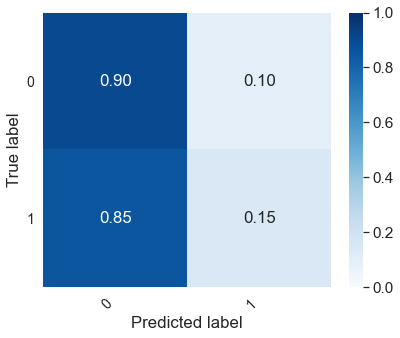
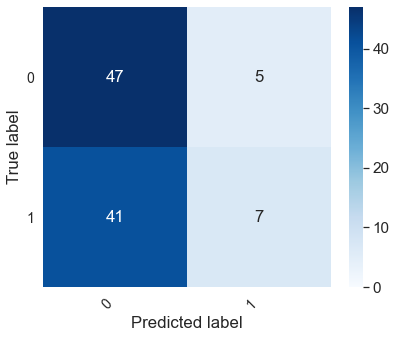
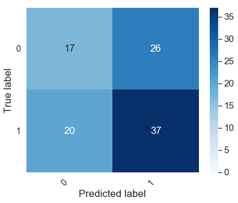

## Results module tutorial

This tutorial shows how to use the results function to generate figures based on the classification results obtained after training a ML model.

Importing modules:


```python
import sys
import numpy as np
from pmtool.GenerateResultBox import GenerateResultBox
```

Generating a random dataset for test purpose representing train and test 'true' labels as well as 'predictions from some model' on test and external test sets:


```python
train_labels = [int(np.round(np.random.uniform(low=0, high=1))) for i in range(100)]
train_predictions = [np.random.uniform(low=0, high=1) for i in range(100)]
test_labels = [int(np.round(np.random.uniform(low=0, high=1))) for i in range(50)]
test_predictions = [np.random.uniform(low=0, high=1) for i in range(50)]
external_labels = [int(np.round(np.random.uniform(low=0, high=1))) for i in range(50)]
external_predictions = [np.random.uniform(low=0, high=1) for i in range(50)]
```

Creating the result generation object:


```python
result_generation = GenerateResultBox(train_labels=train_labels, 
                                      train_predictions=train_predictions, 
                                      test_labels=test_labels,
                                      test_predictions=test_predictions,
                                      external_labels=external_labels,
                                      external_predictions=external_predictions)
```

Exploring the scores on train set:


```python
result_generation.get_results("train")
```


<div>
<style scoped>
    .dataframe tbody tr th:only-of-type {
        vertical-align: middle;
    }

    .dataframe tbody tr th {
        vertical-align: top;
    }

    .dataframe thead th {
        text-align: right;
    }
</style>
<table border="1" class="dataframe">
  <thead>
    <tr style="text-align: right;">
      <th></th>
      <th>auc</th>
      <th>balanced accuracy</th>
      <th>precision</th>
      <th>recall</th>
      <th>f1 score</th>
    </tr>
  </thead>
  <tbody>
    <tr>
      <th>train</th>
      <td>0.427173</td>
      <td>0.522236</td>
      <td>0.587302</td>
      <td>0.649123</td>
      <td>0.616667</td>
    </tr>
  </tbody>
</table>
</div>


Printing out the scores with confidence intervals (CI) for the train, test, and external test sets:


```python
result_generation.get_stats_with_ci("train")
```


<div>
<style scoped>
    .dataframe tbody tr th:only-of-type {
        vertical-align: middle;
    }

    .dataframe tbody tr th {
        vertical-align: top;
    }

    .dataframe thead th {
        text-align: right;
    }
</style>
<table border="1" class="dataframe">
  <thead>
    <tr style="text-align: right;">
      <th></th>
      <th>auc</th>
      <th>balanced accuracy</th>
      <th>precision</th>
      <th>recall</th>
      <th>f1 score</th>
    </tr>
  </thead>
  <tbody>
    <tr>
      <th>train</th>
      <td>0.43 CI [0.31,0.54]</td>
      <td>0.52 CI [0.43,0.62]</td>
      <td>0.59 CI [0.47,0.71]</td>
      <td>0.65 CI [0.53,0.78]</td>
      <td>0.62 CI [0.51,0.71]</td>
    </tr>
  </tbody>
</table>
</div>


```python
result_generation.get_stats_with_ci("test")
```


<div>
<style scoped>
    .dataframe tbody tr th:only-of-type {
        vertical-align: middle;
    }

    .dataframe tbody tr th {
        vertical-align: top;
    }

    .dataframe thead th {
        text-align: right;
    }
</style>
<table border="1" class="dataframe">
  <thead>
    <tr style="text-align: right;">
      <th></th>
      <th>auc</th>
      <th>balanced accuracy</th>
      <th>precision</th>
      <th>recall</th>
      <th>f1 score</th>
    </tr>
  </thead>
  <tbody>
    <tr>
      <th>test</th>
      <td>0.55 CI [0.38,0.71]</td>
      <td>0.52 CI [0.39,0.64]</td>
      <td>0.56 CI [0.40,0.70]</td>
      <td>0.74 CI [0.56,0.90]</td>
      <td>0.63 CI [0.47,0.76]</td>
    </tr>
  </tbody>
</table>
</div>


```python
result_generation.get_stats_with_ci("external")
```


<div>
<style scoped>
    .dataframe tbody tr th:only-of-type {
        vertical-align: middle;
    }

    .dataframe tbody tr th {
        vertical-align: top;
    }

    .dataframe thead th {
        text-align: right;
    }
</style>
<table border="1" class="dataframe">
  <thead>
    <tr style="text-align: right;">
      <th></th>
      <th>auc</th>
      <th>balanced accuracy</th>
      <th>precision</th>
      <th>recall</th>
      <th>f1 score</th>
    </tr>
  </thead>
  <tbody>
    <tr>
      <th>external</th>
      <td>0.46 CI [0.30,0.63]</td>
      <td>0.47 CI [0.38,0.57]</td>
      <td>0.43 CI [0.00,0.80]</td>
      <td>0.12 CI [0.00,0.26]</td>
      <td>0.18 CI [0.00,0.36]</td>
    </tr>
  </tbody>
</table>
</div>


Testing different functionalities of the confusion matrix generation:


```python
fig_train = result_generation.print_confusion_matrix("train",["0","1"])
```

    Normalized confusion matrix
    


    

    


```python
fig_train = result_generation.print_confusion_matrix("train",["0","1"],normalize=False)
```

    Confusion matrix, without normalization
    


    

    


```python
fig_train = result_generation.print_confusion_matrix("train",["0","1"],
                                                     normalize=False,
                                                     save_fig=True)
```

    Confusion matrix, without normalization
    


    

    


Plotting the ROC curves on the 3 sets (train, test, external test):


```python
result_generation.plot_roc_auc_ci(title ="testing roc curve function")
```


    

    


    'testing roc curve function done'


